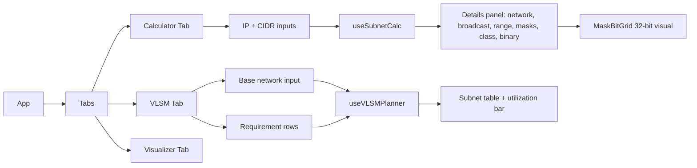

# Architecture — Subnet Mask Calculator & VLSM Planner

**Version:** 1.0 · **Date:** 2026-09-08 · **Status:** Draft for implementation

---

## 1. Overview

A fast, offline-capable, client-only web application that lets network students and engineers:

1. **Calculate** subnet details from any IPv4 address + mask/CIDR (network, broadcast, wildcard, host range, capacity, class, private/public).
2. **Plan VLSM** (Variable Length Subnet Masking): enter a base network and a list of host requirements; the app allocates optimally-sized subnets in descending order with zero overlap.
3. **Visualize** the address space (bit-level mask grid + subnet list) to learn how subnetting works.

Everything runs in the browser — no backend, no database, no network calls.

### Non-goals (v1)

- IPv6 calculation (reserved for v2 — data model is designed to allow it).
- Multi-user / persistence server. (Optional browser localStorage only.)
- Routing-protocol simulation.

---

## 2. Tech Stack

| Layer | Choice | Rationale |
|---|---|---|
| UI | **React 18 + TypeScript** | Component model fits calculator panels; TS protects the math-heavy domain logic. |
| Build | **Vite** | Instant dev server, zero-config TS. |
| Styling | **Tailwind CSS** | Fast, consistent utility styling for panels/tables. |
| State | **React hooks + Context** (no Redux) | App state is small and local. |
| Tests | **Vitest** | Shares the Vite pipeline; ideal for pure-function math tests. |
| Deploy | Static hosting (GitHub Pages / Netlify / any web server) | Pure SPA output of `dist/`. |

---

## 3. High-Level Architecture

```mermaid
flowchart TD
    subgraph Presentation
        UI[React Components<br/>Calculator · VLSM Planner · Bit Grid]
    end
    subgraph Application
        HOOKS[Custom Hooks<br/>useSubnetCalc · useVLSM]
        STATE[App State<br/>React Context]
    end
    subgraph Domain "Pure TypeScript (no framework imports)"
        PARSER[ipParser<br/>validate · parse]
        CORE[ipCore<br/>math · conversions]
        VLSM[vlsmPlanner<br/>allocation engine]
        FMT[formatter<br/>display strings]
    end

    UI --> HOOKS --> PARSER --> CORE
    HOOKS --> VLSM --> CORE
    HOOKS --> FMT
    HOOKS --> STATE
    STATE --> UI
```

**Key principle:** the `domain/` layer is 100% pure, framework-free, deterministic functions with full unit-test coverage. UI and state merely orchestrate it.

---

## 4. Folder Structure

```
subnet-vlsm-planner/
├── index.html
├── package.json
├── vite.config.ts
├── tailwind.config.js
├── architecture.md
├── public/
└── src/
    ├── main.tsx
    ├── App.tsx
    ├── types/
    │   └── ip.ts                 # IPv4Address, SubnetInfo, VLSMRequest, VLSMSubnet...
    ├── domain/                   # ← pure logic, zero UI imports
    │   ├── ipParser.ts           # string → IPv4Address | ValidationError
    │   ├── ipCore.ts             # bitwise math, CIDR <-> mask, ranges, capacity
    │   ├── vlsmPlanner.ts        # VLSM allocation algorithm
    │   └── formatter.ts          # numbers, binary, hex, human-readable output
    ├── hooks/
    │   ├── useSubnetCalc.ts
    │   └── useVLSMPlanner.ts
    ├── state/
    │   └── AppContext.tsx
    ├── components/
    │   ├── common/               # Input, Button, Card, ErrorBanner
    │   ├── calculator/           # CalculatorForm, SubnetDetailsPanel
    │   ├── vlsm/                 # RequirementTable, VLSMResultTable
    │   └── visualizer/           # MaskBitGrid, SubnetBar
    └── utils/
        └── localStorage.ts
```

---

## 5. Domain Data Model (`src/types/ip.ts`)

```ts
export interface IPv4Address { value: number }        // unsigned 32-bit integer

export interface SubnetInfo {
  input: { ip: string; cidr: number };                // e.g. "192.168.10.77", /26
  network: string;                                    // 192.168.10.64
  broadcast: string;                                  // 192.168.10.127
  firstHost: string;                                  // 192.168.10.65
  lastHost: string;                                   // 192.168.10.126
  subnetMask: string;                                 // 255.255.255.192
  wildcardMask: string;                               // 0.0.0.63
  cidr: number;                                       // 26
  totalAddresses: number;                             // 64
  usableHosts: number;                                // 62
  ipClass: "A" | "B" | "C" | "D" | "E";
  isPrivate: boolean;                                 // RFC 1918
  binaryMask: string;                                 // 11111111.11111111.11111111.11000000
}

export interface VLSMRequirement { id: string; name: string; hosts: number; }

export interface VLSMSubnet {
  name: string; hostsNeeded: number; hostsAllocated: number;
  network: string; mask: string; cidr: number;
  broadcast: string; firstHost: string; lastHost: string;
  utilization: number;                                // hostsNeeded / hostsAllocated %
}

export type Result<T, E> = { ok: true; value: T } | { ok: false; error: E };
```

> `Result`-style returns keep error handling explicit — the UI never gets thrown exceptions from the domain.

---

## 6. Module Responsibilities

### 6.1 `ipParser.ts`
- `parseIPv4(s: string): Result<IPv4Address, string>` — 4 dotted decimal octets, 0–255, no leading garbage; trims whitespace.
- `parseCidr(s: string): Result<number, string>` — integer 0–32.
- Rejects e.g. `256.1.1.1`, `10.0.0`, `10.0.0.1.1`, empty strings.

### 6.2 `ipCore.ts` (the mathematical heart)
- Conversions: `ipToNumber`, `numberToIp`, `maskToCidr`, `cidrToMask`, `cidrToWildcard`.
- `networkOf(ip, cidr)` = `ip & (0xFFFFFFFF << (32 - cidr)) >>> 0`
- `broadcastOf(ip, cidr)` = `network | (0xFFFFFFFF >>> cidr)`
- `firstHost` / `lastHost` — special-case `/31` (RFC 3021: both addresses usable) and `/32` (single host).
- `capacity(cidr)` → total & usable addresses (`2^(32-cidr)`, `max(usable, 2) - 2` for normal masks).
- `classify(ip)` → A/B/C/D/E from first-octet ranges; `isPrivate(ip)` → RFC 1918 blocks (10/8, 172.16/12, 192.168/16) + loopback/APIPA.
- **Hosts required → smallest CIDR:** `cidrForHosts(n) = clamp(32 - ceil(log2(n + 2)), 0, 32)` — accounts for network + broadcast addresses.
- All arithmetic uses `>>> 0` to force unsigned 32-bit semantics (JavaScript `&`/`|` are signed).

### 6.3 `vlsmPlanner.ts` — allocation engine

```
Algorithm (classic descending VLSM):
1. Sort requirements by hostsNeeded DESC (stable — ties keep input order).
2. current ← baseNetworkAddress.
3. For each requirement r (largest → smallest):
     a. cidr  ← cidrForHosts(r.hosts)
     b. size  ← 2^(32 - cidr)
     c. if cidr < baseCidr            → FAIL "exceeds base network"
     d. if current % size ≠ 0         → align: current ← next multiple of size
                                         (gap recorded as unallocated space)
     e. if current + size > baseEnd+1 → FAIL "not enough space"
     f. emit subnet(current, cidr, r.name); current ← current + size
4. Return: subnets, total used %, wasted %, leftover range.
```

- Output preserves the *sorted* order (this is the industry-standard presentation) but tags each row with the original requirement name.
- A `breakdown` array explains any failure (`which requirement didn't fit and why`) — critical for a learning tool.

### 6.4 `formatter.ts`
- Dotted binary mask, hex IP, thousands separators, utilization %, and the row model consumed by result tables.

---

## 7. Application Layer

### 7.1 `useSubnetCalc.ts`
Holds `{ ipInput, cidrInput }` as strings; re-derives `SubnetInfo | ValidationError` with `useMemo` on every change (live calculation, no submit button). Debounce not needed — math is microseconds.

### 7.2 `useVLSMPlanner.ts`
Holds `baseNetwork` (ip + cidr) and the editable requirement list (add/remove/edit rows). `useMemo` runs `vlsmPlanner` and yields `VLSMSubnet[] | breakdown of failures`.

### 7.3 `AppContext.tsx`
- Current tab (Calculator | VLSM | Visualizer), theme, and "example loader" presets.
- Persists last inputs to `localStorage` (`utils/localStorage.ts`, try/catch-guarded) so a refresh restores your session.

---

## 8. UI Components & Flow



- **CalculatorForm:** single-line IP input + CIDR slider/select (0–32) with instant validation messages.
- **SubnetDetailsPanel:** definition-list grid; copy-to-clipboard per field.
- **MaskBitGrid:** 32 squares colored network-vs-host bits — the main teaching aid.
- **RequirementTable:** editable rows (`name`, `hosts`), with "Add subnet" and sample presets ("Class C office", "Campus /16").
- **VLSMResultTable:** one row per allocated subnet + summary footer (used %, wasted IPs); failure banner names the exact requirement that didn't fit.
- Responsive: panels stack on mobile; tables scroll horizontally.

---

## 9. Validation & Error Handling

| Case | Behavior |
|---|---|
| Invalid IP/CIDR text | Inline red message under field; previous valid result stays visible (greyed). |
| VLSM doesn't fit | Banner: *"Requires 1,046 addresses but base /26 provides 64"* + which requirement. |
| VLSM larger than base | Banner: *"Subnet /24 is larger than base /26"*. |
| `/31`, `/32` | Handled per RFC 3021 / host-route semantics; UI notes the special case. |
| localStorage unavailable (private mode) | Silent no-op — app fully functional in-memory. |

---

## 10. Testing Strategy (Vitest)

- **Domain (exhaustive, ~100% target):**
  - Parser: valid/invalid matrix including boundary octets `0`, `255`.
  - Core: property-based checks — `networkOf(x) ≤ x ≤ broadcastOf(x)`; round-trip `maskToCidr(cidrToMask(n)) === n` for all 33 masks; known-answer tests (`192.168.10.77/26` → `.64/.127/62 hosts`).
  - VLSM: golden scenarios — exact fit, misaligned start, "doesn't fit" failure, single-requirement, `/31` edge; **overlap assertion**: no two output ranges intersect.
- **Hooks/components:** light tests via Testing Library (validation messages render; table rows = requirements count).

```
npm run test        # watch mode      npm run test -- --run    # CI mode
npm run typecheck   # tsc --noEmit    npm run build            # prod bundle
```

---

## 11. Build & Deployment

- `npm run build` → static `dist/` (hashed assets).
- Deploy anywhere static: GitHub Pages, Netlify, Vercel, Nginx, or an offline classroom file server. No server runtime, no secrets, no env vars.
- Performance: bundle is tiny (<200 KB gzip); calculations are synchronous and instant.

---

## 12. Future Extensions (v2+)

1. **IPv6 support** — extend parser/core with `bigint` addressing; same UI patterns.
2. **Export** — copy table as CSV / Markdown; printable planning sheet.
3. **Share links** — encode inputs in the URL hash (`#/vlsm?base=…&req=…`) for homework sharing.
4. **Supernetting / route summarization** tool — natural sibling of VLSM.
5. **PWA** — installable, works fully offline in the classroom.
