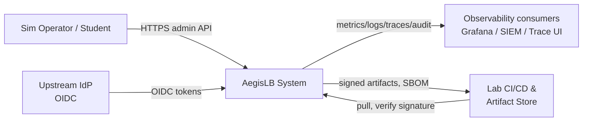
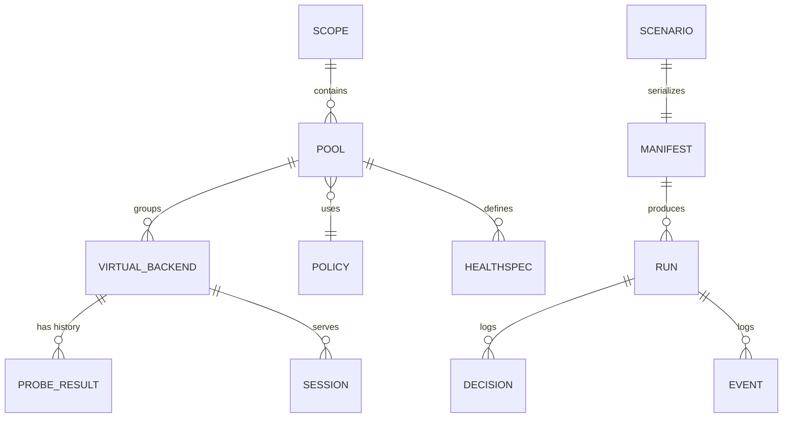
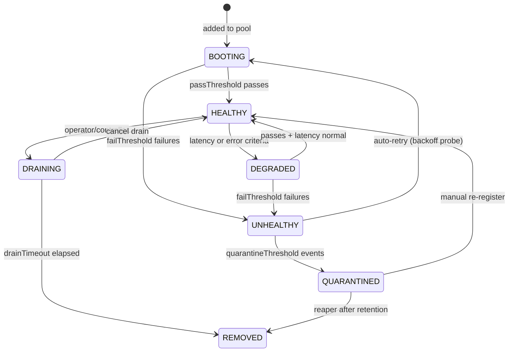
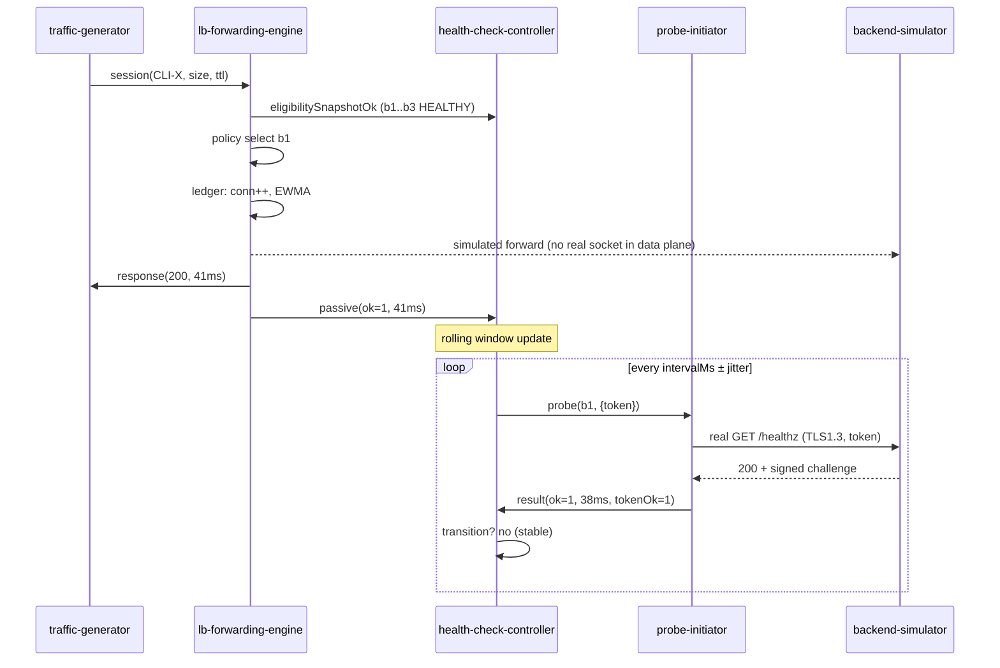

# AegisLB — Security-Hardened Load Balancer Simulator with Health Checks

**System Architecture Document**

| Attribute | Value |
|---|---|
| Document ID | AEGIS-LB-ARCH-001 |
| Version | 1.0 |
| Classification | Internal — Export Controlled (simulated data only) |
| Date | 2026-09-17 |
| Author | Principal Distributed Systems & Security Architect |
| Status | Approved for Design Review |
| Reviewers | Platform Engineering, SRE, Security Engineering, Audit/Compliance |

---

## Document Control

| Rev | Date | Author | Change Summary |
|---|---|---|---|
| 0.1 | 2026-09-10 | Principal Architect | Initial draft (concept, context, component skeleton) |
| 0.9 | 2026-09-14 | Principal Architect | Full component design, health check engine, threat-informed NFRs |
| 1.0 | 2026-09-17 | Principal Architect | Security-hardening pass, framework traceability, final approval |

Companion documents:
- `02-security-architecture-and-threat-model.md` — security architecture & STRIDE threat model
- `03-framework-traceability.md` — OWASP / NIST 800-207 / NIST 800-53 / ISO 27001:2022 / CSF 2.0 matrices

---

## Table of Contents

1. [Executive Summary](#1-executive-summary)
2. [Purpose, Scope, Goals, Non-Goals](#2-purpose-scope-goals-non-goals)
3. [Design Principles and Security Posture](#3-design-principles-and-security-posture)
4. [Architectural Style and System Context](#4-architectural-style-and-system-context)
5. [Domain Model](#5-domain-model)
6. [Component Design](#6-component-design)
7. [Core Behaviors: Health Check Engine and Forwarding](#7-core-behaviors-health-check-engine-and-forwarding)
8. [Data Flows and Key Scenarios](#8-data-flows-and-key-scenarios)
9. [Interfaces and Network Architecture](#9-interfaces-and-network-architecture)
10. [Data Classification and Retention](#10-data-classification-and-retention)
11. [Observability](#11-observability)
12. [Deployment Topologies](#12-deployment-topologies)
13. [Non-Functional Requirements and Acceptance Criteria](#13-non-functional-requirements-and-acceptance-criteria)
14. [Development Lifecycle and DevSecOps Gates](#14-development-lifecycle-and-devsecops-gates)
15. [Risks and Dependencies](#15-risks-and-dependencies)
16. [Glossary](#16-glossary)
17. [References](#17-references)

---

## 1. Executive Summary

AegisLB is a **simulation-grade load balancer with a first-class health-check
subsystem**, built to study and teach the *behavioral dynamics* of production
load distribution — health-state oscillation, probe hysteresis, passive
observation, circuit breaking, draining, slow start, and failure injection —
inside a **security envelope modeled on a production zero-trust service mesh**.

The simulator models, rather than performs, traffic forwarding. It produces
behaviorally faithful decisions, timing, connection accounting, and health
transitions that are indistinguishable in *dynamics* from a real LB while
requiring a fraction of the resources and no real backend infrastructure.
It is reproducible (seeded determinism), time-acceleratable, and instrumented
end-to-end.

The architecture is **security-hardened by design** and demonstrates, by
construction and by testable evidence:

- **OWASP Top 10 (2021)** — every category has a concrete, traceable control
  (see `03-framework-traceability.md §2`).
- **NIST SP 800-207 Zero Trust** — workload identities, mTLS, continuous
  verification, policy-decision-point mediation, microsegmentation, and least
  privilege are first-class architecture, not bolt-ons (§6.6, `02` §2).
- **NIST SP 800-53 Rev.5** — 80+ explicitly selected controls with evidence
  pointers (`03` §4).
- **ISO/IEC 27001:2022 Annex A** — control-by-control Statement of
  Applicability (`03` §5).
- **NIST CSF 2.0** — Govern, Identify, Protect, Detect, Respond, Recover are
  each realized in architecture and operating procedures (`03` §6).

### 1.1 At-a-Glance Capability Summary

| Capability | Detail |
|---|---|
| Forwarding policies | Round robin, smooth weighted RR, least connections, least response time (EWMA), power-of-two choices, random, IP hash, consistent hash (ketama) |
| Health checks | Active (TCP, HTTP(S), gRPC) out-of-band probing; passive traffic observation; N-of-M agreement; hysteresis; jittered scheduling; exponential backoff; circuit breaker; slow start; drain/auto-quarantine |
| Failure injection | Backend crash/hang/slow/throttle/CPU-memory pressure profiles; link loss; probe-target poisoning experiments |
| Traffic model | Seedable Poisson / MMPP (burst) arrivals; connection reuse; think time; TLS and cleartext sessions |
| Reproducibility | Deterministic PRNG per scenario; exact scenario replay via run manifest |
| Control plane | Versioned config, RBAC/ABAC admin API, audit log, Telegraf/Prometheus/OTel analogue outputs |
| Security | mTLS everywhere, ephemeral CA, PDP-mediated authz, microsegmentation, secrets via KMS, tamper-evident audit, signed artifacts/SBOM |

---

## 2. Purpose, Scope, Goals, Non-Goals

### 2.1 Purpose

Provide a **technically realistic, security-hardened, evidence-traceable**
reference implementation of a load balancer with health checks, suitable for:
- **Education and training** of SRE/platform/security teams.
- **Experimentation** with LB behavior under fault and adversarial conditions.
- **Design validation** of health-check thresholds, policies, and failover
  logic before operational deployment.
- **Compliance demonstration** that a seemingly "simulator-scale" system can
  meet enterprise security requirements by design.

### 2.2 Scope (In)

- Load-balancing policies and forwarding decision engine (simulated).
- Active and passive health-check subsystem with full state machine.
- Backend pool simulation with failure injection.
- Deterministic synthetic traffic generation.
- Admin API (REST) and configuration/control plane.
- Identity, secrets, policy, and observability infrastructure.
- Deployment topologies (single-node, containerized lab, hybrid).
- Security framework traceability and validation strategy.

### 2.3 Scope (Out / Non-Goals)

- **Not** a network forwarding plane: it does not forward real packets or
  terminate real user traffic. (Fidelity guardrail FG-1.)
- No emulation of hardware, NIC offload, or kernel data paths.
- No support for real external internet exposure in the base topology
  (admin API is bring-your-own-auth; out-of-box network is isolated lab).
- Not a substitute for production load balancers.

### 2.4 Goals (MOE — Measures of Effectiveness)

| # | Goal | Measure |
|---|---|---|
| G1 | Behaviorally realistic LB dynamics | Health-state transitions & distribution skew match analytic expectations within tolerance on reference scenarios (§13 NFR-FIDELITY) |
| G2 | Reproducibility | Same manifest + seed ⇒ byte-identical decision trace |
| G3 | Security by construction | 100% of OWASP Top-10 categories have implemented control w/ test evidence |
| G4 | Zero-trust alignment | All inter-component traffic mTLS; no implicit-trust default |
| G5 | Auditability | Every admin/config action and health transition is audited & tamper-evident |
| G6 | Teachability/documentability | Full traceability matrices to 5 frameworks |

### 2.5 Assumptions

- Simulated data only; no production PII/PHI. Synthetic identities used for
  traffic and logs (data-minimization by design).
- Lab environment with segregated networks; internet exposure only through an
  authenticated, rate-limited bastion/proxy if enabled (off by default).
- Operator and admin identities managed via an upstream IdP (OIDC) or local
  TOTP bootstrap for fully disconnected labs.

---

## 3. Design Principles and Security Posture

### 3.1 Architectural Principles (AP)

| # | Principle | Consequence in AegisLB |
|---|---|---|
| AP-1 | Fidelity over performance | Simulate dynamics faithfully; scale/performance targets are simulate-related (events/s), not Gbps |
| AP-2 | Determinism by default | Seeded PRNG, no wall-clock randomness in decision paths |
| AP-3 | Control plane / data plane separation | Admin API and health controller isolated from forwarding path; data plane never stalls on control plane |
| AP-4 | State machines with hysteresis | All health transitions require thresholds; anti-flap |
| AP-5 | Out-of-band verification | Health is verified independently of user traffic (can't be fooled by "no traffic") |
| AP-6 | Least privilege everywhere | Scoped workload identities; JIT privileged elevation |
| AP-7 | Everything by policy | PDP mediates every authorization decision; no hard-coded allow rules |
| AP-8 | Assume breach | Microsegmentation, encrypted channels, tamper-evident logs, blast-radius limits |
| AP-9 | Security gates in SDLC | Build → scan → attest → release (SBOM signed) |
| AP-10 | Config is code | Versioned, validated, diffable, auditable config objects |

### 3.2 Security Posture Principles (from Zero Trust tenets)

1. **Never trust, always verify** — no implicit trust between components;
   every request authenticated & authorized (PDP).
2. **Continuous verification** — posture, identities, and probe results
   re-verified on schedule and on events.
3. **Limit blast radius** — microsegmentation + auto-quarantine of suspicious
   backends; per-tenant sim "scopes".
4. **Automate defense** — auto-drain, auto-quarantine, alert escalation.
5. **Least privilege** — short-lived creds, per-run-scope tokens.

Derived session-wide security objectives (SO): SO-1 confidentiality,
SO-2 integrity, SO-3 availability (of *simulation correctness*), SO-4
accountability, SO-5 privacy-by-design. These objectives anchor the threat
model in `02` §1.

---

## 4. Architectural Style and System Context

### 4.1 Style

Modular, domain-driven **monolith-first** codebase that deploys either as:

- **(T1) Modular monolith** — all subsystems in one process with enforced
  module boundaries and local RPC interfaces; ideal for dev/education.
- **(T2) Segmented deployment** — same modules packaged as microservices spun
  out of the monolith behind a service mesh with mTLS, NetworkPolicies, and
  per-service identity; ideal for lab-scale zero-trust demonstrations.

This "modular monolith with extrusion path" preserves fidelity of the design
without inheriting irrelevant distributed-systems complexity for the simulator
itself, while still *demonstrating* distributed zero-trust behavior in T2.

### 4.2 System Context (C4-Level 1)



### 4.3 Container View (C4-Level 2)

```mermaid
flowchart TB
  subgraph CP[Control Plane]
    API[admin-api<br/>REST + OIDC]
    CFG[config-service<br/>versioned scenarios]
    HCC[health-check-controller<br/>scheduler/state machine]
    PDP[policy-decision-point]
    VLT[secrets-service<br/>KMS-backed]
    CA[identity-ca<br/>ephemeral SPIFFE CA]
  end
  subgraph DP[Data Plane]
    TG[traffic-generator<br/>seeded workload]
    LBE[lb-forwarding-engine]
    BS[backend-simulator<br/>pool + failure injection]
    DBG[probe-initiator<br/>active probe worker pool]
  end
  subgraph OB[Observability]
    MET[metrics]
    LOG[logs pipeline]
    TRC[traces]
    AUD[audit-service]
    ALT[alerting]
  end
  API --> CFG
  API --> HCC
  HCC --> DBG
  DBG --> BS
  TG --> LBE
  LBE --> BS
  API --> PDP
  PDP --> VLT
  LBE --> MET
  LBE --> TRC
  HCC --> AUD
  API --> AUD
  note[](mTLS on every edge; PDP authorizes every call)
```

> Every edge above is mutually-authenticated (mTLS) and authorized by PDP in
> T2; in T1 the same PDP logic is in-process.

### 4.4 Component Responsibilities (C4-Level 3 extracted)

| Component | Responsibility | Owning module |
|---|---|---|
| `traffic-generator` | Produce synthetic client sessions per scenario manifest | `trafficgen` |
| `lb-forwarding-engine` | Select eligible backend per policy; maintain connection ledger, EWMA latencies, circuit breakers | `forwarding` |
| `backend-simulator` | Emulate server capacity, latency distributions, failure modes; expose probe endpoints enriched with probe-verification tokens | `backends` |
| `health-check-controller` | Own health state machine; schedule active probes; ingest passive observations; emit transitions | `health` |
| `probe-initiator` | Execute probe protocol (TCP/HTTP(S)/gRPC) including authenticating to probe target | `health/probe` |
| `config-service` | Validate, version, diff, and publish scenario configuration | `control/config` |
| `admin-api` | Authenticated/authorized REST surface; rate-limited; CSRF-safe (Bearer, not cookie-first) | `control/api` |
| `identity-ca` | Issuestime-limited workload certs (SPIFFE-style); demo of zero-trust identity | `security/identity` |
| `secrets-service` | KMS-backed encryption key mgmt; per-scope secret injection | `security/secrets` |
| `policy-decision-point` | Attributes-based authorization for every internal/external request | `security/policy` |
| `observability` (MET/LOG/TRC/AUD/ALT) | Metrics, structured logs, traces, tamper-evident audit, alerting | `obs/*` |

---

## 5. Domain Model

### 5.1 Entity-Relationship Overview



### 5.2 Core Entities & Enumerations

**`Scope`** — isolated simulation tenant boundary (identity scope, resource
limits, RBAC role binding, data partition). Zero-trust blast-radius unit.

**`VirtualBackend`**

| Field | Type | Notes |
|---|---|---|
| id | UUID | |
| scopeId | UUID | partitioning |
| name | string | |
| address | string | purely informational (never dialed) |
| protocol | enum | `HTTP/1.1`, `HTTP/2`, `TCP`, `gRPC` |
| capacityCps | int | max concurrent sessions |
| rpsCeiling | int | simulated throughput cap |
| cpuMillis / memMiB | int | per-session resource cost |
| weights | map[poolId]→int | per-pool effective weight (affected by slow start, degradation) |
| status | enum | see §5.3 |
| counters | struct | activeConns, totalSessions, errorCount, lastOkTime … |

**`Pool`** — set of backends + one `policy` + zero or more `HealthSpec`s
(eligibility = all active specs satisfied per agreement rules) + sticky and
slow-start config.

**`HealthSpec`**

| Field | Type | Default | Notes |
|---|---|---|---|
| probeType | enum | `HTTP_GET` | `TCP_CONNECT`, `HTTP_GET`, `HTTPS_GET`, `GRPC_HEALTH` |
| targetPath | string | `/healthz` | for HTTP(S) |
| expectedStatus | int[] | `[200]` | |
| expectedBodyRegex | string | "" | optional body assertion |
| intervalMs | int | 5000 | base period |
| intervalJitterPct | int | 10 | % random phase/jitter to de-synchronize probes |
| timeoutMs | int | 2000 | per-probe deadline |
| initialDelayMs | int | 1000 | after backend add/state change |
| failThreshold | int | 3 | consecutive failures ⇒ UNHEALTHY |
| passThreshold | int | 2 | consecutive passes ⇒ HEALTHY |
| backoffMaxMs | int | 60000 | exp backoff cap after repeated failures |
| graceDegradedLatencyMs | int | 1500 | latency above baseline ⇒ DEGRADED |
| tls | TLSConfig | – | min TLS 1.3 for HTTPS probes |
| expectProbeToken | bool | true | require signed probe token (anti-spoof) |

**`ProbeResult`** — `backendId, ts, ok, latencyMs, httpStatus, errorCode,
verificationTokenOk, probeSourceId`.

**`LoadBalancingPolicy`** — enum + parameters: `ROUND_ROBIN`,
`WEIGHTED_ROUND_ROBIN`, `LEAST_CONNECTIONS`, `LEAST_RESPONSE_TIME`,
`POWER_OF_TWO_CHOICES`, `RANDOM`, `IP_HASH`, `CONSISTENT_HASH` (vnodes=256).

**`TrafficProfile`** — arrival model: `POISSON` (μ rps), `MMPP` (Markov-modulated
burst; state transition matrix, low/high rates), `CONSTANT`; think time
distribution; connection reuse ratio; session token length; TLS ratio.

**`Scenario / Manifest`** — immutable, schema-versioned, digest-signed
specification of scope, pools, backends, health specs, policies, traffic
profiles, failure-injection timeline, and run params (seed, speed factor).

**`Run`** — one execution of a manifest; owns the seeded RNG stream, decision
trace, event log, and summary report.

### 5.3 Backend Lifecycle State Machine



Rules:
- **Eligibility for rotation**: `HEALTHY` or `DEGRADED` (with weight penalty).
- **DRAINING**: accepts existing sessions, no new sessions (default drain
  timeout 30 s). On expiry → REMOVED.
- **QUARANTINED**: excluded for escalating analysis; requires operator action
  or scenario rule to re-register.
- All transitions are events → written to `audit-service` and `event log`.

### 5.4 Circuit Breaker per Backend

```mermaid
stateDiagram-v2
  [*] --> CLOSED
  CLOSED --> OPEN: errRate>50% over window OR 5 consecutive failures
  OPEN --> HALF_OPEN: cooldown elapsed; allow 1 trial session
  HALF_OPEN --> CLOSED: trial success
  HALF_OPEN --> OPEN: trial failure (re-arm cooldown)
```



### 5.5 Data Model Safety

- All config/state validated against JSON-Schema; strict reject-on-unknown.
- All IDs UUIDs; no sequential enumerables in API surfaces.
- Audit references docs: every admin call stores requested action, principal,
  target object hash-before/after.

---

## 6. Component Design

### 6.1 Traffic Generator (`trafficgen`)

- Reads `TrafficProfile` from manifest; uses **scoped seeded RNG** derived from
  run seed + scope digest ⇒ per-run reproducibility.
- Emits session descriptors `(srcToken, protocol, sizeBytes, thinkTime)` at
  scheduled times (Poisson/MMPP).
- Session **tokens are synthetic** (e.g., `CLI-<derived-pseudonym>`) — no PII
  by construction (privacy-by-design).
- Has a **poison capability** switch: emits deliberately malformed session
  descriptors to exercise input-validation & fail-closed behavior (feeds
  OWASP A03 tests).
- Internal: bounded in-memory queue (backpressure); never blocks the clock on
  consumer slowness (data-plane isolation, AP-3).

### 6.2 LB Forwarding Engine (`forwarding`)

**Decision path** for each session:
1. Resolve pool by scope + listener label.
2. Sticky-session lookup (IP-hash or token to last backend if still eligible).
3. Query **eligibility set** = backends in `HEALTHY|DEGRADED`, not circuit-
   open, not over capacity.
4. Apply `policy` to eligible set → select backend (and choose 2 for
   `POWER_OF_TWO_CHOICES`).
5. Simulate forwarding: consume connection slot, compute simulated latency
   (backend latency model + queueing), update ledger metrics, emit decision
   trace + span.
6. On simulated response: record passive observation `(ok, latencyMs,
   statusClass)` for `health` subsystem; update EWMA RTT; release slot.

**Policy semantics (normative)**:

| Policy | Selection | Notes |
|---|---|---|
| ROUND_ROBIN | next index in eligible ring | no weighting |
| WEIGHTED_ROUND_ROBIN | Smooth Weighted RR (nginx-style) | weights from pool; slow-start ramps effective weight |
| LEAST_CONNECTIONS | min(activeConns/capacityCps) | tie → epoch-ordered RR |
| LEAST_RESPONSE_TIME | min(EWMA RTT) | EWMA α=0.125 configurable |
| POWER_OF_TWO_CHOICES | min of 2 random eligible candidates | reduces hot-spots |
| RANDOM | uniform among eligible | seeded |
| IP_HASH | hash(srcToken) % eligibleSize | stable only while eligible set stable |
| CONSISTENT_HASH | ketama ring (vnodes=256) | minimizes reshuffle on backend change |

Capability checks (fail-closed): if eligible set empty ⇒ session rejected with
`503 SIM_SERVICE_UNAVAILABLE` + counter+log (not silently dropped).

### 6.3 Backend Simulator (`backends`)

- Each `VirtualBackend` runs a lightweight **worker model**: an event-loop
  consuming connection slots against `capacityCps`, each with:
  - base service time (configurable distribution `FIXED|EXP|NORMAL|PARETO`),
  - jitter/throttle profile,
  - failure profile.
- **Failure-injection profiles** (activate by scenario timeline or ad hoc):
  - `CRASH` — hard-unavailable (probe TCP + HTTP fail) ⇒ induces UNHEALTHY.
  - `LAG` — response latency inflated (e.g., ×20) while probe endpoint
    unaffected ⇒ designed to show *active-probe pass / passive-detection
    degrade* divergence.
  - `SLOW_CPU` / `MEM_PRESSURE` — capacity lowered, rps ceiling cut ⇒ loadshed
    503s; distinct from hard failure.
  - `PROBE_NO_TOKEN` — probe-response verification token missing ⇒ treated as
    failure (anti-spoof demonstration; feeds A01/A03 narratives).
  - `FLAP` — Markov toggling health ⇒ exercises hysteresis thresholds.
- **Probe endpoints** (`/healthz`, gRPC v1 health) are *simulated but
  protocol-real*: the simulator actually serves them over localhost (TCP mode)
  so probe semantics (connect/timeouts/TLS/handshake) are exercised for real
  in the probe-initiator, while *data-plane* sessions remain simulated.
- Isolation: each backend worker in its own goroutine/task; resource caps
  (CPU quota, memory) enforced with OS-level limits in T2; watchdog kills
  wedged workers that exceed `LAG` maximums (fail-closed).

### 6.4 Health-Check Controller (`health`)

The heart of the system; **requires** `probing state machine` (§7.2) and
`passive ingestion` (§7.3). Responsibilities:

- **Schedule probes**: per-health-spec, per-backend, on interval with jitter;
  expp backoff when UNHEALTHY (min interval honored to avoid probe storms).
- **Defeater of synchronized probing**: phase randomization on start and after
  topology changes (anti-thundering-herd).
- **Evaluate transitions** using counters and agreements (§7.2.3).
- **Emit** state-transition events, audit records, metrics; push state to
  forwarding engine's eligibility view via an async, ordered channel
  (eventual, bounded; data plane reads latest snapshot — never blocks).
- **Self-protection**: controller monitors its own scheduler drift; if probe
  cadence falls behind schedule > 2× interval, raises `PROBE_BACKLOG` alert
  and rebalances its worker pool.
- **Pause/resume** semantics for scenario control ("freeze health" for
  deterministic demos).

### 6.5 Admin API & Control Plane (`control/api`, `control/config`)

**REST surface (versioned, `/api/v1/`)**:

| Endpoint | Method | Purpose | AuthZ |
|---|---|---|---|
| `/api/v1/scopes` | CRUD | tenant scopes | `scope:admin` |
| `/api/v1/scopes/{id}/pools` | CRUD | pool defs | `scope:config` |
| `/api/v1/scopes/{id}/backends` | CRUD | backend defs | `scope:config` |
| `/api/v1/scopes/{id}/health-specs` | CRUD | probe configs | `scope:config` |
| `/api/v1/scopes/{id}/runs` | POST/GET | start & inspect runs | `scope:run` |
| `/api/v1/scopes/{id}/failures` | POST | inject failure profile | `scope:config`+`scope:run` |
| `/api/v1/scopes/{id}/backends/{b}/state` | PATCH | manual drain/re-register | `scope:ops` |
| `/api/v1/audit` | GET | tamper-proof audit query | `audit:read` |
| `/api/v1/healthz`, `/api/v1/readyz` | GET | self-health (liveness/readiness) | unauthenticated intent but rate-limited |
| `/api/v1/metrics` | GET | Prometheus exposition | `metrics:read` (or sidecar) |

**Config pipeline**: `manifest → validate (schema+semantic, incl. conflict
checks) → digest (SHA-256) → sign (Ed25519, CI key) → version → publish →
audit`. No unvalidated file is ever loaded (A03/A08 controls).

**Self-checks**: admin-api runs self-health (`/healthz`), targets internal
probe semantics; alerting consumes controller drift.

### 6.6 Identity, Secrets, Policy (`security/*`)

- **`identity-ca`**: ephemeral root + leaf workload certs (SPIFFE-style
  `spiffe://aegis-lb/<scope>/svc/<component>`), 24 h max validity, auto-rotate.
  Identity = principal for all mTLS and authz.
- **`secrets-service`**: KMS-backed envelope for data at rest; per-scope keys;
  key rotation (30-day demo / configurable); no plaintext secrets in config/
  env beyond bootstrap (A02, A07).
- **`policy-decision-point`**: attribute-based decisions
  `(principal, action, resource, scope, postureSigned, runState) → allow|deny`.
  Deny-by-default; every internal and admin call goes through it (in-process
  in T1, service in T2). Decisions cached ≤60 s; posture changes invalidate.

### 6.7 Observability Stack (`obs/*`)

See §11 for the catalogs. Components: metrics registry, structured JSON log
pipe with content policies, OpenTelemetry traces (span per session + probe),
append-only audit ledger (hash-chained), threshold & anomaly alerting.

---

## 7. Core Behaviors: Health Check Engine and Forwarding

### 7.1 Design Intent

The health subsystem must be **realistic**, **anti-fragile** (no flapping), and
**adversarially robust** (cannot be easily fooled). Three mutually reinforcing
observation channels:

1. **Active probes** — scheduled, out-of-band, authenticated.
2. **Passive observation** — derived from simulated traffic results
   (error rate + p95 latency over a rolling window).
3. **Agreement policy** — N-of-M over multiple health specs/sources before the
   *system* acts on degraded health (protects against a single poisoned probe).

### 7.2 Active Probing

#### 7.2.1 Protocol semantics

| Type | What is validated | Failure modes modeled |
|---|---|---|
| TCP_CONNECT | connect ≤ timeout | refusals, blackholes, SYN-sink |
| HTTP_GET / HTTPS_GET | connect + status in expected set (+ body regex) | 5xx, timeout, TLS handshake fail |
| GRPC_HEALTH | `grpc.health.v1.Health/Check` returns SERVING | UNKNOWN/SERVING, unary timeout |

HTTPS probes require TLS≥1.3 and pin a **per-backend probe identity** (the
probe token), i.e., backend must answer a challenge signed by the health-check
controller's ephemeral key. This is the *anti-spoof* measure referenced in
failure profile `PROBE_NO_TOKEN`.

#### 7.2.2 Counters and thresholds (with hysteresis)

- Failures are *consecutive* (or *within* a sliding window, selected per
  spec). Consecutive is default (deterministic, teachable).
- Hysteresis: `failThreshold=3` to leave HEALTHY, `passThreshold=2` to
  recover ⇒ prevents single-probe flapping. Numeric defaults above.
- Exp backoff on UNHEALTHY: `interval×2^attempts` capped at `backoffMaxMs`,
  jittered; ensures a crashed backend doesn't create probe chatter, and
  recovery is detected quickly via the half-open-like "trial probe".

#### 7.2.3 N-of-M agreement

For pools with multiple health specs (or multiple probe sources), the
transition decision uses **weighted agreement**: a backend is UNHEALTHY when
`round(failCount/totalChecks in window) ≥ minHealthyRatio` disagreed;
default minHealthyRatio = 0.5 with ≥2 sources. This models real topologies
(e.g., two ingress LBs disagreeing) and bounds the blast radius of a single
compromised/poisoned probe source. **Always ≥2 sources in for the 
"verified" state** when `requireVerified=true` (default) — a single source
alone can mark UNHEALTHY but **cannot** unilaterally *recover* a backend to
HEALTHY (conservative recovery).

### 7.3 Passive Observation / Slow-Lane detection

- Rolling window (default last 50 completed sessions, min 10) over passive
  results:
  - `errorRate = errors / completed`; threshold default 50%
  - `p95Latency` vs baseline (EWMA × `graceDegradedLatencyMs` margin)
- Triggers:
  - errorRate ≥ threshold ⇒ mark DEGRADED → (escalate to UNHEALTHY after
    `failThreshold`).
  - p95 latency breach ⇒ `DEGRADED` (weight penalty −50%) without hard
    removal (mirrors real "slow lane" behavior).
- Passive channel is **advisory**: it can downgrade, never permanently
  evicts (operator/audit required for REMOVED).

### 7.4 Slow Start and Drain

- **Slow start**: HEALTHY(DEGRADED→HEALTHY, or BOOTING→HEALTHY) backends ramp
  effective weight from 10%→100% over `warmUpSeconds` (default 30 s) linearly.
  Prevents connection-stampede and skewed warmup distributions; applies to
  weighted policies and least-connections (capacity multiplier).
- **Drain**: `DRAINING` state accepts existing sessions; new sessions
  rejected ⇒ 503 from LB (counted, not silent). Drain timer default 30 s;
  timer expiry → REMOVED. Manual cancel allowed.

### 7.5 Anti-flap & Determinism Guarantees

- Hysteresis (above) plus `minStateHoldMs` (default 2 s) prevents rapid
  oscillation even under FLAP injection.
- Transition decisions are pure functions of counters/events (deterministic
  given same event order). Event ordering is stable per run seed.

### 7.6 Forwarding decision trace example

```text
run=9f2c… seed=0xA1B2 t=12.340s session=CLI-7F3A pool=checkout policy=LEAST_CONNECTIONS
  eligible=[b3(12), b1(9), b7(15)]  ← b2=UNHEALTHY excluded, b5=DRAINING excluded
  selected=b1 reason=min_conns(9) sticky=off
  sim_latency=41ms backend_ewma=46ms status=200
  passive: ok=1 errWindowErrRate=0.02 p95=58ms
```

---

## 8. Data Flows and Key Scenarios

### 8.1 Happy-path flow



### 8.2 Failure scenario: backend hangs (LAG)

1. `backends` injects `LAG ×20` into data-plane sessions; probe endpoint
   unaffected.
2. Passive window p95 breaches ⇒ `b1→DEGRADED` (weight−50%).
3. LB keeps serving b1 to a *subset* of sessions (slow lane), others to
   healthy peers — demonstrating the active/passive detection divergence.
4. Controller raises `BACKEND_DEGRADED` alert + audit event.

### 8.3 Failure scenario: backend crash

1. `CRASH` ⇒ probe connect fails ×3 ⇒ `b1→UNHEALTHY`, excluded from rotation.
2. Exp backoff probes continue (BTC bubble), counter grows.
3. On recovery, trial probe passes ×2 ⇒ BOOTING→HEALTHY with slow start.
4. Distribution re-balances; consistent-hash pool reshuffle minimized.

### 8.4 Adversarial scenario: probe-target poisoning

1. Attacker (scenario) tampers probe response to appear healthy while backend
   is actually degraded.
2. Agreement policy (≥2 sources) + passive channel still downgrade the backend
   (DEGRADED), limiting impact.
3. Probe-token verification failure on one source raises
   `PROBE_TOKEN_MISMATCH` alert and marks that probe source suspect.

---

## 9. Interfaces and Network Architecture

### 9.1 Ports/Endpoints Table

| Service | Port | Transport | Bind | AuthN | Notes |
|---|---|---|---|---|---|
| admin-api | 8443 | HTTPS (TLS1.3) | admin net | mTLS + OIDC | rate-limited |
| metrics | 9090 | HTTPS | internal net | workload mTLS | Prometheus analog |
| traces (OTLP) | 4317 | gRPC mTLS | internal | workload mTLS | sampling configured |
| probe-initiator→backends | 8080/8081 | HTTP/HTTPS & gRPC | probe vlan | probe token + TLS | active probes |
| internal RPC | 10000 (mesh) | gRPC mTLS | internal | workload mTLS | T2 only |
| audit collector | 5140 | mTLS | internal | workload mTLS | append-only |

### 9.2 Microsegmentation (T2)

- One namespace per subsystem: `control`, `data`, `obs`, `security`.
- NetworkPolicies **deny-all default**; explicit allow rules:
  `admin-api → {config, health, pdp}`, `health → probe`, `probe → backends`,
  `trafficgen → forwarding`, `forwarding → backends(even-loop sim, allowed)`,
  all `* → observability` (metrics/traces/audit egress only), `obs → egress
  sink`.
- Egress from `backends` to the internet: **denied** (SRF control: the probe
  initiator builds URIs only from configured/vetted host lists, never from
  client input).

### 9.3 Self-checks & readiness

Every component exposes `/healthz` (liveness) and `/readyz` (deps reachable +
no probe backlog + config digest validated). Admin `/healthz` is the
aggregate gate for run orchestration.

---

## 10. Data Classification and Retention

| Data type | Classification | Protection | Retention |
|---|---|---|---|
| Run manifests | Public-internal | signed; integrity-verified | retained per scope policy |
| Simulated traffic descriptors | Internal | no real PII by construction | ephemeral (run lifetime) unless snapshotted for replay w/ anonymize flag |
| Health probe results | Internal | encryption at rest (secrets-service keys) | 90 days default |
| Decision traces | Internal | at-rest AES-256 | 90 days default |
| Audit log | Restricted | hash-chained, WORM storage | 1 year (compliance-driven) |
| Workload certs/keys | Restricted | KMS envelope; never logged | rotated ≤24 h |
| Metrics | Internal (aggregate only, no raw payload data) | at-rest encryption | 180 days |

Privacy-by-design: no real user identifiers; synthetic tokens `CLI-<hex>`; no
content payloads stored; alerts carry sanitized descriptors only.

---

## 11. Observability

### 11.1 Metrics Catalog (selected)

| Metric | Type | Labels | Owner |
|---|---|---|---|
| `aegis_sessions_total` | Counter | `policy,pool,backend,statusClass` | forwarding |
| `aegis_active_connections` | Gauge | `backend,pool` | forwarding |
| `aegis_decision_rejections_total` | Counter | `reason{noEligible,overCap,circuitOpen}` | forwarding |
| `aegis_backend_health_state` | Gauge 0..4 | `backend,state` | health |
| `aegis_probe_results_total` | Counter | `backend,probeType,ok` | health |
| `aegis_probe_latency_ms` | Histogram | `backend` | health |
| `aegis_probe_backlog` | Gauge | – | health (self) |
| `aegis_circuit_breaker_state` | Gauge | `backend` (0,1,2) | forwarding |
| `aegis_pdp_decisions_total` | Counter | `principal,resource,effect` | security |
| `aegis_audit_chain_height` | Gauge | – | audit |
| `aegis_eligible_backend_count` | Gauge | `pool` | forwarding |

### 11.2 Log & Event Structure

- Structured JSON; mandatory fields: `ts, svc, level, traceId, spanId,
  scopeId, runId, eventType, message`.
- Content policy: no secrets/tokens/keys; sanitization function applied at
  emit (A09/A08 controls).
- `eventType`s include `SESSION`, `DECISION`, `PROBE_RESULT`,
  `STATE_TRANSITION`, `FAILURE_INJECTED`, `ADMIN_ACTION`, `AUTHZ_DENIED`,
  `ALERT`.

### 11.3 Audit Service (tamper-evident)

- Append-only ledger; each entry: `hash = H(prev_hash || entry_payload)`.
- Head hash is anchored to the metrics endpoint and periodically to external
  verifier (lab).
- Read API strictly `audit:read`; no update/delete paths exist at API level
  (verification of that is a security test in `02` §9).

### 11.4 Alerting (high-value signals)

| Signal | Condition | Severity |
|---|---|---|
| `P0_PROBE_BACKLOG` | controller cadence > 2× interval | high |
| `P1_BACKEND_DEGRADED` | passive latency breach | medium |
| `P1_BACKEND_UNHEALTHY` | transition to UNHEALTHY | medium |
| `P1_PDP_BURST` | > threshold denials/min | medium |
| `P2_PROBE_TOKEN_MISMATCH` | anti-spoof error | low (investigate) |
| `P0_AUDIT_CHAIN_GAP` | hash chain discontinuity | critical |

---

## 12. Deployment Topologies

### 12.1 T1 — Single-Node Lab / Dev

- One host, one process (modular monolith), loopback interfaces.
- PDP and identity in-process; mTLS still exercised on probe endpoints
  (localhost) for realism.
- `docker compose up` or `make run`; presets: `edu`, `compliance-demo`,
  `red-team-game` (includes attacks in scenarios).

### 12.2 T2 — Segmented Zero-Trust Lab

- Containers (OCI) with signing & SBOM; orchestrator incl. **enforced
  NetworkPolicies** (deny-all) and workload identities (mTLS via SPIFFE).
- Namespaces as §9.2; probe vlan/egress filters enforced.
- Used for: zero-trust demonstration, compliance evidence generation,
  red-team and adversarial scenario execution.

### 12.3 T3 — Distributed/Remote (Optional, lab)

- Controller + observability on a central node; data plane on worker nodes
  with dedicated probe VLANs; still fully simulated (no internet exposure).

### 12.4 Isolation & sandboxing guarantees

- Resource caps (CPU/mem/PIDs) per container; no host filesystem writes
  outside scoped volumes; network restricted to allowed egress; secrets
  mounted ephemeral.

---

## 13. Non-Functional Requirements and Acceptance Criteria

### 13.1 Determinism & Fidelity

| ID | NFR | Acceptance |
|---|---|---|
| F1 | Deterministic replay | same manifest+seed ⇒ identical decision trace (hash compare) |
| F2 | Distribution fidelity | for RR/least-conn with 3 healthy backends, distribution within ±5% of theoretical over 10k sessions, 95% CI coverage |
| F3 | Health-state correctness | CRASH injection ⇒ UNHEALTHY ≤ (failThreshold×interval + timeout + margin); recovery ≤ (backoff max + passThreshold×interval) |
| F4 | Anti-flap | under FLAP injection with threshold defaults, state flips < 4 per 60 s per backend |
| F5 | Probe realism | TCP/HTTP probe protocol exercised against real loopback endpoints (protocol correctness), not mocked |
| F6 | Slow-start & drain semantics | weight ramp linear; drain rejects new sessions after t<1 interval; existing sessions served until timeout |

### 13.2 Scale (Simulation Throughput)

| ID | NFR | Acceptance |
|---|---|---|
| S1 | Sandbox scale | ≥ 50k simulated sessions/s single node (rps model, decision-only) |
| S2 | Backend pool size | up to 1,000 virtual backends/pool; 64 pools/scope |
| S3 | Probe flogradu | up to 10k probes/min across pools w/o backlog alert |

### 13.3 Security NFRs (subset; full set in `02` §8)

| ID | NFR |
|---|---|
| SEC-1 | All cross-component calls require valid workload identity (mTLS) — T2 enforced; T1 in-process PDP |
| SEC-2 | Admin API: logout/rotate sessions; BruteForceProtection ≥5 tries; Bearer tokens ≥256-bit, TTL ≤30 min |
| SEC-3 | No plaintext secrets in artifacts, logs, or config (grep-based test gate) |
| SEC-4 | Input validation: 100% of admin API inputs validated by schema; rejection is fail-closed (counted & logged) |
| SEC-5 | All external admin API responses carry no stack traces; structured error codes only |
| SEC-6 | Audit log tamper-evidence: any manual/API mutation attempt detected within 1 interval |
| SEC-7 | TLS ≥1.3 only; ciphers observed via test to be within NIST-allowable suite |
| SEC-8 | Dependency/SCA: zero critical CVEs at release; fixed releases within SLA |

### 13.4 Availability/Operability

| ID | NFR |
|---|---|
| A1 | 99.9% uptime during runs (orchestrator-level), with healthy replicas |
| A2 | Config update hot-apply ≤ 1 s without stopping run (data plane unaffected) |
| A3 | Observability 100% of events emitted; ≤0.1% loss on planned scenarios |

---

## 14. Development Lifecycle and DevSecOps Gates

```text
design → threat model (STRIDE) → secure coding → [SAST | SCA | secrets scan]
      → unit+property tests → DAST/API fuzz → image build+solid sign → SBOM
      → container scan (Trivy) → compliance evidence gen → release (signed tag)
```

Gates (all required, blocking):
1. **Threat model updated** per change (STRIDE replay).
2. **SAST** zero *high* findings; **SCA** zero resolvable criticals.
3. **Secrets scan** clean (gitleaks).
4. **DAST/API fuzz** (OWASP ZAP, RESTful fuzz) no unaccepted findings.
5. **Supply chain**: image digest signatures verified; SBOM (SPDX/CycloneDX)
   published per release; reproducible builds (hermetic) with pinned toolchain.
6. **Compliance evidence**: regenerated traceability matrix pointing at test
   results (not at documents only).
7. **Apex scenario suite** (see `03` §7) passes green in CI.

Change management: config/schema changes versioned; peer-reviewed PRs;
separation of duties for admin actions (`ops` vs `config` vs `read`).

---

## 15. Risks and Dependencies

| # | Risk | Mitigation | Owner |
|---|---|---|---|
| R1 | Simulation fidelity vs. realism drift | scenario reference suite + analytic cross-checks (F2/F3) in CI | Platform |
| R2 | Zero-trust features increase demo complexity | T1 (single node) default; T2 step-up guides | Platform |
| R3 | Audit chain breakage in stop/restart | anchor head hash to durable store; restart-tolerant chain | Security |
| R4 | Dependency supply-chain risk | pinned+SBOM+signature+scan pipeline | Security |
| R5 | OSS/Prometheus ecosystem churn | vendor-neutral metric formats; adapters isolated | Platform |

Dependencies: OCI runtime, orchestrator (k8s option), OpenTelemetry SDKs,
Prometheus-compatible registry, SPIFFE/SPIRE or equivalent for T2 — all
standard, mature components (A06: patched & SCA-scanned).

---

## 16. Glossary

| Term | Meaning |
|---|---|
| Eligibility set | Backends currently allowed to receive new sessions |
| Hysteresis | Different thresholds for entering vs. leaving a state (anti-flap) |
| N-of-M agreement | Consensus policy over multiple health sources |
| Slow lane | DEGRADED backend receiving reduced weight |
| Slow start | Gradual weight ramp after recovery/regstration |
| MMPP | Markov-Modulated Poisson Process (bursty arrivals) |
| PDP | Policy Decision Point |
| SLO | Service-Level Objective (used for passive detection) |
| WORM | Write-Once-Read-Many (audit storage semantics) |

---

## 17. References

1. NIST SP 800-207, *Zero Trust Architecture*, Aug 2018 (updated 2020).
2. NIST SP 800-53 Rev.5, *Security and Privacy Controls for IS and Orgs*.
3. NIST CSF 2.0, *Cybersecurity Framework*, Feb 2024.
4. ISO/IEC 27001:2022 + Annex A (93 controls).
5. OWASP Top 10 (2021) — A01..A10.
6. nginx upstream & hysteresis docs (behavioral baselines for policies/probing).
7. Envoy/Consul agent docs (probe-algorithm semantics used as reference).