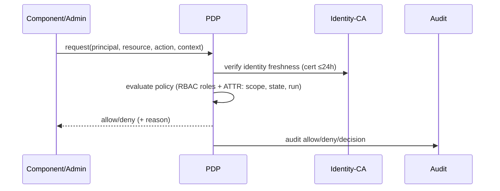

# AegisLB — Security Architecture and Threat Model

**Security Design Document**

| Attribute | Value |
|---|---|
| Document ID | AEGIS-LB-SEC-002 |
| Version | 1.0 |
| Classification | Restricted — Internal |
| Date | 2026-09-17 |
| Author | Principal Distributed Systems & Security Architect |

**Related**: `01-load-balancer-simulator-architecture.md` (system design),
`03-framework-traceability.md` (regulatory matrices).

---

## Table of Contents

1. [Security Objectives and Threat Landscape](#1-security-objectives-and-threat-landscape)
2. [Zero Trust Design (NIST SP 800-207)](#2-zero-trust-design-nist-sp-800-207)
3. [STRIDE Threat Model](#3-stride-threat-model)
4. [Attack Narratives and Mitigations](#4-attack-narratives-and-mitigations)
5. [Identity and Access Management](#5-identity-and-access-management)
6. [Cryptography and Key Management](#6-cryptography-and-key-management)
7. [Network Architecture and Microsegmentation](#7-network-architecture-and-microsegmentation)
8. [Security-Focused NFRs and Verification](#8-security-focused-nfrs-and-verification)
9. [Security Testing Strategy](#9-security-testing-strategy)
10. [Incident Response and Recovery](#10-incident-response-and-recovery)
11. [Glossary](#11-glossary)

---

## 1. Security Objectives and Threat Landscape

### 1.1 Security Objectives (SO)

| ID | Objective | Interpretation for AegisLB |
|---|---|---|
| SO-1 | Confidentiality | Scenario config, probe state, audit logs, and secrets are protected at rest and in transit; no data leakage to unauthorized components. |
| SO-2 | Integrity | Decisions, configs, probe results, and logs cannot be silently altered; tamper evidence exists. |
| SO-3 | Availability (of simulation correctness) | The simulator produces *correct, undistorted* behavioral results even under fault/adversarial scenarios; no silent success/failure miscounts. |
| SO-4 | Accountability | Every admin/config/health action is attributable to a principal and auditable. |
| SO-5 | Privacy by design | No real PII; synthetic identifiers; minimization of any retained artifacts. |

### 1.2 Trust Boundary Assumptions

- The **lab network** is semi-trusted; compartmentalized by zero-trust
  segmentation. No component trusts another merely because it is "inside".
- The **administrator/operator** is credentialed via IdP and authorized by
  PDP; the admin channel is protected and rate-limited.
- The **backend simulator** is untrusted by the controller with respect to
  *health reporting* — verified via probe tokens and N-of-M agreement.
- The **build/CI environment** is trusted only with signed, reproducible
  artifacts and hard integrity gates.

### 1.3 Attacker Model

| Attacker class | Motivation | Capabilities |
|---|---|---|
| **External adversary** | DoS/skew simulator results, exfil config, tamper audit | Network access to one exposed service (e.g., admin API via misconfig); resource-limited |
| **Compromised workload** | Escalate, pivot, destabilize pools | One component identity (e.g., a BackendSimulator) fully controlled, could craft arbitrary probe responses/configs to itself |
| **Malicious/errant operator** | Sabotage, cover tracks | Legitimate credentials; expects audit evasion |
| **Supply-chain adversary** | Trojan artifacts/deps | Repo/package/CI compromise |
| **Insider (student) attacker** | Experiment / demonstrate risk | Sandbox user able to create scopes and run scenarios (scoped), tries to escape to host/other scopes |

This model drives the STRIDE analysis below; every row must map to at least
one control with test evidence.

---

## 2. Zero Trust Design (NIST SP 800-207)

### 2.1 Tenet-by-tenet realization

| # | Tenet | AegisLB realization |
|---|---|---|
| 1 | Continuous verification | Workload certs ≤24h auto-rotate; PDP re-checks posture each call; probe results re-validated every interval; credentials short-TTL. |
| 2 | Limit blast radius | Per-`Scope` partitioning; microsegmentation; auto-quarantine of suspect backends; per-run resource caps. |
| 3 | Automate response | Auto-drain/quarantine state machine; alert escalations; probe-backlog rebalancing; fail-closed eligibility. |
| 4 | Treat all data sources as input | Forwarding, passive observation, active probes, config drift, posture — all feed health/eligibility; none implicitly authoritative. |
| 5 | Never trust, always verify | mTLS on every component edge; PDP deny-by-default; probe tokens; no implicit "internal=safe". |
| 6 | Least privilege | Role-scoped admin tokens (JIT elevation); per-service workload identity; read-only audit; no shared admin creds. |
| 7 | Security is everywhere | Every component has security owner + security checks in CI; threat model replayed on every change. |

### 2.2 Pillar mapping (Identity, Device, Network, App/Workload, Data)

| Pillar | Design element |
|---|---|
| **Identity** | SPIFFE-style workload IDs; OIDC + MFA for humans; per-session delegated scopes; identity is the primary authN principal |
| **Device** | OCI container image digests allowlisted; host attestation (TPM/TDX) in lab-enabled mode; posture signed into mTLS extensions |
| **Network** | Deny-all NetworkPolicies; control/data/obs/probe separation; egress allowlists; no default route out of backends |
| **Applications & Workloads** | Least-privilege accounts; minimal images; roadmap: signed SBOM; protection against injection by unified validation; no runtime writing of audit chain |
| **Data** | Classification (§10 of ARCh); at-rest AES-256 + KMS envelope; in-transit TLS1.3/mTLS; minimization (synthetic tokens); deletion APIs for retained artifacts per scope |

### 2.3 Policy Flow (PDP)

Attributes considered: principal role, scope membership, action whitelist,
resource owner, postureSigned freshness, runState (paused/running), and
resource quotas.

---

## 3. STRIDE Threat Model

Confidence levels: **H** high, **M** medium, **L** low (likelihood of
realization given the design). C:I:A = CIA impact.

### 3.1 Admin API + Config Service

| Threat | C | I | A | Likelihood | Control (Evidence ref) |
|---|---|---|---|---|---|
| S: Token theft/replay (Bearer) | H | H | M | M | Short-TTL (≤30min), rotation, brute-force lockout, TLS-only, audit of every use (`3`§5, `3`§3 A07) |
| T: Config tampering (malicious scenario) | L | H | M | M | Signature+digest verification at load; immutable manifests; PDP admin authz; hash-before/after audit |
| R: Mass config-reject replay (DoS) | L | L | H | M | Schema validation fail-closed; rate limiting; idempotency; scoped quotas |
| I: Log/audit poisoning by admin | L | H | L | M | Tamper-evident chain; `audit:read` only surface; no API delete/update; external anchor |
| D: Over-quota/run exhaustion | L | L | H | L | Per-scope quotas; resource caps; run-time limits |
| E: Escalation via admin API input | H | H | H | M | Schema-validated params (no injection into queries/shell); least-privilege roles; SAST/DAST; no eval/exec |

### 3.2 Forwarding Engine & Data Plane

| Threat | C | I | A | Likelihood | Control |
|---|---|---|---|---|---|
| T: Decision trace corruption → skewed pedagogy | – | H | H | M | Deterministic event ordering; hash-compare replay; immutability of published traces |
| R: Session flood at ingress (sim overwhelm) | – | – | H | M | Bounded queues + backpressure; fail-closed reject counters; quota per run |
| I: Poisoned eligibility snapshot | – | H | H | M | Controller publishes signed snapshots; engine verifies signature + version; N-of-M agreement |
| E: Escape from data-plane module | – | H | H | L | Process isolation (T1) / containerization+seccomp (T2); no external dials in data plane |

### 3.3 Backend Simulator (adversarial injection)

| Threat | C | I | A | Likelihood | Control |
|---|---|---|---|---|---|
| T: Falsify probe response to hide compromise | L | H | M | H | Probe signing token; N-of-M agreement prevents single-source recovery; passive channel independent |
| R: Probe storm / thundering herd | – | – | H | M | Jitter + exp backoff + min interval; probe worker pool caps; backlog alert |
| I: Failure-injection script bypass | L | M | M | M | Failure commands require `scope:config`+PDP; timeline entries signed; only valid profile enum accepted |
| E: Sandbox breakout via path/uri handling | M | H | H | L | Strict whitelisted URIs (no client input); no shell; image minimal; host filesystem read-only |

### 3.4 Health Controller & Probe Path

| Threat | C | I | A | Likelihood | Control |
|---|---|---|---|---|---|
| T: Replay of stale probe result | M | H | M | M | Probe nonce+time window; backdated results rejected |
| S: Probe-result sniffing | H | M | – | L | mTLS channel; no result leakage at rest (encrypted) |
| R: Slowloris-style probe depletion | – | – | H | L | Per-probe timeout; worker pool; jitter; watchdog |
| I: One poisoned source flips pool | – | H | M | M | N-of-M agreement w/ `minHealthyRatio=0.5`, requireVerified default; conservative recovery |
| T: Chain/discrepancy in audit during controller reboot | – | H | – | M | Restart-tolerant chained ledger anchored to durable store (R3 ARCh) |

### 3.5 Identity / Secrets / Observability

| Asset | Threat | Control |
|---|---|---|
| Workload certs | Theft/impersonation | ≤24h validity, rotation, HSM/KMS key custody, revocation list, posture pinning, no logging of private keys |
| Secrets (KMS keys) | Extraction | Envelope encryption; per-scope keys; key hierarchy; rotation; no plaintext in config |
| Metrics/Traces | Information disclosure | Aggregate-only metrics (no payloads); mTLS; internal exposure only; sanitized labels |
| Audit chain | Deletion/forgery | WORM store; hash chaining; external anchor; `audit:read` only |

---

## 4. Attack Narratives and Mitigations

Each narrative is a testable scenario exercised by the CI scenario suite.

### 4.1 N1 — Probe-Target Poisoning (declare healthy while failing)

**Steps**: 1) Attacker takes over a BackendSimulator. 2) Serves normal probe
HTTP 200s without the signed probe token (or replays old tokens). 3) Under
default config piercing.

**Detection**: controller verifies token; any probe with `tokenOk=false` is
counted as failure → `PROBE_TOKEN_MISMATCH` alert; source flagged. Even in
window where token is absent, **passive degradation** independent channel
downgrades the backend; N-of-M means sole source cannot restore HEALTHY.

**Outcome**: attacker cannot make degraded backend look healthy; at most it
delays passive detection by the agreement window. **Controls**: 800-207
tenets 1, 4, 5; OWASP A01/A02; CA-7 (continuous monitoring).

### 4.2 N2 — Flapping Health State to Trick the Scheduler

**Steps**: backend oscillates HEALTHY/UNHEALTHY quickly.

**Effect**: hysteresis (failThreshold/passThreshold + minStateHoldMs) prevents
flap; slow-start prevents weight-jump on each recovery; eligibility set is
stable. Alert `P1_BACKEND_UNHEALTHY` raised. **Controls**: anti-flap NFR F4.

### 4.3 N3 — Admin API Abuse (lateral escalation)

**Steps**: leaked/guessed bearer token with `scope:config` tries to (a) inject
failure profile into other scope ⇒ blocked by PDP scope check; (b) mutate
audit ⇒ no such API; (c) GET /metrics ⇒ requires `metrics:read`.

**Outcome**: least privilege + PDP + role separation contain. **Controls**:
A01 (ABAC), A07 (auth), A09 (audit), 800-207 tenet 6.

### 4.4 N4 — SSRF / Probe-URI Injection

**Steps**: attacker supplies a `targetPath` or probe URI pointing at an
internal service to *exfiltrate* via probe responses (modeled SRF).

**Mitigation**: Probe URIs are constructed by the controller from the
vetted, **structurally validated** `host` allowlist only; `targetPath` is
validated against a restricted regex (no scheme/host authority); egress
NetworkPolicy denies probe network to anything except backend subnet; there is
no notion of user-supplied URLs at all (fail-closed). **Controls**: OWASP
A10; SC-7; 800-207 network pillar.

### 4.5 N5 — Supply-Chain Trojan Artifact

**Steps**: package/repo compromise.

**Mitigation**: pinned+locked deps; SBOM published; image digest signing +
verification at deploy; reproducible hermetic builds; SCA gate blocks
critical CVEs; runtime image scan; secret scan. **Controls**: OWASP A06,
NIST SA-10/12 and SR-3, ISO A8.25/A8.28, CSF PR.PS.

### 4.6 N6 — Insider Operator Tries to Cover Tracks

**Steps**: delete logs / alter config to remove traces.

**Mitigation**: WORM audit store, hash chain anchored externally, `audit:read`
- only surface (no delete/update endpoints), role separation (audit reader ≠
config writer). **Controls**: AU-6/AU-9, ISO A8.15/A8.16, CSF DE.

---

## 5. Identity and Access Management

### 5.1 Human identity

- OIDC (upstream IdP) or local TOTP bootstrap for offline labs.
- MFA enforced; session tokens ≤30 min; concurrent-session cap per principal;
  brute-force lockout ≥5 fails; no shared accounts; PWD resets on signal.

### 5.2 Workload identity

- SPIFFE-style SVIDs (`spiffe://aegis/<scope>/svc/<component>`), ≤24h TTL,
  rotate before expiry, posture claims embedded, enrolled at deploy by the
  issuing CA over a one-time enrollment token (never long-lived).
- The CA key is HSM/KMS-held; issuing key has short lifetime.

### 5.3 Role catalog (RBAC core)

| Role | Scope | Permissions |
|---|---|---|
| `auditor` | read-only across audit | `audit:read` |
| `operator` | per-scope | `scope:ops` (drain/re-register), `scope:run` |
| `config-editor` | per-scope | `scope:config` (pools/backends/health/failures) |
| `scale-admin` | org | `scope:admin` (scopes, quotas, keys) |
| `metrics-reader` | internal | `metrics:read` |

Policy = role + scope + attributes (e.g., only `config-editor` may trigger
failure injection; `operator` may not change health specs). No default grants.

---

## 6. Cryptography and Key Management

### 6.1 Cryptographic inventory

| Use | Algorithm | Key mgmt |
|---|---|---|
| TLS 1.3 (all services) | TLS_AES_256_GCM_SHA384 / ECDHE | PKI from ephemeral CA; HSM-backed root |
| Workload certs | Ed25519 / ECDSA P-256 | issue-and-rotate; ≤24h |
| mTLS between components | same TLS 1.3 | SPIFFE SVIDs |
| Probe-token signing | Ed25519 | per-controller ephemeral keypair, rotated; no disclosure to traffic path |
| Config/manifest signing | Ed25519 | CI release key (offline) |
| Audit chaining | SHA-256 | keyless (anchored externally) |
| At-rest encryption | AES-256-GCM envelope | KMS-backed keys per scope, rotated 30d |

### 6.2 Rules

- TLS 1.3 minimum; TLS 1.2 disabled; no weak ciphers (test enforced).
- Keys never in logs/config/source; bootstrap only via ephemeral mounts (T2)
  or env injection with masking (T1, discouraged).
- Rotation playbooks for certs, signing keys, and data keys; revocation via
  short TTL (the primary revocation mechanism) + CRL for emergencies.
- FIPS-191/NIST-allowable suites only; reference to NIST SP 800-52/57.

---

## 7. Network Architecture and Microsegmentation

(Full port table in ARCh §9.1.) Highlights:

- **Deny-all baseline**: nothing reachable unless explicitly allowed.
- **Channel matrix (what may talk to what)**:

| From | To | Port | Reason |
|---|---|---|---|
| admin-api | config, health, pdp | internal 10000 | control |
| health-controller | probe-initiator | internal | dispatch |
| probe-initiator | backend-simulator | 8080/8081 | active probes only |
| traffic-generator | forwarding | internal | sessions |
| forwarding | backends (worker model) | internal | simulated |
| * | metrics/traces/audit | obs ports | telemetry egress |
| backend-simulator | internet | **DENIED** | SRF containment |

- Probes traverse a **dedicated probe VLAN**; probe traffic cannot reach the
  internet; admin API binds admin net only.
- All channels mTLS (T2) and authorized by PDP.

---

## 8. Security-Focused NFRs and Verification

| ID | Requirement | Verification (test) |
|---|---|---|
| SEC-1 | 100% inter-component calls authenticated | mTLS flag audit in CI; forged-identity test denied |
| SEC-2 | Admin brute-force protection | 6th attempt locked + alert; unlock duration |
| SEC-3 | No secrets in logs/config | gitleaks gate + runtime secret-scanner on logs |
| SEC-4 | Input validation fail-closed | fuzz/DAST: malformed payloads → structured 4xx, no executor |
| SEC-5 | No sensitive error leakage | error corpus checked for absence of stack traces/paths |
| SEC-6 | Audit tamper evidence | mutation-attempt test detects chain gap ≤1 interval |
| SEC-7 | TLS≥1.3 enforced | TLS-handshake test asserting ciphersuite set |
| SEC-8 | SCA clean | CI gate on advisory DB; rebuild cadence |
| SEC-9 | Probe anti-spoof | PROBE_NO_TOKEN scenario blocks unhealthy flips |
| SEC-10 | SSRF containment | N4 scenario; egress GPS asserted in NetworkPolicies |

---

## 9. Security Testing Strategy

| Layer | Technique | Tooling (reference) | Cadence |
|---|---|---|---|
| Static | SAST | Semgrep/CodeQL | every PR |
| SCA | dependency vuln + license | Trivy/OSV | every PR, release |
| Secrets | secret scan | gitleaks | every PR |
| Dynamic API | OWASP-scripted scan | ZAP | release, nightly |
| Fuzzing | API fuzzing (admin, manifest parser) | REST fuzzer / go-fuzz | nightly |
| Container | image scan + attestation | Trivy + cosign | every image build |
| Runtime | audit-chain attack, probe tamper, malicious backend | scenario suite (N1–N6) | CI regression |
| Humans | annual pen-test of lab topology | external team | annual |
| Red team | adversarial scenario catalog | internal exercises | quarterly |

---

## 10. Incident Response and Recovery

Mapped to CSF 2.0 Respond/Recover (see `03` §6).

| Phase | Action | Owner |
|---|---|---|
| **Detection** | Alerts (P0..P2 §11.4 ARCH) → triage | SOC-relevant observer |
| **Response** | P0: halt runs, isolate scope, snapshot audit chain head, preserve evidence | On-call |
| **Analysis** | Correlate decision traces, probe logs, PDP denials | Security |
| **Containment** | Quarantine scope/backend; revoke workload identity; rotate admin tokens | Security |
| **Recovery** | Restore from signed manifest; resume runs with replay preservation | Platform |
| **Post-mortem** | Update threat model + scenario suite; evidence recorded | All |

Playbooks exist for: audit-chain tamper detection, compromised workload,
token leak, supply-chain alert, mass-deny incidents. Drills executed quarterly.

---

## 11. Glossary

| Term | Meaning |
|---|---|
| SVID | SPIFFE Verifiable Identity Document |
| PDP | Policy Decision Point |
| SLO | Service-Level Objective |
| WORM | Write-Once-Read-Many |
| SBOM | Software Bill of Materials |
| SRF/SSRF | Server-Side Request Forgery |