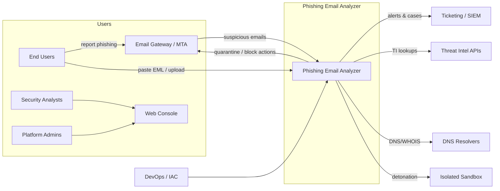
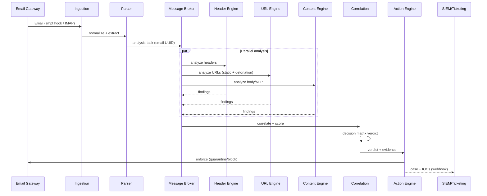
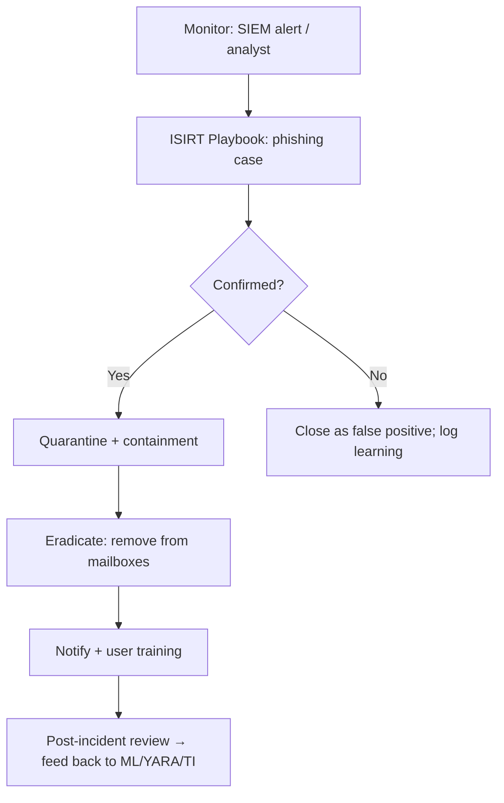

# Phishing Email Analyzer — Comprehensive Security Architecture

**Document version:** 1.0  
**Classification:** Internal / Production Architecture  
**Reference frameworks:** NIST CSF 2.0, NIST SP 800-53 R5, NIST SP 800-61 R2, NIST SP 800-218 (SSDF), ISO/IEC 27001:2022, OWASP Top 10 (2021), STRIDE

---

## Table of Contents

1. [Executive Summary](#1-executive-summary)
2. [Goals, Threats & Non-Functional Requirements](#2-goals-threats--non-functional-requirements)
3. [System Context & Actors](#3-system-context--actors)
4. [High-Level Architecture](#4-high-level-architecture)
5. [Component Deep-Dive](#5-component-deep-dive)
6. [Data Pipeline & Message Flow](#6-data-pipeline--message-flow)
7. [Threat Model (STRIDE)](#7-threat-model-stride)
8. [Security Controls Mapping — NIST / ISO 27001 / OWASP](#8-security-controls-mapping--nist--iso-27001--owasp)
9. [Secure Software Development (SSDF) & CI/CD](#9-secure-software-development-ssdf--cicd)
10. [Deployment, Networking & Zero-Trust Model](#10-deployment-networking--zero-trust-model)
11. [Data Protection, Privacy & Retention](#11-data-protection-privacy--retention)
12. [Observability, Logging & Incident Response](#12-observability-logging--incident-response)
13. [Reliability, Scalability & Capacity](#13-reliability-scalability--capacity)
14. [Technology Stack Recommendation](#14-technology-stack-recommendation)
15. [Implementation Roadmap](#15-implementation-roadmap)

---

## 1. Executive Summary

The **Phishing Email Analyzer** is a security tool that ingests raw email messages and performs
automated triage across three primary analysis domains:

1. **Header analysis** — authentication results (SPF/DKIM/DMARC), anti-spoofing, hop/route validation, anomaly detection.
2. **URL analysis** — extraction, de-obfuscation, reputation lookup, and isolated detonation of embedded links.
3. **Attachment triage** — type identification, static malware scanning (signature + YARA), macro/object inspection, and optional sandbox detonation.

The system returns an **evidence-backed risk score and verdict** (Quarantine / Block / Sandbox / Flag / Allow)
and integrates with existing email gateways, SIEMs, and ticketing systems.

Because the tool analyzes untrusted attacker-controlled input, it is designed **security-first**:
every component processes hostile data inside sandboxes with the least privilege possible,
outbound egress is strictly controlled, rendering of email content is aggressively sanitized,
and the entire lifecycle is mapped to NIST, ISO 27001, and OWASP Top 10 controls.

---

## 2. Goals, Threats & Non-Functional Requirements

### 2.1 Goals

- Detect, triage, and block phishing emails before they reach end users.
- Analyze three signal domains (header, URL, attachment) and correlate them into one verdict.
- Provide full forensic evidence with explainable risk scoring for analysts.
- Automate enforcement actions and incident-response handoff.

### 2.2 Key Threat Scenarios the Tool Must Handle

| # | Scenario |
|---|----------|
| T1 | Spoofed sender (SPF/DKIM/DMARC failure, header forgery, display-name spoofing) |
| T2 | Obfuscated / typosquatted / URL-shortened / punycode phishing URLs |
| T3 | Malicious attachments: MIME spoofing, polyglot files, macro-enabled Office docs, LNK/ISO |
| T4 | Multi-stage emails using encoded content (HTML entity obfuscation, base64, QR codes) |
| T5 | Compromised-legitimate-sender (credential theft) → behavioral/anomaly detection needed |
| T6 | **Attacks against the analyzer itself** — malformed MIME/DNS/PDF bombs, SSRF via URL crawling, XSS via rendered email bodies, zip bombs, resource exhaustion |

### 2.3 Non-Functional Requirements

| NFR | Requirement |
|-----|-------------|
| Security | All controls in Section 8 are enforced and continuously validated |
| Throughput | Baseline 1,000 emails/min; scale-out to 10,000/min |
| Latency | Header+URL quick-path verdict ≤ 30 s; sandbox path ≤ 10 min typical |
| Availability | 99.9% for the intake/API plane; degradation-tolerant for detonation |
| Data | Retention per policy (configurable 30/90/365 days), tamper-evident audit log |
| Compliance | Audit-ready evidence for NIST, ISO 27001, and industry-specific regimes |
| Observability | Full traceability of every email → verdict → action |

---

## 3. System Context & Actors



### 3.1 Actors & Roles (RBAC)

| Role | Permissions (least privilege) |
|------|-------------------------------|
| `viewer` | Read cases, verdicts, sanitized artifacts |
| `analyst` | View raw evidence, run sandbox requests, set case notes, override verdict with justification |
| `triage-manager` | Analyst + enforce action (quarantine/block/release) |
| `admin` | System config, feed management, RBAC, retention policy |
| `auditor` | Read-only access to audit logs and compliance evidence |
| `service-account` | API access scoped per integration, token-scoped permissions |

Enforced with OIDC/SSO + mandatory MFA for all interactive roles (**IA-2, IA-5, A.9, A.7**).

---

## 4. High-Level Architecture

The system is a **modular microservice architecture** with an asynchronous event pipeline. It is
deployed in a private VPC with a zero-trust meshed network and clearly separated planes.

```mermaid
flowchart TB
    subgraph INGRESS[Untrusted Ingress Zone]
        EDGE[API Gateway / Load Balancer]
        ING[ Ingestion Service ]
        PARSER[ MIME Parser / Normalizer ]
    end

    subgraph BUS[Protected Event Bus]
        MQ[( Message Broker - RabbitMQ/Kafka )]
    end

    subgraph ENGINES[Isolated Analysis Engines]
        HEAD[ Header Analysis Engine ]
        URL[ URL Analysis Engine ]
        ATT[ Attachment Triage Engine ]
        CONT[ Content / NLP Engine ]
        ML[ ML Risk Classifier ]
        CORR[ Correlation & Decision Engine ]
    end

    subgraph DET[Detonation Zone (no-internet trust)]
        CRAWL[ Safe URL Crawler / Browser Emulation ]
        VM[ Malware Sandbox VMs ]
    end

    subgraph DATA[Data & Intelligence Plane]
        IO[( Case/Evidence Store - PostgreSQL )]
        IDX[( Search Index - Elasticsearch )]
        IOC[( IOC Repository - MISP )]
        CACHE[( Redis Cache )]
        TR[( Threat Intel Fetch Scheduler )]
    end

    subgraph ACT[Response Plane]
        RESP[ Response/Action Engine ]
        FEED[ Feeds: SIEM, Ticketing, Email Gateway ]
    end

    subgraph OPS[Operations Plane]
        UI[ Analyst Web Console ]
        API[ Public REST/Webhook API ]
    end

    EDGE --> ING --> PARSER --> MQ
    MQ --> HEAD
    MQ --> URL
    MQ --> ATT
    MQ --> CONT
    HEAD --> MQ
    URL --> MQ
    ATT --> MQ
    CONT --> MQ
    URL --> CRAWL
    ATT --> VM
    CRAWL --> URL
    VM --> ATT
    MQ --> CORR --> ML
    CORR <--> IO
    CORR --> RESP
    RESP --> FEED
    IOC --> CORR
    IO --> IDX
    TR --> IOC
    CACHE <--> CORR
    UI --> API --> EDGE
    API --> IO
```

### 4.1 Architecture Principles

- **Assume breach, hostile input everywhere.** Every service treats input as attacker-controlled.
- **Asynchronous pipeline** decouples ingestion from slow analysis (detonation, ML) so intake never blocks.
- **Isolation by zone:** ingress, processing, detonation, data, and operations planes are network-separated.
- **Stateless services, stateful stores.** Scale horizontally; tune per-queue concurrency.
- **Idempotency:** each email carries a UUID; actions are retry-safe.
- **Centralized policy** via OPA/Kyverno for authorization decisions (`response.allow` decider).

---

## 5. Component Deep-Dive

### 5.1 Ingestion Service

| Concern | Design |
|---|---|
| Inputs | SMTP/MTA hook (postfix/policy listener), IMAP connector (M365/GWS/Exchange), EML/MBOX upload, "Report phishing" mailto, REST API |
| AuthN of sources | API keys (short-lived, per-tenant), mTLS for MTA connections |
| Rate limiting | Token-bucket per source/IP/tenant; deep queue backpressure policies |
| Validation | Size caps (default 25 MB raw), message-count caps, envelope checks, malware-scan-before-parse note |

> Controls: **SI-10 Input Validation, SC-7 Boundary Protection, A.13.1.1, A.14.2.5**

### 5.2 MIME Parser / Normalizer

- Parses raw `RFC 5322` message into a **normalized canonical object model**: headers (preserving case +
  original order), body parts, attachments, embedded URLs, and envelope metadata.
- Uses a hardened parser (fail-closed) — **malformed messages are quarantined, never rendered**.
- Produces:
  - Header map (with duplicates, decode RFC 2047 `=?utf-8?B?...?=`)
  - Body text/html (raw + extracted)
  - Attachment list: filename, declared MIME, magic-bytes true type, size, SHA-256, entropy
  - URL list with extraction provenance (body vs attachment filename, obfuscation flags)
- Strips active content before any storage/rendering; preserves raw EML in blob storage (encrypted).

### 5.3 Header Analysis Engine

Performs **authentication and anomaly analysis** on email headers:

- **Authentication results:** resolves selectors with DNS; validates SPF (`Received-SPFAuth-Results`), DKIM signatures, DMARC policy (incl. `enforce`) using a hardened DNS resolver. Re-checks against claimed `Authentication-Results` to detect forged/garbage auth headers.
- **Anti-spoofing heuristics:**
  - `From` vs `Reply-To` / `Return-Path` mismatch
  - `From` display-name spoofing of known brands/executives (impersonation set)
  - Missing `Message-ID`, `Date`, `From`
  - `Received` chain sanity: hop count, hop-1 MAIL FROM vs `From` domain, IP geolocation vs sender claim
  - `X-Originating-IP`, `X-Mailer`, duplicate/abnormal headers
- **Deliverability & policy:** check against org allow/block lists, DMARC run-time policy, sender reputation cache.
- Output: structured findings + per-finding confidence, e.g. `{ finding: "DKIM_FAIL", confidence: 0.99 }`.

### 5.4 URL Analysis Engine (static → suspicious → detonation)

Two-stage triage keeps latency low and detonation cost contained.

**Stage A — Static (sub-second):**
1. Extract URLs from body, HTML, attachment binaries (regex + link extraction from Office binaries).
2. Normalize & de-obfuscate: decode percent-encoding, HTML entity encoding, punycode → Unicode, trim redirect tracking params.
3. Reputation lookups (parallel, cached): VirusTotal, Google Safe Browsing, urlhaus.abuse.ch, PhishTank, in-house MISP IOC match, DNS-based blocking lists.
4. Heuristics: typosquatting (edit distance vs top 10k domains + brand watchlist), unusual TLDs, IP-address URLs, port use, newly-registered domains (WHOIS), embedded credentials in URL, encoded characters.

**Stage B — Detonation (suspicious only, isolated):**
- Render links in a **headless browser emulation** inside the Detonation Zone.
- **SSRF hardening is mandatory here (OWASP A10):**
  - DNS resolution restricted to an allowlisted egress resolver with sinkhole rules.
  - Hard block: private/loopback/link-local/ULA ranges, cloud metadata IPs (`169.254.169.254`), IPv6 transition addresses.
  - Redirect chains capped (≤ 10) and re-validated at every hop.
  - No outbound access to internal services; egress proxy only to internet allowlist.
- Record: final domain, redirect chain, TLS/SSL details, page title/meta (sandbox-side only), certificate transparency, favicon hash → phishing-detection fingerprinting, response behaviors.

### 5.5 Attachment Triage Engine

| Layer | Technique |
|---|---|
| Type verification | Magic bytes + file signature vs declared MIME; flag MIME spoofing & double extensions |
| Signature AV | ClamAV (freshly updated DBs, mirrored in-network) |
| YARA rules | Custom + community rulesets; results stored as IOCs |
| Static document analysis | Office macro extraction (oletools/OLEVBA), embedded object/package inspection, HTA/HWP, macro `AutoOpen`/`Document_Open` detection, VBA obfuscation heuristics via entropy/structure checks |
| Compressed/archives | Zip-bomb detection (ratio limits, entry caps, decompression ceilings) |
| File type caps | Configurable deny-list (`.exe .scr .hta .js ...`) and allowlist for auto-passing known benign types |
| Detonation | When policy says *sandbox-render*: detach attachment into Malware Sandbox VM with network instrumentation (HTTP logs), process/behavior telemetry, memory dump for later analysis |

Sandbox VMs: **no shared folders, no escalation, disposable (snapshot-reverted after run), isolated network with recording** — **SC-7, A.12.2, CM-7.**

### 5.6 Content / NLP Engine

- Email body language analysis: urgency/panic indicators, credential-request patterns, invoice/payment lures, brand impersonation mentions, cross-checked against impersonation watchlist.
- URL-text mismatch: `display: "paypal.com"` → `href: "evil.example"`.
- Zero-knowledge-scored features for the ML classifier (see 5.7). Models retrained offline; checked for drift.

### 5.7 ML Risk Classifier & Correlation / Decision Engine

- **Feature vector** = aggregated outputs of all engines (AuthFailures, URL reputation, attachment findings, text features, sender profile) + **context** (recipient profile, vertical, request type).
- **Correlation:** logs each evidence item with normalization, builds a case record with a running **Bayesian risk score**.
- **Verdict decision matrix** (policy-driven, not black-box):
  - `QUARANTINE` — credentialed-attacker or multistage signals (e.g., DMARC fail + URL block + macro attachment)
  - `BLOCK` — confirmed malicious (TI hit + detonation behavior match)
  - `SANDBOX` — undetermined high-risk (auto-queue to sandbox, no user visible)
  - `FLAG` — suspicious, delay-hold for analyst
  - `ALLOW` — benign (with logging; retraining feedback)
- Explainability: each verdict stores the contributing evidence with confidence, so analysts can audit ML decisions (**A.4, human-in-the-loop** default for enforcement).

### 5.8 Response / Action Engine

- Modular **connectors** (M365 Exchange Online, Gmail/Workspace, Exchange on-prem, MTA) to quarantine, soft-delete, or restore.
- Actions are **two-step with authorization check** (OPA) and full audit trail; destructive actions require `triage-manager` role.
- Webhook + SIEM + ticketing (ServiceNow/Jira) notifications on verdict change.
- Integration is failure-isolated: if the gateway is unreachable, verdicts continue to be recorded; enforcement retries with backoff.

### 5.9 Analyst Console & Public API

- **Web UI** (React, server-rendered safe): 
  - Case list with risk scores, drill-down evidence: full normalized headers (hop graph), URL list with reputation, attachment table with hashes, raw message viewer **rendered as plain text or sanitized HTML** (see OWASP A03 XSS control).
  - Verdict override workflow with justification + audit.
- **REST/Webhook API**: guarded by API gateway, OAuth2 client credentials, per-scope tokens, rate limits, request size caps, and schema validation.

### 5.10 Data & Intelligence Plane

- **PostgreSQL** — relational store for cases, evidence, decisions, RBAC, audit; encrypted at rest; nightly backups.
- **Elasticsearch** — search over headers, body terms, IOC hashes, sender/property pivots.
- **MISP/own IOC repo** — publish confirmed IOCs (URLs, hashes, domains) and consume community/shared feeds.
- **Redis** — caches for reputation lookups, DNS results, rate limiting, dedupe of identical emails (message-ID hash).
- **Threat Intel Scheduler** — periodic feed sync (VT, GSB, urlhaus, MISP) with provenance/trust labeling and freshness tracking.

---

## 6. Data Pipeline & Message Flow



Deduplication: identical normalized messages (same content hash) within a window return cached verdict.

---

## 7. Threat Model (STRIDE)

Attack surface is the tool itself. Table of principal trust boundaries:

| Trust boundary | Assets | Primary risks | Key mitigations |
|---|---|---|---|
| MTA/User → Ingestion | email content, creds | Tampering/Spoofing (fake email), DoS (flooding) | mTLS/API tokens, rate limits, size caps, source authn |
| Parser → Services | normalized JSON | DoS (billion laughs, deep nesting), Injection (parser bugs) | hardened parser, recursion/size limits, fail-closed |
| URL engine → Web | outbound HTTP | **SSRF (A10)**, Information disclosure | egress proxy, IP range blocking per hop, no internal DNS |
| Attachment engine | sandbox | Evasion, VM escape (theoretical), resource exhaustion | disposable VMs, seccomp/AppArmor, no shared mounts, CPU/mem caps |
| Rendered content → Analyst UI | analyst browser | **XSS via email body (A03)** | sanitize on render, Content-Security-Policy, plain-text default, no v0 DOM embedding |
| API → Services | API keys, cases | Broken access control (A01) | OAuth2 scopes, RBAC, deny-by-default |
| Data stores | cases, IOCs, audit | SQL injection (A03), tampering, theft | parameterized queries, KMS encryption, WORM/immutable audit |
| CI/CD → Platform | code, secrets | Supply chain (A06, A08) | SBOM, signed artifacts, secret vault, provenance |
| Admin plane | everything | Privilege escalation | MFA, JIT privileged access, separation of duties |

---

## 8. Security Controls Mapping — NIST / ISO 27001 / OWASP

### 8.1 NIST CSF 2.0 Function Mapping

| CSF Function | Implemented By |
|---|---|
| **GOVERN** | Policy-as-code, SBOM, roles/access policy, risk register (RA-3) |
| **IDENTIFY** | Asset inventory (CM-8), threat intel feeds, IOC tagging, sensitive-data classification |
| **PROTECT** | Zero-trust zones, mTLS, KMS encryption, least-privilege RBAC, MFA, hardened baselines, input validation, sandboxing |
| **DETECT** | Behavency/AV/YARA detection engines, anomaly models, continuous monitoring (SI-4), SIEM integration |
| **RESPOND** | Automated quarantine actions, ISIRT playbooks, case/ticketing escalation (IR-4) |
| **RECOVER** | Backups (CP-9), snapshot-restore architecture, detonation-VM recycling, DR plan (CP-10) |

### 8.2 NIST SP 800-53 Controls (selected, mapped to components)

| Control | Requirement | Where Enforced |
|---|---|---|
| AC-2 / AC-3 / AC-6 | Account mgmt / access enforcement / least privilege | RBAC service, OPA, AD/SAML provider |
| AU-2 / AU-6 / AU-8 / AU-11 | Audit events, review (w/ SIEM), time stamps (NTP), retention | Central audit pipeline, immutable log store |
| CM-6 / CM-8 | Configuration baseline / system inventory | IaC (Terraform), CIS-benchmark baselines, CSPM scans |
| CA-7 | Continuous monitoring | Fleet metrics, drift detection, periodic pentest |
| IA-2 / IA-5 | Identification & authn / authenticator mgmt | OIDC, MFA, short-lived tokens, KMS |
| IR-4 / IR-5 | Incident handling / monitoring | Automated response connectors, SIEM alerting |
| PL-8 | Security architecture | This document + threat model (as-built review) |
| RA-3 / CA-2 | Risk assessment / security assessment | Threat model per release, annual controls assessment |
| SC-7 / SC-8 / SC-28 | Boundary protection / transmission confidentiality / PII protection | VPC segmentation, TLS 1.2+ / mTLS, KMS at-rest, data minimization |
| SI-2 | Flaw remediation | Automated patching pipeline, vuln scanning (Trivy/Snyk), SLAs |
| SI-4 | System monitoring | SIEM ingestion, OpenTelemetry, behavioral alerting |
| SI-10 | Input validation | Hardened parsers, schema validation, limits at every ingress |
| SI-12 | Data-handling/minimization | Retention policies, redaction, minimal-metadata IOC storage |

### 8.3 ISO/IEC 27001:2022 Annex A Mapping

| Annex A control | Where Addressed |
|---|---|
| A.5.1–A.5.4 (Policies, roles, review) | Security policy repo, RACI for analyst/operator roles |
| A.6.1.2 (Segregation of duties) | Analyst (view) vs enforcement (triage-manager) separation; admin JIT |
| A.6.8 (InfoSec event reporting) | UI "report phishing", SIEM/ISIRT handoff |
| A.7.2 (Awareness/training) | Analyst & admin security training, phishing-sim reviews |
| A.8.8 (Technical vulnerability mgmt) | Trivy/Snyk/Dependabot, patch pipeline, feed-update hygiene |
| A.8.10 (Info deletion) | Retention/redaction for cases, body text, attachments |
| A.9.1–A.9.4 (Access control) | OIDC/SSO, MFA, RBAC scopes, keyboard-timeout, privileged access workflow |
| A.10.1 (Cryptographic controls) | TLS 1.2+, AES-256-GCM/ChaCha, KMS rotation, HSMs for production keys |
| A.12.1.2/3 (Change & capacity mgmt) | Change-control PRs, autoscaling + queue-depth alerting |
| A.12.4 (Logging & monitoring) | Structured audit logs, tamper-evidence, SIEM |
| A.12.6/7 (Vuln mgmt / malware protection) | ClamAV/YARA + OS hardening + endpoint monitoring on all nodes |
| A.13.1/2 (Network security / transfer) | VPC segmentation, egress proxy, DLP on case export, mTLS |
| A.14.2 (Secure dev & testing) | SSDF pipeline (Section 9), DAST/SAST in CI, threat modeling gate |
| A.14.2.6/7 (Secure production env, outsourced dev) | Harden base images, signed artifacts, vet 3rd-party sandbox/AV vendors |
| A.15.1 (Supplier relationships) | TI-feed and sandbox-vendor SLAs, MISP trust labels |
| A.16 (Incident management) | Amalgamated with IR-4; ISIRT handoff via cases |
| A.17 (Business continuity) | Multi-AZ deployment, DR runbook, quarterly recovery test |
| A.18 (Compliance) | Records retention, audit evidence, privacy checks (GDPR) |

### 8.4 OWASP Top 10 (2021) — Applied to This System

| # | Weakness | Attack surface | Concrete control implemented |
|---|---|---|---|
| A01 | Broken Access Control | API & console | OIDC scopes, RBAC, deny-by-default, ownership checks on case objects, MFA |
| A02 | Cryptographic Failures | all data flows | TLS 1.2+/mTLS, AES-256-GCM at rest, KMS-managed keys, no plaintext secrets |
| A03 | Injection | parser, DB, **rendered email body** | Parameterized queries; **HTML sanitizer (DOMPurify-class) for email rendering**, CSP, `sandbox` iframes; entity-decode URLs before analysis |
| A04 | Insecure Design | pipeline & sandbox | Threat modeling per feature, fail-closed parsers, policy-as-code decision matrix |
| A05 | Security Misconfiguration | platform | IaC + CIS baselines, hardened base images, automated drift/CSPM scanning |
| A06 | Vulnerable & Outdated Components | all services | SBOM per deploy, Trivy/Snyk gating in CI, vulnerability SLA, pinned versions |
| A07 | Identification & Auth Failures | console, API, MTA hooks | SSO with MFA, short-lived keys, session controls, no default creds |
| A08 | Software & Data Integrity Failures | CI/CD, feeds, sandbox images | Signed images & commits, provenance, pinned feed schemas, hash-verified sandbox snapshots |
| A09 | Security Logging & Monitoring Failures | platform | Central audit + SIEM, key-event alerting, retention, personnel completeness |
| A10 | SSRF | **URL analysis engine** | Egress proxy allowlist, private-range/resolver blocking, per-hop redirect re-validation, no internal DNS |

**A10 is the defining OWASP control of this product** — the URL crawler is a deliberate SSRF
capability, so it is confined to the detonation zone with mandatory egress controls.

---

## 9. Secure Software Development (SSDF) & CI/CD

Pipeline conforming to **NIST SP 800-218 (SSDF)** PW/PO/PS/PT groups:

```mermaid
flowchart LR
    DEV[Developer] -->|PR| SCA[Dependency & License Scan]
    SCA --> STAT[SAST - Semgrep/CodeQL]
    STAT --> TEST[Unit + Integration Tests]
    TEST --> DAST[DAST with ZAP for API/UI]
    DAST --> IMG[Build signed hardened image]
    IMG --> REG[Scan: Trivy + SBOM generate]
    REG --> PROV[Env: Terraform apply + CNAPP check]
    PROV --> DEP[Deploy signed & immutable]
    DEP --> E2E[Runtime e2e + attack simulations]
```



- **Threat model gate:** every major feature updates the STRIDE table before merge.
- **Supply chain:** SBOM (CycloneDX) generated per artifact, stored and diffed; feeds into A.15/CM-8.
- **Secrets:** never in repo; injected via Vault at deploy; rotated automatically.
- **Developers:** MFA, signed commits, code-review requirement, least privilege to registries.
- **Testing:** unit, integration, contract, fuzzing of the MIME parser (OSS-Fuzz-class), and continuous "attack simulation" emails (benign + malicious corpus) in CI.

---

## 10. Deployment, Networking & Zero-Trust Model

### 10.1 Reference Deployment (cloud, e.g., AWS/Azure)

```mermaid
flowchart TB
    INTERNET[Internet / MTA Peers] --> LB[Public LB - TLS]
    subgraph VPC[Segmented VPC]
        subgraph ING[Ingress Subnet]
            GW[API Gateway]
            ING1[Ingestion Nodes]
        end
        subgraph APP[App Subnet - no internet]
            PARSER, ENGINES, CORRELATION, RESPONSE, DATA_STORES
        end
        subgraph DET[Detonation Subnet - isolated]
            CRAWLER[Safe Crawler]
            SAND1[Sandbox VMs]
            PROXY[Egress Proxy - allowlist]
        end
        subgraph OPSNET[Ops Subnet]
            BASTION[Bastion/JIT]
            ADMIN[Admin nodes]
        end
    end
    self[Self]: SERVICES
```

- **Zones:** Ingress (public-facing) → App (processing, no inbound internet) → Detonation (air-gapped-ish, egress-only via proxy) → Ops (bastion/JIT) → Data (encrypted at rest, most restricted).
- **mTLS** between all services; **no trust based on network location** (zero trust). Service identities via SPIFFE/SPIRE or cloud-native identity.
- **Egress:** only the crawler and TI sync need internet; both route through **allowlisted egress proxy** with content inspection and egress logs. All other pods have no route (network policies + security groups, deny-by-default).
- **Sandbox:** disposable VMs, no persistent storage, snapshot isolation, separate physical/isolated network for VM telemetry capture.
- **Backups:** encrypted DB snapshots cross-region, restored periodically (tested). Detonation env is stateless by design.

### 10.2 Hardening Matrix

| Layer | Baseline |
|---|---|
| OS images | CIS-benchmark hardened, minimal packages, no shells in app containers |
| Containers | Non-root, read-only rootfs, seccomp/AppArmor profiles, resource limits |
| Network | Private subnets only reachable via load balancer; security groups deny-all default |
| Web | TLS 1.2+ only, HSTS, CSP, COOP/COEP, secure+httponly cookies, CSRF tokens |
| API | OAuth2 client-credential + per-scope tokens, openapi validation, rate limits |
| Secrets | Vault/KMS, rotation, least-privilege IAM |

---

## 11. Data Protection, Privacy & Retention

Emails contain PII and business-critical data. Design principles:

- **Data minimization (SI-12, A.8.10):** store normalized evidence, hashes, and IOCs; retain raw EML only as long as the case/investigation needs it (configurable 30–365 days), then shred.
- **Redaction:** automatic redaction of credentials (passwords, tokens) found in body/attachments before analyst UI display; full raw message behind role + justification.
- **Access:** analysts see evidence per-role; export of cases is DLP-checked and audited.
- **Encryption:** at rest (AES-256-GCM, KMS; per-tenant keys where multi-tenant), in transit (TLS/mTLS), and backup encryption.
- **Retention schedule:** cases 365 d (configurable), audit logs 7 yr (compliance), caches 24–72 h, detonation artifacts 30 d.
- **Cross-border/processing:** region pinning, supplementary GDPR-related controls where applicable, DPIA for sandbox vendors handling samples.

---

## 12. Observability, Logging & Incident Response

### 12.1 Telemetry

- **OpenTelemetry** traces spanning intake → verdict → action (correlation ID = email UUID).
- **Metrics:** ingest rate, queue depth, engine latency, verdict distribution, sandbox utilization, error rates.
- **Dashboards/alerts:** Prometheus + Grafana; alerts on queue backlog, parser failure spike, sandbox escape indicators (network egress anomalies), long-running jobs.
- **Logs:** structured JSON, correlated by UUID, central SIEM (Splunk/ELK/Loki).

### 12.2 Audit (compliance-grade)

- Immutable, append-only audit store for: logins, permission changes, verdict overrides, enforcement actions, config changes, retention executions.
- Signed/checksummed batches; auditor role reads only.
- Covers A.12.4, AU-series, SI-4 requirements.

### 12.3 Incident Response Integration (NIST SP 800-61)



- Automated actions deferred until confirmed; human-in-the-loop for blasting actions.
- IOCs from confirmed cases auto-published to MISP for the feed loop.

---

## 13. Reliability, Scalability & Capacity

- **Stateless services → horizontal autoscaling** on queue depth and CPU.
- **Message broker** partitioned by tenant/shards for isolation; DLQ with alerting for poison messages.
- **Backpressure:** ingest rejects fast (HTTP 429) rather than buffering unbounded.
- **Graceful degradation:** if TI APIs are down, static heuristics still yield conservative (flag-not-allow) verdicts; caching prevents API thundering herd.
- **DR:** RTO 4 h, RPO ≤ 15 min; multi-AZ; quarterly recovery drills.
- **Capacity target:** 1,000 emails/min baseline (30 ms parse, sub-second static URL/header, 30–600 s detonation), 10,000/min with 4x nodes.

---

## 14. Technology Stack Recommendation

| Layer | Recommendation | Justification |
|---|---|---|
| App language | Python 3.11+ (analysis), Go (crawler/edge), React+TS (UI) | Python ML/email ecosystem, Go for safe concurrent crawling |
| Message bus | RabbitMQ (or Kafka ≥ 500k msg/s) | async decoupling, DLQ, partitions |
| Storage | PostgreSQL + Elasticsearch + Redis + MISP | relational evidence, search, cache, IOC sharing |
| AV/scan | ClamAV (mirrored), YARA, oletools/OLEVBA | static macro + signature coverage |
| TI APIs | VirusTotal, Google Safe Browsing, urlhaus, PhishTank, Spamhaus DNSBL | layered reputation |
| Detonation | Disposable QEMU VM fleet (in-house or commercial sandbox) + headless Chromium crawler | controlled SSRF-safe crawling + behavior |
| AuthN/Z | OIDC IdP + Open Policy Agent (OPA) + Vault | SSO/MFA, policy-as-code, secrets |
| Web hardening | Nginx/WAF, CSP, sanitizers (bleach/DOMPurify) | A03/A05/A07 |
| Observability | OpenTelemetry + Prometheus + Grafana + Loki, SIEM export | A09, AU/SI controls |
| CI/CD/IaC | GitHub Actions + Terraform + Trivy + Snyk + SBOM (CycloneDX) | A06/A08, SSDF |

---

## 15. Implementation Roadmap

| Phase | Scope | Gate |
|---|---|---|
| **P0 — Core triage** | Ingestion, MIME parser, Header engine, Static URL engine, Attachment static scan (magic+AV+YARA), correlation + verdict, analyst UI (sanitized rendering) | Threat model review + SAST/DAST clean |
| **P1 — Enrichment** | URL detonation (safe crawler + SSRF controls), macro analysis, NLP engine, ML classifier, TI feed scheduler, MISP publish | Pentest of detonation zone |
| **P2 — Enforcement & IR** | Response connectors (M365/GWS/Exchange), SIEM/ticketing webhooks, retention & audit hardening, DR drills | ISO mapping audit |
| **P3 — Scale & Hardening** | Multi-tenant sharding, autoscaling, egress DLP, sandbox VM telemetry 2.0, continuous attack-sim corpus in CI | Annual controls assessment, red team |

---

## Appendix A — Acronyms

SPF/DKIM/DMARC, MTA, MIME, IOC, TI, SIEM, ISIRT, IDPS, SAR, CSP, OPA, SBOM, mTLS, KMS, HSTS, DAST/SAST, RTO/RPO, VPC, JIT, OIDC.

## Appendix B — Document Ownership & Review

- Maintainer: Security Architecture team.
- Review cadence: on architecture change, annually, and after security incidents affecting the platform.
- Record of controls assessment (CA-2/ISO 8.2 internal audit) linked to this document.