# Red Team Engagement Report Generator — Architecture

> **v1.0** · Python 3.10+ · `openpyxl` · formats: `.xlsx` / `.csv` / `.html`
> Reference architecture that turns raw penetration-testing **findings** into
> **CVSS v3.1** scores, cross-maps them to **OWASP Top 10**, **NIST SP 800-53**
> and **ISO/IEC 27001**, synthesizes an **executive summary**, and renders
> board-ready artifacts in **.xlsx**, **.csv** and **.html**.

Tags: `CVSS v3.1 Engine` · `OWASP Top 10 2021` · `NIST SP 800-53 Rev.5` ·
`ISO/IEC 27001:2022` · `Executive Summary` · `.xlsx · .csv · .html` ·
`Tkinter GUI` · `Portable .exe (PyInstaller)`

Pipeline: **Raw Findings → CVSS Scoring → Framework Mapping → Risk Analysis →
Report Rendering → Delivery**

---

## End-to-End Pipeline

Three-stage flow: **ingest → process → emit**.

| Stage | Component | Responsibility |
|---|---|---|
| **1 · Inputs** | Engagement JSON | `sample_findings.json` — id, title, asset, cvss_vector, owasp_id, evidence, remediation |
| | Extension points | `findings.csv` dumps, API/JSON feeds, manual console entry |
| | Framework catalogs | Embedded: OWASP / NIST / ISO control registries |
| **2 · Processing** | CVSS v3.1 Engine | Parse + validate vector · base / temporal / environmental equations · roundup scoring · severity bands |
| | Framework Mapper | OWASP category → NIST 800-53 controls + ISO 27001 Annex A controls (authoritative cross-map) |
| | Executive Analyzer | Risk index 0–100 · distribution · narrative · prioritized remediation plan |
| | Report Orchestrator | `pipeline.generate()` dispatches the identical dataset to each renderer |
| **3 · Outputs** | HTML Dashboard | `red_team_engagement_report.html` — colorful, self-contained |
| | Excel Workbook | `red_team_engagement_report.xlsx` — 6 styled + conditional-format sheets |
| | CSV Set | `findings.csv` · `cvss_metrics.csv` · `framework_coverage.csv` · `executive_summary.csv` |

> Pipeline stages are decoupled; every renderer receives the same
> *Findings + FrameworkMappings + ExecutiveSummary* context.

---

## GUI + Portable Executable (desktop delivery)

The CLI and the Web-free core are wrapped in a native **Tkinter GUI** and
shipped as a **portable single-file `.exe`** so analysts can generate
engagement reports without a Python runtime.

```mermaid
flowchart LR
    A[Launch exe] --> B[GUI: open findings JSON]
    B --> C[Preview findings table + severity]
    C --> D[Select output dir + formats]
    D --> E[generate&#40;&#41; dispatches pipeline]
    E --> F[xlsx / csv / html]
    F --> G[Open reports folder / relaunch]
```



| Concern | Design |
|---|---|
| GUI toolkit | Tkinter (stdlib) + `ttk` widgets — no heavy UI dependency, small exe |
| Packaging | PyInstaller `--onefile --windowed` → portable `.exe` (no install) |
| Entry point | `python -m redteam_report.gui` (dev) · `red-team-report-gui` (console script) · frozen exe |
| Threading | Report generation runs on a worker thread so the UI never blocks |
| Zero network | All catalogs embedded in code — fully offline, safe for air-gapped engagements |
| State | Last-used paths persisted to `%LOCALAPPDATA%` (see `state.md`) |
| Security | No secrets in bundle, temp sandbox, hardened handling (see `security.md`) |
| Build | `build_exe.ps1` → `dist/RedTeamReport.exe` |

Build commands:

```powershell
pip install -e .[gui,build]   # installs openpyxl + pyinstaller
.\build_exe.ps1               # or: PyInstaller redteam_report.spec
```

---

## Framework Alignment

One finding, three frameworks — traceable controls.

### OWASP Top 10 (2021)

| Code | Category |
|---|---|
| A01 | Broken Access Control |
| A02 | Cryptographic Failures |
| A03 | Injection |
| A04 | Insecure Design |
| A05 | Security Misconfiguration |
| A06 | Vulnerable & Outdated Components |
| A07 | Identification & Auth Failures |
| A08 | Software & Data Integrity |
| A09 | Logging & Monitoring Failures |
| A10 | Server-Side Request Forgery |

### NIST SP 800-53 Rev.5

`AC` Access Control · `AU` Audit & Accountability · `CM` Configuration Mgmt ·
`IA` Identification & Auth · `SC` System & Comms Protection · `SI` System &
Info Integrity · `SA` Service Acquisition · `RA` Risk Assessment ·
`IR` Incident Response · `SR` Supply Chain

### ISO/IEC 27001:2022 Annex A

`A.5.x` Organizational · `A.6.x` People · `A.7.x` Physical · `A.8.2` Privileged
Access Rights · `A.8.8` Technical Vulnerability Mgmt · `A.8.15-17` Logging /
Monitoring / Clock Sync · `A.8.20-24` Network Security / Cryptography ·
`A.8.25-29` Secure Development Lifecycle · `A.8.31-32` Env Separation / Change
Mgmt · `A.5.24-28` Incident & Evidence Management

---

## Component Map

| Module | Responsibility | Path |
|---|---|---|
| Finding Model | Domain entity with CVSS-result binding, severity accessors and a flat `framework_row()` for CSV/tabular output | `src/redteam_report/models/finding.py` |
| CVSS v3.1 Engine | Fully computed Base / Temporal / Environmental scoring per FIRST spec, with vector validation and CVSS roundup | `src/redteam_report/models/cvss.py` |
| OWASP Catalog | OWASP Top 10 (2021) categories with descriptions and reference URLs | `src/redteam_report/frameworks/owasp.py` |
| NIST Catalog | Curated SP 800-53 Rev.5 controls with control families and CSF v2.0 function tags | `src/redteam_report/frameworks/nist.py` |
| ISO Catalog | ISO/IEC 27001:2022 Annex A controls grouped by Organizational / People / Physical / Technological themes | `src/redteam_report/frameworks/iso27001.py` |
| Cross-Framework Mapper | Authoritative OWASP → NIST → ISO mapping table plus framework-coverage statistics | `src/redteam_report/frameworks/catalog.py` |
| Executive Analyzer | Risk index, severity distribution, narrative generation and ranked remediation plan | `src/redteam_report/analyzers/executive.py` |
| CSV Reporter | Machine-friendly UTF-8 CSVs for Excel, Power BI and downstream automation | `src/redteam_report/reporters/csv_reporter.py` |
| XLSX Reporter | Six-sheet workbook: Executive Summary, Severity Dashboard, Findings, CVSS Metrics, Framework Coverage, Remediation Plan, with color scales and styled headers | `src/redteam_report/reporters/xlsx_reporter.py` |
| HTML Reporter | Self-contained colorful dashboard — KPI cards, CSS bar charts, framework heat map, finding tables, control chips | `src/redteam_report/reporters/html_reporter.py` |
| Orchestrator | `load_engagement → mappings() → executive_summary() → generate()` dispatch | `src/redteam_report/pipeline.py` |
| CLI | argparse entrypoint with format selection and framework-catalog listing | `src/redteam_report/cli.py` |
| **GUI (new)** | Tkinter desktop app: load JSON, preview scored findings, choose formats/output, run pipeline, open results (worker thread) | `src/redteam_report/gui.py` |
| **Build (new)** | PyInstaller spec + `build_exe.ps1` → portable single-file windowed `.exe` | `redteam_report.spec`, `build_exe.ps1` |

---

## Data Model

```
Finding ──1── cvss ──> CVSS3Result
  ├─ id · title · asset · source      ├─ base score + sub-scores
  ├─ cvss_vector · owasp_id           ├─ temporal · environmental
  └─ impact fields · remediation      └─ severity bands

Finding ──1── owasp ──n→ FrameworkMapping
  ├─ owasp control (1)
  ├─ nist controls (n)
  └─ iso controls (n)

n Finding ──aggregate──> 1 ExecutiveSummary
  ├─ severity distribution
  ├─ risk index + rating
  └─ prioritized plan
```

---

## Severity Color Legend

CVSS v3.1 qualitative bands used across all formats:

| Band | Range | Color |
|---|---|---|
| Critical | 9.0–10.0 | `#E03131` |
| High | 7.0–8.9 | `#F76707` |
| Medium | 4.0–6.9 | `#FAB005` |
| Low | 0.1–3.9 | `#40C057` |
| None | 0.0 | `#868E96` |

---

## Run It

```powershell
python -m redteam_report.cli sample_findings.json --out reports
python -m redteam_report.cli input.json -o out -f html
python -m redteam_report.cli input.json --list-frameworks
python -m redteam_report.gui                  # launch desktop GUI
python -m pytest -q                            # run tests
```

**Traceability:** every finding carries its CVSS vector; the score drives
severity; severity drives the risk index; the OWASP id drives the NIST + ISO
control mapping; the narrative ties it all to a prioritized remediation plan.
Add, remove or re-weight mappings without touching any renderer.

---

Companion design docs: `security.md` · `state.md` · `memory.md`.