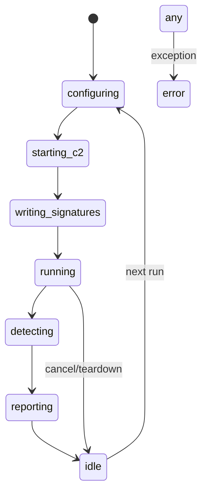

# 💾 state.md — Persistence & State Management

> Complete record of every piece of persistent state the C2 Detection Lab reads
> and writes, where it lives, its schema and how state transitions happen across
> a run. This file is the "reservation" contract: any state that exists —

```text
labs/
├── state/
│   └── security.json        <- PIN vault (hashed), lockout timers        [state.md §2]
└── runs/
    └── <run_id>/
        ├── config.json      <- full LabConfig for the run                [state.md §3]
        ├── detections/
        │   ├── beacon.zeek      <- generated Zeek signature              [state.md §4]
        │   └── c2_beacon.rules  <- generated Suricata rules
        ├── pcap/
        │   └── <run_id>.jsonl   <- captured event stream ("pcap")        [state.md §5]
        ├── evidence/
        │   └── audit.json       <- SHA-256 evidence chain                [state.md §6]
        └── reports/             <- .xlsx · .csv · .html exports          [state.md §7]
```

---

## 1 · State Types

| Kind | Format | Producer | Retained? | Purpose |
|---|---|---|---|---|
| **Persistent config** | JSON | `core/config.py` | Yes | Reproducible runs |
| **Auth vault** | JSON+hash | `gui/security.py` | Yes | PIN gate (OWASP A07) |
| **Transient events** | in-memory list | `c2_sim/bus.py` | During run | packet stream for engines |
| **Evidence** | JSON | `core/audit.py` | Yes | audit chain |
| **Artifacts** | files | detectors / reporting | Yes | deliverable signatures + reports |
| **Session (GUI)** | Tk widgets | `gui/app.py` | Session-only | live alert view |
| **Built EXE** | binary | PyInstaller | Yes | portable distribution |

---

## 2 · `state/security.json` (PIN vault)

| Field | Type | Meaning |
|---|---|---|
| `pin_salt` | str(hex) | per-vault salt (never stored in clear) |
| `pin_hash` | str(hex) | SHA-256(salt ":" pin) |
| `attempts` | int | consecutive failed unlocks |
| `locked_until` | float(epoch) | lockout expiry (0 = not locked) |
| `last_unlock` | str(ISO) | audit of last successful gate |

**Lifecycle:** created on first launch with default PIN `1234` →
hashed at rest → unlocked per session → lockout enforced at 5 fails.

---

## 3 · Run-state machine (`LabRunner`)



Persisted at each step: `config.json` (configuring), `detections/*`
(writing_signatures), `pcap/*.jsonl` (running), `evidence/audit.json`
(reporting). `error` states keep whatever was captured for forensics.

---

## 4 · Signature artifacts (deterministic generation)

**`beacon.zeek`** — injected interval from the config (`{interval}` templating)
so the generated rule always matches the configured beacon profile.

**`c2_beacon.rules`** — static body incl. `content:"|00 7f|"`, pcre task-id,
`sid 1000001/1000002`. Both files *are* the deliverable of the
"build the C2, then build signatures that catch it" workflow.

---

## 5 · Event stream ("pcap") schema — one JSONL row per packet

| Key | Example | Producer |
|---|---|---|
| `ts` | 1698... | bus |
| `src_ip`/`src_port` | `10.0.102.44` / `40000` | agent/server/benign |
| `dst_ip`/`dst_port` | `127.0.0.1` / `53217` | … |
| `proto` | `tcp` \| `udp` | … |
| `traffic_type` | `c2_beacon` \| `benign` | ground truth label |
| `payload_hex` | `007f...` | agent/server |
| `task_id` | 16-hex | agent |
| `channel` | `http`/`https`/`dns` | config |
| `agent_id` | `0..N` | agent |
| `user_agent` | impl UA | config |
| `role` | `agent_side` \| `server_side` \| `benign` | bus |

**Ground-truth contract:** `traffic_type` is the label used by
`detectors/engine.py` to compute precision/recall/F1. Mutating it invalidates
the metrics — read-only after capture.

---

## 6 · Evidence chain (`evidence/audit.json`)

Every logged entry:

```json
{ "ts": 1698..., "ts_iso": "...Z", "event": "signatures_generated",
  "detail": "beacon.zeek", "artifact": "...", "sha256": "…", "control": "ISO.27001.A8.17" }
```

Self-referential: `audit.json` is rewritten to hash **its own** entry list,
creating a tamper-evident chain (NIST AU-6).

---

## 7 · Export state (L5)

| File | Producer | Notes |
|---|---|---|
| `report.xlsx` | `reporting/xlsx_report.py` | 5 sheets + Charts |
| `alerts.csv` / `iocs.csv` / `metrics.csv` / `compliance.csv` | `reporting/csv_report.py` | RFC 4180, UTF-8-sig BOM |
| `report.html` | `reporting/html_report.py` | offline, canvas chart |

---

## 8 · Snapshot & Restoration Guide

| Task | Command |
|---|---|
| Save run state | copy `labs/runs/<run_id>` (keep config + evidence + pcap) |
| Restore a run's view | re-open `report.html`; re-import `reports/*.csv` into SIEM |
| Reset auth | delete `labs/state/security.json` → resets default PIN |
| Reset lab | `Remove-Item -Recurse labs` — rebuilds from config defaults |

> **Replay rule:** `config.json` + `pcap/*.jsonl` = full reproducibility.
> Share those two files (plus the .xlsx evidence sheet) for audit.