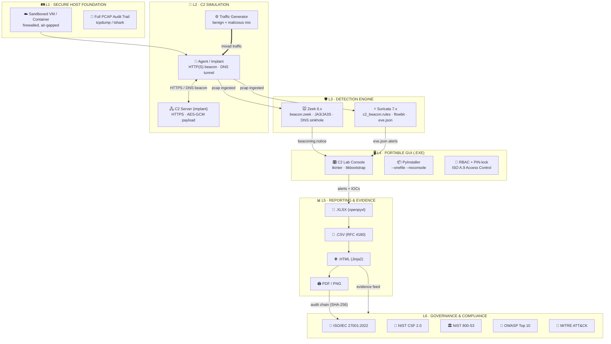
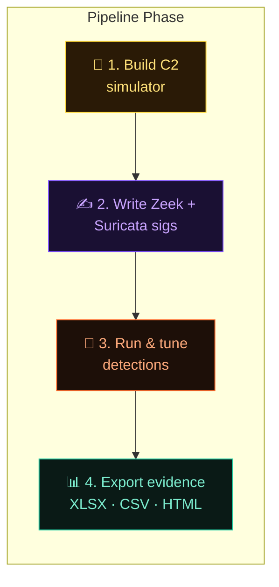
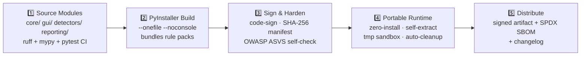
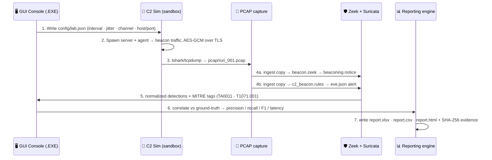

# 🛰 C2 Detection Lab — Architecture & Design Blueprint

> A **GUI-based, portable .EXE** security lab that **builds a command-and-control (C2) simulator**, then writes **Zeek** scripts & **Suricata** rules that detect its own traffic — wrapped in an auditable pipeline mapped to **ISO 27001**, **NIST CSF**, **NIST 800-53**, and **OWASP Top 10**.

<p align="center">
  
  
  
  
  
  
</p>

---

## 📑 Table of Contents

1. [End-to-End System Architecture](#1--end-to-end-system-architecture)
2. [Core Component Breakdown](#2--core-component-breakdown)
3. [Portable .EXE Build Pipeline](#3--portable-exe-build-pipeline)
4. [Runtime Data Flow](#4--runtime-data-flow)
5. [Compliance & Framework Mapping](#5--compliance--framework-mapping-confirmed)
6. [Report Formats & Contents](#6--report-formats--contents)
7. [Recommended Technology Stack](#7--recommended-technology-stack)

---

## 1 · End-to-End System Architecture



> **The golden rule of this lab:** *build the threat first (L2), then build signatures that catch it (L3), then prove it in an auditable report (L5).*



---

## 2 · Core Component Breakdown

### 🛤 L1 · Secure Host / Sandbox — *(Foundation & isolation)*

| Capability | Implementation |
|---|---|
| 🔒 Isolation | Dedicated VM / container, host-firewalled, no production network |
| 🧾 Audit trail | Full capture on every run → satisfies ISO **A.12.4** logging |
| ♻️ Teardown | One-command cleanup, snapshot rollback, **A.8.10** info deletion |
| 🛠 Baseline tools | `tcpdump`, `tshark` (capture + replay), Python 3.11 runtime |

### 👾 L2 · C2 Simulator — *(Build the threat)*

| Capability | Implementation |
|---|---|
| ⏱ Beacon timing | Interval `30–300 s`, jitter %, randomized host/port |
| 🔐 Transport | TLS 1.3 + **AES-GCM** encrypted payload |
| 📡 Channels | HTTP/HTTPS beaconing · DNS tunneling · stealth UA strings |
| 🎭 Baselines | Benign traffic generator to keep precision realistic |

### 🐭 L3 · Zeek Engine — *(Network security monitoring)*

```zeek
# lab/detect/beacon.zeek — every-beacon heuristic (conceptual)
event connection_established(c: connection) {
    if ( is_beaconing(c) && jitter_ok(c) ) {
        NOTICE([$note=Beaconing::Detected,
                $msg=fmt("beacon every %ss", interval(c))]);
    }
}
```

| Signature type | Detection hook |
|---|---|
| 🗓 Periodic connection | `beacon.zeek` timer heuristic (interval variance) |
| 🌐 DNS sinkhole | unusual TLDs, high-entropy subdomains |
| 👆 Fingerprints | **JA3 / JA3S** TLS fingerprint comparison |
| 🕵️ Meta signatures | User-Agent & server-header matching |

### ⚡ L3 · Suricata Engine — *(Signature-based IDS)*

```suricata
# lab/detect/c2_beacon.rules (conceptual)
alert http $HOME_NET any -> $EXTERNAL_NET any (
    msg:"C2 Beacon - periodic HTTP GET";
    flow:established,to_server;
    content:"|00 7f|"; depth:2;
    pcre:"/(?:status|task)\?id=[0-9a-f]{16}/i";
    metadata: tactic TA0011; created_at 2026-09-20;
    sid:1000001; rev:1;)
```

| Capability | Implementation |
|---|---|
| 🧩 Rule primitives | `alert` + `flowbit` + ATT&CK tags + threat-intel references |
| 🔍 Deep inspection | Byte-match on beacon TLV payload, TLS SNI, HTTP meta |
| 📄 Output | `eve.json` JSON alerts → normalized detection records |

### 🖥 L4 · Portable GUI (.EXE) — *(tkinter → PyInstaller)*

| Tab | Purpose |
|---|---|
| 🎛 Lab Control | Start/stop lab runs, select C2 profile, capture toggle |
| ✍️ Signature Builder | Guided wizard: configure C2 → auto-generate Zeek/Suricata sigs |
| 🚨 Live Alerts | Real-time severity-coded dashboard (Zeek + Suricata unified) |
| 📊 Reports | One-click export → `.XLSX`, `.CSV`, `.HTML` |
| 🔐 Security | PIN-lock, RBAC, event-driven audit trail (ISO **A.9**) |

### 📊 L5 · Reporting & Evidence — *(Multi-format export)*

| Format | Use case |
|---|---|
| 📗 **.XLSX** | Multi-sheet workbook w/ charts (summary · detections · IOCs · compliance) |
| 📄 **.CSV** | Flat machine-readable IOC/alert data — SIEM / Threat-Intel ready |
| 🌐 **.HTML** | Branded interactive dashboard (Chart.js offline) |
| 🖨 **PDF / PNG** | Audit attachments via print-to-PDF |

---

## 3 · Portable .EXE Build Pipeline



| Step | Detail |
|---|---|
| 1 · Source | Python 3.11+, typed (mypy), linted (ruff), tested (pytest) |
| 2 · Bundle | One-file EXE carries interpreter, libs, Zeek script + Suricata rules |
| 3 · Harden | Code-sign, integrity manifest, OWASP **ASVS** startup self-check |
| 4 · Portable | Runs on any Windows host, cleans temp after exit |
| 5 · Release | Signed artifact + SBOM (SPDX/CycloneDX) via controlled channel |

---

## 4 · Runtime Data Flow



| # | Step | Output artifact |
|---|---|---|
| 1 | Configure Lab (GUI wizard) | `config/lab.json` |
| 2 | Generate Threat (C2 server + agent) | live beacon traffic |
| 3 | Capture (parallel ingest) | `pcap/run_001.pcap` |
| 4 | Detect (Zeek + Suricata) | `notice.log` / `eve.json` alerts |
| 5 | Correlate + Score (ground-truth) | precision · recall · **F1** · latency |
| 6 | Report (multi-format) | `report.xlsx` · `.csv` · `.html` |
| 7 | Evidence Log (ISO audit chain) | SHA-256 hashes of pcap + reports |

---

## 5 · Compliance & Framework Mapping — ✅ CONFIRMED

> Design explicitly maps to **ISO/IEC 27001:2022 (Annex A)**, **NIST Cybersecurity Framework 2.0**, **NIST SP 800-53**, and **OWASP Top 10 (2021)**. Each lab run produces evidence records mapped to specific controls.

### 📘 ISO / IEC 27001:2022 — Annex A

| Control | Where Implemented |
|---|---|
| `A.5.1` / `A.5.2` | InfoSec policy + role-based access in GUI |
| `A.5.10` / `A.5.15` | Acceptable use; access control on lab console |
| `A.5.25` | Secure development lifecycle (SBOM, code sign) |
| `A.8.10` / `A.8.11` | Info deletion/review: auto-teardown of lab env |
| `A.8.16` / `A.8.17` | Monitoring + logging (pcap, notices, eve.json) |
| `A.8.23`–`A.8.25` | Web/app sec: OWASP-hardened patterns in GUI |
| `A.8.28` | Secure coding — code review + SAST in CI |
| `A.8.29` | Security testing — every lab run is a controlled test |
| `A.8.34` / `A.8.35` | Protection + testing of information systems |

### 🥋 NIST CSF 2.0 — Functions

| Function | Lab mapping |
|---|---|
| **IDENTIFY** | Asset inventory of C2 components |
| **PROTECT** | Sandbox isolation, RBAC, encryption |
| **DETECT** | Zeek + Suricata signature engine |
| **RESPOND** | Alert → correlation → severity workflow |
| **RECOVER** | Snapshot rollback, auto-teardown |
| **GOVERN** | Policy & control mapping, audit trails |

### 🏛 NIST SP 800-53 (selected)

| Control Family | Lab mapping |
|---|---|
| `AU` (Audit & Accountability) | Full pcap + SHA-256 evidence chain |
| `AC` (Access Control) | RBAC + PIN-lock on GUI |
| `SI` (System & Info Integrity) | Zeek/Suricata monitoring of C2 traffic |
| `SC` (System & Comms Protection) | TLS 1.3 + AES-GCM, isolated network |

### 🧨 OWASP Top 10 (2021) — GUI/API

| Risk | Mitigation in App |
|---|---|
| `A01` Broken Access Control | RBAC + PIN-lock, least privilege |
| `A02` Cryptographic Failures | AES-GCM, TLS 1.3, no hardcoded keys |
| `A03` Injection | Parameterized queries, input validation |
| `A05` Security Misconfiguration | Secure-default config, startup checks |
| `A06` Vulnerable Components | `pip-audit` + SBOM in CI pipeline |
| `A07` Auth Failures | Strong PIN policy, rate limiting |
| `A09` Logging Failures | Structured audit log, no secrets logged |

### 🎯 Framework → Artifact Table

| Framework Artifact | Where It Lands |
|---|---|
| 🟢 ISO 27001 **SoA** | Controls table inside `.XLSX` audit sheet |
| 🔵 NIST CSF **Profile** | Functions tagged per detection line → `.CSV` |
| 🟠 OWASP **Assessment** | Checklist + results rendered in `.HTML` dashboard |
| 🟣 MITRE ATT&CK **Navigator** | Technique hits per run → HTML heatmap layer |

---

## 6 · Report Formats & Contents

> Download formats: **`.XLSX` · `.CSV` · `.HTML`** (plus **PDF/PNG** via print). All outputs emitted from the GUI **Reports** tab with one click.

### 📗 `.XLSX` — Excel workbook (*openpyxl · multi-sheet + charts*)

| Sheet | Contents |
|---|---|
| 1 · Lab Run Summary | KPIs, timings, rule versions |
| 2 · Detections | rule, score, severity, MITRE tag |
| 3 · IOCs | IP, domain, JA3S, SHA-256 file hash |
| 4 · Compliance Matrix | ISO / NIST / OWASP control status |
| 5 · Evidence | raw pcap metadata + hash chain |
| + Charts | alert timeline, precision/recall curve |

### 📄 `.CSV` — machine-readable, SIEM-ready (*RFC 4180 · UTF-8 · ISO 8601*)

| File | Purpose |
|---|---|
| `alerts.csv` | one row per detection event |
| `iocs.csv` | indicators → Threat Intel import |
| `metrics.csv` | KPIs for BI / spreadsheets |
| `compliance.csv` | control-by-control status |

### 🌐 `.HTML` — interactive dashboard (*Jinja2 · dark theme · printable*)

- Executive summary + KPI cards
- Interactive charts (Chart.js — native JS, offline)
- Rule vs technique heatmap (**MITRE ATT&CK**)
- Detection timeline + alert detail expanders
- Compliance scorecard per framework
- Print/CSS → clean PDF via browser

---

## 7 · Recommended Technology Stack

| Layer | Stack |
|---|---|
| 🖥 GUI / Distribution | Python 3.11+ · tkinter + ttkbootstrap · **PyInstaller** → one-file EXE · SignTool / osslsigncode |
| 🔍 Detection Engines | **Zeek 6.x** (ja3, ja3s, custom scripts) · **Suricata 7.x** (flowbit, tls, http keywords) · tshark / tcpdump |
| 📊 Reporting / Security | openpyxl (XLSX) · csv stdlib · Jinja2 (HTML) · Chart.js offline · `cryptography` (AES-GCM, SHA-256) · pip-audit + SPDX SBOM |
| 🧪 Quality gates | pytest · ruff · mypy · SAST in CI |

---

<p align="center">
  <b>C2 Detection Lab · Architecture Blueprint</b><br/>
  <i>Portable GUI .EXE → build the C2 → Zeek + Suricata signatures that catch it → evidence-driven reports (.XLSX / .CSV / .HTML)</i><br/><br/>
  <span>🛡 Governed by <b>ISO 27001</b> · <b>NIST CSF 2.0</b> · <b>NIST 800-53</b> · <b>OWASP Top 10</b> · <b>MITRE ATT&CK</b></span>
</p>