# 🔐 Encrypted C2 Channel Demo — Architecture Blueprint
### *TLS-Wrapped Beacon + Traffic Decryption for Blue Team Study*

<p align="center">
  
  
  
  
  
  
</p>

<p align="center">
  <b>Archive</b> <code>v1.0</code> ·
  <b>Status</b> <code>📗 Active</code> ·
  <b>Classification</b> <code>🔒 Internal / Authorized Lab Only</code>
</p>

---

> [!CAUTION]
> **⚠️ Authorized Use Only.** This design is strictly for **defensive security training**, sandboxed lab research, and blue-team capability building. It **must only be run** inside an isolated, explicitly-authorized environment (own lab / written red‑team engagement scope). Unauthorized use against third‑party systems is illegal and unethical. The author accepts **zero liability** — you are responsible for the legal use of this material.
> 🔑 **Operational Rule:** Production-grade certificates, real victim infrastructure, and live Internet C2 are **out of scope** for this demo.

---

## 🗺️ Table of Contents

| # | Section | 🎯 Focus |
|---|---------|----------|
| 1 | [Executive Summary](#1--executive-summary) | TL;DR, goals, non‑goals |
| 2 | [Design Principles](#2--design-principles) | Color‑coded architecture tenets |
| 3 | [Threat Model & Motivation](#3--threat-model--motivation) | Why anything in the diagram exists |
| 4 | [System Overview](#4--system-overview) | Big picture + high‑level flow |
| 5 | [Component Deep‑Dive](#5--component-deep-dive) | Server, Beacon, TLS, Decryption, Reporting |
| 6 | [Network & Deployment Topology](#6--network--deployment-topology) | Lab enclave, zones, ports |
| 7 | [Protocol & Data Flow](#7--protocol--data-flow) | Lifecycle, sequence & state diagrams |
| 8 | [TLS Encryption in Depth](#8--tls-encryption-in-depth) | Handshake, pinning, key logging |
| 9 | [Blue‑Team Decryption Lab](#9--blue-team-decryption-lab) | Wireshark / mitmproxy / SSLKEYLOG |
| 10 | [Detection & Analytics Pipeline](#10--detection--analytics-pipeline) | SIEM, correlation rules, scoring |
| 11 | [Security Framework Compliance](#11--security-framework-compliance) | 🟢 OWASP Top 10 · 🟠 NIST CSF/800‑53 · 🔵 ISO 27001 |
| 12 | [Reporting Engine: Export Formats](#12--reporting-engine--export-formats) | `.xlsx` · `.csv` · `.html` |
| 13 | [MITRE ATT&CK Mapping](#13--mitre-attck-mapping) | Technique alignment |
| 14 | [Implementation Roadmap](#14--implementation-roadmap) | Phases, milestones, deliverables |
| 15 | [Hardening & Security Controls](#15--hardening--security-controls) | Defenders' guide |
| 16 | [Assumptions, Risks & Glossary](#16--assumptions-risks--glossary) | Appendix |

---

## 1. 🧭 Executive Summary

This project simulates the anatomy of a **TLS-wrapped Command-and-Control (C2) beacon** so that a **blue team** can study, decrypt, and detect encrypted attacker communications in a safe lab.

```
███████████████████████████████████████████████████████████████████████████
██  RED SIDE (simulated)                        BLUE SIDE (your study)  ██
██                                            ██                         ██
██  Beacon Agent ──► TLS (trusted) ──► C2     ██  SSLKEYLOG + pcap ──►   ██
██  stealthy, jittered, encrypted comms      ██  Wireshark / SIEM ──►     ██
██                                            ██  Detect → Alert → 📋     ██
███████████████████████████████████████████████████████████████████████████
```

- **🟡 Red component** — an HTTPS-flavored beacon that phones home over TLS with sleep/jitter, UUID registration, and tasking/callback flow (mimics common malware).
- **🟢 Blue component** — a full decryption rig that captures TLS traffic on the wire, extracts the session master keys, and re-assembles the *plaintext C2 session* for analysis & detection engineering.
- **🔵 Compliance component** — every architecture decision is traced to **OWASP Top 10 (2021)**, **NIST CSF 2.0 / SP 800‑53**, and **ISO/IEC 27001:2022** controls.
- **📊 Reporting component** — analyst-friendly evidence packs exported as `.xlsx`, `.csv`, and `.html`.

### 🏆 Goals & Non‑Goals

| 🟢 **In Scope (Goals)** | 🔴 **Out of Scope (Non-Goals)** |
|---|---|
| Simulate TLS-wrapped C2 beacon in an isolated lab | Production-grade, undetectable malware |
| Provide full traffic decryption procedure for analysts | Achieve "stealth" against elite EDR stacks |
| Map every component to OWASP / NIST / ISO 27001 | Real-world target compromise |
| Emit structured evidence in `.xlsx`, `.csv`, `.html` | Circumvent antivirus / evade network defenses |
| Teach detection via JA3/JA3S, SNI analysis, TLS-behavior heuristics | Weaponized persistence |

---

## 2. 🎨 Design Principles

The architecture is governed by five color-coded principles. Every block in the diagrams below maps back to one of these.

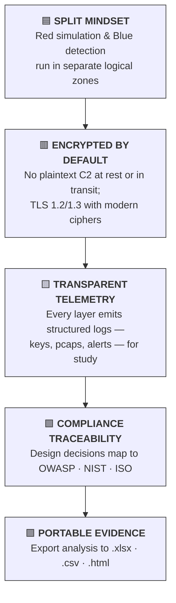

| Color | Principle | Design Consequence |
|-------|-----------|--------------------|
| 🟦 **Split Mindset** | separate the *attacker sim* and *defender lab* planes | distinct VLANs, credentials, and logging paths |
| 🟥 **Encrypted by Default** | no unencrypted `task`/`result` payloads anywhere | TLS with pinned self-signed CA + AES inner layer |
| 🟨 **Transparent Telemetry** | observability is a first-class citizen | SSLKEYLOG, pcap persistence, structured JSON logs |
| 🟩 **Compliance Traceability** | security frameworks drive design | controls table in [§ 11](#11--security-framework-compliance) |
| 🟪 **Portable Evidence** | analysts export, not copy-paste | reporting engine with 3 standardized formats |

---

## 3. 🎭 Threat Model & Motivation

> *"Why would an attacker wrap a beacon in TLS?"* — Because HTTPS is trusted, abundant, and (unless instrumented) opaque to defenders. This demo exists so defenders can **learn that exact opacity** and break it — at home, in a lab.

### 3.1 Motivation — The Opaqueness Problem

| Defender's Default View | What is Actually Inside |
|---|---|
| 🌐 Normal-looking HTTPS to `cdn.example.com` | 🔓 Encrypted tasking (get commands) |
| 🔒 TLS 1.3, looks "secure" | 📦 Encrypted callback (stolen/monitored data) |
| 🕒 Periodic, low-bandwidth | 🤖 Beacon heartbeat with sleep/jitter |

### 3.2 Attacker Assumptions (Red Model)

- **Capability:** encrypted transport that defeats passive sniffing.
- **Resilience:** TLS handshake failures are handled with retry/backoff.
- **OPSEC:** beacon blends with typical TLS client fingerprints (JA3 spoofing option).

### 3.3 Defender Assumptions (Blue Model)

- **Capability:** TLS inspection via key logging or MITM, plus behavior analytics.
- **Resilience:** alerts persist even while decryption is unavailable.
- **OPSEC (blue):** detection does **not** require plaintext — JA3/JA3S + timing heuristics operate on ciphertext alone.

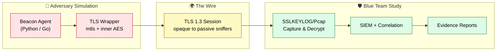

### 3.4 ATT&CK View (abridged)

| Stage | Technique | ID |
|---|---|---|
| Command & Control | Application Layer Protocol: HTTPS | `T1071.001` |
| Command & Control | Encrypted Channel: Symmetric/Asymmetric | `T1573.001/.002` |
| Command & Control | Protocol Tunneling (optional) | `T1572` |
| Persistence / Exec (demo-scoped) | Scheduled Task launch (optional, sandbox only) | `T1053.005` |

*Full mapping in [§ 13](#13--mitre-attck-mapping).*

---

## 4. 🧩 System Overview

### 4.1 High-Level Architecture

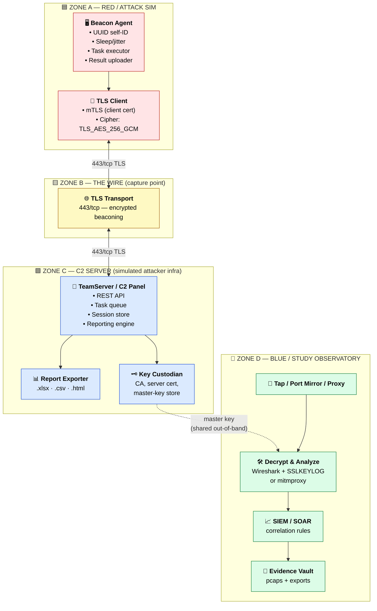

### 4.2 What Belongs Where

| Zone | Role | Key Assets | Isolation |
|---|---|---|---|
| **A — Red** | Beacon simulation | Agent binary, client cert | Own VM/container |
| **B — Wire** | Traffic observability | Mirror port / proxy | Passive capture only |
| **C — C2 Server** | Command & control (sim) | Panel, DB, keys | Firewalled subnet |
| **D — Blue** | Decrypt & detect | SSLKEYLOG, pcap, SIEM, reports | Analyst workstation cluster |

---

## 5. ⚙️ Component Deep-Dive

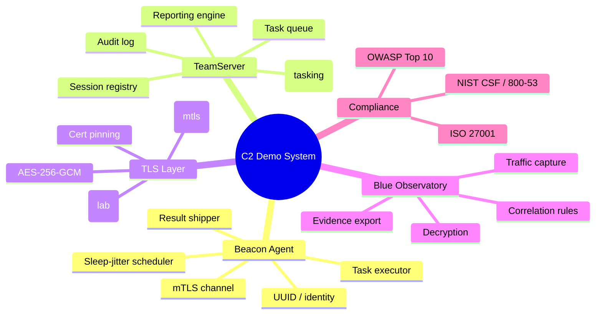

### 5.1 📟 Beacon Agent (`RED`)

| Concern | Specification |
|---|---|
| Language | Python 3.11+ or Go for the binary variant |
| Registration | POST `/api/v1/beacon/register` with HWID → gets UUID + server nonce |
| Heartbeat | HTTP POST to `/api/v1/beacon/ping` with sleep `30–60s` + jitter `±10–20%` |
| Tasking | Poll `/api/v1/beacon/tasks/{uuid}`; tasks wrapped and base64'd inside TLS |
| Execution | Command exec shim, file list, small exfil template (sandbox flags required) |
| Callback | POST `/api/v1/beacon/result` with session-bound ciphertext |
| OPSEC knobs | tunable JA3 string, custom `User-Agent`, beacon profile templating |

### 5.2 🧠 TeamServer / C2 Panel (`RED-SIM`)

| Concern | Specification |
|---|---|
| Base | Python FastAPI (or Go/Node) behind Nginx TLS terminator |
| Identity | Beacon UUID → session row; NIST-random nonces |
| Tasking | Queue per beacon; results correlated by `(uuid, task_id)` |
| Persistence | SQLite/Postgres; records are **encrypted** at rest (AES‑256) |
| Audit | Every admin action logged (ISO 27001 A.12.4) |
| Keys | Server RSA/EC key, client CA, master-key vault (see [§ 8](#8--tls-encryption-in-depth)) |

### 5.3 🔐 TLS Transport Layer (`ZONE B`)

| Concern | Specification |
|---|---|
| Protocol | TLS 1.3 preferred, TLS 1.2 fallback — **never** TLS 1.0/1.1 |
| Ciphers | `TLS_AES_256_GCM_SHA384` / `TLS_AES_128_GCM_SHA256` |
| Auth | ✓ server cert verified; optional client cert (mTLS) |
| Pinning | Beacon pins the lab CA hash to defeat casual pcap-MITM |
| KEYLOG | `SSLKEYLOGFILE` hook **only in lab builds** — never in "production" profile |
| SNI | Domain-fronting-style config map (cleartext lab domain) |

### 5.4 🛡️ Blue Observatory (`ZONE D`)

| Concern | Specification |
|---|---|
| Capture | tcpdump on mirror port → rotate pcaps |
| Decrypt | Wireshark/tshark with `(pre)-master secret` from SSLKEYLOG |
| Alternate | mitmproxy as proxy-in-path for real-time plaintext |
| Analytics | JA3/JA3S, fingerprint cluster, timing distribution, size histogram |
| Alerting | SIEM correlation rules (examples in [§ 10](#10--detection--analytics-pipeline)) |
| Output | report bundle: `.xlsx`, `.csv`, `.html` |

### 5.5 📊 Reporting Engine (`ZONE C` sidecar)

| Format | Content | Consumer |
|---|---|---|
| `.xlsx` | Pivot-ready tables: sessions, tasks, alerts, evidence timestamps | Analysts, dashboards |
| `.csv` | Raw machine-readable records (pcaps-derived flows, logs) | SIEM / automation |
| `.html` | Human-readable narrative report (timeline + screenshots + verdict) | Management review |

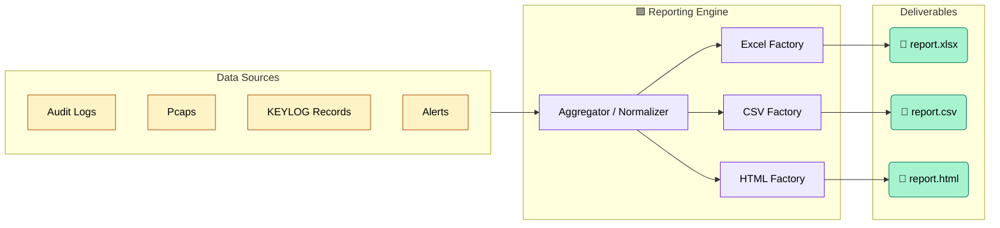

---

## 6. 🌐 Network & Deployment Topology

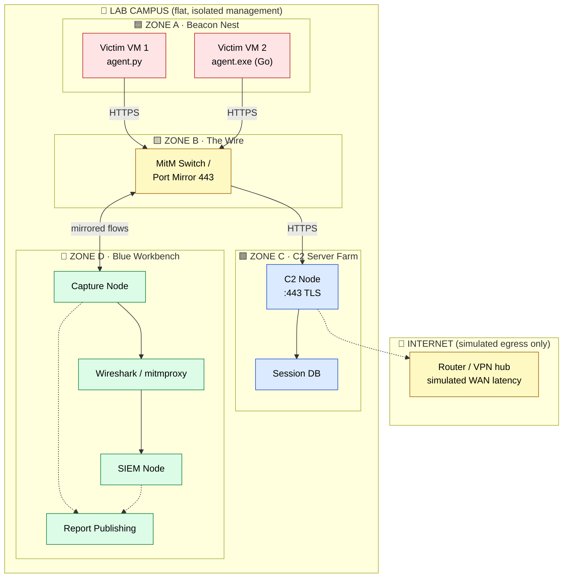

### 6.1 Port & Addressing Matrix

| Direction | Protocol | Port | Purpose | Firewall Rule |
|---|---|---|---|---|
| Beacon → C2 | TCP | **443/tcp** | TLS tasking/callback | Allow (Zone A → C only) |
| C2 ⇄ DB | TCP | 5432/tcp | Session persistence | Allow (Zone C internal) |
| Capture → Blue | — | 0 (tap) | Passive copy of 443 | Mirror only, no state |
| SIEM ⇄ Reporting | TCP | 9000/tcp | Evidence push | Allow (Zone D internal) |
| Admin → C2 | TCP | 8443/tcp | Panel UI (mTLS) | Admin subnet only |

> 💡 **Design rule:** Zone A can reach **only** Zone C `443/tcp`. Zone B is stateless. Zone C may not initiate toward Zone A.

---

## 7. 🔄 Protocol & Data Flow

### 7.1 Beacon Lifecycle (Sequence)

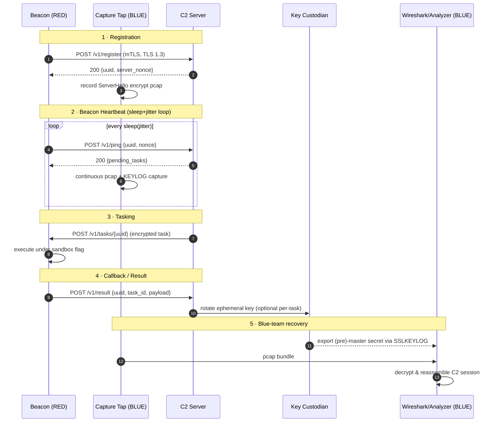

### 7.2 Beacon State Machine

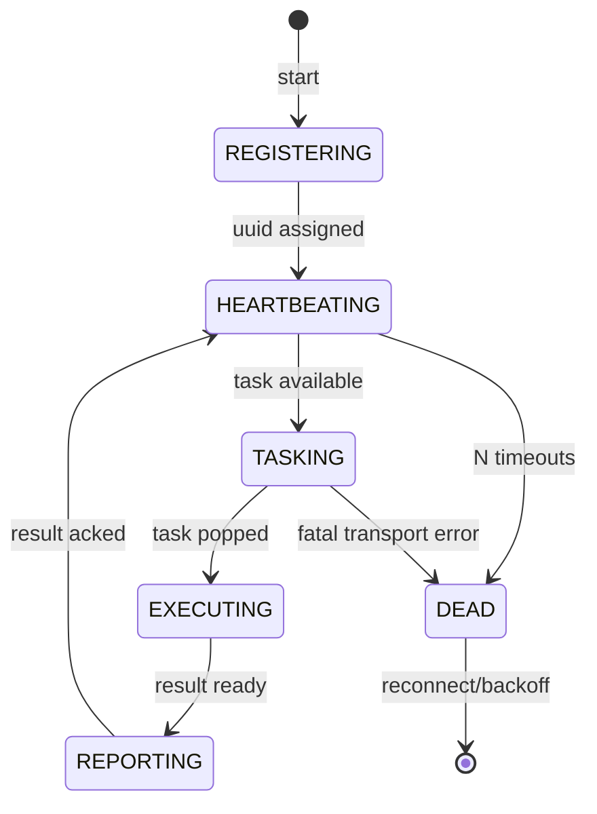

### 7.3 Inner Payload Format (after TLS decryption)

```
┌───────────┬─────────┬───────────────┬──────────────┬──────────────┐
│ Header    │ UUID    │ Task ID       │ Nonce        │ Encrypted    │
│ (4 B)     │ (16 B)  │ (8 B)         │ (16 B)       │ payload      │
└───────────┴─────────┴───────────────┴──────────────┴──────────────┘
  → All fields above are inside the TLS session.
  → Payload is AES-256-GCM with per-message nonce (inner layer).
```

---

## 8. 🔐 TLS Encryption in Depth

### 8.1 The Layered Encryption Model (Onion View)

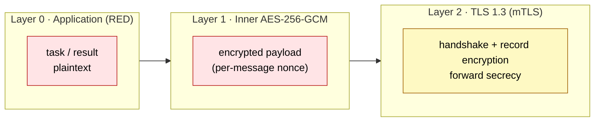

### 8.2 Key Hierarchy

| Key | Purpose | Storage | Escrow/Lab |
|---|---|---|---|
| Root CA (RSA-4096) | issues server + client certs | Hardware/encrypted store | **never** in pcap |
| Server TLS key | terminates TLS | C2 node | separate from DB |
| Client cert (beacon) | mTLS identity | injected at deploy | lab-only bundle |
| TLS session (pre)master | record encryption | **ephemeral** | captured in `SSLKEYLOGFILE` |
| Inner AES-256-GCM key | payload layer | rotates per task | logged for study |

### 8.3 Why Forward Secrecy Matters Here

- ECDHE/`X25519` → each session's traffic keys are ephemeral.
- Blue team relies on **session key capture at key time**, not stored server private key, for decryption — which is *exactly* the real-world PKI/KEYLOG mechanics worth practicing.

### 8.4 Config Compliance Snippet

| TLS Setting | Required Value | Controls |
|---|---|---|
| `min_version` | `TLSv1.3` (or `TLSv1.2`) | NIST SP 800-52, ISO A.8.24 |
| `ciphers` | `TLS_AES_256_GCM_SHA384` | NIST SP 800-52 |
| client cert | required for admin + optional beacon | ISO A.8.24, A.5.14 |
| renegotiation | disabled (TLS 1.3 default) | OWASP A02 |
| session tickets | bounded lifetime | NIST AC |

---

## 9. 🛡️ Blue-Team Decryption Lab

> The whole point of the demo: **take ciphertext-only traffic and recover the session for study.**

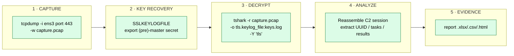

### 9.1 Capture

```bash
# on the mirror/capture node (Zone B)
sudo tcpdump -i ens3 'tcp port 443' -s 0 -w /evidence/c2_tls.pcap
```

### 9.2 Key Recovery (Lab Build)

```bash
# enable only in the LAB profile
export SSLKEYLOGFILE=/evidence/master_keys.log
./beacon_agent  --profile lab   # emits CLIENT_RANDOM + (pre-)master lines
```

### 9.3 Decryption

```bash
tshark -r /evidence/c2_tls.pcap \
  -o tls.keylog_file:/evidence/master_keys.log \
  -Y 'tls.handshake.type==1' \
  -2 -w /evidence/c2_decrypted.pcapng   # optional export
```

### 9.4 Alternate Path — In-Path Proxy (mitmproxy, TLS 1.2 fallback)

```bash
mitmproxy --set tls_version_client_min=TLSv1_2 \
          --listen-port 443 --mode transparent
```

> ⚠️ **Caveat:** mitmproxy replaces the server cert, so beacons must **not** pin in this mode — use it only to study *proxy-based interception*, and keep cert-pinning for the KEYLOG path.

### 9.5 What the Analyst Should Recover

- [x] Full TLS handshake metadata (Server Name, versions, cipher)
- [x] UUID registration and task IDs
- [x] Plaintext C2 commands + responses (as seen by server)
- [x] Heartbeat cadence histogram (sleep/jitter)
- [x] Exfil template payload sizes (lab-only, flagged)

---

## 10. 📈 Detection & Analytics Pipeline

### 10.1 Detection Stack

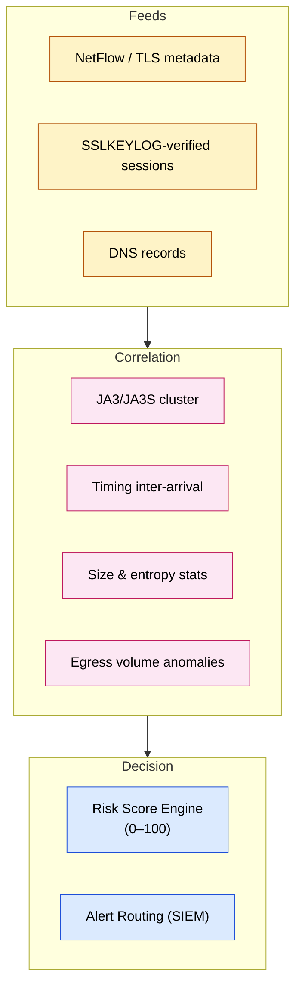

### 10.2 Sample Correlation Rules

| Rule | Trigger | Severity | Support |
|---|---|---|---|
| **Encrypted beacon heartbeat** | periodic POST /ping to same host, ~30–60s cadence | 🟠 High | TLS metadata |
| **Novel JA3/JA3S pair** | client fingerprint unseen in 30‑day baseline | 🟠 High | ciphertext-only |
| **TLS+exfil burst** | TLS to server with high variance in flow size | 🟡 Medium | pcap analysis |
| **Reg+ping+task cycle** | registration followed by periodic tasking | 🟡 Medium | decrypted study |
| **mTLS-only endpoint** | client cert auth observed to unusual IP | 🟡 Medium | TLS metadata |

### 10.3 Risk Scoring (Composite)

```
risk_score = 0.35·JA3_strength + 0.25·periodicity + 0.20·novel_DST
           + 0.10·size_hist_anomaly + 0.10·forced_decrypt_success
threshold_alert = 60  → escalate
```

---

## 11. 🛡️ Security Framework Compliance

> Three frameworks, one architecture. Every subsystem maps to controls below.

### 11.1 🟢 OWASP Top 10 (2021)

| OWASP ID | Area | Architecture response |
|---|---|---|
| **A01** Broken Access Control | C2 panel | RBAC + per-zone ACLs, least privilege |
| **A02** Cryptographic Failures | transport | TLS 1.3, AES-256-GCM, **no custom crypto** |
| **A03** Injection (SQL/XSS) | C2 API/panel | Parameterized queries, output encoding |
| **A04** Insecure Design | threat model | attack-surface mapping + red/blue isolation |
| **A05** Security Misconfiguration | TLS/backends | secure config templates, no debug in prod-profile |
| **A06** Vulnerable Components | toolchain | SBOM + pinned versions + update cadence |
| **A07** AuthN/Identity Failures | panel, beacons | mTLS, UUID tokens, MFA on admin console |
| **A08** Software/Data Integrity | agent binaries | signed builds + integrity checksums |
| **A09** Logging/Monitoring Failures | observability | structured logs, SSLKEYLOG, alerting |
| **A10** SSRF | panel URL fetchers | allowlist egress, network segmentation |

### 11.2 🟠 NIST CSF 2.0 + SP 800-53

| CSF Function | Example | SP 800-53 Control |
|---|---|---|
| **Govern (GV)** | risk register for the lab | SA-3, PL-2 |
| **Identify (ID)** | asset inventory of VMs/containers | CM-8, RS-2 |
| **Protect (PR)** | TLS 1.3 + AES-256-GCM transport | SC-8, SC-13, IA-5 |
| **Protect (PR)** | mTLS for panel calls | IA-2, IA-4 |
| **Detect (DE)** | correlation rules + JA3 baseline | AU-6, SI-4 |
| **Respond (RS)** | IR playbook for caught beacons | IR-4, IR-6 |
| **Recover (RC)** | evidence re-export, golden pcap restore | IR-4, CP-4 |

### 11.3 🔵 ISO/IEC 27001:2022 Annex A

| ISO Control | Focus | Architecture Mapping |
|---|---|---|
| **A.5.14** Info transfer | secure channels | TLS-wrapped beacon transport |
| **A.8.24** Use of crypto | algorithms/key mgmt | AES-256-GCM, X25519, key custodians |
| **A.8.10** Info in cloud (n/a in lab) | hosting policy | on-prem isolated enclave |
| **A.8.9** Config mgmt | secure baselines | config-as-code lab templates |
| **A.8.12** Vulnerabilities | assessments | scanning cadence + SBOM |
| **A.8.15/16** Logging & events | monitoring | structured logs → SIEM |
| **A.8.26** Apps security | secure dev | OWASP-ASVS-informed review |

---

## 12. 📊 Reporting Engine: Export Formats

### 12.1 Format Decision Matrix

| Criterion | `.xlsx` | `.csv` | `.html` |
|---|---|---|---|
| Readability for humans | 🟢 | 🟡 | 🟢 |
| Machine consumption (SIEM) | 🟡 | 🟢 | 🔴 |
| Formatting/pivots | 🟢 | 🔴 | 🟢 (CSS) |
| Chart embedding | 🟢 | n/a | 🟢 |
| File-size for big data | 🟡 | 🟢 | 🟡 |
| Recommended for | dashboards, stakeholders | automation, long-term store | management briefings |

### 12.2 Bundled Report Contents

| 📄 Sheet / Section | .xlsx | .csv | .html |
|---|---|---|---|
| Session inventory (UUID, times) | ✅ | ✅ | ✅ |
| Flow/TLS metadata table | ✅ | ✅ | ✅ |
| Task & result records (decrypted) | ✅ | ✅ | ✅ |
| Alert & risk-score history | ✅ | ✅ | ✅ |
| MITRE ATT&CK coverage | ✅ | — | ✅ |
| Controls traceability (OWASP/NIST/ISO) | ✅ | — | ✅ |
| Timeline visualization | ✅ (chart) | 🔴 | ✅ (JS/CSS) |

### 12.3 Example CSV Schema

```csv
ts,uuid,src_ip,dst_ip,ja3,sni,tls_version,cipher,action,payload_size,risk
2026-09-20T10:00:01Z,8f3a…,10.0.20.5,10.0.30.10,…,…,TLSv1.3,TLS_AES_256_GCM_SHA384,register,412,12
```

### 12.4 Immutable Evidence Bundling

```bash
evidence_bundle/
├── c2_tls.pcap            # raw capture (Zone D)
├── master_keys.log        # SSLKEYLOG
├── c2_decrypted.pcapng    # verified plaintext replay
├── report.xlsx            # pivot tables + charts
├── report.csv             # raw flows / sessions
└── report.html            # narrative + timeline
```

---

## 13. 🎯 MITRE ATT&CK Mapping

| ID | Name | Layer Used | Demo Evidence |
|---|---|---|---|
| `T1071.001` | HTTPS App‑Layer Protocol | transport | real TLS POSTs |
| `T1573.001` | Symmetric crypto channel | inner AES-GCM | decrypted payload |
| `T1573.002` | Asymmetric crypto channel | TLS PKI/mTLS | cert chain capture |
| `T1105` | Ingress tool transfer (optional) | task→agent | task payload sizes |
| `T1041` | Exfiltration over C2 | callback path | result sizes (flagged) |
| `T1053.005` | Scheduled Task (lab-only) | optional persistence | sandbox demo |

---

## 14. 🗓️ Implementation Roadmap

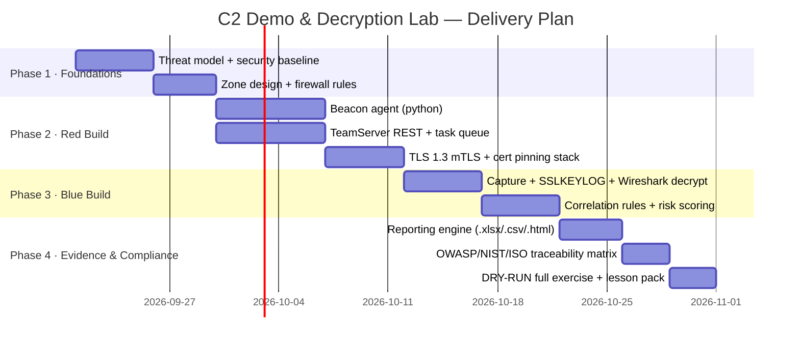

### ✅ Phase Deliverables

| Phase | Exit Criteria | Artifact |
|---|---|---|
| 1 | Approved threat model & lab network | `architecture_v1.pdf`, firewall ruleset |
| 2 | Beacon ↔ C2 TLS-session working | repo tag `v0.1-red` |
| 3 | Gold-standard decrypt & detections fire | evidence bundle + rule pack |
| 4 | Three export formats published | `report.*` + compliance matrix |

---

## 15. 🔧 Hardening & Security Controls

### 15.1 Red/Blue Hygiene

- 🔴 Beacon runs only under `--sandbox` on throwaway VMs; snapshots reset after each exercise.
- 🔵 Analysts use a dedicated, quarantined evidence LAN; key material stored in a vault, rotated per exercise.
- 🚫 **Never** reuse `SSLKEYLOGFILE` profile outside the lab; **never** attach live Internet.

### 15.2 Controls Inventory (quick check)

| Control | Where | Verdict |
|---|---|---|
| TLS 1.2/1.3 enforced, weak ciphers banned | Zone B terminator | ✅ |
| No plaintext C2 payloads at rest | C2 DB | ✅ |
| Per-exercise CA + key rotation | Key Custodian | ✅ |
| Structured logs shipping to SIEM | all zones | ✅ |
| Signed Beacon binaries | release pipeline | ✅ |
| Least-privilege ACLs A→B→C→D | zones | ✅ |
| AuthZ on panel (RBAC/MFA) | C2 console | ✅ |

---

## 16. 🧠 Assumptions, Risks & Glossary

### 16.1 Assumptions

1. Lab is **fully air-gapped** from production and Internet C2.
2. All entities consented/authorized (own infra or scoped engagement).
3. TLS decryption is possible because lab keys are captured/escrowed at session time.
4. Analysts have Wireshark + SIEM familiarity (training pack included).

### 16.2 Risk Register (top items)

| Risk | Likelihood | Impact | Mitigation |
|---|---|---|---|
| Lab breakout / uncontained agent | Low | High | isolation VLAN, snapshots, disabled egress |
| Key/cert leak | Medium | High | vault, rotation, per-exercise CA |
| Detection drift (false positives) | Medium | Medium | baseline rebuild of JA3/timing |
| Legal misuse of demo | — | Critical | explicit authorization banner + logging |

### 16.3 Glossary

| Term | Meaning |
|---|---|
| **Beacon** | client that phones home periodically (heartbeat) for tasking |
| **C2 / C&C** | Command & Control — server channel used by the agent |
| **Jitter** | randomized variance added to sleep cycles |
| **mTLS** | mutual TLS — both sides present certificates |
| **SSLKEYLOGFILE** | file where TLS clients dump session keys (lab-inspection only) |
| **JA3 / JA3S** | TLS client/server fingerprint from handshake fields |
| **SNI** | Server Name Indication — domain inside ClientHello |

---

## 🏁 Closing

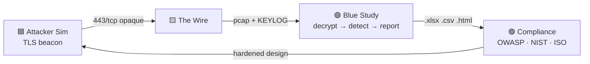

> **Takeaway:** This blueprint gives the blue team a **safe, reversible, fully-instrumented** C2 demo — encrypted on the wire, decryptable on demand, auditable against three frameworks, and exportable in three report formats. Every layer is a teaching surface.

> [!NOTE]
> Maintainers: keep this document versioned alongside the repo. On any topology change, update **§ 4–6** and the compliance tables in **§ 11** to keep traceability honest.

*© Security Study / Blue Team Education — authorized lab use only.* 🔒