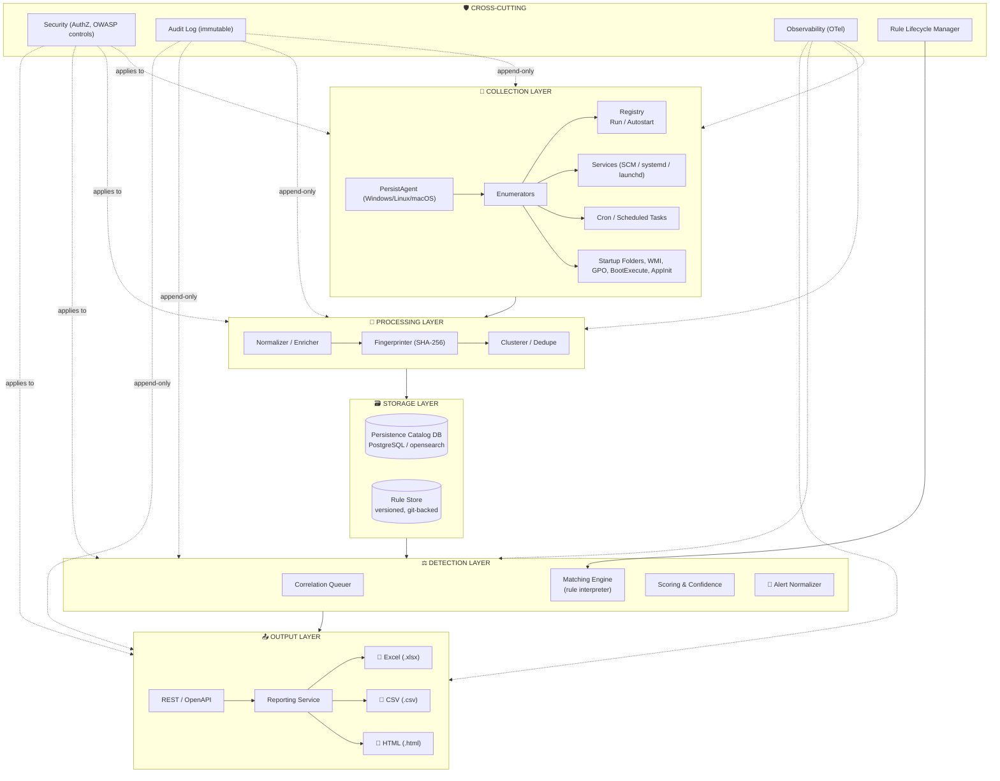
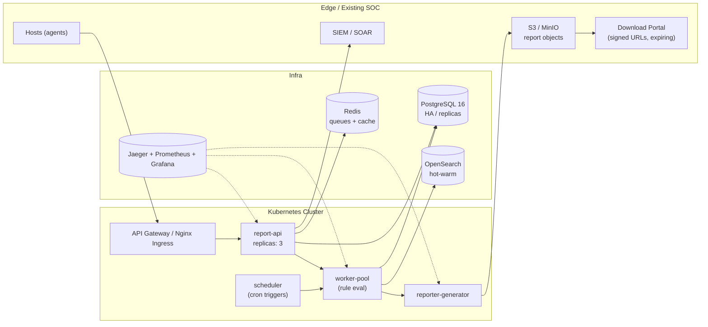
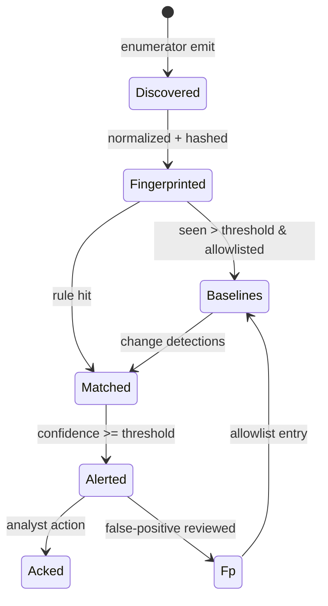
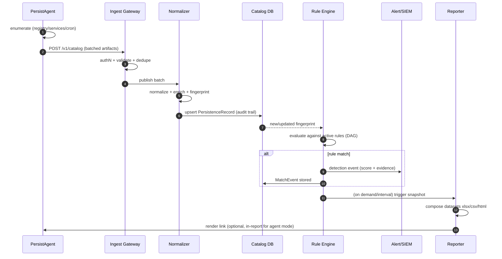
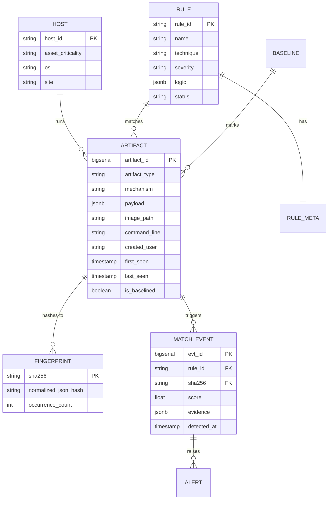
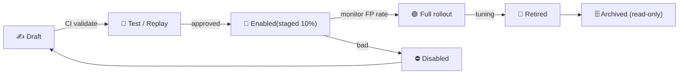
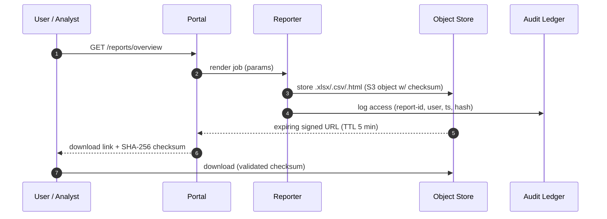
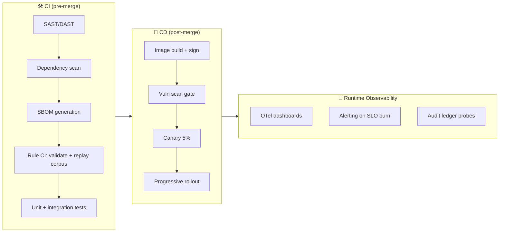

<div align="center">

# 🛡️ Persistence Mechanism Catalog & Matching Detection Engine

### *Solution Architecture Document*

**Acronym:** **PEM-CAT** — *Persistence Mechanism Cataloguing & Correlation Against Detection Rules*

   

**OWASP** 🟠 **NIST** 🔵 **ISO/ISE** 🟢 &nbsp;·&nbsp; Reports in **`.xlsx`** · **`.csv`** · **`.html`**

---
</div>

---

## 🧭 Table of Contents

| # | Section | # | Section |
|---|---------|---|---------|
| 1 | [Solution Landscape](#1-solution-landscape) | 9 | [Persistence Catalog (Data Model)](#9-persistence-catalog--data-model) |
| 2 | [Goals & Non-Goals](#2-goals--non-goals) | 10 | [Detection Rules Engine & Matching](#10-detection-rules-engine--matching) |
| 3 | [High-Level Architecture](#3-high-level-architecture) | 11 | [Reporting & Download Module](#11-reporting--download-module) |
| 4 | [Core Components](#4-core-components) | 12 | [Security Framework Mapping](#12-security-framework-mapping) |
| 5 | [Collection Layer & Sources](#5-collection-layer--sources) | 13 | [Threat Model & Abuse Cases](#13-threat-model--abuse-cases) |
| 6 | [Persistence Mechanism Taxonomy](#6-persistence-mechanism-taxonomy) | 14 | [Non-Functional Requirements](#14-non-functional-requirements) |
| 7 | [Data Flow & Sequencing](#7-data-flow--sequencing) | 15 | [Observability & CI/CD](#15-observability--cicd) |
| 8 | [Technology Stack](#8-technology-stack) | 16 | [Roadmap & Road to MVP](#16-roadmap--road-to-mvp) |

---

## 1. Solution Landscape

> [!NOTE]
> **Problem statement** — Attackers rely on **persistence** to survive reboots and retain access. MITRE ATT&CK lists **15+ persistence techniques** (T1547 *Boot/Logon Autostart*, T1053 *Scheduled Task*, T1543 *Create or Modify System Process*, etc.). Defenders need a **curated catalog** of every legitimate/anomalous persistence artifact on a host, auto-matched against a **correlation rule-set** to flag suspicious activity.

### 1.1 What this solution does

| Capability | Description |
|------------|-------------|
| 🔍 **Discover & Catalog** | Continuously inventories persistence artifacts across the fleet — Registry run/autostart keys, Services, Cron jobs / Scheduled Tasks, Startup folders, WMI persistence, Boot Execute, GPO, LaunchDaemons/Agents, AppInit, etc. |
| 🧩 **Normalize** | Every artifact is normalized into a **canonical PersistenceRecord** with a deterministic **fingerprint** (hash of normalized fields). |
| ⚖️ **Match & Correlate** | Compares artifacts against **detection rules** (signature, heuristic, behavioral, allowlist) with scoring & confidence. |
| 🚨 **Alert & Report** | Emits detections to SIEM/alerting and produces **downloadable reports** (`.xlsx`, `.csv`, `.html`). |
| 📜 **Audit & Govern** | Full immutability trail; every catalog entry keeps provenance (who/what/when, source, hash). |


### 1.2 Position in a wider SOC stack

```mermaid
flowchart LR
    subgraph Host["🖥️ Endpoints / Servers"]
        A[Web <br/>Event Collector] --> B[Persistence <br/>Catalog Agent]
        C[Cron / Scheduler <br/>Scanner] --> B
        D[Registry / Services <br/>Enumerator] --> B
    end
    B -->|telemetry| E((Message Bus))
    E --> F[⛏️ Catalog Normalizer]
    F --> G[(Persistence <br/>Catalog DB)]
    G --> H[⚖️ Detection <br/>Rule Engine]
    H --> I[🚨 Alerting / SIEM]
    H --> J[📊 Reporting & <br/>Download Service]
    J --> K["report.xlsx", "report.csv", "report.html"]
    R[🔒 Rule <br/>Management API] --> H
```

---

## 2. Goals & Non-Goals

### ✅ Goals
- **G1** — Build a vendor-agnostic catalog of persistence artifacts with rich metadata & provenance.
- **G2** — Match artifacts against a versioned, testable **detection-rule store** (registry, cron/scheduled tasks, services).
- **G3** — Provide **multi-format download reports** (`.xlsx`, `.csv`, `.html`) with tamper-evident metadata.
- **G4** — Map controls to **OWASP Top 10 (2021)**, **NIST CSF 2.0 / SP 800-53 Rev.5 / SP 800-171**, **ISO/IEC 27001:2022**.
- **G5** — Scale to **100k+ hosts**, rule evaluation ≤ **2 s / host**, catalog freshness ≤ **60 s**.

### 🚫 Non-Goals
- Not a full antivirus/EDR replacement (detection — not prevention or response).
- No custom agent kernel hooks / AMSI patching in v1 (uses standard OS APIs).
- No re-implementation of the OS scheduler; we **observe & parse** it.
- v1 will not auto-remediate — alerts are advisory (human-in-the-loop).

---

## 3. High-Level Architecture

### 3.1 Logical view



### 3.2 Deployment view



---

## 4. Core Components

| # | Component | Responsibility | Tech Exemplars |
|---|-----------|----------------|----------------|
| 1 | **PersistAgent** | Lightweight host collector. Enumerates persistence points via OS APIs (no kernel hooks). | Go / Rust, eBPF (Linux), WMI/WinRM, systemd/launchd parsers |
| 2 | **Ingest Gateway** | AuthN, rate-limit, validate, dedupe, publish. | Envoy, Kafka/RabbitMQ, schema-validation (JSON Schema) |
| 3 | **Normalizer & Enricher** | Converts raw enumerations into canonical `PersistenceRecord`; joins enrichment (user→asset, file→hash/AV verdict, threat-intel). | Apache Flink / Spark Structured Streaming |
| 4 | **Fingerprinter** | Deterministic SHA-256 content hash → stable `persistence_fp`. Dedupes identical artifacts across hosts. | library in Go/Python |
| 5 | **Persistence Catalog DB** | Central store: hosts, artifacts, history, baselines, allowlists. | PostgreSQL 16 (+ Citus for scale) / OpenSearch |
| 6 | **Rule Store** | Versioned, human-readable detection rules; CI-tested (unit + replay). | Git + YAML, validation schema |
| 7 | **Detection Rule Engine** | Compiles rules → DAG; evaluates per fingerprint/host; produces matches w/ confidence & evidence. | Python (e.g., custom interpreter) / Go |
| 8 | **Scoring & Alerting** | Risk-scoring (asset criticality × rule severity × recency), dedupe/group, enrich, forward. | Redis, SIEM/SOAR connectors, webhooks |
| 9 | **Reporting Service** | Composes catalog & detection datasets; generates downloadable artifacts. | Jinja2/HTML, Python `openpyxl`/`xlsxwriter`, `pandas` |
| 10 | **Rule Management API** | CRUD, versioning, dry-run simulation, audit of rules. | OpenAPI 3, RBAC |
| 11 | **Audit Ledger** | Append-only event log of every change (who/when/what/hash). | PostgreSQL WAL-to-S3 or OpenSearch + shadow-digest |

---

## 5. Collection Layer & Sources

| Source group | Specific collectors | OS | Frequency | Notes |
|--------------|--------------------|----|-----------|-------|
| 🪟 **Registry** | `HKLM\Software\Microsoft\Windows\CurrentVersion\Run*`, `Winlogon\Userinit`, `Shell\Explorer\Run`, `Active Setup`, `AppInit_DLLs`, `Image File Execution Options`, `ServiceDll` | Windows | 60 s / on-change | WMI + registry change notifications |
| ⚙️ **Services** | Windows SCM services (`sc query`), Linux `systemd` units, `init.d`, macOS LaunchDaemons/Agents | All | 60 s | Image path, `DelayedAutostart`, failure restart, DLL sideloading heuristics |
| ⏰ **Cron / Scheduled Tasks** | Windows Task Scheduler, crontab (per-user/root), `/etc/cron.{d,daily,...}`, systemd timers, `at` | All | 120 s | Track `cmdline`, creator SID, hidden trigger patterns |
| 📂 **Startup folders** | `%APPDATA%\Microsoft\Windows\Start Menu`, `/etc/profile.d`, `~/.bash_profile`, `/Library/LaunchAgents` | All | 120 s | Executable file hashing |
| 🐍 **WMI persistence** | `__EventSubscription`, `__EventFilter`, `__EventConsumer` | Windows | 300 s | CommandLine consumers alert-heavy |
| 🧠 **OS internals** | BootExecute, Login Items, LSM (RunServicesOnce/Once), GPO scheduled scripts, NSSM, Docker `--restart`, webhook schedulers (e.g., CI runners, cloud-init) | All | 300 s | Enumerated via parsers |

> 📡 **Pluggability** — Each collector implements a common `Enumerator` interface: `enumerate() → []RawArtifact`. New sources (GPO, launch daemons, k8s CronJob, cloud-init) plug in **without touching the core**.

---

## 6. Persistence Mechanism Taxonomy

> Mapped to **MITRE ATT&CK** techniques for uniformity in rules.

### 6.1 Technique coverage (subset)

| ATT&CK ID | Technique | Included artifact types |
|-----------|-----------|------------------------|
| `T1547.001` | Registry Run Keys / Startup Folder | Autostart keys, Startup folders |
| `T1547.002` | Login Items | macOS LoginItems |
| `T1547.009` | Shortcut Modification | `.lnk`, `.desktop` auto-start |
| `T1547.011` | Boot Execute | BootExecute, `BootCfg` |
| `T1543.001` | Create or Modify System Process: Service | SCM / launchd / systemd units |
| `T1543.003` | Windows Service | service image path, binPath |
| `T1053.003` | Cron | crontab, cron.d, anacron, systemd timers |
| `T1053.005` | Scheduled Task | `schtasks`, Task Scheduler XML |
| `T1546.001` | WMI Event Subscription | filter/consumer/provider triplets |
| `T1179` | Hooking / DLL | AppInit_DLLs, IFEO, shimming |
| `T1068` | (Supporting) Privilege Escalation context | run-as, `UAC` triggers (comply payload) |

### 6.2 Canonical persistence states



---

## 7. Data Flow & Sequencing

### 7.1 End-to-end sequence (happy path)



### 7.2 Matching semantics (detection rules)

| Rule dimension | Covered | Examples |
|----------------|---------|----------|
| **Signature / IOCs** | 🟢 | Hash match of image path, exact registry value, service name |
| **Heuristic / behavioral** | 🟢 | Unusual dirs (AppData, Temp, /tmp), renamed system binary |
| **Baseline deviation** | 🟢 | Artifact not seen in N-day configured baseline |
| **Correlation across hosts** | 🟢 | Same fingerprint on > X hosts in Y hours (lateral movement) |
| **Reputation/TI** | 🟢 | Image hash present in threat-intel feed |
| **Time-based (cron burst)** | 🟢 | Cron payload runs minutes after drop-of-file event |

---

## 8. Technology Stack

| Layer | Choice | Rationale |
|-------|--------|-----------|
| Host Agent | **Go 1.23** | Static binary, low memory, easy cross-compile |
| Ingest bus | **Kafka (Redpanda)** | High-throughput, replays, ordering |
| Normalization | **Apache Flink / Go workers** | Stream processing + state |
| Catalog DB | **PostgreSQL 16 (+Citus)** | SQL, JSONB, FKs, fast lookups |
| Search/analytics | **OpenSearch** | Drill-down, faceted catalog browsing (used for TP report data model) |
| Cache/Queue | **Redis** | Dedup cache, rate-limit, scoring bursts |
| Rule engine | **Python (custom interpreter + lark grammar) / Go** | Testability, DSL clarity |
| API | **FastAPI / OpenAPI 3** | Schema-first, generated SDKs |
| Reporting | **XlsxWriter + pandas + Jinja2** | Exact `.xlsx` sheets, `.csv`, static `.html` |
| Observability | **OpenTelemetry → Prometheus/Grafana/Jaeger** | Distributed traces & metrics |
| Deploy | **Docker + K8s (Helm), GitOps (ArgoCD)** | Scalable, reproducible |

---

## 9. Persistence Catalog — Data Model

### 9.1 Entity relationships (concise)



### 9.2 Core table: `artifact` (subset of fields)

| Column | Type | Purpose |
|--------|------|---------|
| `artifact_id` | `bigserial PK` | Surrogate key |
| `host_id` | `FK → host` | Provenance of host |
| `artifact_type` | `enum` | `registry` / `service` / `cron` / `startup` / `wmi` / `os_internal` |
| `mechanism` | `text` | Full descriptor e.g. `HKCU\...\Run\Updater` |
| `payload` | `jsonb` | Raw normalized record (image path, cmdline, trigger, owner, timestamps) |
| `image_path` | `text` | Path used for existence + hash checks |
| `command_line` | `text` | Executed command (parsed) |
| `fingerprint_sha256` | `text` | Deterministic content hash |
| `first_seen` / `last_seen` | `timestamptz` | Lifecycle window |
| `is_baselined` | `bool` | Allowlisted from the last N days |
| `source_rid` | `text` | Raw collector event id (provenance) |
| `ttl_days` | `int` | Catalog retention policy |

---

## 10. Detection Rules Engine & Matching

### 10.1 Rule lifecycle



### 10.2 Rule DSL (YAML, example)

```yaml
id: PEM-CAT-0001
name: Suspicious Registry AutoStart in User Startup
version: 3
technique: T1547.001
platform: windows
severity: high
owners: [blue-team-content]
logic:
  artifact_type: registry
  any:
    - mechanism ~ "(^|\\\\)CurrentVersion\\\\Run"
    - payload.command_line ~ "AppData|Temp|/tmp|Public"
  threat_intel:
    image_hash: present
  baseline:
    seen_before_days: 14
    condition: NOT_IN_BASELINE
scoring:
  base: 60
  add: 10
  if: mismatch_signed == true
confidence_formula: clip(0.6 + 0.4 * intel_hit + 0.2 * (not baselined), 0, 1)
suppress: {group_by: fingerprint_sha256, window: 24h}
tests:
  - name: "benign update daemon path"
    input: { mechanism: "...\\Run\\Updater", payload: {command_line: "C:\\Program Files\\Updater\\u.exe"} }
    expect: no_match
  - name: "malicious temp dropper"
    input: { mechanism: "...\\Run\\svchost", payload: {command_line: "C:\\Users\\Public\\svch0st.exe"} }
    expect: match_confidence: 1.0
```

### 10.3 Matching engine internals

| Step | Description |
|------|-------------|
| 1. **Compile** | YAML rules → typed `MatchPlan` (regex compiled once, cached). |
| 2. **Gate** | Platform/OS & rule-status filtering (staged & active only). |
| 3. **Eval** | Per-fingerprint evaluation; baseline & TI lookups batched (SQL `IN`). |
| 4. **Score** | Severity × confidence + asset criticality (weighted). |
| 5. **Suppress/Dedupe** | Group identical events within window; honor analyst snooze. |
| 6. **Enrich & emit** | Attach evidence (raw record, matched-fields diffs), forward to alerting & store. |

### 10.4 Performance budget

| Metric | Budget |
|--------|--------|
| Rule compile→cache cold start | < 5 s per 2 000 rules |
| Per-fingerprint eval (warm) | < 2 ms |
| Catalog-to-eval end-to-end | < 2 s / host |
| Alert emit → SIEM | < 1 s p95 |
| Report generation `.xlsx` (100k rows) | < 45 s |

---

## 11. Reporting & Download Module

### 11.1 Formats

| Format | Engine | Use-case |
|--------|--------|----------|
| 📗 **`.xlsx`** | XlsxWriter | Analyst pivot; **multi-sheet**: Overview, Artifacts, Matches, Hosts, Rules, Metrics, BaselineDiff. Conditional color: ⚠️ red = high severity. |
| 📕 **`.csv`** | pandas / stdlib | Ingestion into SIEM/Excel legacy tooling; streamed to avoid memory blowup. |
| 📘 **`.html`** | Jinja2 + embedded Chart.js | Self-contained, unfurl-friendly, interactive filters; emailable; **auto-open in agent-local mode**. |

### 11.2 Report types & schedules

| Report | Trigger | Default schedule | Retention |
|--------|---------|------------------|-----------|
| `catalog_snapshot` | On-demand / daily | 23:00 UTC | 90 d |
| `detection_summary` | Per alert burst | on match + daily digest | 30 d |
| `baseline_diff` | Weekly | Sun 01:00 UTC | 30 d |
| `compliance_mapping` | Monthly | 1st of month | 12 mo |
| `rule_coverage` | On rule change | `post-commit` CI | 12 mo |

### 11.3 Download flow (secure)



### 11.4 Sample `.xlsx` sheet layout

| Sheet | Columns (subset) | Styling |
|-------|------------------|---------|
| **Overview** | Report id, generated_at, filters, rule counts, match counts | Header fill navy, KPI cards |
| **Artifacts** | artifact_id, host, type, mechanism, image_path, first_seen, fingerprint | Auto-filter, freeze top row, EVEN shading |
| **Matches** | rule_id, technique, severity, score, evidence, asset_criticality, status | Conditional red/yellow cells |
| **Hosts** | host_id, os, site, artifact_count, open_matches, criticality | Sparkline of activity |
| `...` | `compliance_mapping`, `baseline_diff`, `rule_coverage` | As designed |

---

## 12. Security Framework Mapping

### 12.1 OWASP Top 10 (2021) → control implementation

| OWASP ID | Risk | Where addressed | Mitigation |
|----------|------|-----------------|------------|
| **A01** | Broken Access Control | API, Portal, Report download | RBAC + ABAC, signed short-lived URLs, object ownership checks, deny-by-default |
| **A02** | Cryptographic Failures | Transport, at-rest | TLS 1.3, envelope encryption (KMS), SHA-256 fingerprints, key rotation |
| **A03** | Injection | Rule DSL, SQL, XSS planes | Parameterized SQL; rule DSL validation layer (PEG parser, no eval); CSP + output-encoding in HTML reports |
| **A04** | Insecure Design | Rule engine + catalog | Threat-modeled flows, baseline deviation as first-class detection, abuse-case tests |
| **A05** | Security Misconfiguration | Agents, containers | Immutable images, hardened base (DISA STIG), secrets via Vault, image scanning |
| **A06** | Vulnerable Components | Dependency chain | SBOM (CycloneDX) generation, automated dependency-update gates, CVE feed watch |
| **A07** | ID & Auth Failures | API/Portal | MFA for analysts, strong password policy, session binding, OIDC/SAML SSO |
| **A08** | Software & Data Integrity Failures | Rules, reports | Git-signed commits for rules, report SHA-256 checksums, trust chain for agent binaries |
| **A09** | Logging & Monitoring Failures | Full fleet | Pervasive OpenTelemetry, audit ledger, alert on missing heartbeats |
| **A10** | SSRF | Enrichment/TI calls | Allow-listed egress, no user-supplied URLs, SSRF guard (DNS pinning + proxy) |

### 12.2 NIST CSF 2.0 & SP 800-53 **Rev.5** mapping

| CSF Func | CSF Subcategory | Controls | Implemented in |
|----------|-----------------|----------|----------------|
| **Govern** | GV.SC-04 | CA-5, CA-7, SA-11 | Mapped controls table, ongoing risk review |
| **Identify** | ID.AM-06 | CM-2, CM-6, CM-8 | Catalog = asset/configuration inventory; baselines = configuration baselines |
| **Protect** | PR.AA-02 | AC-6, IA-2 | RBAC + MFA on rule/report APIs |
| **Protect** | PR.DS-01/-02 | AU-10, SC-28 | At-rest & in-transit encryption, tamper-evident reports |
| **Detect** | DE.CM-07 | SI-3, SI-4, SI-7 | Continuous artifact monitoring, matching engine integrity checks |
| **Detect** | DE.AE-01/-02 | AU-6, SI-6 | Match events → audit records, alert aggregation |
| **Respond** | RS.CO-02 | IR-4, IR-6 | Alert structure w/ evidence → SOAR playbooks |
| **Recover** | RC.RP-01 | CP-10, IR-4 | Re-run baselines + restore catalog from snapshot |

> Additional overlay with **SP 800-171**: keep artifact data under **NIST SP 800-171 control family** when deployed in CUI environments (`3.4 Configuration Management`, `3.5 Identification and Authentication`, `3.8 System and Communications Protection`).

### 12.3 ISO/IEC 27001:2022 Annex A mapping

| ISO Annex A | Control | Our mechanism |
|-------------|---------|---------------|
| **5.10** | Information security use of cloud services | K8s + managed cloud, shared responsibility, egress controls |
| **5.16 / 5.17 / 5.18** | Identity & access | SSO + MFA + lifecycle management; least privilege service accounts |
| **6.8** | Information security event reporting | Flexible alert webhooks; SIEM/SOAR intents |
| **7.9** | Protection of data | Encryption, backups, retention policies on reports |
| **7.10** | Protection against malware | Matching engine integrates TI and file reputation |
| **7.12** | Information & related tech protection | Minimal attack surface on agents, signed binaries, no admin req. by default |
| **8.15** | Access control for IT security controls | RBAC on rule management; approval workflow (staged rollout) |
| **8.28** | Secure coding | SDL gates: SAST/DAST, OWASP-guided code review, signed commits |

---

## 13. Threat Model & Abuse Cases

| # | Abuse case | Vector | Guard |
|---|-----------|--------|-------|
| 1 | Attacker supplies malicious cron args | cron collector trust | Fingerprint includes normalized argv; heuristic flags uncommon delivery dirs |
| 2 | Attacker plants registry run key masking as legit (`svchost.exe` in Temp) | registry collector | Baseline deviation + unsigned/unknown-image scoring |
| 3 | Attacker edits/poisons detection rules | rule store | Git signed commits, dual-review, CI gate, severity caps on self-merge |
| 4 | Report download link robbery/horiz. escalation | object store | Signed expiring URLs bound to user+IP, ownership check |
| 5 | Rule-engine DoS via pathological regex | rule DSL | Regex timeout/finite-state guard, complexity linting, worker isolation |
| 6 | Agent spoofing (fake host telemetry) | ingest | mTLS agent identity, nonce challenge, heartbeat anomaly detection |
| 7 | Catalog/DB tampering | storage | WAL-to-S3 shadow digest, periodic hash-verify reconciliation |
| 8 | XSS inside `.html` report fields (host/rule names) | report generator | Output-encoding, CSP nonce, field allowlists |

---

## 14. Non-Functional Requirements

| NFR | Target |
|-----|--------|
| **Performance** | 100k hosts; ≤ 2 s host-to-eval; report xlsx(100k) < 45 s |
| **Availability** | 99.9% (reporting & API), agents resilient to backhaul loss (spool & replay) |
| **Scalability** | Stateless workers; horizontal scaling of catalog shards & rule engine |
| **Security** | TLS 1.3, secrets in Vault, agent mTLS, at-rest KMS encryption, audit ≥ 400 d |
| **Compliance** | OWASP, NIST CSF/800-53/800-171, ISO 27001 mappings maintained & tested |
| **Retention** | Catalog base 180 d, fingerprints 365 d, reports 90 d, audits 400 d (configurable) |
| **Observability** | OTel traces/metrics; SLOs (eval p95, report p95); RUM not required |

---

## 15. Observability & CI/CD



**SLO dashboard essentials:** catalog freshness (% hosts reporting < 90 s), rule eval latency p95, match→alert latency, report generation duration, FP rate per rule, agent heartbeat coverage.

---

## 16. Roadmap & Road to MVP

### v0 (MVP) — 💡
- PersistAgent for **Windows** (registry + services + scheduled tasks) and **Linux** (systemd + cron) only.
- Catalog DB + fingerprinting + baseline.
- 25 hand-written detection rules (registry/services/cron).
- Report service: `.xlsx`, `.csv`, `.html` (all three!) with basic RBAC + signed download URLs.

### v1 — 🚀
- macOS launchd support; WMI subscriptions; GPO enumeration.
- TI feed integration; correlation across hosts.
- Rule CI-approval workflow; staged rollout; FP telemetry per rule.

### v2 — 🌐
- eBPF-assisted (Linux) & ETW (Windows) deltas; near-real-time.
- SOAR playbook connectors; auto-quarantine (out of scope MVP, opt-in).
- Multi-tenant & RBAC expansion; ISO/NIST control-evidence export inside reports.

---

## Appendix A — Glossary

| Term | Definition |
|------|------------|
| **Persistence** | Technique allowing code to re-execute automatically on reboot/login. |
| **PersistenceRecord** | Canonical catalog entry for one artifact. |
| **fingerprint_sha256** | Deterministic hash of normalized fields (dedupe + change detection). |
| **Baseline** | Long-lived, allowlisted artifact set per host/population. |
| **Rule DSL** | Declarative, validated YAML detection descriptor. |
| **BaselineDiff report** | Weekly delta of baseline vs current catalog. |
| **TI feed** | Threat-intelligence reputation & hash sources. |

## Appendix B — References

- MITRE ATT&CK® — *Persistence Tactics*, T1053 / T1543 / T1547 / T1546.
- OWASP *Top 10 2021* — rn, `https://owasp.org/Top10/`.
- NIST *CSF 2.0* & *SP 800-53 Rev.5*.
- NIST *SP 800-171 Rev.3* (CUI environments).
- ISO/IEC *27001:2022* Annex A.

---

<div align="center">

**PEM-CAT — Architecture v1.0.0** ・ 📗 `.xlsx` ・ 📕 `.csv` ・ 📘 `.html`

*"Know what persists, catch what shouldn't."*

</div>