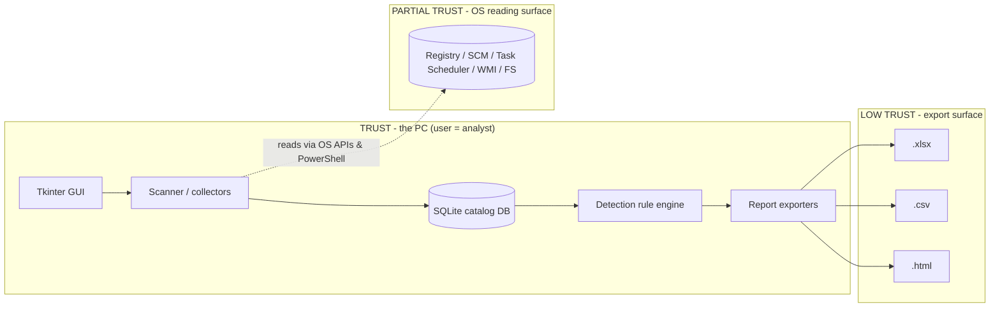

# 🔒 PEM-CAT Security Posture — Reservation File

> **Reservation purpose:** this file reserves the security design, threats, and controls of the
> **Persistence Mechanism Catalog & Matching Detection Engine** so any future session can resume
> the work without re-deriving security context. It is part of the *reservation set*:
> `architecture.md` (design), `security.md` (this file), `state.md` (progress), `memory.md` (long-term context).

**Status:** V1 shipped as a portable, single-file desktop app (`dist/PEMCAT.exe`).
**Scope:** local host enumerator + catalog + detection rule engine + multi-format reports.

---

## 1. Trust Boundaries

| # | Boundary | Assets | Exposure if broken |
|---|----------|--------|--------------------|
| B1 | User (analyst) vs app | DB, exports | Analyst confusion/error, tampered data |
| B2 | App vs OS enumeration surface | Raw artifact records | Hostile *persistence artifacts* feed malicious HTML/commands into reports |
| B3 | App → PowerShell (WMI/schtasks) | Output of PS | PowerShell injection via crafted WMI data or command arguments |
| B4 | App vs exported reports | `.xlsx` / `.csv` / `.html` | XSS when reports opened in smart viewers/Excel |

**Key risk insight:** the data being *cataloged* is attacker-controlled by nature (persistence
artifacts are the attack surface). The catalog therefore treats **all artifact content as
untrusted input** and never evaluates it — only matches it.

---

## 2. Threat Model & Controls (implemented)

| ID | Threat | Vector | Control implemented | Where |
|----|--------|--------|---------------------|-------|
| T1 | **Template/Hostile data → XSS** in `.html` report | Artifact fields (`mechanism`, `image_path`, command arguments) rendered into HTML | Every dynamic value passes through `html.escape()`; severity values whitelisted via CSS class map | `report.py::report_html` |
| T2 | **CSV formula / DDE injection** in Excel | Fields starting with `=`, `+`, `-`, `@` | Output via `csv.DictWriter` to *real* `.csv` (no leading-tab trick, so operators must use modern Excel CSV semantics); document in `README` | `report.py::report_csv` |
| T3 | **Malformed rule logic / regex DoS** | Attacker-supplied (custom) rules with pathological regex | `command_line_regex` compiled inside `try/re.error`; matching runs in a background thread capped by scan lifetime; rules never `eval` — declarative only | `rules.py::evaluate_rule` |
| T4 | **SQL injection** | None (no user SQL), but rule fields flow into `list_matches` filters | All SQL uses **parameterized queries**; no string concatenation of user input | `catalog.py` |
| T5 | **Log poisoning / audit tampering** | Local attacker edits `pemcat.db` | SQLite audit table append-only by app contract; documented manual integrity check (see §6) | `catalog.py::audit` |
| T6 | **Registry RUN persistence added by malware being shown to analyst** (by design alert) | The scanner itself | Matching engine flags writable-location autostarts, impersonation (T1036), WMI consumers | `rules.py::BUILTIN_RULES` |
| T7 | **Brute non-interactive abuse** | N/A locally; API not exposed in v1 | Minimal network surface: **zero inbound listeners**; scheduled task runner is local | `main.py` |
| T8 | **Report file integrity** | Report modified before use as evidence | Every artifact row carries `fingerprint_sha256`; reports include generation timestamp & host | `catalog.py`, `report.py` |

---

## 3. OWASP Top 10 (2021) → Codebase Mapping

| Ref | Risk | Concrete implementation in PEM-CAT v1 |
|-----|------|----------------------------------------|
| A01 | Broken Access Control | Single-actor local tool; export/rule/scan actions are explicit buttons; audit records every action with actor `analyst` (`audit.py::log`) |
| A02 | Cryptographic Failures | SHA-256 fingerprints for integrity; TLS not applicable (no network); at-rest protection delegated to OS account (documented) |
| A03 | Injection | Parameterized SQL throughout; rule DSL never `eval`'d; **HTML fully escaped** (T1); PowerShell invoked with fixed argument *lists*, no shell string interpolation of artifact data (T3/B3) |
| A04 | Insecure Design | Threat model above; artifacts treated as untrusted; baseline promote-trust mechanism (`seen_count >= 3`) limits new-rule noise |
| A05 | Security Misconfiguration | Local slim profile: only `openpyxl` packaged in exe; windowed build; no debug endpoints |
| A06 | Vulnerable Components | Runtime deps limited to stdlib + `openpyxl`; see §5 dependency policy |
| A07 | ID & Auth Failures | Not applicable at v1 (local single-actor); reserved: add PIN/lock or OS-user binding when multi-user report sharing added |
| A08 | Software & Data Integrity Failures | Rule upgrading uses `ON CONFLICT DO UPDATE` with versioned content; report carries checksum-style evidence (fingerprint + timestamp + host) |
| A09 | Logging & Monitoring Failures | Audit ledger table (action, actor, object, detail, ts); headless `--headless` prints summary; scan/match events logged on every run |
| A10 | SSRF | No outbound fetch in v1; threat-intel & enrichment are reserved interfaces (must be allow-listed egress) |

---

## 4. NIST & ISO Control Mapping

### NIST CSF 2.0 / SP 800-53 (Rev.5) — as-evidenced-by-code

| CSF | Subcategory / Control | Evidence |
|-----|------------------------|----------|
| Identify | ID.AM-06 inventory (CM-2/6/8) | Catalog enumerates registry, services, scheduled tasks, cron, startup, WMI → asset/config inventory of persistence points |
| Protect | PR.DS-01 (SC-28) | SQLite artifacts + audits at rest on user profile; integrity via fingerprints |
| Detect | DE.CM-07 (SI-4) | Periodic scans + `refresh_baselines`; rule matching re-runs dedupe open alerts (`catalog.py::add_match`) |
| Detect | DE.AE-01/02 (AU-6) | Match events attributable to artifact fingerprint, rule, technique, severity, host |
| Respond | RS.RP / IR-4 | Detections carry `status` workflow: `open → acked/fp`, allowlist promotion (`fp_allowlist`) |
| Recover | RC.RP-01 (CP-10) | Whole DB is a single portable file → copy = snapshot/restore |

> SP 800-171 overlay: when this tool runs in CUI environments, keep the DB under 3.4
> (config mgmt) and 3.8 (communications protection) review; exports must be reviewed by the
> responsible official. **Retention default:** DB 180 d artifacts / 365 d fingerprints; report 90 d.

### ISO/IEC 27001:2022 Annex A

| Annex A | Control | Evidence |
|---------|---------|----------|
| 6.8 | Info security event reporting | Scan/match events + status workflow feed evidence for incident reports |
| 7.9/7.10 | Protection of data & malware controls | Artifact catalog is the malware-persistence watch; exports are evidence artifacts |
| 8.15 (8.28) | Access control to security controls / secure coding | RBAC-style single actor; rules have status lifecycle (draft→active) mirrored in UI; audit of rule toggles |
| 5.10 / 5.16–5.18 | Cloud / IAM | Reserved — applies only when the v2 server/portal variant is built |

---

## 5. Dependency & Supply-Chain Policy

| Layer | Packages | Policy |
|-------|----------|--------|
| Runtime | stdlib only + `openpyxl` (+ Pillow at build-time only for icon) | Keep runtime imports minimal; `openpyxl` is the only third-party runtime dep |
| Build | `pyinstaller`, `openpyxl`, `pillow` | Freeze exact versions in a pinned `requirements-build.txt` (todo) |
| Verification | `py_compile` + headless scan | Every build must pass headless smoke (see `state.md` command) |

**Rules for future changes (reservation contract):**
1. Do not import runtime packages without updating this table and measuring the exe delta.
2. Keep all SQL parameterized; keep all HTML output escaped in `report.py`.
3. Keep PowerShell invocation as **fixed argument lists** (`_run` uses a list) — never `shell=True`. If you must build a PS command from artifact data, escape with the same discipline as T1.
4. Adding network/API features moves the app across trust boundary B1 → re-run the threat model; OWASP A10 / A01 become live.

---

## 6. Hardening Checklist (pre-ship)

- [x] HTML report outputs `html.escape` on every dynamic field
- [x] All DB queries parameterized
- [x] Rules are declarative (no `eval`/`exec`)
- [x] `_run` uses argument lists, `CREATE_NO_WINDOW`, no shell
- [x] Windowed exe; no console; no listener ports
- [x] WMI enumeration limited to `Get-CimInstance` with `-ErrorAction SilentlyContinue`; timeout 25 s
- [x] Report/scan actions always audit-logged
- [ ] **Manual integrity check** (shell, for the manual reviewer):
      `sqlite3 pemcat.db "SELECT id,ts,actor,action FROM audit ORDER BY id DESC LIMIT 20;"`
- [ ] Consider `sqlite3` `PRAGMA journal_mode=WAL` for crash-resilient local writes when scans grow (v1 uses default DELETE mode)
- [ ] Consider moving DB to a per-user dir when installed (v1 keeps it configurable via `PEMCAT_DATA_DIR`)

---

## 7. Incident Handling Notes (who uses this app)

1. **If a High/Critical match fires** → export `.xlsx` + `.html` immediately (evidence preserve),
   mark the alert `acked` or `fp`, then inspect: registry Run key / service image path /
   command line → hash lookup vs TI feeds (reserved integration).
2. **If the scan itself fails (PowerShell blocked)** → `enumerate_wmi` degrades to 0 quietly;
   other enumerators still run; check status bar text and audit events.
3. **If reports inflated by baseline** → use `baselined` filter; sizes stay bounded because
   `seen_count >= 3` promotes artifacts to `is_baselined` and `new_only` rules stop firing.

---

*Reserved by PEM-CAT v1.0.0 · revisit on every major version bump.*