<div align="center">

# 🕵️‍♂️ LAMDEX — Lateral Active-Movement Detection eXercise

### *Lateral Movement Simulation in an Isolated Active Directory Lab + Detection Engineering — Solution Architecture*

**Acronym:** **LAMDEX** — *Lateral Active-Movement Detection eXercise & Rule Factory*

     

**ISO 27001** 📘 · **NIST CSF 2.0** 🥋 · **NIST SP 800-53** 🏛 · **OWASP Top 10** 🧨 · **MITRE ATT&CK** 🎯

</div>

---

## 🧭 Table of Contents

| # | Section | # | Section |
|---|---------|---|---------|
| 1 | [Solution Landscape](#1-solution-landscape) | 9 | [Detection Engineering: Sources & Event IDs](#9-detection-engineering--sources--event-ids) |
| 2 | [Goals & Non-Goals](#2-goals--non-goals) | 10 | [Rules Engine, Correlation & Sigma Pipeline](#10-rules-engine--correlation--sigma-pipeline) |
| 3 | [High-Level Architecture](#3-high-level-architecture) | 11 | [Knowledge-Base Data Model](#11-knowledge-base--data-model) |
| 4 | [Core Components](#4-core-components) | 12 | [Reporting & Download Module](#12-reporting--download-module) |
| 5 | [Isolated AD Lab Topology](#5-isolated-ad-lab-topology) | 13 | [Security Framework Mapping](#13-security-framework-mapping) |
| 6 | [Execution Pipeline (Sim → Detect → Prove)](#6-execution-pipeline-sim--detect--prove) | 14 | [Threat Model & Abuse Cases](#14-threat-model--abuse-cases) |
| 7 | [Lateral Movement Playbook (ATT&CK)](#7-lateral-movement-playbook-attck) | 15 | [Non-Functional Requirements](#15-non-functional-requirements) |
| 8 | [Data Flow & Sequencing](#8-data-flow--sequencing) | 16 | [Observability & CI/CD](#16-observability--cicd) |
| — | — | 17 | [Roadmap & Road to MVP](#17-roadmap--road-to-mvp) |

---

## 1. Solution Landscape

> [!NOTE]
> **Problem statement** — Lateral movement (MITRE ATT&CK **Tactic TA0008**) is where an attacker pivots from an initial foothold to high-value assets (domain controllers, file servers, Tier-0 systems) using techniques such as **Pass-the-Hash (T1550.002)**, **WinRM / PsExec (T1021.006 / T1021.002)**, **SMB admin shares (T1021.002)**, **RDP (T1021.001)**, **DCOM (T1021.003)**, **Kerberoasting / Pass-the-Ticket (T1558.003 / T1550.003)** and **Lateral Tool Transfer (T1570)**. Defenders rarely get a *safe, ground-truth* environment to tune detection rules against these techniques.
>
> **What we build** — An **air-gapped, isolated Active Directory lab** where each lateral-movement technique is executed under full observation, plus a **detection-engineering factory** that turns every run into *validated detection artifacts* (Sigma rules, log-source config, SIEM-ready alerts) — all wrapped in an **auditable, multi-format report evidence chain** mapped to ISO 27001, NIST and OWASP.

### 1.1 What this solution does

| Capability | Description |
|------------|-------------|
| 🏰 **Build Isolated AD Lab** | One-command provisioning of a firewalled, air-gapped domain: DC, workstations, file server, realistic synthetic users/groups/SPNs, Tier-0/1/2 segmentation. |
| 🎭 **Simulate Movement** | Parameterized replay of **12+ MITRE ATT&CK lateral-movement techniques** with randomized benign baselines (dual-traffic mixing) so detections are realism-tested. |
| 📡 **Capture Ground Truth** | Full **host telemetry** (Windows Event Log + Sysmon), **network telemetry** (Zeek + Suricata + PCAP), each event stamped with the exact technique & step performed. |
| 🧩 **Detect & Correlate** | Detection-engineering pipeline — **Sigma → translation (Elastic / Splunk / Zeek / Suricata)** → scoring → **precision / recall / F1** against ground truth. |
| 📜 **Evidence & Govern** | Every technique ↔ detection mapping produces **tamper-evident evidence** (SHA-256 chains) and compliance extracts for ISO 27001 / NIST / OWASP auditors. |
| 📤 **Report & Download** | One-click exports — 📗 **`.xlsx`** · 📕 **`.xls`** · 📄 **`.csv`** · 🌐 **`.html`** · 🖨 **`.pdf` / `.png`**. |


### 1.2 Position in a wider SOC / Blue-Team stack

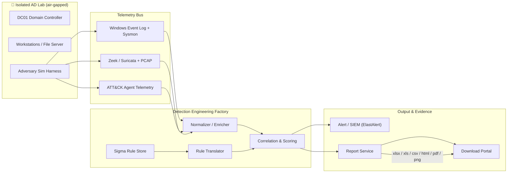

**Golden rule of this lab:** *provision the palace (AD) and the attacker (harness) inside a sealed room first, then build the rules that watch every hallway — then prove it with auditable evidence.*

---

## 2. Goals & Non-Goals

### ✅ Goals
- **G1** — Reproducible, air-gapped **AD lab** (DC + workstations + file server) provisioned and torn down in < 10 min, fully isolated from production.
- **G2** — Simulate **≥ 12 lateral-movement techniques** mapped to **MITRE ATT&CK TA0008**, parameterized for interval, source host, user and obfuscation level.
- **G3** — Collect **ground-truth-labeled** host + network telemetry (Event Log, Sysmon, Zeek, Suricata, PCAP).
- **G4** — Generate and **validate** detection rules (**Sigma** + native) with measured **precision / recall / F1 / latency** per technique.
- **G5** — Multi-format evidence & compliance reports (**`.xlsx` · `.xls` · `.csv` · `.html` · `.pdf/.png`**) mapped to **ISO/IEC 27001**, **NIST CSF 2.0 / SP 800-53**, **OWASP Top 10 (2021)**, **MITRE ATT&CK**.
- **G6** — Hot re-run loop: re-execute a technique → update rules → re-validate in < 60 s.

### 🚫 Non-Goals
- ❌ **Not a red-team C2** — the harness is a *deterministic, lab-gated simulator* for authorized training / defensive research only. No persistence, no exfiltration, no real outbound C2.
- ❌ **Not an EDR product** — detection and alerting only; no prevention / auto-remediation in v1.
- ❌ **No production domain integration** — completely isolated virtual network, host-firewalled, **no internet egress** for lab VMs.
- ❌ **No real credentials / real user data** — synthetic identities (`emp_*`, `svc_*`), synthetic hashes/tickets only within the lab domain.
- ❌ **No arbitrary malware execution** — techniques are performed with **benign, credentialed binaries** (built-in OS tools + PowerShell) that drive the exact observable behavior.

> ⚠️ **Safety contract:** air-gapped (no route to internet/production), nested virtual network, auto-destroy on teardown, snapshot rollback. Every simulated technique is logged with a unique `run_id` and tagged `LAB:true` in every artifact.

---

## 3. High-Level Architecture

### 3.1 Logical view (layered)

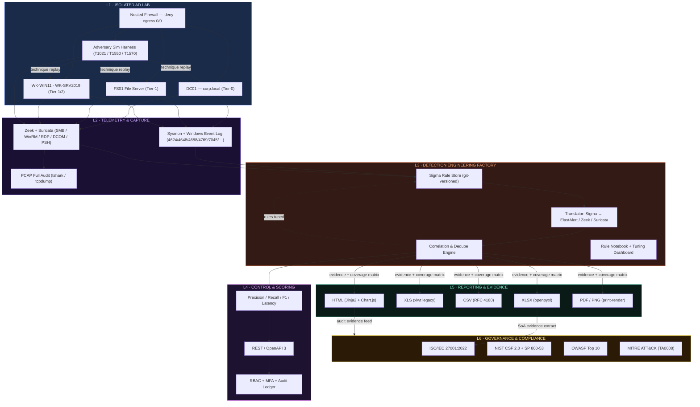

### 3.2 Deployment view (nested virtualization)

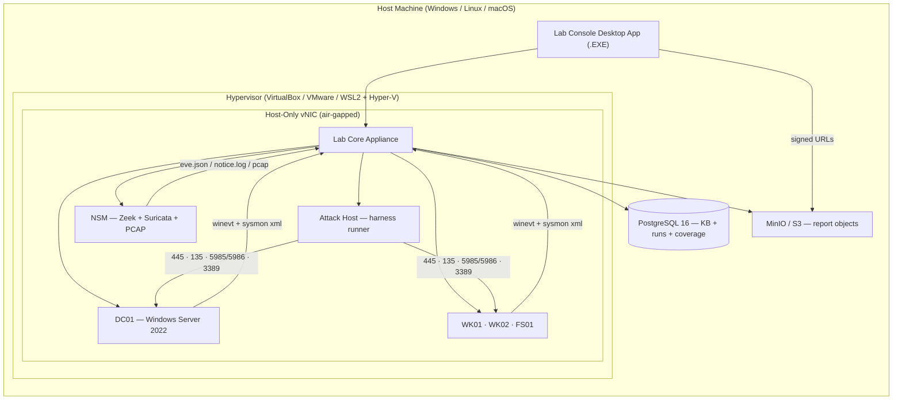

> 🔐 **Isolation guarantees:** host-only adapter, no default gateway, firewall drop-all for lab VMs, lab-EB DNS only, per-run credential rotation, snapshot rollback, one-command destroy.

---

## 4. Core Components

| # | Component | Responsibility | Tech Exemplars |
|---|-----------|----------------|----------------|
| 1 | **Lab Orchestrator** | Provision/destroy VMs, inject creds, orchestrate technique replay, manage run-id state. | Python 3.11, Vagrant + Packer, Ansible, Terraform |
| 2 | **Adversary Sim Harness** | Deterministic execution of each lateral-movement technique with parameterized behavior (user, targets, interval, evasions). | Python + `pypsrp`, `impacket`, `net.exe`, PowerShell |
| 3 | **Telemetry Collector** | Configures & collects **Windows Event Log + Sysmon**, forwards raw EVTX + XML to pipeline. | Winlogbeat, SC RPC, XML Event 800/4104/4688 |
| 4 | **NSM Engine** | Zeek scripts + Suricata rules for SMB/WinRM/RDP/DCOM/PowerShell traffic; alerts + full PCAP. | Zeek 6.x, Suricata 7.x, tshark, JA3/JA3S |
| 5 | **Normalizer & Enricher** | Raw events → canonical `DetectionRecord` (EID, technique tag, source/target, user, score fields). | Python (pydantic), pandas, JSON Schema |
| 6 | **Sigma Rule Store** | Versioned, human-readable, CI-tested detection rules (Sigma + native). | Git, YAML, sigma validation schema |
| 7 | **Rule Translator** | Sigma → multiple backends (Elasticsearch, Splunk, Zeek, Suricata, EVTX). | `sigtools` / sigma CLI, custom backends |
| 8 | **Correlation & Scoring** | Ground-truth join, dedupe, **TP/FP/FN/TN**, **precision / recall / F1**, alert forwarding. | Python, Redis, Pandas, Elasticsearch / OpenSearch |
| 9 | **Evidence Ledger** | Append-only run/technique/evidence trail with SHA-256 chains (tamper-evident). | PostgreSQL (append-only), WAL-to-S3 digest |
| 10 | **Reporting Service** | Renders multi-format reports (xlsx / xls / csv / html / pdf / png) + signed download URLs. | `openpyxl`, `xlwt`, `pandas`, `Jinja2` + `Chart.js`, `weasyprint`, MinIO |
| 11 | **Lab Console (GUI)** | Control plane: run techniques, live detections, tuning, one-click exports. | Python tkinter / ttkbootstrap → PyInstaller `.EXE` |

---

## 5. Isolated AD Lab Topology

> Domain `corp.local`, forest functional level **Windows Server 2022**, nested virtual network, **no egress**, synthetic identities only.

### 5.1 Machine inventory

| VM | Role | Tier | Software | Purpose |
|----|------|------|----------|---------|
| **DC01** | Domain Controller + DNS + CA | 🥇 Tier-0 | Server 2022, AD DS, DNS, PKI | AuthN (Kerberos/NTLM), SPNs for Kerberoasting targets |
| **FS01** | File Server (`ADMIN$` / `C$`) | 🥈 Tier-1 | Server 2019 | SMB lateral-tool-transfer target |
| **WK-WIN11** | Workstation | 🥈 Tier-1 | Windows 11 24H2 | RDP / WinRM / DCOM movement target |
| **WK-SRV2019** | Server role host | 🥈 Tier-1 | Server 2019 | PsExec / service-based lateral target |
| **ATK01** | Adversary Harness host | 🎭 Tier-2 | Python 3.11 + PyPSRP + Impacket | Executes technique replays (valid lab creds only) |
| **NSM01** | Network Security Monitor | 🛡 n/a | Zeek 6.x + Suricata 7.x | SPAN capture, alerts, PCAP |

### 5.2 Identity fabric (synthetic)

| Identity | Purpose | ATT&CK anchor |
|----------|---------|---------------|
| `emp_admin` · `svc_sql` | Tier-0/Tier-1 accounts with SPNs | **T1558.003 Kerberoasting** target |
| `emp.office` group | Tier-1 workstation users | valid-account source pool (**T1078**) |
| `svc_backup` | high-privilege account for PtH/PtT | **T1550.002 / .003** |
| DA / BA / RA split | delegated admin via Group Policy | Tier-model realism |

### 5.3 Network segmentation & egress rules

| Rule | Policy | Framework anchor |
|------|--------|------------------|
| Lab ↔ Internet | 🚫 **deny all egress** (no default route in nested VMs) | ISO **A.8.10**, NIST **SC-7** |
| Lab ↔ Host NIC | 🔥 host-only + firewall, no host trust | NIST **AC-4 / SC-7** |
| ATK01 → targets | ✅ allowed only inside orchestrated run window | NIST **AC-3**, ISO **A.9.1.2** |
| Capture plane | ✅ SPAN / port-mirror to NSM01 only | NIST **SI-4**, ISO **A.8.16** |

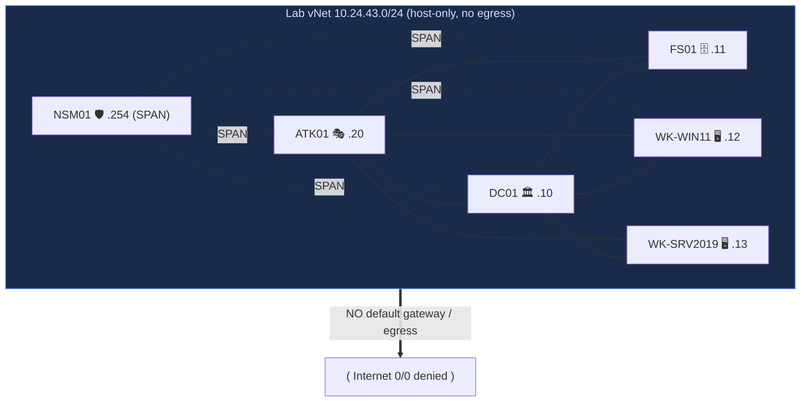

---

## 6. Execution Pipeline (Sim → Detect → Prove)

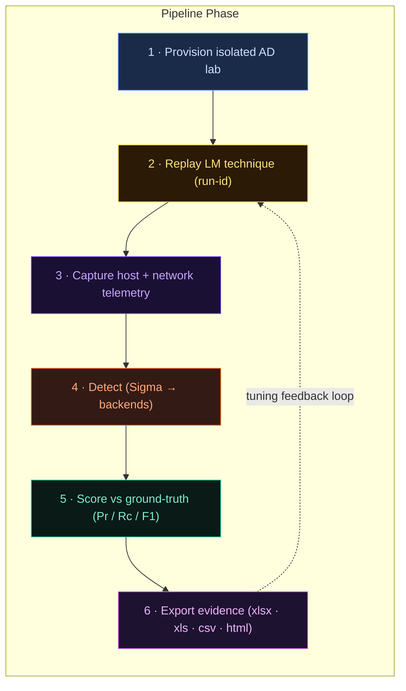

| Phase | Input | Output artifact | Evidence |
|-------|-------|-----------------|----------|
| 1 · Provision | lab profile (`lab.yaml`) | running VMs + credential set | `provision_state.json` |
| 2 · Replay | technique spec (`T1021_002.yaml`) | executed technique w/ `run_id` | `runs/{run_id}/steps.json` |
| 3 · Capture | SPAN + agent configs | EVTX + Sysmon XML, `eve.json`, `notice.log`, `pcap` | `pcap/run_{id}.pcap` |
| 4 · Detect | Sigma rules + telemetry | translated alerts (ElastAlert / Zeek / Suricata) | `detections/run_{id}.json` |
| 5 · Score | detections × ground-truth | **TP/FP/FN/TN**, **precision / recall / F1 / latency** | `metrics/run_{id}.json` |
| 6 · Export | metric + evidence bundle | 📗`.xlsx` 📕`.xls` 📄`.csv` 🌐`.html` 🖨`.pdf/.png` | SHA-256 chain file |

---

## 7. Lateral Movement Playbook (ATT&CK)

> Every technique is **parameterized** (source / target / user / jitter) and fires **only within the air-gapped lab** with `LAB:true` tags. `★` = MVP coverage.

| ATT&CK ID | Technique | Lab method | Key observable for detection | Data source | ★ |
|-----------|-----------|------------|------------------------------|-------------|---|
| `T1021.002` | SMB / Windows Admin Shares | `net use \\FS01\C$` + copy-run | **5145/5140** admin-share access, SMB tree-connect to `C$`/`ADMIN$` | Sysmon 3, Zeek `smb.log` | ★ |
| `T1021.006` | Windows Remote Management | WinRM `Invoke-Command` 5985/5986 | Logon type **3**, **4648**, WinRM process start, port flows | Sysmon 1/3, EID 4648 | ★ |
| `T1021.001` | Remote Desktop Protocol | `mstsc` / RDP to WK | Logon type **10**, inbound 3389, RDP cert fingerprint | EID 4624 T10, Zeek `rdp.log` | ★ |
| `T1550.002` | Pass-the-Hash | `wmiexec` / `smbexec` style NTLM PtH | NTLM logon (type 3) from unexpected source host, SMB RC4 usage | EID 4624 T3, EID 8004 | ★ |
| `T1550.003` | Pass-the-Ticket / Kerberos | replayed/forged TGS | TGS usage anomalies from unknown source, EID 4769 counts | EID 4769 / 4768 | ★ |
| `T1558.003` | Kerberoasting (harvest) | SPN TGS-REQ with **RC4-AES** | **EID 4769** RC4 encryption + `svc_*` SPN, high request count | EID 4769, SPN audit | ★ |
| `T1021.003` | DCOM | `MMC20.Application` / `Dcomlaunch` `ExecuteShellCommand` | DCOM activation (135), `dllhost` spawn, parent `explorer`/`dllhost` | Sysmon 1/8, Zeek `dce_rpc.log` | ★ |
| `T1570` | Lateral Tool Transfer | `copy` / `certutil` / BITS to `ADMIN$` | **EID 5145** share writes, `certutil`/BITS running, SMB write bytes | Sysmon 11, EID 4688, Zeek | ★ |
| `T1078` | Valid Accounts | legit domain creds replay | First-seen host-user combination, unbounded login | EID 4624 / 4625, anomaly model | ★ |
| `T1047` | WMI (WbemExec) | `wmic /node:` + `Invoke-WmiMethod` | WMI `Win32_Process.Create`, port 135/49152–4 flows | Sysmon 1, Zeek `dce_rpc.log` | ★ |
| `T1543.003` | Windows Service (PsExec-style) | `PSEXESVC` binary + `sc create` | **EID 7045** new service, image in Temp/Admin share | EID 7045, Sysmon 1/17 | ★ |
| `T1021.004` | SSH | OpenSSH (test win) | SSH auth on 22, session start/stop | EID 4624-via-SSH, Zeek `ssh.log` | ☆ |
| `T1087` | Account Discovery | `net user /domain`, ADSI queries | LDAP page queries, `net.exe` runs | EID 4688, Zeek `ldap.log` | ☆ |
| `T1018` | Remote System Discovery | `nltest /dclist:*`, ping sweep | hostname-resolution bursts, ICMP sweep | EID 4688, Zeek `conn.log` | ☆ |

> **ATT&CK Navigator import:** every run exports an `attack-navigator-layer.json` heatmap (technique → detection coverage + F1) rendered inside the `.html` report.

### 7.1 Exemplar — PsExec-style flow (`T1021.002 / T1543.003`)

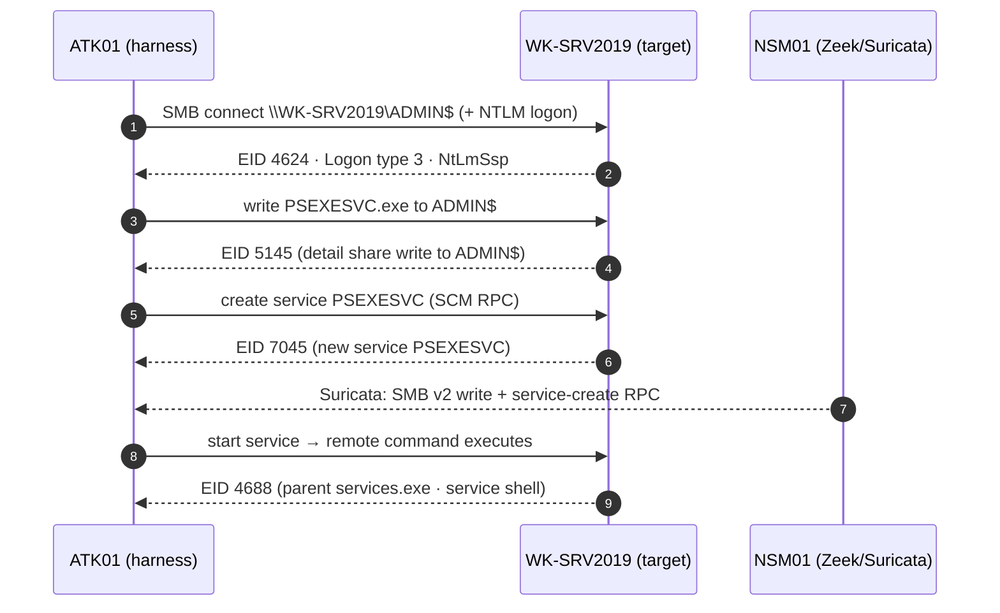

---

## 8. Data Flow & Sequencing

### 8.1 End-to-end sequence

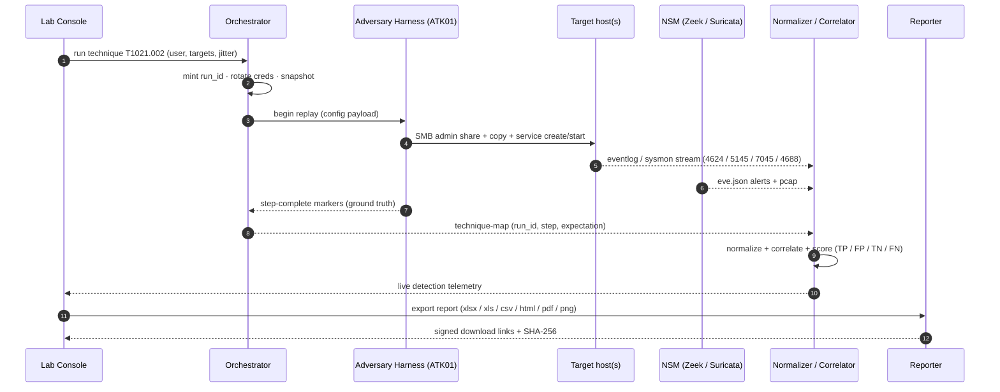

### 8.2 Canonical detection record

| Field | Example | Description |
|-------|---------|-------------|
| `detection_id` | `lm-00004242` | Globally unique alert id |
| `run_id` | `r20260920_1430_t1021-002` | Originating lab run |
| `technique_id` | `T1021.002` | ATT&CK anchor |
| `event_id` | `4624 / 7045 / 5145` | Raw source event id |
| `data_source` | `winevtlog` · `sysmon` · `zeek` · `suricata` | Source plane |
| `rule_id` | `SIG-T1021-002-SMB-ShareAdmin` | Fired Sigma / native rule |
| `severity` / `confidence` | `high` / `0.87` | Scoring fields |
| `source_host` / `target_host` | `ATK01` / `WK-SRV2019` | Movement vector |
| `user` | `corp\emp.admin` | Auth identity |
| `ground_truth` | `true` | Label from harness |
| `evidence` | `pcap ref · sysmon ref · SHA-256` | Proof chain |
| `is_lab` | `true` | ⚠️ Lab tag (never production) |

---

## 9. Detection Engineering: Sources & Event IDs

> Detection value comes from precise **Windows Event Log pairing** with **network evidence**. The pipeline trains on both planes together.

### 9.1 Host-plane event IDs (Windows + Sysmon)

| Event ID | Meaning | Technique linkage |
|----------|---------|-------------------|
| `4624` | Successful logon (Type **3** network · Type **10** RDP · Type **9** RunAs) | All movement |
| `4648` | Logon with explicit credentials | WinRM / DCOM / RDP run-as |
| `4625` | Failed logon (spray / preauth) | T1021 all |
| `4672` | Special privileges assigned (WinRM admin) | T1021.006 |
| `4688`/+`4689` | Process create / terminate (full cmdline, `4104` audit) | Tool transfer, service shells |
| `4768` / `4769` | Kerberos TGT / TGS requests | T1558.003 (RC4), T1550.003 |
| `4776` / `4771` | NTLM validation / Kerberos failure | Pass-the-Hash, brute force |
| `7045` / `7040` | New / changed Windows service | PsExec-style, T1543.003 |
| `5140` / `5145` | Share access / detailed share file access | SMB admin share |
| `5156` | WFP connection allowed | egress / port discipline |
| `Sysmon 1` | Process create (parent/child) | RDP→cmd, WMI spawns |
| `Sysmon 3` | Network connections | 445 / 3389 / 5985 / 135 flows |
| `Sysmon 8` | CreateRemoteThread | **DCOM**, process injection |
| `Sysmon 10` | ProcessAccess | `lsass` access (PtH context) |
| `Sysmon 11` | FileCreate | tool transfer to shares |
| `Sysmon 13` | Registry value set | avoid-goal / autostart checks |
| `Sysmon 17/18` | Named pipe created / connected | PsExec pipe (`PSEXESVC`) |
| `Sysmon 22` | DNS query | discovery / exfil correlate |
| `4103` / `4104` | PowerShell module / script-block logging | Invoke-Command, reflective load |

### 9.2 Network-plane (Zeek / Suricata)

| Engine | Log / Rule pack | Detection hook | Technique |
|--------|----------------|----------------|-----------|
| **Zeek** | `smb.log`, `dce_rpc.log` | SMB admin-share tree connect; DCERPC to 49152+ | T1021.002, T1047 |
| **Zeek** | `rdp.log` | RDP inbound, cert fingerprint | T1021.001 |
| **Zeek** | `conn.log` + JA3/JA3S | first-use of 5985/5986/135/445 | T1021.006/.003 |
| **Suricata** | `lm_smb_admin_share.rules` | `IPC$` / `ADMIN$` + write | T1570, T1021.002 |
| **Suricata** | `lm_dcom.rules` | DCERPC `MMC20.Application`, `Dcomlaunch` | T1021.003 |
| **Suricata** | `lm_winrm_logon.rules` | shell / powershell over 5985 | T1021.006 |
| **Suricata** | `lm_ptt_ntlm.rules` | NTLM RC4 from unknown source host | T1550.002 |

### 9.3 Sigma rule example

```yaml
title: SMB Admin Share Pass-the-Hash Lateral Move
id: SIG-T1550-002-smb-ptl
status: experimental
tags:
  - attack.lateral_movement
  - attack.t1550.002
logsource:
  product: windows
  service: security
detection:
  selection:
    EventID: 4624
    LogonType: '3'
    LogonProcess: NtLmSsp
    AuthenticationPackage: 'NTLM'
  filter_known:
    Source_Network_Address: '10.24.43.10'   # DC01 baseline
  condition: selection and not filter_known
level: medium
fields: [TargetUserName, IpAddress, WorkstationName, ProcessName]
```

---

## 10. Rules Engine, Correlation & Sigma Pipeline

### 10.1 Rule lifecycle

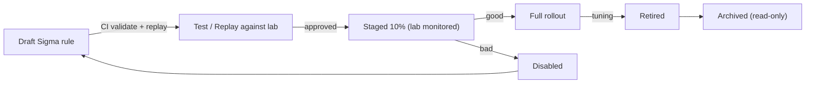

### 10.2 Rule DSL convention

```yaml
id: SIG-T1021-006-winrm-psh
name: WinRM PowerShell Lateral Movement
version: 4
technique: T1021.006
platform: windows
severity: high
correlation:
  window: 60s
  sequence:
    - event_id: 4624
      logon_type: '3'
    - event_id: 4688
      cmdline ~ "powershell|pwsh"
  source_ties: source_host != target_host
scoring:
  base: 55
  confidence: 0.9
suppress: {group_by: [source_host, target_host], window: 15m}
tests:
  - name: "admin scheduled WinRM"
    input: {eid: 4624, logon_type: '3', host_matches: true}
    expect: no_match
  - name: "ATK01 to WK-SRV2019"
    input: {eid: 4624, logon_type: '3', source_host: ATK01, target_host: WK-SRV2019}
    expect: match_confidence: 0.9
```

### 10.3 Matching engine internals

| Step | Description |
|------|-------------|
| 1 · **Collect** | Window of host + network events within correlation window. |
| 2 · **Compile** | Sigma/DSL rules → typed `MatchPlan` (regex pre-compiled, cached). |
| 3 · **Gate** | Platform, status (staged/active), activation tag, `LAB:true` allow. |
| 4 · **Correlate** | Sequence matching (logon → process → share) across planes; baseline filters. |
| 5 · **Score** | Confidence × severity + novelty (first-seen host combo) + evidence strength. |
| 6 · **Dedupe & emit** | Group identical events within window, forward to alerting and ledger. |

### 10.4 Performance budget

| Metric | Budget |
|--------|--------|
| Rule compile → cache (cold) | < 5 s / 2 000 rules |
| Per-event eval (warm) | < 2 ms |
| Event log → alert (p95) | < 1 s |
| Ground-truth join + metrics | < 30 s / run |
| Report generation `.xlsx` (100k rows) | < 45 s |

---

## 11. Knowledge-Base Data Model

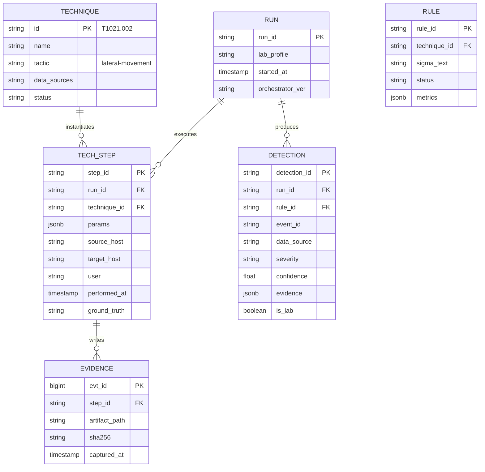

| Entity | Purpose | Retention |
|--------|---------|-----------|
| `technique` | ATT&CK-derived playbook catalog | permanent |
| `run` | One lab execution = one technique round-trip | 90 d (configurable) |
| `tech_step` | Parameterized step with ground-truth label | 90 d |
| `detection` | Normalized alert tied to run + rule | 180 d |
| `rule` | Versioned Sigma/native rule with live metrics | permanent |
| `evidence` | Artifact paths + SHA-256 hash chain | 400 d (audit) |

---

## 12. Reporting & Download Module

### 12.1 Formats & engines

| Format | Engine | Use-case |
|--------|--------|----------|
| 📗 **`.xlsx`** | `openpyxl` | Analyst pivot — **multi-sheet** workbook + conditional color + charts. |
| 📕 **`.xls`** | `xlwt` | Legacy Excel 97–2003 tooling interop. |
| 📄 **`.csv`** | `pandas` / stdlib | SIEM / Threat-Intel ingestion, RFC 4180, UTF-8, ISO 8601. |
| 🌐 **`.html`** | `Jinja2` + Chart.js | Self-contained interactive dashboard (offline JS), printable. |
| 🖨 **`.pdf` / `.png`** | `weasyprint` / print-render | Audit attachments, executive briefs. |

### 12.2 Report types & schedules

| Report | Trigger | Default schedule | Retention |
|--------|---------|------------------|-----------|
| `run_summary` | per technique run | on completion | 90 d |
| `detection_validation` | per run + daily digest | 23:00 UTC | 180 d |
| `coverage_matrix` | weekly + on rule change | Sun 01:00 UTC | 12 mo |
| `compliance_mapping` | monthly | 1st of month | 12 mo |
| `metrics_bundle` | on demand | — | 12 mo |

### 12.3 Sample `.xlsx` sheet layout

| Sheet | Columns (subset) | Styling |
|-------|------------------|---------|
| **Run Summary** | run_id, technique, targets, duration, rule count, alert count | KPI cards, header navy |
| **Detections** | detection_id, rule_id, EID, severity, confidence, source→target | conditional ⚠️ red / 🟡 yellow |
| **Techniques** | technique_id, name, status, covered flag | coverage badges |
| **Metrics** | technique, TP/FN/FP/TN, precision, recall, F1, latency | bar sparklines |
| **Compliance Matrix** | ISO / NIST / OWASP control ↔ evidence refs | per-framework sheets |
| **Evidence** | artifact, path, SHA-256, captured_at | hash chain formatting |

### 12.4 Secure download flow

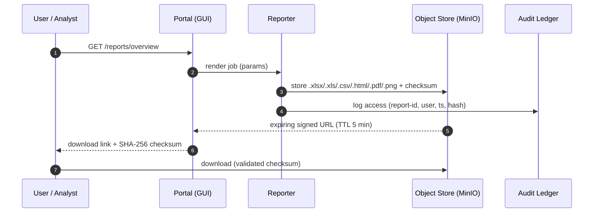

### 12.5 `.csv` file set (SIEM-ready)

| File | Purpose |
|------|---------|
| `alerts.csv` | one row per detection event (technique tagged) |
| `techniques.csv` | ATT&CK coverage + rule linkage |
| `metrics.csv` | precision / recall / F1 / latency per technique |
| `compliance.csv` | control-by-control status per framework |
| `evidence.csv` | artifact → SHA-256 chain |

---

## 13. Security Framework Mapping

### 13.1 OWASP Top 10 (2021) → control implementation

| OWASP ID | Risk | Where addressed | Mitigation |
|----------|------|-----------------|------------|
| **A01** | Broken Access Control | GUI, API, Download Portal | RBAC + ABAC, signed short-lived URLs, object ownership checks, deny-by-default |
| **A02** | Cryptographic Failures | Transport, at-rest, evidence | TLS 1.3, envelope encryption (KMS), SHA-256 evidence chains, key rotation |
| **A03** | Injection | Rule DSL, SQL, XSS planes | Parameterized SQL, sandboxed rule parser (no `eval`), CSP + output-encoding in `.html` |
| **A04** | Insecure Design | Detection factory | Threat-modeled flows, ground-truth abuse-case corpus, fail-closed rule gating |
| **A05** | Security Misconfiguration | Lab VMs, containers | Immutable images, hardened Windows baselines, secrets via Vault, image scanning |
| **A06** | Vulnerable Components | Dependency chain | SBOM (CycloneDX) generation, dependency-update gates, CVE feed watch |
| **A07** | ID & Auth Failures | Lab Console / APIs | MFA for analysts, strong policy, OIDC/SAML, session binding |
| **A08** | Software & Data Integrity Failures | Rules, reports, evidence | Git-signed rule commits, report SHA-256 checksums, tamper-evident ledger |
| **A09** | Logging & Monitoring Failures | Full lab | Pervasive OpenTelemetry, audit ledger, alert on missing heartbeats |
| **A10** | SSRF | Enrichment / TI calls | Allow-listed egress (none by default in lab), no user-supplied URLs, DNS pinning |

### 13.2 NIST CSF 2.0 & SP 800-53 Rev.5 mapping

| CSF Func | CSF Subcategory | SP 800-53 Controls | Implemented in |
|----------|-----------------|--------------------|----------------|
| **Govern** | GV.SC-04 | CA-5, CA-7, SA-11 | Controls table, ongoing risk review |
| **Identify** | ID.AM-06 | CM-2, CM-6, CM-8 | Lab inventory = asset baseline; technique catalog = configuration baseline |
| **Protect** | PR.AA-02 | AC-6, IA-2 | RBAC + MFA on console/report APIs |
| **Protect** | PR.DS-01/-02 | AU-10, SC-28 | At-rest & in-transit encryption, tamper-evident reports |
| **Detect** | DE.CM-07 | SI-3, SI-4, SI-7 | Continuous telemetry capture, NSM & rule integrity checks |
| **Detect** | DE.AE-01/-02 | AU-6, SI-6 | Detection records → audit events, alert aggregation |
| **Respond** | RS.CO-02 | IR-4, IR-6 | Detection evidence → SOAR playbooks |
| **Recover** | RC.RP-01 | CP-10, IR-4 | Snapshot rollback, re-run pipelines, catalog restore |

> Additional overlay with **SP 800-171** when deployed in CUI environments (`.3.4 Configuration Management`, `.3.5 Identification and Authentication`, `.3.8 System and Communications Protection`).

### 13.3 ISO/IEC 27001:2022 Annex A mapping

| ISO Annex A | Control | Our mechanism |
|-------------|---------|---------------|
| **5.10** | Use of cloud services | Nested virtualization, shared responsibility, egress controls |
| **5.16 / 5.17 / 5.18** | Identity & access | SSO + MFA, lifecycle management, least-privilege service accounts |
| **6.8** | InfoSec event reporting | Alert webhooks, SIEM / SOAR intents per detection |
| **7.9** | Protection of data | Encryption, backups, retention on reports & telemetry |
| **7.10** | Protection against malware | Sandboxed lab, no arbitrary code, signed tooling |
| **7.12** | Info & related tech protection | Minimal attack surface, per-run credentials, auto-teardown |
| **8.15** | Access control for IT security controls | RBAC on rule management, staged approval workflow |
| **8.28** | Secure coding | SDL gates: SAST/DAST, OWASP-guided review, signed commits |

### 13.4 Framework → artifact table

| Framework | Where the evidence lands |
|-----------|--------------------------|
| 🟢 ISO 27001 **SoA** | `.XLSX` → `Compliance Matrix` sheet (control ↔ evidence ref) |
| 🥋 NIST CSF **Profile** | functions tagged per detection line → `.CSV` |
| 🏛 NIST 800-53 **POA&M** | control status → `.XLSX` / `.HTML` scorecard |
| 🧨 OWASP **Assessment** | checklist + results in `.HTML` dashboard |
| 🎯 MITRE ATT&CK **Navigator** | technique heatmap layer (`attack-navigator-layer.json`) → `.HTML` |

---

## 14. Threat Model & Abuse Cases

| # | Abuse case | Vector | Guard |
|---|-----------|--------|-------|
| 1 | Technician runs a technique outside the run window | lab control | Orchestrator-only gating, run-id ceremonies, `LAB:true` tagging |
| 2 | A VM attempts internet egress (0/0) | nested network | No default route, firewall drop-all, egress audit probes |
| 3 | Harness uses a real/valid credential by mistake | identity | Synthetic-only secret store, per-run rotation, prefix enforcement |
| 4 | Analyst's report link shared / reused | object store | Signed expiring URLs bound to user + IP, ownership check |
| 5 | Rule-engine DoS via pathological regex | rule DSL | Regex timeout / finite-state guard, complexity lint, isolation |
| 6 | Simulation results mistaken as production alerts | ingestion tag | `is_lab:true` mandatory field, separate SIEM index/tenant |
| 7 | Tampered evidence / PCAP after run | evidence | Append-only ledger + SHA-256 chain verified on export |
| 8 | XSS inside `.html` report fields (host/rule names) | reporter | Output-encoding, CSP nonce, field allowlists |

---

## 15. Non-Functional Requirements

| NFR | Target |
|-----|--------|
| **Performance** | ≤ 2 s event-to-alert p95; report `.xlsx` (100k rows) < 45 s; hot re-run < 60 s |
| **Availability** | 99.9% reporting; lab orchestrator resilient to single VM failures (snapshot retry) |
| **Scalability** | Stateless scoring workers; horizontal rule-engine scale |
| **Security** | TLS 1.3, secrets in Vault, at-rest KMS encryption, audit ≥ 400 d |
| **Compliance** | OWASP / NIST CSF / 800-53 / 800-171 / ISO 27001 mappings maintained and CI-tested |
| **Retention** | Detections 180 d, runs 90 d, reports 90 d, evidence 400 d (configurable) |
| **Observability** | OTel traces/metrics; SLOs (eval p95, report p95, capture coverage) |

---

## 16. Observability & CI/CD

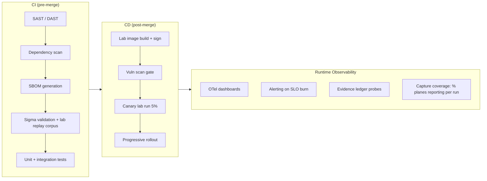

**SLO dashboard essentials:** capture coverage (host% + network% per run), rule-eval latency p95, KPI per technique (precision / recall / F1), report generation duration, FP rate per rule, heartbeat coverage of lab VMs.

---

## 17. Roadmap & Road to MVP

### v0 (MVP) — 💡
- Provision isolated AD lab: DC01 + WK-WIN11 + WK-SRV2019 + FS01 + NSM01, host-only vNIC, deny egress.
- **8 techniques**: SMB admin shares, WinRM, RDP, Pass-the-Hash, Kerberoasting, DCOM, Lateral Tool Transfer, PsExec-service.
- Telemetry: Windows Event Log + Sysmon, Zeek/Suricata + PCAP.
- 25 hand-written Sigma rules + translator → Elasticsearch/Zeek/Suricata.
- Reports: 📗`.xlsx` · 📕`.xls` · 📄`.csv` · 🌐`.html` with RBAC + signed download URLs.

### v1 — 🚀
- +6 techniques (PtT, WMI, SSH, discovery, service, valid-account anomalies).
- ATT&CK Navigator layer + per-technique baseline models.
- Rule approval workflow + staged rollout + FP telemetry per rule.

### v2 — 🌐
- Multi-domain lab (forest trusts) + cross-domain movement.
- SOAR connectors; auto-quarantine (opt-in, out of scope for MVP).
- Multi-tenant + RBAC expansion; ISO/NIST control-evidence export inside reports (`.pdf`).

---

## Appendix A — Glossary

| Term | Definition |
|------|------------|
| **Lateral movement** | ATT&CK tactic (TA0008) of pivoting host-to-host within a network. |
| **Ground truth** | Harness-emitted, authoritative label of what actually executed — the benchmark for detections. |
| **DetectionRecord** | Canonical event joining telemetry, technique, rule, and evidence. |
| **run_id** | Unique identifier of one lab technique execution. |
| **Sigma** | Open-standard, human-readable SIEM detection-rule format. |
| **Precision / Recall / F1** | TP/(TP+FP), TP/(TP+FN), harmonic mean — per-technique detection quality. |
| **LAB:true** | Mandatory tag that separates lab artifacts from production data. |

## Appendix B — References

- MITRE ATT&CK® — Tactic *Lateral Movement* (TA0008), techniques T1021.x / T1550.x / T1558.003 / T1570 / T1047 / T1543.003.
- MITRE ATT&CK — *Data Sources* (Windows Event Log, Sysmon, Network Traffic, Capture).
- Sigma — *SigmaHQ rules*, `https://github.com/SigmaHQ/sigma`.
- OWASP — *Top 10 2021*, `https://owasp.org/Top10/`.
- NIST — *CSF 2.0*, *SP 800-53 Rev.5*, *SP 800-171 Rev.3* (CUI environments).
- ISO/IEC — *27001:2022 Annex A*.
- Sysinternals — *Sysmon* configuration & event reference, *PsExec* documentation.

---

<div align="center">

**LAMDEX — Architecture v1.0.0** ・ 📗 `.xlsx` ・ 📕 `.xls` ・ 📄 `.csv` ・ 🌐 `.html` ・ 🖨 `.pdf/.png`

*"Simulate it behind glass, detect it everywhere, prove it in evidence."*

</div>