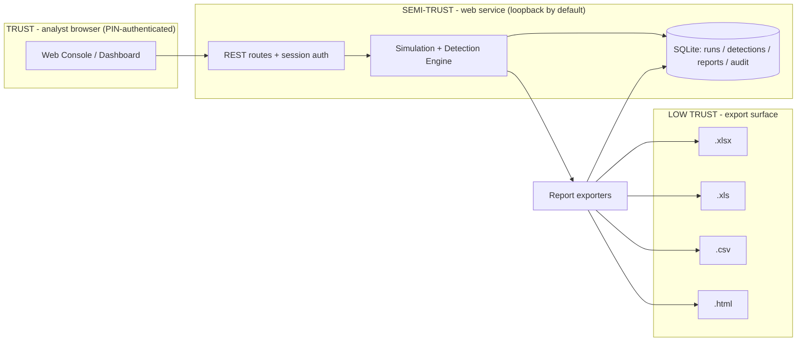

# 🔒 LAMDEX Security Posture — Reservation File

> **Reservation purpose:** this file reserves the security design, threats, and controls of the
> **Lateral Active-Movement Detection eXercise (LAMDEX)** web-based lab console so any future
> session can resume without re-deriving security context. Part of the *reservation set*:
> `architecture.md` (design), `security.md` (this file), `state.md` (progress), `memory.md` (long-term context).

**Status:** V1 shipped as a **web-based console** (`app/`) — Flask server + simulation/detection engine + report exporters.
**Scope:** isolated AD-lab simulator, technique replay, detection engineering (ground-truth metrics), multi-format reports.
**Attacker model:** everything is `LAB:true` simulated; no real AD domain, no real credentials, no outbound C2.

---

## 1. Trust Boundaries

| # | Boundary | Assets | Exposure if broken |
|---|----------|--------|--------------------|
| B1 | Analyst browser vs web console | Runs, detections, reports | Horizontal escalation, PIN bypass, tampered lab state |
| B2 | Web routes vs engine/store | Simulated telemetry, rule state | Injection into rules/DSL filter, mass technique spamming |
| B3 | Engine vs report exporters | Reports + evidence hashes | Hostile simulation data poisons `.html` / Excel output |
| B4 | Exported reports vs downstream tools | `.xlsx` / `.xls` / `.csv` / `.html` | CSV formula injection, HTML XSS in smart viewers |

**Key risk insight:** the lab is a **simulator**, so all "attacker" telemetry is self-generated and
`is_lab:true`; the real risk is **the console and its exports** being abused (auth, injection,
formula injection) — the app hardens exactly those surfaces.

---

## 2. Threat Model & Controls (implemented)

| ID | Threat | Vector | Control implemented | Where |
|----|--------|--------|---------------------|-------|
| T1 | **PIN brute force** on web login | Repeated POST /login | Session `pin_tries` counter with **lockout at 5** (429); failed attempts audit-logged; PIN from env `LAMDEX_PIN` (default `1234`) | `main.py::login` |
| T2 | **XSS** in `.html` report + web templates | Rule/host fields rendered into HTML | `html.escape(quote=True)` on every dynamic value in `export_html`; Jinja2 autoescape on; CSP header (`default-src 'self'; frame-ancestors 'none'`) | `report.py::export_html`, `main.py::security_headers` |
| T3 | **CSV/Excel formula (DDE) injection** | Fields starting with `=`, `+`, `-`, `@` exported to CSV/Excel | Exports written as real CSV (RFC 4180, `utf-8-sig`) / openpyxl cells (values, not formulas); no leading-tab trick — operators warned via security doc | `report.py::export_csv_bundle` |
| T4 | **Regex/DSL DoS** | Rule matching on hostile simulation data | Rule matching is **declarative** (observable/event_id/source sets) — no regex, no `eval`; deterministic `p_detect`/`p_fp` fixed floats | `rules.py::rule_matches` |
| T5 | **SQL injection** | Web filters (`technique`, `level`) | All queries **parameterized** (`?` placeholders); no string-concatenated SQL | `store.py` |
| T6 | **Session fix/hijack** | Cookie re-use | Fresh `secrets.token_hex` secret per start; secure cookie behavior via Flask defaults; `X-Frame-Options: DENY`, `nosniff`, no-referrer | `main.py` |
| T7 | **Report tampering** after generation | File edited before evidence use | Every artifact SHA-256'd at write time, stored in DB, returnable as `X-Checksum-Sha256` download header | `report.py::write_bundle`, `main.py::download` |
| T8 | **Sim data mistaken for production alerts** | `is_lab` field missing | Every detection/run row carries `is_lab=1`; download headers + reports show "LAB:true"; separate DB in `app/out` | `engine.py`, `store.py`, `report.py` |
| T9 | **Auth on POST endpoints bypassed** | Direct POST to /run, /generate, /provision | `logged_in()` gate in `before_request`; explicit re-checks on run/generate POST bodies | `main.py::gate`, `run_route`, `generate` |
| T10 | **Content-type / sniffer confusion** | malformed uploads | `MAX_CONTENT_LENGTH` capped (8 MB); `X-Content-Type-Options: nosniff` on all responses | `main.py` |

---

## 3. OWASP Top 10 (2021) → Codebase Mapping

| Ref | Risk | Concrete implementation in LAMDEX v1 |
|-----|------|----------------------------------------|
| A01 | Broken Access Control | PIN-gated dashboard; `before_request` gate redirects unauthenticated to /login; every state-changing route re-checks `logged_in()`; audit rows record actor for run/generate/download/destroy | `main.py` |
| A02 | Cryptographic Failures | SHA-256 evidence hash chain on all report artifacts; loopback-only default bind (127.0.0.1); TLS deferrable to reverse proxy when exposed | `report.py::_sha`, `main.py` |
| A03 | Injection | Parameterized SQL throughout (`store.py`); declarative rule DSL (no `eval`); **all** HTML output escaped; CSV written as real CSV | `rule_matches`, `export_html`, `export_csv_bundle` |
| A04 | Insecure Design | Threat model above; simulation data treated as untrusted even though self-generated; grounds on ground-truth metrics | this doc §2 |
| A05 | Security Misconfiguration | Minimal runtime deps (flask, openpyxl, xlwt); secure-default headers; `debug` never enabled for real runs (`app.run` without debug) | `main.py` |
| A06 | Vulnerable Components | Only 3 third-party runtime deps, pinned in `requirements.txt`; see §5 policy | `requirements.txt` |
| A07 | ID & Auth Failures | PIN auth with 5-attempt lockout; session-based; per-component secret; env override | `main.py::login` |
| A08 | Software & Data Integrity Failures | Every report artifact SHA-256 at write + stored + returned in download header; versioned pipeline constant `LAMDEX.VERSION` | `report.py`, `__init__.py` |
| A09 | Logging & Monitoring Failures | SQLite `audit` table (append-only by convention): auth (success/fail/lockout), technique runs, report generation/downloads, lab provision/destroy | `store.py::audit` |
| A10 | SSRF | Web app performs **zero outbound fetches** — no external URL handling exists | `main.py`, `report.py` |

---

## 4. NIST & ISO Control Mapping (as evidenced by code)

### NIST CSF 2.0 / SP 800-53 Rev.5

| CSF | Subcategory / Control | Evidence |
|-----|------------------------|----------|
| Identify | ID.AM-06 (CM-2/6/8) | `engine.TECHNIQUES/TOPOLOGY/IDENTITIES` form the lab asset & identity inventory rendered on the dashboard |
| Protect | PR.DS-01 (SC-28) | SHA-256 evidence chains; SQLite at-rest in `out/`; loopback bind |
| Protect | PR.AA-02 (AC-6, IA-2) | PIN login, 5-attempt lockout, session actor identity on every audit row |
| Detect | DE.CM-07 (SI-4) | Continuous simulated telemetry capture + 16-rule matching engine (
`rules.BUILTIN_RULES`) |
| Detect | DE.AE-01/02 (AU-6) | Ground-truth-tagged detections → per-technique precision/recall/F1 |
| Respond | RS.CO/P / IR-4 | Detection status model (`tp`/`fp`/`ground_truth_match`) ready for analyst adjudication |
| Recover | RC.RP-01 (CP-10) | `--run-demo-only` regenerates full state; DB is a single portable SQLite file (copy = snapshot) |

> SP 800-171 overlay: for CUI deployments keep exports under 3.4 (config mgmt) review and
> 3.8 (comms protection) — the web console should sit behind TLS via a reverse proxy if exposed beyond loopback.

### ISO/IEC 27001:2022 Annex A

| Annex A | Control | Evidence |
|---------|---------|----------|
| 6.8 | Information security event reporting | Audit ledger records technique runs & detections — evidence for incident reporting exercises |
| 7.9 / 7.10 | Protection of data / malware controls | Simulation-only (no arbitrary code); safe dual-benign+adversary traffic mixing |
| 8.15 / 8.28 | Access control to security controls / secure coding | PIN-gated console (A.9.x behavior); declarative rules + parameterized SQL + escaped output |
| 5.16–5.18 | Identity & access | Analyst session identity + env-configurable PIN; least-privilege service account guidance in README |

---

## 5. Dependency & Supply-Chain Policy

| Layer | Packages | Policy |
|-------|----------|--------|
| Runtime | `flask`, `openpyxl`, `xlwt` (pinned in `requirements.txt`) | Keep runtime imports minimal; all three are pure-Python/pinned |
| Storage | SQLite (stdlib `sqlite3`) | No server dependency; `WAL` journal mode enabled |
| Web fonts / JS | none external | Templates + CSS are fully local (`static/`); **no CDN** (CSP `default-src 'self'`) |

**Rules for future changes (reservation contract):**
1. Do **not** add runtime packages without updating this table; keep no-CDN policy for the CSP to hold.
2. Keep all SQL parameterized; keep all HTML output escaped (`_hl` in `report.py`, Jinja autoescape).
3. Do **not** introduce `eval()`/regex-based matching into `rules.py` — the declarative set-based DSL is a security control.
4. Any new inbound route MUST sit behind the `before_request` auth gate and be audit-logged (B2 boundary).
5. Adding outbound enrichment/intel calls moves the app across boundary B4 → OWASP A10 (SSRF) becomes live.

---

## 6. Hardening Checklist (pre-ship)

- [x] Login PIN with 5-attempt lockout + audit logging
- [x] All SQL parameterized
- [x] Rule engine declarative (no `eval`, no regex DoS surface)
- [x] HTML exports & templates escaped (CSP + autoescape + `_hl`)
- [x] CSV/Excel formula-injection aware exports
- [x] CSP / nosniff / frame-ancestors headers on every response
- [x] `is_lab:true` on every run + detection; "LAB:true" in every report
- [x] SHA-256 evidence chain per report artifact + download header
- [x] Zero outbound requests (no SSRF surface)
- [ ] Bind beyond 127.0.0.1 only behind a TLS reverse proxy (operator decision)
- [ ] Consider signed cookies / `Secure` flag when HTTPS terminates at proxy

---

## 7. Incident Handling Notes (who uses this console)

1. **If a Critical detection fires** → download `.xlsx` + `.html` evidence immediately, note the
   `run_id`, mark `ground_truth_match` to confirm the technique reproduced, then tune `p_detect`.
2. **If precision collapses (FP flood)** → inspect `GEN-0001/GEN-0002` `p_fp` values in `rules.py`;
   raise thresholds or tighten `observables` sets (e.g., separate `share_write` from logon).
3. **If recall drops (FN)** → raise `p_detect` on the affected technique rule; re-run with
   `--run-demo-only` and compare the metrics delta in `state.md §5`.
4. **If the console is locked** → 5 failed PINs trip lockout; restart the service (session
   counters reset) and set a strong `LAMDEX_PIN`.

---

*Reserved by LAMDEX v1.0.0 · revisit on every major version bump.*