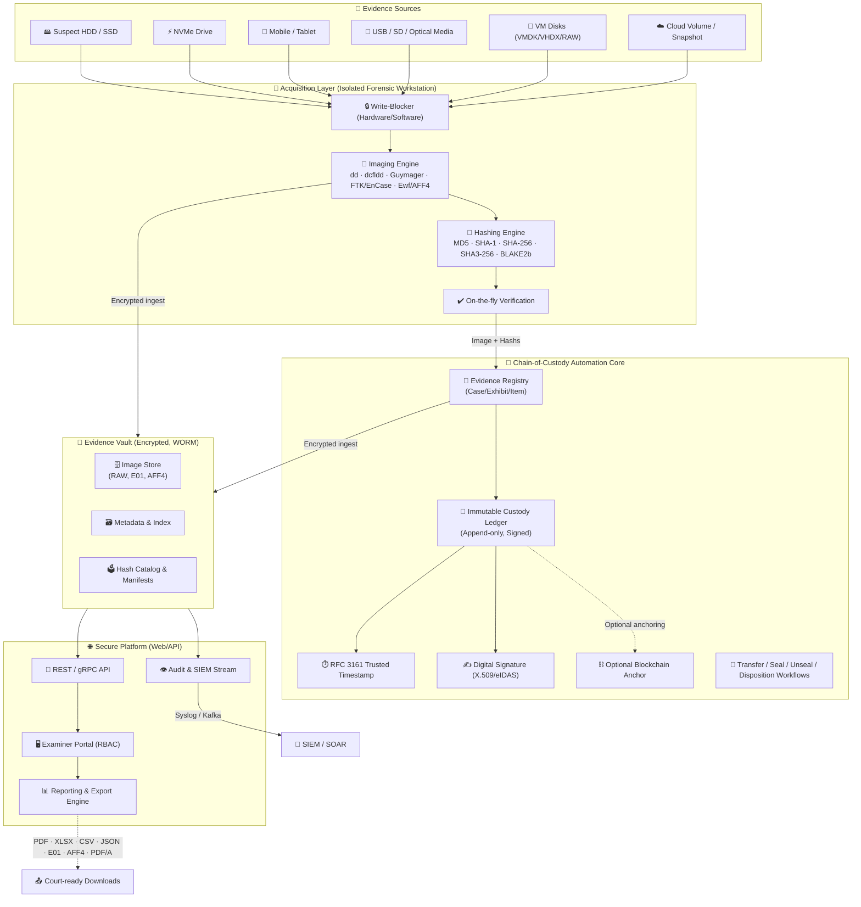
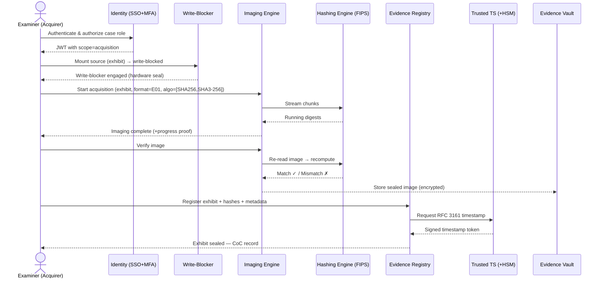
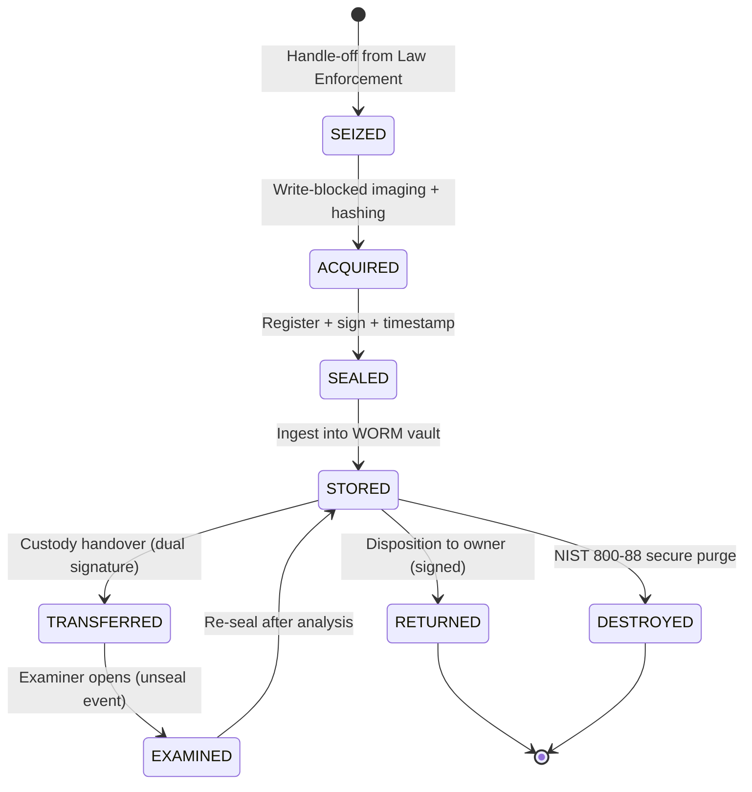
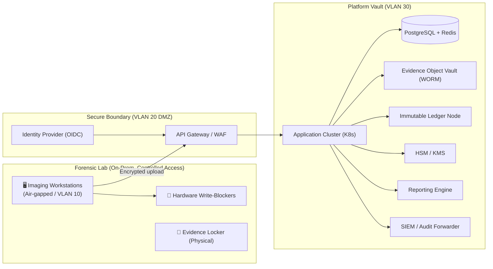

# 🛡️ Disk Image Acquisition & Hashing Toolkit
## Chain-of-Custody Automation — Solution Architecture (v1.0)

> **A forensically-sound, cyber-law-compliant platform for acquiring disk images, computing verifiable hashes, and automating a tamper-evident chain of custody end-to-end.**

     

---

## 📑 Table of Contents

1. [Document Control](#1-document-control)
2. [Executive Summary](#2-executive-summary)
3. [Objectives & Success Criteria](#3-objectives--success-criteria)
4. [Legal & Cyber-Law Compliance Framework ⚖️](#4-legal--cyber-law-compliance-framework)
5. [Security Framework Mapping (ISO 27001 · NIST · OWASP · CIS)](#5-security-framework-mapping)
6. [Solution Architecture 🏗️](#6-solution-architecture)
7. [Technical Design — Acquisition & Hashing Engine](#7-technical-design--acquisition--hashing-engine)
8. [Chain-of-Custody Automation 🔒](#8-chain-of-custody-automation)
9. [Technology Stack 💻](#9-technology-stack)
10. [Data Protection (At-Rest · In-Transit · In-Use)](#10-data-protection)
11. [API Design](#11-api-design)
12. [Reporting & Industry-Standard Download Formats 📄](#12-reporting--industry-standard-download-formats)
13. [Threat Model (STRIDE) & Mitigations](#13-threat-model--mitigations)
14. [Network & Deployment Architecture](#14-network--deployment-architecture)
15. [Audit Logging & Compliance Evidence](#15-audit-logging--compliance-evidence)
16. [Performance, Scalability & Availability](#16-performance-scalability--availability)
17. [KPIs & Success Metrics](#17-kpis--success-metrics)
18. [Implementation Roadmap](#18-implementation-roadmap)
19. [Appendix A — Compliance Checklist](#appendix-a--compliance-checklist)
20. [Appendix B — References & Standards](#appendix-b--references--standards)

---

## 1. 📋 Document Control

| Attribute | Value |
|---|---|
| **Document Title** | Disk Image Acquisition & Hashing Toolkit — Solution Architecture |
| **Version** | 1.0 |
| **Classification** | 🟢 Internal / Restricted |
| **Date** | 20 September 2026 |
| **Owner** | Platform Engineering — Digital Forensics Practice |
| **Reviewers** | Information Security Officer, Legal / Data Protection, Forensics SMEs |
| **Approval** | CISO |
| **Review Cycle** | Quarterly or upon framework update (ISO 27001:2022, NIST SP 800-series) |
| **Related Privacy Regimes** | GDPR, CCPA, eIDAS, Indian IT Act 2000 (s.65B), UK PACE/ACPO, UAE & GCC Data Protections |

---

## 2. 🚀 Executive Summary

This architecture defines a **forensically sound** platform that:

1. **Acquires** bit-for-bit forensic images of storage media (RAW/dd, E01/EWF, AFF4, VMDK/VHDX) using **hardware & software write-blockers** so the evidentiary media is never altered.
2. **Hashes** every image at acquisition time and again during verification using **MD5 / SHA-1 / SHA-256 / SHA3-256 / BLAKE2b** with recomputation on demand (bit-level verification).
3. **Automates chain-of-custody** — every custody event (collector, transfer, examiner, storage, disposition) is timestamped (RFC 3161), digitally signed (X.509 / eIDAS), and appended to an **immutable, audit-protected ledger** with optional **blockchain anchoring**.
4. **Generates court-ready evidence**: hash manifests (CSV/JSON/XLSX), forensic reports (PDF/A), acquisition logs (`.L01/.E01`), and chain-of-custody charts — all downloadable in industry-standard formats.
5. **Embeds security & privacy by design**: aligned with **ISO/IEC 27001:2022**, **NIST SP 800-86 / 800-101 / 800-115 / 800-53**, **NIST CSF**, **OWASP Top 10 (2021)** and **CIS Controls v8**, while satisfying admissibility frameworks (**Daubert/Frye**, **FRE 901/902**, **ACPO principles**, **ISO/IEC 27037/27042**).

> **Outcome:** Evidence that is *authentic, reliable, complete, and legally admissible* from the moment the media is seized to the moment it is presented in court.

---

## 3. 🎯 Objectives & Success Criteria

| # | Objective | Success Criteria (KPI) |
|---|---|---|
| 1 | Forensic-grade, bit-identical acquisition | ≤ 0 bit differences vs. source (verified hash match = 100%) |
| 2 | Multi-algorithm hashing with verification | SHA-256 (+SHA3) baseline; verification replay on every transfer |
| 3 | Automated, tamper-evident chain of custody | 100% of custody events logged + signed; zero manual paperwork |
| 4 | Court-admissible output | Reports signed, timestamped, hash-locked; eDiscovery-compatible (CSTC/EDRM) |
| 5 | Security & privacy compliance | ISO 27001:2022 Annex A, NIST SP 800-53, GDPR Art. 32, OWASP Top 10 |
| 6 | Auditable & immutable evidence trail | WORM storage + signed audit trail; blockchain attestation optional |
| 7 | Scalable enterprise delivery | Parallel imaging, cloud-optional vault, RBAC, SSO |

---

## 4. ⚖️ Legal & Cyber-Law Compliance Framework

### 4.1 Evidence Admissibility — Global Standards

The platform is engineered so collected evidence survives the three classic admissibility tests:

| Test / Rule | Jurisdiction | How the Architecture Satisfies It |
|---|---|---|
| **Daubert / Frye** | USA (Federal Courts) | Tools validated (hash algorithms FIPS 140-3 validated libs), methodology reproducible, error rates documented |
| **Federal Rules of Evidence (FRE) 901** | USA | Authentication via hash-locked records + digital signatures |
| **FRE 902(11)/(12)** | USA | Self-authenticating certified records + certificates |
| **FRE 1001/1002 (Best Evidence)** | USA | Original media write-blocked; byte-identical copy treated as best evidence |
| **ACPO Principles 1–4 (PACE 1984)** | UK | Write-blocker hardware, no alteration, competent operator, audit trail |
| **Indian IT Act 2000, s.65B** | India | Digital signature + hash certification as electronic record evidence |
| **eIDAS Regulation 910/2014** | EU | Qualified electronic signatures & RFC 3161 trusted timestamps |
| **GDPR Art. 5(1)(f) & Art. 32** | EU | Integrity & confidentiality; encryption, pseudonymisation, RBAC, audit logs |
| **Directive 2014/41/EU (EIO)** | EU | Standardised preservation & production across cross-border requests |

### 4.2 Forensic Process Standards

| Standard | Purpose | Application in Solution |
|---|---|---|
| **ISO/IEC 27037:2012** | Identification, collection, acquisition & preservation of digital evidence | Acquisition workflows, handling policies, preservation vault |
| **ISO/IEC 27042:2015** | Analysis & interpretation of digital evidence | Analysis workspace isolation, tool validation, review process |
| **ISO/IEC 27041:2015** | Assurance for investigating methods/tools | Tool qualification & calibration register |
| **ISO/IEC 27043:2015** | Incident investigation principles & processes | Evidence lifecycle state machine |
| **NIST SP 800-86** | Integrated investigative process | Four-phase model (collection, examination, analysis, reporting) |
| **NIST SP 800-101** | Digital forensics (mobile/disk) | Imaging & preservation best practice |
| **NIST CFTT** | Computer Forensic Tool Testing | Tool validation against CFTT test images |

### 4.3 Evidentiary Pillars (CIA\(^+\) for Evidence)

- 🔹 **Authenticity** — prove *nothing changed*: cryptographic chained hashes at every step.
- 🔹 **Reliability** — our tools/processes behave consistently (validated against NIST CFTT vectors).
- 🔹 **Completeness** — no gaps: every byte acquired, every event recorded, no exceptions unlogged.
- 🔹 **Admissibility** — documentation satisfies court rules (signed, certified, timestamped).
- 🔹 **Preservation** — write-blocking + WORM storage so the exhibit and its copy remain pristine.

---

## 5. 🛡️ Security Framework Mapping

### 5.1 ISO/IEC 27001:2022 — Annex A Control Mapping (Key Controls)

| Annex A Control | Requirement | Implementation |
|---|---|---|
| A.5.1 Policies | Information security policies | Forensic handling & acceptable-evidence policies |
| A.5.10/5.11 Asset management | Acceptable use; return of assets | Media lifecycle registry, return-of-exhibit workflows |
| A.6.2 Access control | Restrict access | RBAC, SSO (SAML/OIDC), MFA, least privilege, session timeouts |
| A.5.15 Access control policy | Access control policy | Segregated roles (Acquirer, Examiner, Approver, Auditor) |
| A.8.9/8.10/8.11 | Config change, information deletion | Patch pipeline, secure destruction of case data (NIST 800-88 purge) |
| A.8.12 Prevention of information leakage | Data leakage prevention | DLP on report export, watermarking, canary hashes |
| A.8.15 Logging | Logging | Tamper-evident, forward-only audit logger (WORM) |
| A.8.16 Monitoring | Monitoring | SIEM integration, anomaly detection on vault access |
| A.8.24 Use of cryptography | Cryptographic controls | HSM-backed keys, FIPS 140-3 validated crypto, algorithm policy |
| A.8.28 Secure coding | Secure coding | SDLC with SAST/DAST, dependency scanning (OWASP DC) |
| A.8.29 Security testing | Vulnerability mgmt | Quarterly pentest, annual red-team, ATO gate |
| A.7.10/7.11/7.12 | HR security | Background checks, NDA, coC training for personnel |
| A.5.23 Cloud services security | Cloud security | Cloud-native controls, SSE (CASB), posture scanning |
| A.8.16 BCDR (A.5.29/5.30) | Business continuity | RPO ≤ 15 min, RTO ≤ 4 hrs for vault metadata |

### 5.2 NIST SP 800-53 / NIST CSF

| NIST CSF Function | SP 800-53 Control Family | Implementation |
|---|---|---|
| **Identify** | Risk Assessment (RA), Asset Management (CM) | Media/evidence asset inventory, risk register |
| **Protect** | Access Control (AC), Data Integrity (SI-7), Crypto (SC-13) | RBAC+MFA, hash-locking, HSM, encryption |
| **Protect** | Awareness & Training (AT) | Annual forensics+security training, phishing drills |
| **Detect** | Monitoring (SI-4), Audit (AU) | SIEM, UEBA, integrity monitoring of vault |
| **Respond** | Incident Response (IR-4) | IR runbook, NIST 800-61 aligned playbooks |
| **Recover** | Recovery (CP) | Restore drills, hash re-verification post-restore |

### 5.3 OWASP Top 10 (2021) Mapping for the Application/API Layer

| Rank | OWASP A1–A10 | Countermeasure in Platform |
|---|---|---|
| A01 | Broken Access Control | RBAC + ABAC policies, deny-by-default, API scoped tokens (OAuth2 JIT) |
| A02 | Cryptographic Failures | TLS 1.3, AES-256-GCM, HSM keys, passwordless/SSO, no hardcoded secrets |
| A03 | Injection | Parameterised queries, ORM, strict input validation (OWASP ASVS L3) |
| A04 | Insecure Design | Threat modelling at design, rate limiting, sequence locks on exports |
| A05 | Security Misconfiguration | IaC golden images, CIS benchmarks, CSP headers, HSTS, no default creds |
| A06 | Vulnerable Components | SBOM, Dependabot, image scanning (Trivy), monthly patching |
| A07 | Identification & Auth Failures | MFA mandatory, session fixation protection, account lockout |
| A08 | Software/Data Integrity Failures | Signed artifacts, hash-verified downloads, CI supply-chain attestation |
| A09 | Logging & Monitoring Failures | Centralised WORM logging, SIEM alerting, log completeness tests |
| A10 | SSRF | Egress allow-lists, URL schema validation, network microsegmentation |

### 5.4 CIS Controls v8 (Highlights)

| Control # | Area | Implementation |
|---|---|---|
| 3 | Data Protection | Encryption, secure vault, retention & purge |
| 11 | Data Recovery | RPO/RTO replicas with hash re-verification |
| 13 | Network Monitoring | East-west segmentation, TLS inspection where lawful |
| 16 | Application Security | Secure SDLC pipeline, pen-tested releases |
| 18 | Penetration Testing | Annual external + in-scope forensics lab testing |

---

## 6. 🏗️ Solution Architecture

### 6.1 High-Level Logical Architecture

### 6.2 Component Responsibilities

| Layer | Component | Responsibility |
|---|---|---|
| **Acquisition** | Write-Blocker Service | Hardware (WBS) or kernel-level (libewf / Apple DART / custom filter driver) blocking of all writes to source media |
| **Acquisition** | Imaging Engine | Bit-stream copy to RAW/EWF/AFF4; chunked, resumable, parallel (dcfldd) |
| **Crypto** | Hashing Engine | Streaming multi-algorithm digest (MD5/SHA-1/SHA-256/SHA3-256/BLAKE2b) with FIPS-validated libs |
| **Crypto** | Verification Service | Recompute hashes → compare against sealed manifest → pass/fail attestation |
| **CoC** | Evidence Registry | Master record for case → exhibit → item hierarchy with state machine |
| **CoC** | Custody Ledger | Append-only signed event log (user, action, time, hash-chain linkage) |
| **CoC** | Trusted Timestamp | RFC 3161 TSA integration (DigiCert, SwissSign, national TSP) |
| **CoC** | Signing Service | X.509 / eIDAS QES signing of manifests & reports (HSM backed) |
| **Storage** | Evidence Vault | Versioned object store (S3-compatible / NAS), WORM compliance bucket |
| **Platform** | API Gateway | OAuth2/OIDC, rate limiting, schema validation, audit hooks |
| **Platform** | Reporting Engine | Renders signed PDF/A, XLSX/CSV manifests, JSON evidence packs, eDiscovery packages |
| **Platform** | Audit Stream | Forms the single source of truth for auditors; forwarded to SIEM |

---

## 7. 🔧 Technical Design — Acquisition & Hashing Engine

### 7.1 Acquisition Workflow (Sequence)

### 7.2 Hashing Strategy

| Aspect | Design Decision |
|---|---|
| Primary hash (integrity) | **SHA-256** (FIPS 180-4) — court-accepted baseline |
| Secondary hash (collision resistance) | **SHA3-256** or **BLAKE2b** for defence-in-depth |
| Legacy compatibility | **MD5 + SHA-1** maintained for interchange with legacy tools (marked non-authoritative) |
| Computation | Incremental/streaming over 4 MiB chunks; parallel pipelines per core |
| Verification | Full image re-hash on: acquisition, vault ingest, vault egress, restore test, transfer between labs |
| Hash manifest | JSON/CSV/XLSX per exhibit: `{path, algorithm, digest, size, chunks, timestamp, signer}` |
| Chunk-level hashing | Per-chunk digests enable partial-verification & resumable transfer |

### 7.3 Acquisition Formats

| Format | Description | Use Case |
|---|---|---|
| **RAW (dd/dcfldd)** | Bit-for-bit raw image | Interop, heavy compute |
| **EWF (.E01/.Ex01)** | Expert Witness Format (EnCase) | Court/industry standard, compressed, case metadata embedded |
| **AFF4** | Advanced Forensic Format 4 | Flexible containers, segmented, hashing per segment |
| **VMDK / VHDX** | Virtual disk formats | VM/cloud evidence |
| **Memory (LiME/WinPmem)** | RAM acquisition | Volatile evidence (peripheral to scope) |

### 7.4 Tool Validation

- 🔎 Algorithms validated against **NIST CFTT** & **NIST CAVP** vectors before release.
- 🧪 Tag/software integrity: images and reports shipped with **signature + hash** (A08 supply-chain control).
- 📋 Tool callback register maintained under ISO/IEC 27041.

---

## 8. 🔒 Chain-of-Custody Automation

### 8.1 Custody State Machine

### 8.2 Automation Details

1. **Every event is a ledger record**: `{Seq, EventID(UUID), ExhibitID, Actor, Role, Action, BeforeHash, AfterHash, UTC Timestamp, Signature, TSA Token}`.
2. **Hash chaining**: each record contains `prev_hash` → forms a **Merkle/Hash-chain**; altering one record invalidates the entire chain.
3. **Threat actors must be authenticated**: RBAC + MFA; custody actions require **two-person rule** for high-impact events (handover, disposition).
4. **Trusted timestamps (RFC 3161)** from accredited TSAs make time legally provable.
5. **Blockchain anchoring (optional)**: daily Merkle-root committed to a permissioned chain (Hyperledger Fabric / Quorum) or public anchoring (Bitcoin/Arete/RegenLedger-style) for extra indep. attestation.
6. **Smart notifications**: every custody event notifies case owners (email/WebHook) → automated, human-readable CoC timeline.
7. **Report** auto-generates the *Chain-of-Custody Log* (signed PDF/A) summarising the whole lifecycle.

### 8.3 Two-Person Rule & Segregation of Duties

| Pair | Prevents |
|---|---|
| Acquirer ≠ Signer | Single-person fabrication of records |
| Examiner ≠ Approver (case lead) | Undetected evidence tampering |
| Vault Admin ≠ Auditor | Insider-only modification (WORM still enforced) |

---

## 9. 💻 Technology Stack

| Tier | Technology (Recommended) |
|---|---|
| **Imaging & Hashing** | `dd`/`dcfldd`, `guymager`, `libewf`/`libafflib`, OpenSSL (FIPS), BLAKE2b via libsodium; validated against NIST CAVP |
| **Write Blocking** | Tableau/TD-series hardware, WisyCom, or kernel filter-driver (iStorage/Windows Filter Manager) |
| **Backend** | Go / Rust (or Node 20 LTS), PostgreSQL 16, Redis (cache/queues) |
| **Storage** | MinIO / AWS S3 (Object Lock = WORM), NetApp/NAS for on-prem lab; encrypted EBS/SSD |
| **Crypto/HSM** | AWS KMS / Azure Key Vault / Thales Luna / Nitrokey HSM gateways |
| **Trusted Time** | RFC 3161 TSA client → accredited national/DigiCert TSA |
| **Web/API** | REST (Fastify/Express or Go Chi) + gRPC; OpenAPI 3.1 specs |
| **Frontend** | React 18 + TypeScript, Vite, Tailwind (dark forensic UI), charts (Recharts) |
| **AuthN/Z** | Keycloak / Azure AD with OIDC+SAML, MFA, scoped OAuth2 |
| **Audit/SIEM** | OpenSearch/Splunk, Kafka, Vault logging (append-only) |
| **Reports** | NodePDF / wkhtmltopdf → PDF/A-1b, SheetJS → XLSX, JasperReports optional |
| **Packaging** | Docker + K8s (or on-prem), Helm, Terraform, Ansible |
| **Observability** | Prometheus + Grafana, Opentelemetry, Loki |

---

## 10. 🔐 Data Protection (At-Rest · In-Transit · In-Use)

| State | Controls |
|---|---|
| **At Rest** | AES-256-GCM/SSE-S3 object encryption; DB TDE; HSM-wrapped keys; key rotation ≤ 90 days; WORM object locks |
| **In Transit** | TLS 1.3 (mTLS for internal), IPSec tunnels between lab & cloud, no cleartext storage of manifests |
| **In Use** | Memory-safe languages, encrypted RAM for decryption buffers (core dumps disabled), isolated exam VMs |
| **Keys & Secrets** | Externalised to vault; no secrets in env/config; ephemeral signing keys in HSM |
| **Backup** | Encrypted backups with monthly restore drills **+ fingerprint re-verification** of restored images |

---

## 11. 🔌 API Design

> **Base path:** `https://{platform}/api/v1` — OAuth2 client credentials + PKCE. All mutating endpoints write an audit record with the actor's identity.

| Endpoint | Method | Purpose | Auth Scope |
|---|---|---|---|
| `/evidence` | `GET/POST` | List / register evidence item | `evidence.read/write` |
| `/evidence/{id}/acquire` | `POST` | Start acquisition job (async) | `acquisition.start` |
| `/acquisition/{jobId}` | `GET` | Job status + progress + streaming hashes | `acquisition.read` |
| `/evidence/{id}/verify` | `POST` | Re-hash & verify vs. sealed manifest | `evidence.verify` |
| `/evidence/{id}/custody` | `GET` | Full chain-of-custody timeline | `custody.read` |
| `/custody/events` | `POST` | Record handover/seal event (2-person) | `custody.sign` |
| `/evidence/{id}/timestamp` | `POST` | Request RFC 3161 TSA token | `custody.sign` |
| `/evidence/{id}/download` | `GET` | Download image / format container | `evidence.download` |
| `/reports/{caseId}/export` | `GET ?fmt=pdf|xslx|csv|json|edrm` | Export signed report pack | `reports.export` |
| `/audit/events` | `GET` | Query audit (read-only, SIEM mirror) | `audit.read` |

**API Security (OWASP alignment):** rate limits, decimal-bounded payloads, strict OpenAPI spec validation, content-type enforcement, signed download URLs, object-level authorization on every route.

---

## 12. 📄 Reporting & Industry-Standard Download Formats

### 12.1 Native Report Packs (Court-ready)

| Format | Purpose | Notes |
|---|---|---|
| **PDF/A-1b** | Formal forensic report + CoC log | Digitally signed (QES), RFC3161-timestamped, hash-stamped |
| **XLSX** | Hash manifest, acquisition stats | Multi-sheet: exhibits / hashes / events / tooling |
| **CSV** | Machine-readable hash & custody data | UTF-8 BOM, court-import safe |
| **JSON** | Evidence manifest (automatable) | Includes digest, chunk map, signatures, TSA chain |
| **HTML** | Interactive examiner view | Printable to PDF, bookmarkable custody timeline |
| **E01 / Ex01** | Acquired image + case metadata | EnCase-standard container |
| **AFF4** | Segmented forensic container | Per-segment hashes, verifiable |
| **RAW (dd)** | Bit-image transfer | For lab-to-lab exchange |
| **XIR (EnCase Evidence Processor)** | Automated report interchange | For downstream e-Discovery |
| **XML (NIST-style)** | Interoperable evidence metadata | Backs automated ingestion by partner tools |
| **EDRM XML / CSTC** | eDiscovery production set | Load files, native files, dedup summary |
| **Signed PDF CoC chart** | Visual custody timeline | Colour-coded: handover / seal / analyse / dispose |

### 12.2 Download Security

- 🔐 All downloads are **signed + hash-attached** (`.sig` and `SHA256SUMS`).
- ⏳ Exports are **single-use, expiring URLs** (S3 pre-signed) logged in audit.
- 🎁 Batch export creates a **totally bundled evidence pack** (ZIP/PGP-encrypted) with its own manifest (hash-of-refs).
- 📅 Every generated report records **who downloaded what, when, and to where** (geo/business context) for subpoena readiness.

---

## 13. 🧨 Threat Model (STRIDE) & Mitigations

| STRIDE | Threat Scenario | Mitigation |
|---|---|---|
| **Spoofing** | Fake examiner or forged CoC record | MFA + X.509 QES + HS-keys; verify signatures on every read |
| **Tampering** | Hash or ledger altered during transit/storage | Hash chain + Merkle roots + WORM + blockchain anchor + HSM signing |
| **Repudiation** | "I never touched the evidence" | Non-repudiable signed events, TSA tokens, two-person rule |
| **Information Disclosure** | Image/responsive data leak | Encryption, RBAC → ABAC, DLP, pre-signed short-lived URLs, access anomaly alerts |
| **DoS** | Export/API flooded during a case | Rate limiting, quotas, WAF, autoscaling, queue isolation |
| **Elevation of Privilege** | Insider escalates to delete ledgers | 4-eyes changes, immutable DB (append-only), OS hardening, SIEM |

**Additional risk register highlights:** supply-chain tool compromise (SBOM+signatures), write-blocker failure (hardware watchdog + post-acquisition hash verification), cloud region sovereignty (data-residency policy per case jurisdiction), cross-border transfer of evidence (EIO + local DPA approval).

---

## 14. 🌐 Network & Deployment Architecture

- **Network segmentation** across VLANs; egress allow-lists only (A10 SSRF defence).
- **Environment**: `dev → staging → prod`; prod uses least-privilege service accounts and IaC-only changes.
- **Disaster Recovery**: secondary region/on-prem replica; RPO 15 min / RTO 4 hr with hash re-verification of restored images.
- **Sovereignty**: case data pinned to jurisdiction-approved data centres (GDPR/EIO compliance).

---

## 15. 🗃️ Audit Logging & Compliance Evidence

| Audit Requirement | Implementation |
|---|---|
| Who/what/when/where | Structured `CEF/JSON` events; NTP-drifted clock discipline |
| Tamper evidence | Append-only store; hash-chained log blocks; SIEM replay checks |
| Retention | 7 years (min) or per evidence retention policy; archive cold storage |
| Court readiness | Signed official log exports (PDF/A) |
| Monitoring | Real-time alerting for: failed acquisitions, hash mismatch, out-of-hours vault access, bulk export |
| Independent assurance | Quarterly audit sampling; authorised Verifier role (read-only) for auditors |

---

## 16. ⚡ Performance, Scalability & Availability

| Concern | Approach |
|---|---|
| Throughput | Parallel imaging workers (N workers × tools); chunked streaming; nb-core saturation |
| Large media | 4/8 TB images handled via chunk-map + resumable acquisition (dcfldd/build sparse logic) |
| Hash speed | SIMD-accelerated SHA-256/SHA3 (e.g., OpenSSL + Intel SHA-NI) ≥ 1–2 GB/s per core |
| Storage growth | Tiered vault (hot → cold → archive), dedup for known clean images (whitelist hashes) |
| HA | Multi-AZ cluster; DB replicas; active/standby reporting engine; 99.9% SLA |
| Concurrency | Autoscaling queue (Kafka/SQS) for acquisition & export jobs |

---

## 17. 📊 KPIs & Success Metrics

| Metric | Target |
|---|---|
| Acquisition bit-accuracy (hash match) | 100% |
| Mean time to verified acquisition (1 TB) | ≤ 40 min |
| CoC events automated (no manual forms) | 100% |
| Reports accepted without forensic objection | ≥ 98% (audit by defence review board) |
| Security test pass rate (OWASP ASVS L3) | 100% (no critical/high) |
| Audit finding closure time | ≤ 30 days |
| Vault availability / recovery verified | 99.9% / quarterly restore drill |

---

## 18. 🛣️ Implementation Roadmap

| Phase | Scope | Exit Criteria |
|---|---|---|
| **P0 — Foundations (4 wks)** | Requirements, threat model, ISO 27037 process design, lab VLANs, HSM/TSA integration, CI/CD | Risk assessment signed-off |
| **P1 — Core (8 wks)** | Acquisition+hashing engine, write-blocker integration, evidence registry, vault (WORM), API | 1 TB image acquired & verified end-to-end |
| **P2 — CoC Automation (6 wks)** | Crypto ledger, signing/TSA, two-person workflows, notifications | 100% signed CoC events |
| **P3 — Reporting (4 wks)** | PDF/A, XLSX/CSV/JSON, E01/AFF4 export, eDiscovery pack | Court-format report produced & signed |
| **P4 — Security & Compliance (6 wks, ongoing)** | OWASP ASVS L3 test, pentest, ISO 27001 gap remediation, audit trail hardening | ATO granted; ISMS internal audit pass |
| **P5 — Scale & Enhance (ongoing)** | Multi-site, blockchain anchor, AI-assisted triage, memory acquisition | Global capacity & new evidence classes |

---

## 19. ✅ Appendix A — Compliance Checklist

- [ ] ISO/IEC 27001:2022 Annex A controls mapped (Section 5.1)
- [ ] NIST SP 800-86 / 800-101 / 800-53 / 800-115 aligned workflows
- [ ] NIST SP 800-88 media sanitisation policy (disposition of exhibits)
- [ ] OWASP Top 10 & ASVS Level 3 verified by independent pentest
- [ ] ISO/IEC 27037/27042/27041 tool & process qualification docs
- [ ] ACPO / FRE 901 / IT Act s.65B / eIDAS evidence-pack templates
- [ ] RFC 3161 trusted timestamp integration certified by accredited TSA
- [ ] RBAC + MFA + Segregation of Duties + Two-person rule documented
- [ ] WORM vault + immutable ledger + blockchain anchoring enabled
- [ ] Data protection: encryption at rest/in transit, keys in HSM, retention & purge
- [ ] DR plan with monthly hash-verified restore drill
- [ ] SIEM monitoring with evidence-integrity alerting

---

## 20. 📚 Appendix B — References & Standards

| Category | Documents |
|---|---|
| **Standards** | ISO/IEC 27001:2022, ISO/IEC 27037, 27038, 27041, 27042, 27043 |
| **NIST** | SP 800-53 r5, SP 800-86, SP 800-101 r2, SP 800-115, SP 800-61 r3, SP 800-88 r1, SP 800-64, CFTT / CAVP / FIPS 180-4, 202 |
| **Secure coding** | OWASP Top 10 2021, OWASP ASVS 4.0, OWASP API Security Top 10 |
| **Legal** | FRE 901/902/1001, Daubert v. Merrell Dow, Frye, UK ACPO Principles (PACE 1984), Indian IT Act 2000 s.65B, eIDAS Reg. 910/2014, GDPR Art. 5/32, Directive 2014/41/EU, SWGDE recommended practices |
| **Format specs** | EnCase EWF (E01), AFF4 spec, RFC 3161 (TSA), RFC 5652/5126 (CMS/TS), OpenDocument/PDF-A ISO 19005-1 |
| **Registry** | SWGDE, IOCE, IEEE 2600-series, ISO/IEC 17025 (lab accreditation) |

---

### ✍️ Sign-off

| Role | Name / Org | Signature | Date |
|---|---|---|---|
| Solution Architect | | | |
| CISO / InfoSec | | | |
| Forensic SME | | | |
| Legal / Data Protection | | | |

> ⚠️ **Disclaimer:** This architecture is engineering guidance, not legal advice. Admissibility is ultimately judged per-case by the relevant court; engage qualified counsel for your jurisdiction.