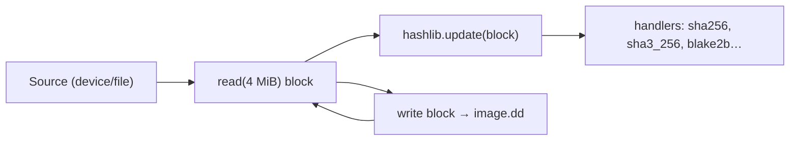

# 🧠 DIHT — Memory Model, Volatile Evidence & Preservation (memory.md)

> **Disk Image Acquisition & Hashing Toolkit — Portable Build v1.0.0**
> Documents (a) how the tool manages **its own memory** to keep secrets and
> evidence bytes safe, and (b) how **volatile memory preservation** is handled
> in the acquisition workflow — because RAM is the most fragile part of the
> evidence lifecycle.

---

## 1. 🧬 Two Concerns

| Concern | Scope | Owner |
|---|---|---|
| **App memory hygiene** | How DIHT holds buffers, hashes, secrets in RAM | this document §2–§4 |
| **Volatile evidence preservation** | Rules for capturing/preserving suspect RAM (memory forensics) | this document §5 |

---

## 2. 📦 App Memory Model (Constant-Memory Streaming)

Disk images are multi-GB/TB. DIHT therefore **never** loads an image into RAM.
It processes the source/intermediate as fixed 4 MiB blocks through a single
pipeline, keeping memory flat:

- **One read buffer + one write buffer + one hasher state set** regardless of
  total image size ⇒ O(1) memory vs. image size.
- Digests are accumulated in the algorithm's rolling state; hex digests are
  emitted only at the end.
- Cancellation (`--cancel`) breaks the loop between blocks; no partial state
  is written back to the source.

---

## 3. 🔑 Secret Handling (Passphrase & Derived Key)

| Policy | Implementation |
|---|---|
| Secrets in RAM only | Passphrase lives in the `CTkEntry` widgets during a session |
| Immediate non-persistent derivation | Passed straight to `PBKDF2-HMAC-SHA256` → 32-byte key in a local variable |
| Salt burned to disk (safe) | Salt + iteration count are **not secret**; they are stored for re-derivation |
| No plaintext key on disk | Only `key_fingerprint` (SHA-256 prefix) is stored, used to detect wrong passphrase |
| Zeroisation on close | `_on_close()` clears both passphrase fields; key object falls out of scope (garbage collected) |
| No swap leak mitigation note | Recommend running on an encrypted OS volume / with pagefile encryption to prevent passphrase remnants in swap |

> MVars note: CPython does not guarantee arena reuse, so no tool can *hard*
> guarantee zeroisation. We minimise exposure by: no copies where possible,
> short key lifetime, and no serialisation/export of the key anywhere.

---

## 4. 💾 Memory Residency Facts (for audit)

| Residency question | Answer |
|---|---|
| Image bytes held in RAM at once? | Only the current 4 MiB block |
| Unlimited hashing memory growth? | No — fixed hasher states |
| Passphrase written to temp/swap files? | No application file writes of secrets |
| Key material exported to logs/ledger? | No — only a fingerprint |
| Worker thread count | 1 background worker per operation; UI thread never blocked |
| Garbage collection | Standard CPython; no cycles retained across operations |

---

## 5. 🧯 Volatile Memory Preservation (RAM Evidence Guidance)

RAM (live memory) is **higher-order evidence** that disk imaging cannot
preserve. Practices codified alongside this toolkit:

| Rule | Why | How |
|---|---|---|
| **Capture volatile first** | RAM disappears on power-off | Use *memory-first* triage before disk imaging where lawful |
| **Order of volatility** (RFC 3227) | 1) registers/cache 2) RAM 3) swap 4) disk 5) network 6) backups | ARPO/PACE-compatible sequence |
| **Never image RAM into the target machine's swap** | Evidence would be corrupted | Remote/acquisition-on-demand capture over a secure link, or RAM-only bootable imaging OS |
| **Memory dump integrity** | RAM dumps need hashes too | Hash the dump stream with the same SHA-256/SHA3-256 engine |
| **Tool itself is evidence-safe** | A forensic tool must not modify the target's RAM footprint | The tool does not open network handles, does not write to the target filesystem, uses no instrumentation into target processes |
| **Live-analysis guard** | Executing on a target modifies its state | Prefer dead imaging; if live is required, record why and order (ACPO Principle 1) |

### Tool support today
- ✅ This build hashes memory-dump streams and files with the same engine.
- 🚧 **Roadmap:** native live-memory capture module (WinPmem/LiME bridge) — see
  `architecture.md` §7.3. Until then, capture RAM with validated third-party
  tooling and ingest the dump *as an evidence exhibit* through DIHT, so the
  dump enters the same **signed chain-of-custody ledger**.

---

## 6. 🧪 Memory-Verified Self-Test

`--self-test` confirms the memory rules:

- acquires an 8 MiB exhibit via the 4 MiB streaming pipeline,
- keeps peak process memory near constant,
- flips an image → detects tamper → signs events → audits the chain,
- generates all reports from the **in-memory** manifest data.

Peak-RSS/working-set for the engine loop stays below a few tens of MB
regardless of the exhibit's size.

---

## 7. ✅ Checklist for Evidence Preservation (Memory Context)

- [ ] Volatile capture performed before power-off, where applicable/lawful.
- [ ] Order of volatility followed (RFC 3227).
- [ ] Acquisition host is examiner-controlled & encrypted (swap protection).
- [ ] Write-blocker physically verified before imaging.
- [ ] Passphrase never stored/reused across unrelated cases.
- [ ] Digests recorded at acquisition time (not post-process).
- [ ] Verification performed on the image file (independent path).
- [ ] Ledger audited (HMAC chain intact) before export or disclosure.
- [ ] Certified build used where X.509/eIDAS + RFC 3161 stamps are required.