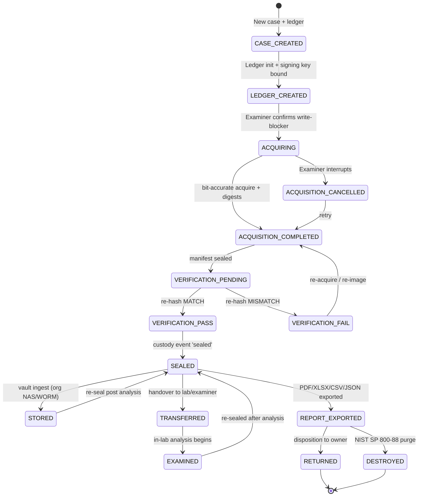
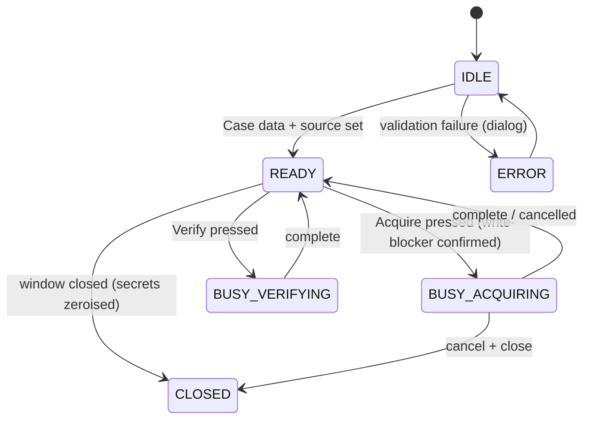

# 🗃️ DIHT — State Machine & Lifecycle Model (state.md)

> **Disk Image Acquisition & Hashing Toolkit — Portable Build v1.0.0**
> Defines every state the tool and its evidence pass through, the legal
> meaning of each state, allowed transitions, and how state is *persisted
> (preserved)* so it is audit-ready.

---

## 1. 🧠 Two Kinds of State

| Kind | Scope | Persisted by |
|---|---|---|
| **App session state** | GUI runtime, current case, busy/lock flags | in-memory only (see `memory.md`) |
| **Evidence lifecycle state** | Case/exhibit travelling through the forensic process | **signed ledger** `chain_of_custody.json` |

Only the *evidence lifecycle* is preserved to disk; app session state is
ephemeral by design (a portable tool leaves no residue).

---

## 2. ⚖️ Evidence Lifecycle State Machine



---

## 3. 📖 State Definitions (Cyber-Law Meaning)

| State | Meaning | Evidence of being in state |
|---|---|---|
| `CASE_CREATED` | Legal case opened; folder allocated | Signed `case_created` record |
| `LEDGER_CREATED` | Ledger bound to operator key + machine | `ledger_created` record, metadata incl. key fingerprint |
| `ACQUISITION_COMPLETED` | Source read-only imaged; digests sealed at time of acquisition | `acquisition_completed` record with **hashes captured during read** |
| `VERIFICATION_PASS/FAIL` | Independent re-hash of the *image*, not the source | `verification_pass/fail` records |
| `SEALED` | Exhibit cryptographically sealed for transport/store | `sealed` custody record (2-person rule) |
| `TRANSFERRED` | Custody officially handed to another party | `transferred` record (dual sign) |
| `EXAMINED` | Exhibit opened for analysis | `unsealed` → `examined` records |
| `REPORT_EXPORTED` | Court-style reports delivered | `report_exported` record + PDF signature block |
| `RETURNED` / `DESTROYED` | Termination states (authorised only) | `returned` / `destroyed` records |

---

## 4. 🔑 Persistence & Preservation Format

Every transition is **one signed, hash-chained record** appended to
`chain_of_custody.json`:

```json
{
  "v": 1,
  "event_id": "uuid4",
  "ts": "2026-09-20T12:34:56.789Z",
  "machine_id": "<sha256:12>",
  "actor": "Examiner",
  "actor_role": "Forensic Examiner",
  "org": "Cyber Forensics Unit",
  "action": "sealed",
  "description": "Seal exhibit for transport",
  "exhibit": "evidence_LE-2026-0142_PhysicalDrive2.dd",
  "detail": {},
  "prev_hash": "<sha256 of previous record>",
  "record_hash": "<sha256 of this body>",
  "hmac": "<hmac-sha256 with derived key>",
  "sig": null,
  "tsa": null
}
```

### 4.1 Preservation invariants (`custody.py`)

1. `prev_hash` of record *n* always equals `record_hash` of record *n−1*
   (genesis = `"GENESIS"`).
2. `record_hash` = SHA-256 over the key-sorted canonical JSON of the body
   (includes `prev_hash`), giving a **self-referential hash chain**.
3. `hmac` = HMAC-SHA256 of the same canonical body — binds every record to the
   operator's derived key and machine.
4. Fields `sig` / `tsa` are **preserved channels** for X.509/eIDAS signatures
   and RFC 3161 tokens in the certified build — placing a legally trusted
   stamp into each record without breaking the chain.

---

## 5. 🖥️ App Session States (Runtime)



UI enforces:

- **Locks**: while a job is running, Acquire/Verify buttons disable; only
  Cancel (for hard jobs) / window close remain.
- **Gates**: acquire is blocked until `write_blocker_confirmed == true`
  (`ui.py:wb_var`); exports/audits are blocked until a case is open.
- **Validation**: passphrase match and ≥ 6 characters before create.

---

## 6. 🧪 Provenance of States via Self-Test

`--self-test` drives the deterministic path and proves each transition is
legal and detectable:

```
CASE_CREATED → LEDGER_CREATED → ACQUISITION_COMPLETED
→ VERIFICATION_PASS   (clean image)
→ VERIFICATION_FAIL   (tampered image → state proves tamper)
→ SEALED(ledger) → REPORT_EXPORTED
→ ledger audit: INTACT (every hmac/record_hash verified)
```

---

## 7. 🗂️ Case Folder = Persisted State Pack

```
<case_dir>/
  chain_of_custody.json     ← THE authoritative persisted state
  evidence_manifest.json    ← snapshot of evidence metadata + hashes
  SHA256SUMS                ← POSIX verification set
  hash_manifest.csv / .xlsx ← tabular views
  forensic_report.pdf       ← rendered state summary (court view)
  chain_of_custody_report.pdf
  evidence_<case>_<src>.dd  ← the acquired image
```

Moving this folder and re-opening with the correct passphrase resumes the
state machine exactly where it stopped (see `workflow.open_case`).

---

## 8. ❌ What State Is NOT Preserved

- ❌ Session variables / UI text (deliberate zero-residue design).
- ❌ The passphrase (never stored; re-derived only during the session).
- ❌ Host filesystem writes outside the case folder.
- ❌ Anything that could alter or shadow the source device.