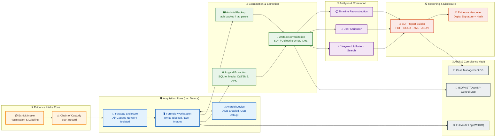
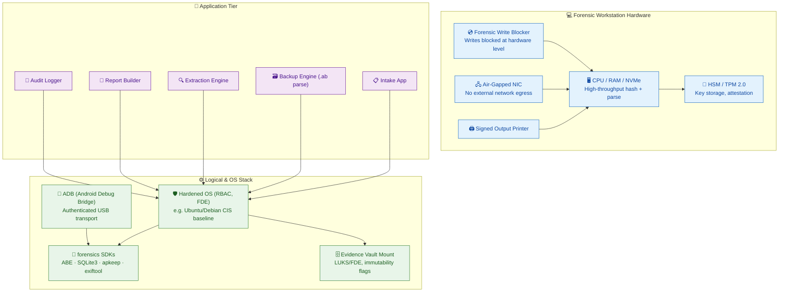
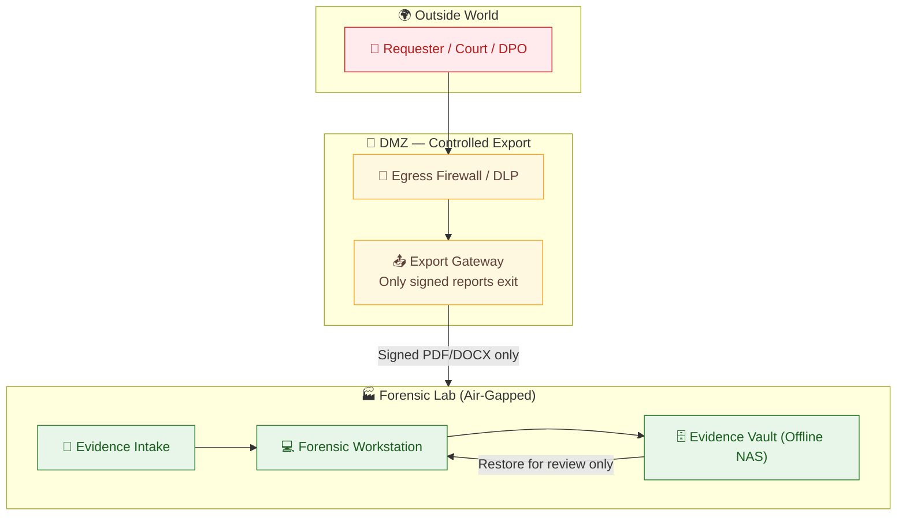
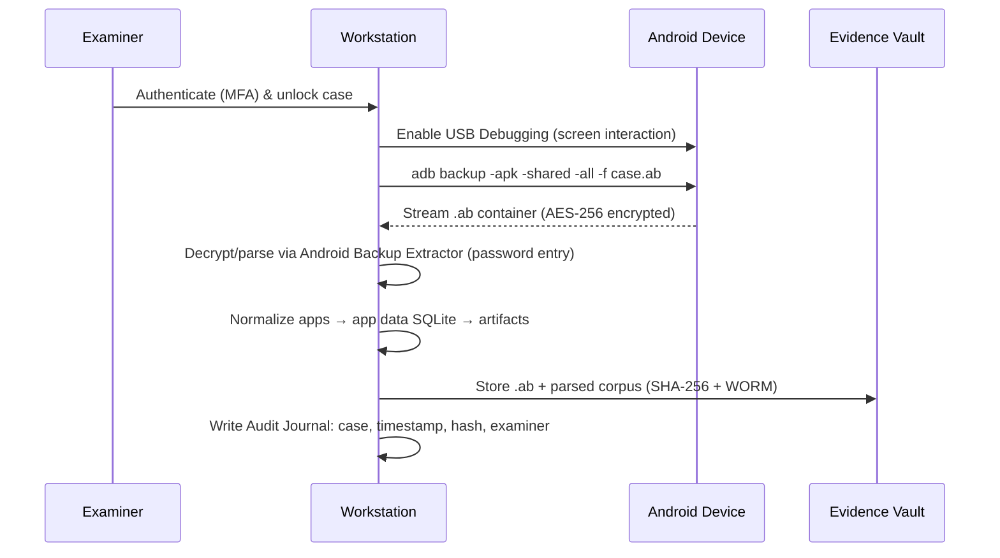
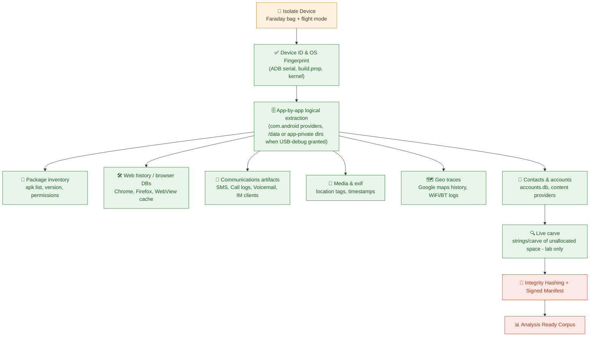
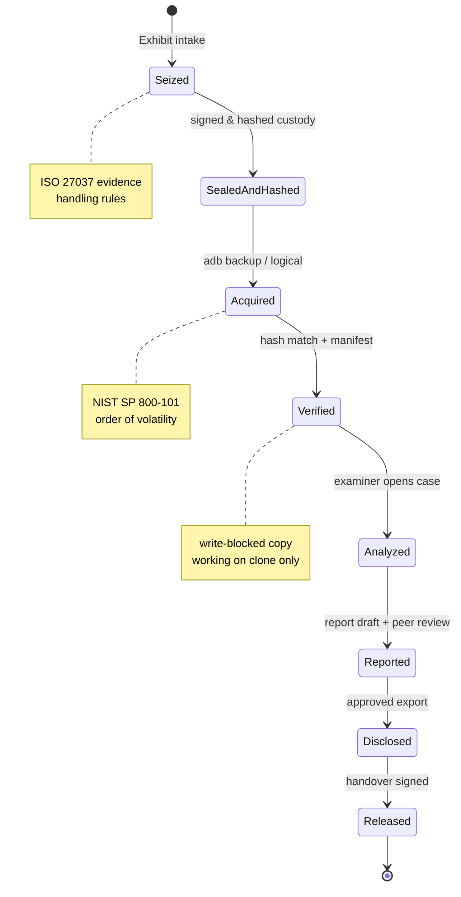
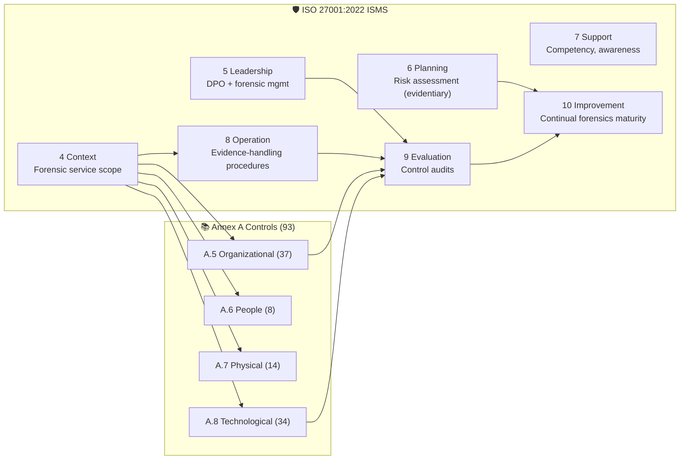
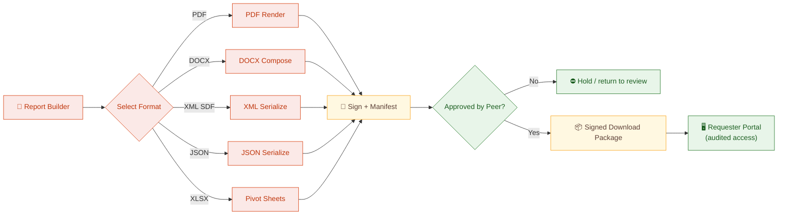
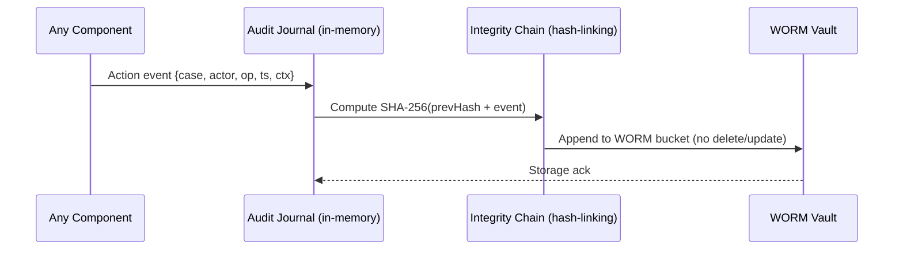

# 📱 Mobile Device Forensics Workflow — Solution Architecture

> Android Backup · Logical Extraction · Forensic Lab Device · Evidence Management

   

---

## 1. Executive Overview

This architecture defines a **complete, lab-controlled mobile device forensics pipeline** for Android devices. It covers every phase from **secure intake → evidence preservation → Android backup → logical extraction → artifact analysis → court-ready reporting**, while embedding **ISO 27001** (ISMS), **NIST SP 800-101 / 800-124** (mobile forensics), **SWGDE / ACPO** (digital evidence integrity) and **OWASP Top 10** (application security) controls into every layer.

🎯 **Business Goals**

| Goal | How the Architecture Delivers |
|------|------------------------------|
| **Evidentiary Integrity** | SHA-256 chain-of-custody hashing at every step, write-blocked acquisition |
| **Defensible Process** | Full audit trail, timestamped actions, dual-review sign-off |
| **Operational Secrecy** | Air-gapped lab segment, keyed evidence storage, RBAC isolation |
| **Compliance** | Continuous control mapping to ISO 27001, NIST, OWASP |
| **Report Readability** | SDF-style evidence reports exportable as PDF / DOCX / XML / JSON |

---

## 2. 🗺️ System Architecture (Color Map)



---

## 3. 🧬 Architecture Building Blocks

### 3.1 Forensic Lab Device (Workstation)



### 3.2 Network Topology — Air-Gapped Lab Segment



---

## 4. 🔄 Core Forensic Workflows

### 4.1 Android Backup Workflow (`adb backup` / `.ab` parse)



**⚙️ Android Backup Engine — Key Stages**

| # | Stage | Tooling | Output |
|---|-------|---------|--------|
| 1 | Enable debug bridge | `adb devices` / USB auth | Token bound to device |
| 2 | Full backup capture | `adb backup` | `case_<id>.ab` |
| 3 | Container decrypt | Android Backup Extractor (ABE) | `apps.tar` + manifest |
| 4 | SQLite extraction | `sqlite3`, Python API | `*.db` dumps |
| 5 | Media / shared | `adb pull /sdcard/*` | Images, docs, chat media |
| 6 | Normalization | SDF / JSON schema | `artifacts/` unified corpus |

> ⚠️ **Backup limits** — On modern Android 12+, unrestricted `adb backup` is deprecated; production path must fall back to **logical extraction + OEM backup APIs** (see §4.2). The workflow below documents that fallback.

### 4.2 Logical Extraction Workflow



### 4.3 Evidence Lifecycle & Chain of Custody



---

## 5. 📊 Compliance & Governance Framework

### 5.1 Control Mapping Matrix

| # | Domain | Control / Requirement | ISO 27001:2022 | NIST SP 800-101/124 | OWASP Top 10 | Where Implemented |
|---|--------|----------------------|----------------|---------------------|--------------|-------------------|
| 1 | Access Control | Least privilege, MFA, RBAC | A.5.15–A.5.18 | §800-124 Sec 4.3 | A01 (broken access) | §3.1, ZONE0–5 |
| 2 | Evidence Integrity | Acquisition hashing, WORM store | A.8.12 | §800-101 Sec 6.3 | — | §4.1/4.2, Vault |
| 3 | Event Logging | Immutable audit trail, no tamper | A.8.15 | §800-101 Sec 8.3 | A09 (logging fail) | ZONE5, §7 |
| 4 | Data Protection | Encryption at rest/in transit, keys HSM | A.8.24–A.8.25 | §800-124 Sec 4.4 | — | HSM/TPM, LUKS |
| 5 | Secure Comms | USB bound auth, no plaintext | A.8.26 | §800-101 Sec 4.5 | A02/A08 (crypto) | ADB auth, TLS |
| 6 | Vulnerability Mgmt | Patching, SBOM, scanning | A.8.8–A.8.10 | §800-124 Sec 5 | A06 (vuln. comps) | §3.1 SW layer |
| 7 | Input Validation | All artifact/file paths validated | — | — | A03 (injection) | §4 parser gate |
| 8 | Secure Config | Hardened OS, default-deny | A.8.9 | §800-124 Sec 4.6 | A05 (misconfig) | CIS baseline |
| 9 | Crypto Weaknesses | Strong ciphers enforced (AES-256+) | A.8.24 | — | A02 | ABE/HSM |
| 10 | Supply Chain | Tooling vetting, signed artifacts | A.5.19–A.5.22 | — | A06 | SW registry |
| 11 | Incident Response | Breach playbook, containment | A.5.24–A.5.28 | §800-124 Sec 5.3 | — | IR runbook |
| 12 | Physical Security | Access-controlled lab & custody | A.7.1–A.7.14 | §800-101 Sec 4.2 | — | Zone model |
| 13 | Business Continuity | Backup/restore & DR drills | A.5.30–A.5.31 | — | — | Vault replication |
| 14 | Regulatory Handover | Discovery-ready export | A.5.34 | §800-101 Sec 9 | — | §6 Report engine |

---

### 5.2 ISO 27001:2022 Clause & Annex A Adoption



### 5.3 NIST Alignment — Mobile Forensics References

- **NIST SP 800-101 Rev. 1** — *Guidelines on Mobile Device Forensics* — governs acquisition (Step 1–3), preservation, examination, analysis, reporting, and order of volatility. Implemented in §4.1–§4.2.
- **NIST SP 800-124 Rev. 2** — *Mobile Device Security: Enterprise Use* — enforces device enrollment, encryption, remote wipe & breach containment mirrored in ZONE1–ZONE2.
- **NIST SP 800-86** — *Integrating Forensic Techniques into Incident Response* — informs the artifact-to-incident correlation in ZONE3.
- **SWGDE** — *Best Practice Manual for Mobile Phone Examinations* — codifies examiner independence + peer review (§6.2).
- **ISO 27037** — *Identification, collection, acquisition and preservation of digital evidence* — applied to intake and handling (ZONE0).
- **ISO 17025** — *Testing & calibration lab competence* — lab device qualification, method validation (Lab Device §3.1).

### 5.4 OWASP Top 10 (2021) — Security of the Lab Tooling & Evidence Portal

| Rank | OWASP Category | Mitigation in Architecture |
|------|----------------|----------------------------|
| A01 | Broken Access Control | RBAC + MFA + object-level ACL on case records (§3.1, ZONE5) |
| A02 | Cryptographic Failures | AES-256/GCM vault, ECDSA report signing, HSM keys (§3.1, §6.1) |
| A03 | Injection (SQLi/XSS) | Parameterized queries, artifact viewer encoding, no raw SQL in UI |
| A04 | Insecure Design | Threat modeling at intake; immutable evidence store (WORM) |
| A05 | Security Misconfiguration | CIS-hardened host, deny-by-default firewall, minimal services |
| A06 | Vulnerable Components | SBOM per lab image, CVE scanning, enforced patch SLA |
| A07 | Auth Failures | WebAuthn/TPM-bound examiner auth, session revocation on case close |
| A08 | Software/Data Integrity | Signed builds, signed reports, hash manifest on every export |
| A09 | Logging & Monitoring | Tamper-evident journal shipped to WORM audit vault (§7) |
| A10 | SSRF | Export gateway validates signed destinations only (DMZ) |

---

## 6. 📤 Reporting Subsystem

### 6.1 Downloadable Report Options

| Format | Use Case | Integrity | Download Path |
|--------|----------|-----------|---------------|
| **PDF (SDF-v1)** | Court-ready testimony | ECDSA signature + embedded SHA-256 manifest | `GET /reports/{case}/export.pdf` |
| **DOCX** | Editing redactions / counsel drafts | Versioned + watermark | `GET /reports/{case}/export.docx` |
| **XML (SDF)** | Machine intake into evidence mgmt | XML signature (XAdES) | `GET /reports/{case}/export.xml` |
| **JSON** | Analyst / tooling pipeline ingest | JWS-signed | `GET /reports/{case}/export.json` |
| **CSV / XLSX** | Timeline & keyword pivot tables | Row-level hash sheet | `GET /reports/{case}/tables.xlsx` |
| **HTML (interactive)** | Stakeholder drill-down | Static, no JS, offline-safe | `GET /reports/{case}/view.html` |

```
GET /reports/{caseId}/export.{pdf|docx|xml|json|csv|xlsx}
Authorization: Bearer <examiner JWT>
Response headers:
  Content-Disposition: attachment; filename="CSE-2026-0041_RPT.pdf"
  X-Content-Options-Tag: signed, sha256=<manifest-hash>
```



### 6.2 Report Content & Quality Gates

| Gate | Owner | Criterion |
|------|-------|-----------|
| G1 — Completeness | Examiner | All artifacts categories present or explicitly N/A |
| G2 — Integrity | QA reviewer | Manifest hash matches vault copy |
| G3 — Independence | Peer reviewer | Findings reproducible from vault clone |
| G4 — Approval | Case manager (lead) | Signed release, G1–G3 green |

- **Examiner independence** (SWGDE): examiner who acquires ≠ solely decides conclusion; dual reviewer embedded in workflow.
- **Reproducibility**: every report cites artifact UUIDs mapped 1:1 to vault objects, so any auditor can re-run analysis.

---

## 7. 🔐 Audit & Compliance Subsystem

### 7.1 Immutable Audit Trail (WORM)



- **Tamper-evidence**: every journal entry is hash-linked to the prior entry (blockchain-style append-only). Altering any record invalidates the entire chain.
- **Retention**: 7 years mandatory (GDPR/ISO 27037 evidence schedule) then cryptographically shredded with signed disposal log.
- **Events captured**: intake, acquisition, hash verification, parse run, analysis queries, report export, access to case files, key ceremonies, failures/timeouts.

### 7.2 Audit Options Matrix

| Option | Scope | Output | Frequency |
|--------|-------|--------|-----------|
| **A1 — Control Self-Assessment** | ISO 27001 Annex A map vs live setting | Scorecard per control | Quarterly |
| **A2 — Evidence Integrity Audit** | Random custody-copy re-hash vs vault | Exception report | Per case close |
| **A3 — Examiner Practice Audit** | Percentage of cases peer-reviewed, deviation log | Examiner scorecard | Quarterly |
| **A4 — Vulnerability Audit** | SBOM/CVE scan of lab images + tooling | PoC/Patch report | Weekly |
| **A5 — Access Reviews** | RBAC entitlements vs role model | Least-privilege delta | Monthly |
| **A6 — Penetration Test** | External/OWASP-scoped testing of portal/DMZ | Pentest report + retest | Yearly (or per major change) |
| **A7 — Disaster Recovery** | Restore drill of Vault from backup | RTO/RPO attestation | Semi-annual |
| **A8 — Incident Forensics** | IR playbook post-mortem (NIST SP 800-61) | Lessons-learned log | On demand |

---

## 8. 🛡️ Security Controls and Data Protection

### 8.1 Crypto & Key Management

| Asset | Cipher / Scheme | Key Mgmt |
|-------|-----------------|----------|
| `.ab` backup container | AES-256-CBC (device-held) → re-wrapped | HSM-held KEK |
| Evidence vault at rest | AES-256-XTS (LUKS / BitLocker) | HSM + TPM |
| Vault replication | TLS 1.3 + HKDF session keys | Ephemeral |
| Report signatures | ECDSA P-384 | HSM sign-only key |
| Audit journal | SHA-256 hash chains | —
| App tokens / APIs | OAuth2 + JWT (RS256) | Keycloak / short TTL |

### 8.2 Zero-Trust Zones

| Zone | Trust Level | Egress | Ingress |
|------|-------------|--------|---------|
| ZONE0 Intake | Physical, supervised | — | Registered exhibits |
| ZONE1 Acquisition | Air-gapped | — | ADB-bound device |
| ZONE2 Examination | Air-gapped | — | ZONE1 internal |
| ZONE3 Analysis | Isolated VLAN | Internal only | ZONE2 |
| ZONE4 Reporting | DMZ | Signed exports | Requester auth |
| ZONE5 Audit | WORM | Read-only | ZONE0–4 journals |

---

## 9. ⚠️ Failure Modes & Safeguards

| FMEA Item | Risk | Mitigation |
|-----------|------|------------|
| Failed ADB auth | Device rejects connection | USB debugging token bound pre-seizure; OEM unlock readiness check |
| `.ab` unsupported on Android 12+ | Empty/non-provisioned backup | Fallback to logical extraction §4.2 |
| Password-protected `.ab` | Cannot decrypt | Brute-force only on clone with counsel approval; documented risk record |
| Malware in extracted content | Analysis-time infection | Content executed only in disposable VM; signature scan pre-open |
| Vault corruption | Chain-of-custody breach | Redundant WORM copies + integrity sweep A2 |
| Exam room supply-chain tamper | Fake tooling | SBOM pinning + signed container images (A06) |

---

## 10. 📁 Directory & Repo Layout

```text
mobile-forensics-lab/
├── architecture.md               # this document
├── docs/
│   ├── sops/                     # standard operating procedures
│   ├── controls/                 # ISO/NIST/OWASP control mapping sheets
│   └── templates/                # SPDF templates (PDF/DOCX/XML)
├── acquire/                      # adb/ABE/UFED-driver scripts
│   ├── android_backup.sh
│   └── logical_only.sh
├── extract/                      # parsers (sqlite, apk, media, geo)
├── analyze/                      # timeline, correlation, search engine
├── report/                       # builder + signer + exporters
├── audit/                        # journal chain + self-assessment jobs
├── vault/                        # evidence mount points (LUKS)
└── vault_fs.md                   # evidence store schema
```

---

## 11. ✅ Architecture Decision Records (Summary)

| ADR | Decision | Rationale |
|-----|----------|-----------|
| ADR-01 | Air-gapped lab, no evidence on enterprise net | Custody integrity & ISO 27037 isolation |
| ADR-02 | Android backup first, logical extraction fallback | Backwards reachable devices; documented limits |
| ADR-03 | WORM + hash-linked audit journal | Tamper-evident proof for court |
| ADR-04 | SDF/XML as canonical evidence format | Industry interchange + machine readability |
| ADR-05 | Portal/DMZ only for signed reports | DLP boundary, OWASP A04/A10 |
| ADR-06 | HSM-sign-only keys for all outputs | Non-repudiation of examiner actions |

---

## 12. 🚀 Roadmap

| Phase | Scope | Indicative Term |
|-------|-------|-----------------|
| P0 | Lab build-out: workstation, vault, zones | Month 0–1 |
| P1 | Android backup + logical extraction engines | Month 1–3 |
| P2 | Analysis, timeline, report builder + signer | Month 3–5 |
| P3 | Audit subsystem + control self-assessment | Month 5–6 |
| P4 | ISO 27001 certification / OWASP pentest / NIST validation | Month 6–9 |
| P5 | Continuous improvement & DR drills | Ongoing |

---

## 13. 📚 References & Standards

- ISO/IEC 27001:2022, ISO/IEC 27002:2022, ISO/IEC 27037:2012, ISO/IEC 17025:2017
- NIST SP 800-101 Rev. 1, NIST SP 800-124 Rev. 2, NIST SP 800-86, NIST SP 800-61 Rev. 3
- SWGDE Best Practice Manual for Mobile Phone Examinations
- ACPO Good Practice Guide for Digital Evidence (v5)
- OWASP Top 10:2021
- Definite Android Forensics / Android Backup Extractor (ABE) tooling notes

---

*Maintained by the Digital Forensics & Compliance Engineering Team · Review cycle 90 days · Baseline v1.0*