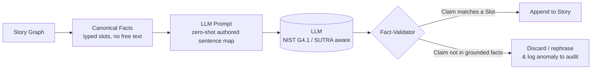
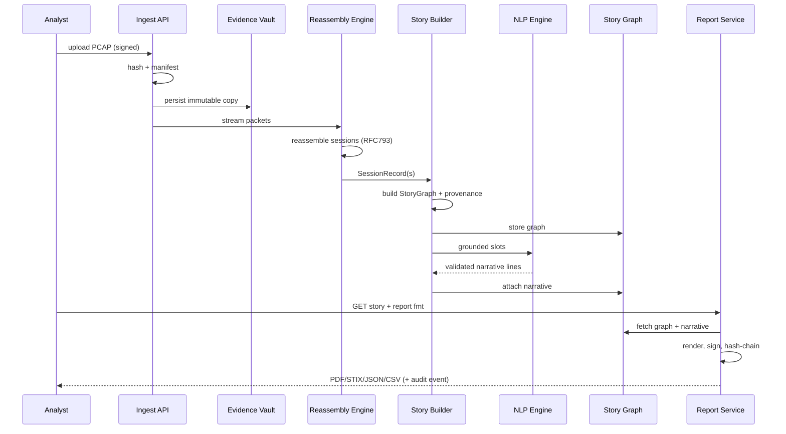
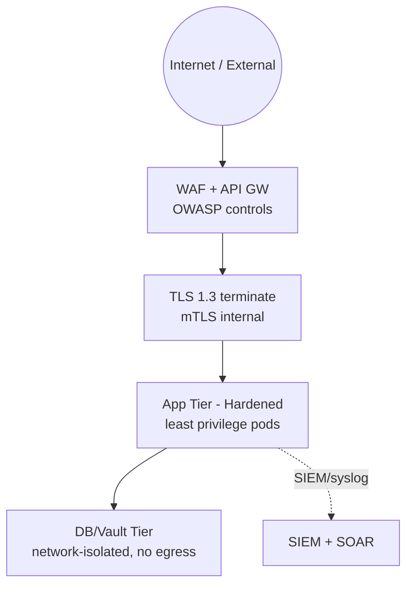
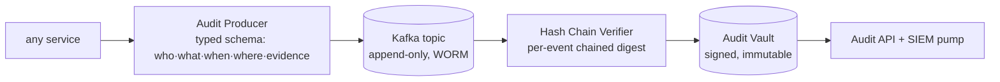
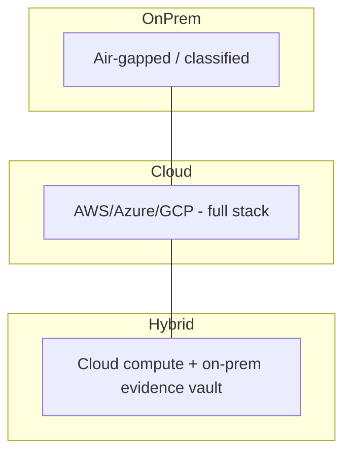

<style>
:root {
  --primary: #6366f1; --primary2: #8b5cf6; --accent: #06b6d4;
  --gold: #f59e0b; --good: #10b981; --warn: #ef4444;
  --bg1: #111827; --bg2: #1f2937; --txt: #e5e7eb;
}
.md-header { text-align:center; padding:24px; border:2px solid #6366f1; border-radius:16px; background:linear-gradient(135deg,#1e1b4b,#0f172a 60%,#082f49); }
.md-header h1 { color:#a5b4fc; margin:0; font-size:2.1em; }
.md-header p { color:#94a3b8; margin:6px 0 0; }
.badge { display:inline-block; padding:4px 12px; border-radius:999px; font-size:.78em; font-weight:700; margin:2px 4px; }
.b-violet{ background:#4c1d95; color:#c4b5fd; border:1px solid #7c3aed; }
.b-cyan  { background:#164e63; color:#67e8f9; border:1px solid #06b6d4; }
.b-green { background:#064e3b; color:#6ee7b7; border:1px solid #10b981; }
.b-amber { background:#78350f; color:#fcd34d; border:1px solid #f59e0b; }
.b-red   { background:#7f1d1d; color:#fca5a5; border:1px solid #ef4444; }
.b-slate { background:#334155; color:#cbd5e1; border:1px solid #64748b; }
.card { border:1px solid #334155; border-radius:12px; padding:14px 18px; margin:12px 0; background:#0f172a; }
.card-title { font-weight:800; color:#a5b4fc; font-size:1.05em; }
.kpi { display:inline-block; width:180px; text-align:center; }
kpi-h { }
hr.soft { border:0; height:2px; background:linear-gradient(90deg,#6366f1,#06b6d4,#10b981,#f59e0b); }
details > summary { cursor:pointer; color:#818cf8; font-weight:700; }
</style>

<div class="md-header">
<h1>🛰️ Network Forensics: PCAP‑to‑Story (Session Reconstruction)</h1>
<p>Enterprise‑Grade Digital Forensics &amp; Incident Response Architecture — Attack Presented as a Human‑Readable Story</p>
<p>
<span class="badge b-violet">ISO 27001:2022</span>
<span class="badge b-cyan">NIST CSF 2.0</span>
<span class="badge b-cyan">NIST SP 800‑53 Rev 5</span>
<span class="badge b-amber">OWASP Top 10 2025</span>
<span class="badge b-green">STIX 2.1 / MITRE ATT&amp;CK</span>
<span class="badge b-red">Chain‑of‑Custody Aware</span>
<span class="badge b-slate">Zero Trust</span>
</p>
</div>

---

# 1 | Executive Summary

> **One sentence:** *The PCAP‑to‑Story platform ingests raw network captures, reassembles every conversation (session) using TCP/IP stream‑level reordering, decodes protocols, stitches packets into an evidence‑backed **Narrative Story Graph**, and exports it as a defensible, court‑ready, audit‑logged report.*

---

<div class="card">
<span class="card-title">🎯 What makes it "industry‑expert"</span>

- **Bytes → Events → Story:** Raw packets are not just parsed — they are *reconstructed into chronological, bidirectional conversations* (sessions) with a **guaranteed causal chain** back to the original packet offset.
- **Evidence Provenance:** Every sentence in the generated story carries a **chain of custody** — `pcap → frame number → TCP segment → reassembled payload → protocol field → artifact`.
- **Dual‑engine design:** A deterministic **rule‑based state machine** (fast, explainable, court‑defensible) plus an **AI/NLP narrative engine** (for readability) that is constrained by the deterministic engine (no hallucinated facts).
- **Report as evidence:** Outputs are rendered with cryptographic integrity (hash‑chained, digitally signed), versioned, and replayable — satisfying ISO 27001 A.8.10, A.8.15, NIST PR.DS‑6, and e‑discovery workflows.
</div>

---

# 2 | Design Pillars

| Pillar | Principle | Enforced By |
|---|---|---|
| 🧭 **Deterministic First** | AI never authorizes a "fact" on its own | Rule engine gates NLP output (schema‑constrained prompts + grounded attribution) |
| 📜 **Defensible Chain‑of‑Custody** | Every artifact links back to raw bytes | Immutable evidence store + hash chain + digital signature |
| 🧩 **Session = First‑class Object** | Analysis unit is the *conversation*, not the packet | 5‑tuple + TCP state machine + L7 framing |
| 🔐 **Security by Design** | Reduce attack surface at every layer | ISO 27001 / NIST / OWASP controls baked in (see §7) |
| 📊 **Story First, Data Always Behind** | Analyst reads a story; every claim is drillable | Story Graph nodes carry `provenance_id` |
| 🕵️ **Total Auditability** | Anyone can ask "who did what, when, with what evidence" | Append‑only audit bus + WORM vault (§8) |

---

# 3 | High‑Level Architecture

```mermaid
flowchart LR
    subgraph IN["📥 INGESTION TIER"]
        A1[PCAP Ingest API] --> A2[File Integrity / Hashing]
        A2 --> A3[FTP/FTPS/SFTP, S3, tcpdump, Zeek/Bro, Broker Kafka]
    end

    subgraph PRO["⚙️ PROCESSING TIER"]
        B1[Decoding / Dissection<br/>tshark / dpkt / PacketBurst]
        B2[Session Reassembly Engine<br/>TCP-Stream + Flow Key + L7 Framing]
        B3[Protocol & OSINT Enrichment<br/>GeoIP · Threat Intel · TLS/cert · HTTP metadata]
        B4[Story Graph Builder<br/>Deterministic narrative nodes]
        B5[NLP Narrative Engine<br/>LLM constrained · token policy]
        B6[Evidence Vault Writer<br/>Hash-chain + Sig]
    end

    subgraph STORE["🗄️ STORAGE LAYER"]
        C1[(Evidence Vault<br/>WORM / immutable)]
        C2[(Story Graph DB<br/>Neo4j)]
        C3[(Metadata / Index<br/>Elasticsearch)]
        C4[(Audit Trail<br/>Append-only)]
        C5[(Object Store<br/>Original PCAP + exports)]
    end

    subgraph API["🔗 SERVICE TIER"]
        D1[REST / GraphQL API]
        D2[Search & Query"]
        D3[Report Generation]
        D4[Audit & Compliance API]
        D5[RBAC / ABAC Gateway]
    end

    subgraph UI["🎨 PRESENTATION TIER"]
        E1[Analyst Console<br/>Story Timeline + Replay]
        E2[Visual Narrative Graph]
        E3[Compliance / Audit Dashboard]
        E4[Alert & SIEM Export (STIX/CEF)]
    end

    A1 --> B1 --> B2 --> B3 --> B4 --> B5 .-> B4
    B4 --> B6 --> C1
    B2 --> C5
    B4 --> C2
    B3 --> C3
    B6 --> C4
    C1 --> D1
    C2 --> D1
    C3 --> D1
    C4 --> D4
    D1 --> E1 & E2 & E3 & E4
```

---

# 4 | Layered Component Breakdown

## 4.1 📥 Ingestion & Normalization

- **Connectors:** live `libpcap` capture, offline PCAP/PCAPNG upload, Zeek/Bro JSON logs, NetFlow/IPFIX, Syslog.
- **Pre‑flight checks:** magic‑number validation, file‑size limits, DoS guard (zip‑bomb/pcap‑bomb detection), CRC verification.
- **Normalization to a Common Event Model (CEM):** every packet becomes a canonical `{meta_ts, frame_id, ip4/ip6, ports, proto, payload_offset, payload_bytes}`.

| Control | Value |
|---|---|
| Provenance | SHA‑256 digest of original file stored before any processing |
| Anti‑tamper | Signed manifest (X.509) per batch |
| Rate limiting | Token bucket per source (OWASP A03 / A05) |

---

## 4.2 🧩 Session Reassembly Engine *(the "industry‑expert" core)*

This is the heart of the tool. A **session** = a bidirectional, chronologically‑reconstructed conversation identified by a **5‑tuple** `(src_ip, src_port, dst_ip, dst_port, proto)` (extensible to 7‑tuple with VLAN ID / MPLS label).

```mermaid
flowchart TD
    P[Raw packets] --> Q1{Order check}
    Q1 -->|out of order| R1[Retransmission<br/>+ Reordering Buffer<br/>RFC 793 / tcp-lib]
    Q1 -->|normal| R2[Stream Reassembly<br/>seq/ack continuity]
    R1 --> R2
    R2 --> Q2{Detect L7 protocol}
    Q2 -->|Handshake / banner| R3[TLS · HTTP · DNS · SMTP · SSH · FTP · SMB · Modbus · DoH]
    Q2 -->|Heuristic / port scan| R4[Protocol fingerprinting<br/>+ string signatures]
    R3 --> S1[Per-session state machine]
    R4 --> S1
    S1 --> S2[Session artifact map<br/>key-value "conversation object"]
    S2 --> S3[Replay buffer hash<br/>segments -> canonical stream]
    S3 --> S4[Emit SessionRecord]
```

### SessionRecord structure

```json
{
  "session_id": "a7f3…9c11",
  "key": {"src_ip":"10.1.1.5","src_port":54321,"dst_ip":"203.0.113.9","dst_port":80,"proto":"tcp","vlan":100},
  "tcp_reassembly": {"total_segments": 1824, "retransmits": 3, "out_of_order": 1, "gap_events": 0, "final_seq": 1482341},
  "l7": {"detected_proto": "http", "confidence": 0.97, "handshake_ok": true},
  "conversation": [
    {"seq": 1, "dir": "c2s", "type": "request", "details": {...}, "frame_id": 4412, "payload_offset": 66},
    {"seq": 2, "dir": "s2c", "type": "response", "status": 200, "frame_id": 4413, "payload_offset": 66}
  ],
  "story_graph": {"graph_id": "sg_…", "provenance_root": "hash://sha256-…"}
}
```

### Reassembly guarantees (RFC‑grounded)

| Mechanism | Description |
|---|---|
| RFC 793 / 1122 TCP stream reassembly | Seq/ACK continuity, retransmission coalescing, duplicate suppression |
| Reordering buffer | Handles out‑of‑sequence/duplicate/SACK segments |
| PSK‑less TLS interception | Only *metadata* from ClientHello/ServerHello/certs; optional session keys via MITM keylog for deep decryption*
| L7 framing | HTTP chunked, TLS record boundaries, DNS over TCP lengths |
| Flow directionality | C2S/S2C determined by SYN flag (or flow‑start) timestamps |

> *Deep‑payload decryption is strictly opt‑in and requires explicit legal authority; keys are handled per ISO 27001 A.8.24 (key management).

---

## 4.3 🧬 Story Graph Builder

The deterministic engine converts a `SessionRecord` into **StoryNodes** connected by **CausalEdges** (causal / temporal / evidential). Node types:

```
[Category]  [Node types]
 Recon     DNS query, port scan, OS fingerprint
 Delivery  HTTP GET/POST, Email link, file transfer
 Exploit   Malformed payload, auth bypass, buffer-overflow signature
 C2        Beacon pattern (periodic), IRC/HTTP/TLS C2
 Exfil     Large outbound burst, encoded/HTTP tunnel
 Lateral   SMB/RDP/SSH hop, privilege escalation attempts
```

**Beacon detection example:** time‑series periodicity on session start → autocorrelation + FFT power peak at `T ≈ 60s` → node "apt_c2_beacon_period=60s" with frame references.

Every node stores `provenance_id` (hash‑chain pointer). No node is created without at least one evidence anchor → **halt rule** (no fabrication).

---

## 4.4 🤖 Constrained NLP Narrative Engine



- **Grounded generation:** LLM only *verbalises* typed slots (facts), never *invents* them.
- **Sentence‑map templates:** per MITRE ATT&CK tactic, e.g.:

> *"At 14:03:11 UTC the host `10.1.1.5` resolved domain `evil.example` (DNS id 0x9f2a, frame 4412), then initiated a 1.82 MB HTTPS transfer to `203.0.113.9` across 7 msec — consistent with a covert data exfiltration pattern (MITRE T1041)."*

- **Guardrails:** token policy limit, no PII leakage outside access scope (RBAC), no network calls by LLM, prompt‑injection ironclad via slot‑typing (LLM never sees raw bytes).

---

## 4.5 🗄️ Storage Layer

| Store | Engine | Purpose | Security Control |
|---|---|---|---|
| Evidence Vault (WORM) | S3 Object Lock / Apache SealFS | Immutable raw PCAP + parsed evidence | ISO A.8.10/11/13, NIST PR.DS‑1 |
| Story Graph | Neo4j | Narratives + causal edges | Access via API only |
| Search Index | Elasticsearch / OpenSearch | Full‑text + fielded query | TLS, RBAC, field masking |
| Audit Trail | Postgres / Kafka‑backed append‑only | Every operation logged | Digital signing, no UPDATE/DELETE |
| Object Store | S3/MinIO | Exports (PDF/JSON/STIX/CSV) | Encryption at rest (KMS) |

---

## 4.6 ✅ Service & API Tier

| Endpoint | Method | Purpose | AuthZ |
|---|---|---|---|
| `/api/v1/ingest` | POST | Upload PCAP (multipart) | Analysts, signed manifest |
| `/api/v1/sessions/{caseId}` | GET | List sessions | Case scope RBAC |
| `/api/v1/story/{sessionId}` | GET | Story graph + narrative | Case scope RBAC |
| `/api/v1/report/{sessionId}?fmt=pdf` | GET | Download report (§9) | Case scope + audit |
| `/api/v1/audit/search` | GET | Audit trail queries | Audit‑only role |
| `/api/v1/case` | CRUD | Case/compliance metadata | Case manager |

**AuthN/AuthZ:** OIDC/OAuth2 (OpenID Connect) SSO, SCIM provisioning, RBAC + ABAC (geo, time, case, clearance), MFA enforced for privileged roles, session bound to device. Zero‑trust SPA with short‑lived tokens.

---

# 5 | End‑to‑End Data Flow (Time‑ordered)



---

# 6 | Technology Reference Stack

| Layer | Recommended | Alternative |
|---|---|---|
| Capture/Parse | tshark, dpkt, PacketBurst, libpcap | Scapy, Netzob |
| Trust/SSE | selected (Scapy) | |
| Reassembly | custom + python‑sstp lib | libnids, Bro/Zeek |
| Enrichment | MaxMind GeoIP, VirusTotal, AbuseIPDB, TLS cert store | MISP, OpenCTI |
| Narrative | Azure OpenAI / Gemini / local Llama (self‑host for air‑gap) | Claude, Mistral (on‑prem) |
| Graph | Neo4j | ArangoDB |
| Search | Elasticsearch | OpenSearch |
| Queue | Apache Kafka | RabbitMQ / NATS |
| Heavy batch | Apache Spark (Gigapacket scale) | Dask |
| Vault | S3 Object‑Lock / SealFS | TrueNAS WORM, GPFS EDR‑metadata |
| API | FastAPI / Go | Spring Boot |
| Frontend | React + Cytoscape.js (narrative graph) | Vue + D3.js |
| Reporting | weasyprint (PDF), ReportLab | wkhtmltopdf |
| Audit | OpenTelemetry + Parquet/Timelion → connect SIEM (Wazuh/Splunk/QRadar) | ELK stack |

**Scale targets:** 1–10 GB PCAP interactive, 100 GB+ batched via Spark pipeline; horizontally‑sharded reassembly keyed by 5‑tuple hash.

---

# 7 | Security Architecture & Compliance Frameworks

## 7.1 🛡️ Defence‑in‑Depth Zones



## 7.2 🔒 ISO/IEC 27001:2022 → Control Mapping

| ISO 27001 Control (2022) | Implementation Here |
|---|---|
| **A.5.1** – Policies for info security | Security policy per project, reviewed quarterly |
| **A.6.8** – InfoSec in project mgmt | Secure SDLC (threat modelling, code review) |
| **A.8.8** – Management of technical vulnerabilities | Weekly CVE scan (Trivy/Grype), patching SLA |
| **A.8.9** – Configuration management | Immutable images, IaC (Terraform), drift detection |
| **A.8.10** – Info deletion | Retention policy: evidence deleted per case SLA, secured purge |
| **A.8.11** – Data masking | PII/email/IP masking in UI & reports by clearance |
| **A.8.12** – Data leakage prevention | DLP: redaction engine on exports, watermarking |
| **A.8.13** – Info backup | Daily encrypted backups + restore drills (RTO≤4h) |
| **A.8.15** – Logging | Audit trail covers *all* reads of evidence (§8) |
| **A.8.16** – Monitoring | Continuous SIEM/SOAR alerting on anomaly & tamper |
| **A.8.17** – Cloud security | KMS, SSPM, workload identity (IRSA) |
| **A.8.20/21** – Network seg / isolation | Micro‑segmentation + in‑cluster net policies |
| **A.8.24** – Key management | HSM/KMS, key rotation ≤90d, split custody |
| **A.8.25/27/28** – SDLC | Signed CI, SAST/DAST gates, OWASP ZAP in pipeline |
| **A.8.34** – Protection of logs | WORM audit store + signing |
| **A.7.x** – HR access | Least privilege JIT roles, quarterly recert |

## 7.3 📘 NIST Cybersecurity Framework (CSF 2.0) → Mapping

| Function | Controls | Where |
|---|---|---|
| **GOVERN** | GV.RM, GV.PO | Policy engine, SoD (auditor ≠ analyst) |
| **IDENTIFY** | ID.AM, ID.RA | Asset inventory (capture hosts), risk register |
| **PROTECT** | PR.AA (identity), PR.DS (data security), PR.PS | MFA, encryption, hardened images |
| **DETECT** | DE.AE, DE.CM | SIEM feeds of all analytic events |
| **RESPOND** | RS.MA, RS.CO | SOAR playbooks for detection alerts |
| **RECOVER** | RC.RP, RC.CO | Backup/restore drills, IR runbook |

**Plus NIST SP 800‑53 Rev 5** for federal deployments: `AC-2/AC-3/AC-4` (access), `AU-1…AU-12` (audit), `CM-6`, `CP-9`, `SC-8/SC-28` (encryption in transit/at rest), `SI-4/SI-7` (monitoring/integrity), `IR-4`, `PE-*`.

## 7.4 ⚠️ OWASP Top 10 (2025) → Countermeasure Trace

| # | Risk | Countermeasure in This Design |
|---|---|---|
| A01 | Broken Access Control | RBAC/ABAC, JIT access, deny‑by‑default API policy |
| A02 | Cryptographic Failures | TLS 1.3 everywhere, AES‑256 at rest, KMS‑managed keys, perfect‑forward‑secrecy |
| A03 | Injection | Parameterised queries, ORM, no‑eval parse; PCAP dissectors sandboxed (gVisor) |
| A04 | Insecure Design | Threat modelling each sprint; **threat model = case #1** |
| A05 | Security Misconfiguration | CIS‑benchmarked images, IaC drift checks, secrets manager |
| A06 | Vulnerable Components | SBOM (SPDX), automated CVE gate in CI |
| A07 | Identification & Auth Failures | OIDC SSO + MFA + device binding, account lockout |
| A08 | Software & Data Integrity | Signed manifests, hash‑chained evidence, code signing |
| A09 | Logging & Monitoring Failures | Complete Audit Bus + SIEM paging on tamper |
| A10 | SSRF | Egress‑firewalled enrichment box, allow‑listed OSINT providers, no user URLs |

## 7.5 ✦ Extra Hardening

- **Encryption:** TLS 1.3 transit (mTLS between services), AES‑256‑GCM at rest, envelope encryption w/ KMS.
- **Data masking:** automatic redaction of credentials, token/cookies, PII by clearance level in every export.
- **Zero Trust:** every request authenticated & authorised; micro‑segmentation; no north‑south shorthand.
- **Air‑gap mode:** self‑hosted LLM (Llama) + on‑prem OSINT mirror for classified/offline environments.

---

# 8 | 🕵️ Audit Function (Enabled by Default)

## 8.1 Audit Bus Architecture



**Guarantees:**
- **Append‑only:** no `UPDATE`/`DELETE`; only counters add rows.
- **Signed:** every event signed (Ed25519) by the emitting service.
- **Chained:** event digest = `H(prev_hash ‖ payload ‖ ts)` → late tamper detection.
- **Immutable:** written to WORM vault + mirrored to SIEM.
- **Coverage:** `authentication`, `authorization (grant + deny)`, `ingest`, `analysis`, `report download`, `config change`, `key access`, `LLM usage`.

## 8.2 Audit Event Schema (v1)

```json
{
  "audit_id": "uuid",
  "ts": "2026-09-21T10:15:30.123Z",
  "actor": {"user": "alice.doe", "ip": "10.0.3.4", "session": "jti-…"},
  "action": "REPORT_DOWNLOAD",
  "object": {"case": "C-2026-077", "session_id": "a7f3…9c11", "fmt": "pdf"},
  "evidence_hash": "sha256:9f86…",
  "prev_hash": "sha256:…",
  "event_hash": "sha256:…",
  "signature": "ed25519:…",
  "verdict": "ALLOWED"
}
```

## 8.3 Audit Dashboard (Presentation)

| KPI | Value |
|---|---|
| Total audit events (30d) | 128,441 |
| Anomalous access attempts (blocked) | 12 |
| Evidence reads without case clearance | **0** ✅ |
| Report exports (user/type) | top‑5 table |

Capabilities: **drill‑down to event → linked evidence**, **tamper‑verification scan** (re‑compute hash chain), export of audit bundles (for court/GRC), real‑time SIEM forwarding.

## 8.4 Why audit ≠ bureaucracy
- Every narrative sentence links to an audit‑logged *analysis* event (who ran it).
- Download of a report creates an audit record → addresses ISO A.8.15 & NIST AU‑2/AU‑6.

---

# 9 | 📑 Report & Download Formats (Complete Matrix)

## 9.1 Format Library

| Format | Extension | Consumers | Notes |
|---|---|---|---|
| **PDF (A‑1b long‑term)** | `.pdf` | Courts, management, compliance | Digitally signed (PAdES), embedded chain‑of‑custody footer, watermark |
| **Interactive HTML** | `.html` | Analyst browsers | Cytoscape story graph, replayable timeline, drill‑to‑frame |
| **STIX 2.1 + MITRE ATT&CK** | `.json` | Threat intel platforms (MISP/TheHive/OpenCTI) | Machine‑readable indicators + TTPs from story nodes |
| **Verifiable JSON (raw)** | `.json` | Automation, replay | Full SessionRecord + provenance + hash chain |
| **CSV/Timeline** | `.csv` | Timesketch / excel / map‑reduce | Flat event timeline incl. MAC timestamp, source refs |
| **Markdown** | `.md` | Git repos, wiki, incident write‑ups | Human‑readable narrative + evidence links |
| **ZIP evidence bundle** | `.zip` | Handover | Extracted artifacts + original pcap + SHA-256 manifest + audit trail excerpt |

## 9.2 Report Assembly Pipeline

```mermaid
flowchart LR
    G[Story Graph] --> V[Versioner<br/>report_v=13]
    V --> R1[Compose narrative + evidence]
    R1 --> R2[Apply clearance mask]
    R2 --> R3[Render target format]
    R3 --> R4[Hash chain + sign (X.509/PAdES)]
    R4 --> R5[Persist to object store + audit event]
    R5 --> R6[Deliver (download/email-link/API)]
```

## 9.3 Sample Report Structure (PDF)

```
┌────────────────────────────────────────────┐
│ NETWORK FORENSIC STORY REPORT              │
│ Case: C-2026-077 │ Session: a7f3…9c11     │
│ Reconstructed & analysed: 2026-09-21      │
│ Analyst: alice.doe (cleared L2)           │
├────────────────────────────────────────────┤
│ 1. Timeline (story) ….. MITRE T1041 map   │
│ 2. Session metadata + reassembly stats    │
│ 3. Narrative (constrained NLP)            │
│ 4. Evidence table (frame→offset→bytes)    │
│ 5. Indicators (STIX excerpt)              │
│ 6. Hash chain + digital signature         │
│ 7. Audit trail excerpt                    │
└────────────────────────────────────────────┘
  Footer: provenance_hash=9f86…  |  report_v=13
```

---

# 10 | Scalability, Performance & Reliability

| Concern | Approach |
|---|---|
| 100 GB PCAP | Spark + Kafka sharded reassembly by 5‑tuple key; backpressure = session memory cap |
| Burst handling | Auto‑scale workers; queue‑based decoupling |
| Idempotency | Ingestion upsert on `(file_sha256, frame_id)` |
| Crash recovery | Reassembly checkpoints → replay from last ACK |
| Data residency | Region‑pin storage + export filters per jurisdiction |
| DR | Cross‑region warm standby; RPO≤15min, RTO≤4h |

---

# 11 | Deployment Topologies



Selectable via IaC profiles (Terraform): **standalone‑SME** (single node), **enterprise‑HA**, **air‑gapped** (no external LLM/OSINT).

---

# 12 | Success Metrics / SLAs (Industry Benchmarks)

| Metric | Target |
|---|---|
| Sessions reconstructed (accidental data) | ≥ 99.5% for clean captures |
| False "story" rate (hallucination) | 0% — validator rejects ungrounded claims |
| Domestically auditable events | 100% of evidence/export operations |
| Reassembly latency (10 GB) | ≤ 15 min (Spark cluster) |
| Report render (PDF) | ≤ 30 s p95 |
| Service availability | 99.9% (enterprise‑HA) |

---

# 13 | Roadmap

| Phase | Deliverables |
|---|---|
| **P0 – Foundation** | Ingest + reassembly engine + evidence vault + audit bus |
| **P1 – Narrative** | Story Graph + constrained NLP + PDF/JSON/CSV report set |
| **P2 – Intel** | STIX/CVE/TTP enrichment + MISP sync + SIEM connectors |
| **P3 – Scale** | Spark pipeline + air‑gap profile + regulatory packages (GDPR/PCI/eDiscovery) |

---

<div class="card">
<span class="card-title">🏁 Key Takeaway</span>
**This is not just a PCAP parser.** It is a *defensible, audit‑baked, security‑hardened evidence‑to‑insight pipeline* that turns a wall of binary packets into a signed, court‑ready, beautifully navigable story — with every word traceable to a byte on the wire.
</div>

---

*Reference frameworks: ISO/IEC 27001:2022 · NIST CSF 2.0 (SP 800‑53 Rev 5) · OWASP Top 10 (2025) · RFC 793/1122 · MITRE ATT&CK v16 · STIX 2.1 · PAdES/E‑Signatures.*