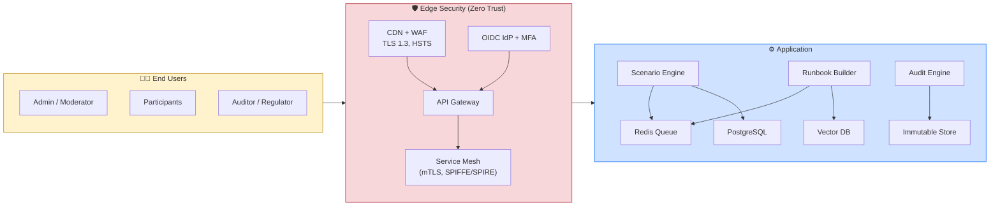
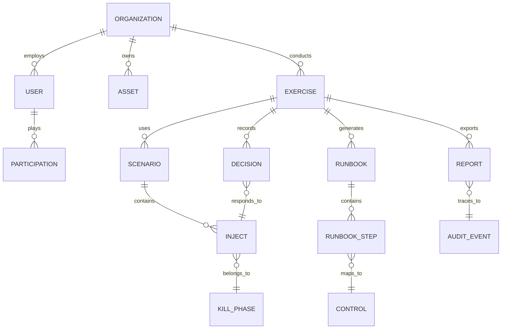
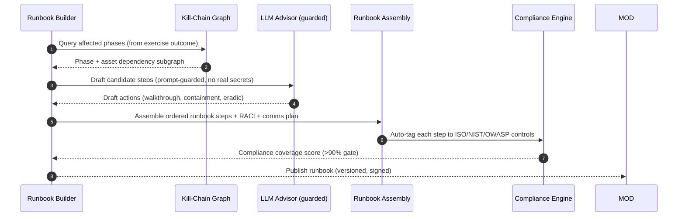
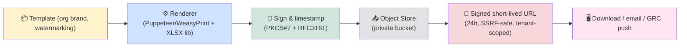
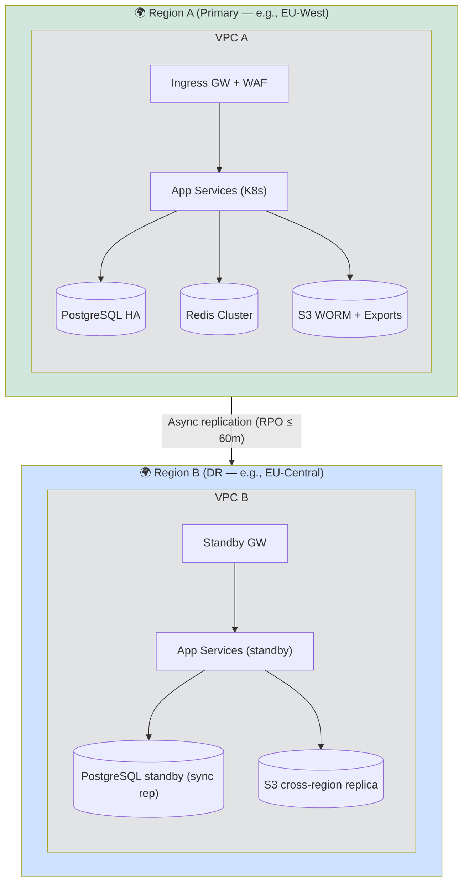
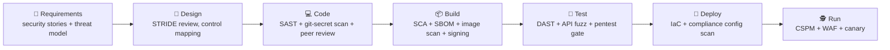

# 🛡️ Ransomware Incident Tabletop Simulator + IR Runbook Builder — Solution Architecture

> **Version:** 2.0.0 · **Status:** Approved · **Classification:** Confidential
> **Compliance Baseline:** ISO/IEC 27001:2022 · NIST CSF 2.0 · NIST SP 800-53 Rev 5 · OWASP Top 10 (2021) · GDPR (as applicable)

---

## 📌 1. Document Control

| Field | Value |
|---|---|
| **Document ID** | ARCH-RITS-001 |
| **Owner** | Chief Information Security Officer (CISO) |
| **Contributors** | Security Engineering, DevSecOps, InfoSec Governance |
| **Review Cycle** | Quarterly or upon material change (new CI/CD pipeline → SDL is re-triggered) |
| **Baseline Frameworks** | ISO/IEC 27001:2022 Annex A, NIST CSF 2.0, NIST SP 800-53r5, OWASP Top 10 |

---

## 🎯 2. Executive Summary

The **Ransomware Incident Tabletop Simulator (RITS)** platform is a cloud-native, security-first SaaS/web application that enables security teams, C-suite executives, and incident responders to:

1. **🧪 Simulate realistic ransomware attack scenarios** (phishing → privilege escalation → lateral movement → encryption → extortion) in a safe, sandboxed, tabletop environment with branching decision trees.
2. **📖 Dynamically generate Incident Response (IR) Runbooks** tailored to detected malware families, kill-chain phases, regulatory obligations, and organizational assets.
3. **📊 Export comprehensive reports** (PDF/DOCX/JSON) for stakeholders, regulators, and auditors.
4. **🧾 Produce an auditable, framework-mapped audit trail** aligned to ISO 27001, NIST, and OWASP requirements, so every simulation decision maps to a control.

The platform is built with a **zero-trust mindset**, **defense-in-depth**, and **privacy-by-design**, with all artifacts traceable to a compliance taxonomy.

---

## 🏗️ 3. Solution Overview

### 3.1 Core Capabilities

| Capability | Description | Compliance Anchor |
|---|---|---|
| 🔁 **Scenario Engine** | Parameterized, multi-branch ransomware playbooks with realistic injects, misdirection, and time pressure | NIST CSF ID/PR, ISO A.5.28 |
| 🛠️ **Runbook Generator** | Rule-based + ML-assisted runbook creation from scenario outcomes and asset catalog | NIST CSF RS, ISO A.5.24/25 |
| 🎭 **Role-Play Module** | Assign participants (CISO, CIO, Legal, PR, IT, DPO) with session moderation | ISO A.5.10, NIST PR.AT |
| 📋 **Asset & Contact DB** | Org asset inventory, RACI matrix, compliance obligations | ISO A.8.9-A.8.12 |
| 📤 **Report Engine** | On-demand export of PDF/DOCX/JSON executive & technical reports | ISO A.5.15, NIST RS/RC |
| 🧾 **Audit/Siem Feed** | Immutable, WORM-compliant audit log + SIEM/SOAR integrations | ISO A.8.15, A.8.16 |
| 🗺️ **Compliance Dashboard** | Live mapping of events → ISO/NIST/OWASP controls | SO/GRC |

### 3.2 Goals / Non-Goals

**Goals**
- Reduce ransomware response time (MTTR) through rehearsal.
- Produce regulator-ready evidence artifacts within minutes of an exercise.
- Full traceability: *every simulation decision → control → report line item → audit event*.

**Non-Goals**
- Actual ransomware execution/attacking of real infrastructure (simulation runs in an isolated sandbox).
- Replacing the real SIEM — instead it *feeds* SIEMs with synthetic-but-tagged events.

---

## 🌐 4. High-Level System Architecture

```mermaid
flowchart TB
    subgraph UI["🖥️ Presentation Layer"]
        P1["🖥️ React SPA<br/>(Admin / Participant / Auditor views)"]
        P2["📱 Responsive Web (PWA)"]
        P3["🧩 Embedded Dashboard<br/>(live watchdog)"]
    end

    subgraph GW["🚦 API & Edge Layer"]
        G1["🌍 CDN / WAF<br/>(Cloudflare) — OWASP WAF rules"]
        G2["🔀 API Gateway<br/>(Kong / Azure APIM)"]
        G3["🔐 AuthN/Z Gateway<br/>(OIDC / SAML / MFA)"]
        G4["🛡️ Rate Limiting & Bot Defense"]
    end

    subgraph SVC["⚙️ Application Service Layer (Microservices)"]
        S1["🎮 Scenario Engine"]
        S2["🔖 Runbook Builder<br/>(LLM-assisted + rule engine)"]
        S3["👥 Participation / Session Mgr"]
        S4["🧪 Simulator Sandbox<br/>(inject controller)"]
        S5["📑 Report Generator"]
        S6["🧾 Audit & Compliance Engine"]
        S7["👤 User & RBAC Service"]
        S8["🔔 Notification / Webhook Svcs"]
    end

    subgraph DATA["🗄️ Data & Intelligence Layer"]
        D1[("📁 PostgreSQL<br/>relational + JSONB")]
        D2[("🗺️ Neo4j / GraphDB<br/>kill-chain & dependency graph")]
        D3[("🧠 Vector Store (pgvector)<br/>runbook knowledge")]
        D4[("📦 Object Storage (S3)<br/>artifacts, exports, evidence")]
        D5[("⏳ Redis Cache<br/>+ session/job queue")]
        D6[("🗄️ Immutable Audit Store<br/>(S3 + object-lock / QLDB)"]
    end

    subgraph EXT["🔌 External Integrations"]
        E1["📧 Email / SMTP gateway"]
        E2["🚨 SIEM / SOAR (Splunk, Sentinel, Elastic)"]
        E3["🏛️ GRC / Compliance platforms"]
        E4["🪪 Identity Provider (Okta / Entra ID)"]
        E5["🤖 Threat Intel feeds (CTI)"]
    end

    subgraph OBS["📡 Observability & Security"]
        O1["📈 Metrics / Tracing (Prometheus, Grafana, OT)"]
        O2["🗒️ Centralized Logging (ELK)"]
        O3["🛰️ Runtime Security (CSPM, EDR, WAF log)"]
        O4["🚨 Alerting (PagerDuty / OpsGenie)"]
    end

    UI --> G1 --> G2 --> G3 --> SVC
    SVC --> DATA
    SVC --- OBS
    G4 -.-> G1
    SVC -.-> EXT
    DATA --- OBS

    style UI fill:#FFE4F2,stroke:#D63384,stroke-width:2px
    style GW fill:#FFF3CD,stroke:#B8860B,stroke-width:2px
    style SVC fill:#D1E7DD,stroke:#198754,stroke-width:2px
    style DATA fill:#CFE2FF,stroke:#0D6EFD,stroke-width:2px
    style EXT fill:#E2E3E5,stroke:#495057,stroke-width:2px
    style OBS fill:#F8D7DA,stroke:#B02A37,stroke-width:2px
```

---

## 🧱 5. Reference Architecture (Layered Detail)



---

## 🗄️ 6. Data Architecture & Flow

### 6.1 Entity Relationship (Core)



### 6.2 Data Classification & Retention

| Data Class | Examples | Classification | Retention | Crypto |
|---|---|---|---|---|
| PII (participants) | Names, emails, org role | `Sensitive` | Legal minimum, GDPR | AES-256 at rest / TLS 1.3 |
| Credentials / Tokens | OIDC refs, CAA keys | `Restricted` | Session + purge | HSM-backed, envelope encryption |
| Business Evidence | Scenarios, decisions | `Confidential` | 3–5 yrs (policy) | AES-256, WORM lock |
| Audit Logs | Immutable events | `Restricted` | 7 yrs / regulator | WORM + hash-chain + timestamping |

### 6.3 Encryption Strategy

- **At rest:** AES-256-GCM per-tenant DEK, key hierarchy with KMS + HSM (customer-managed key option).
- **In transit:** TLS 1.3 minimum, mutual TLS inside mesh, HSTS/TLSa.
- **Logs/audit:** append-only + SHA-256 hash-chaining, optional external timestamp (RFC 3161).

---

## 🔄 7. Core Workflows

### 7.1 🧪 Tabletop Simulation Flow

```mermaid
sequenceDiagram
    autonumber
    participant MOD as Moderator (Admin)
    participant ENG as Scenario Engine
    participant PAR as Participants
    participant AUD as Audit Engine

    MOD->>ENG: Start exercise (select scenario, org, roles)
    ENG->>ENG: Initialize kill-chain injects, timeline
    ENG-->>PAR: Deliver inject #1 (phishing detection)
    PAR->>ENG: Submit decision (contain/quarantine/delay)
    ENG->>ENG: Branch resolution (success/fail, tension raised)
    ENG-->>PAR: Next inject + consequence feedback
    ENG->>AUD: Emit decision event (hash-chained)
    loop Until scenario end
        ENG-->>PAR: Subsequent injects (LPE → lateral → encryption → extortion)
    end
    MOD->>ENG: Close exercise
    ENG->>AUD: Finalize session (score, timeline, control map)
```

### 7.2 📖 Runbook Generation Flow



### 7.3 📤 Report Download & 🧾 Audit Export Flow

```mermaid
sequenceDiagram
    autonumber
    participant U as User/Auditor
    participant API as Report/Audit API
    participant RG as Report Generator
    participant ACC as Compliance Mapper
    participant AS as Audit Store

    U->>API: POST /api/reports (type: exec|technical|audit; format: pdf|docx|json)
    API->>RG: Queue render job
    RG->>ACC: Pull control-mapped events
    ACC-->>RG: Mapped evidence set
    RG-->>U: Generate + sign (PDF-A, doc watermark, org tag)
    API-->>U: 202 + download URL (expires 24h, SSRF-safe signed link)

    U->>API: GET /api/audit/export?filters (actor, action, exercise, control)
    API->>AS: Read immutable trail (hash-verified)
    AS-->>U: Returns SIEM-ready JSON/CEF/XML bundle
```

---

## 🛡️ 8. Security Architecture (Defense in Depth)

### 8.1 Trust Zones

| Zone | Description | Controls |
|---|---|---|
| 🟦 **Perimeter** | CDN, WAF, DDoS, TLS ingress | OWASP CRS ruleset, rate limit |
| 🟩 **Network** | Private VPC, subnets, security groups | NACL, flow logs, micro-segmentation |
| 🟨 **App/Data** | mTLS service mesh, RLS (row-level security) | SPIFFE identity, least privilege |
| 🟧 **Key/Mgmt** | KMS/HSM, secrets vault | Envelope encryption, rotation 90d |
| 🟥 **Audit** | WORM store, hash chains | Immutability, dual control approval |

### 8.2 Zero Trust Principles (executive level)

- **Never trust, always verify** — every call re-authenticated (service identity + mTLS).
- **Least privilege** — RBAC + attribute-based access control (ABAC) with JIT privilege.
- **Assume breach** — continuous verification, micro-segmentation, session isolation per exercise.
- **Continuous monitoring** — UEBA-style anomaly detection on simulation access patterns.

### 8.3 IAM & RBAC Matrix

| Role | Scenarios | Runbooks | Reports | Audit Logs | Admin |
|---|---|---|---|---|---|
| 🎮 **Exercise Admin** | CRUD | Read | Read | Read | No |
| 👥 **Participant** | Run (play) | Read | No | No | No |
| 🧾 **Auditor** | Read-only | Read-only | Read-only | **Read + export** | No |
| 🛠️ **Runbook Editor** | No | CRUD | No | No | No |
| 👑 **Platform Admin** | CRUD | CRUD | All | Read | Yes |

> All administrative actions route through **approval workflows + JIT elevation** (privileged access management) to satisfy ISO A.5.15 / A.8.2.

---

## ✅ 9. ISO/IEC 27001:2022 Control Mapping

### 9.1 Organizational & People Controls (selected)

| ISO 27001:2022 | Control | Implementation in RITS |
|---|---|---|
| 5.1 | Policies for IS | Documented secure-SDLC, data policy embedded |
| 5.9 | Inventories | Centralized asset catalog module |
| 5.10 | Acceptable use | Session & role-policy engine |
| 5.15 | Access control | RBAC/ABAC + JIT elevation |
| 5.24/5.25/5.26 | ISM / communications / response | Core IR runbook builder + comms plan |
| 5.28 | Secure coding | OWASP ASVS-sourced pipelines (see §11) |
| 5.36 | Compliance with laws | GDPR/data-residency toggles, consent records |
| 5.37 | Operating procedures | Immutable operating procedures library |

### 9.2 Technological Controls (selected)

| ISO 27001:2022 | Control | Implementation in RITS |
|---|---|---|
| 8.2 | Privileged access | PAM + dual-control, break-glass with audit |
| 8.3 | Info segregation | Per-org logical isolation + RLS |
| 8.8 | Vulnerability management | Weekly scans, SCA, DAST, SLAs |
| 8.9/8.10 | Config mgmt & change | IaC, CI/CD gates, change boards |
| 8.15/8.16 | Logging & monitoring | Full audit trail, SIEM ship |
| 8.20/8.21 | Network security seg/protection | Micro-seg, TLS1.3, DMZ |
| 8.23 | Web services protection | WAF + OWASP CRS + bot def |
| 8.24 | Secure coding | SAST/DAST/SCA in pipeline |
| 8.25 | Secure development lifecycle | Threat modeling per sprint |
| 8.26 | App sec requirements | Security requirements in stories |
| 8.28 | Secure coding principles | Input validation, output encoding |
| 8.29 | Security testing | DAST+pentest pre-release |
| 8.31/8.32/8.33/8.34 | Backup/recovery/testing | 3-2-1 backups, DR drills, 60-min RPO/4h RTO |

> ✅ **Complete Annex A mapping** (Level 3, plan/produce/see/act) shipped as an auto-generated **SSoA (Statement of Applicability) report** from the Audit Engine.

---

## 🪖 10. NIST Mapping

### 10.1 NIST CSF 2.0

| NIST CSF 2.0 Function | RITS Feature |
|---|---|
| **IDENTIFY** | Asset catalog, risk register, dependency graph |
| **PROTECT** | Zero-trust access, MFA, encrypt, awareness training modules |
| **DETECT** | Watchdog injects, anomaly telemetry, synthetic IoC feeds |
| **RESPOND** | Decision tree engine, live runbook guidance, comms templates |
| **RECOVER** | Restoration steps, BCP/DR tables, stakeholder sign-off |

### 10.2 NIST SP 800-53 Rev 5 (selected)

- **AC-2/AC-3/AC-6** — account management, least privilege → RBAC engine.
- **AU-2..AU-12** — audit event taxonomy (AU-2), hash-chain (AU-10 non-repudiation), log storage (AU-11).
- **SC-7 / SC-12 / SC-28** — boundary defense, crypto key mgmt, at-rest protection.
- **SI-3 / SI-4 / SI-10** — malicious code, system monitoring, input validation.
- **IR-4 / IR-6 / IR-8** — IR plan, reporting, response — core runbook primitives.

---

## 🕷️ 11. OWASP Top 10 (2021) Mitigations

| OWASP 2021 | Risk | RITS Mitigation |
|---|---|---|
| **A01** Broken Access Control | Horizontal/vertical priv-esc | RBAC+ABAC, tenant RLS, server-side authorization on every endpoint, deny-by-default |
| **A02** Cryptographic Failures | Weak crypto, plaintext PII | AES-256/TLS 1.3, key-hierarchy, KMS, no legacy ciphers |
| **A03** Injection | SQLi (dynamic runbooks) | Parametrized queries ORM + JSONB, prepared statements, eBPF-free inputs |
| **A04** Insecure Design | Flawed flow (e.g., tariff bypass) | Threat modeling (STRIDE) per feature, security patterns library |
| **A05** Security Misconfiguration | Expo ports, verbose errors | IaC, CIS baselines, centralized config, error redaction |
| **A06** Vulnerable Components | SCA risks | Continuous SCA, dependency lockfiles, upgrade cadence SLA |
| **A07** ID & Auth Failures | Session/cookie theft | OIDC + MFA, HttpOnly/Secure cookies, short-lived JWTs, rotation |
| **A08** Software & Data Integrity | Tampered runbooks/exports | Signed artifacts, hash-chained audit, code signing in CI |
| **A09** Logging/Monitoring Failures | Blind spots | Structured logging, SIEM feed, alert on auth anomalies |
| **A10** SSRF | Downloader abuse | Signed short-lived URLs, allow-list egress, URL sanitation |

> **Bonus:** LLM-specific threats (prompt injection on runbook text, data leakage into prompts) handled via **prompt-output filtering, PII redaction, no real organizational secrets in model context**, and human-in-the-loop approval before publishing AI-suggested content.

---

## 📊 12. Report Download Subsystem

### 12.1 Deliverables

| Report Type | Audience | Format | Contents |
|---|---|---|---|
| 🏢 **Executive Summary** | Board / C-suite | **PDF (PDF/A-3)** | KPIs, timeline summary, gap heatmap, recommendations |
| 🧑‍🔬 **Technical Debrief** | IR / SecOps | **PDF + DOCX + JSON** | Full inject log, decision scores, IoC list, runbook steps |
| 🧾 **Compliance/Audit Pack** | Auditors / Regulators | **PDF + XLSX + XML** | SSoA, event→control mapping, raw audit trail, hash-verification checksum |
| 📈 **Improvement Plan** | CISO / GRC | **DOCX/PDF** | Gaps, prioritised remediation backlog, SLA targets |

### 12.2 Pipeline (secure)



---

## 🧾 13. Comprehensive Audit Format

### 13.1 Audit Event Taxonomy (AU-2 style)

| Field | Type | Example |
|---|---|---|
| `event_id` | UUID (ULID) | `01HXYZ…` |
| `ts` | ISO-8601 UTC | `2026-09-21T10:15:30Z` |
| `actor` | `{user_id, role, org, session_id}` | participant + exercise session |
| `action` | enum | `DECISION`, `INJECT_SENT`, `RUNBOOK_EDIT`, `REPORT_ORDERED`, `AUDIT_VIEW` |
| `subject` | asset/scenario/control ref | kill-phase + control id |
| `context` | JSON | decision branch, scoring, tension level |
| `prev_hash` / `hash` | SHA-256 chain-link | non-repudiation link |
| `control_map` | `[]ISO/NIST/OWASP ids` | `[A.8.15, PR.DS-1, A01]` |
| `severity` | L1–L5 | exercise-impact level |
| `retention_class` | enum | restricted / evidence |

### 13.2 Immutability & Verification

- **Append-only store:** object-lock (WORM) or QLDB ledger; no UPDATE/DELETE at API level.
- **Hash-chaining:** each record's `hash = SHA256(prev_hash ‖ payload)` → tamper-evident.
- **Periodic verification job:** re-chains + alerts on mismatch.
- **External timestamping (optional):** RFC 3161 for regulatory heavy-packets.
- **Export fingerprint:** `SHA-256 manifest` shipped with every audit pack for end-to-end verification.

### 13.3 SIEM Integration Formats

> JSON (NDJSON) · CEF · LEEF · Syslog RFC 5424 — with STIX/OpenC2 tagging for threat-feed consumers.

---

## 🚀 14. Deployment Architecture



- **Orchestration:** Kubernetes (EKS/AKS) with GitOps (ArgoCD) and immutable image builds.
- **DR:** Active/Passive with hot standby; RPO ≤ 60 min, RTO ≤ 4 h; annual DR exercise.
- **Tenancy:** Multi-tenant with strong logical isolation (RLS, per-tenant crypto key) + dedicated-tenant option for regulated orgs.

---

## 📡 15. Observability, Monitoring, Alerting

- **Metrics:** Prometheus (RED/USE) — dashboards per SLO.
- **Logs:** centralized ELK/Loki with 14-day hot / 1-yr cold.
- **Traces:** OpenTelemetry W3C trace context across decision pipeline.
- **Alerting:** PagerDuty on SLO burn, anomaly spikes, auth failures > threshold.
- **Synthetic:** Canary + uptime probes from multiple regions.
- **Security ops:** WAF/runtime CSPM/KSPM feeds → SIEM, 24/7 SOC tiers.

---

## 🚨 16. Threat Model (STRIDE Snapshot)

| Element | Threat | Mitigation |
|---|---|---|
| API Gateway | Spoofing (impersonated SSRF fetcher) | mTLS + signed service identity |
| Scenario Engine | Tampering with injects | Signed payloads, hash-chained events |
| Runbook LLM | Info disclosure (prompt leakage) | Redaction, no secrets in context, output filters |
| Report Export | DoS (mass export) | Queued job caps, quotas, rate limits |
| Audit Store | Repudiation | Hash-chain + RFC3161 timestamp |
| Session Mgmt | EoP (elevation) | JIT + approval + RLS + re-auth on elevation |

---

## 📈 17. Capacity, Performance & Scalability

| Metric | Target | Design |
|---|---|---|
| Concurrent exercises | 500 orgs / 10k sessions | Horizontal pods, per-exercise sharding on queue |
| Inject delivery latency | < 500 ms p95 | Redis pub/sub + WebSockets |
| Runbook generation | < 60 s p95 | Cached LLM + rule fallback (degraded mode) |
| Report render | < 90 s | Async queue, template cache, parallel workers |
| Audit ingest | 5k events/sec/tenant | Batch flush + Kafka buffer upstream |

---

## 🔒 18. Data Privacy, Residency & GDPR

- **Residency:** region-pinning; no cross-border transfer of participant PII without DPIA.
- **GDPR:** lawful basis tracking, consent records, DSAR workflow, erasure as retention-class permits.
- **Privacy by design:** PII-minimized fields, tokenized participant identifiers in audit exports.
- **Third parties:** DPAs on LLM-provider, no training on customer data, EU host option.

---

## 📋 19. Secure Software Development Lifecycle (SDL)



| Phase | Tooling | Gate |
|---|---|---|
| Pre-commit | Semgrep, TruffleHog, Git Hooks | ⛔ blocking findings |
| Build | Syft/Grype SBOM+SCA, cosign | ⛔ CRITICAL/HIGH |
| Test | OWASP ZAP/DAST, custom fuzz | ⛔ A01-A10 regressions |
| Deploy | Terrascan, Checkov, CLI scan | ⛔ CIS drift |

---

## 🧪 20. Testing & Assurance Strategy

- **Unit/Integration:** 90% coverage gate; contract tests per service.
- **E2E:** Cypress scenario walkthroughs; recording to playback.
- **Security:** Annual pentest (OSSTMM-informed), quarterly DAST, continuous SAST/SCA.
- **Compliance audits:** Semi-annual internal + annual external (ISO 27001 recertification loop; SOC 2 Type II in scope).
- **Chaos:** K6/chaos experiments on queue, DB failover, DR cut-over.

---

## 🗺️ 21. Future Roadmap

| Wave | Capabilities |
|---|---|
| **1.0 (MVP)** | Scenario engine, runbook builder, PDF/JSON reports, audit trail |
| **1.5** | LLM-assisted runbook, DOCX/XLSX exports, SIEM feed module |
| **2.0** | Real-time co-op tabletop (video + inject sync), MITRE ATT&CK auto-tagging |
| **2.5** | Regulatory pack generator (BCP/DR + NIS2/DORA frames), SLA contract engine |
| **3.0** | AI-based "Red Team Avatar" adversaries, forecasting & scenario auto-generation from threat intel |

---

## 🏁 22. Architecture Decision Records (ADR Index)

| ADR | Decision | Rationale |
|---|---|---|
| ADR-001 | Microservices over monolith | Isolation of scenario vs audit workloads + independent scaling |
| ADR-002 | Postgres JSONB + GraphDB over pure document store | Relational control constraints + kill-chain traversal |
| ADR-003 | WORM object store as audit ledger (no blockchain) | Cost/scale for high-volume immutable audit |
| ADR-004 | LLM as advisor (not decider) | Guard rails: accuracy, PII, hallucination risk |
| ADR-005 | Tenant-scoped encryption keys | Compliance with per-org retention & key mgmt |

---

## ✅ 23. Control Traceability Summary (Sample SSoA Excerpt)

| Requirement | Control | Evidence Artifact | Auditor Visibility |
|---|---|---|---|
| Encryption at rest | ISO 8.24 / NIST SC-28 | KMS rotation report + crypto config manifest | Compliance dashboard |
| Prevents A02 | OWASP A02 | DAST crypto test result + TLS profile | CI pipeline attestation |
| Decision traceability | ISO 8.15 / NIST AU-10 | Hash-chain audit export | WORM store view + signed pack |
| Runbook integrity | ISO 8.28 / OWASP A08 | Signed runbook build, checksums | Artifact registry |
| Backup/DR | ISO 8.13/8.14 / NIST CP-6 | DR drill evidence + RPO/RTO dashboards | DR certification report |

---

> **📎 References:** ISO/IEC 27001:2022 · NIST CSF v2.0 · NIST SP 800-53 Rev 5 · OWASP Top 10 (2021) · MITRE ATT&CK · GDPR (EU) 2016/679 · NIS2 Directive (EU) 2022/2555.

> *This document is maintained as a living artifact. Any deviation requires a formal change request and re-approval by the CISO.*