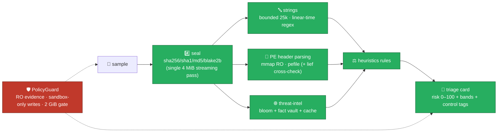

# 🔬 Static Analysis Pipeline (SAP)

Portable, evidence-safe static analysis of PE executables — **strings extraction, PE header parsing, and threat-intel hash lookups** — bundled as dual portable EXEs (GUI + CLI), offline-first, audit-grade.

| Doc | Purpose |
|---|---|
| [architecture.md](architecture.md) | Full system architecture (C4 diagrams, engine pipeline, packaging, compliance) |
| [security.md](security.md) | Security framework: ISO 27001 / NIST CSF 2.0 / SP 800-53r5 / OWASP / ASVS mappings + controls code map |
| [state.md](state.md) | State reservation & management: case sandboxes, ledgers, state machines, recovery |
| [memory.md](memory.md) | RAM reservation & management: streaming, mmap PE parsing, bounded pools, 2 GiB fail-closed gate |

## Quick start

```bash
# run the test suite (63 tests)
python -m pytest tests -q

# analyze a sample (CLI; default simulated intel engine keeps results offline)
set PYTHONPATH=src                             # Windows (bash: export PYTHONPATH=src)
python -m sap scan --sample suspicious.exe --case-dir SAP_CaseWork --analyst alice
python -m sap  info                            # engines + rules inventory
python -m sap  doctor                          # environment / frozen-bundle health
python -m sap  verify --case-dir SAP_CaseWork  # audit + custody chain + spec + bundle check
python -m sap  seal   --case-dir SAP_CaseWork  # sign ledger heads, export .sapcase

# manage local threat-intel IOCs (reproducible; runs offline against the local vault)
python -m sap  ioc add --sha256 <hash> --verdict malicious
python -m sap  ioc list

# optional GUI (requires PySide6)
python -m sap run-gui
```

**Scan, verified result (in-pipeline smoke sample):** risk **55/100 · SUSPICIOUS** across 7 findings
(strings · PE · intel · rules), with JSON/CSV/HTML/STIX reports written to `SAP_CaseWork/reports/`.

## Pre-built portables

| Artifact | Console | Purpose |
|---|---|---|
| `dist/SAP-cli.exe` (≈15.6 MB) | yes | headless triage/automation (no PySide6) |
| `dist/SAP.exe` (≈51.5 MB) | no | full GUI (PySide6) + routed CLI subcommands |

**Guarantees:** evidence opened `O_RDONLY` only · writes confined to the case sandbox · tamper-evident audit + custody ledgers · Ed25519-signed seals · AES-256-GCM encrypted `.sapcase` export · fail-closed self-integrity check in the bundled exe · every engine card tagged `engine=simulated` for demo intel.

## Build the portables

```powershell
.\build_exe.ps1          # pytest → pip-audit (CVE gate) → PyInstaller dual EXE → manifest + sha256
.\build_smoke.ps1        # E2E smoke: info/doctor/scan/verify/seal + GUI stays-up test
```

## Engine pipeline



**Scan reproducibility:** `sample_sha256` + immutable `spec_id` fully pin a scan — the same inputs yield a byte-identical triage card and reports.

## Threat-intel IOCs

```bash
# local, deterministic, offline: bloom membership (p≈0.1% FP) always resolved
# through the exact ioc_facts vault before it may influence risk
python -m sap ioc add --sha256 <hash> --verdict malicious --note "campaign 22-09"
python -m sap scan --sample t.exe --case-dir SAP_CaseWork --analyst bob
# -> risk floor 80 / HIGH when the sample hash is an added malicious IOC
```

**Hashed-only egress (opt-in):** when `--allow-egress <host>` is enabled, only hex sha256 digests
are sent to allowlisted endpoints with an enforced daily cap — sample bytes never leave the host.

> ⚠️ Findings tagged `engine=simulated` are pipeline demo output (the shipped intel engine is a
> reproducible simulator) — never present them as real threat-intel evidence.

## Compliance

| Framework | Coverage |
|---|---|
| ISO/IEC 27001:2022 | 16 Annex A controls mapped to code |
| NIST CSF 2.0 | GOVERN / IDENTIFY / PROTECT / DETECT / RESPOND / RECOVER |
| NIST SP 800-53r5 | AU-2..12, SI-10/3, RA-3/5, PR.DS-04/06, DE.CM-08, SC-8/11 |
| NIST SP 800-86 | Collection → Examination → Analysis → Reporting phases |
| OWASP Top 10 (2021) | A01–A10 all addressed (fail-closed, no sample execution) |
| OWASP ASVS 4.0 | V1–V14 checklist aligned and regression-tested |

<!----------------------------------------------------------------------->

Built for the **18-09-2026 series · project 55**: *static analysis pipeline (strings, PE header parsing, hash lookups)*.