# 🔬 Static Analysis Pipeline for Portable Executables
### Strings Extraction · PE Header Parsing · Threat-Intel Hash Lookups


> **Mission:** A **DFIR-/blue-team-grade static analysis pipeline** that ingests suspicious binaries (`.exe` / `.dll` / `.sys` / `.scr`), performs **triple-scan** — **string intelligence**, **PE structure parsing**, and **hash-based threat-intel lookups** — and emits an **audit-grade, framework-mapped triage report** before anything ever reaches a dynamic sandbox.

---

## 📑 Table of Contents

1. [Executive Overview](#1-executive-overview)
2. [Design Principles & Goals](#2-design-principles--goals)
3. [System Context (C4 — Level 1)](#3-system-context-c4--level-1)
4. [High-Level Architecture (C4 — Level 2)](#4-high-level-architecture-c4--level-2)
5. [Core Pipeline — Stage Deep Dives](#5-core-pipeline--stage-deep-dives)
6. [Component Deep Dive](#6-component-deep-dive)
7. [Data Architecture](#7-data-architecture)
8. [Threat-Intel Lookup Subsystem](#8-threat-intel-lookup-subsystem)
9. [Security Architecture](#9-security-architecture)
10. [🔐 Security Framework Compliance](#10--security-framework-compliance)
11. [Threat Model (STRIDE)](#11-threat-model-stride)
12. [Deployment & Packaging](#12-deployment--packaging)
13. [Technology Stack](#13-technology-stack)
14. [Proposed Repository Layout](#14-proposed-repository-layout)
15. [Performance & Reliability](#15-performance--reliability)
16. [SDL & Testing](#16-sdl--testing)
17. [Roadmap](#17-roadmap)
18. [Glossary & References](#18-glossary--references)

---

## 🎨 Color Legend (used across all diagrams)

| Color | Meaning |
|:---:|---|
| 🟢 Green | Trusted / verified / evidence-integrity components |
| 🔵 Blue | Data & storage layers |
| 🟠 Amber | Processing / workflow orchestration |
| 🔴 Red | Security-critical boundaries & controls |
| 🟣 Purple | User interface & interaction |
| ⚫ Gray | External systems / third-party |

---

## 1. Executive Overview

The **Static Analysis Pipeline (SAP)** is a **security-first triage engine** that answers one question fast, legally, and reproducibly:

> *"Before we detonate or deep-dive this binary — what can safely be learned from its bytes?"*

It chains three proven, non-executing analysis families:

| Stage | What it answers | Technique |
|---|---|---|
| 🧵 **Strings Intelligence** | What do embedded artifacts reveal? | ASCII/UTF-16 extraction, entropy analysis, regexes for URLs/IPs/paths/CLI |
| 🧬 **PE Header Parsing** | What is the file *structurally*? | DOS/PE/section parsing, imports/exports, resources, Rich header, packer detection |
| 🔑 **Hash Lookups** | Do we already know this file? | MD5/SHA-1/SHA-256 vs VirusTotal, MISP, Abuse.ch, local IOC bloom cache |

### ✨ At a Glance

| Attribute | Value |
|---|---|
| **Delivery** | On-prem service (`docker compose`) + portable CLI `sap.exe`; headless + GUI modes |
| **Core Engine** | Python 3.11 (lief + pefile dual-backend) with multiprocessing worker pool |
| **Network** | **Offline-by-default**; cloud lookups only on explicit, throttled, cached opt-in |
| **Evidence Safety** | **Read-only** on samples; SHA-256 sealing; append-only audit chain; chain-of-custody events |
| **Outputs** | Interactive HTML report, JSON triage card, STIX 2.1 bundle, CSV, signed `.sapcase` |
| **Security Posture** | Container-scoped microexec (no execution), signed artifacts, SBOM, TUF-style updates |
| **Frameworks** | ISO 27001:2022 · NIST CSF 2.0 · NIST SP 800-53r5 · NIST SP 800-115 · OWASP Top 10 2021 / ASVS 4.0 · FIPS 140-3 option |

### 🔑 Why this architecture?

- **Static-first = risk-minimal.** No sample is ever executed in this pipeline; dynamic detonation remains a *separate, gated* downstream stage.
- **Analyst equity + automation.** The pipeline captures expert triage logic (PE anomalies, anti-analysis strings, known-hash joins) as deterministic rules, then frees analysts for deep-dives on the *next* link in the chain.
- **Privacy & legality by design.** Samples are **local** unless the organisation explicitly enables hashed-only (never raw-file) cloud lookups.

---

## 2. Design Principles & Goals

| # | Principle | Architectural Consequence |
|:---:|---|---|
| P1 | **Never execute, ever** | File parsed via memory-mapped **read-only** handles; no `subprocess` of samples; no dynamic loaders; container is rootfs-disabled + noexec on sample volume |
| P2 | **Evidence immutability first** | Original sample hash-sealed on ingest, re-verified at close; all products written to a separate *output zone* |
| P3 | **Offline-first, air-gap friendly** | Full triage works with zero egress; cloud enrichments are cached, hashed-only, and rate-limited |
| P4 | **Deterministic reproducibility** | Pipeline manifest (`pipelinespec.json`) pins parser versions + rule hashes ⇒ same file ⇒ byte-identical report |
| P5 | **Least privilege** | Service runs unprivileged; read-only host mounts; no secrets at rest beyond encrypted API-key vault |
| P6 | **Defense in depth** | Code signing + SBOM + hash pinning + tamper-evident audit + ASVS-hardened API |
| P7 | **Fail closed** | Integrity failure, parser version mismatch, or rule-hash drift ⇒ pipeline refuses and alerts |
| P8 | **Analyst-friendly output** | One triage card per sample → risk score, matched IOCs, control mapping, next-actions |
| P9 | **Community + private intel blend** | Local bloom cache (always), MISP (optional), VT/Abuse.ch (opt-in, throttled, hashed-only) |
| P10 | **Extensible rule engine** | Rules are versioned, signature-verified bundles — never un-versioned ad-hoc scripts |

---

## 3. System Context (C4 — Level 1)

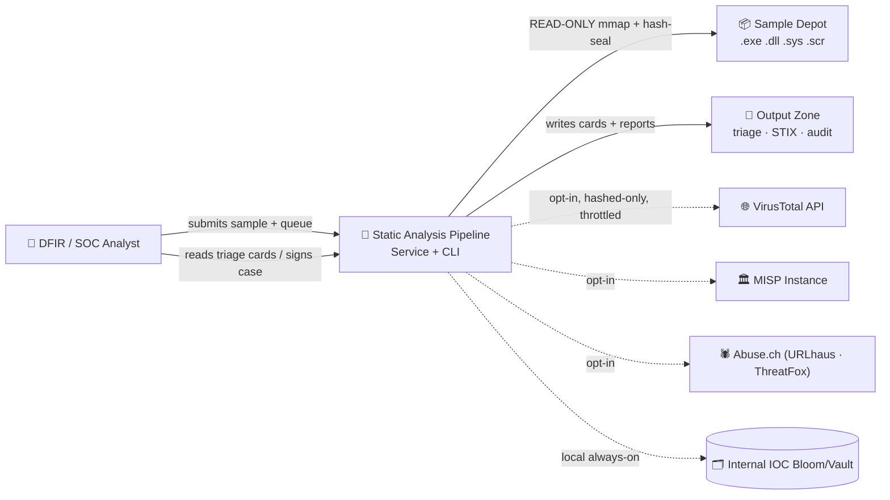

**Trust boundaries:** ① Analyst → API (authN/Z boundary 🟥) · ② Pipeline → Sample Depot (**read-only** evidence boundary 🟥) · ③ Pipeline → Output Zone (only writable zone) · ④ Pipeline → Internet (default **deny**; enabled ⇒ hashed-only + allowlist + throttle).

---

## 4. High-Level Architecture (C4 — Level 2)

```mermaid
flowchart TB
    classDef ui fill:#8e44ad,stroke:#5b2c6f,color:#fff,stroke-width:2px
    classDef wf fill:#f39c12,stroke:#9c640c,color:#fff,stroke-width:2px
    classDef eng fill:#e74c3c,stroke:#922b21,color:#fff,stroke-width:3px
    classDef data fill:#2980b9,stroke:#1b4f72,color:#fff
    classDef sec fill:#c0392b,stroke:#641e16,color:#fff,stroke-width:2px
    classDef ext fill:#7f8c8d,stroke:#4d5656,color:#fff
    classDef safe fill:#27ae60,stroke:#145a32,color:#fff

    subgraph L1["🟪 Layer 1 — Presentation & API"]
        direction LR
        GUI["🖥️ Web Triage Console<br/>queue · triage cards · IOC pivot"]
        CLI["⌨️ sap.exe CLI<br/>scan sample.bin --to-json"]
        API["🔌 REST API (FastAPI)<br/>OpenAPI · OAuth2/OIDC · rate limits"]
    end

    subgraph L2["🟠 Layer 2 — Orchestration"]
        direction LR
        ING["📥 Ingest & Sealer<br/>format detect · SHA-256 seal · custody"]
        Q["🧮 Job Queue (Redis)<br/>priority · dedup by sha256"]
        SPEC["🧭 Pipeline Spec Engine<br/>rule bundles · manifest · version gate"]
        AGG["📊 Triage Aggregator<br/>score · correlate · control-map"]
    end

    subgraph L3["🟥 Layer 3 — Analysis Engines"]
        direction LR
        STG["🧵 Strings Engine<br/>ASCII/UTF-16 · entropy · regex<br/>embedded artifact tagging"]
        PEG["🧬 PE Parser<br/>lief + pefile dual-backend<br/>headers · imports · resources"]
        HLE["🔑 Hash & Intel Engine<br/>hash family · bloom BPF · lookups"]
        RUL["📜 Rule Engine<br/>YARA-style + heuristics<br/>packer · anti-analysis · evasions"]
    end

    subgraph L4["🟦 Layer 4 — Data & Persistence"]
        direction LR
        IMG["🧾 Sample Access (RO)<br/>mmap · mime sniff · size caps"]
        DB["🗃️ CaseDB (PostgreSQL)<br/>samples · cards · finds · audit"]
        CACHE["⚡ Intel Cache (Redis + Parquet)<br/>throttle counters · result TTL"]
        IOCSTORE[("🗂️ IOC Store<br/>bloom filter + fact vault")]
    end

    subgraph L5["🛡️ Cross-Cutting Security Services"]
        direction LR
        INT["🔐 Integrity Service<br/>SHA-256 · SBOM verify"]
        AUD["📜 Audit Ledger<br/>append-only hash chain"]
        CUST["⛓️ Chain of Custody<br/>signed custody events"]
        POL["🚧 Policy Guard<br/>read-only · allowlists · gating"]
        CRY["🔑 Crypto Service<br/>Ed25519 · AES-256-GCM · CNG/FIPS"]
    end

    L1 --> L2 --> L3
    L2 --> L4
    L3 --> L4
    L3 --> L5
    L5 -.->|enforces on every layer| L1
    L5 -.-> L2
    L5 -.-> L3
    L5 -.-> L4

    class ui ui
    class wf wf
    class eng eng
    class data data
    class sec sec
    class ext ext
    class safe safe
```

### Text fallback (ASCII)

```text
┌────────────────────────────────────────────────────────────────────────────┐
│  🟪 PRESENTATION   Web Console │ CLI sap.exe │ REST API (OAuth2 · rate-limit) │
├────────────────────────────────────────────────────────────────────────────┤
│  🟠 ORCHESTRATION  Ingest+Seal │ Job Queue │ Pipeline Spec │ Triage Aggregator │
├────────────────────────────────────────────────────────────────────────────┤
│  🟥 ANALYSIS       Strings │ PE Parser │ Hash+Intel │ Rule Engine             │
├────────────────────────────────────────────────────────────────────────────┤
│  🟦 DATA           Sample(RO) │ Postgres CaseDB │ Intel Cache │ IOC Store    │
├────────────────────────────────────────────────────────────────────────────┤
│  🛡️ SECURITY (cross-cutting)  Integrity │ Audit │ Custody │ Policy │ Crypto │
└────────────────────────────────────────────────────────────────────────────┘
        ▲ samples strictly READ-ONLY · nothing executed · outputs only to sandbox ▲
```

---

## 5. Core Pipeline — Stage Deep Dives

### 5.1 The Static Triage Pipeline

```mermaid
flowchart LR
    classDef in fill:#27ae60,stroke:#145a32,color:#fff,stroke-width:2px
    classDef proc fill:#f39c12,stroke:#9c640c,color:#fff
    classDef core fill:#e74c3c,stroke:#922b21,color:#fff,stroke-width:2px
    classDef out fill:#2980b9,stroke:#1b4f72,color:#fff
    classDef sec fill:#c0392b,stroke:#641e16,color:#fff

    S0["📥 1 · INGEST<br/>upload / drop · format detect<br/>size · type gate"]:::in
    S1["🔐 2 · SEAL<br/>SHA-256 + SHA-1 + MD5<br/>MTL hash · custody event"]:::sec
    S2["🧵 3 · STRINGS<br/>ASCII / UTF-16 / UTF-16LE<br/>entropy · regex artifacts"]:::core
    S3["🧬 4 · PE PARSE<br/>lief+pefile · headers · sections<br/>imports · resources · Rich"]:::core
    S4["🗜️ 5 · COMPRESS CHECK<br/>entropy↑ sections · packer heuristics<br/>authenticode · overlay sniff"]:::proc
    S5["🔑 6 · HASH + INTEL<br/>bloom BPF → MISP → VT → Abuse.ch<br/>throttled + hashed-only"]:::core
    S6["📜 7 · RULESET<br/>heuristics · YARA bundles<br/>risk scoring"]:::proc
    S7["📊 8 · TRIAGE CARD<br/>risk score · findings · IOCs<br/>control mapping · next actions"]:::out
    S8["🧾 9 · SIGN & ARCHIVE<br/>signed report · STIX bundle<br/>append audit hash-chain"]:::sec

    S0 --> S1 --> S2 --> S3 --> S4 --> S5 --> S6 --> S7 --> S8
```

### 5.2 Strings Intelligence Detail (Stage 3)

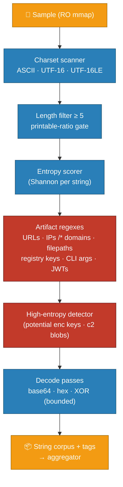

**Why entropy matters:** packed/encrypted payloads force printable-string count down while raising entropy variance; the pipeline records the **entropy profile per section** and surfaces strings that correlate with *Suspicious categories* (e.g., `CreateRemoteThread`, `VirtualAllocEx`, `%APPDATA%\\`, obfuscated registry persistence). Each matched artifact becomes a **typed IOC** with source offset — traceable to evidence bytes.

### 5.3 PE Header Parsing Detail (Stage 4)

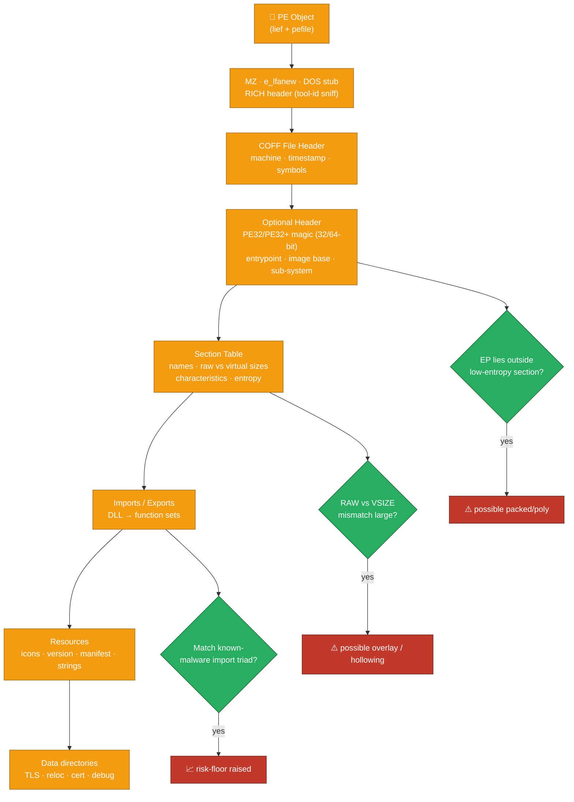

PE parsing produces a **structural fingerprint** (`pefingerprint`) that feeds the risk score independent of strings — so even a *stripped, string-less* binary is still assessed on headers, imports, resources, and section characteristics.

### 5.4 Pipeline Execution Sequence

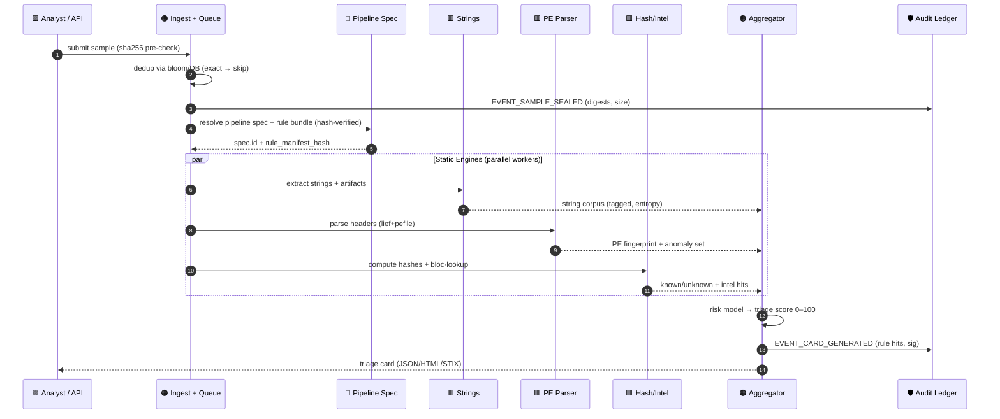

---

## 6. Component Deep Dive

| Component | Responsibility | Key Interfaces | Security Notes |
|---|---|---|---|
| **🖥️ Web Console** | Queue dashboard, triage cards, IOC pivot, run-plan review | REST API only; no direct FS access | All product access via API; no shell-out (ASVS 4.1) |
| **⌨️ CLI Runner** | Headless scan for CI/lab: `sap.exe scan <path> --out card.json` | argv → same pipeline API | Exit codes map to triage risk band |
| **📥 Ingest & Sealer** | MIME + magic + extension triage, size caps, hash seal | `seal(path)`, `dedup(sha256)` | Sample handle opened `O_RDONLY`; writes never touch source (P1/P2) |
| **📮 Job Queue** | Redis-backed queue, priorities, sha256 dedup, cancel | `enqueue`, `ack`, `retry(n)` | Bounded concurrency; TTLs; poison-sample backoffs (DoS defense) |
| **🧭 Pipeline Spec Engine** | Parser/rule bundle versioning, manifest gate | `resolve(category)`, `validate(spec)` | Spec triples (parser, rule, heuristics) hash-pinned ⇒ fail-closed on drift (P4/P7) |
| **🧵 Strings Engine** | Charset/entropy/regex artifact extraction | `extract(mm)`, `tag(corpus)` | Regex compiled from allowlisted bundle only; no regex ReDoS (linear-time builders) |
| **🧬 PE Parser** | lief+pefile dual backend, anomaly detection | `parse(mm)`, `fingerprint(pe)` | Malformed-files handled defensively; parser crash isolated per subprocess (A.8.28) |
| **🔑 Hash & Intel Engine** | Digest family, local bloom BPF, throttled cloud lookups | `hashes(mm)`, `lookup(sha256)` | Hashes **only** leave host; raw bytes never egress (P3, A05) |
| **📜 Rule Engine** | Versioned YARA + heuristic bundles, scoring | `evaluate(features)` | Rules signature-verified; no dynamic import of un-signed bundles (A08) |
| **📊 Triage Aggregator** | Integer risk score (0–100), IOC merge, control map | `score(card)`, `emit()` | Card hash-linked to spec + sample digests; signed before archive |
| **🔐 Integrity Service** | SHA-256/SHA-1/MD5, streaming, FIPS switch | `hash_file`, `verify_chain` | CNG/BCrypt backend in FIPS mode |
| **📜 Audit Ledger** | Append-only JSONL, hash-chained events | `log(event)`, `seal()`, `verify_chain()` | Tamper-evident; final chain hash signed Eд25519 |
| **🚧 Policy Guard** | RO enforcement, egress allowlist, restricted rule-gating | `can_open`, `may_egress` | Single chokepoint for immutability (P1) + privacy (P3) |

---

## 7. Data Architecture

### 7.1 Core Data Model

```mermaid
erDiagram
    SAMPLE ||--o{ SCAN : "runs"
    SAMPLE ||--|| DIGEST : "sealed_as"
    SCAN ||--|| SPEC : "used"
    SCAN ||--o{ FINDING : "produces"
    SCAN ||--o{ STRING_ARTIFACT : "yields"
    SCAN ||--o{ INTEL_HIT : "matches"
    SAMPLE ||--o{ AUDIT_EVENT : "logs"
    SCAN ||--o{ TRIAGE_CARD : "emits"
    INTEL_HIT }o--|| IOC : "references"

    SAMPLE {
        string sample_id PK
        string original_name
        string route (email/web/disk/agent)
        bigint size_bytes
        datetime first_seen_utc
    }
    DIGEST {
        string sha256 UK
        string sha1
        string md5
        string ssdeep_or_tlsh
        datetime sealed_utc
    }
    SCAN {
        string scan_id PK
        string spec_id FK
        string status
        int risk_score
        datetime started_utc
    }
    FINDING {
        string finding_id PK
        string rule_id
        string severity
        string category
        jsonb evidence
    }
    STRING_ARTIFACT {
        string artifact_id PK
        string kind (url/ip/domain/path/regkey)
        string value
        bigint offset
        float entropy
    }
    INTEL_HIT {
        string hit_id PK
        string source (vt/misp/abuse/local)
        integer detections
        string verdict
        datetime observed_utc
    }
```

### 7.2 Storage & Retention Strategy

| Data | Format | Location | Integrity / Retention |
|---|---|---|---|
| Sample originals | Raw bytes | **Read-only** evidence vault | SHA-256 sealed; retention per custody policy (evidential class) |
| Digests | SPK/DID-listed | Postgres `digest` table | Always; bloom cache separately |
| Triage cards | JSON (canonical, sorted) | Output zone `/cards` | Hash-linked to spec + digests |
| Analysis products | HTML + JSON + STIX 2.1 | Output zone `/reports` | Report manifest signed (Ed25519) |
| Intel cache | Parquet + Redis TTL | Local cache | Throttle counters; TTL 24–90d by source |
| API keys (VT etc.) | Encrypted vault | Secrets store / SOPS | AES-256-GCM envelope; rotated ≤ 90 d |
| Audit ledger | JSONL hash-chain | Output zone `/audit` | Chain verify + sealed signature |
| IOC store | Bloom filter + fact vault | Postgres + Redis | Hashed precision; no raw sample bytes |

### 7.3 Encryption Strategy

- **At rest:** AES-256-GCM per-scope DEKs via KMS; database encryption + encrypted secret vault.
- **In transit:** TLS 1.3 minimum; mTLS inside service mesh; HSTS.
- **Evidence:** sample digests only stored; raw samples in read-only vault with access audit (ISO A.5.32/A.8.15).

---

## 8. Threat-Intel Lookup Subsystem

### 8.1 Lookup Flow (hashed-only by design)

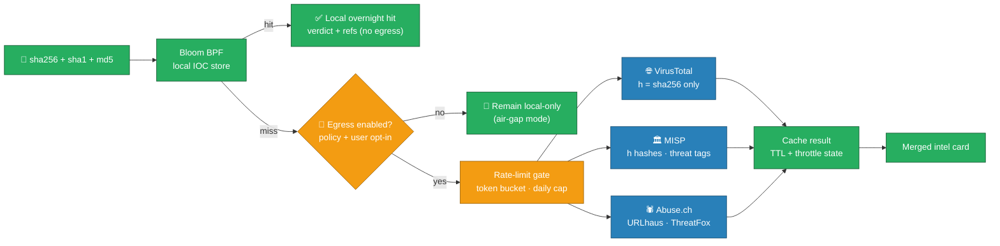

### 8.2 API Privacy Contract

| Rule | Enforcement |
|---|---|
| **Hashes only egress** | Raw sample bytes are never sent; VT/MISP calls contain digest + metadata only |
| **Per-org daily caps** | Token-bucket enforcement in Intel Engine; residual counters in audit |
| **Allowlisted endpoints** | Fixed host allowlist; TLS cert pinning; no user-supplied URLs (SSRF kill) |
| **Full transparency** | Every egress logged as `INTEL_EGRESS` event with digest, endpoint, timestamp |

> ⚠️ **OPSEC note (A05/A08):** lookup windows are a known exposure — the pipeline mitigates with cache-first bloom checks, deterministic timing on misses, and optional daily *noise* lookups for query-hiding in high-sensitivity environments.

---

## 9. Security Architecture

### 9.1 Defense in Depth

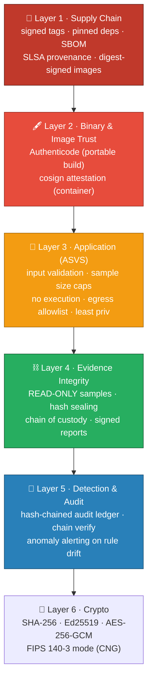

### 9.2 Trust Zones & Controls

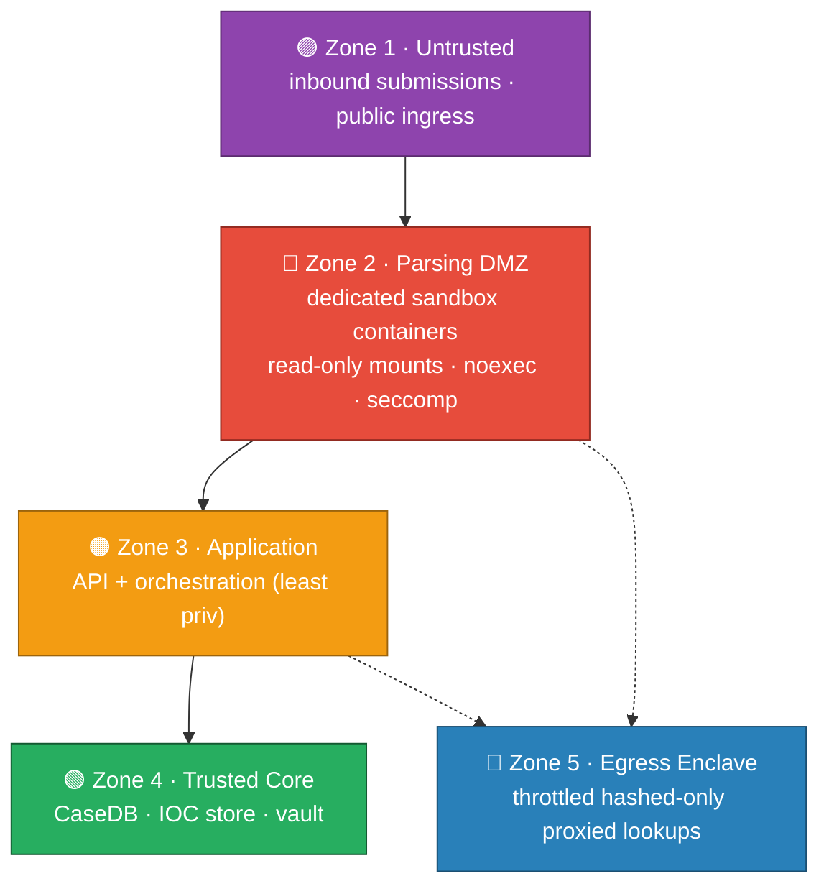

**Boundary rules:** samples enter Zone 2 only; parsers run as disposable non-root containers; network egress originates from the Z5 enclave proxy, never from parser workers (P1/P3).

### 9.3 RBAC Matrix

| Role | Submit | View cards | Intel egress | Rule mgmt | Audit | Admin |
|---|---|---|---|---|---|---|
| 🔍 **Analyst** | ✔ | ✔ | per-policy | No | No | No |
| 🧠 **Intel Analyst** | ✔ | ✔ | ✔ (cap-gated) | No | Read | No |
| 🛠️ **Rule Engineer** | No | Read | No | CRUD (review+sign) | Read | No |
| 🧾 **Auditor** | Read | Read | Read | Read | **Read + export** | No |
| 👑 **Platform Admin** | CRUD | CRUD | Cap config | CRUD | Read | Yes |

> All admin/rule actions require **approval workflows + JIT elevation** (ISO A.5.15 / A.8.2).

---

## 10. 🔐 Security Framework Compliance

### 10.1 ISO/IEC 27001:2022 — Annex A Control Mapping

| Annex A | Control | Implementation in SAP |
|---|---|---|
| A.5.9 | Inventory of assets | SBOM (CycloneDX) per release; parser/rule bundle registry as asset inventory |
| A.5.14 | Information transfer | Hashed-only egress contract; intel-card custody events |
| A.5.15 | Access control | RBAC + JIT elevation + per-role policy engine (see §9.3) |
| A.5.24/25/26 | Incident management | Triage cards feed IR runbooks; anomaly on rule drift alerts SOC |
| A.5.28 | Secure coding | OWASP ASVS-sourced gates; SAST/SCA in CI; no `eval`, no un-versioned rules |
| A.5.32 | Information copy | Sample copies logged; output zone isolated; access re-authorized |
| A.5.34 | Privacy & PII | **Hashes-only egress**; raw samples never leave; data-minimized outputs |
| A.8.2 | Privileged access | Non-root parse workers; break-glass with active audit |
| A.8.8 | Vulnerability mgmt | Weekly scans; SCA; deps pinned (`pip-audit` / OSV gates) |
| A.8.9/8.10 | Config & change mgmt | Pipeline spec manifests hash-pinned; change board on rule bundles |
| A.8.12 | Malware protection | The pipeline itself *detects* malware signatures — controls in rule bundles + YARA |
| A.8.15/8.16 | Logging & monitoring | Hash-chained audit ledger; SIEM ship of triage/egress events |
| A.8.20/8.21 | Network segregation | Zone model (§9.2); Z5 egress enclave; micro-seg with mTLS |
| A.8.23 | Web services protection | WAF + rate limiting + ASVS-hardened API |
| A.8.24 | Use of cryptography | Crypto inventory (§9.4); FIPS 140-3 mode via CNG |
| A.8.25 | Secure development lifecycle | Threat model (§11) per release; security stories in backlog |
| A.8.28 | Secure coding | Parser subprocess isolation; linear-time regex; no dynamic code |
| A.8.29 | Security testing | DAST + pentest + fuzz of parsers (see §16) |
| A.8.31/32/33/34 | Continuity | 3-2-1 backups; DR restore drill ≤ 4 h RTO; change records |

### 10.2 NIST CSF 2.0 — Function Mapping

| Function | Category | SAP Implementation |
|---|---|---|
| 🏛️ **GOVERN** | GV.PO / GV.RR / GV.SC | Published secure-dev policy, signed rule-bundle governance, third-party intel vetting |
| 🔍 **IDENTIFY** | ID.AM / ID.RA / ID.IM | IOC registry (bloom+vault) as asset/risk inventory; TR in threat model (§11); CVE watch on pinned deps |
| 🛡️ **PROTECT** | PR.AA / PR.DS / PR.PS | Least-privilege workers; sample read-only + hash-sealed (PR.DS-01); signed bundles & images (PR.DS-10/11); audit logging (PR.PS-04) |
| 🚨 **DETECT** | DE.CM / DE.AE | Pipeline spec hash verification; ledger chain checks; intel-hit anomaly alerting; detection rules constant-vetted |
| 📣 **RESPOND** | RS.MA / RS.AN | Triage → IR runbook pivot; rule drift alerts with guidance; signed evidence of incidents |
| 🔁 **RECOVER** | RC.RP | Postgres WAL + output-zone snapshots; re-run from hash-pinned pipeline spec |

### 10.3 NIST SP 800-53 Rev 5 (selected)

- **AC-2 / AC-3 / AC-6** — account control, least privilege ⇒ RBAC matrix + JIT.
- **AU-2..AU-12** — audit taxonomy (AU-2), hash-chain non-repudiation (AU-10), log retention (AU-11), periodic review (AU-12).
- **SC-7 / SC-12 / SC-28** — boundary defense (Z5 enclave), crypto key mgmt (KMS), at-rest protection.
- **SI-3 / SI-4 / SI-10** — malicious code inspection (the pipeline's own purpose), system monitoring, input validation on every sample.
- **RA-5 / SA-11** — vulnerability scanning; developer security-testing (fuzz parsers).

### 10.4 OWASP Top 10 (2021) Mapping

| OWASP # | Risk | SAP Mitigation |
|---|---|---|
| **A01** | Broken Access Control | Server-side authorization on every endpoint; RBAC + tenant scoping; deny-by-default |
| **A02** | Cryptographic Failures | Modern algo inventory; TLS 1.3; no legacy ciphers; key rotation ≤ 90 d |
| **A03** | Injection | ORM + prepared statements; parser inputs are *files*, schema-validated; no dynamic SQL; no shell-outs with sample data |
| **A04** | Insecure Design | Threat model per parser family; fail-closed drift gates; STRIDE-driven mitigations |
| **A05** | Security Misconfiguration | Infra-as-Code + CIS baselines; read-only sample mounts; error redaction; egress defaults-deny |
| **A06** | Vulnerable & Outdated Components | Pinned deps; `pip-audit`/OSV CI gate; SBOM per release; upgrade SLA |
| **A07** | Identification & Auth Failures | OIDC + MFA; HttpOnly/Secure cookies; short-lived JWTs; rotation |
| **A08** | Software & Data Integrity | Signed artifacts + cosign; SBOM; hashed-manifest pipeline specs; TUF-style updates; sample digests sealed |
| **A09** | Logging & Monitoring Failures | Structured logging; SIEM feed; alerting on auth anomalies & INTEL_EGRESS anomalies |
| **A10** | SSRF | Allowlisted intel hosts only; TLS cert pinning; no user-supplied URLs |

> **ASVS 4.0 L1** checklist is enforced in CI (V1 security requirements, V5 validation/encoding, V6 crypto, V9 integrity, V12 file & URL handling).

### 10.5 Crypto Inventory

| Purpose | Algorithm | FIPS mode |
|---|---|---|
| Sample hashing | SHA-256 (+ SHA-1/MD5 for lookups, flagged) | CNG BCrypt |
| Report / card signing | Ed25519 (RFC 8032) | RSA-3072/PSS fallback |
| Vault / package secrecy | AES-256-GCM | ✔ |
| Key derivation | Argon2id → PBKDF2-HMAC-SHA256 in FIPS | ✔ |
| Update metadata | Ed25519 (TUF roles) | ✔ |
| Audit chain | SHA-256 hash-chain | ✔ |

---

## 11. Threat Model (STRIDE)

| Threat | Vector | Impact | Mitigation (control IDs) |
|---|---|---|---|
| **S**poofing | Fake intel endpoint / spoofed rule bundle | False verdicts; malicious rule execution | Host allowlist + TLS pinning + bundle signatures (A08, Z5) |
| **T**ampering | Binary altered between seal & parse; patched tools | Wrong triage; tainted evidence | RO mmap + hash re-verify + ledger chain + self-integrity checks (A.8.15) |
| **R**epudiation | Analyst denies submitting/elevating | Legal exposure | Hash-chained ledger + Ed25519 seal; custody event attribution |
| **I**nformation disclosure | Raw sample leaked via lookup; card over-shared | Breach; intel opsec leak | Hashed-only egress; throttled timing; data-minimized cards (A.5.34) |
| **D**enial of service | Zip-bomb / huge overlay / regex-laden input | Parse hang or crash | Size + decompression caps, streaming readers, subprocess isolation, linear regex, backoff quotas |
| **E**levation of privilege | Malformed PE exploiting a parser bug | RCE inside pipeline | Disposable non-root parser containers; seccomp + noexec mounts; parser fuzzing; duplicate never-trust parsers (lief+pefile cross-check) |

**Residual risks (documented & accepted):** parser-0day before fuzz coverage (mitigated by dual-backend cross-validation); intel query entropy leak (mitigated by optional noise queries); ❌ sample *execution* is out of scope by design — any need for behavior goes to a separate gated dynamic detonation stage behind an explicit high-privilege approval.

---

## 12. Deployment & Packaging

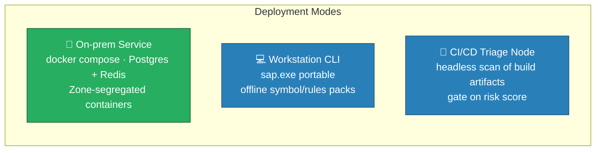

| Requirement | Min | Recommended |
|---|---|---|
| OS (service) | Linux container, any x64 | Debian/K8s with mTLS mesh |
| RAM | 4 GB | 16 GB (large queues + concurrency) |
| Disk (evidence) | 2× max sample size | NVMe + backup tier |
| Network | None (offline) | TLS to allowlisted intel endpoints only |
| Privilege | Service: non-root user; sample volume read-only | Dedicated DMZ host for Z2/S zone |

**Portable build:** onefile PyInstaller (`sap.exe`), Authenticode-signed, offline ruleset embedded, self-integrity check on first run (fail-closed).

---

## 13. Technology Stack

| Layer | Technology | Rationale |
|---|---|---|
| API / UI | FastAPI + React SPA | Async, typed, OpenAPI; attratable triage console |
| Parsing | **lief** + **pefile** (dual-backend) + `magic` | Cross-validation defeats parser-specific parsers |
| Rules | YARA (rust backend) + native heuristics | Industry-standard detection authoring |
| Data | PostgreSQL + Redis + Parquet | Relational case records, queue/cache, intel columnar store |
| Orchestration | Celery + Redis / docker compose | Reliable queue with retries + backoff |
| Crypto | `cryptography` (Rust) / CNG FIPS | Vetted primitives; FIPS option |
| Intel | ShareDBN / MISP API / VT API + local bloom (pybloom) | Community + private blend; hashed-only access |
| Packaging | PyInstaller (exe) + Docker (digest-signed, cosign) | Portable + supply-chain-verifiable |
| Supply chain | CycloneDX SBOM · pip-audit · SLSA provenance | A06 / A.5.9 compliance |

---

## 14. Proposed Repository Layout

```text
sap/
├─ 📄 architecture.md               ← this document
├─ 🐍 src/sap/
│  ├─ api/            # FastAPI routes, authZ, rate limits
│  ├─ ingest/         # sealer, format gate, dedup
│  ├─ engines/
│  │  ├─ strings/     # charsets · entropy · regex artifacts
│  │  ├─ pe/          # lief/pefile parsers + anomalies
│  │  └─ intel/       # bloom · MISP · VT · Abuse.ch · throttle
│  ├─ rules/          # YARA + heuristic bundles (versioned)
│  ├─ orchestrator/   # spec engine · queue · aggregator · scoring
│  ├─ data/           # models · migrations · IOC store
│  ├─ security/       # integrity · audit ledger · policy guard
│  └─ ui/             # React triage console
├─ 🧩 rule-bundles/   # signed, hash-manifested bundles
├─ 🧪 tests/          # unit · parser fuzz · regressions
├─ 🏗️ infra/          # docker compose · IaC · CI/CD · SBOM
└─ 📜 docs/           # runbooks · custody SOP · intel DPA
```

---

## 15. Performance & Reliability

| Concern | Strategy |
|---|---|
| 10 GB+ samples | Streaming, memory-map readers; constant-memory hashing; parse worker caps |
| Zip/binary bombs | Size caps + decompression limits + overlay-size guards (fail-closed) |
| Parser crashes | Each parser runs in disposable subprocess; failure isolated + logged; limits retries |
| Batch triage (thousands) | Redis queue, sha256 dedup, parallel workers backend; progress/ETA surface |
| Crash mid-batch | Postgres WAL + persisted queue + hash-pinned pipeline spec ⇒ resumable |
| Intel lookup latency | Bloom hit short-circuits; cached results (Redis/Parquet TTL); queue offload |
| Integrity drift | Ledger re-verified at start/close; rule-bundle hashes checked each run |

**Reliability targets:** parser crash-free ≥ 99.5% · deterministic cards (same file + spec ⇒ byte-identical JSON) · ledger chain verification 100% · egress never exceeds configured daily caps.

---

## 16. SDL & Testing

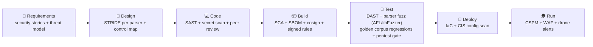

| Phase | Tooling | Gate |
|---|---|---|
| Pre-commit | Semgrep, TruffleHog, pre-commit hooks | ⛔ blocking findings |
| Build | `pip-audit`, Syft/Grype, cosign | ⛔ CRITICAL/HIGH |
| Fuzz/Test | OWASP ZAP, corpus + fuzz harness, `pytest` | ⛔ A01–A10 regressions, crash-free |
| Deploy | Terrascan/Checkov, CIS scanner | ⛔ CIS drift |

---

## 17. Roadmap

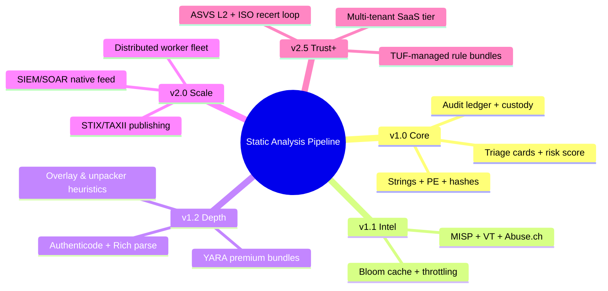

---

## 18. Glossary & References

**Glossary:** **PE** — Portable Executable · **e_lfanew** — DOS header offset to PE header · **RICH** — toolchain fingerprint header · **IOC** — Indicator of Compromise · **STIX/TAXII** — Cyber-threat intel exchange standards · **Bloom BPF** — Bloom filter (probabilistic set membership) · **Overlay** — trailing bytes after last section (often packed payload) · **TUF** — The Update Framework · **SBOM** — Software Bill of Materials · **WORM** — Write Once Read Many.

**References**

- LIEF — Library to Instrument Executable Formats — https://lief-project.github.io
- pefile — PE parser for Python — https://github.com/erocarrera/pefile
- VirusTotal API — https://developers.virustotal.com
- MISP Project — https://www.misp-project.org
- Abuse.ch intelligence feeds — https://abuse.ch
- NIST Cybersecurity Framework 2.0 — https://www.nist.gov/cyberframework
- NIST SP 800-53 Rev 5 & NIST SP 800-115 (Security Testing) — https://csrc.nist.gov
- ISO/IEC 27001:2022 — Information Security Management Systems
- OWASP Top 10:2021 & ASVS 4.0.3 — https://owasp.org
- YARA Rules — https://virustotal.github.io/yara
- FIPS 140-3 & SLSA v1.0 — supply-chain and crypto baselines

---

<div align="center">

🔬 **Static Analysis Pipeline** — *Look at the bytes, never run them · Evidence-safe by design · Offline-first · String ⇝ PE ⇝ Hash ⇝ Verdict in seconds* 🔬

</div>