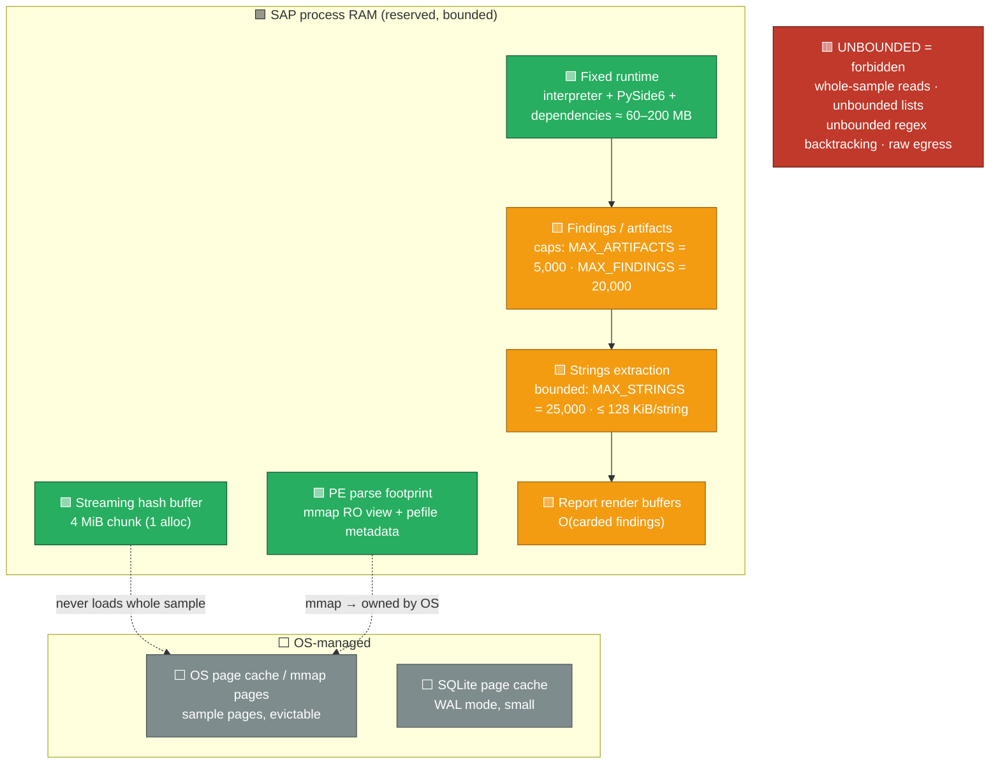
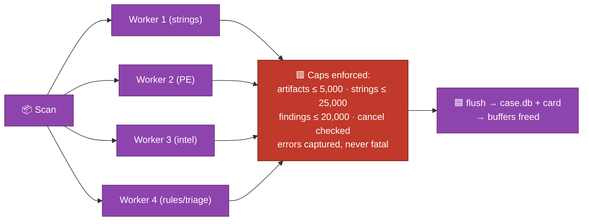
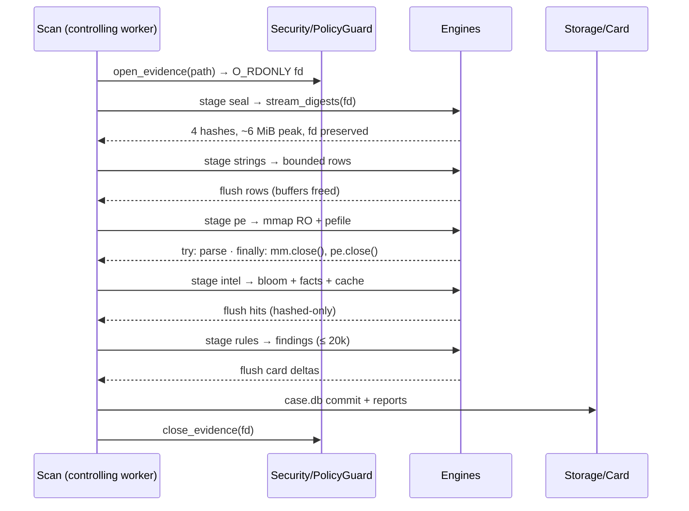

# 🧠 SAP Memory Reservation & Management (RAM)

> Companion to **[architecture.md](architecture.md)** (§16 Performance) and **[state.md](state.md)**. This document defines how SAP **reserves, bounds, and releases RAM** — the host is a triage instrument, and unbounded memory use is both a reliability and a DoS risk. Evidentiary samples are attacker-controlled; RAM discipline is a security control, not a nicety.

---

## 📑 Contents

1. [Memory Domains & Reservation Model](#1-memory-domains--reservation-model)
2. [Per-Stage RAM Budget](#2-per-stage-ram-budget)
3. [Streaming & Constant-Memory Design](#3-streaming--constant-memory-design)
4. [Bounded Pools & Caps](#4-bounded-pools--caps)
5. [Memory Lifecycle (alloc → release)](#5-memory-lifecycle-alloc--release)
6. [Size Gates & The 2 GiB Rule](#6-size-gates--the-2-gib-rule)
7. [DoS & Memory-Pressure Mitigations](#7-dos--memory-pressure-mitigations)
8. [Memory Anti-Forensics & Evidence Dealings](#8-memory-anti-forensics--evidence-dealings)

---

## 1. Memory Domains & Reservation Model

**Reservation rules**

| Rule | Statement |
|---|---|
| R1 | The **sample is never fully resident**. Reads are chunked (4 MiB) or paged via `mmap`; `pefile` is fed an RO mapping so sample pages live in the OS page cache, not the heap. |
| R2 | Every concurrent collection has a **declared cap** (workers, artifacts, findings, strings, chunk sizes). Exceeding = truncation/error, never unbounded growth. |
| R3 | One **bounded ThreadPoolExecutor** (`MAX_WORKERS = 4`) per scan; no nested pools; no engine-spawned threads. |
| R4 | Engine tabulars are **normalized then flushed** (SQLite + card) as soon as a stage completes; memory holds one stage's rows at a time. |
| R5 | **Cancellation frees**: cancel tokens are checked between engines and inside row iteration; `mm.close()` is guaranteed via `finally` in `pe_engine` even on parse failure. |

---

## 2. Per-Stage RAM Budget

Reference host: 8 GB minimum spec. Budgets are ceilings, not targets.

| Stage (§5.1) | Allocation | Ceiling | Released when |
|---|---|---|---|
| 1 · Prepare | path objects, size gate, magic sniff | < 1 MB | immediately |
| 2 · Seal | `stream_digests` (md5/sha1/sha256/blake2b) + 4 MiB chunk buffer | **~6 MiB** | digests computed |
| 3 · Strings | streaming decode + bounded artifact rows | ~16 MiB (25k × ≤128 KiB strings) | stage completes → flush |
| 4 · PE | mmap RO view + pefile metadata (+ optional lief cross-check ≤ 64 MiB) | ~8–64 MiB resident | views closed, mm closed |
| 5 · Intel | bloom string + fact vault + cache | < 10 MiB | stage completes |
| 6 · Rules | heuristics over gathered rows | < 5 MiB | stage completes |
| 7 · Triage | card dict deltas, risk splitter | < 1 MB | card flushed to DB |
| 8 · Report | HTML/JSON/CSV/STIX buffers | O(capped findings) ≈ < 20 MB | files written |
| 9 · Close | ledger heads + signature | < 1 MB | seal written |

**Aggregate worst case** stays well under ~400 MB on a capped scan — ample headroom on the 8 GB minimum spec, leaving the GUI (PySide6, ~150–200 MB) comfortably co-resident.

---

## 3. Streaming & Constant-Memory Design

| Mechanism | Implementation | Effect |
|---|---|---|
| Streaming digests | `integrity.stream_digests()` reads fixed 4 MiB chunks, updates md5+sha1+sha256+blake2b in one pass | RAM = O(chunk), even for a 2 GiB sample |
| PE via mmap | `pe_engine._read_only_map()` opens `O_RDONLY`, `mmap.MAP_PRIVATE`; `pefile.PE(data=view)` | sample pages owned by OS, evictable; no heap copy |
| String extraction | one chunk at a time, decoded, matched by linear-time regexes | no full-sample resident copy |
| Bloom membership | fixed-size BPF string in memory (small) with per-client salt header | O(1) lookup, p≈0.1% FP — always resolved via exact `ioc_facts.json` |
| Capped tabulars | strings ≤ 25,000, findings ≤ 20,000, artifacts ≤ 5,000 with deterministic truncation | no unbounded lists |
| Deterministic flush | per-stage rows → `case.db` + card, buffers freed immediately | per stage, not per scan |

---

## 4. Bounded Pools & Caps

| Cap | Value | Location |
|---|---|---|
| `SAMPLE_MAX_BYTES` | 2 GiB (default; gate raises `PolicyViolation` fail-closed) | `security/policy.py:gate_sample_size` |
| `MAX_WORKERS` | 4 (clamped `max(1, min(cpu, 4))`) | `orchestration/scheduler.py` |
| `MAX_STRINGS` | 25,000 (`MAX_STRING_LEN` 128 KiB, truncation tagged) | `engines/strings_engine.py` |
| `MAX_ARTIFACTS` | 5,000 | `data/store.py` |
| `MAX_FINDINGS` | 20,000 | `orchestration/aggregator.py` |
| Hash chunk | 4 MiB | `internal/integrity.py::CHUNK_SIZE` |
| PE cross-check | 64 MiB file cap (`LIEF_CROSSCHECK_MAX_BYTES`) | `engines/pe_engine.py` |
| Egress daily cap | 500 lookups/day when enabled | `security/policy.py::EgressGate` |

---

## 5. Memory Lifecycle (alloc → release)

**Guarantees:** the mmap-backed PE view is closed in a `finally` on both success and `PeParseError`/`OSError` (regression-tested — see `tests/test_pe_engine.py`); evidence fd is closed by `PolicyGuard` after the scan; cancel tokens are honored between stages so a stopped scan frees everything.

---

## 6. Size Gates & The 2 GiB Rule

| Condition | Behavior |
|---|---|
| `size <= 0` | `PolicyViolation` (empty/invalid sample) — scan refused |
| `0 < size <= 2 GiB` | accepted; streamed/sealed in 4 MiB chunks |
| `size > 2 GiB` | `PolicyViolation` — fail-closed, no partial work, explicit analyst override required |
| Non-PE bytes | PE engine tags `not_pe`; strings rules run bounded; no crash paths |

The 2 GiB rule is deliberate: it keeps every pipeline structure inside the R1 constant-memory contract while covering virtually all PE samples (see architecture.md §13 sizing rationale).

---

## 7. DoS & Memory-Pressure Mitigations

| Attack/condition | Mitigation |
|---|---|
| Huge sample booked for scan | 2 GiB fail-closed size gate (R1) |
| Hostile regex on strings (ReDoS) | linear-time regexes only (`re` patterns that avoid exponential backtracking); per-string length cap |
| Unbounded artifact explosion | `MAX_ARTIFACTS` truncation with deterministic tagging |
| Worker exhaustion | `MAX_WORKERS = 4` clamped pool, no nested pools |
| Sample mutated mid-scan | RO view + snapshot-at-seal digests; `verify --sample` re-check |
| Memory pressure from GUI | GUI + analysis share the host budget; scans bounded to stay co-resident on 8 GB |
| Disk full during report/case write | `PolicyViolation` captured; state safe (recovery §state.md 6) |

---

## 8. Memory Anti-Forensics & Evidence Dealings

| Item | Policy | Rationale |
|---|---|---|
| Residency | Sample bytes live in OS page cache (mmap/chunks), never in a long-lived heap buffer | An in-memory copy is a second copy of evidence |
| Release | Every view is closed deterministically (`finally`), digests freed after seal | No teardown-time ambiguity |
| Telemetry | All scan events reference the sample only by its sha256 — never by content | Findings stay hashed-addressed (state.md §1) |
| Egress | Payloads in cleared before/after hashing; nothing but hex digests ever queued for egress | Hash-only contract (architecture.md §9.2) |

> **Memory reservation summary:** never-fully-resident evidence · four chained-seal stages under 400 MB worst case · declared caps on every concurrent structure · view release guaranteed by `finally` · 2 GiB fail-closed gate keeps the whole pipeline inside the constant-memory contract.