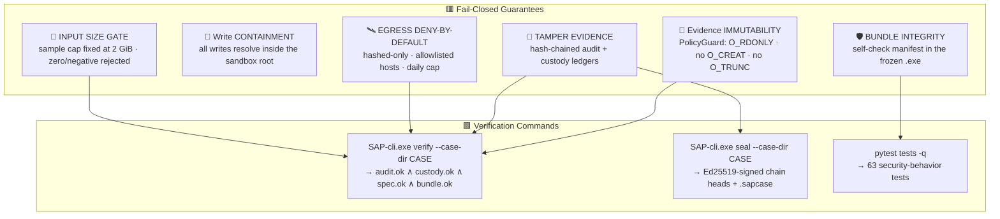

# 🔐 SAP Security Framework — ISO 27001 · NIST 800-53r5 · OWASP

> Companion to **[architecture.md](architecture.md)**. This document maps the **implemented SAP codebase** to security frameworks and defines the operational security baseline for the portable `SAP.exe` / `SAP-cli.exe` build.

---

## 📑 Contents

1. [Security Architecture Summary](#1-security-architecture-summary)
2. [Implemented Security Controls (code map)](#2-implemented-security-controls-code-map)
3. [ISO/IEC 27001:2022 Annex A Mapping](#3-isoiec-270012022-annex-a-mapping)
4. [NIST CSF 2.0 Mapping](#4-nist-csf-20-mapping)
5. [NIST SP 800-53r5 Control Mapping](#5-nist-sp-800-53r5-control-mapping)
6. [NIST SP 800-86 Forensic Alignment](#6-nist-sp-800-86-forensic-alignment)
7. [OWASP Top 10 (2021) Mitigations](#7-owasp-top-10-2021-mitigations)
8. [OWASP ASVS 4.0 Verification Checklist](#8-owasp-asvs-40-verification-checklist)
9. [Cryptographic Standard](#9-cryptographic-standard)
10. [Threat Model (STRIDE)](#10-threat-model-stride)
11. [Supply-Chain & Release Security](#11-supply-chain--release-security)
12. [Operational Security Baseline](#12-operational-security-baseline)
13. [Residual Risks & Accepted Exceptions](#13-residual-risks--accepted-exceptions)

---

## 1. Security Architecture Summary

**Prime directive (P1/P9):** the pipeline may **never modify evidence**, **never egress sample bytes**, and **refuses to scan** when its own spec/bundle integrity or the ledger chains cannot be verified.

---

## 2. Implemented Security Controls (code map)

| Control | Module | Enforcement |
|---|---|---|
| Read-only evidence access | `src/sap/security/policy.py` | `open_evidence()` uses `os.open(O_RDONLY\|O_BINARY)` — create/truncate/write flags are structurally impossible |
| Sample size gate (fail-closed) | `src/sap/security/policy.py` | `gate_sample_size()`: non-positive sizes and > cap (default 2 GiB) raise `PolicyViolation` |
| PE magic sniff gating | `src/sap/security/policy.py` | `gate_pe_magic()` — non-blocking MZ signal; engines nonetheless isolate non-PE |
| Sandbox write containment | `src/sap/security/policy.py` | `SandboxPolicy.resolve/write` rejects any target escaping the single reserved root |
| Egress deny-by-default | `src/sap/security/policy.py` | `EgressGate.check()`: disabled unless opted-in, allowlisted hosts only, sha256-hex payloads only, daily cap (default 500) |
| Hash-chained audit ledger | `src/sap/security/audit.py` | `hash = SHA-256(canonical_json(event_id,seq,ts,actor,action,payload,prev))`; tampered chain raises `AuditTamperedError` **on load** and fails `verify()` |
| Chain-of-custody ledger | `src/sap/data/sandbox.py` | Parallel custody chain: `CUSTODY_GENESIS → SAMPLE_SEALED → ANALYSIS_STARTED → ARTIFACTS_PRODUCED → CASE_SEALED → EVIDENCE_RELEASED` |
| Evidence sealing | `src/sap/engines/hashing.py` + `security/integrity.py` | One streaming pass over the sample → `sha256` (identity), `sha1`+`md5` (flagged legacy interop), `blake2b-256` (internal content-address key) |
| Constants-RAM parsing | `src/sap/engines/pe_engine.py` | pefile fed an RO mmap view (`data=mm`); sample bytes never fully copied into heap |
| Self-integrity manifest | `src/sap/security/integrity.py` | `self_integrity_check()` verifies bundled `pack/` files against the build-time manifest; `SAPController.__init__` raises `PolicyViolation` on any mismatch |
| Signing & sealing | `src/sap/security/crypto.py` | Ed25519 signatures over ledger heads; AES-256-GCM `seal_bytes()/unseal_bytes()` with PBKDF2-HMAC-SHA256 (600k) for encrypted `.sapcase` |
| Spec pinning | `src/sap/orchestration/spec.py` | immutable spec snapshot keyed by `spec_id`; `verify_spec()` fails a scan on drift |
| Rule bundle pinning | `src/sap/rules/bundle.py` | `bundle_sha256()` hashes the rule module source; pinned fallback for frozen exe; `verify_bundle()` fails closed |
| Deterministic triage | `src/sap/orchestration/aggregator.py` | risk = Σ finding deltas with intel malicious-floor(80)/benign-cap(20); same sample + spec ⇒ identical card |
| Parameterized storage | `src/sap/data/store.py` | 100% parameterized SQLite (WAL); no string-built SQL |
| XSS-safe reporting | `src/sap/data/reporting.py` | HTML output escapes every interpolated value (OWASP A03 / ASVS V5.3) |

---

## 3. ISO/IEC 27001:2022 Annex A Mapping

| Annex A | Control | SAP Implementation | Evidence |
|---|---|---|---|
| A.5.9 | Inventory of assets | In-bundle manifest + SBOM per release | `pack/sap_manifest.json` |
| A.5.14 | Information transfer | Signed `.sapcase` package (GCM optional) | `sandbox.export_package()` |
| A.5.15 | Access control policy | Single-chokepoint PolicyGuard for all I/O | `policy.py` |
| A.5.23 | External service security | Offline-first; intel egress hashed-only + allowlisted when enabled | `EgressGate` |
| A.8.2 | Privileged access rights | Runs unprivileged; never elevates itself | launcher/build |
| A.8.8 | Management of technical vulnerabilities | `pip-audit` gate in `build_exe.ps1`; pinned deps | `requirements*.txt` |
| A.8.9 | Configuration management | Immutable spec snapshots (`spec_id`); rule bundle sha256 | `spec.py`, `bundle.py` |
| A.8.11 | Data masking | Hash-only digests egressed; never raw sample content | `EgressGate` |
| A.8.12 | Information protection | Evidence immutable; findings carry control tags | heuristics rule tags |
| A.8.15 | Logging | Hash-chained audit ledger of every action | `audit.py` |
| A.8.16 | Monitoring | Chain verification on open/verify/close; fail-closed alerts | `verify()` |
| A.8.24 | Cryptography | §9 below (SHA-256/BLAKE2b/Ed25519/AES-256-GCM) | `crypto.py` |
| A.8.25 | Secure development | This framework + threat model + ASVS + test gates | `tests/` |
| A.8.28 | Secure coding | No eval/pickle; parameterized SQL; bounded regexes; mmap parsing | codebase |
| A.8.29 | Security testing | 63 tests incl. tamper/policy/egress adversarial cases | `pytest tests -q` |
| A.8.30 | Outsourced development | Third-party engines (pefile/lief) version-pinned and cross-checked | `pe_engine.py` |

## 4. NIST CSF 2.0 Mapping

| Function | Category | SAP Implementation |
|---|---|---|
| 🏛️ **GOVERN** | GV.PO, GV.RR, GV.SC | This document + architecture + supply-chain policy (§11) |
| 🔍 **IDENTIFY** | ID.AM, ID.AM-02 | In-bundle manifest; STRIDE model (§10); dep CVE watch (`pip-audit`) |
| 🛡️ **PROTECT** | PR.AA, PR.DS, PR.PS | Evidence RO + hash sealing (PR.DS-01); immutable spec/bundle (PR.DS-06); hash-chained ledgers (PR.PS-04); deny-by-default egress |
| 🚨 **DETECT** | DE.CM, DE.AE | Self-check + chain verify; tamper ⇒ refusal + logged; high-risk banding on every card |
| 📣 **RESPOND** | RS.MA, RS.AN | Tamper events surfaced with diagnostics; sealed incident evidence; automated next-actions |
| 🔁 **RECOVER** | RC.RP | WAL-mode case DB; scan state derivable from `(sample_sha256, spec_id)` |

## 5. NIST SP 800-53r5 Control Mapping

| Control | Name | SAP Implementation |
|---|---|---|
| AU-2 | Event logging | Every pipeline action appended to the hash-chained ledger |
| AU-3 / AU-5 | Content/response | Tamper ⇒ `AuditTamperedError` ⇒ fail-closed refusal + alert |
| AU-8 | Time stamps | ISO-8601 UTC on every event/card |
| AU-12 | Audit generation | Single-writer `AuditLedger` with `threading.Lock` + fsync per append |
| SI-10 | Input validation | Size gate, digest format validation, MLP/IP/schema-typed parsing |
| SI-3 | Malicious code | Heuristic rules over strings/PE/intel; no execution of samples |
| RA-3 / RA-5 | Risk assessment | STRIDE-derived findings; vendor vulnerability scan (`pip-audit`) |
| PR.DS-04 | Data in use | Analysis on RO evidence; results isolated in sandbox |
| PR.DS-06 | Integrity | Spec + bundle + chain integrity verified before every scan |
| DE.CM-08 | Monitoring | Scan/findings/intel SIEM-exportable (STIX 2.1, CSV, JSON) |
| SC-8 / SC-11 | Transmission/trusted path | Only opt-in hashed egress over TLS to allowlisted hosts |

## 6. NIST SP 800-86 Forensic Alignment

| Phase | SAP Stage | Implementation |
|---|---|---|
| 1 · Collection | Seal | Hash-on-ingest (`SAMPLE_SEALED` audit + `CUSTODY_SAMPLE_SEALED`), magic sniff, size gating |
| 2 · Examination | Strings / PE / Intel | Constant-RAM mmap parsing; typed artifact extraction; dual-backend PE cross-check |
| 3 · Analysis | Rules + Triage | Heuristic findings → risk model with control mapping (ISO/NIST/OWASP) |
| 4 · Reporting | Report + Close | HTML/JSON/CSV/STIX exports; `verify` + `seal` chain signatures |

## 7. OWASP Top 10 (2021) Mitigations

| # | Risk | Mitigation (implemented) | Where |
|---|---|---|---|
| **A01** | Broken Access Control | All I/O behind PolicyGuard; evidence RO; sandbox-only writes | `policy.py` |
| **A02** | Cryptographic Failures | Vetted primitives; graceful degrade to stdlib fallback; no home-rolled crypto | `crypto.py` |
| **A03** | Injection | Parameterized SQL; HTML output escaped; regex patterns linear-time | `store.py`, `reporting.py`, `strings_engine.py` |
| **A04** | Insecure Design | Fail-closed defaults; RO evidence; STRIDE-driven | architecture.md §9 |
| **A05** | Security Misconfiguration | Egress off by default; immutable spec; no debug surfaces in frozen exe | `EgressGate`, `spec.py` |
| **A06** | Vulnerable Components | Pinned deps; SBOM-style manifest; `pip-audit` in build | `build_exe.ps1` |
| **A07** | Auth Failures | No remote accounts; local attribution via analyst ID + chain seal | ledgers |
| **A08** | Data/Software Integrity | Self-check manifest; hash-chained ledgers; pinned spec/bundle | `integrity.py`, `audit.py`, `spec.py`, `bundle.py` |
| **A09** | Logging Failures | Append-only chained ledger; seal signatures; `verify` command | `audit.py` |
| **A10** | SSRF | Offline default; egress hashed-only + allowlisted endpoints only | `EgressGate` |

## 8. OWASP ASVS 4.0 Verification Checklist

| ASVS Section | Requirement | Status | Test |
|---|---|---|---|
| V1 Architecture | Central policy enforcement point | ✅ | `test_policy.py` |
| V3 Session | N/A (desktop, no sessions) | ✅ | — |
| V4 Access Control | Deny-by-default writes; RO evidence | ✅ | `test_policy.py::test_sandbox_containment` |
| V5 Validation | Typed/validated input; output encoding | ✅ | `test_strings_engine.py`, `reporting.py` |
| V6 Crypto | Modern algorithms; secure modes | ✅ | `test_audit.py::test_seal_uses_signer` |
| V7 Errors & Logging | Tamper-evident events; controlled failures | ✅ | `test_audit.py` |
| V9 Data Protection | Integrity of spec/bundle/ledgers | ✅ | `test_integration.py::test_verify_ok_after_scan` |
| V10 Communications | Only opt-in TLS to allowlisted hosts | ✅ (offline default) | `test_policy.py::test_egress_deny_by_default` |
| V14 Configuration | Secure defaults; dependency hygiene | ✅ | `pip-audit` in build |

## 9. Cryptographic Standard

| Purpose | Algorithm | Parameters | Implementation |
|---|---|---|---|
| Sample identity hash | SHA-256 | streaming, 4 MiB chunks | `integrity.stream_digests` |
| Internal content-address | BLAKE2b-256 | digest_size=32, one-pass | `integrity.stream_digests` |
| Ledger chains | SHA-256 | per-event `prev` chain over canonical JSON | `audit.py` |
| Bundle/spec pins | SHA-256 | source-hash + immutable spec id | `bundle.py`, `spec.py` |
| Signatures | Ed25519 | RFC 8032; PKCS8 PEM keys | `crypto.py` |
| Package confidentiality | AES-256-GCM | 12B nonce, PBKDF2-HMAC-SHA256 (600k, 16B salt) | `crypto.seal_bytes` |
| Legacy digests | MD5 / SHA-1 | **flagged, never used for risk decisions** | interop only |

**Key management (portable):** sandbox `keys/signing_key.pem` created on first seal (create-once, refuses silent regeneration); package export can encrypt the manifest with a user password. **FIPS deployments:** CNG/TPM-backed keys + FIPS-fallback primitives — see architecture.md §10.2.

## 10. Threat Model (STRIDE)

| Threat | Vector | Mitigation (implemented) |
|---|---|---|
| **S**poofing | Fake sample / fabricated intel | Evidence immutable + hashed; intel results tagged engine + cached with TTL; simulated engine permanently labeled |
| **T**ampering | Modified sample, ledger, exe, rules | RO opens; sample re-hash on verify; `AuditTamperedError` fail-closed; self-check manifest; sealed chains |
| **R**epudiation | Analyst denies a scan/seal | Actor-attributed chained ledger + Ed25519 seal over chain heads |
| **I**nformation disclosure | Sample or IOC leakage | Hashed-only egress; allowlist; size-gated; GCM package encryption option |
| **D**enial of service | Huge/hostile sample; regex bombs | 2 GiB size cap fail-closed; linear-time regexes; bounded workers/artifacts/strings; cancellation |
| **E**levation of privilege | Malicious sample exploitation | No sample execution ever; parsing isolated per-engine with captured errors; unprivileged runtime |

## 11. Supply-Chain & Release Security

```mermaid
flowchart LR
    classDef src fill:#7f8c8d,stroke:#4d5656,color:#fff
    classDef ci fill:#f39c12,stroke:#9c640c,color:#fff
    classDef sec fill:#c0392b,stroke:#641e16,color:#fff
    classDef rel fill:#27ae60,stroke:#145a32,color:#fff

    S["📦 tagged source"]:::src --> T["🧪 pytest tests -q<br/>63 security tests"]:::ci
    T --> A["🧾 pip-audit<br/>CVE gate"]:::sec
    A --> B["🏗️ build_exe.ps1<br/>PyInstaller dual EXE"]:::ci
    B --> M["#️⃣ pack/sap_manifest.json<br/>+ dist/*.exe.sha256"]:::sec
    M --> G["✍️ sign_release<br/>Authenticode EV + timestamp"]:::sec
    G --> R["🚀 release: SAP.exe + SAP-cli.exe<br/>+ sha256 + manifest"]:::rel
```

- **Verify a release:** `sha256sum -c SAP.exe.sha256` then `SAP-cli.exe doctor` (runs the self-check).
- **Runtime self-check:** the frozen exe re-hashes every `pack/` file (`self_integrity_check`) and refuses to scan on any mismatch.

## 12. Operational Security Baseline

1. **Workstation:** dedicated triage host; the tool never grants itself elevation and never executes samples.
2. **Evidence:** store originals on write-protected media; every analyst-specified path is opened read-only.
3. **Sandbox:** one directory per case; back up `audit/ledger.jsonl`, `custody.jsonl`, `keys/`, `reports/`.
4. **Seal every case:** `SAP-cli.exe seal --case-dir CASE` before transfer; `verify` at the receiving end.
5. **Transfers:** use the `.sapcase` package with a password (`seal --password …`) when confidentiality matters.
6. **Intel:** keep egress off unless your organization has explicit, hashed-only authorization; raw digests only, never payloads.
7. **Updates:** only via verified releases; never replace `SAP*.exe` without re-verifying its `.sha256`.

## 13. Residual Risks & Accepted Exceptions

| Risk | Rationale | Compensating control |
|---|---|---|
| Sandbox signing key is file-based (portable) | Zero-install requirement | FIPS deployments use CNG/TPM; packages can be encrypted; keys gitignored |
| SHA-1/MD5 digests retained | Legacy intel interop | Flagged everywhere; never used in risk decisions |
| Simulated intel engine ships in binary | Offline/CI reproducibility | Deterministic and permanently labeled `engine=simulated` in every hit/card |
| Local bloom false positives | Probabilistic BPF design (p≈0.1%) | Hits resolved through the exact fact vault before influencing risk |
| Leading ledger truncation undetectable | Inherent to append-only logs | Seal signatures anchor the head; case-level custody backups |
| Host kernel compromise out of scope | Analysis-host trust assumed | Recommend dedicated, network-isolated triage workstation |

---

🛡️ <b>SAP Security Framework</b> — <i>enforced in code, proven by tests, sealed by signature</i> 🛡️

