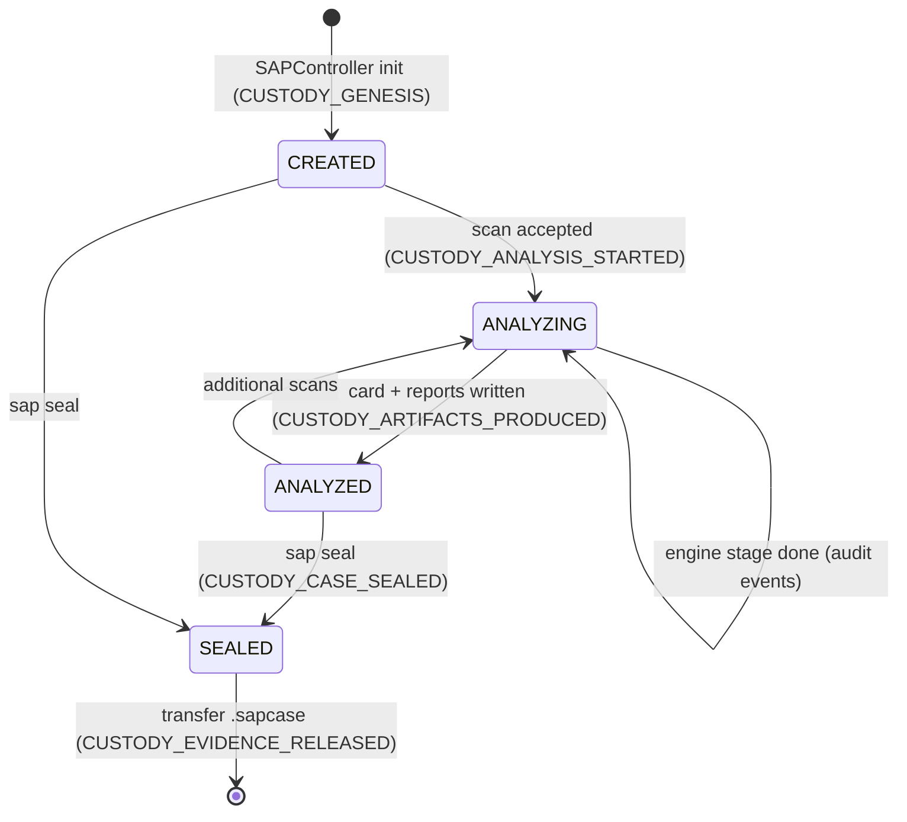
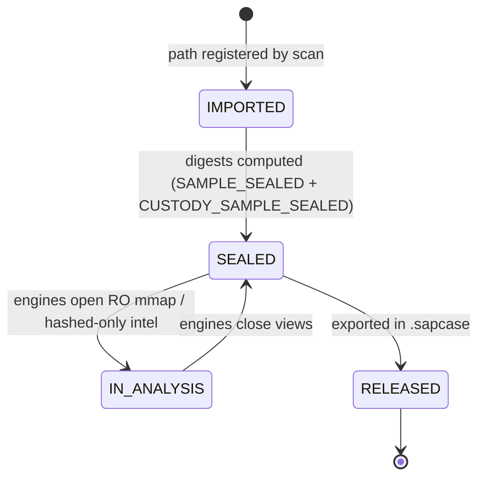
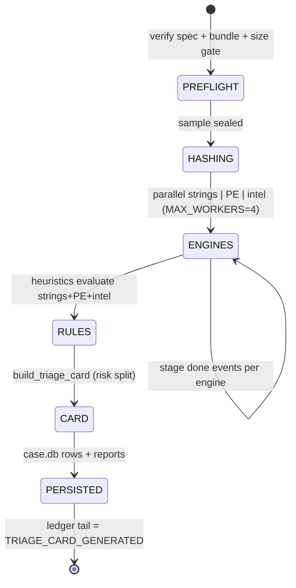
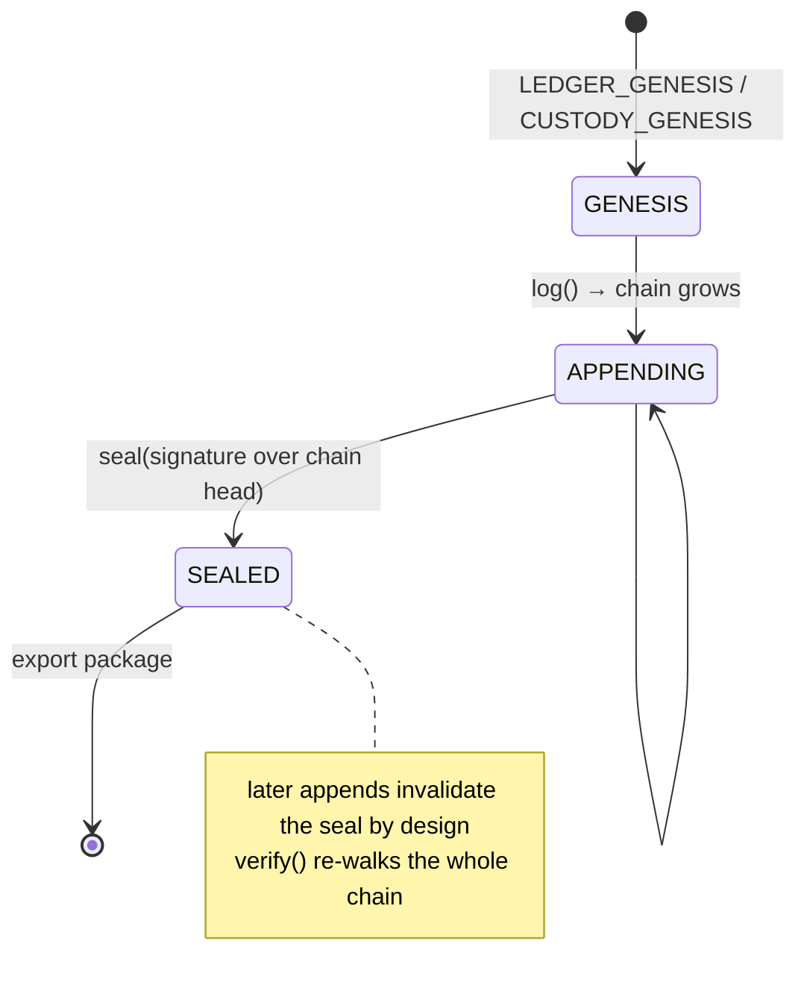

# 🗃️ SAP State Reservation & Management


-9B59B6)


> Companion to **[architecture.md](architecture.md)** (§7 Data Architecture). This document defines **every piece of persistent state** in the SAP pipeline, where it lives, how it is reserved (owned/locked), how it transitions, and how it is recovered.

---

## 📑 Contents

1. [State Domains](#1-state-domains)
2. [Sandbox Layout (canonical state map)](#2-sandbox-layout-canonical-state-map)
3. [State Machines](#3-state-machines)
4. [State Reservation Model](#4-state-reservation-model)
5. [Immutability & WORM Classes](#5-immutability--worm-classes)
6. [Crash & Recovery Matrix](#6-crash--recovery-matrix)
7. [Verification & Reconciliation](#7-verification--reconciliation)

---

## 1. State Domains

| Domain | Medium | Mutable? | Reserved by |
|---|---|---|---|
| **Evidence state** (sample bytes + digests) | External file | ❌ never (RO) | PolicyGuard `open_evidence` read-only contract |
| **Case state** (samples, scans, findings, artifacts, intel hits) | `case.db` (SQLite WAL) | ✅ append | `CaseStore` single writer + lock |
| **Audit state** (action ledger) | `audit/ledger.jsonl` | append-only | hash chain (sealed by Ed25519) |
| **Custody state** (custody chain) | `custody.jsonl` | append-only | hash chain (parallel ledger) |
| **Intel IOC state** (membership) | `intel/bloom.bin` | ✅ append (add only) | BPF header + local fact vault |
| **Intel fact state** (verdict resolution) | `intel/ioc_facts.json` | ✅ append (add only) | exact-hash lookup before risk |
| **Intel cache state** | `intel/cache.jsonl` | ✅ append (TTL 90 d) | `IntelCache` keyed by sha256 |
| **Plan state** (spec snapshots) | `plans/<spec_id>.json` | ❌ immutable once written | spec_id = content hash |
| **Report state** (HTML/JSON/CSV/STIX) | `reports/<scan_id>.*` | ❌ immutable once written | scan_id embedded in ledger |
| **Key state** (signing keys) | `keys/signing_key.pem` | ❌ created once | sandbox-scoped keypair (create-once) |
| **Package state** (`.sapcase`) | outside sandbox root | ❌ sealed at creation | signed manifest, optional GCM |

---

## 2. Sandbox Layout (canonical state map)

```text
<case-dir>/                         ← THE reserved writable root (PolicyGuard)
├── case.db                         sample / scan / finding / artifact rows (WAL)
├── case.db-wal / case.db-shm       WAL sidecars (crash-safe commits)
├── custody.jsonl                   chain-of-custody events (hash-chained)
├── audit/
│   └── ledger.jsonl                audit ledger (hash-chained, sealed)
├── keys/
│   └── signing_key.pem             Ed25519 private key (created once)
├── intel/
│   ├── bloom.bin                   local IOC bloom membership (always-on)
│   ├── ioc_facts.json              verdict fact vault (hash → verdict)
│   └── cache.jsonl                 lookup cache (90-day TTL, JSONL)
├── plans/
│   └── <spec_id>.json              immutable pipeline-spec snapshot
├── reports/
│   ├── <scan_id>.json              machine-readable triage card
│   ├── <scan_id>.csv               findings export
│   ├── <scan_id>.html              self-contained analyst report
│   └── <scan_id>.stix.json         STIX 2.1 IOC bundle
└── <case-dir>.sapcase              signed/encrypted export (next to root)
```

**Rule:** everything outside this root is read-only to the pipeline. The `.sapcase` package is the **only** artifact written outside the sandbox root — and only at explicit seal/export time.

---

## 3. State Machines

### 3.1 Case lifecycle



### 3.2 Sample lifecycle



### 3.3 Scan lifecycle



### 3.4 Ledger states



---

## 4. State Reservation Model

**Reservation = who may mutate which state, enforced how:**

| State | Writer | Reservation mechanism |
|---|---|---|
| `case.db` | one `CaseStore` per sandbox | single-writer `CaseStore` + WAL sidecars for crash-safe commits |
| Audit / custody ledgers | the owning `AuditLedger` | append with `threading.Lock` + `fsync` per event |
| Evidence file | nobody | `O_RDONLY` handle contract at the OS-flag level |
| Bloom / facts / cache | `CaseDir` + `LookupService` | sha256-keyed appends; facts resolved exactly before risk |
| Plans / reports | written once at creation | sandbox `write()` path; ids = spec_id / scan_id (content-addressed) |
| Keys | `CaseDir.signer()` | create-once semantics via `Signer.generate_and_save`; refuses silent regeneration |

**Multi-process note (portable single-user tool):** one case directory is expected to have one SAP instance. SQLite WAL arbitrates `case.db` for concurrent readers, but **ledgers assume a single writer** — reserve case dirs at the operational level (one workstation, one open case).

---

## 5. Immutability & WORM Classes

| Class | States | Guarantee |
|---|---|---|
| **W0 — Absolute** | evidence sample | never opened for write by any code path (flag-level) |
| **W1 — Content-addressed** | plans (spec_id), reports (scan_id) | name derives from content; any edit breaks identity |
| **W2 — Chained** | audit + custody ledgers | append-only; every byte contributes to the chain hash |
| **W3 — Sealed** | ledger at case close | chain head signed; later appends invalidate the seal |
| **W4 — Mutable** | case.db rows, bloom/facts/cache appends | normal app logic, all inside the sandbox root |

---

## 6. Crash & Recovery Matrix

| Failure point | State after crash | Recovery action | Mechanism |
|---|---|---|---|
| During hashing (seal) | no sample row yet (hash first, then ledger append) | re-run `sap scan` | hash-then-append ordering |
| During ledger append | torn last JSONL line | `sap verify` reports corrupt line N; restore or re-seal | chain verification |
| During engine run | scan row without card | re-run same sample + spec (reproducible seed) | spec_id + sample sha256 pin |
| During DB commit | WAL rollback on next open | automatic | SQLite WAL |
| During report write | partial file in `reports/` | delete partial; re-run scan | outputs are derivable from card |
| During package export | partial `.sapcase` | delete; re-export | seal is deterministic from state |
| Sandbox disk full | engine errors captured; ledgers intact | free space; re-run | fail-captured engine results |
| Lost/corrupt `keys/signing_key.pem` | seals unverifiable going forward | restore key from backup; prior seals verifiable against `.pub` | public half retained |
| Bloom file corruption | membership checks wrong | rebuild from `intel/ioc_facts.json` (facts are the source of truth) | facts vault is exact |

**Recovery golden rule:** evidence state (W0) and ledger state (W2/W3) are never regenerated; everything else (plans, reports, bloom) is **derivable** — bloom rebuilds exactly from the fact vault, reports from their scan_id card.

---

## 7. Verification & Reconciliation

```text
SAP-cli.exe verify --case-dir CASE
{
  "audit":   { "ok": true, "events": N, "head": "<chain head>" },
  "custody": { "ok": true, "events": M, "head": "<chain head>" },
  "spec":    { "ok": true, "spec_id": "<spec_id>" },
  "bundle":  { "ok": true, "sha256": "<bundle sha>" },
  "self_integrity": { "ok": true, "mismatches": [] }
}
```

Reconciliation checklist (per case, at minimum: case close + transfer):

1. `SAP-cli.exe verify --case-dir CASE` — audit + custody + spec + bundle + self-integrity all OK.
2. Evidence re-hash — `verify --sample <path>` confirms the file still matches the stored `sha256`.
3. Reports ↔ DB — `reports/<scan_id>.*` rows match `case.db` scan/finding rows.
4. Package manifest — `.sapcase` contains a signed manifest; optionally re-open with the password.

> **State reservation summary:** one reserved writable root per case · four WORM state classes · two independent hash-chained ledgers · deterministic derivability of analysis state from `(sample_sha256, spec_id)` · bloom rebuildable exactly from the IOC fact vault.