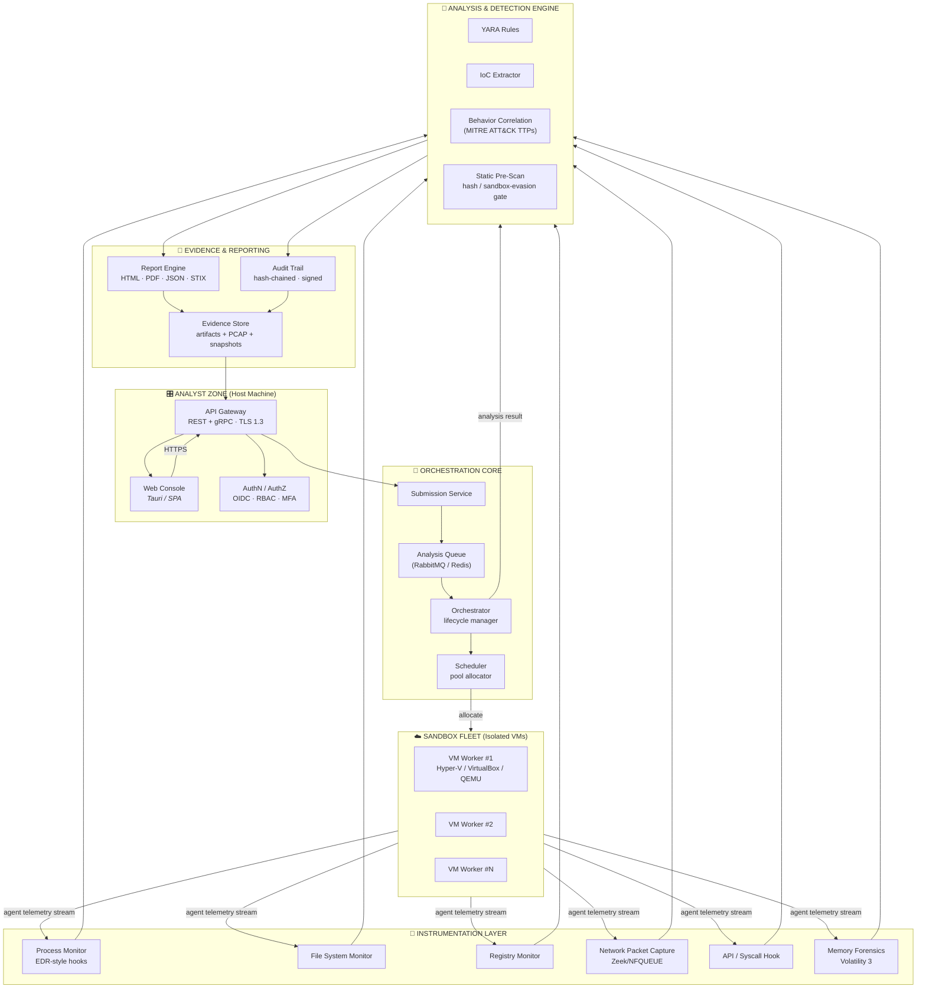
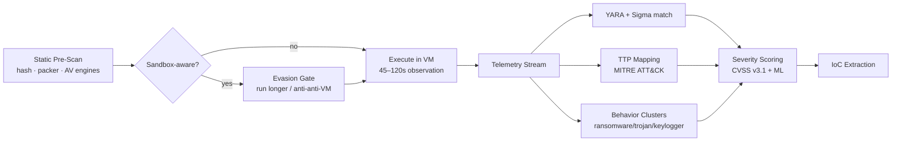
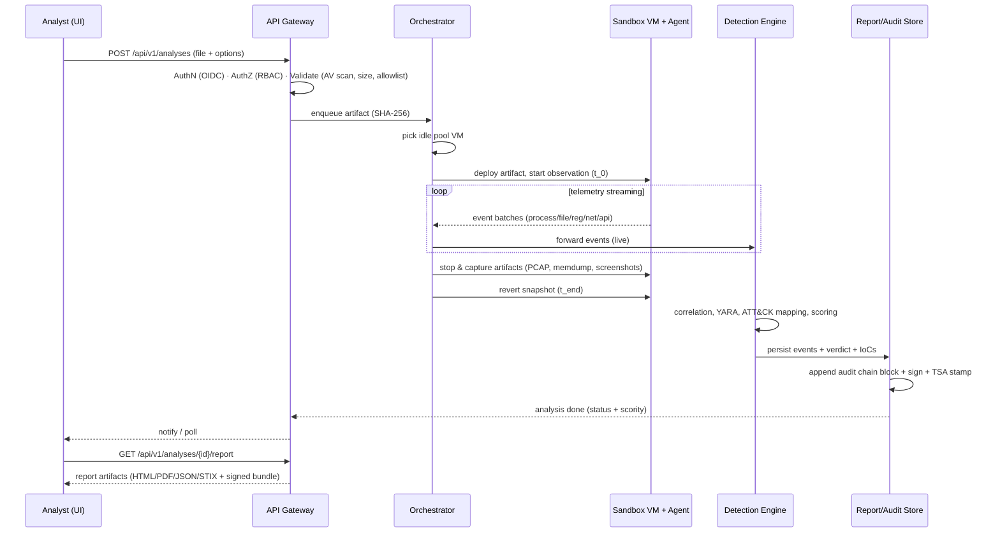
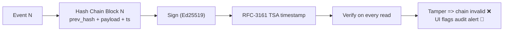
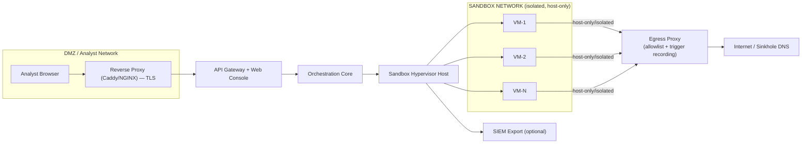
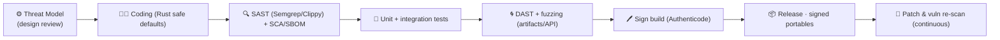
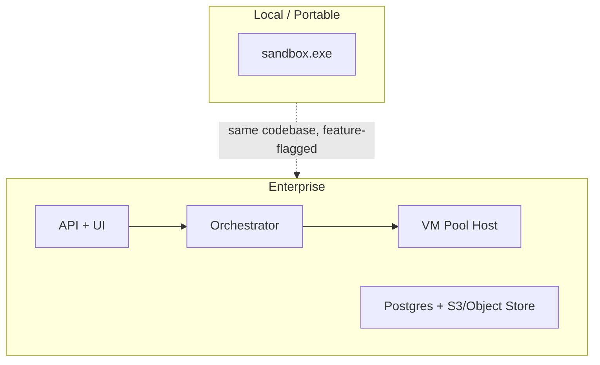

<div align="center">

# 🛡️ Dynamic Analysis Sandbox

### Isolated VM + Behavior Logging — Enterprise Architecture Blueprint

<br/>

> **Version:** 1.0 &nbsp;|&nbsp; **Classification:** Internal / Confidential &nbsp;|&nbsp; **Status:** 🟢 Proposed-for-Build

| Security Posture | Compliance Anchors | Delivery Model |
| :---: | :---: | :---: |
| 🔐 Defense-in-Depth | ✅ ISO/IEC 27001 | 💾 Portable `.exe` |
| 🔍 Zero-Trust Isolation | ✅ NIST SP 800-53 | 🌐 Web UI + REST API |
| 🧪 Behavior-First Analysis | ✅ OWASP Top 10 (2021) | 🧾 Auditable Reports |
| 🕵️ ATT&CK-Centric Detection | ✅ MITRE ATT&CK v14 | 🔎 Cryptographically Signed Audit Trails |

</div>

---

## 📑 Table of Contents

| # | Section |
| :--- | :--- |
| 1 | [Solution Overview](#1--solution-overview) |
| 2 | [Design Goals & Guiding Principles](#2--design-goals--guiding-principles) |
| 3 | [High-Level Architecture](#3--high-level-architecture) |
| 4 | [Component Deep-Dive](#4--component-deep-dive) |
| 5 | [Technology Stack — Portable `.exe` Strategy](#5--technology-stack--portable-exe-strategy) |
| 6 | [Behavior Logging Schema](#6--behavior-logging-schema) |
| 7 | [Data Flow & Sequence Diagrams](#7--data-flow--sequence-diagrams) |
| 8 | [Comprehensive Report & Audit Trail](#8--comprehensive-report--audit-trail) |
| 9 | [Compliance & Control Matrices](#9--compliance--control-matrices) |
| 10 | [Threat Model (STRIDE + MITRE ATT&CK)](#10--threat-model-stride--mitre-attack) |
| 11 | [Cryptography & Key Management](#11--cryptography--key-management) |
| 12 | [Network Architecture](#12--network-architecture) |
| 13 | [Secure Development Lifecycle (SSDLC)](#13--secure-development-lifecycle-ssdlc) |
| 14 | [Scalability, Performance & Resilience](#14--scalability-performance--resilience) |
| 15 | [API Reference Summary](#15--api-reference-summary) |
| 16 | [Deployment & Run Modes](#16--deployment--run-modes) |
| 17 | [Roadmap](#17--roadmap) |
| 18 | [Appendices](#18--appendices) |

---

## 1. 🎯 Solution Overview

The **Dynamic Analysis Sandbox** is a self-contained, portably-distributable security tool that executes untrusted binaries in a **hardened, isolated virtual machine**, captures **granular behavior telemetry**, and produces **comprehensive, tamper-evident, downloadable reports** with a **fully auditable evidence trail**.

<div align="center">

```
 ┌─────────────────────────────────────────────────────────────────────────┐
 │                      DYNAMIC ANALYSIS SANDBOX                           │
 │                                                                         │
 │  ┌──────────┐   ┌──────────────┐   ┌──────────────┐   ┌────────────┐    │
 │  │ Submit   │──▶│ VM Isolation │──▶│ Behavior     │──▶│ Detection  │    │
 │  │ Artifact │   │ Layer        │   │ Capture      │   │ & IoC      │    │
 │  └──────────┘   └──────────────┘   └──────────────┘   └────────────┘    │
 │                                              │                         │
 │  ┌──────────┐   ┌──────────────┐   ┌──────────────┐   ┌────────────┐    │
 │  │ Auditor  │◀──│ Audit Trail  │◀──│ Report       │──▶│ Evidence   │    │
 │  │ Dashboard│   │ (Immutable)  │   │ Engine       │   │ Bundling   │    │
 │  └──────────┘   └──────────────┘   └──────────────┘   └────────────┘    │
 │                                                                         │
 │  ███ Security Fabric: ISO 27001 · NIST 800-53 · OWASP Top 10 ███        │
 └─────────────────────────────────────────────────────────────────────────┘
```

</div>

---

## 2. 🏗️ Design Goals & Guiding Principles

| # | Principle | Description |
| :--- | :--- | :--- |
| 1 | 🧱 **Total Isolation** | Malware execution constrained to ephemeral VMs with no host/network escape surface. |
| 2 | 📡 **Full Telemetry** | Capture *process, file, registry, network, memory, API, and behavior* events with nanosecond context. |
| 3 | 🪪 **Auditability** | Every action is recorded in an **append-only, hash-chained, signed** audit log. |
| 4 | 📦 **Portability** | Single self-contained `.exe` — no runtime install, no admin privileges required for the analyst UI. |
| 5 | 🧾 **Report-Down** | One-click **comprehensive report download** (HTML/PDF/JSON/STIX) with full evidence. |
| 6 | 🛡️ **Secure by Default** | TLS everywhere, least privilege, secrets vaulted, no plaintext credentials, hardened build chain. |
| 7 | 🧪 **Non-Destructive** | Golden-image snapshots restored before/after each run. |
| 8 | ♻️ **Reproducible** | Deterministic VM snapshots + seeded randomness → identical behavior on re-run. |

---

## 3. 🧰 High-Level Architecture



---

## 4. 🔬 Component Deep-Dive

### 4.1 — ☁️ VM Isolation Layer

| Concern | Implementation |
| :--- | :--- |
| Hypervisor Backends | Hyper-V, VirtualBox, QEMU/KVM, sandbox drivers (Windows Sandbox) |
| Snapshot Discipline | **Golden image** → clone-on-write (CoW) → revert 100% after each run |
| CPU / Memory Limits | Hard caps (default 2 vCPU / 4 GB), disabled shared folders |
| Networking | Host-only NAT + per-run MAC/IP randomization; egress via transparent proxy |
| Escape Hardening | No guest additions (or hardened subset), memory hooked, hypervisor introspection |
| Anti-Evasion | Randomized OS fingerprint, delayed clock, no GPU passthrough, no debugger-assistant traces |
| Ransomware Guard | CoW disk + immutable snapshot store = any destruction is instantly revertible |

### 4.2 — 📡 Behavior Capture (Instrumentation Agents)

| Monitor | Events Captured | Source |
| :--- | :--- | :--- |
| Process Monitor | Create/terminate, parent-child trees, integrity, privileges | Sysmon-style driver / ETW |
| File Monitor | Create, write, delete, rename, ADS, ACL changes | Minifilter driver (`FltMgr`) |
| Registry Monitor | SetValue, CreateKey, DeleteKey, Run/AutoStart keys | `RegNotifyChangeKeyValue` |
| Network Monitor | TCP/UDP connections, DNS queries, TLS handshakes, full PCAP | WinPcap / NFQUEUE / Zeek |
| API / Syscall Monitor | Nt*/Win32 API call stacks, Return Addresses (unwinding) | Hooking framework |
| Memory Forensics | Process injection, anomalies, hidden modules | Volatility 3 plugins |

### 4.3 — 🧠 Analysis & Detection Engine



### 4.4 — 🧾 Report & Evidence Engine

- **Formats:** HTML (stylized), PDF (CSP-compliant generator), JSON (machine-readable), STIX 2.1 (threat intel exchange)
- **Contents:** verdict, severity, TTPs, IoCs, behavioral timeline, process tree, network flows, file operations, screenshots, static metadata, hashes
- **Evidence Bundle:** `.zip` ≈ report + PCAP + memory dump references + raw events, **signed with private key**, includes manifest of SHA-256 checksums
- **Auditability:** report carries `Chain-Ref` (link to previous audit block), generating entity, timestamp (RFC-3161 TSA token)

---

## 5. 💾 Technology Stack — Portable `.exe` Strategy

| Tier | Technology | Why |
| :--- | :--- | :--- |
| UI | **Tauri v2** (Rust core + webview) | ~10 MB `.exe`, native perf, secure CSP, no JVM/node runtime |
| Backend | **Rust (Tauri commands) + Python analysis worker** | Rust = safe, fast, memory-safe; Python = ML/rules ecosystem |
| Orchestration | Python (FastAPI) + Celery/RQ | battle-tested queues |
| VM Automation | `hyperv/vboxmanage/qemu` Python APIs | hypervisor-agnostic |
| Telemetry | ETW + minifilter + Zeek + Volatility 3 | native + deep |
| Data Store | SQLite (local) → PostgreSQL (enterprise); Parquet for events | zero-dependency local + scale |
| Report | Jinja2 + WeasyPrint (PDF), STIX2 lib | offline-capable PDF |
| Packaging | **PyInstaller --onefile + Tauri bundle + Inno Setup** | single portable `.exe` |
| Signing | Authenticode (Signtool) + sigstore | warehouse-grade trust |
| Message Bus | Redis / RabbitMQ (embeddable) | queue resiliency |

```
┌─────────────────────────── ONE PORTABLE .EXE ───────────────────────────┐
│  Tauri Webview (UI)  ──▶  Rust Core (IPC · crypto · lifecycle)          │
│                                │                                        │
│                                ▼                                        │
│                    Embedded Python Engine (analysis runtime)            │
│                                │                                        │
│                                ▼                                        │
│         Local SQLite + Parquet Store + Hypervisor Adapters              │
│         (portable VM drivers, bundle resources self-extracted)          │
└──────────────────────────────────────────────────────────────────────────┘
```

**Portability guarantees:**
- ✅ Runs from a **USB stick / network share** — zero install.
- ✅ No admin rights needed for the analyst console; hypervisor sub-system escalates via signed helper driver only.
- ✅ All config/db/resources self-extracted to a temp workspace and cleaned on exit.
- ✅ Offline-first: rule packs and report templates bundled.

---

## 6. 📊 Behavior Logging Schema

```json
{
  "event_id": "9f2c4f7e-11a9-45b0-a9f0-3a22018ac4d1",
  "analysis_id": "an-20260922-00141",
  "timestamp_utc": "2026-09-22T14:07:31.882Z",
  "sequence": 4421,
  "event_type": "file_write",
  "actor": {
    "pid": 1024,
    "ppid": 512,
    "process": "payload.exe",
    "image_path": "C:\\sandbox\\payload.exe",
    "integrity": "Medium",
    "user": "S-1-5-21-..."
  },
  "action": {
    "operation": "WriteFile",
    "target_path": "C:\\Users\\admin\\AppData\\Roaming\\svchost.dat",
    "file_attrs": ["HIDDEN"],
    "bytes_written": 20480,
    "hash_sha256": "a9c1...c39f"
  },
  "network": null,
  "registry": {
    "hive": "HKLM",
    "path": "SOFTWARE\\Microsoft\\Windows\\CurrentVersion\\Run",
    "operation": "SetValue",
    "value_name": "Updater",
    "value_type": "REG_SZ"
  },
  "ttp": "T1547.001",
  "yara_matches": ["crypto_miner_generic_v3"],
  "severity": {"base": 8.2, "cvss_vector": "CVSS:3.1/AV:L/AC:L/PR:N/UI:N/S:C/C:H/I:H/A:N"},
  "audit": {
    "prev_hash": "sha256:e1c0...41",
    "chain_hash": "sha256:9f2c4158...b0",
    "signer": "CN=Sandbox-Audit-Signer",
    "tsa_token": "rfc3161://..."
  }
}
```

---

## 7. 🔄 Data Flow & Sequence Diagrams

### 7.1 — Analysis Lifecycle



### 7.2 — Audit Trail Write Path (WORM-style)



---

## 8. 🧾 Comprehensive Report & Audit Trail

### 8.1 — Report Bundle Structure

```
analysis_20260922_00141/
├── report.html / report.pdf / report.json / report.stix.json
├── evidence/
│   ├── pcap/<session>.pcap          # network capture
│   ├── memory/<hash>.vmem.meta      # memory forensics summary
│   ├── screenshots/*.png            # UI timeline captures
│   ├── droppped/file_hashes.csv     # all unique file hashes
│   └── logs/raw_events.parquet      # full telemetry
├── manifest.txt                     # sha256 of every artifact
└── signature.sig                    # detached Ed25519 signature
```

### 8.2 — Key Audit Capabilities

| Capability | Description |
| :--- | :--- |
| 📥 **Download** | One-click download of single-format or full evidence bundle (`.zip`). |
| 🔎 **Audit view** | Browse the hash-chained log; every entry links to predecessor — tamper is instantly visible. |
| 🕰 **Non-repudiation** | RFC-3161 trusted timestamps + Ed25519 signatures from a dedicated audit signing key. |
| 📋 **Traceability** | `analysis_id → event → TTP → IoC → report` full lineage. |
| 👤 **Attribution** | RBAC: who submitted, who exported, who viewed each report (all audited). |
| 🗄 **Retention** | Configurable retention (default 365 d) with crypto-shred deletions that themselves are audited. |

---

## 9. 🛡️ Compliance & Control Matrices

### 9.1 — ISO/IEC 27001:2022 (Annex A Mapping)

| Control ID | Control | Implementation in Sandbox |
| :--- | :--- | :--- |
| A.5.15 | Access Control | OIDC + RBAC + MFA on console & API |
| A.5.17 | Authentication Information | Vaulted secrets, Argon2id, salted |
| A.6.7 | Threat Intelligence | MITRE ATT&CK + YARA/Sigma packs |
| A.7.10 | Malware Protection | Static pre-scan + VM isolation prevents host compromise |
| A.7.12 | Control of Technical Vulnerabilities | Dependency scanning in CI, SBOM generation |
| A.7.13 | Information Backup | Immutable snapshot store for VM, encrypted DB backups |
| A.7.14 | Redundancy | Pool of VMs; hot standby workers |
| A.7.15 | Logging | Central, tamper-evident audit trail (see §8.2) |
| A.8.10 | Info Removal | Crypto-shred on retention expiry with audited deletion |
| A.8.11 | Data Masking | Report redaction profiles for privacy (PII) |
| A.8.16 | Monitoring | Real-time event correlation + alerting on behavioral IoCs |
| A.8.23 | Web Filtering | Egress proxy allowlists in analysis network |
| A.8.25 | Secure Development Lifecycle | SSDLC pipeline (see §13) |
| A.8.28 | Secure Coding | Rust safe-by-default, SAST/DAST gates, OWASP-aligned |

### 9.2 — NIST SP 800-53r5 (Selected Families)

| Control Family | Controls Implemented |
| :--- | :--- |
| **AC** Access Control | AC-2/3/6/7 RBAC · separation of duties for report export |
| **AT** Awareness & Training | Security scenarios documented for operators |
| **AU** Audit & Accountability | AU-2/3/6/8/9/10/11/12 — event logmgmt, hash-chained, signed, review |
| **CM** Configuration Mgmt | CM-6 hardened baselines (CIS) for host & VM, golden images |
| **CP** Contingency Planning | CP-9 backups, CP-10 recovery via snapshot revert |
| **IA** Identification & Auth | IA-2 MFA, IA-5 PIV/vault, IA-8 federated identities |
| **RA** Risk Assessment | RA-3 STRIDE modeling (see §10), CVSS scoring on findings |
| **SA** System Acquisition | SA-11 developer testing — PBOM, SAST/DAST gates |
| **SC** System & Comms Protection | SC-7 boundary, SC-8 TLS 1.3 ≥, SC-13 crypto suite, SC-28 at-rest encryption |
| **SI** System Integrity | SI-4 monitoring, SI-5 alerts, SI-7 integrity checks, SI-11 error handling |
| **PL** Planning | PL-2 security plan, PL-8 threat modeling |
| **PM** Program Mgmt | PM-9 risk strategy, PM-11 mission-essential functions |

### 9.3 — OWASP Top 10 (2021) — Product-Side Mitigations

| OWASP ID | Weakness | Sandbox Mitigation |
| :--- | :--- | :--- |
| **A01** | Broken Access Control | Server-side RBAC (never trust UI), deny-by-default policies, per-resource object checks |
| **A02** | Cryptographic Failures | TLS 1.3 only, minimum AES-256-GCM / ChaCha20, Argon2id, no legacy ciphers, HSTS |
| **A03** | Injection | Parameterized queries, hardened template engine (no user HTML in PDF), input validation |
| **A04** | Insecure Design | Threat-modeled architecture, rate limiting, queue-depth caps, MFA required |
| **A05** | Security Misconfiguration | CIS-baselined hosts/VMs, immutable golden images, config drift scanning |
| **A06** | Vulnerable Components | SBOM + continuous vuln-scan of deps in CI, pinned & signed dependencies |
| **A07** | Ident & Auth Failures | OIDC + MFA, session invalidation on password change, account lockout |
| **A08** | Software & Data Integrity | Signed artifacts, code-signing pipeline, TSA audit chain, hash manifests |
| **A09** | Logging & Monitoring Failures | Central audit trail, log correlation, real-time alerting (SIEM export) |
| **A10** | SSRF | Outbound egress proxy allowlist, schema-validated URLs, no raw user-URL fetch |

### 9.4 — MITRE ATT&CK Alignment (Detection Focus)

```mermaid
quadrantChart
    title ATT&CK Coverage Targets (Tactics)
    x-axis "Low Visibility" --> "High Visibility"
    y-axis "Low Coverage" --> "High Coverage"
    T1059 Command and Scripting: [0.6, 0.8]
    T1547 Boot/Logon Autostart: [0.65, 0.5]
    T1566 Phishing (delivery): [0.3, 0.4]
    T1055 Process Injection: [0.8, 0.7]
    T1071 Application Layer Protocol: [0.75, 0.75]
    T1573 Encrypted Channel: [0.85, 0.3]
    T1486 Data Encrypted (impact): [0.4, 0.85]
    T1498 Network DoS: [0.5, 0.15]
```

Behavior events map to ATT&CK nodes (`T1547.001` autostart, `T1055` injection, `T1105` ingress tool transfer, `T1005`/`T1036` masquerading, etc.) — surfaced directly in reports.

---

## 10. 🧨 Threat Model (STRIDE + ATT&CK)

| Spoofing | Tampering | Repudiation | Info Disclosure | DoS | Elevation |
| :--- | :--- | :--- | :--- | :--- | :--- |
| Fake API personas → OIDC + client certs | Report/audit tamper → hash chain + signature | Analyzer denies actions → signed audit logs | Report PII leakage → role-scoped redaction | Queue flooding → rate limits + queue caps | VM escape → CoW snapshots + hypervisor introspection + no shared folders |

**Top residual risks & countermeasures:**

| Risk | Likelihood | Impact | Countermeasure |
| :--- | :---: | :---: | :--- |
| Malware escapes guest | Low | Critical | Nested virtualization off, hardened VM, drop privileges, no guest->host channels |
| Audit log forgery | Low | High | Ed25519 signing + TSA + continuous chain verification |
| `exe` supply-chain compromise | Medium | Critical | Reproducible build, signed release, SBOM provenance |
| Resource exhaustion (local) | Medium | Medium | Caps on VM/time/queue, watchdog timeouts |
| Report contain malware artifact | High | Medium | Evidence zipped with `MOTW` (Mark-of-the-Web) + `.msg` warning on extraction |

---

## 11. 🔑 Cryptography & Key Management

| Use | Algorithm | Key Mgmt |
| :--- | :--- | :--- |
| TLS in transit | TLS 1.3 (X25519 + AEAD) | Auto-provisioned CA, short-lived leaf certs |
| At-rest DB/evidence | AES-256-GCM envelope | Key in OS keychain (DPAPI) or HSM for enterprise |
| Audit signing | Ed25519 | Dedicated offline/HSM-held audit key; every signature logs key-id |
| Integrity manifests | SHA-256 + Merkle-style chain | Embedded in every report bundle |
| Timestamping | RFC-3161 | External TSA + local TSA failover |

---

## 12. 🌐 Network Architecture



- ✂️ Sandbox net is **physically/logically separated** — VMs only reach sinkhole DNS + allowlisted egress.
- 🔄 Full **PCAP** on egress for exfil/beacon detection.
- 🛑 Malicious C2 is actively suppressed (DNS sinkhole + egress proxy) to prevent real-world impact.

---

## 13. 🔁 Secure Development Lifecycle (SSDLC)



Quality gates: 0 criticals from SAST, 100% unit pass, SBOM regenerated per release, dependency pinning, signed commits & builds.

---

## 14. 📈 Scalability, Performance & Resilience

- **Horizontal:** Orchestrator pool scales VM workers; queue partitioning per tenant.
- **Vertical:** Parquet/columnar event store + SQLite WAL for local single-node.
- **Resilience:** worker crash → VM auto-revert + analysis re-queue, "Exactly-once" semantics at queue layer (idempotent `analysis_id`), DB backups + point-in-time restore.
- **Performance budget:** 120s observation, event throughput ≥ 50k events/s, report generation < 15 s.

---

## 15. 🔌 API Reference Summary

| Method | Endpoint | Purpose |
| :--- | :--- | :--- |
| `POST` | `/api/v1/analyses` | Submit artifact (multipart) |
| `GET` | `/api/v1/analyses/{id}` | Analysis status & verdict |
| `GET` | `/api/v1/analyses/{id}/events` | Paginated telemetry stream |
| `GET` | `/api/v1/analyses/{id}/report?fmt=html\|pdf\|json\|stix` | Download report |
| `GET` | `/api/v1/analyses/{id}/bundle` | Download signed evidence bundle |
| `GET` | `/api/v1/audit?from=&to=&actor=` | Query audit trail |
| `GET` | `/api/v1/audit/verify/{id}` | Verify chain + signature |
| `GET` | `/api/v1/traces/(resources)` | Resource trace endpoints |
| `GET` | `/healthz`, `/readyz` | Liveness / readiness |

All endpoints: TLS 1.3, OAuth2/OIDC bearer, rate-limited, audit-logged.

---

## 16. 🚀 Deployment & Run Modes

| Mode | Use Case |
| :--- | :--- |
| 🖥 **Local (portable)** | Single `.exe`, virtualbox/hyperv on analyst laptop, local store |
| 🏭 **Server** | Containerized core + VM pools on server hardware, PostgreSQL |
| ☸️ **K8s** | Orchestration + queue scaled, persistent evidence `PV` |



---

## 17. 📅 Roadmap

| Phase | Deliverables | Status |
| :--- | :--- | :--- |
| **P0** | Tauri shell + portable packaging + Hyper-V adapter | 🔜 Planned |
| **P1** | Telemetry agents (ETW/minifilter/Zeek) + local store | 🔜 Planned |
| **P2** | Detection engine (YARA/ATT&CK/IoC), report formats | 🔜 Planned |
| **P3** | Audit chain + TSA + RBAC/OIDC + SIEM export | 🔜 Planned |
| **P4** | ML behavior scoring, multi-host pooling | 🔜 Planned |

---

## 18. 📎 Appendices

### A — Compliance Map Quick-Ref

```
ISO 27001:2022  → A.5.15 · A.6.7 · A.7.10–A.7.15 · A.8.10 · A.8.16 · A.8.25 · A.8.28
NIST 800-53     → AC · AT · AU · CM · CP · IA · RA · SA · SC · SI · PL · PM
OWASP Top 10    → A01 A02 A03 A04 A05 A06 A07 A08 A09 A10 (all mapped)
MITRE ATT&CK    → Execution · Persistence · Defense Evasion · C2 · Exfil · Impact
```

### B — Report Example (Minimal Verdict Card)

> **Verdict:** 🟥 **MALICIOUS** &nbsp;·&nbsp; **Score:** 8.4 / 10 &nbsp;·&nbsp; **Family:** Ransomware (affinity: Conti-like)
> **Key TTPs:** `T1486` · `T1547.001` · `T1055` · `T1105` · `T1071`
> **Top IoCs:** 3 domains, 4 IPs, 12 file-hashes, 1 config-extraction (`config.json` recovered)
> **Chain verified:** ✅ `sha256:9f2c4f…b0` → signed · TSA-stamped · unaltered

### C — Data Retention Policy

| Data Type | Retention | Deletion |
| :--- | :--- | :--- |
| Raw telemetry | 30 days | Crypto-shred, audited |
| Reports + evidence | 365 days | Crypto-shred, audited |
| Audit trail | 7 years (legal hold) | Append-only, never auto-deleted |

---

<div align="center">

### 🔐 Security-First · Portable · Auditable · Built for Detection

*DS&Sandbox Architecture v1.0 — Prepared 2026-09-22*

</div>