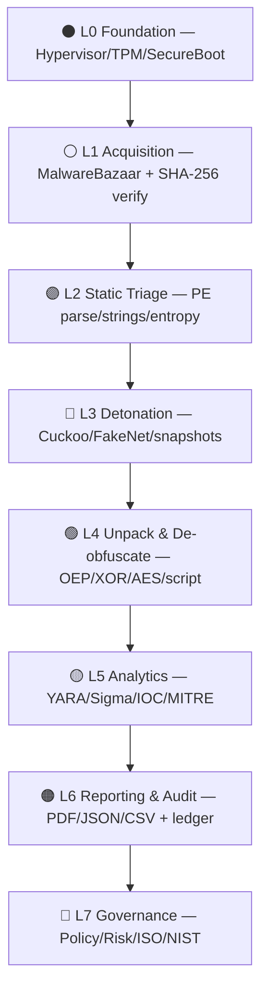
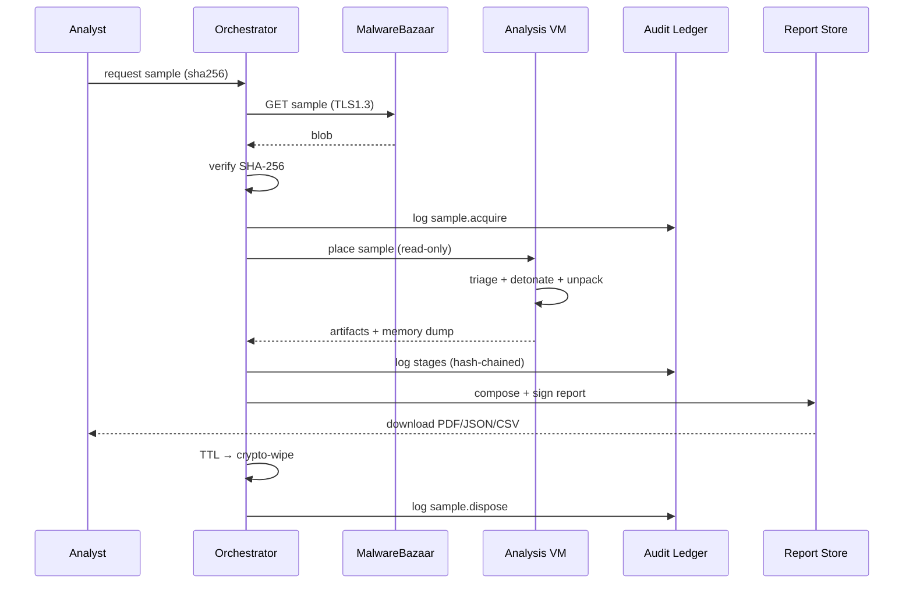

# 🧬 Architecture: Unpacking & De-obfuscation Practice on Public Malware Samples
### 📍 Source: MalwareBazaar (abuse.ch) · 🔬 Target: Isolated Lab VM · 🛡️ Governance: ISO 27001 · NIST CSF 2.0 · NIST SP 800-61 Rev. 2 · OWASP Top 10 (2021)

---

> **Document ID:** `ARC-MAL-LAB-001`
> **Version:** `1.0.0` · **Classification:** 🟠 INTERNAL / TRAINING USE ONLY
> **Owner:** Security Operations & Malware Analysis Lab
> **Review Cycle:** Quarterly (aligned to ISO 27001 Annex A.5.36 / NIST CSF PR.IR-02)

---

## 📑 Table of Contents

1. [Executive Summary](#1-executive-summary)
2. [Scope, Objectives & Legal Boundaries](#2-scope-objectives--legal-boundaries)
3. [Hexagonal Architecture Overview](#3-hexagonal-architecture-overview)
4. [Layered Architecture (Color Map)](#4-layered-architecture-color-map)
5. [Data Flow Diagram — Sample Lifecycle](#5-data-flow-diagram--sample-lifecycle)
6. [Lab VM Hardening Architecture](#6-lab-vm-hardening-architecture)
7. [De-obfuscation & Unpacking Engine](#7-de-obfuscation--unpacking-engine)
8. [Security Framework Control Matrix](#8-security-framework-control-matrix)
9. [OWASP Top 10 Mitigations in the Lab Tooling](#9-owasp-top-10-mitigations-in-the-lab-tooling)
10. [Audit Architecture & Functions](#10-audit-architecture--functions)
11. [Comprehensive Report Architecture](#11-comprehensive-report-architecture)
12. [Report Download Formats & Schemas](#12-report-download-formats--schemas)
13. [RBAC & Access Control Architecture](#13-rbac--access-control-architecture)
14. [Threat Model for the Analysis Platform](#14-threat-model-for-the-analysis-platform)
15. [Technology Stack](#15-technology-stack)
16. [Deployment Topology](#16-deployment-topology)
17. [Business Continuity & Evidence Preservation](#17-business-continuity--evidence-preservation)
18. [Appendices — Mermaid Sources & Glossary](#appendices)

---

## 1. Executive Summary

This architecture defines a **secure, isolated, fully auditable malware analysis laboratory** used exclusively for *educational unpacking and de-obfuscation practice* on publicly shared samples obtained from **MalwareBazaar**. Every stage — acquisition, verification, detonation, unpacking, de-obfuscation, reporting, and disposal — is bound to recognized control frameworks so that the lab itself does **not** become a security incident.

### 🎯 Design Pillars

| # | Pillar | Emoji | Framework Anchor |
|---|--------|-------|------------------|
| 1 | **Isolation First** — No route to production/corporate networks | 🧱 | ISO 27001 A.8.22 · NIST PR.IR-01 |
| 2 | **Provenance & Integrity** — SHA-256 chain of custody from download to disposal | 🔏 | ISO 27001 A.5.14 · NIST PR.DS-01 |
| 3 | **Least Privilege** — Analyst ≠ Administrator ≠ Report Publisher | 🎭 | ISO 27001 A.5.15 · OWASP A01 |
| 4 | **Full Auditability** — Immutable, append-only audit ledger | 📜 | ISO 27001 A.8.15 · NIST DE.CM-01 |
| 5 | **Safe Disposal** — Cryptographic wipe of sample stores after TTL | 🧹 | ISO 27001 A.7.14 · NIST PR.DS-09 |

---

## 2. Scope, Objectives & Legal Boundaries

```
┌──────────────────────────────────────────────────────────────────────────┐
│ ✅ IN SCOPE                              │ ❌ OUT OF SCOPE              │
├──────────────────────────────────────────┼───────────────────────────────┤
│ • Samples from MalwareBazaar (public)    │ • Live C2 communication       │
│ • Static + dynamic unpacking practice    │ • Targeting real organizations│
│ • YARA / Sigma rule authoring            │ • Weaponization for attacks   │
│ • Report generation & audit trail        │ • Distribution of unpacked   │
│ • Lab VM hardening verification          │   payloads outside the lab    │
└──────────────────────────────────────────┴───────────────────────────────┘
```

**Legal / Ethical Guardrails**
- 🔹 Samples are *publicly published* research artifacts (MalwareBazaar ToS compliance).
- 🔹 Analysis occurs **only** inside a hypervisor-isolated VM with host-only/NAT-disabled networking (or simulated-net via INetSim/FakeNet-NG).
- 🔹 No execution on endpoints outside the lab boundary — enforced by EDR exclusion policy + network ACL.

---

## 3. 🏛️ Hexagonal Architecture Overview

> *Ports & Adapters* — core analysis domain at the center; infrastructure (VM, cloud, report store) plugs in via guarded ports.

```
                          🌐  EXTERNAL ZONE  🌐
        ┌─────────────┐                      ┌──────────────────┐
        │ MalwareBazaar│                      │  Report Portal    │
        │  (abuse.ch)  │                      │  (Analyst Browser)│
        └──────┬───────┘                      └────────▲─────────┘
               │ TLS 1.3 + API key                     │ HTTPS + mTLS
               ▼                                       │
  ┌────────────────────────┐              ┌────────────┴────────────┐
  │  📥 INGESTION PORT     │              │   📤 REPORTING PORT     │
  │  - REST fetch adapter  │              │   - PDF/JSON/CSV adapter│
  │  - Hash allow-list     │              │   - Signed download     │
  │  - ASN/domain block    │              │   - Watermarked output  │
  └───────────┬────────────┘              └────────────▲────────────┘
              │                                        │
              │        ┌──────────────────────────┐    │
              │        │   🧠 CORE DOMAIN          │    │
              ├───────►│                          │────┘
              │        │  ┌────────────────────┐  │
              │        │  │ Sample Registry     │  │   🔐 SECURITY KERNEL
              │        │  │ (provenance, TTL)   │  │   (cross-cutting)
              │        │  ├────────────────────┤  │   ┌──────────────────┐
              │        │  │ Unpack Engine       │  │   │ AuthN / AuthZ    │
              │        │  │ De-obfuscation      │  │   │ Audit Ledger     │
              │        │  │ Triage Classifier   │  │   │ Integrity Hashing│
              │        │  ├────────────────────┤  │   │ Key Management   │
              │        │  │ Report Composer     │  │   │ Rate Limiting    │
              │        │  └────────────────────┘  │   └──────────────────┘
              │        └────────────▲─────────────┘              │
              │                     │                            │
  ┌───────────┴────────────┐  ┌─────┴──────────────────┐  ┌──────┴──────────┐
  │ 🖥️ EXECUTION PORT     │  │ 🔏 STORAGE PORT        │  │ 📜 AUDIT PORT   │
  │ - Hypervisor adapter   │  │ - Encrypted sample vault│ │ - Append-only DB│
  │ - Sandbox (Cuckoo)     │  │ - Artifact blob store   │ │ - SIEM forwarder│
  │ - Snapshot revert      │  │ - WORM archive          │ │ - Hash-chained  │
  └────────────────────────┘  └────────────────────────┘  └─────────────────┘

 Legend:  ──► guarded data path     ▲── reverse/return path
```

**Why hexagonal?** Swapping Cuckoo → ANY.RUN local, SQLite → Postgres, or PDF → HTML reports requires **zero changes** to the unpacking core — critical for ISO 27001 *A.8.32 change management*.

---

## 4. 🎨 Layered Architecture (Color Map)

```
╔══════════════════════════════════════════════════════════════════════════╗
║  🔴  L7  GOVERNANCE LAYER        Policy · Risk Register · KPI/KRI      ║
╠══════════════════════════════════════════════════════════════════════════╣
║  🟠  L6  REPORTING & AUDIT       PDF/JSON/CSV · SIEM · Tamper-proof log║
╠══════════════════════════════════════════════════════════════════════════╣
║  🟡  L5  ANALYTICS LAYER         YARA · Sigma · IOC extraction · TTPs  ║
╠══════════════════════════════════════════════════════════════════════════╣
║  🟢  L4  UNPACK / DE-OBFUSCATION PE · Shellcode · XOR/AES · VMProtect  ║
╠══════════════════════════════════════════════════════════════════════════╣
│  🔵  L3  DETONATION / DYNAMIC     Cuckoo · API trace · memory dump      │
╠══════════════════════════════════════════════════════════════════════════╣
│  🟣  L2  STATIC TRIAGE            magic bytes · PE parse · strings      │
╠══════════════════════════════════════════════════════════════════════════╣
│  ⚪  L1  ACQUISITION & VERIFY     MalwareBazaar · TLS · SHA-256 · signed│
╠══════════════════════════════════════════════════════════════════════════╣
│  ⚫  L0  FOUNDATION / TRUST       Hypervisor · TPM · secure boot · HSM  │
╚══════════════════════════════════════════════════════════════════════════╝

   ▲ DATA MOVES UP  (observe → understand)      DATA MOVES DOWN (act → contain) ▼
   ▼ CONTROLS WRAP EVERY LAYER (Defence in Depth — ISO 27001 A.8.00 general)
```

| Layer | Color | Primary Controls | NIST CSF 2.0 |
|-------|-------|------------------|--------------|
| L7 Governance | 🔴 | Policy-as-code, risk acceptance workflow | GV.RR-02, GV.PO-01 |
| L6 Reporting/Audit | 🟠 | Hash-chained logs, signed reports | DE.AE-03, DE.CM-09 |
| L5 Analytics | 🟡 | Rule versioning, false-positive review | DE.DP-03 |
| L4 Unpack/De-obf | 🟢 | Resource limits, kill-switch, no-egress | PR.IR-03 |
| L3 Detonation | 🔵 | Air-gap, snapshot revert, FakeNet | DE.CM-01 |
| L2 Static Triage | 🟣 | Read-only mounts, parser sandboxing | PR.DS-01 |
| L1 Acquisition | ⚪ | API allow-list, hash verification | ID.RA-05 |
| L0 Foundation | ⚫ | TPM measurement, hypervisor patching | PR.DS-10 |

---

## 5. 🔄 Data Flow Diagram — Sample Lifecycle

```
   ⬇ DOWNLOAD              ⬇ VERIFY               ⬇ TRIAGE
┌────────────┐  SHA-256   ┌────────────┐  PASS   ┌────────────┐
│ MalwareBazaar├──────────►│ Integrity  ├────────►│ Static     │
│ API / .zip  │           │ Gate 🔏    │         │ Triage 🟣  │
└────────────┘            └─────┬──────┘         └─────┬──────┘
                          FAIL │ ▼                        │
                        ┌──────┴───┐  family/type    ┌─────▼──────┐
                        │ Quarantine│◄───────────────┤ Classifier │
                        │ + Alert   │                └─────┬──────┘
                        └──────────┘                      │
                                                          ▼
   REVERT SNAPSHOT ◄──┐                    ┌──────────────────────────┐
   after run          │                    │  Detonation in Lab VM 🔵 │
                      │                    │  • FakeNet-NG sink        │
                      │                    │  • API/syscall capture    │
                      │                    │  • Memory dump @ stage X  │
                      └────────────────────┤  • 5-min hard timeout     │
                                           └────────────┬─────────────┘
                                                        ▼
                                           ┌──────────────────────────┐
                                           │ Unpack / De-obfuscate 🟢 │
                                           │ • Dump OEP               │
                                           │ • DeXOR / de-AES / fix   │
                                           │ • Unpack UPX/NSIS/Inno   │
                                           │ • de4dot / deobfuscator  │
                                           └────────────┬─────────────┘
                                                        ▼
                                           ┌──────────────────────────┐
                                           │ IOC Extraction & YARA 🟡 │
                                           └────────────┬─────────────┘
                                                        ▼
                                    ┌───────────────────────────────────┐
                                    │ Report Composer + Audit Write 🟠 │
                                    │ • PDF / JSON / CSV / STIX        │
                                    │ • Sign with lab code-signing cert│
                                    └────────────┬──────────────────────┘
                                                 ▼
                                    ┌───────────────────────────────────┐
                                    │ TTL Expiry → Crypto-Wipe 🧹      │
                                    │ (ISO 27001 A.7.14)               │
                                    └───────────────────────────────────┘
```

---

## 6. 🖥️ Lab VM Hardening Architecture

```
                     🌍 CORPORATE / INTERNET
                              │
                    ┌─────────▼─────────┐
                    │   🔥 Firewall      │  Default-deny. Only 443 outbound
                    │   ACL: ALLOW-LIST  │  to MalwareBazaar API CIDR + update repo
                    └─────────┬─────────┘
                              │ VLAN 999 (QUARANTINE)
                    ┌─────────▼─────────────────────────────────────────┐
                    │            🖥️  HYPERVISOR HOST (bare-metal)      │
                    │  ┌─────────────────────────────────────────────┐ │
                    │  │ 🔵 ANALYSIS VM  (Win10/11 RE profile)      │ │
                    │  │   • No shared folders · Drag-drop OFF      │ │
                    │  │   • Host-only / FakeNet-NG                 │ │
                    │  │   • Full-disk BitLocker (recovery→HSM)     │ │
                    │  │   • Defender ASR rules ON (block child     │ │
                    │  │     processes, credential theft)           │ │
                    │  │   • Tools: x64dbg, IDA/Ghidra, Process    │ │
                    │  │     Monitor, ProcDump, Detect It Easy      │ │
                    │  ├─────────────────────────────────────────────┤ │
                    │  │ 🟢 HOST MONITOR VM (Linux)                 │ │
                    │  │   • Cuckoo/Sysmon forwarder listener       │ │
                    │  │   • Receives PCAP + EVTX over host-only    │ │
                    │  ├─────────────────────────────────────────────┤ │
                    │  │ ⚪ ORCHESTRATOR VM (Linux, minimal)        │ │
                    │  │   • Sample vault (LUKS2)                   │ │
                    │  │   • Report store + audit ledger            │ │
                    │  │   • Only egress: MalwareBazaar API         │ │
                    │  └─────────────────────────────────────────────┘ │
                    │  Snapshot policy: revert after EVERY detonation  │
                    └─────────────────────────────────────────────────┘
```

**Hardening Checklist (mapped to controls)**

| # | Hardening Item | ISO 27001 | NIST CSF |
|---|----------------|-----------|----------|
| 1 | No shared folders / clipboard between host & VM | A.8.24 | PR.DS-01 |
| 2 | FakeNet-NG / INetSim simulated internet | A.8.22 | PR.IR-01 |
| 3 | Snapshot revert per sample | A.8.9 (media handling) | PR.PS-04 |
| 4 | Hypervisor & guest patch cadence ≤ 14 days | A.8.8 | PR.IR-02 |
| 5 | BIOS/UEFI + Secure Boot + TPM measured boot | A.8.7 | PR.DS-10 |
| 6 | Admin password in offline password vault (session-scoped) | A.5.17 | PR.AA-05 |
| 7 | EDR in "training mode" with lab exclusions documented | A.8.16 | DE.CM-01 |

---

## 7. 🔬 De-obfuscation & Unpacking Engine

```
                 ┌───────────────────────────────┐
   sample.bin ──►│  1. FORMAT DETECT              │
                 │  PE/ELF/Mach-O/JS/VBA/PS1/APK  │
                 └──────────────┬────────────────┘
                                │
          ┌─────────────────────┼─────────────────────┐
          ▼                     ▼                     ▼
   ┌──────────────┐    ┌────────────────┐    ┌────────────────┐
   │ 2A. PACKER   │    │ 2B. SCRIPT     │    │ 2C. BINARY     │
   │   UNPACK     │    │   DE-OBFUSCATE │    │   DECRYPT      │
   ├──────────────┤    ├────────────────┤    ├────────────────┤
   │ • UPX/UPX-N  │    │ • JS: Hook eval│    │ • XOR bruteforce│
   │ • PECompact  │    │   & Function   │    │ • AES w/ key   │
   │ • Themida/   │    │   Constructor  │    │   from API call │
   │   VMProtect  │    │ • VBA: oletools │    │ • RC4 loop ID  │
   │ • NSIS/Inno  │    │   + Decoder    │    │   detection     │
   │ • AutoIt     │    │ • PowerShell   │    │ • Custom key    │
   │ • .NET (dnSpy│    │   deObfuscatOS │    │   schedule      │
   │   de4dot)    │    │ • Base64 chains│    │                 │
   └──────┬───────┘    └───────┬────────┘    └────────┬────────┘
          │                    │                      │
          └────────────────────┼──────────────────────┘
                               ▼
                 ┌───────────────────────────────┐
                 │  3. OEP LOCATION & DUMP        │
                 │  hardware BP / memory snapshot │
                 └──────────────┬────────────────┘
                                ▼
                 ┌───────────────────────────────┐
                 │  4. REBUILD (Scylla / dumper)  │
                 │  IAT rescan + import fix       │
                 └──────────────┬────────────────┘
                                ▼
                 ┌───────────────────────────────┐
                 │  5. VALIDATE: run dumped bin,  │
                 │     YARA match, entropy drop   │
                 └──────────────┬────────────────┘
                                ▼
                 ┌───────────────────────────────┐
                 │  6. EMIT: unpacked.bin +       │
                 │     diff-report + audit event  │
                 └───────────────────────────────┘
```

**Safety rails inside the engine (OWASP-aligned)**
- ⏱️ Per-stage CPU/wall-clock timeout (prevents hash-DoS / zip-bomb loops).
- 📦 Max decompressed size ratio guard (A04:03 — resource exhaustion).
- 🧪 All unpacker plugins run as **separate low-privilege processes** with seccomp/AppContainer (A05:03).
- 🔌 No plugin network capability (A10: SSRF prevention by design).

---

## 8. 📜 Security Framework Control Matrix

### 8.1 ISO/IEC 27001:2022 Annex A Controls Applied

| Control ID | Control Name | Implementation in this Architecture |
|------------|--------------|--------------------------------------|
| A.5.1 | Policies for information security | Lab policy pack stored in Policy-as-Code repo, versioned with architecture |
| A.5.5 | Responsibilities | RACI matrix (§13) — Analyst, Lab Owner, Auditor, Approver |
| A.5.7 | Threat intelligence | MalwareBazaar feeds + internal YARA rule sharing |
| A.5.9 | Inventory of information | Sample Registry: every hash, TTL, classification |
| A.5.14 | Information transfer | TLS 1.3 only; encrypted vault at rest (LUKS2/AES-256-GCM) |
| A.5.15 | Access control | RBAC + MFA (§13), JIT elevation for detonation admin |
| A.5.16 | Identity management | Unique per-analyst accounts, no shared logins |
| A.5.17 | Authentication information | Secrets in vault; session-scoped admin passwords |
| A.5.23 | Information security for cloud | N/A or: orchestrator on private cloud with tenant isolation |
| A.5.36 | Compliance with policies | Quarterly architecture & control review |
| A.5.37 | Documented operating procedures | Runbooks: acquire → analyze → report → dispose |
| A.6.1 | Screening | Background check for analysts (personnel security) |
| A.6.8 | Information security event reporting | One-click "lab escape suspicion" alert (§10.4) |
| A.7.4 | Physical security of rooms | Lab hosts in locked rack / restricted floor |
| A.7.10 | Storage media | Encrypted disks; crypto-erase on decommission |
| A.7.14 | Physical media deposition | Sample TTL wipe job (default 30 days) |
| A.8.1 | User endpoint devices | Analysis only on managed lab workstations |
| A.8.2 | Privileged access rights | PAM vault; just-in-time, dual-control for break-glass |
| A.8.3 | Information access restriction | Report downloads require entitlement + watermarking |
| A.8.5 | Secure authentication | Phishing-resistant MFA (FIDO2) |
| A.8.7 | Protection against malware | Host EDR with documented lab policy |
| A.8.8 | Management of technical vulnerabilities | Hypervisor/guest CVE SLA (Critical ≤ 7 days) |
| A.8.9 | Configuration management | Golden VM images; drift detection baseline |
| A.8.10 | Information deletion | Automated crypto-wipe at TTL |
| A.8.11 | Data masking | Reports mask analyst PII; show role only |
| A.8.12 | Data leakage prevention | EDR/DLP blocks USB & shared-folder on lab hosts |
| A.8.15 | Logging | Append-only, hash-chained audit ledger (§10) |
| A.8.16 | Monitoring activities | SIEM correlation rules for anomalous lab activity |
| A.8.22 | Segmentation of networks | Isolated VLAN / host-only; no route to corp LAN |
| A.8.24 | Use of cryptography | AES-256-GCM at rest; TLS 1.3; Ed25519 report signing |
| A.8.25 | Secure development lifecycle | Lab tooling peer review + SAST/DAST (OWASP CI) |
| A.8.26 | Application security requirements | Threat model per tool (§14) |
| A.8.28 | Secure coding | Input validation on all sample metadata ingestion |
| A.8.31 | Separation of development, test, prod | Dev → Staging → Lab prod environments |
| A.8.32 | Change management | Architecture changes require CAB-style approval |
| A.8.34 | Protection of information systems during audit | Auditors get read-only, redacted access |

### 8.2 NIST Cybersecurity Framework 2.0 Mapping

```
   ┌─────────┐   ┌─────────┐   ┌─────────┐   ┌─────────┐   ┌─────────┐   ┌─────────┐
   │GOVERN 🏛️│──►│IDENTIFY 🔎│──►│PROTECT 🛡️│──►│DETECT 👁️│──►│RESPOND 🚨│──►│RECOVER 🔄│
   │ GV.RR   │   │ ID.AM   │   │ PR.AA   │   │ DE.CM   │   │ RS.MA   │   │ RC.RP   │
   │ GV.PO   │   │ ID.RA   │   │ PR.AT   │   │ DE.AE   │   │ RS.AN   │   │ RC.CO   │
   │ GV.OV   │   │ ID.IM   │   │ PR.DS   │   │ DE.DP   │   │ RS.CO   │   │ RC.MI   │
   │ GV.SC   │   │         │   │ PR.PS   │   │         │   │ RS.MI   │   │         │
   │         │   │         │   │ PR.IR   │   │         │   │         │   │         │
   └─────────┘   └─────────┘   └─────────┘   └─────────┘   └─────────┘   └─────────┘
```

| CSF Function | Concrete Lab Implementation |
|--------------|-----------------------------|
| **GV** (Govern) | Risk register for lab escape; policy-as-code; quarterly review; supply-chain vetting of abuse.ch tooling |
| **ID** (Identify) | Sample inventory (hashes, families); asset inventory of VMs; risk scoring per sample (entropy, packer, family) |
| **PR** (Protect) | Isolation, RBAC/MFA, encryption, least privilege, golden images, analyst training (PR.AT-02) |
| **DE** (Detect) | Sysmon + EDR on guests; hypervisor network IDS; audit-ledger anomaly rules; beacon detection (no egress should = zero external flows) |
| **RS** (Respond) | Playbook: *"Suspected lab escape"* → isolate hypervisor NIC → notify CSIRT (A.6.8) within 15 min |
| **RC** (Recover) | Restore from golden image; re-verify vault integrity hashes; lessons-learned to risk register |

### 8.3 NIST SP 800-61 Rev.2 (IR) & SP 800-88 (Media Sanitization)

- **Preparation:** IR plan includes malware-lab specific scenario; contact tree posted in lab.
- **Detection & Analysis:** Audit ledger is primary evidence source; reports attach IOCs for enterprise hunting.
- **Containment:** Network kill-switch (host-only adapter disable) + VM power-off.
- **Post-Incident:** Sanitization per **SP 800-88 Purge** (crypto-erase) when VM/volume is retired.

---

## 9. 🕸️ OWASP Top 10 (2021) — Lab Platform Mitigations

> Applies to the *lab management/reporting web application* and the *unpacker toolchain*.

| OWASP ID | Risk | Mitigation in This Architecture |
|----------|------|----------------------------------|
| **A01:2021** Broken Access Control | Analyst downloading peer reports / admin functions | RBAC (§13), deny-by-default policy, object-level authz checks on every report ID, JWT with short TTL + rotation |
| **A02:2021** Cryptographic Failures | Plaintext sample/report exposure | TLS 1.3 only; AES-256-GCM vault; Ed25519 signatures; no secrets in URLs or logs; HSTS enforced |
| **A03:2021** Injection | Malicious sample metadata (filename `../../`, SVG/HTML in notes) feeding report portal | Parameterized queries; strict schema validation; CSP; sandboxed renderers; never `eval` sample strings in portal |
| **A04:2021** Insecure Design | Unlimited detonation → lab DoS | Rate limits per user/family; resource quotas; kill-switch; threat-model review per §14 |
| **A05:2021** Security Misconfiguration | Default creds on Cuckoo web, open SMB | Hardened golden image; CIS benchmark; config drift scan; admin interface bound to host-only |
| **A06:2021** Vulnerable & Outdated Components | Old unpacker with known RCE | SCA (Dependabot/OWASP Dependency-Check) in tooling pipeline; patch SLA (A.8.8) |
| **A07:2021** Identification & Auth Failures | Shared lab account | Unique accounts, FIDO2 MFA, session timeout 15 min idle, lockout with audit |
| **A08:2021** Software & Data Integrity Failures | Tampered report or swapped sample | Hash-chain audit log; signed reports; CI/CD code signing; verify sample SHA-256 before & after every stage |
| **A09:2021** Security Logging & Monitoring Failures | Silent lab misuse | All actions → append-only ledger → SIEM; alert on: off-hours access, bulk download, egress attempt |
| **A10:2021** SSRF | Analyst-entered URL fetched by platform | No arbitrary URL fetch; only allow-listed MalwareBazaar endpoints; egress proxy deny-list |

---

## 10. 📜 Audit Architecture & Functions

### 10.1 Audit Architecture

```
   ┌──────────────┐   ┌──────────────┐   ┌──────────────┐   ┌──────────────┐
   │ Web Portal   │   │ Orchestrator │   │ Analysis VM  │   │ Hypervisor   │
   │ audit hook   │   │ audit hook   │   │ Sysmon/EDR   │   │ vSwitch logs │
   └──────┬───────┘   └──────┬───────┘   └──────┬───────┘   └──────┬───────┘
          │ structured event │                  │ EVTX→JSON         │
          └────────────┬─────┴──────────────────┴───────────────────┘
                       ▼
            ┌─────────────────────┐
            │  🔗 EVENT NORMALIZER │   (schema: audit/v1)
            └──────────┬──────────┘
                       ▼
      ┌────────────────────────────────────────────┐
      │   📒 APPEND-ONLY AUDIT LEDGER (WORM)        │
      │  ┌──────────────────────────────────────┐   │
      │  │ event_n.hash = SHA256(prev‖event_n)  │   │   ← hash chain
      │  └──────────────────────────────────────┘   │
      │  Daily Merkle root → notarized/anchor       │   ← tamper evidence
      └───────┬──────────────────────┬──────────────┘
              ▼                      ▼
      ┌───────────────┐      ┌──────────────────┐
      │ SIEM forwarder│      │ AUDIT REPORT      │
      │ (real-time)   │      │ GENERATOR (§12)   │
      └───────┬───────┘      └────────┬─────────┘
              ▼                       ▼
      🚨 Alerting rules        📥 Downloadable package
```

### 10.2 Audit Event Schema (canonical)

```json
{
  "event_id": "uuid-v7",
  "ts": "2026-09-22T14:03:11.482Z",
  "actor": { "id": "anl-042", "role": "analyst", "auth_method": "fido2" },
  "action": "sample.unpack.execute",
  "object": { "type": "sample", "sha256": "…", "family": "agent_tesla" },
  "stage": "L4_unpack",
  "prev_hash": "…",
  "this_hash": "…",
  "outcome": "success",
  "src_ip": "10.99.0.14",
  "session_id": "sess-…",
  "details": { "packer": "upx", "oep_rva": "0x1a40", "duration_ms": 812 },
  "retention_class": "evidence-90d"
}
```

### 10.3 Core Audit Functions

| # | Function | Description | Framework Anchor |
|---|----------|-------------|------------------|
| AF-1 | `log_event()` | Append-only write; never update/delete API exposed | ISO A.8.15 |
| AF-2 | `hash_chain_verify()` | Recompute chain from genesis; report first break | ISO A.8.16 · NIST DE.CM-09 |
| AF-3 | `chain_of_custody(sample_sha256)` | Timeline: download→triage→detonate→unpack→report→wipe, with actor & hashes | ISO A.5.14 · evidence handling |
| AF-4 | `who_accessed(report_id)` | Object-level access log for downloads/views | OWASP A01 · A09 |
| AF-5 | `anomaly_detect()` | Rules: bulk export, off-hours, repeated detonation of same hash, egress attempt | NIST DE.AE-02/03 |
| AF-6 | `compliance_snapshot(frame)` | Produce control-evidence bundle for ISO/NIST/OWASP attestation | ISO A.5.36 |
| AF-7 | `report_integrity_verify(file)` | Verify Ed25519 signature + embedded content hash | ISO A.8.24 · OWASP A08 |
| AF-8 | `retention_enforce()` | TTL wipe + audit the wipe itself | ISO A.7.14 · NIST PR.DS-09 |
| AF-9 | `break_glass_review()` | All elevation sessions auto-flagged for dual review | ISO A.8.2 |
| AF-10 | `export_to_siem()` | Streaming + batch (syslog/CEF/JSON) | NIST DE.CM-01 |
| AF-11 | `discrepancy_report()` | Compare golden-image baseline vs runtime config drift | ISO A.8.9 |
| AF-12 | `legal_hold(sha256)` | Suspend TTL wipe when under investigation | ISO A.5.33–34 |

### 10.4 Alert Catalogue (sample)

| Alert ID | Trigger | Severity | Response SLA |
|----------|---------|----------|--------------|
| AUD-ALRT-01 | Hash chain verification failure | 🔴 Critical | 15 min — isolate ledger |
| AUD-ALRT-02 | Egress attempt from analysis VLAN | 🔴 Critical | 15 min — kill-switch |
| AUD-ALRT-03 | Bulk report download (>20 in 10 min) | 🟠 High | 1 h — suspend session |
| AUD-ALRT-04 | Access outside shift window | 🟡 Medium | 4 h — verify with owner |
| AUD-ALRT-05 | Sample executed w/o prior hash verification | 🟠 High | 1 h — quarantine |
| AUD-ALRT-06 | Report signature verification fail | 🔴 Critical | 15 min — revoke & reissue |

---

## 11. 📊 Comprehensive Report Architecture

```
   ┌────────────────────── REPORT COMPOSER ──────────────────────┐
   │                                                             │
   │  ┌─────────┐  ┌──────────┐  ┌───────────┐  ┌────────────┐  │
   │  │Metadata │  │ Analysis │  │   IOC /   │  │  Audit     │  │
   │  │ + Chain │  │ Findings │  │  TTP      │  │  Trail     │  │
   │  │of Custody│ │ Sections │  │  Extracts │  │  Subset    │  │
   │  └────┬────┘  └────┬─────┘  └─────┬─────┘  └─────┬──────┘  │
   │       └────────────┴───────┬──────┴──────────────┘         │
   │                           ▼                                │
   │              ┌──────────────────────────┐                  │
   │              │ Template Engine          │                  │
   │              │ (Jinja2 → MD → PDF/HTML) │                  │
   │              └────────────┬─────────────┘                  │
   │                           ▼                                │
   │     ┌─────────────┬───────┴──────┬──────────────┐          │
   │     ▼             ▼              ▼              ▼          │
   │  📕 PDF        📗 JSON        📙 CSV         📗 STIX2     │
   │  (signed)      (schema’d)     (flat IOCs)    (TAXII-ready)│
   └─────────────────────────────────────────────────────────────┘
```

### 11.1 Report Sections (standard template)

| § | Section | Content | Color Tag |
|---|---------|---------|-----------|
| 0 | Cover & Classification | Title, sample alias, classification banner, report UUID | 🔴 |
| 1 | Executive Summary | 5-line non-technical summary, risk rating | 🟠 |
| 2 | Sample Metadata | Hashes (MD5/SHA1/SHA256/SSDEEP), size, type, first-seen, MalwareBazaar link | ⚪ |
| 3 | Chain of Custody | Download → verify → analyze → dispose timeline with actors | 🔏 |
| 4 | Static Triage | PE metadata, sections, imports, entropy graph, strings highlights | 🟣 |
| 5 | Dynamic Behavior | Process tree, API/syscalls, registry, files, network (simulated) | 🔵 |
| 6 | Packing & Obfuscation Analysis | Packer detected, technique, before/after entropy, unpack method used | 🟢 |
| 7 | Unpacking Results | OEP, dumped image hash, IAT rebuild status, diff summary | 🟢 |
| 8 | De-obfuscation Results | Scripts/strings decrypted, algorithms, recovered C2 config (sanitized) | 🟡 |
| 9 | IOCs & Detection | IPs/domains/hashes/.mutex + **ready-to-use YARA & Sigma rules** | 🟡 |
| 10 | MITRE ATT&CK Mapping | Tactic → Technique IDs with evidence links | 🟠 |
| 11 | Risk Rating & Recommendations | CVSS-like lab score; enterprise hunting advice | 🔴 |
| 12 | Audit Trail Appendix | Hash-chained events for this sample (verifiable) | 📜 |
| 13 | Attestation | Analyst sign-off, reviewer sign-off, signature block | 🖋️ |

### 11.2 Report Integrity Mechanism

```
report.json  ──► SHA-256 ──► embedded in report.json "content_hash"
                 │
                 └──► Ed25519 sign (lab key in HSM/vault) ──► report.sig
                      verify: openssl pkeyutl -verify …
```

---

## 12. 📥 Report Download Formats & Schemas

### 12.1 Format Matrix

| Format | Extension | Audience | Includes | Signature |
|--------|-----------|----------|----------|-----------|
| **PDF (Primary)** | `.pdf` | Management, auditors, IR handoff | All 13 sections, watermarked, paginated | Embedded PAdES + detached `.sig` |
| **JSON (Machine)** | `.json` | SOAR/automation, future re-parse | Full structured data, schema `$id` versioned | Detached Ed25519 `.sig` |
| **CSV (IOCs)** | `.csv` | Threat hunters, SIEM bulk import | Flat IOC rows only | Sidecar SHA-256 `.sha256` |
| **STIX 2.1** | `.json` (stix) | TIP platforms (OpenCTI, MISP) | Bundle: malware, indicator, observed-data objects | Bundle signature object |
| **Markdown (Raw)** | `.md` | Analysts, knowledge base | Sections 1–13 in MD | Hash in front-matter |
| **Audit Bundle** | `.zip` | ISO/NIST auditors | Ledger slice + verify script + certs | Manifest hash |

### 12.2 JSON Report Schema (abridged, JSON Schema Draft 2020-12)

```json
{
  "$schema": "https://json-schema.org/draft/2020-12/schema",
  "$id": "https://lab.local/schemas/malware-report/v1.0.0",
  "title": "Malware Analysis Report",
  "type": "object",
  "required": ["report_id","generated_at","classification","sample","findings","iocs","audit_trail","integrity"],
  "properties": {
    "report_id":        { "type": "string", "format": "uuid" },
    "generated_at":     { "type": "string", "format": "date-time" },
    "classification":   { "enum": ["PUBLIC_RESEARCH","INTERNAL","CONFIDENTIAL"] },
    "analyst":          { "type": "object", "properties": { "id": {}, "role": {} } },
    "sample": {
      "type": "object",
      "required": ["sha256"],
      "properties": {
        "sha256": { "type": "string", "pattern": "^[a-f0-9]{64}$" },
        "sha1": {}, "md5": {}, "ssdeep": {},
        "file_type": {}, "file_size": { "type": "integer" },
        "malware_bazaar": { "type": "object", "properties": {
            "signature": {}, "first_seen": {}, "sha256_hash": {} } }
      }
    },
    "chain_of_custody": { "type": "array", "items": {
      "type": "object",
      "properties": { "ts": {}, "actor": {}, "action": {}, "hash_before": {}, "hash_after": {} } } },
    "static":   { "type": "object", "properties": { "pe": {}, "entropy": {}, "sections": {}, "imports": {} } },
    "dynamic":  { "type": "object", "properties": { "process_tree": {}, "network": {}, "registry": {}, "files": {} } },
    "unpacking":{ "type": "object", "properties": {
      "packer": {}, "technique": {}, "oep_rva": {},
      "dumped_sha256": {}, "iat_rebuilt": { "type": "boolean" }, "method": {} } },
    "deobfuscation": { "type": "array", "items": {
      "type": "object", "properties": { "layer": {}, "algorithm": {}, "input_sha256": {}, "output_sha256": {}, "recovered": {} } } },
    "findings": { "type": "array", "items": {
      "type": "object", "properties": { "id": {}, "severity": {"enum":["info","low","medium","high","critical"]},
        "title": {}, "evidence": {}, "attack_id": {} } } },
    "iocs": {
      "type": "object",
      "properties": {
        "network": { "type": "object", "properties": { "ipv4": {"type":"array","items":{"type":"string"}},
          "domains": {}, "urls": {}, "user_agents": {} } },
        "host": { "properties": { "mutexes": {}, "registry_keys": {}, "file_paths": {}, "file_hashes": {} } },
        "yara":  { "type": "array", "items": { "type": "object", "properties": { "rule_name": {}, "source": {}, "match": {} } } },
        "sigma": { "type": "array" }
      }
    },
    "mitre_attack": { "type": "array", "items": {
      "type": "object", "properties": { "technique_id": {}, "name": {}, "tactic": {}, "evidence_ref": {} } } },
    "risk": { "type": "object", "properties": { "score": {"type":"number","minimum":0,"maximum":10},
      "rating": {}, "recommendations": {"type":"array","items":{"type":"string"}} } },
    "audit_trail": { "type": "array", "description": "Hash-chained events scoped to this sample" },
    "integrity": { "type": "object", "required": ["content_hash","signature_alg","public_key_id","signed_at"],
      "properties": { "content_hash": {}, "signature_alg": { "const": "Ed25519" },
        "public_key_id": {}, "signed_at": {}, "signature_b64": {} } }
  }
}
```

### 12.3 CSV IOC Template (download format)

```csv
ioc_type,ioc_value,confidence,first_seen_sample_sha256,threat_type,mitre_technique,report_id,created_at,signature_status
sha256,9f86d081884c7d659a2feaa0c55ad015...,high,9f86d0...,"Trojan/Agent",T1204.002,rpt-7c1e...,2026-09-22T14:05:00Z,valid
domain,cdn-malicious-example[.]net,medium,9f86d0...,"C2/Beacon",T1071.001,rpt-7c1e...,2026-09-22T14:05:00Z,valid
ipv4,198.51.100.7,medium,9f86d0...,"C2/Beacon",T1071.001,rpt-7c1e...,2026-09-22T14:05:00Z,valid
mutex,Global\AgentTesla_7C1E,high,9f86d0...,"Persistence",T1547,rpt-7c1e...,2026-09-22T14:05:00Z,valid
yara_rule,rule_agent_tesla_cfg_decoder_v3,high,9f86d0...,"Detection",n/a,rpt-7c1e...,2026-09-22T14:05:00Z,valid
```

### 12.4 Download API & Delivery Rules

```
GET /api/v1/reports/{report_id}/download?format=pdf|json|csv|stix|md|audit-bundle
Headers:  Authorization: Bearer <JWT>   X-MFA-Session: <assertion>
          X-Client-Fingerprint: <spa>

Response headers:
  Content-Disposition: attachment; filename="MRPT-2026-0922-7C1E.pdf"
  X-Content-Hash: sha256=…
  X-Signature: ed25519=…
  X-Classification: INTERNAL
  Cache-Control: no-store
```

| Rule | Value | Rationale |
|------|-------|-----------|
| Max downloads per report | 50 / user / day | A01/A09 abuse control |
| Watermark | Analyst ID + timestamp rendered into PDF | Leak attribution (A.8.11/12) |
| Expiry link | 15-minute signed URL if emailed | Reduce exposure |
| Audit | Every download = `report.download` event | AF-4 |
| Formats always generated | PDF + JSON always; CSV/STIX on demand | Consistency + cost |

### 12.5 Audit Bundle Package Layout

```
AUDIT-BUNDLE-2026Q3.zip
├── manifest.json                  # file list + SHA-256 of each member
├── README.md                      # verification instructions
├── ledger/
│   ├── events-2026-07.jsonl
│   ├── events-2026-08.jsonl
│   └── merkle-roots.csv           # daily anchors
├── controls/
│   ├── iso27001-evidence-map.csv
│   ├── nist-csf-2.0-evidence-map.csv
│   └── owasp-2021-evidence-map.csv
├── reports/                       # signed report copies in scope
├── certs/
│   ├── lab-signing-pubkey.pem
│   └── chain-of-trust.pdf
└── tools/
    └── verify_bundle.py           # recompute hashes + chain verify
```

---

## 13. 🎭 RBAC & Access Control Architecture

```
                 ┌────────────────────────────────────┐
                 │            🔐 IdP (OIDC + FIDO2)   │
                 └────────────────┬───────────────────┘
                                  │
        ┌─────────────┬───────────┼───────────┬──────────────┐
        ▼             ▼           ▼           ▼              ▼
   ┌─────────┐  ┌──────────┐ ┌─────────┐ ┌─────────┐  ┌───────────┐
   │ Viewer  │  │ Analyst  │ │Senior   │ │Auditor  │  │ Lab Admin │
   │ 🟡      │  │ 🟢       │ │Analyst 🔵│ │🟠       │  │ 🔴        │
   ├─────────┤  ├──────────┤ ├─────────┤ ├─────────┤  ├───────────┤
   │Read     │  │Acquire,  │ │All +    │ │Read-all │  │VM lifecycle│
   │reports  │  │triage,   │ │approve  │ │ledger,  │  │key mgmt,  │
   │(own     │  │detonate, │ │reports, │ │exports, │  │break-glass │
   │team)    │  │unpack,   │ │legal    │ │no write │  │(dual-ctrl) │
   │         │  │draft rpt │ │hold     │ │to ledger│  │           │
   └─────────┘  └──────────┘ └─────────┘ └─────────┘  └───────────┘
```

| Capability | Viewer | Analyst | Senior | Auditor | Lab Admin |
|------------|:------:|:-------:|:------:|:-------:|:---------:|
| View reports (team) | ✅ | ✅ | ✅ | ✅ all | ❌ |
| Download CSV/JSON | ❌ | ✅ | ✅ | ✅ | ❌ |
| Download PDF | ✅ | ✅ | ✅ | ✅ | ❌ |
| Acquire sample | ❌ | ✅ | ✅ | ❌ | ✅ |
| Detonate / unpack | ❌ | ✅ | ✅ | ❌ | ✅ |
| Approve publication | ❌ | ❌ | ✅ | ❌ | ❌ |
| Read raw audit ledger | ❌ | ❌ | ❌ | ✅ | ✅ |
| Write/delete ledger | ❌ | ❌ | ❌ | ❌ (append impossible by design) | ❌ |
| Manage VM images | ❌ | ❌ | ❌ | ❌ | ✅ |
| Break-glass elevation | ❌ | ❌ | ❌ | ❌ | ✅ (dual control + review AF-9) |
| Legal hold | ❌ | ❌ | ✅ | ✅ | ✅ |

**Enforcement:** policy engine (OPA/Cedar-style) checks `subject.role` × `action` × `resource.owner` on **every** API call; deny by default (A01).

---

## 14. ⚠️ Threat Model (STRIDE) for the Analysis Platform

| Threat | Category | Impact | Mitigation |
|--------|----------|--------|------------|
| Sample escapes to corp network | Tampering / Info Disclosure | 🔴 Critical | Host-only VLAN, firewall default-deny, egress IDS, kill-switch |
| Analyst accidentally runs sample on host | Tampering | 🔴 Critical | Training, EDR blocks, no USB, separate physical accounts |
| Audit log tampering by insider | Repudiation | 🔴 Critical | Hash chain + WORM + external Merkle anchor, auditor read-only |
| Report leak (watermarked) | Info Disclosure | 🟠 High | Watermark, RBAC, download quotas, DLP |
| Zip-bomb / hash-DoS on ingest | Denial of Service | 🟠 High | Size/ratio limits, timeouts (A04:03) |
| Malicious filename / metadata XSS in portal | Tampering | 🟠 High | Output encoding, CSP, schema validation (A03) |
| Supply-chain compromise of abuse.ch API response | Tampering | 🟠 High | TLS pinning, hash verification, dual-source confirm, signed responses if available |
| Snapshot not reverted → cross-sample contamination | Tampering | 🟡 Medium | Automated revert; pre/post snapshot hash check (AF-11) |
| Insider exfiltrates unpacked payload | Info Disclosure | 🟠 High | No egress; report-only export; audit alerts AUD-ALRT-03 |

---

## 15. 🧰 Technology Stack

| Concern | Recommended Tools | Notes |
|---------|-------------------|-------|
| Hypervisor | VirtualBox / VMware Workstation Pro / KVM | Snapshot + host-only NIC required |
| Analysis OS | REMnux (Linux) + FLARE-VM (Windows) | Golden images, versioned |
| Sandbox/Dynamic | Cuckoo 3 / CAPEv2 /CAPE | API trace, PCAP, memory dumps |
| Static | Detect It Easy, PE-bear, Floss, Rizin/Binary Ninja | |
| Debug/Unpack | x64dbg, WinDbg, Scylla, dumpsc | OEP + IAT rebuild |
| Script de-obf | oletools (olevba), Deobfuscator, de4dot (.NET), JS-Decoder | |
| YARA/Sigma | yara-x, sigma-cli | Rule CI with FP review |
| Orchestrator | FastAPI/Python + task queue (Celery/RQ) | Hexagonal ports |
| Sample vault | LKS2/dmcrypt volume + content-addressed store | SHA-256 keyed |
| Ledger | PostgreSQL (append-only rules) + daily Merkle anchor | WORM storage class |
| Report engine | Jinja2 → WeasyPrint (PDF), jsonschema, stix2 lib | |
| Signing | Ed25519 via vault/HSM or age-style key mgmt | |
| IdP | Keycloak / Authentik + FIDO2 | OIDC |
| SIEM | Wazuh / Elastic / Splunk | Sysmon ingestion |
| Simulated net | FakeNet-NG / INetSim | No real egress |
| CI for tooling | GitHub Actions w/ SAST, SCA, signing | OWASP A06/A08 |

---

## 16. 🚀 Deployment Topology

```
   DEVELOPMENT              STAGING                 🧪 PRODUCTION LAB
  ┌──────────────┐      ┌──────────────┐           ┌───────────────────────────┐
  │ Tool source  │ ───► │ Harden image │  ──────►  │ Rack: Hypervisor host     │
  │ SAST / SCA   │      │ Config scan  │  CAB      │ ├ VM: Orchestrator (vault) │
  │ Unit tests   │      │ IR drill     │  approval │ ├ VM: Monitor (Cuckoo)     │
  │ Rule tests   │      │ Snapshot     │           │ └ VM: Analysis (gold img)  │
  └──────────────┘      └──────────────┘           │ VLAN 999 · no corp route  │
                                                    └───────────────────────────┘
                                                                │
                                                    read-only ───► SIEM + WORM archive
```

---

## 17. ♻️ Business Continuity & Evidence Preservation

| Scenario | Procedure | RTO | Evidence Retention |
|----------|-----------|-----|--------------------|
| Suspected VM escape | Pull vSwitch uplink → power off host → CSIRT (A.6.8) | 15 min | Full forensic image of host (SP 800-86) |
| Ledger corruption | Failover to replicated WORM copy; run `hash_chain_verify` | 1 h | 90 days min (evidence class) |
| Report store loss | Regenerate from JSON source of truth + re-sign | 4 h | JSON is authoritative |
| Sample vault loss | Samples re-downloadable by hash (public source); re-verify | 2 h | Chain-of-custody notes retained |
| Analyst departure | Immediate deprovision IdP + rotate signing keys | 1 h | Access logs retained 1 year |

---

## 📎 Appendices

### A. Mermaid Source — Layered View



### B. Mermaid Source — Sequence (Custody)



### C. Glossary

| Term | Definition |
|------|------------|
| **OEP** | Original Entry Point — where unpacked code begins |
| **IAT** | Import Address Table — rebuilt after dumping |
| **FakeNet** | Tool simulating internet services to contain traffic |
| **Hash chain** | Each audit event commits to previous event's hash |
| **Crypto-erase** | Destroying LUKS/BitLocker key = irrecoverable purge (SP 800-88) |
| **Merkle root** | Compact commitment to a set of daily ledger events |
| **WORM** | Write-Once-Read-Many storage class |

---

> **Change Log**
> | Version | Date | Author | Summary |
> |---------|------|--------|---------|
> | 1.0.0 | 2026-09-22 | Malware Lab Architecture | Initial comprehensive architecture, control matrices, report & audit design |
