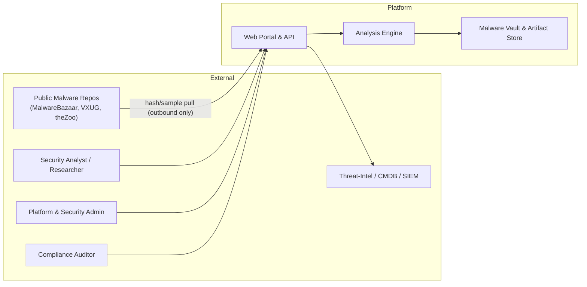
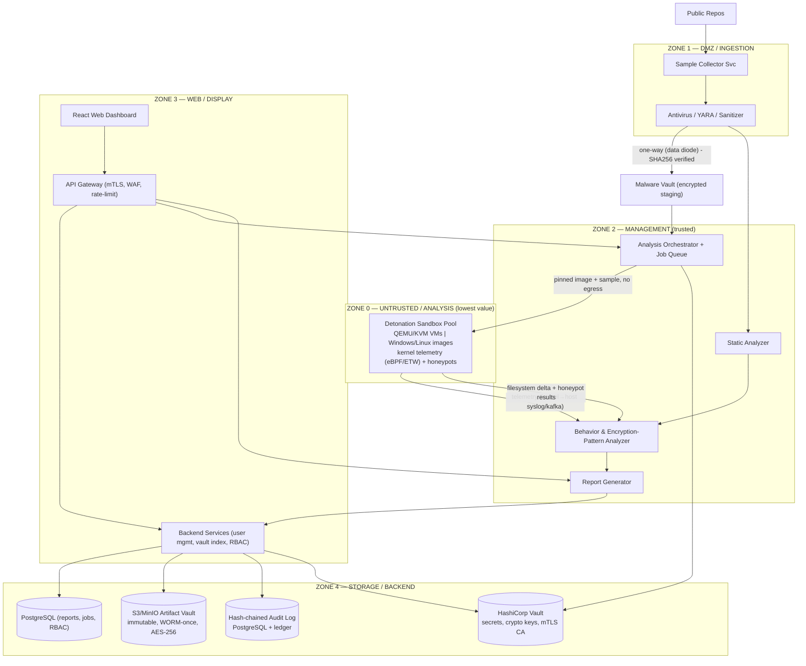
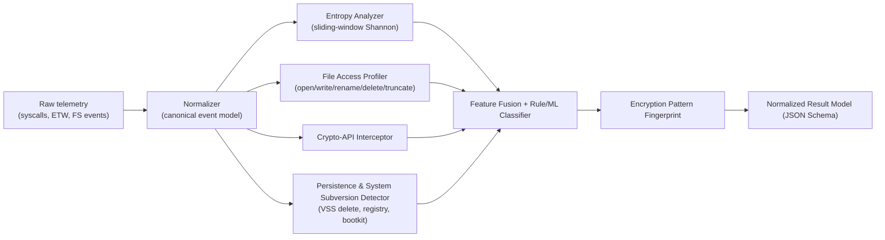
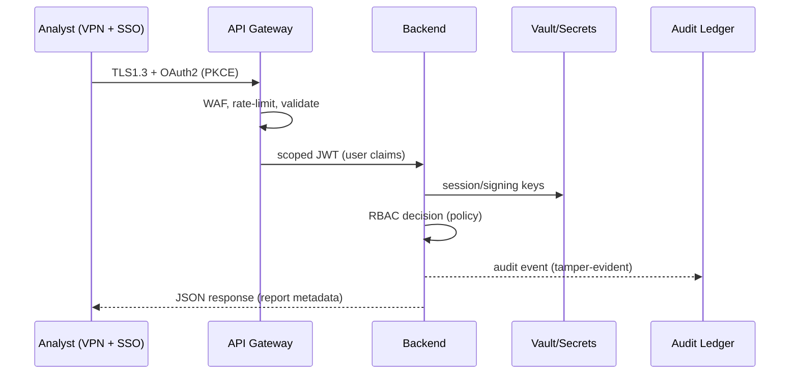
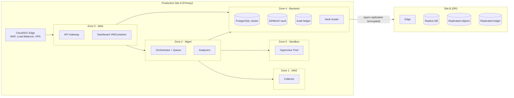
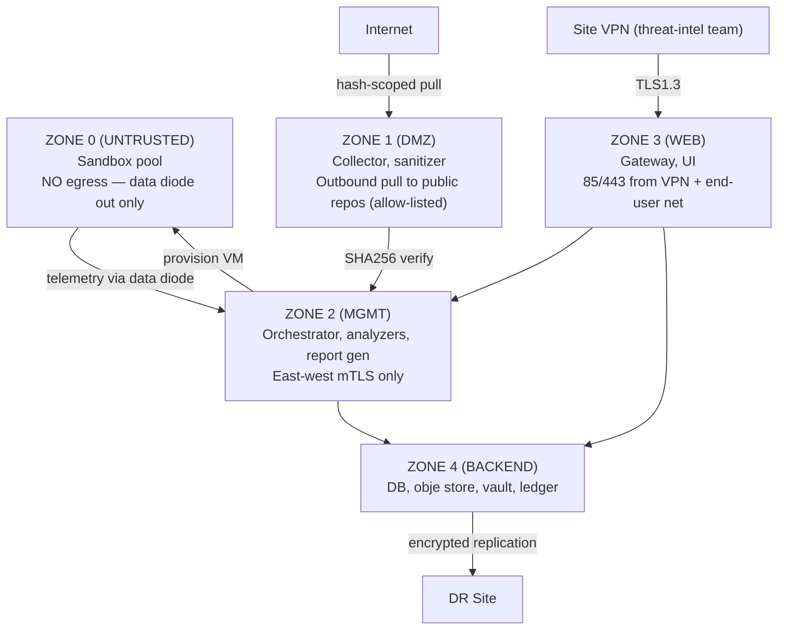

# Ransomware Behavior Analysis Platform — Reference Architecture

**Version:** 1.0
**Status:** Proposed / Reference Architecture
**Classification:** Internal Use Only — Confidential
**Review Cycle:** Quarterly (Security Architecture Review Board)
**Compliance Baselines:** ISO/IEC 27001:2022, NIST Cybersecurity Framework 2.0, OWASP Top 10 (2021), NIST SP 800-53 (informative reference), GDPR/DPA where applicable

---

## Table of Contents

1. [Executive Summary](#1-executive-summary)
2. [Goals and Non-Functional Requirements](#2-goals-and-non-functional-requirements)
3. [Architectural Style and Principles](#3-architectural-style-and-principles)
4. [System Context and Actors](#4-system-context-and-actors)
5. [High-Level Architecture](#5-high-level-architecture)
6. [Component Architecture](#6-component-architecture)
7. [Encryption Pattern Study Module (Core Engine)](#7-encryption-pattern-study-module-core-engine)
8. [Data Flows and Sequence Diagrams](#8-data-flows-and-sequence-diagrams)
9. [Security Architecture](#9-security-architecture)
10. [Compliance and Control Mapping](#10-compliance-and-control-mapping)
11. [Identity, Authentication and Authorization](#11-identity-authentication-and-authorization)
12. [Deployment Architecture](#12-deployment-architecture)
13. [Technology Stack](#13-technology-stack)
14. [CI/CD, Testing and Quality Gates](#14-cicd-testing-and-quality-gates)
15. [Observability, Logging and SIEM Integration](#15-observability-logging-and-siem-integration)
16. [Incident Response, BCDR and Data Retention](#16-incident-response-bcdr-and-data-retention)
17. [Threat Model (STRIDE)](#17-threat-model-stride)
18. [Network Segmentation and Zoning](#18-network-segmentation-and-zoning)
19. [Open Roadmap and Future Extensions](#19-open-roadmap-and-future-extensions)

---

## 1. Executive Summary

The **Ransomware Behavior Analysis Platform** is a web-based solution that ingests ransomware samples from **public repositories** (e.g., MalwareBazaar, VX Underground, theZoo, vx-underground mirror), detonates them in an **isolated, low-value analysis sandbox**, studies their **encryption behaviour** (algorithm inference, scope, block size, overwrite strategies, key handling), and produces structured **behavior analysis reports** for security researchers, DFIR teams, and threat-intel analysts.

Two non-negotiable axioms drive the design:

1. **Malware is untrusted.** The analysis environment is *considered compromised at all times* and is therefore physically/logically segregated, disposable, and connected by controlled one-way data flows only.
2. **Security is a feature of the platform itself.** Because the tool studies offensive software, it is architected to meet **ISO/IEC 27001**, **NIST CSF**, **OWASP Top 10**, and **NIST SP 800-53** controls from day one — the platform is a hardened, audited system in its own right.

---

## 2. Goals and Non-Functional Requirements

### 2.1 Functional Goals

- F1. Ingest samples securely from public malware repositories (hash-first, quarantine on intake).
- F2. Execute samples in a disposable sandbox with deep kernel-level behavioral telemetry.
- F3. Detect and classify ransomware **encryption patterns** with high precision (see Section 7).
- F4. Generate reproducible, shareable analysis reports (JSON → HTML/PDF/Markdown).
- F5. Provide a role-based web dashboard for analysts with full audit trail.

### 2.2 Non-Functional Requirements

| NFR | Requirement | Target |
|-----|-------------|--------|
| N1 | Security | All OWASP Top 10 controls implemented and verified in CI (SAST/DAST) |
| N2 | Isolation | Sandbox VMs contain 100% of detonation effects; no lateral movement path |
| N3 | Availability | 99.9% (web/planning layers); 100% isolation of blast radius |
| N4 | Performance | Report generation < 60 s for a 15-minute analysis run; dashboard P95 < 300 ms |
| N5 | Scalability | Horizontal scale of worker pool; ≥ 50 concurrent analyses |
| N6 | Auditability | Immutable, tamper-evident audit log (hash-chained) for all actions |
| N7 | Data Integrity | SHA-256 verified at every artifact handoff; WORM storage for evidence |
| N8 | Compliance | ISO 27001, NIST CSF, OWASP Top 10, SP 800-53 mapped controls |
| N9 | Reproducibility | Analyses reproducible via pinned VM snapshots + seeded configs |

---

## 3. Architectural Style and Principles

### 3.1 Style

- **Modular monolith + microservices hybrid**: a small set of coarse-grained services (collector, orchestrator, analysis, reporting, web) rather than fine-grained, chatty microservices. Simplifies security boundary enforcement and auditing.
- **Event-driven workflow**: job state machine driven by a message broker (Kafka/RabbitMQ) with durable queues.
- **Hexagonal (ports-and-adapters) per service**: each pipeline stage is replaceable (e.g., sandbox backends, telemetry collectors, crypto profilers).
- **One-way data flow** between untrusted and trusted zones (data diode pattern).

### 3.2 Principles

- **Zero Trust**: every call authenticated (mTLS + OAuth2), least privilege, continuous verification.
- **Default deny**: firewalls, IAM, and container policies deny by default.
- **Everything is evidence**: sample material, telemetry, and reports are immutable artifacts with hash chains.
- **Containment over convenience**: convenience features never weaken zone isolation.
- **Shift-left security**: SAST, DAST, dependency scanning, IaC scanning, and secrets scanning in every pipeline.
- **Repeatability**: sandbox images are versioned and signed; analyses are bit-for-bit reproducible.

---

## 4. System Context and Actors



### 4.1 Actor Definitions and Privileges

| Actor | Role | Min. privilege principle |
|-------|------|--------------------------|
| Analyst | View/create reports, submit samples, query artifacts | `report:read`, `analysis:submit` |
| Senior Analyst | Approve high-risk detonations, edit report templates | `+ analysis:approve` |
| Platform Admin | Manage users, zones, config, vault access | `platform:admin`, `vault:access` |
| Security Admin | Manage SIEM, audit-log review, incident response | `audit:read`, `siem:write` |
| Auditor | Read-only audit evidence | `audit:read` |
| Service/Host Identity | Machine-to-machine calls | scoped JWT/mTLS identities |

---

## 5. High-Level Architecture



**Zoning summary (full details in Section 18):**

| Zone | Trust | Contains | Egress |
|------|-------|----------|--------|
| Z0 | Untrusted (assume compromised) | Sandbox VMs | Telemetry-only, via one-way collector |
| Z1 | Low | Ingestion, collectors | Outbound pull (hash-scoped) |
| Z2 | Trusted | Orchestration, analyzers, report engine | Internal only |
| Z3 | Trusted (user-facing) | Web/API/UI | Authenticated API |
| Z4 | Trusted (backend) | Databases, vaults, ledger | Backups to DR |

---

## 6. Component Architecture

### 6.1 Sample Collector (Zone 1)

- Scheduled, **hash-scoped pull** from public repos (SHA-256 in, SHA-256 verified end-to-end).
- Never downloads on filename/metadata alone; downloads only known-interest hashes or vetted feed.
- Inline **anti-virus + YARA + deep-scan sanitizer**; any unexpected behaviour at intake quarantines the job.
- Writes to an **encrypted staging bucket**; never directly into the analysis network.

### 6.2 Malware Vault (Zone 4)

- **Encrypted at rest** (AES-256-GCM), keys held in HashiCorp Vault, per-object data keys, envelope encryption.
- Deduplication by SHA-256; immutable object store (WORM / retention lock).
- Access is gated by RBAC + mandatory justification; all reads audit-logged.
- Storage regions subject to data protection policies (GDPR, sanitization after retention).

### 6.3 Analysis Orchestrator (Zone 2)

- Durable job queue + state machine: `QUEUED → APPROVED → STAGED → DETONATED → ANALYZED → REPORTED → ARCHIVED`, plus `QUARANTINED | FAILED | ABORTED`.
- Runs **only pre-approved sample classes**; policy engine decides detonation vs. static-only.
- Instantiates **pinned, signed sandbox images** with:
  - no real credentials, no domain membership, disposable decoy data,
  - memory limits, CPU limits, strict process namespace,
  - **no egress** except telemetry channel to the collector (UDP/one-way), simulated C2 sinkhole.
- Per-job timeout and kill-switch; automatic snapshot rollback.

### 6.4 Static Analyzer (Zone 2)

- PE/ELF/Mach-O parsing (file format, sections, imports).
- String extraction, embedded URLs/IPs, entropy map of binary.
- YARA rules + online/offline signature match; code-signing and certificate inspection.
- Taint of crypto-related imports (CryptoAPI, OpenSSL, mbedTLS).

### 6.5 Behavior & Encryption-Pattern Analyzer (Zone 2) — *see Section 7*

### 6.6 Report Generator (Zone 2)

- Consumes the normalized **analysis result model** (JSON Schema v1) from the analyzer.
- Renders templated Markdown/HTML/PDF via versioned templates.
- Every report embeds: sample hashes, environment (image digest, kernel, date), tooling versions, and the evidence set (drop logs as attachments) for reproducibility.
- Reports are **signed** (Ed25519) so downstream consumers can verify authenticity.

### 6.7 Web Portal and API (Zone 3)

- **API Gateway**: WAF rules (ModSecurity/OWASP CRS), TLS 1.3 + mTLS for service-to-service, rate limiting, request-size limits, IP allow-lists via VPN, and header/input sanitization.
- **Backend services**: user mgmt, authorization (RBAC + policies), site config, report search/export, vault metadata index (hashes and metadata only; payload retrieval is a separate, rate-limited, audited call).
- **React dashboard**: dashboards for active analyses, encryption-pattern statistics, report viewer, admin console. No raw samples are ever shown in the browser.

---

## 7. Encryption Pattern Study Module (Core Engine)

This is the differentiating component. It answers the question: **what does this ransomware do to data, and how?**

### 7.1 Inputs

| Input | Source | Use |
|-------|--------|-----|
| Kernel syscall/API stream | eBPF hooks, ETW, Windows API monitor | I/O behaviour |
| Filesystem delta (pre/post) | Snapshot diff + live watch | Encryption footprint |
| Honeypot results | Canary files/folders | Early-warning + pattern probe |
| Crypto API traces | Interception of CryptoAPI/OpenSSL | Algorithm extraction |
| Process/registry/service logs | Sandbox telemetry | Persistence & CSP attacks |
| Static analysis output | Static Analyzer | Crypto import hints, embedded keys |

### 7.2 Detection Pipeline



### 7.3 Encryption Pattern Dimensions

#### A. Scope & Coverage
- **Serial vs. sparse**: share of files touched; directory traversal order; user-profile vs system vs network-share targeting.
- **Depth of touch**: full file rewrite vs. header-only vs. chunk encryption.

#### B. Cryptographic Characteristics
- **Algorithm inference**: from CryptoAPI/OpenSSL trace (AES-CBC/GCM, RSA, ChaCha20); fallback statistical inference from block entropy and output size.
- **Block size**: inferred from entropy-transition granularity and I/O write sizes.
- **Key handling observed**:
  - hardcoded key/IV in binary (static),
  - key generation performed on-host,
  - asymmetric envelope (public key embedded; session key encrypted) → hybrid pattern,
  - per-file vs per-session keys.
- **Chaining mode** hints: IV reuse, ECB leakage (same plaintext → same ciphertext in honeypot twins).

#### C. Write Strategy
- In-place overwrite vs. shadow copy (write temp, delete original) vs. delete+write.
- Preservation/truncation of file size vs. appending extension (e.g., `.lock`, `.enc`).
- Presence of encrypted file header/magic and ransom-note drop.

#### D. Operational Pattern
- Number of files encrypted per second (throughput).
- Thread/concurrency profile of encryption fan-out.
- Reverse-engineering of traversal algorithm (recursion depth, directory ordering anomalies).
- **Honeypot differential**: twins with identical content → ECB-like leakage detection; boundary files → partial-encryption detection.

### 7.4 Encrypted-File Categorization

| Category | Heuristic | Example indicators |
|----------|-----------|--------------------|
| Header-only/tail encryption | Only N bytes at start altered; magic bytes intact | `.docx` with intact zip header |
| Full-file encryption | Entropy ≈ 8.0 across file; size parity | complete rewrite |
| Compressed/encrypted with format | Header preserved but payload entropy high | encrypted containers |
| Whole-block encryption | Entropy steps at block boundaries | block-size inference |
| Extension-append | File renamed `x.doc` → `x.doc.lock` | FS rename event |

### 7.5 Scoring & Confidence

Each pattern dimension emits a **confidence score** (0–1) derived from:
- corroboration count (independent signals),
- signal fidelity (kernel API vs. statistical inference),
- static/dynamic agreement.

The fingerprint is a typed JSON object, e.g.:

```json
{
  "algorithm": { "guess": "aes-256", "confidence": 0.93, "source": ["crypto-api", "entropy-model"] },
  "encryption_mode": { "block_size_bytes": 4096, "chunk_percent": 12 },
  "override_strategy": "inplace-overwrite",
  "key_handling": { "pattern": "hybrid-asymmetric-envelope", "embedded_pubkey": "fingerprint-..." },
  "coverage": { "files_touched": 1240, "serial_vs_sparse": "serial", "dirs_traversed": ["C:/Users/*"] },
  "throughput": { "files_per_second": 42, "peak_write_mbps": 380 },
  "ransom_note": { "present": true, "name": "README_RECOVER.txt" },
  "evasion": { "shadowcopy_delete": true, "vss_events": 3 }
}
```

### 7.6 Integrity of Evidence

- Raw telemetry and FS deltas are stored **verbatim** in the object vault keyed by job + sample hash.
- The fingerprint JSON is **hash-chained into the audit ledger**; report signatures bind fingerprint → rendered report.

---

## 8. Data Flows and Sequence Diagrams

### 8.1 End-to-End Analysis Flow

```mermaid
sequenceDiagram
    participant R as Public Repo
    participant C as Collector
    participant O as Orchestrator
    participant S as Sandbox
    participant B as Behavior Analyzer
    participant G as Report Gen
    participant L as Ledger/Audit

    Note over C,O: Hash-scoped pull only; AV/YARA scan
    C->>O: submit job (sha256)
    O->>L: audit: job queued
    O->>O: policy check (detonation allowed?)
    O-->>S: stage pinned image + sample (no egress)
    S->>S: run (bounded time, kill-switch armed)
    S-->>B: telemetry + FS delta + honeypot results
    O-->>L: audit: detonation completed
    B->>B: encrypt-pattern detection pipeline
    B-->>G: normalized result model
    G->>G: render + sign report
    G-->>L: audit: report issued
    O-->>S: destroy VM, purge residual
```

### 8.2 Trusted Web/API Flow



---

## 9. Security Architecture

### 9.1 Defense-in-Depth Layers

1. **Network layer**: firewalls, IDS/IPS, network micro-segmentation, data diode for egress from sandbox, VPN-only admin access.
2. **Endpoint layer**: hardened OS images, EDR/AV on trusted zones, disablement of unnecessary services.
3. **Application layer**: OWASP Top 10 controls (below), secure SDLC, supply-chain verification.
4. **Data layer**: encryption at rest and in transit, KMS integration, WORM storage, masking for PII.
5. **Identity layer**: SSO + MFA, RBAC, short-lived credentials, mTLS for services.
6. **Monitoring layer**: centralized logging, SIEM, UEBA anomalies, alerting.

### 9.2 OWASP Top 10 (2021) Coverage

| # | Category | Control Implemented |
|---|----------|---------------------|
| A01 | Broken Access Control | RBAC + policy engine (OPA), default-deny, object-level authz checks, IDOR prevention |
| A02 | Cryptographic Failures | TLS 1.3, AES-256-GCM at rest, per-object envelope keys, no home-grown crypto, key rotation |
| A03 | Injection | Parameterized SQL (ORM), CSP headers, output encoding, input schema validation (JSON Schema), WAF |
| A04 | Insecure Design | Threat modeling at design, security controls in reference architecture, secure defaults |
| A05 | Security Misconfiguration | IaC + hardened images, configuration scanning (Trivy/Checkov), secret scanning |
| A06 | Vulnerable Components | SBOM generation, dependency scanning (SCA), pinned/versioned images, patch SLAs |
| A07 | Identification & Auth Failures | SSO/IdP (SAML/OIDC), MFA mandatory, lockout + throttling, session rotation, mTLS |
| A08 | Software & Data Integrity | Signed artifacts (Cosign), hash-verified pipeline, WORM evidence store, tamper-evident audit log |
| A09 | Logging & Monitoring Failures | Structured logs, SIEM ingest, hash-chained ledger, alerting on anomalies, no PII in logs |
| A10 | SSRF | Egress allow-lists, per-request URL allow-list, DNS rebinding protection, no user-supplied URLs to internal services |

### 9.3 NIST CSF 2.0 Alignment

| Function | Example to-dos |
|----------|----------------|
| **Govern** | Security policy, cyber-risk strategy, supply-chain risk mgmt (signed images, SBOM), roles |
| **Identify** | Asset inventory, sample/vault categorization, business-impact analysis |
| **Protect** | Identity mgmt & MFA, data security (encryption/WORM), hardening + training, platform resilience |
| **Detect** | Continuous monitoring, anomaly & attack detection, SIEM correlation |
| **Respond** | Incident-response playbooks, containment (zone isolation), analysis & reporting |
| **Recover** | BCDR, restoration testing, post-incident lessons-learned |

### 9.4 ISO/IEC 27001:2022 Annex A Mapping (primary controls)

| Annex A | Domain | Where Applied |
|---------|--------|---------------|
| A.5.1–A.5.23 | Organizational controls | Policy, roles, risk, asset mgmt, threat intel, supplier mgmt |
| A.8.1–A.8.12 | People controls | Background checks, security awareness (malware researchers), NDAs |
| A.8.1–A.8.12 | Physical controls | Restricted data-center access for analysis zone |
| A.8.9/A.8.10 | **Configuration, information protection** | Hardened images, data classification of samples/reports, encryption at rest |
| A.8.11 | **Data masking** | PII redaction; sample metadata scrubbing |
| A.8.12 | **Data leakage prevention** | One-way egress, no PII exfiltration paths |
| A.8.2/8.19 | Logging & monitoring | Centralized SIEM + hash-chained audit log |
| A.8.15 | Logging | Immutable audit trail for all platform & access events |
| A.8.20 | **Security in dev & support** | Secure SDLC, SAST/DAST/SCA, test environments separated |
| A.8.21/8.23 | **Security of networks / segregation** | Zones, data diode, mTLS segments |
| A.8.24 | Crypto controls | KMS, envelope encryption, key lifecycle |
| A.5.24/5.25 | **Incident management** | IRP, SOC line, kill-switch playbooks |
| A.5.29 | **Security during disruption** | DR site, restored VMs, data replication |

### 9.5 Key Management

- **HashiCorp Vault** (or KMS) holds master keys; per-object DEKs generated per upload.
- Separate key namespaces: vault-store, report-signing, mTLS CA, sandbox image signing.
- Key rotation quarterly; automatic rekey on suspicion; HSMs for master keys in production.
- All crypto operations centralized — no developer-invented crypto, no plaintext secrets in code/config.

### 9.6 Secrets Hygiene

- Secrets only in Vault; injected at runtime via sidecar/agent.
- CI never sees secrets; short-lived tokens via dynamic secrets.
- Full-file secret scanning gate in every PR (gitleaks/TruffleHog).

---

## 10. Compliance and Control Mapping

| Requirement Source | Where Documented | Evidence Artifacts |
|---------------------|------------------|--------------------|
| ISO/IEC 27001 Annex A | Statement of Applicability (SoA), control-narrative per domain | Audit logs, config baselines, SoA review minutes |
| NIST CSF 2.0 | CSF profiles per component (current → target) | Gap analysis reports |
| NIST SP 800-53 | Control traceability matrix (e.g., AC, IA, SC, SI, AU, CP, IR) | Certification inputs |
| OWASP Top 10 | AppSec controls register + CI gates | SAST/DAST results in pipeline |
| GDPR / DPA | DPIA if PII processed (e.g., analyst identities) | DPIA, retention schedules |
| Repo/ABUSE policies | Public repo terms of service; no re-distribution of un-owned samples | License compliance register |

Compliance state is monitored continuously: **no control is "paper-only"** — each maps to an automated check (CI gate, config scan, audit query, SIEM rule).

---

## 11. Identity, Authentication and Authorization

### 11.1 User Identity

- **SSO via OIDC/SAML** to the enterprise IdP (Azure AD / Okta / Keycloak).
- **MFA mandatory** for all users; step-up auth for vault retrieval and detonation approval.
- Session tokens: short-lived (15 min), rotating, bound to device fingerprints; JWT audience scoped to the API.

### 11.2 Service Identity

- **mTLS**: every service has a machine identity signed by the internal CA; no plain HTTP inside the mesh.

### 11.3 Authorization

- **Role-Based Access Control** (RBAC) plus **Attribute-Based policies** (OPA) for fine-grained conditions (e.g., "only during office hours", "only from VPN IP space").
- Mandatory access justification for: vault read, detonation job creation, report export.
- All authorization decisions logged (subject, object, action, decision).

### 11.4 Sample/Vault Access Rules

- Analyst must specify research purpose; access granted for X hours, auto-revoked.
- Vault **reads and writes never share permissions**: read requires separate approval workflow.
- Exported samples are always encrypted and watermarked with the exporter identity for abuse tracing.

---

## 12. Deployment Architecture

### 12.1 Topology



### 12.2 Infrastructure as Code

- Terraform modules per zone; network policies as code.
- Kubernetes (hardened, distroless images) for web/management microservices; **sandbox VMs explicitly NOT on the k8s cluster** — hypervisor-direct to guarantee isolation.
- GitOps (ArgoCD/Flux) with signed, pinned images; drift detection nightly.
- Config and secret scanning gates in every deployment PR.

### 12.3 Sandbox Fleet

- Hypervisors (KVM/QEMU, or Firecracker microVMs) managed by a dedicated fleet controller.
- Pool of disposable VMs: Windows 10/11, Windows Server, Ubuntu, Kali — all with:
  - no domain membership, no internet gateway (except sinkhole),
  - honeypot file trees + decoy user data,
  - kernel telemetry agents compiled into the base image,
  - auto-destroy after N minutes, snapshot rolled back between jobs.
- **Deterministic, reproducible**: base images are built from code, signed, and versioned.

---

## 13. Technology Stack

| Layer | Technology | Rationale |
|-------|-----------|-----------|
| Frontend | React + TypeScript, Tailwind, Chart.js/D3 | Fast P95 dashboard, typed models |
| API | Node.js (NestJS) or Go (Gin) | mTLS-friendly, strong typing, perf |
| Orchestration | Apache Airflow / Temporal + Kafka/RabbitMQ | durable workflows, state machines |
| Sandbox backend | KVM/QEMU, Firecracker; eBPF (Linux), WinDbg/ETW (Windows) | kernel-level telemetry |
| Analysis | Python (numpy, scipy, pefile, lief, yara) | entropy math + forensics ecosystem |
| Crypto patterns | Python + Rust extracts | entropy/fingerprint, perf-sensitive loops in Rust |
| Storage | PostgreSQL, MinIO/S3, Redis cache | metadata, artifacts, hot state |
| Ledger/audit | PostgreSQL append-only + hash-chaining job / (optionally) immutable ledger | tamper-evident audit |
| Secrets/KMS | HashiCorp Vault + HSM | envelope encryption, mTLS CA |
| WAF/Proxy | Envoy + ModSecurity OWASP CRS | edge protection |
| Observability | OpenTelemetry, Prometheus, Grafana, Loki, ELK/OpenSearch | metrics, logs, traces |
| CI/CD | GitHub Actions + GitOps (ArgoCD), Trivy/Checkov, Semgrep, OWASP ZAP | shift-left security |
| Auth | Keycloak/OIDC → SSO, mTLS mesh (Istio) | identities & zero trust |

---

## 14. CI/CD, Testing and Quality Gates

### 14.1 Pipeline Gates (all must pass)

1. **Commit**: secret scan, lint, unit tests.
2. **PR**: SAST (Semgrep/CodeQL), dependency scan (SCA), IaC scan (Checkov), SBOM generation, container image scan (Trivy).
3. **Merge**: integration tests, mutation-tolerant contract tests.
4. **Stage**: DAST (OWASP ZAP) against staging API, performance smoke, vulnerability window check (≤ 30-day patch policy).
5. **Production**: signed images (Cosign), progressive rollout (canary), automated rollback on error-rate spike.

### 14.2 Testing

- Unit/integration for analyzers (deterministic fixture samples — synthetic "ransomware-like" binaries).
- Sandbox isolation tests: sample escapes must be caught (honeypot networks, host-sniffing).
- Load test: 50 concurrent jobs; report P95 within budget.
- **Attack-driven tests**: red-team detonation escape attempts, IDOR probes, SSRF drills, phishing-based token theft drills.

### 14.3 Security Testing Cadence

- Monthly DAST; quarterly penetration test (authorized scope); annual ISO 27001 audit; continuous red-team scrims against sandbox containment.

---

## 15. Observability, Logging and SIEM Integration

### 15.1 Logging

- Structured JSON logs everywhere (OpenTelemetry standard fields).
- Log levels and destinations per zone; sandbox logs are considered **low-fidelity source**, analysis logs **high-fidelity sensitivity**.
- **No secrets, PII, or raw sample payloads in logs**; only hashes.

### 15.2 Audit Ledger

- Every privileged action, vault access, auth decision, and job transition recorded in an **append-only, hash-chained ledger** (each entry includes hash of previous → tamper-evident).
- Ledger replicated to DR; backups stored in library with retention lock.

### 15.3 SIEM & Detection

- Event streams shipped to SIEM (Splunk/Sentinel) for correlation with enterprise-wide detections.
- Detection use cases:
  - sandbox network egress anomalies,
  - sandbox escape indicators,
  - unusual vault access patterns (brute-force / insider),
  - report-download spikes (potential exfiltration),
  - credential stuffing at the gateway.

---

## 16. Incident Response, BCDR and Data Retention

### 16.1 Incident Playbooks

- **P0 Sandbox escape / suspicious platform compromise**: isolate zone, kill-switch all VMs, preserve telemetry, notify SOC, forensic snapshot.
- **P1 Vault leak suspicion**: revoke keys, rotate, re-encrypt, legal/compliance notification.
- **P2 Abuse of analysis capability**: user suspensions, policy tightening.

### 16.2 BCDR

- RPO: 15 min for metadata (streaming replication); RTO: 2 h for web/display; sandbox rebuilt on demand.
- DR site tested quarterly with full sample-behavior regression.

### 16.3 Data Retention & Disposal

| Data class | Retention | Disposal |
|-----------|-----------|----------|
| Raw samples (vault) | Per legal/research license, max 365 days by default | Crypto-shred + overwrite (NIST SP 800-88 Purge) |
| Telemetry/evidence | 365 days | Same |
| Reports | Indefinite (signed archives) | — |
| Audit ledger | 5 years / regulatory | WORM, then cryptographically sealed |
| Analyst PII | Per DPA/HR policy | Masked/deleted on request |

---

## 17. Threat Model (STRIDE)

| Component | Spoofing | Tampering | Repudiation | Info Disclosure | DoS | Elevation of Privilege |
|-----------|----------|-----------|-------------|-----------------|-----|------------------------|
| Web/API GW | SSO+MFD, mTLS | WAF, request signing | Authz audit log | TLS, output encoding | rate-limit, LB | RBAC+OPA |
| Backend svcs | JWT validation, audience checks | Signed artifacts, immutability | Ledger entries | per-object encryption | quotas | least-privilege drop |
| Orchestrator | signed images, job tokens | state-machine validation | job audit | no raw payload in logs | queue backpressure | sandbox never gets cluster creds |
| Sandbox VM | burned-in image attestation | snapshot integrity | telem signature | one-way telemetry only | kill-switch, timebox | rootless, namespace isolation, no egress |
| Analyzers | verified telemetry schema | hash verification | evidence chain | least data access | bounded compute | sandboxed process, no credentials |
| Report gen | signature check | template immutability | signed reports | masking | template limits | sandbox rendering |
| Vault/DB | mTLS, keys in vault | WORM retention | ledger | AES-256-GCM | connection limits | separate roles read/write |
| Data diode | unidirectional hardware enforcement | n/a | telem hash | — | — | — |

Key residual risks and mitigations:
- **Malware escaping the sandbox** → hypervisor isolation, no shared creds, network stovepipes, kill-switch; validation via red-team drills.
- **Insider leak of samples** → watermarking, justification-gated access, behavioral UEBA.
- **Supply-chain compromise of images/analyzers** → signed images, SBOM, provenance attestation.

---

## 18. Network Segmentation and Zoning



**Rules that must never be violated:**
1. Zone 0 has **no route to any other zone** except the one-way telemetry collector.
2. Zone 0 has **no DNS/internet route**; DNS is sinkholed to a simulated C2 server in Zone 2.
3. Users never access Zone 0 directly; caretaker actions happen through the fleet controller.
4. Writes into the vault only from sanctioned ingestion paths; reads require separate approval.

---

## 19. Open Roadmap and Future Extensions

- **Campaign attribution module**: cluster fingerprints → family similarity scoring.
- **ML-based pattern classifier**: supervised + few-shot models trained only on synthetic/internal fixtures; human-in-the-loop validation.
- **Amber/red assurance tier**: optional detonation of higher-confidence live C2 interactions within a hardened containment "island".
- **Interoperability**: STIX/TAXII export of indicators; MISP/Threat-Intel feed integration.
- **Report intelligence**: NLP summarization of encryption behaviour for executive briefing packs.
- **Federated trust**: signed-report verification by external consumers via public key distribution.

---

## Appendix A — Control Trace Example (subset)

| Control | Implementation | Evidence |
|---------|----------------|----------|
| ISO A.8.24 Crypto controls | Vault envelope encryption, HSM master keys, rotation policy | Key-usage audit report |
| ISO A.8.23 Network segregation | Zone model + data diode + mTLS mesh | Network diagram + firewall rules-as-code |
| ISO A.8.15 Audit logging | Hash-chained ledger + SIEM | Ledger integrity check job |
| NIST PR.DS-1 (Protect) | AES-256-GCM every store | Config scans (Trivy/Checkov) |
| NIST DE.AE-3 Anomalies | UEBA + SIEM correlation rules | SIEM alert metrics |
| OWASP A10 SSRF | Egress allow-list + schema-validated URLs | DAST findings closed |
| SP 800-53 AC-3 | Policy engine OPA default-deny | Policy test suite |

---

*This document is a living reference architecture. All security controls are enforced via automated checks, not documentation alone. Any divergence requires a signed exception through the Security Architecture Review Board.*