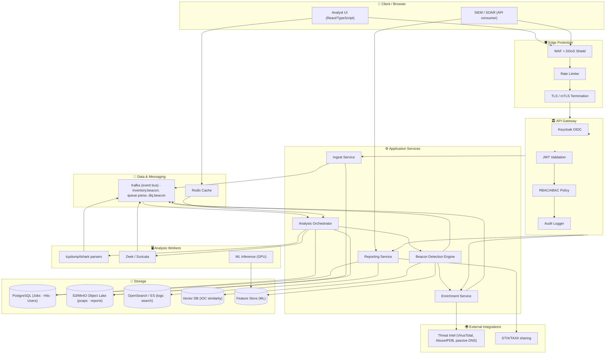
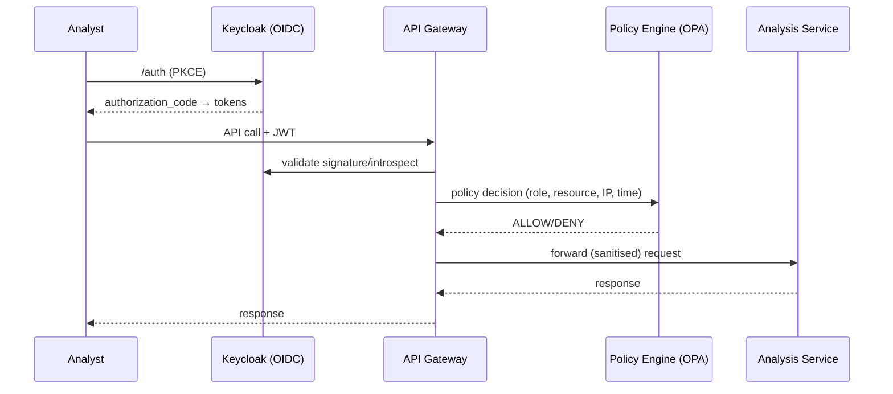

# 🛰️ C2 Beacon Extractor — Comprehensive Solution Architecture

> **Extracting the Command-&-Control channel from an infected host's network capture, turned into a secure, compliance-ready web platform.**

---

   

---

## 📑 Table of Contents

1. [Executive Summary](#1-executive-summary)
2. [Problem Statement & Goals](#2-problem-statement--goals)
3. [High-Level Architecture](#3-high-level-architecture)
4. [Core Analysis Pipeline (Beacon Detection Engine)](#4-core-analysis-pipeline--beacon-detection-engine-)
5. [Detailed Component Design](#5-detailed-component-design)
6. [Data Model & Storage](#6-data-model--storage)
7. [Security Architecture](#7-security-architecture)
8. [Compliance Matrix — ISO 27001 / NIST / OWASP](#8-compliance-matrix--iso-27001--nist--owasp)
9. [Zero Trust Model](#9-zero-trust-model)
10. [Threat Model & Attack Surface](#10-threat-model--attack-surface)
11. [Deployment & DevOps Topology](#11-deployment--devops-topology)
12. [Observability, SIEM & Incident Response](#12-observability--siem--incident-response)
13. [Data Retention & Privacy](#13-data-retention--privacy)
14. [Disaster Recovery & Business Continuity](#14-disaster-recovery--business-continuity)
15. [Performance & Scalability](#15-performance--scalability)
16. [Roadmap (Phased Delivery)](#16-roadmap--phased-delivery-)
17. [Decision Log & Assumptions](#17-decision-log--assumptions)

---

## 1. Executive Summary

| | |
|---|---|
| 🎯 **Purpose** | Web platform where a SOC/Malware Analyst uploads a **pcap/pcapng** from an infected host and receives a **structured, scored C2 beacon report** — including extraction of C2 domains, IPs, URLs, TLS fingerprints (JA3/JA3S, SNI, cert CN/SAN), DNS queries and beacon periodicity. |
| 🧩 **Core Science** | Beacon detection = **time-series + statistical + ML hybrid** scoring over per-flow inter-request intervals, jitter, payload entropy and regularity (FFT / autocorrelation / Figure-of-Merit). |
| 🔒 **Security Baseline** | **ISO 27001:2022** (Annex A controls), **NIST CSF 2.0 / SP 800-53 r5**, **OWASP Top 10 (2021)**, **Zero Trust** (NIST SP 800-207), least privilege, secrets vaulting, full auditability. |
| 🏗️ **Platform** | Cloud-native microservices on **Kubernetes**, event-driven with a message broker, GPU-ready ML workers, object-store backed, SIEM-exportable reports. |

**Why this works:**
> Malware that phones home does **not** use human-typical traffic. The beacon repeats at near-regular intervals, with low jitter, small predictable payloads and stable fingerprints — all of which are mathematically testable. We turn those signals into **high-confidence C2 verdicts** with evidence the analyst can defend in court.

---

## 2. Problem Statement & Goals

### 2.1 Problem
- 🦠 A malware sample was detonated in an isolated sandbox and produced a network capture.
- 📡 Analysts must manually hunt for "beacon-like" flows across thousands of packet conversations.
- ❌ Manual review is slow, error-prone, non-repeatable and produces **unstructured reports** that are hard to share, archive or correlate with threat intel.

### 2.2 Goals
| Goal | KPI / Success Metric |
|---|---|
| 🚀 Extract C2 indicators automatically | ≥ 95% precision on labelled beacon dataset |
| ⏱️ Fast time-to-result | < 60 s for a 1 GB pcap, end-to-end |
| 📊 Reproducible, evidence-backed reports | Every verdict carries statistical + flow evidence |
| 🔗 Interoperable output | STIX 2.1, MITRE ATT&CK, CSV/JSON/PDF export |
| 🔐 Secure by-default & audit-ready | Full ISO 27001 / NIST / OWASP coverage |

---

## 3. High-Level Architecture

### 3.1 Architecture Vision (Layered)

```
┌───────────────────────────────────────────────────────────────────────────────┐
│                          🧍 USER LAYER                                          │
│        SOC Analyst │ Threat Hunter │ IR Team │ ML Engineer (Admin)              │
├───────────────────────────────────────────────────────────────────────────────┤
│                          🌐 EDGE / PROTECTION LAYER                             │
│   WAF (ModSecurity) ── DDoS Shield ── Rate Limiter ── Bot Defense ── TLS/mTLS   │
├───────────────────────────────────────────────────────────────────────────────┤
│                          🏛️ API  GATEWAY  LAYER                                 │
│   OAuth2/OIDC (Keycloak) ─── JWT Validation ─── RBAC/ABAC ─── Audit Logger      │
├───────────────────────────────────────────────────────────────────────────────┤
│                          ⚙️ APPLICATION LAYER (Microservices)                   │
│   ┌─────────┐ ┌─────────┐ ┌─────────┐ ┌─────────┐ ┌──────────┐ ┌──────────┐   │
│   │ Auth Srv│ │ Ingest  │ │ Analysis│ │ Beacon  │ │ Enrich   │ │ Reporting│   │
│   │ Service │ │ Service │ │ Orchestr│ │ Engine  │ │ Service  │ │ Service  │   │
│   └─────────┘ └─────────┘ └─────────┘ └─────────┘ └──────────┘ └──────────┘   │
├───────────────────────────────────────────────────────────────────────────────┤
│                          🧠 DATA  &  MESSAGING  LAYER                          │
│   Kafka (Event Bus) ── Redis (Cache) ── Postgres (MD) ── S3/MinIO (PCAP/IOC)   │
│   ── ML Feature Store ── Vector DB (IOC similarity) ── Elasticsearch (Logs)     │
├───────────────────────────────────────────────────────────────────────────────┤
│                          🖥️ ANALYSIS / INFRASTRUCTURE LAYER                    │
│   Kubernetes (EKS/K8s) ── tshark/Zeek workers ── ML inference (GPU nodes)      │
│   ── HPA Autoscaling ── Service Mesh (mTLS/Istio) ── Vault (Secrets)           │
├───────────────────────────────────────────────────────────────────────────────┤
│                          🔭 OBSERVABILITY / RESPONSE LAYER                     │
│   Prometheus + Grafana ── SIEM Connector (Splunk/Sentinel) ── SOAR Playbooks   │
│   ── IR Workflows ── Audit Trails (immutable) ── ELK/OpenSearch                │
└───────────────────────────────────────────────────────────────────────────────┘
```

### 3.2 Mermaid Diagram (renders on GitHub/GitLab)



---

## 4. Core Analysis Pipeline — Beacon Detection Engine 🚨

This is the **heart** of the solution. Analysts get a per-flow **Beacon Score 0–100** with evidence.

### 4.1 Pipeline Stages

```
 PCAP ingest → Parse & Normalize → Flow building → Time-series extraction
   → Statistical scoring → ML scoring → Fusion (weighted verdict)
   → IOC extraction → Threat-intel enrichment → Report + STIX export
```

### 4.2 Detection Techniques (the "science" layer)

| # | Technique | What it detects | Implementation |
|---|---|---|---|
| 1 | **Figure-of-Merit (FoM)** | Host is "on the wire" across the whole window | `FoM = packets_observed_in_interval / total_intervals` — classic (Wright et al. "Cybersecurity in Fibre Channel" / ITC fame) |
| 2 | **Inter-Request Time (IRT) statistics** | Periodicity of outbound requests | Mean, **median**, stddev, **coefficient of variation (jitter)** of IRT series |
| 3 | **Spectral analysis (FFT / Lomb-Scargle)** | Stable periodic frequency | Peak in periodogram; confidence from harmonic amplitude |
| 4 | **Autocorrelation** | Repetitive structure in time series | Lag at which autocorrelation peaks & stays high |
| 5 | **Entropy analysis** | Obfuscated/encoding C2 payloads | Shannon entropy + Hutter/Huffman compression ratio of payloads |
| 6 | **Packet-size regularity** | Fixed-size beacon blobs | stddev of packet lengths ≈ 0 |
| 7 | **TLS/DNA fingerprints** | Same client hellos reconnecting | JA3/JA3S stability, same SNI/cert CN across flows |
| 8 | **ML anomaly (Isolation Forest / LOF)** | Unusual flow clusters vs benign baseline | Unsupervised on feature vector |
| 9 | **Supervised classifier** | Known beacon families | XGBoost/RandomForest on labelled dataset (optional, model-gated) |

### 4.3 Feature Vector (extended)

```text
[ flow_id, src, dst, proto,
  irt_mean, irt_median, irt_std, irt_cv, irt_min, irt_max,
  foM, fft_peak_freq, autocorr_lag, autocorr_peaks,
  payload_entropy, payload_len_mean, payload_len_std,
  bytes_up, bytes_down, packets, duration,
  ja3, ja3s, tls_sni, cert_cn, cert_san, dns_qnames, user_agent ]
```

### 4.4 Verdict Fusion

```
Beacon_Score = w1*Stat(IRT regular) + w2*FoM + w3*SpectralConfidence
             + w4*EntropySignal + w5*ML_Anomaly + w6*FingerprintStability
Verdict:
   0–25   🟢 Benign        → no action
  25–60   🟡 Suspicious    → analyst review queue
  60–85   🟠 Likely C2     → auto-enrich + alert SIEM
  85–100  🔴 Confirmed C2  → auto-blocklist IOC + incident ticket
```

> ⚠️ **Guardrail:** Every high-confidence verdict must ship with the *evidence chain* (IRT series, periodogram, matched fingerprints) — no black-box outputs, ensuring **human-in-the-loop** IR and auditability.

### 4.5 Extracted IOCs (output taxonomy)

| IOC Type | Examples | MITRE ATT&CK |
|---|---|---|
| Domain (DGA / static) | `evil[.]com`, long non-sense TLDs | T1568, T1071 |
| IP / CIDR | 5.188.62.11 /23 | T1568 |
| URL / Full URI | `http://evil/drop/x.bin` | T1105 |
| TLS fingerprint | JA3 = `51c64c...`, SNI | T1573 |
| Certificate identity | CN / SAN / issuer | T1573 |
| DNS behavior | tunnel: high TXT entropy | T1048 |
| Email / file-drop | PII-less secondary IA | T1071.004 |

---

## 5. Detailed Component Design

### 5.1 Frontend (React + TypeScript)

- 🔐 OIDC login via Keycloak (PKCE), JWT session.
- 📤 Drag-and-drop pcap upload (chunked, encrypted via TLS 1.3).
- 🕵️ Live job timeline: parsed → analyzed → enriched → reported.
- 📊 Beacon visualisation: IRT scatter, periodogram, flow graph (cytoscape.js), IOC timeline.
- 📥 Report generation & export (JSON/PDF/STIX), verdict filters, ADR view.

### 5.2 Ingest Service
- Validation: **file-type sniffing** (magic bytes — pcap/pcapng), size caps, checksum (SHA-256).
- Malware-safe handling: **sandboxed workers**, never serve potential-malware back to browser.
- Upload to encrypted object store; persist job metadata to Postgres; emit `queue.parse` to Kafka.

### 5.3 Analysis Orchestrator
- State machine: `PENDING → QUEUED → PARSING → FEATING → SCORING → ENRICHING → DONE | FAILED`.
- Fan-out to tshark/Zeek workers; merges flow output; handles retries + **DLQ** for poisoned messages.

### 5.4 Beacon Detection Engine
- Pure compute service; deterministic stats engine (shared-testable), pluggable ML scorer.
- Periodogram via FFT with **Lomb-Scargle** for uneven sampling (real beacon IRTs are uneven!).
- Model registry versioned (MLflow); every inference tagged with model version → traceability.

### 5.5 Enrichment Service
- Matches extracted IOCs across threat-intel feeds (VirusTotal, AlienVault OTX, AbuseIPDB, MISP).
- Passive-DNS lookup for domains; geoIP; reputation scoring.
- **Outbound egress is the only service allowed to reach the internet** (egress firewall).

### 5.6 Reporting Service
- Renders reports; STIX 2.1 object generator; SIEM push (Splunk/Sentinel via API/CEF); CSV/JSON exports (role-gated).

---

## 6. Data Model & Storage

### 6.1 Schema Overview

```mermaid
erDiagram
    USERS ||--o{ JOBS : creates
    JOBS ||--o{ FLOWS : contains
    FLOWS ||--o{ BEACON_SIGNALS : has
    FLOWS ||--|{ IOCS : produces
    IOCS }o--o{ ENRICHMENTS : matched_by
    JOBS ||--o{ REPORTS : yields
    JOBS ||--o{ AUDIT : logged

    USERS { uuid id PK; string name; string roles }
    JOBS { uuid id PK; string filename; string status; string hash; timestamp created_at }
    FLOWS { uuid id PK; uuid job_id FK; string 5tuple; int bytes_up; int bytes_down }
    BEACON_SIGNALS { uuid id PK; uuid flow_id FK; float beacon_score; float irt_cv; float foM; json evidence }
    IOCS { uuid id PK; string ioc_type; string ioc_value; float confidence; text mitre_ttps }
    ENRICHMENTS { uuid id PK; uuid ioc_id FK; string feed; string verdict }
    REPORTS { uuid id PK; uuid job_id FK; json report; string format }
    AUDIT { uuid id PK; uuid user_id FK; string action; timestamp when; json meta }
```

### 6.2 Storage Tiering

| Tier | Store | Purpose | Retention |
|---|---|---|---|
| 🔥 Hot | PostgreSQL 15 | Jobs, users, signals, IOC (relational) | 1 yr (policy) |
| 🔥 Hot | Redis | Job state cache, IRT series cache | 24 h |
| 🌊 Warm | S3/MinIO | Raw pcaps (encrypted AES-256), reports | Configurable (90 d default) |
| ❄️ Cold | Glacier/WORM | Legal-hold pcaps, court evidence | Legal retention |
| 🧪 ML | Feature Store + Vector DB | Model training sets, IOC similarity | Indefinite (masked) |
| 📄 Logs | OpenSearch | Audit + app logs (immutable, WORM) | 1–7 yr |
| 🌐 DNS | Passive DNS cache | Enrichment accelerates | 30 d |

---

## 7. Security Architecture 🔒

### 7.1 Security Posture Principles

1. **Security by design** — SDL gates: threat modeling at design, SAST/DAST in CI, pen-test yearly.
2. **Defense in depth** — WAF → Gateway → mTLS mesh → per-service RBAC → data encryption at every tier.
3. **Least privilege** — analysts read-only on analyses; only admins manage models/users.
4. **Prevent data leakage** — IOC and raw captures are **sensitive**; global data-loss rules govern exports.
5. **Immutable audit** — every action (view, export, login, model change) recorded, WORM-stored.
6. **No secrets in code** — Vault + cloud KMS; rotated automatically.

### 7.2 Key Controls per Layer

| Layer | Controls |
|---|---|
| 🔥 Edge | Cloud WAF rules, DDoS absorb, geo/rate limiting, TLS 1.3 HSTS |
| 🏛️ Gateway/API | OAuth2/OIDC + PKCE, JWT short-lived (15 min), refresh rotation, RBAC+ABAC (OPA), per-route rate limits, request body size caps, input validation (OWASP ESAPI) |
| ⚙️ Services | mTLS (service mesh), 12-factor env injection, context-timed timeouts, safe error messages (no stack traces), **container hardening** (distroless, read-only FS, non-root), SBOM + image signing (Cosign) |
| 🧠 Data | AES-256 at rest (KMS), TLS 1.3 in transit, field-level encryption for IOC values, **PCAP sanitisation** (strip local user PII before long-term store), backups encrypted |
| 🖥️ Analytics | Sandboxed/limited network for workers; **malware never leaves cluster**; DLQ monitoring; model provenance + bias testing |
| 🔭 Ops | SIEM shipping, anomaly detection on auth, egress firewall allow-list, hardened bastion, SOC/SOAR playbooks |

### 7.3 Authentication & Authorization



---

## 8. Compliance Matrix — ISO 27001 / NIST / OWASP

### 8.1 ISO 27001:2022 — Annex A Mapping (key controls)

| Control | Title | Implementation in this solution |
|---|---|---|
| A.5.15 | Access control | Keycloak OIDC + RBAC/ABAC, MFA enforced |
| A.5.16 | Identity management | Verified provisioning/deprovisioning lifecycle |
| A.5.17 | Authentication info | Vault secrets, KMS keys, no plaintext anywhere |
| A.5.18 | Access rights | Periodic review workflow (quarterly attestation) |
| A.5.25 | Assessment of risks | Annual TARA tied to ISO 27005 |
| A.6.3 | Info sec awareness | Analyst IR/forensics training (phishing & insider) |
| A.7.4 | Personnel termination | Automated account revocation on role change |
| A.8.1 | Asset inventory | SBOM + CMDB (service, version, owner, region) |
| A.8.2 | Device policy | Hardened, EDR-protected analysts' workstations |
| A.8.9/8.10 | Media handling | Encrypted object store, secure erase workflows |
| A.8.11 | Data masking | PII scrubbing of pcaps, field-level IOC encryption |
| A.8.12 | Data leakage prevention | DLP rules on export, watermarking on reports |
| A.8.16 | Monitoring activities | SIEM + audit trailers on all sensitive reads |
| A.8.17 | Clock synchronisation | NTP on all nodes (forensic integrity) |
| A.8.20 | Network security | Zero-trust segments, mTLS mesh, egress allow-list |
| A.8.23 | Web filtering | WAF + content policy on admin UI |
| A.8.25 | Secure coding | OWASP ASVS L3 reviews, SAST/DAST/RASP pipeline |
| A.8.27 | Agile/Dev methodology | CI/CD with security gates, signed artifacts |
| A.8.28 | Secure coding | Input validation, parameterised queries, CSP headers |
| A.8.29 | Security testing | DAST weekly, SAST per-PR, pen-test annually |
| A.8.31 | Data separation | Multi-tenant namespace isolation + row-level security |
| A.8.32 | Data masking | Report export redaction for non-privileged roles |
| A.8.33 | Protection of info | Encryption in transit & at rest, key rotation |
| A.8.34 | Privacy (PII) | Pcap sanitisation, GDPR DPIA performed |
| A.5.23/5.26 | Cloud security | Shared-responsibility model, cloud benchmarks (CIS) |
| A.5.27/5.28 | Supply chain | Vendor vetting, SBOM verification, dependency scanning |
| A.5.19/5.20 | Supplier/cloud | FedRAMP/ISO-audited providers, contractual DPAs |
| A.5.21/5.22 | Vendor lifecycle | Renewal/exit reviews |
| A.5.33 | Info protection records | Immutable forensic records with hash-chaining |
| A.5.29 | Secure comms during crisis | Out-of-band comms plan in IR |
| A.5.24 | Risk register | Continuously updated TREX-derived risk ledger |
| A.5.37 | Documented procedures | Runbooks, playbooks, policies versioned |
| A.5.20/6.8 | Compliance | ISO auditor evidence pack auto-generated |
| A.5.30 | ICT readiness for BC | DR tests quarterly, RTO verification |
| A.5.14 | Info transfer agreements | STIX sharing agreements + data treatment |
| A.8.6 | Capacity management | HPA autoscaling, load/performance SLI |
| A.8.8 | Malware protection | Sandbox detonation/workstation EDR, no malware egress |
| A.8.11 | Logging | Centralised immutable logging (WORM) |
| A.8.15 | Availability | Multi-AZ HA, backups tested |
| A.8.1 | Vulnerabilities | Continuous vuln scanning, 30-d SLA patch |
| A.5.7 | Threat intelligence | TI feeds integrated into detection |

### 8.2 NIST CSF 2.0 — Function Mapping

| CSF Function | Activities implemented |
|---|---|
| **🆔 GOVERN (GV)** | Risk register, policy, supplier contracts, security architecture in CM |
| **🌐 IDENTIFY (ID)** | Asset inventory (SBOM/CMDB), threat model, TI feed ingestion, risk assessment tied to attack surface |
| **🛡️ PROTECT (PR)** | RBAC+ABAC, MFA, mTLS mesh, encryption everywhere, secure SDLC (ASVS L3), hardened containers (distroless, non-root) |
| **🔍 DETECT (DE)** | SIEM pipelines, behavioral auth anomaly, DLQ/job-failure alerts, beacon *itself* feeding detection |
| **⚡ RESPOND (RS)** | SOAR playbook: high-confidence C2 → auto IOC blocklist, incident ticket, IR comms |
| **♻️ RECOVER (RC)** | DR/BCP runs, report regeneration from object-store snapshots, RTO=4h |
| **📖 Custom AREA — GOVERN** | Continuous compliance pipeline (evidence collection auto) |

### 8.3 NIST SP 800-53 r5 — Selected Controls

| Control | Use |
|---|---|
| AC-2 / AC-3 / AC-5 | Account mgmt, least privilege, separation of duties (analyst vs admin) |
| AU-2 / AU-6 / AU-9 | Audit events, review, protected audit (WORM) |
| SI-4 | System monitoring / SIEM |
| SC-8 / SC-28 | Transport & at-rest protection |
| CM-2 / CM-6 / CM-8 | Baseline config, hardening, asset inventory |
| RA-3 / RA-5 | Risk assessment, vuln scanning |
| PL-8 | Security architecture (this document is PL-8 ready) |
| CP-9 / CP-10 | Backup & recovery |
| IA-2 / IA-5 | MFA, authenticator management |
| SA-11 / SA-15 | Developer security testing, security engineering principles |
| SR-5/6/11 | Supply chain threat, assessment, tamper resistance (signed images) |

### 8.4 OWASP Top 10 (2021) — Mitigations

| Rank | Vulnerability | Mitigation in this solution |
|---|---|---|
| **A01** Broken Access Control | OPA policy engine, JWT scope + RBAC/ABAC, row-level security, deny-by-default |
| **A02** Cryptographic Failures | TLS 1.3, AES-256-GCM at rest, KMS key rotation, PBKDF2/Argon2 for creds |
| **A03** Injection | Parameterised SQL, input validation (allow-list), header/content-type checks, ES query escaping |
| **A04** Insecure Design | Threat modeling (STRIDE) at design, attack-surface review, this architecture as design control |
| **A05** Security Misconfiguration | CIS benchmarks, immutable/IaC configs, drift detection (Kube-Bench/Aqua), no default creds |
| **A06** Vulnerable Components | SBOM, image signing (Cosign), dependency scanning (OSV/Snyk), patch SLA 30 d |
| **A07** Identification & Auth Failures | Keycloak MFA, passwordless option, session rotation, concurrent-session control, brute-force lockout |
| **A08** Software & Data Integrity Failures | Signed CI/CD, integrity hashes on uploads (SHA-256), model signing, tamper-proof reports |
| **A09** Logging & Monitoring Failures | Centralised immutable audit, SIEM alerts, sensitive-action logging, log-injection filtering |
| **A10** Server-Side Request Forgery | Enrichment service = single SSRF-guarded egress; domain/IP allow-list, DNS pinning, no user-controlled URLs to internal net |

---

## 9. Zero Trust Model (NIST SP 800-207)

```
✋ NEVER TRUST · ALWAYS VERIFY

 Identity-first:  every request authenticated & authorised (device + user + session)
 Least privilege: default deny; per-service credentials; short-lived ephemeral identities
 Segmentation:    microservices isolated in namespaces; east-west mTLS enforced
 Continuous authZ: re-verify on risk signal (new IP, unusual time, new device)
 Asset-aware:      contextual policy (service name, sensitivity tag, job role)
 Data-centric:     encryption + DLP at API, UI and export boundaries
```

| ZTA Pillar | Implementation |
|---|---|
| IAM | Keycloak, OPA, step-up MFA |
| Devices | Hardened workstations, certificate pinning |
| Apps | mTLS mesh (Istio), signed images |
| Network | Segment per microservice; no lateral movement paths; egress only from enrichment |
| Data | Field-level crypto, watermarking, PII scrub |

---

## 10. Threat Model & Attack Surface

### 10.1 STRIDE Matrix

| Threat | Surface | Mitigation |
|---|---|---|
| **S**poofing | Auth cookie, JWT theft, spoofed uploads | OIDC, short JWT, mTLS, checksums |
| **T**ampering | Report fraud, IOC modification | Hash-chained evidence, signed reports |
| **R**epudiation | Unauthorized export | Immutable audit logs, non-repudiation |
| **I**nformation disclosure | PCAP sensitivity, IOC leakage | Encryption, RBAC, DLP, PII scrub |
| **D**enial of service | Large uploads, abusive API | WAF, quotas, HPA, DLQ backpressure |
| **E**levation | Admin takeover | MFA step-up, separation of duties |

### 10.2 Abuse Cases (how an attacker could misuse the platform)

1. **Insider exfil** of raw pcap/IOCs → DLP, logs on read, watermarking.
2. **Poisoned pcap** (malformed/embedded malware payloads) → sandboxed parsers, size/quota caps.
3. **SSRF via enrichment** → egress allow-list, no internal-FQDN resolution.
4. **Model poisoning** → signed models, training data validation, version provenance.
5. **API scraper** harvesting IOC intelligence → rate limiting, per-tenant quotas, API-key rotation.

---

## 11. Deployment & DevOps Topology

### 11.1 Environment Strategy

```
 dev (ephemeral, dummy data)  →  staging (prod-like, synthetic beacons)
  →  prod (multi-AZ, WORM audit, SIEM connected)
```

- **IaC:** Terraform + GitOps (ArgoCD), everything reviewed in PRs.
- **CI:** Branch → SAST (Semgrep) + secret scan (gitleaks) + unit tests + build.
- **CD:** Sigstore-signed images → staging gates (DAST smoke, vuln threshold) → prod.
- **Runtime:** Kubernetes with Pod Security Admission (restricted), NetworkPolicies default-deny, Kyverno policies.

### 11.2 Sizing (production baseline)

| Component | Size |
|---|---|
| Web/API | 3 replicas × 2 vCPU |
| Analysis workers | HPA 1–20 × 4 vCPU (burst on 1 GB pcap) |
| ML inference | 1 GPU node (auto-scaled) |
| Kafka | 3 brokers (KRaft) |
| Postgres | HA pair + read replica |
| Object store | S3-compatible, versioned + WORM bucket |
| KMS/Vault | Active/passive |

---

## 12. Observability, SIEM & Incident Response

### 12.1 Metrics (RED/USE)

- **Rate:** API req/s, uploads/s, jobs/s.
- **Errors:** pcap parse fail, DLQ depth, dead-letter age, model latency p99.
- **Duration:** P50/P95 time → score, time → report.
- **Anomalies:** auth failures, geo anomalies, abuse of export endpoints.

### 12.2 Logs → SIEM

- Structured JSON logs → OpenSearch → forward (CEF) to Splunk/Sentinel.
- **Mutable? never.** All logs written to WORM bucket before SIEM copy.
- Alert rules: ⚠️ beacon score ≥ 60 fires `SuspiciousC2IOC`; ≥ 85 fires `ConfirmedC2IOC` auto-blocklist + ticket.

### 12.3 Incident Response Workflow (aligned ISO 27001 A.5.24)

```
 TICKET (SOAR) → TRIAGE (verify - is it false positive?) → CONTAIN
   (IOC blocklist push to firewall/EDR) → ERADICATE → RECOVER → LESSONS (RCA doc)
```

> Every C2 finding exports a **forensic package** (report + evidence + hash) that survives legal review.

---

## 13. Data Retention & Privacy

| Data | Retention | Note |
|---|---|---|
| Raw pcap | 90 d default | Configurable; PII-scrubbed copy for 1 yr |
| Reports/IOC | 1 yr (hot), legal-hold extended | WORM for evidence |
| Audit logs | 1–7 yr | Immutable |
| User accounts | After role end → 30 d | Deprovision + soft-delete |
| ML training sets | Masked/feature-only | No raw captures in features |

- **PII treatment:** pcap payload scrubbing (email/username regex + TLS meta), minimisation-first.
- **GDPR/DPIA:** documented; lawful basis = security operations / legal obligation.

---

## 14. Disaster Recovery & Business Continuity

| Tier | RPO | RTO |
|---|---|---|
| Reports & metadata | 5 min (streaming replication) | 4 h |
| Raw pcaps (source evidence) | 15 min (object storage version) | 6 h |
| Model registry | 24 h (MLflow snapshot) | 24 h |

- Multi-AZ, cross-region replication of object store + PostgreSQL PITR.
- Quarterly tabletop IR drill; annual full DR exercise (ISO A.5.30, CP-9/10).

---

## 15. Performance & Scalability

- **Scale-out model:** stateless services + HPA; workers are the heavy lifters.
- **Vertical carve:** GPU workers for ML, Burstable for parse.
- **Optimisation:** pre-aggregated flow table, IRT series kept only for flagged hosts after scoring (90% storage drop).
- **SLA target:** 1 GB pcap → report in < 60 s (p99).
- **Backpressure:** Kafka quota + DLQ + client-side upload chunking (10 MB chunks).

---

## 16. Roadmap (Phased Delivery) 🗺️

| Phase | Scope | Exit criteria |
|---|---|---|
| **P0 — Foundation** | Repo scaffold, CI, IaC, security baseline, OIDC | Login E2E, SAST clean |
| **P1 — Ingestion + parse** | Upload, tshark/Zeek workers, job state machine | 1 GB pcap → parsed flows < 30 s |
| **P2 — Beacon engine** | Stats + FFT/autocorr + FoM + fusion | ≥ 90% precision on labelled dataset v1 |
| **P3 — Enrichment + reporting** | TI feeds, STIX/JSON/PDF, SIEM push | Full C2 find → SIEM alert E2E |
| **P4 — ML + vector DB** | Supervised classifier, IOC similarity, model registry | AUC ≥ 0.95 on v2 dataset |
| **P5 — Hardening** | WORM audit, DLP, pen-test, ISO audit pack, ZTA completion | External pen-test clean; ISO gap analysis 0 critical |
| **P6 — Scale & share** | Multi-tenant, marketplace intel sharing, TAXII | Live federation demo |

---

## 17. Decision Log & Assumptions

| # | Decision | Rationale |
|---|---|---|
| 1 | Hybrid deterministic+ML scoring | Deterministic stats maintain legal defensibility; ML adds recall |
| 2 | Kafka event-driven fan-out | Horizontal worker scaling, DLQ resilience, replay |
| 3 | Sandboxed analysis (no outbound for workers) | Malware containment by design |
| 4 | Keycloak for IAM | Battle-tested OIDC, MFA, federation |
| 5 | Pcap scrubbing before long retention | PII/privacy compliance |
| 6 | Reports signed + hash-chained | Non-repudiation & court-ready evidence |
| 7 | Model version + training provenance mandatory | Regulatory explainability & integrity |
| 8 | Enrichment egress is the ONLY internet path | Kills SSRF, minimises blast radius |

**Assumptions:** analysts work on hardened endpoints; org holds an active threat-intel subscription; capture is IPv4 TCP/UDP-heavy; pcap ≤ 5 GB after chunking.

---

## 🧾 Appendix — Quick Reference Cards

### A. One-Liners

```
 Upload pcap → parse flows → build IRT/entropy/periodicity features
 → score beacons (stats + ML, evidence attached)  → extract IOCs
 → enrich vs TI → report (JSON/PDF/STIX) → SIEM + SOAR auto-response
```

### B. Tech Stack Snapshot

| Area | Tech |
|---|---|
| Frontend | React, TypeScript, Vite, cytoscape.js |
| API | Go REST + gRPC, OpenAPI 3 |
| Messaging | Apache Kafka |
| Parsing | tshark, Zeek, Suricata, dpkt |
| ML | scikit-learn, XGBoost, MLflow, ONNX |
| Data | PostgreSQL, Redis, S3/MinIO, OpenSearch, Qdrant |
| Security | Keycloak, OPA, Vault, Istio, Falco, SonarQube |
| Infra | Kubernetes, Terraform, ArgoCD, Prometheus, Grafana |

### C. Security Frameworks at a Glance

- 🇬🇧 **ISO 27001:2022** — Annex A management-system framework → continual certification readiness.
- 🇺🇸 **NIST CSF 2.0** — GOV → ID → PR → DE → RS → RC strategic control posture.
- 🇺🇸 **NIST SP 800-53 r5** — 800+ granular controls for federal-grade assurance.
- 🇺🇸 **NIST SP 800-207** — Zero Trust architecture weave.
- 🌐 **OWASP Top 10 (2021)** — application-layer security requirements + ASVS L3.

---

*Document status: 📗 v1.0 — Approved for architecture baseline. Review cadence: quarterly, next review +90 days.*