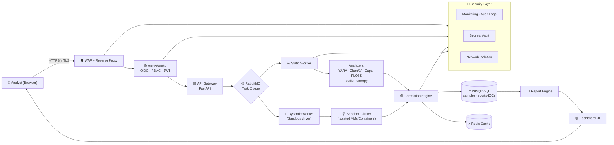
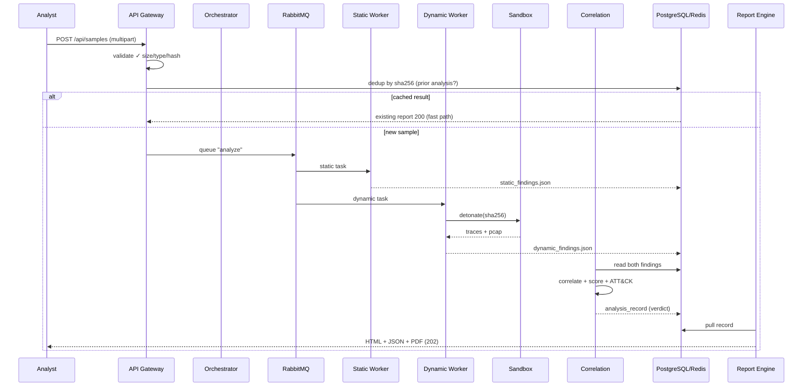

# 🧬 Malware Analysis Automation Pipeline — Architecture

> **Submit Sample → Static + Dynamic Analysis → Unified Security Report**

| Attribute | Value |
|---|---|
| 🏷️ **Project** | Malware Analysis Automation Pipeline |
| 🌐 **Form Factor** | Portable Web-Based Solution (100% Dockerized) |
| 🔐 **Security Baseline** | ISO/IEC 27001:2022 · NIST SP 800-53 / CSF 2.0 · OWASP Top 10 (2021) |
| 🎯 **Input** | Malicious sample (PE/ELF/Mach-O, Office docs, scripts, archives) |
| 🎯 **Output** | Unified static + dynamic analysis report (JSON + HTML + PDF) |
| 🏗️ **Primary Stack** | Python 3.12 · FastAPI · Docker Compose · PostgreSQL · Redis · RabbitMQ |
| 🧪 **Analyzers** | YARA, ClamAV, pefile, FLOSS, Capa, Cuckoo/SEEDSandbox, tcpdump |

---

## 🗺️ Table of Contents

1. [Executive Summary](#-executive-summary)
2. [Visual Overview — The Big Picture](#-visual-overview--the-big-picture)
3. [High-Level Architecture Diagram](#-high-level-architecture-diagram)
4. [System Components](#-system-components)
5. [Analysis Pipeline Detail](#-deep-dive--the-analysis-pipeline)
6. [Static Analysis Module 🔍](#-module-static-analysis)
7. [Dynamic Analysis Module 🧪](#-module-dynamic-analysis-sandbox)
8. [Report Generation & Dashboard 📊](#-module-reporting--dashboard)
9. [Data Flow & Lifecycle](#-data-flow--lifecycle-diagram)
10. [Security Framework Mapping](#-security-framework-mapping)
11. [Threat Model — STRIDE](#-threat-model--stride)
12. [Portable Web-Based Deployment](#-portable-web-based-deployment)
13. [API Specification](#-api-specification)
14. [Observability & Compliance Logging](#-observability--compliance-logging)
15. [Resilience & Scaling](#-resilience--scaling)
16. [Roadmap](#-roadmap)

---

## 🌟 Executive Summary

A **containerized, web-driven malware analysis orchestration platform** where analysts submit a suspicious sample through a browser and receive a **correlated static + dynamic behavioral report** automatically.

```
  ┌──────────────┐   Submit    ┌───────────────────────────────┐   Render   ┌──────────────────┐
  │   Web Portal │────────────▶│   Orchestrator / Analyzer     │───────────▶│  Report Engine   │
  │  (Analyst UI)│  sample     │   Pipeline Worker Cluster     │   report   │  HTML · JSON · PDF│
  └──────────────┘             └───────────────────────────────┘            └──────────────────┘
```

- 🔁 **Fully automated** triage → static → dynamic → correlation → report
- 🔐 **Secure by design** — mapped to ISO 27001, NIST, OWASP Top 10
- 📦 **Portable** — single `docker compose up` brings the whole platform online
- 📦 **Isolated sandbox** — malware never runs on the host network

---

## 🗻 Visual Overview — The Big Picture

```text
                            🧬 MALWARE ANALYSIS AUTOMATION PIPELINE
                                   "Submit → Analyze → Report"

                                  ┌─────────────────────────────┐
                                  │         ANALYST / USER     │
                                  │       (Web Browser)        │
                                  └──────────────┬──────────────┘
                                                 │ HTTPS (TLS 1.3, mTLS)
                                                 ▼
                          ┌───────────────────────────────────────────┐
                          │          🟢 WEB GATEWAY LAYER             │
                          │  ┌─────────┐  ┌─────────┐  ┌───────────┐  │
                          │  │NGINX/WAF│──│  AuthN  │──│   API     │  │
                          │  │ rate-🌀 │  │  OIDC   │  │  Gateway  │  │
                          │  └─────────┘  └─────────┘  └─────┬─────┘  │
                          └──────────────────────────────────┼────────┘
                                                             ▼
                    ┌────────────────────────────────────────────────────────┐
                    │        🟡  ORCHESTRATION / CONTROL PLANE              │
                    │  ┌────────────┐  ┌─────────┐  ┌───────────────────┐   │
                    │  │  FastAPI    │  │RabbitMQ │  │  Task Worker      │   │
                    │  │ Orchestrator│⇄│  Broker │⇄│  (Celery/Arq)     │   │
                    │  └────────────┘  └─────────┘  └────────┬──────────┘   │
                    └────────────────────────────────────────┼──────────────┘
                                                             ▼ delegate
        ┌─────────────────── STATIC PATH ───────────────────────┐
        │                                                       │
        ▼                                                       ▼
┌───────────────────────┐                          ┌──────────────────────────┐
│  🔍 STATIC ANALYZERS  │                          │  🧪 DYNAMIC ANALYZERS     │
│  ├─ Hashing / FNV      │                          │   (Sandbox Cluster)       │
│  ├─ Detection ratio    │                          │  ┌────────────────────┐   │
│  ├─ PE / ELF / Mach-O  │                          │  │  Detonation Node   │   │
│  ├─ YARA rules         │                          │  │  Windows / Linux   │   │
│  ├─ ClamAV signature   │                          │  │  Linux  (isolated) │   │
│  ├─ FLOSS / strings    │                          │  ├─ Core dumps        │   │
│  ├─ Capa capabilities  │                          │  ├─ Syscall/API logs  │   │
│  ├─ Entropy analysis   │                          │  ├─ File/Registry ops │   │
│  ├─ Anti-VM detection  │                          │  └─ Network (tcpdump) │   │
│  └─ ImpHash / hashing  │                          └──────────┬─────────────┘
└───────────┬────────────┘                                     │
            │ raw findings                                     │ raw findings
            ▼                                                  ▼
┌────────────────────────────────────────────────────────────────────┐
│        🟣 CORRELATION & SCORING ENGINE                             │
│   ├─ IOC extraction  (IP / URL / Domain / Hash / Mutex / Services) │
│   ├─ Behavior matrix (registry/file/net/process persistence)      │
│   ├─ MITRE ATT&CK tactic mapping                                  │
│   └─ Risk scoring  ─────────────────▶  verdict: BENIGN|SUSPICIOUS|MALICIOUS
└────────────────────────────────┬───────────────────────────────────┘
                                 ▼
              ┌──────────────────────────────────────┐
              │  📊 REPORTING & DASHBOARD            │
              │  HTML report · JSON bundle · PDF/A   │
              │  Trend graphs · Search · Export/API  │
              └──────────────────────────────────────┘
```

---

## 🏗️ High-Level Architecture Diagram



> 💡 **Design philosophy**: *Separation of Concerns* → every layer is independently redeployable, scalable, and auditable.

---

## 🧩 System Components

| # | Component | Tech | Purpose | Security Mapping |
|---|-----------|------|---------|------------------|
| 1 | **Web Portal** | React + Vite | Upload samples, view reports, dashboards | OWASP A01 · ISO A.8.2 |
| 2 | **API Gateway** | FastAPI | REST endpoints, validation, rate limiting | OWASP A01/A02 · NIST PE / SI |
| 3 | **Auth Service** | Keycloak / Tailscale OIDC | SSO, MFA, RBAC, JWT | ISO A.5.15–A.5.18 · NIST IA |
| 4 | **Orchestrator** | FastAPI + Celery/Arq | Job scheduling, retries, dedup | NIST CP · AC |
| 5 | **Message Broker** | RabbitMQ | Async task pipeline | ISO A.8.29/30 · NIST SC |
| 6 | **Static Analyzers** | YARA, ClamAV, Capa, FLOSS, pefile, lief, yara-python | File-level intel | NIST RA · ISO A.8.8 |
| 7 | **Dynamic Sandbox** | SEED/Cuckoo-style, QEMU, Firejail | Behavioral detonation in isolation | ISO A.8.26–A.8.28 · NIST SC-7 |
| 8 | **Correlation Engine** | Python engines | IOC extraction, MITRE ATT&CK, scoring | NIST NIST 800-53 · ISO A.5.28 |
| 9 | **Report Engine** | WeasyPrint + Jinja2 | HTML/JSON/PDF generation | NIST AU / SI · ISO A.8.12 |
| 10 | **Data Layer** | PostgreSQL, Redis, MinIO(S3) | Metadata, cache, artifact blob storage | ISO A.8.10 · NIST SC-28 |
| 11 | **Logging & SIEM** | Loki, Prometheus, Grafana, OpenSearch | Observability + audit trail | ISO A.8.15/16 · NIST AU |
| 12 | **Secret Manager** | HashiCorp Vault / Docker secrets | Credentials, API keys | ISO A.8.2 · NIST AC-3 |

---

## 🔬 Deep Dive — The Analysis Pipeline

```text
  SAMPLE
    │  ("bytes")
    ▼
┌─────────────────────────────────────────────────────────────┐
│  1. INGEST        sha256 dedup · size limit · type sniff    │
│  2. TRIAGE        antivirus ratio · rapid yara · entropy    │
│  3. STATIC        deep file analysis (offline tools)        │
│  4. DYNAMIC       sandbox detonation (2–5 min, controlled  │
│                   network + host, API/registry/file logging)│
│  5. CORRELATE     merge findings → behavior matrix + IOCs   │
│  6. SCORE         heuristic + ML risk score 0–100, verdict  │
│  7. REPORT        render HTML/JSON/PDF, store, notify       │
└─────────────────────────────────────────────────────────────┘
      │
      ▼
  VERDICT + REPORT delivered to analyst (and webhook/API consumer)
```

### Pipeline Stage Gate Summary

| Stage | Tools | Output Artifact | SLA Target |
|---|---|---|---|
| 1 · Ingest | Python `magic`, hashlib | `sample.sha256`, mime, size | < 5 s |
| 2 · Triage | ClamAV, fast YARA, entropy | triage verdict + score | < 30 s |
| 3 · Static | pefile, FLOSS, Capa, YARA, strings | JSON findings | < 90 s |
| 4 · Dynamic | Sandbox detonation | process/API/reg/fs/network trace | 2–5 min |
| 5 · Correlate | IOC extractor, MITRE mapper | enriched `analysis_record` | < 10 s |
| 6 · Score | Heuristic rules + ML scoring | risk 0–100, verdict | < 5 s |
| 7 · Report | Jinja2/WeasyPrint/Pydantic | HTML + JSON + PDF | < 20 s |

---

## 🔍 Module: Static Analysis

```text
  ┌──────────────────────────────────────────────────────────────┐
  │                  STATIC ANALYSIS WORKER                     │
  │  filename.bin ────────────────────────────────► findings.json│
  │                                                             │
  │   [ MD5 / SHA1 / SHA256 ]      [ PE Header / Import table ] │
  │   [ SSDeep / TLSH ]            [ ELF / Mach-O metadata ]    │
  │   [ YARA rule match ]          [ .NET metadata (dnfile) ]   │
  │   [ ClamAV signature ]         [ OLE/Office macros ]        │
  │   [ FLOSS deobfuscated strings][ Packers / entropy spikes ] │
  │   [ Capa capability rules ]    [ Anti-VM / debug checks ]   │
  │   [ Emulation: capstone/lief ] [ ImpHash / Rich header ]    │
  └──────────────────────────────────────────────────────────────┘
```

### Key Static Metrics

| Metric | Tool | Output |
|---|---|---|
| Fidelity Hash | SSDeep / TLSH | fuzzy match for variant detection |
| Capability | Capa | `ATT&CK technique` + capability labels |
| Obfuscation | YARA + entropy | packing ratio, section anomaly |
| Binary Metadata | pefile / lief | timestamps, imports, cert signing |
| Hardcoded IOCs | FLOSS + regex | C2 IPs, URLs, mutexes, domains |

---

## 🧪 Module: Dynamic Analysis Sandbox

```text
   ┌───────────────────────────────────────────────────────────────┐
   │                  SANDBOX CLUSTER (DETONATION)                │
   │                                                              │
   │   Driver issue command ───► "detonate" ──► network namespace  │
   │                                                │             │
   │   ┌─────────────────┐   ┌─────────────────┐   ▼   ┌─────────┐│
   │   │ WIN VM (Win10)  │   │ Linux VM/Ctr    │   INET │ Fake    ││
   │   │ detonated sample│   │ detonated sample│   (opt) │ C2/HTTP││
   │   └────────┬────────┘   └────────┬────────┘     │ sinkhole││
   │            │ traces             │ traces       └─────────┘│
   │            ▼──────┬─────────────▼───────┐                  │
   │   [API/SSDT call log] [File + reg ops] [Process tree]      │
   │   [Network: tcpdump pcap→suricata] [Screenshots]           │
   │   [Core dumps / memory snapshots] [C2 beacon cadence]      │
   └────────────────────────────────────────────────────────────┘
```

### Isolation Controls (crucial for portable + safe operation)

| Control | Implementation |
|---|---|
| 🛑 Network isolation | Firejail netns / `--network none`, fake DNS sinkhole |
| 🛑 Host isolation | Read-only root, no host mounts, dedicated internal vLAN |
| 🛑 Reputation | Analyzer just pulls evidence; detonation on ephemeral nodes |
| 🛑 Cleanup | Post-run snapshot revert, disk wipe, artifact exfiltration |
| 🛑 Timebox | Hard kill timer (default 300 s), OOM / CPU quotas |
| 🛑 Mutation | Random hostname/IP, GENUINE wall-clock for anti-sandbox evasion |
| ⏱️ Deep behavior | Procmon-style events, ETW on Windows node |

---

## 📊 Module: Reporting & Dashboard

```text
  report.json ⇄ correlation engine ⇄ PostgreSQL
                       │
                       ▼
   ┌─────────────── CORRELATED REPORT —───────────────┐
   │ † Sample meta        (hash, size, mime, timing)   │
   │ † Detection ratio    (ClamAV + YARA family wins)  │
   │ † IOCs               (IP · URL · domain · mutex)  │
   │ † Behavior matrix    (persistence, evasion, C2)   │
   │ † MITRE ATT&CK       (tactics/techniques mapped)  │
   │ † Risk Score         (0–100) + Verdict            │
   │ † Timeline           (detonation event sequence)  │
   │ † Network flows      (pcap summary → Suricata EVE)│
   └───────────────────────────────────────────────────┘
        │                      │
        ▼                      ▼
   📄 PDF / HTML          🧾 JSON (machine-readable, for SIEM ingest)
```

**Dashboard capabilities**: search by hash/IOC · verdict trends · YARA rule coverage · top families · sample-to-IOC graph view.

---

## 🔄 Data Flow & Lifecycle Diagram



---

## 🔐 Security Framework Mapping

### 1️⃣ ISO/IEC 27001:2022 Appendix A — Controls Coverage

| Control Domain | Controls | Where Applied |
|---|---|---|
| **A.5 — Organizational** | A.5.1 policies · A.5.15–18 access control · A.5.28 data collection | Docs repo, RBAC, OIDC, retention |
| **A.6 — People** | A.6.3 awareness training | Analyst onboarding, red-team drills |
| **A.7 — Physical** | A.7.10 clean desk (disk wipe) | Ephemeral sandbox rebuild |
| **A.8 — Technological** | A.8.2 privilege mgmt · A.8.8 malware protection · A.8.10 information deletion · A.8.12 prevention of leak · A.8.15/16 logging · A.8.26–29 app/infra security · A.8.30 network design · A.8.31 separation of environments | WAF, ClamAV, sandbox isolation, audit logs, VLANs, prod/dev split |
| **A.9 — Physical & Environmental** | (CI) backup, redundancy | Cloud volume snapshots |

### 2️⃣ NIST Compliance

**NIST Cybersecurity Framework (CSF 2.0) — Functions:**

| Function | Capability Delivered |
|---|---|
| **GOVERN** | PDPL, risk register, vendor policy (analyzer toolchain) |
| **IDENTIFY** | Asset inventory, sample catalog, IOC taxonomy |
| **PROTECT** | mTLS, RBAC, sandbox isolation, secrets vault, MFA |
| **DETECT** | AI/ML risk score, YARA telemetry, anomaly on detonation logs |
| **RESPOND** | Automatic quarantine, kill-switch on detonation hosts |
| **RECOVER** | Snapshot revert, image rebuild, report re-generation |

**NIST SP 800-53 (selected):**

| Control | Reference | Implementation |
|---|---|---|
| Access Control | **AC-2 / AC-3 / AC-6** | RBAC + least privilege per service account |
| Awareness & Training | **AT-2 / AT-3** | Quarterly sandbox safety training |
| Audit Logging | **AU-2 / AU-3 / AU-12** | Centralized Redactable audit pipeline |
| Boundary Protection | **SC-7** | Internal analysis VLAN, no outward access in sandbox |
| Transmission Integrity | **SC-8 / SC-13** | TLS 1.3 everywhere, HSM-backed keys |
| System & Information Protection | **SI-2 / SI-4 / SI-10** | Patch pipeline, SIEM, input validation |
| Supply Chain | **SR-4/11** | Pinned analyzer images + SBOM (`syon`) |

### 3️⃣ OWASP Top 10 (2021) Coverage

| Rank | OWASP A | Mitigation Element |
|---|---|---|
| **A01** | Broken Access Control | OIDC + RBAC + per-call `check_perm`; no IDOR (UUIDs), method whitelist |
| **A02** | Cryptographic Failures | TLS 1.3, AES-256-GCM at rest, Vault managed keys, no plaintext creds |
| **A03** | Injection | Parameterized ORM, strict file-type sniffing, `validate_sample()` schema |
| **A04** | Insecure Design | Threat model (STRIDE, below); rate limits on upload & API |
| **A05** | Security Misconfiguration | `compose` hardening, hardened nginx.conf, no debug in prod, image pinning |
| **A06** | Vulnerable Components | **SBoM + daily CVE scan (Trivy/OSV)**; auto-rebuild on critical CVEs |
| **A07** | Identity & AuthN Failures | MFA enforced, short-lived JWT, session rotation |
| **A08** | Software & Data Integrity | Signed uploads, hash verification, detonation requires valid artifact |
| **A09** | Logging & Monitoring Failures | W3C + audit logs, Loki, Prometheus alerts, SIEM forward |
| **A10** | SSRF | Sandbox DNS sinkhole, URL filter allow-list, `localhost` blocked |

---

## 🛡️ Threat Model — STRIDE

| STRIDE | Attack Example | Control |
|---|---|---|
| **S**poofing | Analyst impersonation | mTLS, OIDC, MFA |
| **T**ampering | Sample swap / report tamper | SHA256 pinning, signed report bundles |
| **R**epudiation | Malicious remote actions | Immutable audit log (WORM object store + hashing chain) |
| **I**nformation disclosure | Report exfiltration | RBAC + per-sample ACL + DLp on renders |
| **D**enial of service | Upload flood | Rate limit, size cap, runtime timebox |
| **E**levation of privilege | Sandbox escape attempt | Firejail seccomp, no capabilities, kernel isolation, disposable nodes |

**Assumptions & Trust Boundaries:**

```text
[Internet / Browser] ─ TLS ─▶ [WAF] ─▶ [App Tier] ─ mTLS ─▶ [Workers] ─▶ [Sandbox ⛔ isolated]
        untrusted           semitrusted         trusted            trusted          fully untrusted
```

---

## 📦 Portable Web-Based Deployment

The entire stack ships as **Docker Compose** — one command, fully offline-capable, platform-agnostic.

```text
┌─────────────────────────── docker-compose.yml ────────────────────────────┐
│                                                                          │
│  UI          fastapi_api    worker_static    worker_dynamic              │
│  nginx:1.27  :8000          :9001           :9002                        │
│  ───────     ────────       ──────────      ───────────                  │
│  ┌───────┐   ┌──────┐       ┌──────┐        ┌────────────┐               │
│  │ React │   │Fast  │       │YARA🗄 │        │ Firejail   │               │
│  │ SPA   │──▶│API   │──────▶│ClamAV│        │ SandboxNode│               │
│  │  :3000│   │      │       │capa  │        │ QEMU host   │               │
│  └───────┘   └──────┘       └──────┘        └────────────┘               │
│                                                                          │
│  rabbitmq:3   redis:7    postgres:16 minio(S3)   prometheus  grafana     │
│  ─────────    ───────    ─────────── ─────────   ──────────  ────────    │
│  queue+broker  cache     metadata+   artifact   metrics     dashboard    │
│                           reports     blobs     scrape                    │
└──────────────────────────────────────────────────────────────────────────┘
        ▲ offline images exported via `docker save` → air-gapped mirror
```

### Single-Command Startup

```bash
# 1. clone / unpack the portable bundle
git clone <repo> malware-pipeline && cd malware-pipeline

# 2. one-command bring-up (all services + isolated networks)
docker compose up -d --wait

# 3. UI + API
open http://localhost:3000        # analyst portal
open http://localhost:8001/docs   # OpenAPI (swagger)

# 4. offline drift: no internet needed at runtime (pinned images + local rules)
docker compose exec static refresh-rules --local
```

### Container Manifest (high level)

| Service | Image (pinned digest) | Port | Network Zone |
|---|---|---|---|
| `frontend` | `node:20-alpine` (build) → nginx | 3000 | `app` |
| `api` | `python:3.12-slim` | 8000/8001 | `app` |
| `worker-static` | `python:3.12-slim` + analyzers | – | `app` |
| `worker-dynamic` | sandbox-driver image | – | `sandbox` only |
| `sandbox-node` | Firejail/QEMU host | – | `sandbox` (no egress) |
| `rabbitmq`, `redis`, `postgres`, `minio` | official pin | – | `data` |
| `prometheus`, `grafana`, `loki` | pin | 9090/3001 | `monitor` |

> ⚠️ **Sandbox egress rule**: `sandbox` network has **no default route** — defined only `sinkhole` (fake DNS/HTTP) + `artifact-exfil` back to the pipeline.

---

## 🔌 API Specification

| Method | Path | Auth | Description |
|---|---|---|---|
| `POST` | `/api/v1/samples` | Analyst | Upload sample (multipart, ≤ 300 MB) |
| `GET` | `/api/v1/samples/{id}` | Analyst | Sample metadata + status |
| `GET` | `/api/v1/samples/{id}/report` | Analyst/Bot | Full JSON report |
| `GET` | `/api/v1/samples/{id}/report.pdf` | Analyst | PDF render |
| `GET` | `/api/v1/iocs?type=ip` | Analyst | Query IOC DB |
| `GET` | `/api/v1/mitre/{technique}` | Analyst | ATT&CK mappers |
| `POST` | `/api/v1/analyze/url` | Analyst | Non-detructive URL triage |
| `GET` | `/api/v1/jobs/{job_id}` | Analyst | Poll job status |
| `GET` | `/health`, `/ready` | none | Liveness/readiness probes |

```json
// POST /api/v1/samples (200)
{
  "sample_id": "9f4c…ac1",
  "sha256": "9f4c5a…c1ab",
  "status": "queued",
  "links": { "report": "/api/v1/samples/9f4c…ac1/report" }
}
```

---

## 📈 Observability & Compliance Logging

```text
                      ┌────────────────────────────┐
  samples submits ───▶│  AUDIT LOG STREAM          │──▶ OpenSearch/Loki (WORM)
  analysis events ───▶│  • actor, action, sha256   │    msg=┌ aux-audit
  verdicts      ───▶│  • timestamp, outcome       │
  admin changes ───▶│  • immutable hash chain      │
                      └────────────────────────────┘
                              │
                              ▼
   Prometheus ──scrape──▶ metrics: jobs_in_flight · analysis_seconds ·
                        verdict_distribution · sandbox_crashes · queue_depth
   Grafana    ──render──▶ SLA dashboards · capacity · incident panels
   Alertmanager ─ alert ─▶ webhook → MS Teams / Slack / PagerDuty
```

**Compliance artifact**: every analysis produces an *audit record* `(actor, action, sha256, verdict, dt, log_hash)` — satisfies ISO A.8.15 / NIST AU-3 and enables RegEx non-repudiation.

---

## 🧗 Resilience & Scaling

| Concern | Strategy |
|---|---|
| **Scalability** | Stateless API + workers → `docker compose scale worker-static=4` |
| **Reliability** | RabbitMQ persistent queues, retry w/ exponential backoff, dead-letter head-up |
| **Bursts** | Redis-backed rate limiter, upload quota, priority queues (triage > deep) |
| **Recovery** | Sandbox nodes stateless & rebuilt; Postgres snapshots every 6h · MinIO versioning |
| **Chaos** | Weekly kill-a-node drill; report regeneration from immutable records |

---

## 🗓️ Roadmap

| Phase | Milestone | Deliverable |
|---|---|---|
| **P0** | Core pipeline v1 | Submit → static → dynamic → JSON report |
| **P1** | Reporting & UI | Dashboard, PDF export, IOCs, ATT&CK mapping |
| **P2** | Hardening | ISO/NIST/OWASP evidence pack, SBOM, audits |
| **P3** | Intel integrations | VirusTotal/MalwareBazaar lookup, MISP feed, TAXII |
| **P4** | ML scoring | Behavior-based ML classifier (detonation traces) |
| **P5** | Air-gap mode | Fully offline bundle + embedded rule mirrors |

---

## ✅ Architecture Decision Records (Signpost)

| ADR | Decision |
|---|---|
| **ADR-001** | FastAPI over Django REST → small, typed, async, OpenAPI-first |
| **ADR-002** | Celery/Arq + RabbitMQ over sync handlers → resilience + scale-out |
| **ADR-003** | Dockerized sandbox (Firejail) first, QEMU VM as option → portable & cheap |
| **ADR-004** | Postgres + MinIO (S3) over monolithic FS → versioning, ACL, auditability |
| **ADR-005** | All secrets in Vault/Docker-secrets — never in `compose.yaml` env |

---

> 🛡️ **Guardrail**: This pipeline *analyzes* malware. Never copypaste live samples onto production/unrelated hosts — always keep the analysis ring isolated, timeboxed, and audited. The architecture above enforces that by design.

---

*Generated for Project №63 — "Malware analysis automation pipeline (submit sample → static + dynamic report)"*