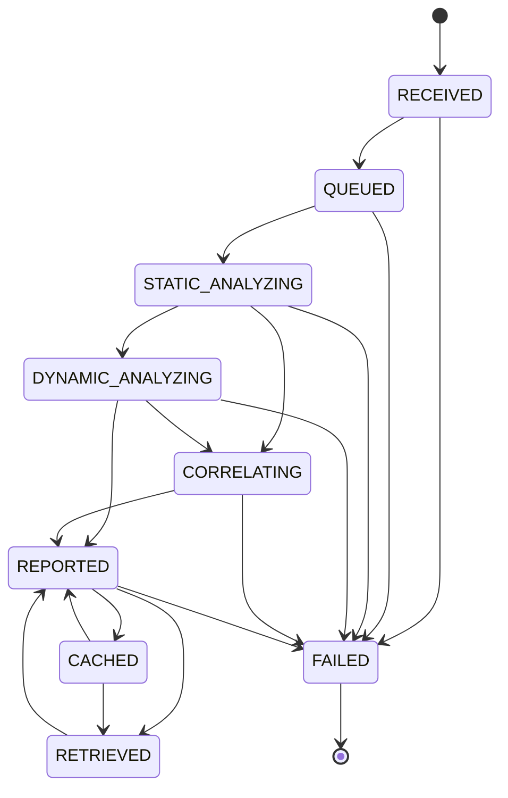

# 🚦 state.md — State Model & Persistence (Portable EXE Solution)

> **Reservation record** for the state machine and durable state of the portable workbench.
> Covers: analysis-job states, legal transitions, dedup/cache fast-path states,
> `cache/state.json` schema, GUI interaction states, failure & recovery handling.

---

## 1. 🗺️ Why a Formal State Model?

A portable analyzer must be **idempotent and resumable**:
- Same SHA256 → never re-analyzed needlessly (dedup).
- Every lifecycle step is observable in the UI and recorded on disk.
- Failed jobs never masquerade as completed reports.

---

## 2. ⚙️ Analysis-Job State Machine

Approved states (`store.STATUSES`):

```text
RECEIVED ──▶ QUEUED ──▶ STATIC_ANALYZING ──┬─▶ DYNAMIC_ANALYZING ──▶ CORRELATING ──▶ REPORTED ──┬─▶ CACHED ──▶ RETRIEVED
    │           │           │              │         │                │              │          │        ▲
    │           │           │              └─────────▶ CORRELATING ────┘              │          └────────┘
    └───────────┴───────────┴──▶ FAILED ◀──┴─────────▶ FAILED ◀────────┴──────────────┴────────▶ FAILED
```



---

## 3. 📝 Transition Table

| From | To | Trigger | Side effect |
|---|---|---|---|
| — | RECEIVED | `state.register_sample(sha256)` | new entry + counter++ (or last_analyzed_at refresh) |
| RECEIVED | QUEUED | pipeline start | status timestamp written |
| QUEUED | STATIC_ANALYZING | static stage starts | — |
| STATIC_ANALYZING | DYNAMIC_ANALYZING | behavioral run enabled | only when `enable_dynamic` |
| STATIC_ANALYZING | CORRELATING | dynamic skipped/disabled | — |
| DYNAMIC_ANALYZING | CORRELATING | detonation returned | events/evidence attached |
| CORRELATING | REPORTED | scoring + MITRE + files saved | reports written, cache.put() |
| REPORTED | CACHED | memory cache insert | LRU eviction may kick oldest |
| CACHED | RETRIEVED | history double-click / hash hit | report served w/o re-analysis |
| REPORTED | RETRIEVED | new submit hits same hash | dedup fast path |
| RETRIEVED | REPORTED | analyst re-renders record | files refreshed |
| * | FAILED | exception in any stage | audit ERR + UI failure state |

**Illegal transitions are rejected** by `store.VALID_TRANSITIONS` (returns `False`, no write).

---

## 4. 💾 Durable State — `cache/state.json`

```json
{
  "samples": {
    "<sha256>": {
      "status": "REPORTED",
      "registered_at": "2026-09-23T10:00:00Z",
      "last_analyzed_at": "2026-09-23T10:00:05Z",
      "status_changed_at": "2026-09-23T10:00:06Z",
      "source": "new",
      "file": "sample.exe",
      "notes": [ {"at": "...", "note": "..."} ]
    }
  },
  "counters": { "total_samples": 12 }
}
```

- Atomic writes: JSON serialized to `state.json.tmp` then `os.replace()` (crash-safe).
- Audit trail is a **separate append-only** file `cache/actionlog.jsonl` (never rewritten).

---

## 5. 🧠 Fast-Path: Dedup & Cache States

```text
       submit ─► sha256 ─► cached? ──yes──► [CACHED → RETRIEVED]  serve old record
                              │
                              no ▼
                        full pipeline ─► [REPORTED → CACHED]
```

- Fast path keeps **queue time ≈ 0** for repeat samples.
- Cache notices are recorded: `state.transition(sha256,"CACHED")` + audit `dedup-hit`.

---

## 6. 🖥️ GUI UI States (Workbench)

| UI state | Condition | Elements |
|---|---|---|
| **Idle** | no job running | buttons enabled, progress stopped, status "Idle." |
| **Running** | worker thread alive | Run button disabled, progress spinner, pipeline log streaming |
| **Completed** | `done` event | spinner stops, gauge + verdict painted, tabs populated, audit/history refreshed |
| **Failed** | `error` event | spinner stops, Run enabled, log shows ERROR line, state = FAILED, audit ERR |
| **Cache-hit** | record served from memory | "served from cache (dedup)" message, verdict from cache |

Thread communication is a single-thread-safe `queue.Queue`; the Tk main loop polls every 120 ms.
**All widget mutation happens on the Tk thread only** — the worker thread never touches widgets.

---

## 7. 🔁 Failure & Recovery Paths

| Failure | State | Recovery |
|---|---|---|
| File unreadable / oversize | reject before submit | error dialog, no state write |
| Static analyzer exception | FAILED | error logged, quarantine copy retained for manual review |
| Opt-in execution crash/timeout | DYNAMIC → timeout event, job completes | status `timeout`, process killed, evidence = "timebox exceeded" |
| Report write error | FAILED | error surfaced; cache untouched |
| Corrupt `state.json` | `_load_json` fallback | empty in-memory store rebuilt on next save |
| Corrupt `memory.json` | `_load_json` fallback | cache reset; reports on disk remain valid |

---

## 8. 🔒 State Security Properties

- Hash-keyed → no accidental cross-sample data; dedup is content-addressed.
- Append-only audit + atomic writes → non-repudiation of the *act of analysis*.
- FAILED never carries a verdict payload → heuristics can't silently mislabel.
- `data_dir()` is portable: frozen EXE keeps state next to the executable (`cache/`).

---

*Reserved as the state record for Project №63 — portable malware analysis workbench.*