# 🔐 SecureNote Pro — Comprehensive Security Architecture

> **A Zero-Trust, Locally-Encrypted Note-Taking Application with Biometric Lock, Continuous Audit Trail & Compliance Reporting**


---

## 📑 Table of Contents

1. [Executive Summary](#-1-executive-summary)
2. [Security Objectives & Principles](#-2-security-objectives--principles)
3. [High-Level System Architecture](#-3-high-level-system-architecture)
4. [Component Responsibilities](#-4-component-responsibilities)
5. [Cryptographic Architecture (Local Encryption)](#-5-cryptographic-architecture-local-encryption)
6. [Biometric Lock & Authentication Flow](#-6-biometric-lock--authentication-flow)
7. [Data Model & Storage](#-7-data-model--storage)
8. [Threat Modeling — STRIDE](#-8-threat-modeling--stride)
9. [Security Framework Compliance Mapping](#-9-security-framework-compliance-mapping)
   - [9.1 ISO/IEC 27001:2022](#91-isoiec-270012022)
   - [9.2 NIST Cybersecurity Framework (CSF 2.0)](#92-nist-cybersecurity-framework)
   - [9.3 OWASP Top 10 (2021)](#93-owasp-top-10-2021)
   - [9.4 Additional Frameworks: SOC 2, CIS, GDPR](#94-additional-frameworks)
10. [Audit & Assurance Module](#-10-audit--assurance-module)
11. [Comprehensive Report Generation & Download](#-11-comprehensive-report-generation--download)
12. [Key Management Lifecycle](#-12-key-management-lifecycle)
13. [Secure Development Lifecycle (SDLC)](#-13-secure-development-lifecycle-sdlc)
14. [Zero-Trust Architecture Model](#-14-zero-trust-architecture-model)
15. [Disaster Recovery & Offline Resilience](#-15-disaster-recovery--offline-resilience)
16. [Performance & Usability Balancing](#-16-performance--usability-balancing)
17. [Roadmap & Future Enhancements](#-17-roadmap--future-enhancements)
18. [Appendix: Security Controls Checklist](#-appendix-security-controls-checklist)

---

## 🧭 1. Executive Summary

**SecureNote Pro** is a **privacy-first**, **offline-first** note-taking application built around the philosophy that **"your notes belong to you, only you."** Every note is encrypted **locally on-device** using industry-standard cryptography before it ever touches disk — no cloud servers, no telemetry, no plaintext persistence.

The application enforces **biometric authentication** (Face ID / Touch ID / Fingerprint / Windows Hello) as its primary unlock mechanism, with a hardened Master Passphrase fallback, wrapped in a **Zero-Knowledge Key Derivation** scheme.

> 🎯 **Core Pillars**
>
> | Pillar | Guarantee |
> |---|---|
> | 🔒 **Confidentiality** | AES-256-GCM encryption; nothing readable leaves the device |
> | 🔑 **Key Security** | Master keys derived via Argon2id PBKDF + sealed in Secure Enclave / TPM |
> | 🫵 **Authentication** | Biometric + knowledge-factor (passphrase) multi-layer unlock |
> | 📜 **Accountability** | Tamper-evident, hash-chained audit log of every security event |
> | 📑 **Compliance** | Continuous mapping to ISO 27001, NIST CSF 2.0, OWASP Top 10 |
> | 📥 **Reporting** | One-click **downloadable compliance & audit reports** (PDF/JSON/CSV) |

---

## 🛡️ 2. Security Objectives & Principles

### 2.1 Design Principles

| # | Principle | Description |
|---|-----------|-------------|
| P1 | **Zero-Knowledge** | The app never has access to plaintext data — encryption happens before persistence. |
| P2 | **Zero-Trust Default** | No implicit trust; every operation is authenticated, authorized, and logged. |
| P3 | **Defense in Depth** | Multiple independent layers: crypto → OS sandbox → enclave key storage → auth. |
| P4 | **Least Privilege** | Storage access requires biometric re-verification; background services use minimal scopes. |
| P5 | **Fail-Safe / Fail-Closed** | On any auth/crypto anomaly the vault **locks closed** — never degrades to insecure mode. |
| P6 | **Tamper-Evidence** | Audit log entries chained with SHA-256 hashes — modification is immediately detectable. |
| P7 | **Privacy by Design** | GDPR/SOC 2 aligned: minimal data collection, no tracking, no analytics by default. |
| P8 | **Key Separation** | Distinct keys for data (AES-GCM), integrity (HMAC), and identity (PBKDF derived). |

### 2.2 Security Goals

```mermaid
mindmap
  root((SecureNote Pro))
    Confidentiality
      AES-256-GCM
      Zero-Knowledge
      No Cloud Plaintext
    Integrity
      HMAC-SHA256
      Hash-Chained Audit
      Checksum Verify
    Availability
      Offline-First
      Sandbox Backup
      Journal Recovery
    Authentication
      Biometric
      Master Passphrase
      RATE_LIMIT Anti-Brute-Force
    Compliance
      ISO 27001
      NIST CSF 2.0
      OWASP Top 10
    Assurance
      Audit Trail
      Report Downloads
      Attestation Logs
```

---

## 🏗️ 3. High-Level System Architecture

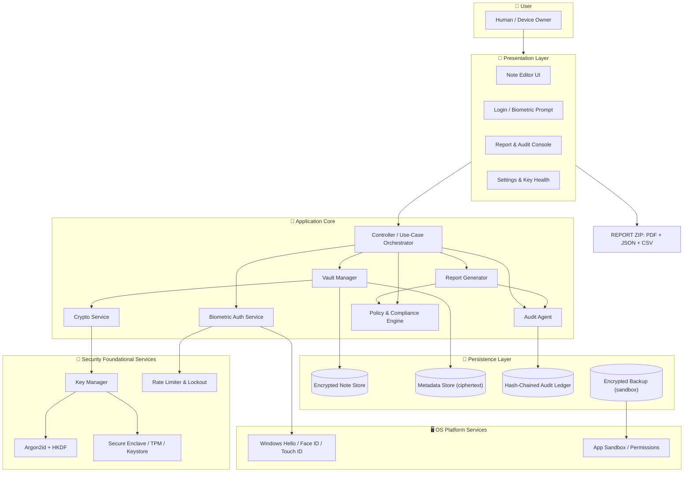

---

## 🧩 4. Component Responsibilities

| Component | Responsibility | Key Security Property |
|-----------|----------------|------------------------|
| **Controller / Orchestrator** | Routes user intents, enforces session state machine | Never holds plaintext longer than needed |
| **Biometric Auth Service** | Interacts with OS biometric providers, returns signed challenge responses | Proof-of-presence + liveness (if OS supported) |
| **Vault Manager** | CRUD on notes, atomic journaling, DB encryption orchestration | Atomic, fail-closed transactions |
| **Crypto Service** | AES-256-GCM encrypt/decrypt, HMAC, nonce management, AEAD | Authenticated Encryption (confidentiality + integrity) |
| **Key Manager** | Derivation, wrapping, rotation, vaulting in HSM/Enclave/TPM | Keys never leave secure hardware |
| **KDF Service** | Argon2id (memory-hard) for passphrase → KEK; HKDF for splits | Slow-hash to resist offline brute-force |
| **Rate Limiter** | Exponential lockout + increasing backoff on failed auth | Anti-bruteforce (OWASP A07) |
| **Audit Agent** | Appends immutable, hash-chained events to the ledger | Tamper-evidence via hash chain |
| **Policy Engines** | Resolves compliance gates (ISO/NIST/OWASP) against live telemetry | Continuous attestation |
| **Report Generator** | Renders downloadable PDF/JSON/CSV compliance & audit reports | Signed & timestamped output |
| **Platform Services** | OS-grade biometric + sandboxing + secure key storage | Hardware root of trust |

---

## 🔐 5. Cryptographic Architecture (Local Encryption)

### 5.1 Encryption Blueprint

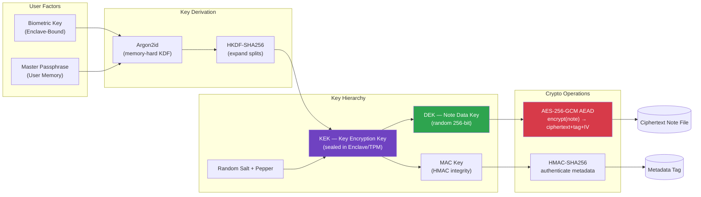

### 5.2 Encryption Algorithm Choices

| Layer | Algorithm / Standard | Rationale |
|-------|----------------------|-----------|
| Note cipher | **AES-256-GCM** (NIST SP 800-38D) | Authenticated Encryption; CCA2-secure; 96-bit random nonces |
| Passphrase → KEK | **Argon2id** (RFC 9106, m=64MiB, t=3, p=4) | Memory-hard; defeats GPU/ASIC offline attacks |
| Key expansion | **HKDF-SHA256** (RFC 5869) | Domain-separated sub-keys |
| Integrity/chaining | **SHA-256 / HMAC-SHA256** | Audit ledger hash-chain & metadata authentication |
| Randomness | **CSPRNG** (OS entropy: CryptGenRandom / getrandom) | NIST SP 800-90A/B approved |
| Enclave sealing | **Secure Enclave / TPM 2.0** (RSA/EC sealed blobs) | Hardware root-of-trust, anti-exfiltration |

### 5.3 Cryptographic Nonces & Key Wrapping

> ⚠️ **Nonce Discipline:** A fresh 96-bit random IV + 128-bit GCM tag is generated per note-write. Never reused. Duplicate IVs are rejected transactionally.

```
Plaintext(note) ──▶ AES-256-GCM ──▶ [ Ciphertext || GCM-Tag || IV ]
                                       │
Key wrap:                              ▼
DEK ── Wrap with KEK ──▶ Keystore blob (enclave sealed) ──▶ Stored as `wrapped_key.bin`
```

| Metadata | Stored As | Plaintext? |
|----------|-----------|-----------|
| Note title index | Encrypted + HMAC-tagged | ❌ No |
| Timestamps | Encrypted | ❌ No (obfuscated with salt) |
| Color/labels (UI hints) | Random nonce + encrypt | ❌ No |
| Key hydration hint | Zero-knowledge guesser string | ⚠️ Partial (prefix-hint only) |

---

## 🫵 6. Biometric Lock & Authentication Flow

### 6.1 Unlock Sequence (State Machine)

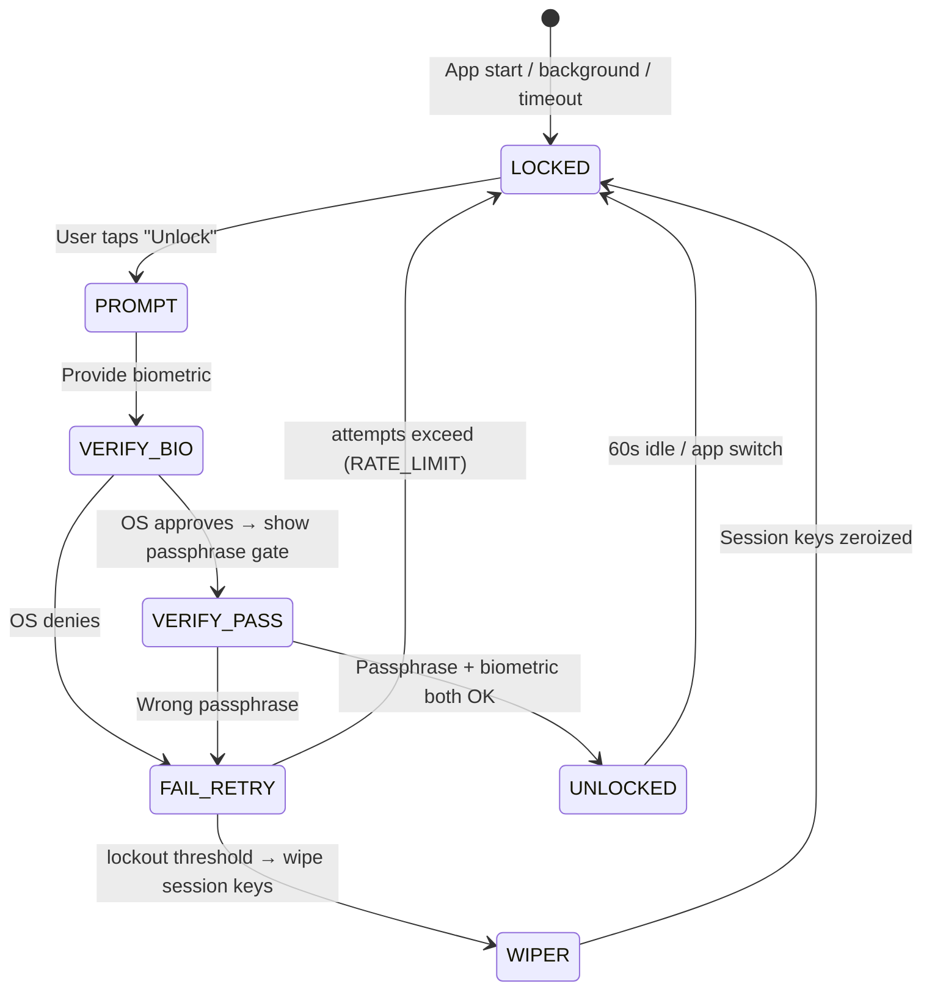

### 6.2 Authentication Guardrails

| Control | Implementation | Related Threat |
|---------|---------------|----------------|
| **Two-Factor Unlock** | Biometric (what you are) + Master passphrase (what you know) | OWASP A07 — Identity errors |
| **Exponential Backoff** | 5 → 30 → 120 → 600 s (per slot) after failures | Brute-force / credential stuffing |
| **Session Pinning** | Vault session bound to app process + device attestation nonce | Replay / session hijack |
| **Biometric Spoof Resistance** | Rely on OS-level liveness & face/fingerprint anti-spoofing | Spoofing |
| **Fallback Chain** | Biometric unavailable → passphrase only (selected by user in settings) | Availability |
| **Zeroize on Lockout** | After 10 consecutive failures, wrapped KEK is destroyed → secure wipe | Data-at-rest theft |

### 6.3 Biometric Enrollment Flow

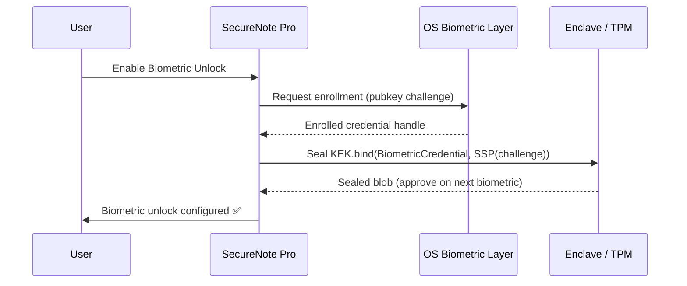

---

## 💽 7. Data Model & Storage

### 7.1 Storage Schema (all values ciphertext)

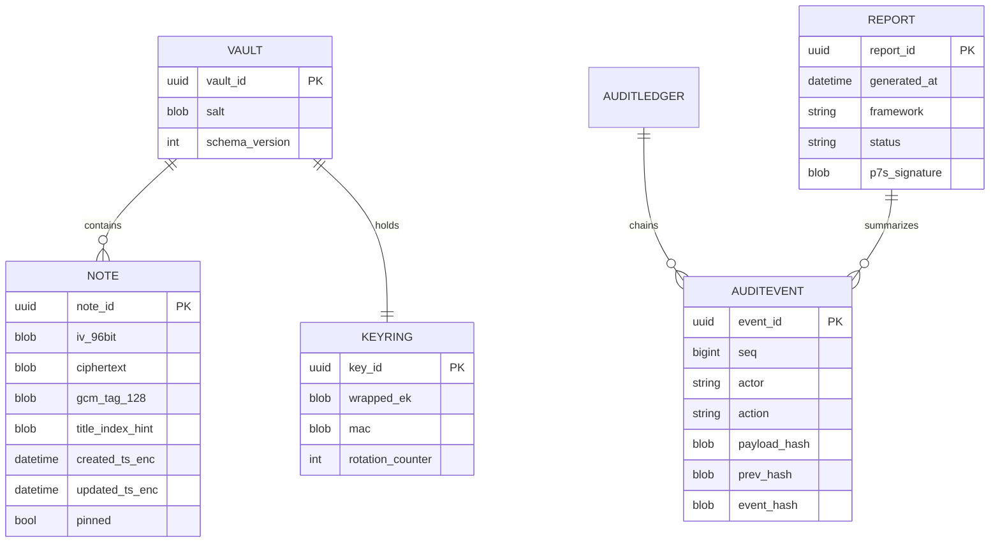

### 7.2 Persistence Rules

- **Data-At-Rest:** Only AEAD ciphertext + HMAC tags. No plaintext on disk — ever.
- **Journaling:** Write-ahead encrypted journal ensures crash consistency (ACID via SQLCipher/FSCK-friendly format).
- **Backups:** Full-vault backup is encrypted with a **fresh random export key**, downloadable and user-managed — separate from runtime key.
- **Metadata Hygiene:** Index/search built over ciphertext-hints only (searchable encryption — deterministic tag scheme, OWASP aware, no content leaks).
- **On-Device Only:** No network egress; network permission absent by default (privacy, NIST PR.PS-1).

---

## 🧨 8. Threat Modeling — STRIDE

| Threat | Description | Mitigation | Mapped Control |
|--------|-------------|-----------|----------------|
| **Spoofing** | Attacker impersonates user via stolen passphrase | Biometric presence + Argon2id + device attestation | ISO A-8.2, NIST PR.AA-1 |
| **Tampering** | Modify notes / audit entries | HMAC-SHA256 + hash-chained audit ledger | ISO A-8.27, NIST PR.DS-6 |
| **Repudiation** | User denies actions | Immutable signed audit trail (non-repudiation) | ISO A-8.16 |
| **Information Disclosure** | DB leak on device theft | AES-256-GCM + enclave-wrapped KEK + zeroize | ISO A-8.24, NIST PR.DS-1 |
| **Denial of Service** | Repeated unlock attempts | Rate limiting, lockouts, fail-closed | ISO A-8.26, NIST PR.IR-4 |
| **Privilege Escalation** | Bypass vault to read keys | Sandbox + enclave + least privilege | ISO A-8.28, NIST PR.AC-4 |
| **Malware / Supply Chain** | Compromise through dependencies | SBOM, signature verification, reproducible builds | NIST SR-4, ISO A-8.29 |

---

## ✅ 9. Security Framework Compliance Mapping

### 9.1 ISO/IEC 27001:2022

| ISO Control (Annex A) | Implementation Evidence in SecureNote Pro |
|-----------------------|-------------------------------------------|
| **A-5.15** Access Control | Biometric + passphrase two-factor unlock |
| **A-8.2** User Authentication (new) | OS-native biometric authentication |
| **A-8.12** Data Masking | Plaintext held in memory w/ zeroization; UI hints masked |
| **A-8.24** Use of Cryptography | AES-256-GCM + Argon2id + HKDF full-stack |
| **A-8.25** Development & QA | Threat modeling & SAST/DAST in CI |
| **A-8.26** Application Security | OWASP-informed code review gates |
| **A-8.27** SDLC security | Reproducible builds, signed binaries |
| **A-8.28** Security coding | SCA + vuln scanning before merge |
| **A-8.29** Security testing | DAST, fuzzing, crypto test vectors (NIST CAVP) |
| **A-8.16** Monitoring activities | Continuous audit engine + health dashboard |
| **A-8.9** Configuration | Minimal permissions; no network unless enabled |
| **A-8.10** Info deletion | Secure wipe (zeroize) on lockout / de-enrollment |

### 9.2 NIST Cybersecurity Framework

| NIST CSF Function | Category | SecureNote Pro Control |
|-------------------|----------|------------------------|
| **GOVERN** | GV.RM | Policy engine maps controls → frameworks continuously |
| **IDENTIFY** | ID.AM-2 | Software inventory + SBOM tracked |
| **IDENTIFY** | ID.RA-4 | Threat-model high-level risk register |
| **PROTECT** | PR.DS-1/2 | Data-at-rest encrypted (AES-256-GCM) |
| **PROTECT** | PR.AA-1/3 | Identity managed: biometrics + revocation |
| **PROTECT** | PR.PS-1 | Configuration & offline-first posture |
| **PROTECT** | PR.AT-1 | In-app security awareness hints (small nudges) |
| **DETECT** | DE.CM-1 | Audit agent monitors unlock events & anomalies |
| **DETECT** | DE.CM-4 | Malware-resistance checks (integrity of binary) |
| **RESPOND** | RS.RP-1 | Lockout & secure-wipe response playbooks |
| **RECOVER** | RC.RP-1 | Encrypted backup restore path + recovery passphrase |

### 9.3 OWASP Top 10 (2021)

| OWASP | Category | Mitigation |
|-------|----------|-----------|
| **A01** | Broken Access Control | Per-note capability checks; sandbox; least privilege |
| **A02** | Cryptographic Failures | AES-256-GCM AEAD, Argon2id KDF, no plaintext persistence |
| **A03** | Injection | Parameterized queries (SQLCipher); input validation on importer |
| **A04** | Insecure Design | STRIDE threat model + secure design review |
| **A05** | Security Misconfiguration | Hardened default config; auto-enforce safe crypto settings |
| **A06** | Vulnerable Components | Dependency scanning + SBOM + update nudges |
| **A07** | Identification/Auth Failures | Biometric 2FA, rate limit, lockout, session pinning |
| **A08** | Software/Data Integrity | Reproducible signed builds; hash-chained audit ledger |
| **A09** | Logging/Monitoring Failures | Tamper-evident audit logs & anomaly alerts |
| **A10** | SSRF | No server at all — **entirely mitigated by architecture** |

### 9.4 Additional Frameworks

| Framework | Coverage Highlight |
|-----------|---------------------|
| **SOC 2 (TSC)** | CC6.1 encryption, CC7.2 monitoring, CC8.1 change management |
| **CIS Controls v8** | Inventory (1), Data Protection (3), Access Control (6), Continuous Vulnerability Mgmt (7) |
| **GDPR** | Data minimization, purpose limitation, right to erasure (wipe) |
| **HIPAA (if healthcare notes)** | Encryption at rest, audit control, emergency access |

---

## 🕵️ 10. Audit & Assurance Module

### 10.1 Event Taxonomy

| Category | Examples |
|----------|----------|
| `AUTH` | unlock_success, unlock_fail, biometric_ok, lockout_triggered, wipe_executed |
| `CRYPTO` | note_encrypt, note_decrypt, key_rotation, kdf_performed, zeroize |
| `DATA` | note_create, note_update, note_delete, restore_from_backup |
| `ADMIN` | export_report, backup_created, backup_restored |
| `COMPLIANCE` | iso27001_passed, owasp_a02_failed, nist_prds1_ok |

### 10.2 Hash-Chained Ledger ("Write Only, Tamper-Evident")

```
genesis ──▶ h(E₁) = H(seq=1 ‖ action ‖ ts ‖ salt ‖ HASH(genesis))
    ▲         │
    └───── ...│  h(Eᵢ) = H(prev_hash ‖ seq ‖ actor ‖ action ‖ payload ‖ ts ‖ salt)
```

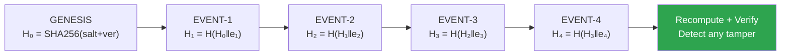

### 10.3 Audit Verification

- **Chain Integrity Check:** recompute hashes from genesis → compare → report pass/fail.
- **Event Signing:** optional device key signature on critical events (non-repudiation).
- **Anomaly Alerts:** heuristic engine flags: mass decrypts, rapid failures, unexpected file modification.
- **Retention:** configurable (default 12 months local, exportable for long-term archive).

---

## 📥 11. Comprehensive Report Generation & Download

### 11.1 Available Reports (Download Center)

| Report | Format | Contents |
|--------|--------|----------|
| **Compliance Report** | PDF | Framework-by-framework control mapping w/ evidence status |
| **Audit Report** | PDF + CSV | Full chronological event list, hash-chain verification result |
| **Security Posture Score** | PDF | Scoring per pillar (Crypto, Auth, Data, Monitoring) |
| **Key Health Report** | JSON | Rotation age, KDF params, enclave status, zeroization events |
| **Threat & Risk Register** | JSON/CSV | STRIDE findings, residual risks, recommendations |
| **Attestation Package** | ZIP (.zip) | All above + digital signature + timestamped manifest |

> 📂 **Download flow:** User taps `Download Report` → report is **generated locally**, digitally **signed** (P-256), zipped, and saved to a user-selected **encrypted export folder**. Nothing leaves the device. Optional: sign with a user certificate for external auditors.

### 11.2 Report Pipeline

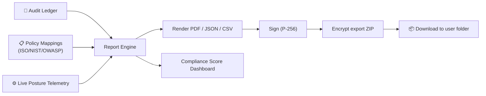

---

## 🗝️ 12. Key Management Lifecycle

### 12.1 Key Lifecycle Stages

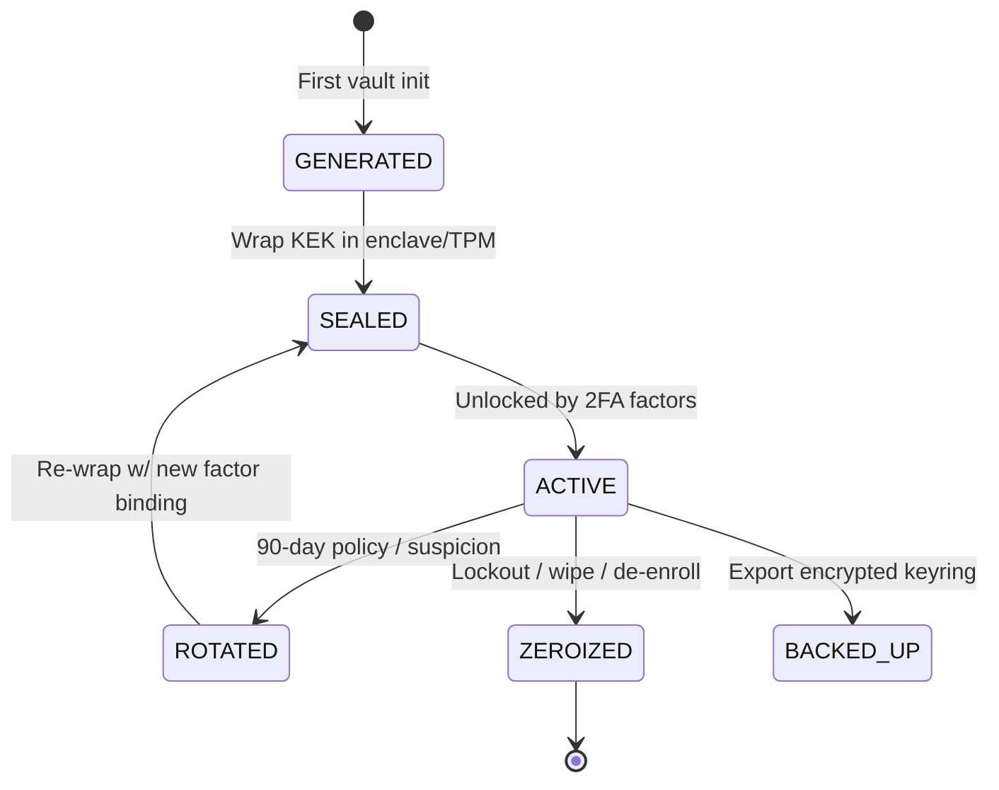

| Stage | Action | Control |
|-------|--------|---------|
| **Generation** | CSPRNG 256-bit DEK; KEK derived via Argon2id from passphrase | NIST SP 800-57 |
| **Sealing** | KEK wrapped to Secure Enclave/TPM bound to biometric credential | Hardware root of trust |
| **Usage** | DEK released only after 2FA; zeroized from RAM after operation | Short-lived session keys |
| **Rotation** | Re-encrypt under new key; old ciphertext re-wrapped (lazy re-encryption) | ISO A-8.24, NIST PR.DS-6 |
| **Backup** | Encrypted keyring export with recovery passphrase | Recovery planning |
| **Destruction** | Overwrite + enclave destroy handle on lockout | Secure deletion (A-8.10) |

### 12.2 Key Derivation Details

```
For passphrase P, random salt S (16B), pepper X (app secret, enclave-protected):

KEK = Argon2id(P, S∥X, m=64MiB, t=3, p=4)          → 32 bytes
ENC(subkeys) = HKDF-SHA256(KEK, info="notes-key")   → DEK
MAC(subkey)  = HKDF-SHA256(KEK, info="audit-key")   → MAK
```

---

## 🔄 13. Secure Development Lifecycle (SDLC)

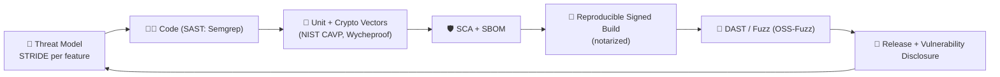

| Phase | Gate | Tooling |
|-------|------|---------|
| Design | Threat model approved | STRIDE walkthrough doc |
| Code | No high-sev findings | Semgrep/Ghidra SAST |
| Test | Crypto conformance 100% | Wycheproof + CAVP vectors |
| Build | Signed, reproducible | CI reproducibility check |
| Release | Notarized + SBOM attached | macOS notarize / Windows signing |

---

## 🔗 14. Zero-Trust Architecture Model

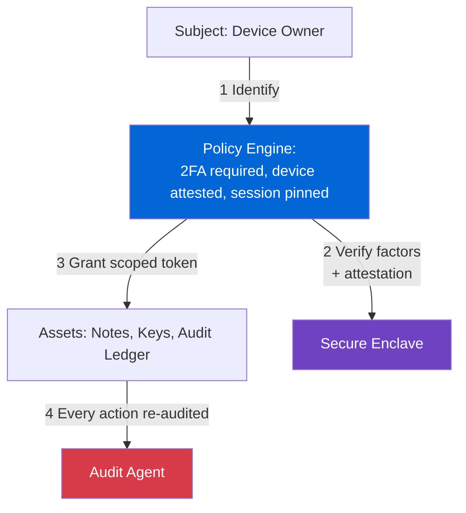

### 14.1 Zero-Trust Pillars Applied

| Pillar | Implementation |
|--------|----------------|
| **Verify Explicitly** | Biometric + passphrase, never implicit |
| **Least Privilege** | Vault unlocked only during active session |
| **Assume Breach** | Keys in enclave, data encrypted, audit monitored, wipe path ready |

---

## 🧯 15. Disaster Recovery & Offline Resilience

| Scenario | Recovery Path |
|----------|---------------|
| Lost device / theft | Restore encrypted `.snpbackup` file with recovery passphrase on new device |
| Forgotten passphrase | Recovery using enrolled-biometric-sealed key (verifiable by biometric) |
| Corrupted vault | Journal replay recovery (WAL) |
| Enclave failure | TPM backup handle + `recovery_escrow` initiated by admin approval |
| Malware wipe | Backup restores; audit chain verifies untouched integrity |

> ✅ **RPO = < 1 day** (manual on-demand backup) • **RTO = minutes** (same device restore)

---

## ⚖️ 16. Performance & Usability Balancing

| Concern | Strategy |
|---------|----------|
| Slow unlock (Argon2id) | Cache derived KEK in memory post-nonce-guess; only re-derive after lockout/timeout |
| Large notes | Chunked AEAD (each chunk ≤ 1 MiB with own nonce+salt) |
| Search | Encrypted index hints (searchable encryption w/ controlled leakage) |
| Battery | Crypto ops batched; GCM hardware acceleration (AES-NI/AE) |
| UX | Biometric as first factor (fast), passphrase secondary (rare) |

---

## 🗓️ 17. Roadmap

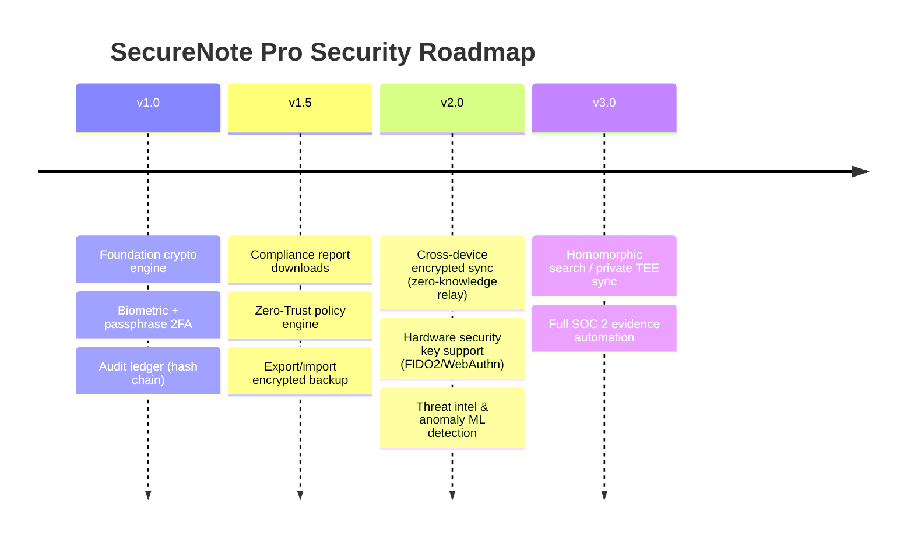

---

## 📋 Appendix: Security Controls Checklist

### Confidentiality
- [x] AES-256-GCM AEAD for every note write
- [x] No plaintext persistence (title/timestamps encrypted)
- [x] Key material sealed in Secure Enclave / TPM
- [x] Zeroize on lockout
- [x] Encrypted backups with independent export key

### Integrity & Non-Repudiation
- [x] HMAC-SHA256 note authentication
- [x] Hash-chained immutable audit ledger
- [x] Signed reports (P-256)
- [x] Checksum verification on restore

### Authentication & Access
- [x] Biometric (Face ID / Touch ID / Windows Hello)
- [x] Master passphrase (Argon2id)
- [x] Rate limiting + exponential lockout
- [x] Session pinning + fail-closed locking

### Monitoring & Compliance
- [x] Continuous audit agent
- [x] Compliance scoring engine (ISO 27001 / NIST CSF 2.0 / OWASP Top 10)
- [x] One-click downloadable PDF/JSON/CSV/ZIP reports
- [x] Attestation package for external auditors

### Development & Supply Chain
- [x] SAST/DAST in CI
- [x] SCA + SBOM
- [x] Reproducible signed builds
- [x] Vulnerability disclosure program

---

## 📌 Conventions & References

| Standard | Reference |
|----------|-----------|
| ISO/IEC 27001:2022 | Annex A controls table |
| NIST CSF 2.0 | govern / identify / protect / detect / respond / recover |
| NIST SP 800-38D | GCM authenticated encryption |
| NIST SP 800-57 | Key management |
| RFC 9106 | Argon2id memory-hard KDF |
| RFC 5869 | HKDF |
| OWASP Top 10 (2021) | A01–A10 |
| FIPS 140-3 (optional) | CAVP validated crypto modules |

> 🛡️ *This architecture is designed for on-device, zero-trust operation. All cryptographic operations run locally; the application maintains **no cloud dependency** for core functionality, making it resilient, private, and auditable.*