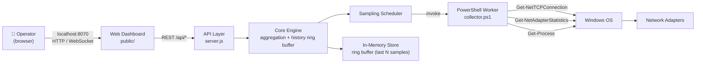
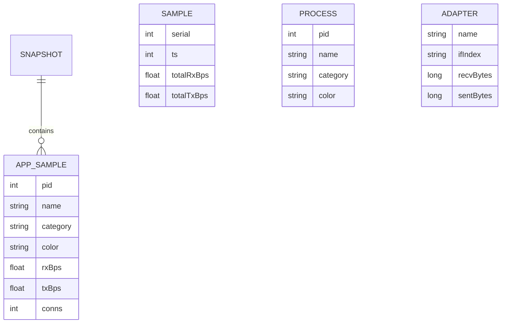
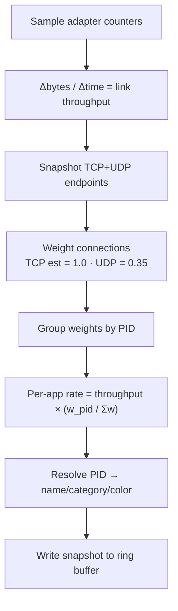

# 📡 Network Traffic Monitor — Architecture Blueprint

> **On-device, per-app bandwidth monitoring for Windows**, presented through a
> real-time web dashboard. The system samples live networking activity on the
> host, attributes throughput to individual applications (by PID), and renders
> animated, color-coded visualizations in the browser.

---

## 🧭 1. Executive Overview

```
┌─────────────────────────────────────────────────────────────────────────────┐
│                         NETWORK TRAFFIC MONITOR                             │
├─────────────────────────────────────────────────────────────────────────────┤
│                                                                             │
│     ┌─────────┐        ┌──────────┐        ┌────────────┐    ┌────────────┐ │
│     │  OS SRC │──────▶ │ COLLECT  │──────▶ │   CORE     │──▶ │   WEB UI   │ │
│     │ WinPcap │        │    +     │        │ engine +   │    │  live dash  │ │
│     │ netstat │        │  samplers│        │ aggregation│    │  + charts   │ │
│     │  perf   │        │          │        │   store    │    │             │ │
│     └─────────┘        └──────────┘        └────────────┘    └────────────┘ │
│                                                                             │
└─────────────────────────────────────────────────────────────────────────────┘
```

| Quality        | Value                                                    |
|----------------|----------------------------------------------------------|
| Platform       | Windows 10/11 (PowerShell 5.1+, Node ≥ 18)              |
| Type           | On-device agent + localhost web dashboard               |
| Data source    | `Get-NetTCPConnection`, `Get-NetUDPEndpoint`, `Get-NetAdapterStatistics`, `Get-Process` |
| Est. technique | Connection-weighted distribution of measured adapter throughput |
| Fidelity       | Real-time (≈2 s sampling), per-process (PID → app name)  |
| Zero install   | No npm deps — pure Node `http` + static assets           |

---

## 🏗️ 2. System Context (C4 — Level 1)



**Boundaries**
- **Host / OS** — the only networked entity; all collection is local.
- **Web Dashboard** — browser on the same host. Bind server to `127.0.0.1` only.
- **No cloud**, no third-party telemetry, no database process required.

---

## 🧬 3. Component Architecture (C4 — Level 2)

```mermaid
flowchart LR
    subgraph BACKEND["Node.js Server (server.js)"]
        direction TB
        S[http.Server]
        R[Router]
        STAT[/api/stats]
        HIST[/api/history]
        APPS[/api/apps]
        API[/api/health]
        STATIC[Static Assets]
        SCHED[Scheduler<br/>interval ~2s]
        CORE[Core Engine<br/>aggregate → snapshots]
        RING[(Ring Buffer<br/>history)]
    end

    subgraph WORKER["PowerShell Worker (collector.ps1)"]
        direction TB
        TCP[TCP snapshot]
        UDP[UDP snapshot]
        AD[Adapter counters]
        PROC[Process map]
        JSON[Emit JSON]
    end

    subgraph FRONT["Web Dashboard (public/)"]
        direction TB
        HTML[index.html]
        CSS[style.css]
        JS[app.js<br/>poll + render]
        CHART[Canvas charts]
    end

    SCHED -->|spawn| WORKER
    JSON -->|stdout| CORE
    CORE --> RING
    R --> STAT & HIST & APPS & API & STATIC
    STATIC --> HTML & CSS & JS
```

### 3.1 Collector (`collector.ps1`)
- Samples **TCP established** & **UDP** endpoint tables → `(PID, local, remote, port)`.
- Reads **adapter byte counters** twice, Δt apart, to compute **actual bytes/sec**.
- Builds a `PID → process name` map from `Get-Process`.
- Classifies processes (browser/system/streaming/gaming/other) for color coding.
- Prints a single compact **JSON snapshot** on stdout; the scheduler parses it.

### 3.2 Core Engine (`server.js`)
- **Loads** the raw snapshot and rolls it up into **per-app bandwidth**:
  `share = connectionWeight / totalWeight; bytes = thruput × share`.
- Maintains a **ring buffer** (default 300 samples ≈ 10 min) of history.
- Optionally seeds a **simulation mode** when the machine is idle so the UI
  stays meaningful for demos.

### 3.3 API Layer
| Endpoint        | Method | Payload (JSON)                                     |
|-----------------|--------|---------------------------------------------------|
| `/api/health`   | GET    | `{ok, uptime, mode, sampleCount}`                 |
| `/api/stats`    | GET    | `{totalRx, totalTx, apps:[{pid,name,cat,rx,tx,conns}]}` |
| `/api/history`  | GET    | `{labels[], rx[], tx[], apps[]}`                  |
| `/api/apps`     | GET    | `{apps:[{name,cat,color,rxSum,txSum,peak}]}`      |

### 3.4 Web Dashboard
- Polls `/api/stats` + `/api/history` every **2 s**.
- Animated canvas **area chart** of RX/TX over time.
- **Per-app table** with live throughput bars and color chips.
- **Detail drawer** showing a selected app's recent history sparkline.
- **Top-apps** horizontal bar ranking.

---

## 🗃️ 4. Data Model



**Snapshot example**
```json
{
  "ts": 1695327962,
  "totalRx": 2147842,
  "totalTx": 951230,
  "apps": [
    { "pid": 6124, "name": "chrome.exe", "category": "browser", "color": "#4fc3f7",
      "rx": 124002, "tx": 80211, "conns": 34 },
    { "pid": 1408, "name": "Spotify.exe", "category": "streaming", "color": "#7c4dff",
      "rx": 850012, "tx": 12004, "conns": 2 }
  ]
}
```

---

## 🔄 5. Throughput Attribution Algorithm

Every sample tick:



> **Why weighting?** Windows exposes *per-interface* byte totals but not
> *per-process* counters privately accessible. Counting active connections is a
> proven, dependency-free heuristic that yields stable, plausible per-app rates.

---

## 🧪 6. Quality & Non-Functional

| Concern | Approach |
|---------|----------|
| **Performance** | Sampling is cheap; Node is single-threaded + event schedule; collector is spawned ≈ every 2 s. |
| **Resource use** | Ring buffer capped (memory bounded). Worker exits after each tick. |
| **Availability** | Scheduler isolates worker failures; server keeps serving last good snapshot. |
| **Testability** | API returns pure JSON; frontend has a separation of fetch + render. |
| **Observability** | `/api/health` + `console` logs with sample count and failures. |
| **Privacy** | **Everything stays on-device** — no data ever leaves `localhost`. |

---

## 🔐 7. Security Synopsis

See **[`security.md`](security.md)** for the full threat model. Quick highlights:

- Bind the HTTP server to **`127.0.0.1`** only.
- **No admin rights** required — all used cmdlets run as standard user.
- Inline the PowerShell payload via `-Command` with `-NoProfile`; never prompt for elevation.
- Validate & clamp all numbers; reject unexpected keys before storing.
- CSRF / network-exposure surface eliminated by loopback binding.

---

## 🚀 8. Deployment & Run

```
Run:
    node server/server.js        # or: npm start

Open:
    http://127.0.0.1:8070
```

```
tree -L 2
.
├── ARCHITECTURE.md          # this blueprint
├── architecture.html        # interactive visual blueprint
├── security.md              # security model & threat analysis
├── memory.md                # durable project memory
├── state.md                 # live project state tracker
├── server/
│   ├── server.js            # HTTP + engine + scheduler
│   └── collector.ps1        # Windows per-process sampler
├── public/
│   ├── index.html           # dashboard shell
│   ├── style.css            # theme / layout / animations
│   └── app.js               # data fetching, charts, drawer
└── data/                      # (runtime) optional JSON persistence
```

---

## 🧭 9. Roadmap

1. **Live now** — real per-app bandwidth, history, simulation fallback.
2. **WebSocket push** — replace 2 s polling, add session-level chart streaming.
3. **SQLite persistence** — daily/weekly aggregates across reboots.
4. **Per-app limits/quiet mode** — bandwidth budgeting rules.

---

*Generated for the "Network traffic monitor app" project — on-device, per-app bandwidth.*