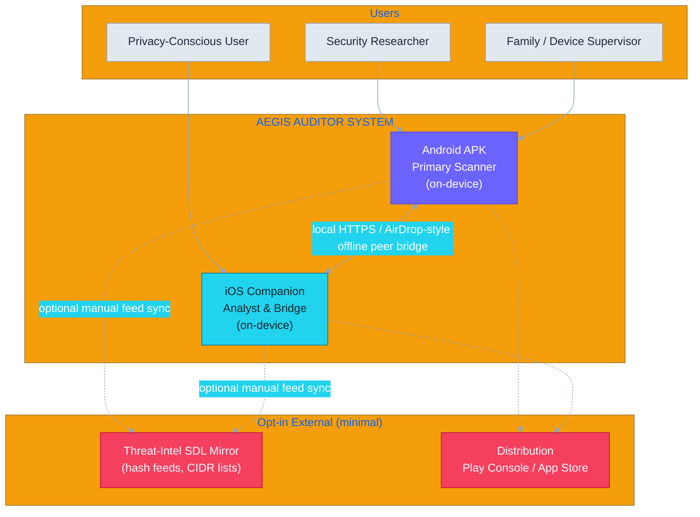
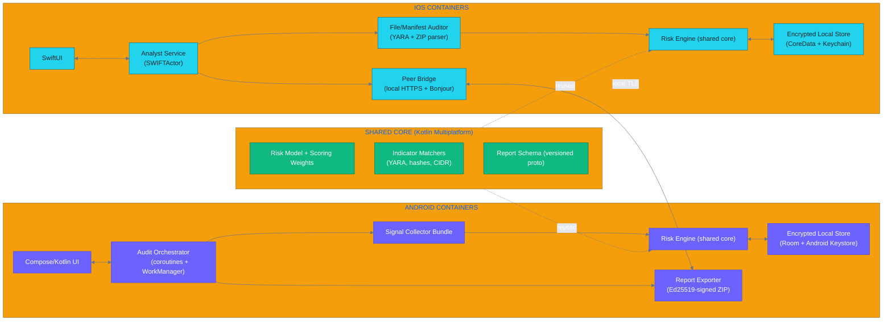
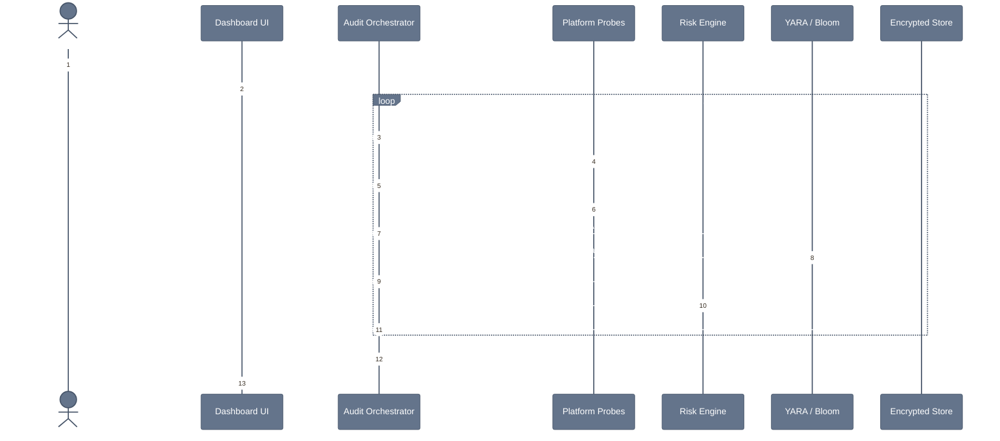
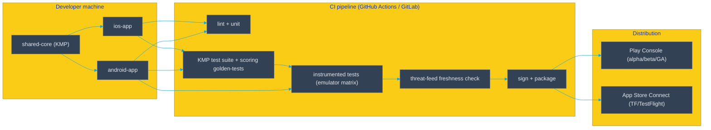

# AEGIS AUDITOR — Architecture

> **Android Malware Analysis Companion App** (permission auditor for installed apps)
> Cross-platform build: **Android APK (primary auditor)** + **iOS companion (analyst / baseliner)**, offline-first, risk-scoring, threat-intel aware.

---

## 1. Mission & Product Summary

AEGIS AUDITOR is a privacy-first companion application that surfaces **which installed apps have which permissions, which of those permissions are actively exercised, and whether app behaviour matches its declared intent**. It converts opaque Play-Store-style permission pages into an actionable, weighted **risk score** with evidence trails.

| Platform | Role | Capability ceiling |
|---|---|---|
| **Android (primary)** | Deep scanner | Can enumerate **all installed apps** + signatures + runtime behaviour via platform APIs |
| **iOS (companion)** | Analyser / manager | **Cannot** enumerate other apps (App Store sandbox). Acts as offline APK/IPA auditor, LAN baseliner, file examiner, and report bridge for an Android peer |

This separation is **by platform design**, not limitation. iOS forbids listing installed applications, so the iOS app is architected as a *companion analyst* while Android performs the deep system-level audit.

---

## 2. Colour Legend (used across all diagrams)
<!-- Rendered only in editors that support colour; tones match Mermaid themeVariables -->

- **Purple / Violet** — Android application modules & platform bindings
- **Teal / Cyan** — iOS companion modules
- **Emerald** — shared / cross-platform risk & scoring engine
- **Amber** — local encrypted storage & offline assets
- **Rose / Red** — external services, cloud threat-intel (opt-in only)
- **Slate** — user, UI, build/delivery boundaries

---

## 3. System Context (C4 Level 1)



**Key boundaries**
- **No permission data ever leaves the device by default.** Export is explicit, signed, and encrypted.
- Threat-intel feeds are **hash lists and network CIDR ranges only** — never app-level telemetry.
- The Android ↔ iOS bridge moves only *signed risk reports*, never raw package dumps.

---

## 4. Container View (C4 Level 2)



> **Shared core** — Kotlin Multiplatform carries the risk model, scoring weights, indicator matchers and the versioned report schema to both platforms, guaranteeing the **same score on the same evidence** regardless of platform.

---

## 5. Android Application Architecture (Level 3)

> Android is the **only** platform where a full installed-app inventory is possible. All probes are defensive reads; none write to other apps.

```mermaid
%%{init: {'theme':'base','themeVariables':{'background':'#FBF7FF','primaryColor':'#6C63FF','primaryTextColor':'#ffffff','primaryBorderColor':'#5149E8','lineColor':'#c4b5fd','secondaryColor':'#7c3aed','tertiaryColor':'#f59e0b','fontFamily':'Segoe UI'}}}%%
flowchart TB
    UI["Kotlin + Jetpack Compose UI
    Dashboard / App Detail / Timeline / PermMap / Export"]

    ORCH["Audit Orchestrator
    (StateFlow + WorkManager scheduled + on-demand)"]

    subgraph SIGNAL["SIGNAL COLLECTOR BUNDLE"]
        SC1["Package Inventory
        PackageManager.getInstalledPackages()
        + <queries>/QUERY_ALL_PACKAGES"]
        SC2["Permission Matrix
        GET_PERMISSIONS + group extraction
        (normal / runtime / signature / dangerous)"]
        SC3["Runtime Activity Probe
        AppOpsManager.unsafeCheckOp / canStop
        UsageStatsManager (foreground windows)"]
        SC4["Signature & Cert Vault
        GET_SIGNING_CERTIFICATES / v1-v3,
        signer lineage, key rotation badges"]
        SC5["Install-Source Probe
        SETTINGS verify-apps, unknown-sources,
        Play Integrity + install flags"]
        SC6["Overlay & Exposure Probe
        AccessibilityService-derived overlay events,
        exported activity/receiver flags"]
        SC7["Advanced: VPN Traffic Mapper
        VpnService (user opt-in) -> per-app flow logs"]
        SC8["Advanced: Root Deep-Mode
        source-dir split-APK copy -> static DEX/manifest scan (gated, warned)"]
    end

    subgraph RISK["RISK & SCORING"]
        R1["Heuristic Risk Engine
        weighted sum + decision rules"]
        R2["Indicator Matchers
        bundled YARA rules + hash bloom filters"]
        R3["Evidence Assembler
        per-app evidence chain (why -> who -> when)"]
    end

    subgraph DATA["DATA & STORAGE"]
        D1["Room DB (encrypted via SQLCipher)"]
        D2["Android Keystore (AES symmetric master key)"]
        D3["Bundled offline assets
        YARA rules, hash feeds, CIDR lists"]
    end

    subgraph OUT["OUTPUT"]
        O1["Report Signer
        Ed25519 key in Keystore"]
        O2["Export ZIP
        AES-256-GCM payload + signed manifest"]
        O3["Peer Bridge (local server)
        serve report to iOS companion"]
    end

    UI --> ORCH --> SIGNAL
    SC1 --> R1
    SC2 --> R1
    SC3 --> R1
    SC4 --> R2
    SC5 --> R1
    SC6 --> R1
    SC7 --> R2
    SC8 --> R2
    R1 --> R3
    R2 --> R3
    R3 <--> D1
    D2 -.unlocks.-> D1
    D3 --> R2
    R3 --> O1 --> O2
    O1 --> O3
    O3 -.-> IOS_PEER["iOS Bridged Viewer"]

    classDef sig fill:#6C63FF,stroke:#5149E8,color:#fff
    classDef risk fill:#10b981,stroke:#047857,color:#fff
    classDef data fill:#f59e0b,stroke:#b45309,color:#3d2c07
    classDef out fill:#f43f5e,stroke:#be123c,color:#fff
    class SC1,SC2,SC3,SC4,SC5,SC6,SC7,SC8 sig
    class R1,R2,R3 risk
    class D1,D2,D3 data
    class O1,O2,O3, IOS_PEER out
```

### 5.1 Signal collector detail

| Probe | Platform API | Signal produced | Risk relevance |
|---|---|---|---|
| Package inventory | `PackageManager.getInstalledPackages(PackageManager.PackageInfoFlags)` | PKG list + version + cert hashes | Scope, accuracy |
| Permission matrix | `GET_PERMISSIONS`, permission groups | requested vs granted → `runtime`, `dangerous`, privileged flags | High: over-requested perms |
| AppOps runtime state | `AppOpsManager.unsafeCheckOp(op, uid, pkg)` | Is permission *actually used* (allow/ignore)? | High: granted-but-unused → suspicion |
| Usage windows | `UsageStatsManager.queryEvents` | foreground app sessions, time-buckets | Behaviour vs declared purpose |
| Signing chain | `GET_SIGNING_CERTIFICATES` | cert digests, v1/v2/v3 schemes, signer rotation | Impersonation, key rotation abuse |
| Install source | `Settings.Global.VERIFY_APPLICATIONS`, installer pkg, Play Integrity | sideload vs verified store | Medium: unknown/untrusted installer |
| Overlay / UI exposure | Accessibility events (user opt-in), exported component flags | overlay-tap hijack, exported intents | High for banking-SMS malware |
| Network flows (pro) | `VpnService` per-app tunnel | destination IP ⇄ app, proto, TLS SNI | Exfiltration pattern |
| Static DEX (root-mode) | source-dir copy + dex/arsc parser | permissions-in-code, suspicious APIs | Deep, optional, gated |

### 5.2 Android lifecycle
```
Boot/manual -> Orchestrator -> incremental collection (delta) -> score -> persist -> notify (if delta is critical)
WorkManager keeps periodic deltas cheap (< 2 s for 100 apps). Full scan is user-triggered.
```

---

## 6. iOS Companion Architecture (Level 3)

> iOS cannot enumerate installed apps. The companion therefore owns the **analyst / evidence-handling** workflow and the **secure bridge** to an Android peer.

```mermaid
%%{init: {'theme':'base','themeVariables':{'background':'#EEFDFD','primaryColor':'#06b6d4','primaryTextColor':'#ffffff','primaryBorderColor':'#0891b2','lineColor':'#67e8f9','secondaryColor':'#0ea5e9','tertiaryColor':'#f59e0b','fontFamily':'Segoe UI'}}}%%
flowchart TB
    UI2["SwiftUI
    Auditor Home / File Inbox / LAN Devices / Privacy Posture"]

    ACT["Analyst Service (SWIFTActor)
    job queue + progress"]

    subgraph CAP["AUDIT CAPABILITIES"]
        C1["Manual File Auditor
        .apk / .ipa via Files + Share Sheet
        ZIP parser + AndroidManifest extractor"]
        C2["Hash & Bloom Matcher
        MD5/SHA1/SHA256 vs bundled known-bad""]
        C3["Bundled YARA Engine
        embedded yara-lib for on-device rule matcher"]
        C4["LAN Baseliner
        NWBrowser + UDP/TCP sweep
        -> device inventory + open services"]
        C5["Self Privacy Posture
        this-app-only permission report +
        microphone/camera red-line indicators"]
    end

    subgraph BRIDGE["PEER BRIDGE"]
        B1["Bonjour advertise
        'AEGIS-AUDITOR'"]
        B2["Local TLS server
        (self-signed pin, ephemeral key)"]
        B3["Report Inbox
         receive + verify Ed25519 signatures"]
    end

    subgraph DATA2["DATA & STORAGE"]
        D1b["CoreData (encrypted at rest
        via SQLCipher-lite / FileProtection)"]
        D2b["Keychain
        bridge identity, received keys, secrets"]
    end

    UI2 --> ACT
    ACT --> C1 --> C2
    C1 --> C3
    ACT --> C4
    ACT --> C5
    C2 --> D1b
    C3 --> D1b
    C4 --> D1b
    B1 --> B2 --> B3 --> D1b
    D2b -.feeds signing/verify.-> B3

    classDef cap fill:#06b6d4,stroke:#0891b2,color:#fff
    classDef br fill:#0ea5e9,stroke:#0369a1,color:#fff
    classDef data fill:#f59e0b,stroke:#b45309,color:#3d2c07
    class C1,C2,C3,C4,C5 cap
    class B1,B2,B3 br
    class D1b,D2b data
```

### 6.1 iOS capability notes
- **File Auditor** is the flagship iOS feature: a user drags an `.apk` or `.ipa` into AEGIS via Share Sheet / Files; it is parsed **entirely on-device** (ZIP central directory, `AndroidManifest.xml` binary XML decode for APKs; `Info.plist` + bundle structure for IPAs).
- **YARA engine**: compiled in via `yara` C library / XCFramework — runs offline, supports rules sync from the feed mirror.
- **LAN Baseliner** honours `NSLocalNetworkUsageDescription`; scans only the local subnet, stores a rolling baseline, flags new/absent devices.
- **Self Privacy Posture** shows the companion's *own* granted permissions (the only lawful inventory an iOS app can show) as a reference baseline.
- **Peer Bridge** uses Bonjour + a locally-generated ephemeral self-signed cert; the Android peer performs **certificate pinning on first pair** (TOFU) — see `security.md`.

---

## 7. End-to-End Scan & Scoring Pipeline



### 7.1 Risk model (weighted)
```
score = Σ wᵢ · fᵢ(evidenceᵢ)

 w_perm      over-requested / dangerous permission ratio       25%
 w_runtime   granted-but-unused AppOps "ignore" gap           15%
 w_overlay   overlay capture / exported sensitive components  20%
 w_sig       signer anomalies (self-signed, rotated, debug)   15%
 w_usage     launch patterns vs declared purpose               10%
 w_net       flows to flagged CIDRs / new hosts (pro mode)     10%
 w_install   unknown/sideload install source                    5%

Verdict bands: 0-24 SAFE · 25-49 WATCH · 50-74 SUSPICIOUS · 75+ HIGH RISK
```
Every score must resolve to a **human-read evidence trail** — the engine never returns a score without reason codes.

---

## 8. Technology Stack

| Layer | Android | iOS | Shared |
|---|---|---|---|
| Language | Kotlin | Swift | Kotlin Multiplatform core |
| UI | Jetpack Compose (Material 3) | SwiftUI | — |
| Async | Coroutines + Flow / WorkManager | Swift Actors | — |
| Storage | Room + SQLCipher | CoreData + FileProtection | — |
| Secrets | Android Keystore + BiometricPrompt | Keychain + LAContext | — |
| Signing | Ed25519 (BouncyCastle) | CryptoKit | — |
| Networking | OkHttp (+cert pin) | URLSession + Network framework | — |
| ML/Rules | bundled YARA, TFLite optional | yara XCFramework | rule set (shared) |
| Local bridge | Nsd/ServerSocket local | Bonjour + Network framework | TOFU pinning |
| Anti-tamper | Play Integrity / APK signature | App Attest (DCAppAttestService) | — |

---

## 9. Data, Privacy & Retention

- **Raw permission graphs and package inventories never leave the device.**
- Local store is encrypted (SQLCipher / FileProtection) and wiped on uninstall.
- The only outbound traffic is an **optional manual sync of hash/CIDR feeds** (uses your connection, transparent toggle).
- Exports are **signed** (Ed25519) and **encrypted** (AES-256-GCM, Argon2id-derived key) — recipients can verify origin without a third party.
- Peer bridge transmits only the signed report payload, pairing via TOFU-pinned ephemeral certs.
- Retention: snaphots purged after N days (configurable; default 90); user-exports never auto-uploaded.

See `security.md` for the full threat model and `memory.md` for API decisions.

---

## 10. Build & Delivery



**Verification commands** (see `state.md` for exact copy-paste commands).

---

## 11. Roadmap

| Phase | Focus | Target |
|---|---|---|
| M0 | KMP core: schema + weighted engine + golden rules | — |
| M1 | Android full scan loop + dashboard (all 8 probes) | alpha |
| M2 | iOS file auditor + YARA + LAN baseline | TestFlight |
| M3 | Peer bridge pairing, signed report interop | beta |
| M4 | Pro: VPN traffic mapper + static DEX root-mode | GA |
| M5 | On-device ML classifier + community rule packs | v-next |

---

**Ownership**: This document is the source of truth for structure. Decisions and rationale are logged in `state.md` (ADR log), threats in `security.md`, and durable technical memory in `memory.md`.