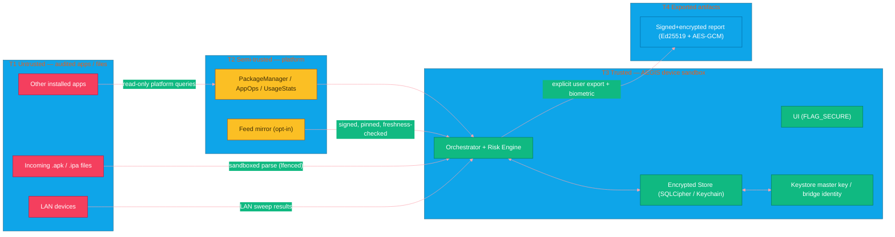

# SECURITY — AEGIS AUDITOR

> Threat model, trust boundaries, required permissions, data classification, crypto design, and the hardening checklist for the **Android/iOS malware-analysis companion**.

---

## 1. Security Goals (in priority order)

1. **Protect the analyser from the analysed** — a malware app being audited must not be able to influence the audit's integrity or steal its results.
2. **A privacy app that is itself privacy-clean** — no telemetry, no data leaving the device by default.
3. **Authentic evidence** — reports carry undeniable origin (signed) and confidentiality (encrypted).
4. **Least privilege end to end** — the app requests nothing it does not need, and exposes nothing discoverable.

---

## 2. Threat Model (STRIDE per trust zone)

### 2.1 Local adversary — another app on the same Android device

| Threat | Impact | Mitigation |
|---|---|---|
| Rogue app spies on AEGIS UI (overlay/screenshot) | Permission inventory leak | `FLAG_SECURE` on all screens; warn-on-overlay detector; don't render raw package data on shareable surfaces |
| Rogue app reads internal storage | DB exfiltration | SQLCipher (AES-256) + master key in Android Keystore (never in code); 0 external storage writes |
| Rogue app performs **delegated scallops** (abuses exposed components) | Arbitrary probes / report tamper | No exported activities/services; intent-filter lockdown; per-feature capability flags |
| Rogue app races the audit (spawns/revokes perms mid-scan) | Stale/wrong evidence | Snapshot-isolation per app + `AppOpsManager` read twice and compare; record timestamps |
| Malware in same UID (signed keyshares) | Identity spoof | Verifier compares installed cert chain vs UID owner; flag multi-package key signatures |
| Root-kit on rooted device blesses a malware app | False negatives | Root deep-mode is **gated + explicit user warning**; results tagged "untrusted-root" and excluded from auto-exports |

### 2.2 Remote adversary — malicious network / malicious destinations

| Threat | Impact | Mitigation |
|---|---|---|
| App under audit exfiltrates data over network | User unaware | Pro-mode `VpnService` maps per-app flows locally; alerts on flagged CIDRs |
| Feed mirror compromised (hash/CIDR feed) | Poisoned indicators → false flags | Feeds pinned via HTTPS + signed manifests; freshness check in CI/release |
| MITM on peer bridge | Report injection / read | TOFU-pinned ephemeral self-signed certs; all payloads additionally signed Ed25519 |

### 2.3 Supply chain / build adversary

| Threat | Impact | Mitigation |
|---|---|---|
| Build agent compromise injects backdoor | Compromised distribution | Reproducible/verifiable build; signed CI artifacts; minimum-version enforcement |
| Dependency vulnerability | RCE/library hijack | Dependency scanning in CI; lockfiles; yara/MultiKMP libs vendored & pinned |
| Rogue update pushed | Full device compromise of auditor | Android: Play Integrity + APK signature check at runtime on self (defence-in-depth); iOS: App Attest (`DCAppAttestService`) |
| Physical access to device | Export theft | Exports require biometric (BiometricPrompt / LAContext) + passphrase; storage keys non-exportable |

### 2.4 Platform-lawland

- **iOS cannot enumerate installed apps** — attempting to would violate App Store Review and Privacy KPIs. The companion performs file + LAN analysis, which are within-sandbox behaviours.

---

## 3. Trust Boundaries

**Rules enforced at the boundary**
- T1→T3b: parsers run with **reduced privilege**, resource caps (size, depth, zip-slip guards) and no network access for file auditing.
- T2→T3b: platform data is treated as *evidence, not truth* — cross-checked across probes.
- No silent crossing of T3→T4; **every export is a deliberate, biometric-confirmed, passphrase-protected event**.
- T3c keys never leave the Keystore/Keychain (non-exportable material).

---

## 4. Requested Permissions & Justification

### Android
| Permission | Needed for | Risk posture |
|---|---|---|
| `QUERY_ALL_PACKAGES` | Enumerate installed apps (core feature) | Guarded by Play policy; declare `<queries>` granularity fallback; runtime rationale screen |
| `PACKAGE_USAGE_STATS` | Foreground-window evidence (usage probe) | Settings-screen opt-in, recorder permission; only times & counts stored |
| `BIND_ACCESSIBILITY_SERVICE` | Overlay-exposure detector | **Opt-in**, clearly explained; service performs no auto-clicking |
| `INTERNET` | Optional feed sync + local bridge server | Default-off toggle; self-signed ephemeral only |
| `VpnService` (PRO) | Per-app traffic mapping | Requires explicit user activation; no payload inspection/logging of content, only destinations + SNI |
| `FOREGROUND_SERVICE` + `POST_NOTIFICATIONS` | Scheduling audited scans | Only critical-delta notifications |
| `READ/write` external storage | **None** — rejected by design | Strengthens 2.1 storage isolation |

### iOS
| Capability | Needed for | Notes |
|---|---|---|
| `NSLocalNetworkUsageDescription` | LAN baseliner | Add `NSBonjourServices` (`_aegisauditor._tcp`) |
| File provider read (Share Sheet / Files) | .apk/.ipa audit | Sandbox-scoped; no global file access |
| Keychain (kSecClass key) | bridge identity + received peer keys | — |
| No Background Modes requested | — | Scanning is foreground/on-demand only |

---

## 5. Data Classification

| Class | Examples | Handling |
|---|---|---|
| **C3 – Highest** | Master keys, bridge identity, export passphrases | Keystore/Keychain only; never logged, never bundled |
| **C2 – Sensitive** | Package inventory, permission graphs, usage windows, flow destination logs | Encrypted at rest; on-device only; purged by retention (default 90 d) |
| **C1 – Internal** | Rule/hash/CIDR feeds, model weights, report structure | Signed + freshness-verified; not user-identifying |
| **C0 – Public** | Branding, help text | — |

> C2 leaves the sandbox **only** as C4 export artifacts (`T4`) described above.

---

## 6. Cryptography Recipe

| Concern | Mechanism | Notes |
|---|---|---|
| At-rest dataset | AES-256-GCM via SQLCipher (Android) / FileProtection class (iOS) | Master key = Keystore/Keychain non-exportable |
| Report signing (origin) | Ed25519 (CryptoKit / BouncyCastle) | Key persisted in Keystore; export musts outlive app reg to verify old reports |
| Report confidentiality | AES-256-GCM, key from **Argon2id(passphrase)** | Passphrase never stored — user must remember it for decryption |
| Peer bridge | TLS 1.3, ephemeral self-signed cert, **TOFU pinning** | Pin stored in Keychain; manual re-pair flow on change |
| Feed integrity | HTTPS + signed manifest + CI freshness gate | Prevents poisoned indicators |
| Device-firmware trust | Play Integrity / App Attest | Detector only; **never** the sole gate |

---

## 7. Secure Development Checklist

- [ ] No secrets in code, resources, or logs (`rg -i 'password|secret|token' ciGate`)
- [ ] SAST + dependency scanning in CI, fail-on-high
- [ ] Lockfiles for all ecosystems; vendored C deps (yara) pinned
- [ ] `FLAG_SECURE` verified on every screen (UI test asserts no fling screenshots)
- [ ] All Android components `exported=false` except the Bridge local server entry (guarded + capability-gated)
- [ ] ZIP/ZIP-slip guards + size/depth caps on file auditor (fuzz tests in CI)
- [ ] Report schema is versioned (`proto`) with reject-unknown-fields on import
- [ ] Golden-test risk engine against a labeled corpus (M0 exit criterion)
- [ ] Release signing: separate CI identity, no dev keys in Play/App Store
- [ ] Field-test on: stock Android 10–15, rooted devices (root-mode path), iOS 16–18
- [ ] Privacy labels (Play Data safety + App Store privacy) match actual data use

---

## 8. Incident Response (if a report is ever falsified)

1. Freeze feed + rule versions used at the reporting timestamp (already versioned).
2. Invalidate bridge identity → force re-pair (prevents replayed signed reports).
3. Re-score against corrected engine version and re-issue.
4. Record in `state.md` changelog; adjust weights if a systematic bias surfaced.

---

## 9. Residual Risks (accepted)

- An **unrooted** Android device cannot grant full visibility into another app's static code — the auditor is behavioural/heuristic by design. Root deep-mode exists but is out-of-band and tagged.
- iOS companion's coverage is limited by sandbox law — the Android peer stays the source of full device truth.
- TOFU pairing implies a **first-pair MITM window**; mitigated by in-band pin hash comparison (whisper/visual code) during pairing.

Complete threat→mitigation mapping is owned by the Security lead and reviewed each release gate.