<div align="center">

# 🌍 AEGIS-SENTINEL

### WebGL-Based Global Data Breach & Live Threat Feed Visualization Platform

**Real-Time Threat Intelligence on a 3D Interactive Globe — Secure by Design, Auditable by Default**

        

</div>

---

## 📋 Table of Contents

1. [Executive Summary](#1-executive-summary)
2. [High-Level System Architecture](#2-high-level-system-architecture)
3. [Technology Stack](#3-technology-stack)
4. [Visual Design System (Colorful & Attractive UI)](#4-visual-design-system-colorful--attractive-ui)
5. [WebGL Rendering Architecture](#5-webgl-rendering-architecture)
6. [Live Threat Feed Pipeline](#6-live-threat-feed-pipeline)
7. [Backend Microservices Architecture](#7-backend-microservices-architecture)
8. [Data Models & Schemas](#8-data-models--schemas)
9. [API Architecture](#9-api-architecture)
10. [Security Framework Architecture (ISO 27001 · NIST · OWASP)](#10-security-framework-architecture)
11. [Reporting Engine & Download Formats](#11-reporting-engine--download-formats)
12. [Auditability Architecture](#12-auditability-architecture)
13. [Observability & SRE](#13-observability--sre)
14. [Scalability & Performance Budgets](#14-scalability--performance-budgets)
15. [Deployment Topology](#15-deployment-topology)
16. [Compliance Control Catalog](#16-compliance-control-catalog)
17. [Architecture Decision Records](#17-architecture-decision-records)
18. [Delivery Roadmap](#18-delivery-roadmap)

---

## 1. Executive Summary

**AEGIS-SENTINEL** is a real-time, WebGL-powered 3D world map that visualizes global data breaches and live cyber threat feeds as **arcing attack paths, pulsing impact nodes, and heat-mapped risk regions** — wrapped in a vivid, neon-noir "cyber command center" UI.

The platform is engineered with a **compliance-first backbone**: every architectural layer maps to **ISO/IEC 27001:2022**, **NIST CSF 2.0**, **NIST SP 800-53 Rev.5**, and **OWASP Top 10 (2021)** controls, while offering **one-click, cryptographically signed, downloadable audit reports** (PDF / CSV / JSON / STIX 2.1) and a **tamper-evident, hash-chained audit trail** for full forensic accountability.

| Capability | Description |
|---|---|
| 🌐 **3D Live Globe** | WebGL 3 / WebGPU earth with 60 fps rendering of 100k+ concurrent threat arcs & markers |
| ⚡ **Live Feeds** | Sub-second streaming from STIX/TAXII, MISP, OSINT sensors, ISACs, honeypots & partner webhooks |
| 🎨 **Vivid UI** | Neon-noir dark theme, glassmorphism panels, glow shaders, gradient accents, animated threat ticker |
| 🔒 **Security Frameworks** | ISO 27001, NIST CSF 2.0, NIST 800-53, OWASP ASVS + Top 10, SOC 2, GDPR mapped control plane |
| 📄 **Report Downloads** | Executive PDF, CSV, JSON, STIX 2.1, Excel — signed with SHA-256 + Ed25519, watermark & hash manifest |
| 🔍 **Auditable** | Hash-chained, WORM-backed audit ledger; immutable evidence store; SIEM fan-out; compliance dashboards |

---

## 2. High-Level System Architecture

### 2.1 Bird's-Eye View

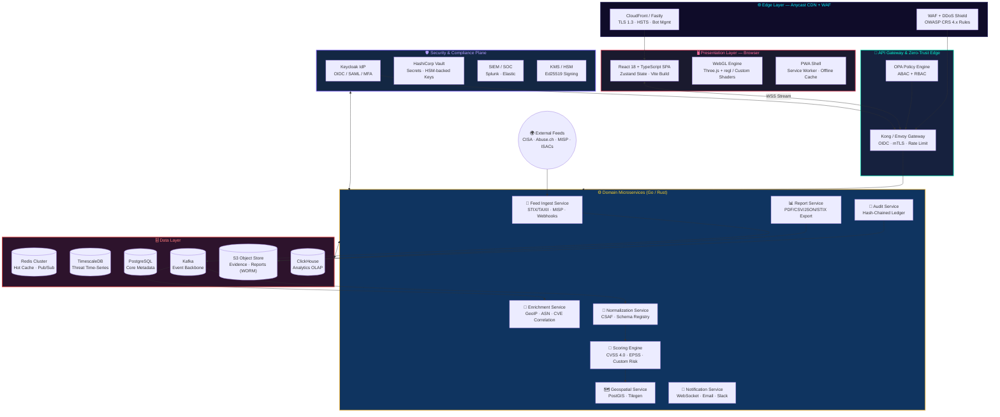

### 2.2 Runtime Data Flow — "From Sensor to Sphere"

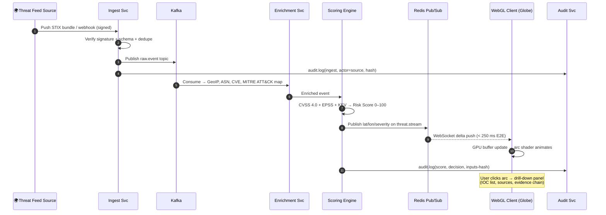

### 2.3 Architecture Style Summary

| Concern | Choice | Rationale |
|---|---|---|
| Frontend | SPA + WebGL canvas + PWA | Rich GPU visuals, offline resilience |
| Backend | Event-driven microservices on Kafka | Fan-out, replay, backpressure tolerance |
| Transport | HTTPS/2 + WebSocket (STOMP-lite) | REST for CRUD, streams for live feed |
| Data | Polyglot persistence (PG + TSDB + ClickHouse + S3) | Right store per access pattern |
| Identity | OIDC (Keycloak) + OPA ABAC | Zero-trust, least privilege |
| Deployment | Kubernetes + Terraform, multi-region active-active | HA + data residency |

---

## 3. Technology Stack

### 3.1 Frontend — "The Command Deck"

| Layer | Technology | Purpose |
|---|---|---|
| Framework | **React 18** + TypeScript 5 | Component model, strict typing |
| Build | **Vite 5** | Sub-second HMR, tree-shaken bundles |
| 3D Engine | **Three.js r160+** (WebGL2/WebGPU via `three/webgpu`) | Globe, arcs, particles, custom GLSL |
| Shader Toolkit | **GLSL ES 3.0** + `regl` helpers | Bloom, atmosphere, aurora effects |
| State | **Zustand** + Immer | Lightweight flux, time-travel debug |
| Data Fetch | **TanStack Query 5** + Native WebSocket | Cache + live deltas |
| Charts | **ECharts GL** | Side-panel analytics (sparklines, treemaps) |
| Design Tokens | **Style Dictionary** → CSS vars | Single source of visual truth |
| Icons / FX | **lucide-react**, **GSAP**, **d3-scale** | Iconography, easing, color scales |
| Testing | Vitest + Playwright + Percy | Unit, e2e, visual regression |

### 3.2 Backend — "The Reactor Core"

| Layer | Technology | Purpose |
|---|---|---|
| Services | **Go 1.22** (I/O services) + **Rust** (crypto/report engine) | Performance + memory safety |
| Event Bus | **Kafka 3.7** (KRaft) | Durable event backbone, replay |
| Gateway | **Envoy / Kong** | AuthN/Z, rate-limit, mTLS termination |
| Policy | **Open Policy Agent (OPA)** | ABAC decisions as code |
| Persistence | PostgreSQL 16 + **PostGIS**, TimescaleDB, ClickHouse | Metadata, geo, time-series, OLAP |
| Cache / Stream | **Redis 7 Cluster** | Hot keys, pub/sub fan-out |
| Object Store | **S3 (Object Lock/WORM)** | Reports & immutable evidence |
| Search | **OpenSearch** | IOC full-text, threat hunt |
| Crypto | **Ed25519** (signing), AES-256-GCM, **KMS/HSM** | Report signing, field encryption |
| IDP | **Keycloak** (OIDC, SAML, WebAuthn MFA) | Enterprise SSO |
| Secrets | **HashiCorp Vault** | Dynamic DB creds, pki, transit |

### 3.3 Platform & Ops

| Area | Technology |
|---|---|
| Orchestration | Kubernetes 1.29 + Istio (mTLS mesh) |
| IaC | Terraform + Helm + ArgoCD (GitOps) |
| CI/CD | GitHub Actions → SBOM (CycloneDX) → SAST/DAST → Sigstore signing |
| Observability | OpenTelemetry → Prometheus + Grafana + Tempo + Loki |
| SIEM Bridge | Splunk HEC / Elastic webhook |

---

## 4. Visual Design System (Colorful & Attractive UI)

> 🎨 **Theme: "NEON-NOIR COMMAND CENTER"** — a deep-space backdrop with neon-arc threat paths, glass panels, and high-contrast severity glows. Designed for SOC walls (large displays, dim rooms) and dark-mode-first workflows.

### 4.1 Core Color Palette

| Token | Hex | Swatch Role | Usage |
|---|---|---|---|
| `bg-void` | `#050716` | ⬛ Deep-space navy-black | Global canvas backdrop |
| `bg-nebula` | `#0f0c29` | 🌌 Nebula gradient start | Panel underlays |
| `ocean-deep` | `#1b2735` | 🌊 Ocean gradient mid | Globe base material |
| `ocean-shine` | `#2c5364` | 🌊 Ocean gradient highlight | Globe specular rim |
| `accent-cyan` | `#00f0ff` | 💠 Neon cyan | UI focus rings, selection |
| `accent-violet` | `#7d5fff` | 🪐 Ultraviolet | Secondary CTAs, gradients |
| `accent-magenta` | `#ff2d95` | 🔥 Hot magenta | Brand highlights, ticker |
| `sev-low` | `#3ae374` | 🟢 Mint green | LOW severity nodes |
| `sev-medium` | `#ffd32a` | 🟡 Solar yellow | MEDIUM severity nodes |
| `sev-high` | `#ff7b54` | 🟠 Ember orange | HIGH severity arcs |
| `sev-critical` | `#ff1e56` | 🔴 Plasma red | CRITICAL arcs + pulses |
| `sev-zero` | `#c084fc` | 🟣 Warp purple | Zero-day / in-the-wild |
| `land-mass` | `#2ba84a` → `#a3ff7a` | 🗺️ Terrain gradient | Country fills (risk-tinted) |
| `glass-bg` | `rgba(13,17,38,0.55)` | 🧊 Frosted glass | Panel backgrounds |
| `text-primary` | `#e8f6ff` | 🤍 Ice white | Body text |
| `text-muted` | `#7f9cb5` | 🌫️ Steel blue | Secondary text |

### 4.2 Signature Gradients & Glows

```css
/* Hero threat gradient — used on primary CTAs & CRITICAL arcs */
--gradient-plasma: linear-gradient(135deg, #ff1e56 0%, #ff2d95 45%, #7d5fff 100%);

/* Aurora panel border — animated conic sweep on hover */
--gradient-aurora: conic-gradient(from 180deg,
    #00f0ff, #7d5fff, #ff2d95, #ffd32a, #00f0ff);

/* Deep-space page wash */
--gradient-space: radial-gradient(ellipse at 20% 10%,
    #1a1a4e 0%, #0f0c29 40%, #050716 100%);

/* Neon glow tokens */
--glow-cyan:   0 0 12px rgba(0,240,255,.65), 0 0 32px rgba(0,240,255,.25);
--glow-crit:   0 0 14px rgba(255,30,86,.8),  0 0 44px rgba(255,30,86,.35);
--glow-mint:   0 0 10px rgba(58,227,116,.6);
```

### 4.3 Typography

| Role | Font | Weight / Style |
|---|---|---|
| Display / H1 | **Orbitron** | 800, wide tracking, subtle chromatic aberration shadow |
| UI / Body | **Inter** | 400–700, tabular numerals for metrics |
| Data / Code / IOC | **JetBrains Mono** | 500, ligature-on |
| Ticker | **Rajdhani** | 600 condensed caps |

### 4.4 Component Aesthetics

| Component | Visual Treatment |
|---|---|
| **Globe container** | Full-bleed canvas; radial nebula wash; subtle starfield (GPU particles, parallax on drag) |
| **Threat arcs** | Gradient bezier tubes: origin `accent-cyan` → target `sev-*`; animated dash "energy pulse"; bloom pass intensity scaled by severity |
| **Impact markers** | Expanding shockwave rings (3-ring pulse), glow sprite, hover → tooltip with org, records, CVE |
| **Side panels** | Glassmorphism (`backdrop-filter: blur(18px) saturate(140%)`), 1px `gradient-aurora` border, 24px radius |
| **Threat ticker** | Bottom marquee, `sev-critical` items in `gradient-plasma` pill badges with live dot pulse |
| **Buttons** | Primary: `gradient-plasma` fill + `glow-crit` hover; Secondary: glass + `accent-cyan` outline; press → scale(0.97) spring |
| **Severity legend** | Floating chip row bottom-left, each chip glows its own color, hover expands to show count |
| **Filter rail** | Left vertical dock with neon toggle switches and range sliders (severity, feed source, time window) |
| **Loading state** | Wireframe globe assembling from particles + orbiting rings |
| **Empty state** | Calm aurora, "All quiet on the wire 🌙" in `text-muted` |

### 4.5 Motion & Interaction Language

| Interaction | Effect |
|---|---|
| New CRITICAL event | Screen-edge vignette flash (150 ms) + camera auto-tilt toward origin (optional "director mode") |
| Hover arc | Arc brightens, dashed flow speeds 2×, connected nodes enlarge, crosshair reticle |
| Click country | Dolly-zoom to region, side drawer with breach history timeline (ECharts candlestick of records lost) |
| Idle > 60 s | "Cinematic mode": camera orbits globe, kiosk-friendly for SOC wall displays |
| Reduced motion | All non-essential animation disabled via `prefers-reduced-motion` (WCAG 2.2 AA) |

### 4.6 Accessibility Contrast Commitments

- All text ≥ **4.5:1** against `glass-bg`; large text ≥ 3:1 (WCAG 2.2 AA/AAA targets).
- Severity is **never color-only**: shape coding (▲ low ● medium ◆ high ★ critical) + labels.
- Full keyboard navigation of globe: arrow keys rotate, `Enter` selects nearest arc, `Esc` closes drawers.
- Screen-reader live region (`aria-live=polite`) announces critical events.

---

## 5. WebGL Rendering Architecture

### 5.1 Rendering Pipeline

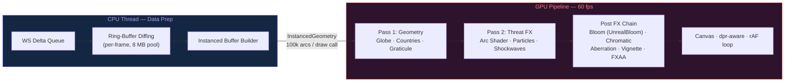

### 5.2 Shader Highlights

| Effect | Technique |
|---|---|
| 🌍 **Atmosphere** | Back-side sphere, fresnel rim: `pow(1.0 - dot(normal, viewDir), 3.0) * cyan` |
| 🗺️ **Risk heat countries** | Per-vertex country risk attribute → mix(`land-mass` gradient, `sev-high`, heat) |
| ➰ **Threat arcs** | Quadratic bezier in vertex shader; `uv.x` dash flow: `fract(uv.x * 40.0 - time * speed)`; alpha feathered head/tail |
| 💥 **Shockwave rings** | Expanding torus alpha ring, `smoothstep` falloff, additive blending |
| ✨ **Bloom** | Selective UnrealBloom — only emissive layers (arcs, markers) exceed luminance threshold |
| 🌠 **Starfield** | 5k point sprites in far shell, twinkle via `sin(time + seed)` |

### 5.3 Performance Budgets (Contract-Enforced)

| Metric | Budget | Enforcement |
|---|---|---|
| Frame time | ≤ 16.6 ms (60 fps) | Perf budget CI test (Playwright trace) |
| Draw calls | ≤ 60 | Instancing + layer merging |
| GC pauses | 0 (zero-alloc render loop) | Object pools; `--expose-gc` leak test |
| Memory | ≤ 350 MB @ 100k arcs | Heap snapshot gate |
| First globe paint | ≤ 2.5 s (4G) | Lighthouse CI gate |
| Data → pixel | ≤ 250 ms p95 | SLO + on-canvas latency HUD |

### 5.4 Fallback Ladder

`WebGPU → WebGL2 → WebGL1 (reduced FX) → 2D Canvas heat map (equirectangular)` — capability detection at boot; visual FX tiers A/B/C chosen by `GPURenderer.capabilities` + device pixel ratio heuristics.

## 6. Live Threat Feed Pipeline

> ⚡ **Design goal:** External intelligence → GPU pixels in ≤ 250 ms p95, with every hop logged to the audit ledger.

### 6.1 Ingestion Sources

| Category | Sources | Protocol | Trust Tier |
|---|---|---|---|
| Government / CERT | CISA AIS, NCSC, CERT-EU | TAXII 2.1, RSS | T1 (high trust) |
| Threat Communities | MISP instances, OTX, ThreatFox (abuse.ch) | MISP REST, TAXII, CSV | T1–T2 |
| Commercial Feeds | Recorded Future, Shodan Streams, GreyNoise | REST / WebSocket | T2 (contractual) |
| Honeypot / Sensor Mesh | T-Pot sensors, DNS sinkholes, spam traps | gRPC telemetry | T2 (first-party) |
| Partner Webhooks | ISAC members, Breach disclosure portals | Signed HTTPS POST (HMAC + mTLS) | T2–T3 |
| OSINT Scrapers | Pastebin/Telegram breach channels, security press | HTTP poll + NLP extract | T3 (needs corroboration) |
| Internal Telemetry | Customer SIEM push (opt-in), IAM anomaly events | Signed events | T1 (customer-owned) |

### 6.2 Pipeline Stages

```mermaid
flowchart LR
    SRC([Raw Feed]) --> V[1. Verify<br/>Sig · Schema · TLS Pin]
    V --> D[2. Dedupe<br/>Bloom filter · ID graph]
    D --> N[3. Normalize<br/>→ OCSF / STIX 2.1]
    N --> EN[4. Enrich<br/>GeoIP · ASN · CVE · ATT&CK]
    EN --> SC[5. Score<br/>CVSS4 + EPSS + KEV]
    SC --> GE[6. Geocode<br/>lat/lon · ISO-3166]
    GE --> PU[7. Publish<br/>threat.stream + SSE/WS]
    PU --> AU[8. Audit<br/>hash-chain every hop]
    style V fill:#0f3460,color:#ffd32a,stroke:#f7b731
    style N fill:#132743,color:#b39dff,stroke:#7d5fff
    style SC fill:#2d132c,color:#ff7b7b,stroke:#ee4540
    style PU fill:#123c2e,color:#7dffa8,stroke:#3ae374
```

**Stage details:**

| # | Stage | Key Behaviors |
|---|---|---|
| 1 | **Verify** | HMAC/Ed25519 source signature check, JSON-schema validation, mTLS pinning, size + rate guards (anti-poisoning) |
| 2 | **Dedupe** | SimHash on IOC set + TTL window; cross-feed correlation graph keyed by `indicator.id` |
| 3 | **Normalize** | Map to internal `ThreatEvent` schema (OCSF-aligned); unknown fields quarantined to schema registry review queue |
| 4 | **Enrich** | MaxMind GeoIP2, PeeringDB ASN, NVD CVE join, MITRE ATT&CK technique tagging, shodan banner context |
| 5 | **Score** | `risk = 0.45·CVSS4 + 0.25·EPSS + 0.15·KEV + 0.15·sourceTrust` → 0–100, banded LOW/MED/HIGH/CRIT/Zero-day |
| 6 | **Geocode** | IP→lat/lon; org HQ fallback; country rollups; geo-precision caps for privacy-sensitive feeds |
| 7 | **Publish** | Kafka `threat.scored` → Redis pub/sub → WS/SSE edge sharding by viewport quadrant |
| 8 | **Audit** | Every mutation emits an audit event: actor, action, input-hash, output-hash, timestamp (see §12) |

### 6.3 Reliability Controls

- **Backpressure:** Kafka consumer lag autoscaling; per-source token-bucket rate limits; circuit breakers per feed.
- **Anti-poisoning:** T3 sources require 2-source corroboration before surfacing on the globe (auto-annotated "unverified").
- **Replay:** Kafka retention 7 days + cold archive to S3 (gzip STIX bundles) for 365 days.
- **Poison queue:** Malformed events to DLQ with dashboard triage; never dropped silently.
- **Feed health:** Per-source SLA scorecard (freshness, accuracy, uptime) displayed in Admin UI.

---

## 7. Backend Microservices Architecture

### 7.1 Service Catalog

| Service | Runtime | Responsibility | Scaling Signal |
|---|---|---|---|
| `feed-ingest` | Go | Multi-protocol connectors, source auth | Kafka producer queue depth |
| `normalizer` | Go | Schema mapping, OCSF canonicalization | consumer lag |
| `enricher` | Go | GeoIP/ASN/CVE side-cars, local MaxMind mirror | CPU |
| `scoring-engine` | Rust | Deterministic risk scoring, banding | consumer lag |
| `geo-service` | Go + PostGIS | Tile/region rollups, country aggregates | QPS |
| `stream-gateway` | Go | WS/SSE fan-out, viewport sharding | conn count |
| `query-api` | Go | REST/GraphQL for events, filters, drilldown | QPS |
| `report-engine` | Rust | PDF/CSV/JSON/STIX/XLSX rendering + signing | queue depth |
| `audit-service` | Rust | Hash-chained ledger, verify API, export | write QPS |
| `notify-service` | Go | Webhook fan-out, email, Slack, PagerDuty | queue depth |
| `admin-svc` | Go | Tenant, source, user, key management | low RPS |

### 7.2 Communication Rules

- **Sync:** gRPC (internal, mTLS via Istio) for query paths < 100 ms.
- **Async:** Kafka for all state-changing flows; services emit **domain events** (`threat.ingested`, `threat.scored`, `report.generated`, `audit.appended`).
- **Idempotency:** All consumers keyed by `event_id`; duplicate delivery is safe.
- **Saga pattern** for cross-service workflows (e.g., report generation → sign → store → notify) with compensating actions.

### 7.3 Multi-Tenancy

- Tenant = row-level security in PostgreSQL (`tenant_id` on every table) + Kafka topic prefix + S3 prefix + JWT claim `tid`.
- OPA enforces tenant isolation on every gateway request; cross-tenant access requires explicit legal-agreement grant.
- Tenant-scoped encryption: S3 objects use per-tenant KMS data keys (envelope encryption).

---

## 8. Data Models & Schemas

### 8.1 Core Entities (ERD)

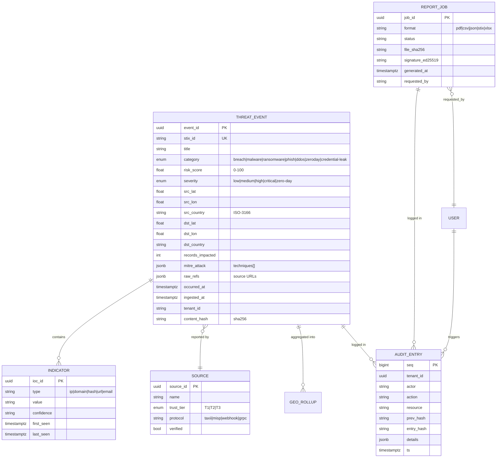

### 8.2 Canonical `ThreatEvent` JSON (wire format)

```jsonc
{
  "event_id": "9f1c8e2a-7b3d-4e5f-a1b2-c3d4e5f60718",
  "stix_id": "indicator--0f8e2d3c-...",
  "title": "Ransomware exfil — EU logistics provider",
  "category": "ransomware",
  "severity": "critical",
  "risk_score": 94.2,
  "geo": {
    "src": { "lat": 52.52, "lon": 13.405, "country": "DE", "asn": 3320 },
    "dst": { "lat": 40.7128, "lon": -74.006, "country": "US", "asn": 15169 }
  },
  "impact": { "records": 2500000, "pii_classes": ["emails", "gov_ids"] },
  "techniques": ["T1486", "T1567"],
  "indicators": [
    { "type": "ip", "value": "203.0.113.7", "confidence": "high" },
    { "type": "sha256", "value": "a1b2...", "confidence": "medium" }
  ],
  "sources": [
    { "source_id": "src_cisa", "trust_tier": "T1", "first_seen": "2026-09-24T08:12:00Z" }
  ],
  "occurred_at": "2026-09-24T08:02:31Z",
  "ingested_at": "2026-09-24T08:12:07Z",
  "content_hash": "sha256:9a2f...c41",
  "audit_seq": 884213
}
```

### 8.3 Retention & Lifecycle

| Data Class | Store | Hot | Warm | Cold | Disposal |
|---|---|---|---|---|---|
| Scored events | TimescaleDB | 90 d | 13 mo (compressed) | ClickHouse 5 y | Crypto-shred per tenant key |
| Raw STIX bundles | S3 | — | — | 365 d (WORM) | Object-lock expiry |
| Audit ledger | PG + S3 | 90 d | 7 y (compliance) | 7 y | Never (legal hold aware) |
| Reports | S3 WORM | 30 d | 13 mo | On-request | Tenant-initiated + logged |
| IOC search index | OpenSearch | 30 d | — | Rebuild from TSDB | Roll over |

---

## 9. API Architecture

### 9.1 Surface Map

| API | Protocol | Consumers | Auth |
|---|---|---|---|
| Query API | REST `/v1` + GraphQL | Web app, partners | OIDC + OPA |
| Stream API | WSS `/v1/stream` | Globe client | OIDC short-lived JWT |
| Report API | REST `/v1/reports` | Web, CI, CLI | OIDC + scopes |
| Audit API | REST `/v1/audit` | Auditors, SIEM | OIDC + `audit:read` |
| Ingest API | REST/gRPC `/v1/ingest` | Partner feeds | mTLS + HMAC |
| Webhooks (out) | HTTPS POST | Customer SIEM/Slack | HMAC-signed |

### 9.2 Representative Endpoints

```http
GET  /v1/threats?bbox=...&since=...&severity>=high&category=breach
POST /v1/threats/query            (cursor-paginated, field masks)
GET  /v1/threats/{id}             (full detail + evidence chain)
WS   /v1/stream?viewport=global   (delta frames, seq-resumable)
GET  /v1/stats/heatmap?res=country&window=24h
POST /v1/reports                  (create report job)
GET  /v1/reports/{job_id}         (status + signed download URL)
GET  /v1/audit?from=...&to=...    (paginated ledger slice)
GET  /v1/audit/verify?seq=...     (on-demand chain integrity proof)
POST /v1/ingest/stix              (TAXII-compatible push)
```

### 9.3 API Security Controls (OWASP API Top 10 Mapped)

| Threat | Control |
|---|---|
| BOLA / BFLA | Object-level authz in OPA middleware on every handler; tests in CI |
| Broken auth | OIDC only, no custom auth; WebAuthn MFA enforced for admins |
| Mass assignment | Strict DTO schemas, field allow-lists, no direct entity binding |
| Rate / DoS | Per-tenant token buckets, WAF, stream backpressure, body-size caps |
| Injection | Parameterized queries everywhere; OpenSearch builder API; no string SQL |
| Data exposure | Field-level redaction (`pii_classes`), response schemas reviewed, no raw blobs |
| SSRF | Egress proxy allow-list for feed fetchers; URL validation + DNS pinning |
| Logging | Structured, redacted; no tokens/IOCs-in-clear beyond necessity |

---

## 10. Security Framework Architecture

> 🛡️ **Philosophy: "Compliance is a compile-time property, not an audit-season scramble."** Controls are code (OPA policies, Terraform guardrails, CI gates), evidence is automatic.

### 10.1 Zero-Trust Control Plane

- **Identity:** OIDC everywhere; workload identity via SPIFFE/SPIRE for service-to-service; no static secrets.
- **Device/Session:** Short-lived JWTs (10 min), rotating refresh via httpOnly SameSite=Strict cookies; WebAuthn step-up for privileged actions (report signing, audit export).
- **Network:** Istio mTLS mesh, default-deny NetworkPolicies, egress gateways with FQDN allow-lists.
- **Policy:** OPA/Rego policies version-controlled, unit-tested, deployed via GitOps; every request carries a policy decision ID that lands in the audit ledger.

### 10.2 ISO/IEC 27001:2022 — Control Mapping (Annex A)

| Annex A Theme | Selected Controls | Implementation in AEGIS-SENTINEL |
|---|---|---|
| A.5 Organizational | 5.1 Policies · 5.9 Inventory · 5.19–5.23 Supplier & cloud security | Security policy-as-code repo; CMDB auto-built from K8s + Terraform state; supplier trust tiers T1–T3 with contractual security addenda |
| A.6 People | 6.1 Screening · 6.3 Awareness · 6.5 Role change | Joiner/mover/leaver workflow wired to IdP; annual phishing sim + globe-platform training |
| A.7 Physical | 7.4 Monitoring | Cloud-only footprint; provider attestations (SOC2/ISO) ingested as evidence |
| A.8 Technological | 8.2 Privileged rights · 8.3 Access restriction · 8.9 Config mgmt · 8.12 DLP · 8.15 Logging · 8.16 Monitoring · 8.24 Crypto | PIM/JIT admin; RLS + OPA; GitOps drift detection; DLP on egress; §12 audit ledger; Alertmanager→SOC; envelope encryption + HSM |

**ISMS mechanics:** risk register auto-populated from threat events; Statement of Applicability generated from control catalog (§16); nonconformity tracker integrated with issue tracker; management review dashboards.

### 10.3 NIST — CSF 2.0 + SP 800-53 Rev.5 Mapping

| CSF 2.0 Function | Key Outcomes | Architectural Realization |
|---|---|---|
| **GOVERN (GV)** | Cyber risk strategy, roles, oversight | Security steering docs in repo; control owner matrix; compliance dashboards (§16) |
| **IDENTIFY (ID)** | Asset & vulnerability id | SBOM per build (CycloneDX), CVE sync from NVD/OSV on images & deps |
| **PROTECT (PR)** | Access control, data security | OIDC+MFA, OPA ABAC, envelope encryption, DLP, secure SDLC gates |
| **DETECT (DE)** | Continuous monitoring | OTel traces, SIEM rules, anomaly detection on feed & API behavior |
| **RESPOND (RS)** | Incident mgmt | PagerDuty runbooks, incident channel automation, postmortem templates with audit evidence export |
| **RECOVER (RC)** | Recovery comms & plans | Multi-region failover, backup-restore drills (quarterly), RTO 15 min / RPO 1 min |

**800-53 families:** AC (OIDC/OPA), AU (§12), CA (assessments pipeline), CM (GitOps), IA (IdP/MFA), IR (incident automation), SC (mesh mTLS, crypto), SI (SAST/DAST, SIEM), PT/PS/SR covered by process automations.

### 10.4 OWASP Coverage — Top 10 (2021), API Top 10, ASVS 4.0

| OWASP Top 10 (2021) | Mitigation Architecture |
|---|---|
| A01 Broken Access Control | Central OPA decision point, object-level checks, tenant RLS, authorization regression test suite |
| A02 Cryptographic Failures | TLS 1.3 only, AES-256-GCM at rest, Ed25519 signatures, HSM-backed keys, cert rotation ≤ 90 d |
| A03 Injection | Zero string-SQL; typed query builders; CSP `strict-dynamic`; GLSL uniforms never interpolate user input |
| A04 Insecure Design | Threat modeling (STRIDE) per service in ADRs; abuse-case reviews; secure design gates in CI |
| A05 Security Misconfiguration | Immutable images, signed IaC, drift detection, CIS-benchmarked K8s baseline, kube-bench in pipeline |
| A06 Vulnerable Components | SBOM + OSV/NVD match on every build; auto-PR dependency bumps; EOL component policy |
| A07 Auth Failures | WebAuthn MFA, breached-password checks, session rotation, anomaly-based lockout |
| A08 Integrity Failures | Sigstore-signed artifacts, S3 WORM, hash-chained audit (§12), signed reports (§11) |
| A09 Logging Failures | §12 ledger + SIEM fan-out, log integrity hashes, alert on audit-chain break |
| A10 SSRF | Egress proxy, allow-lists, DNS rebinding protection, IMDSv2 enforced |

**ASVS:** Level 2 adopted platform-wide; Level 3 controls for the audit + report-signing services. CI runs ASVS-tagged integration tests; deviations require ADR + risk acceptance.

### 10.5 Additional Frameworks

| Framework | Posture |
|---|---|
| SOC 2 Type II | Control evidence auto-collected (audit ledger, CMDB, CI gates); readiness dashboards |
| GDPR / UK-GDPR | Data minimization on geo (precision caps), DPIA for breach datasets, DSR tooling, EU data residency option |
| MITRE ATT&CK | Technique tagging on every event → globe filters + coverage heatmaps |
| VPAT / WCAG 2.2 AA | Accessibility conformance for the UI layer |

### 10.6 Secure SDLC Gates

```mermaid
flowchart LR
    C[Commit] --> S[SAST + Secrets Scan]
    S --> D[SCA + SBOM + CVE Gate]
    D --> T[Unit + Contract + AuthZ tests]
    T --> B[Build + Sigstore Sign]
    B --> P[Policy Check<br/>OPA + CIS + tag guardrails]
    P --> DP[DAST + Chaos smoke]
    DP --> DE[ArgoCD Progressive Deploy]
    DE --> M[Runtime Guards]
    style S fill:#0f3460,color:#ffd32a,stroke:#f7b731
    style D fill:#2d132c,color:#ff7b7b,stroke:#ee4540
    style DE fill:#123c2e,color:#7dffa8,stroke:#3ae374
```

---

## 11. Reporting Engine & Download Formats

> 📄 **One-click, signed, court-ready exports** — from the globe UI, any filtered view becomes a report; every report is reproducible, watermarked, hash-manifested and Ed25519-signed.

### 11.1 Report Generation Flow

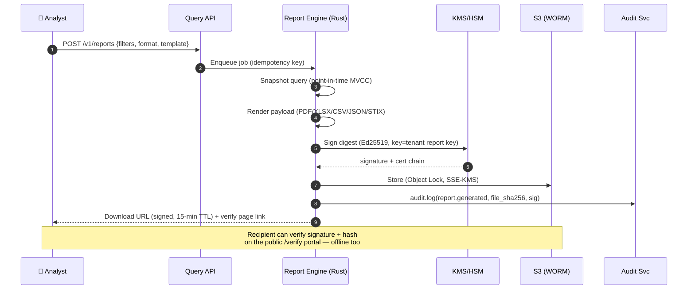

### 11.2 Download Format Matrix

| Format | Template / Layout | Contents | Best For |
|---|---|---|---|
| 📕 **PDF** (executive) | Branded cover (neon-noir theme), globe snapshot, severity donut, top-10 country bar, timeline, methodology annex | Filtered incident summaries, risk scores, ATT&CK tags, evidence hashes | Board / exec briefings, regulator packets |
| 📊 **XLSX** | Multi-sheet: Summary, Events, IOCs, Country rollups, Methodology | Pivot-ready raw tables with formulas | Analysts, pivoting |
| 📃 **CSV** | RFC 4180, UTF-8 BOM, `event_id` first column | Flat event export (all filterable fields) | SIEM import, data lakes |
| 🧬 **JSON** | Canonical `ThreatEvent[]` + provenance block | Full fidelity, JSON Schema published | API pipelines, integrations |
| 🛡️ **STIX 2.1** | STIX bundle (indicators, relationships, sightings) | Interop with TIPs/Splunk ES | Threat-intel sharing communities |
| 🧾 **Audit Pack (PDF+JSON)** | Ledger slice + chain proof + signature manifest | Compliance evidence subset | ISO/NIST/SOC2 auditors |
| 🖼️ **PNG/SVG snapshot** | Current viewport render + legend + timestamp watermark | Visual evidence | Slide decks, tickets |

### 11.3 Report Integrity Guarantees

1. **Point-in-time snapshot** — reports render from an MVCC snapshot; concurrent live updates never mutate an in-flight report.
2. **SHA-256 content digest** embedded in the PDF footer and JSON `provenance` block.
3. **Ed25519 signature** over the digest from tenant-scoped HSM keys; X.509 cert chain included.
4. **Watermarking** — user ID + timestamp subtly stenciled in PDF background & PNG (deterrent to resharing).
5. **Verification portal** — `/verify` page (and CLI `aegis verify report.pdf`) checks signature, hash, and cert chain offline.
6. **Reproducibility** — same filters + same `as_of` timestamp ⇒ byte-identical report (deterministic renderer).

### 11.4 Report Types

| Type | Trigger | Cadence |
|---|---|---|
| Executive Risk Brief | Manual / scheduled | Daily 07:00 tenant-TZ |
| Incident Detail Pack | On event selection | On-demand |
| Compliance Evidence Pack | Auditor self-service | On-demand (step-up auth) |
| Feed Source Scorecard | Auto | Weekly |
| Regulatory Notification Draft | GDPR-72h helper on qualifying breach | On-demand |
| Custom Query Export | Any saved filter | On-demand / cron |

---

## 12. Auditability Architecture

> 🔍 **Every action that reads sensitive data or changes state produces a tamper-evident, independently verifiable record.** The ledger is the platform's memory — and its conscience.

### 12.1 Audit Event Model

```jsonc
{
  "seq": 884213,
  "ts": "2026-09-24T08:12:07.412Z",
  "tenant_id": "tnt_acme",
  "actor": { "type": "user|service|feed", "id": "usr_jdoe", "ip": "198.51.100.9", "session": "s_7f2" },
  "action": "report.generate",
  "resource": "report_job:job_9f1c",
  "decision": { "policy_id": "opa:reports.allow", "result": "allow", "decision_id": "pol_5de" },
  "details": { "format": "pdf", "filters": { "severity": ["critical"] } },
  "prev_hash": "sha256:71ba...9e2",
  "entry_hash": "sha256:c1d9...a7f",
  "signature": "ed25519:9d3b...",          // HSM-signed by audit signer
  "anchor": { "type": "rfc3161-tsa", "tsa": "internal-tsa", "token_sha256": "4f1e..." }
}
```

### 12.2 Tamper-Evident Chain Design

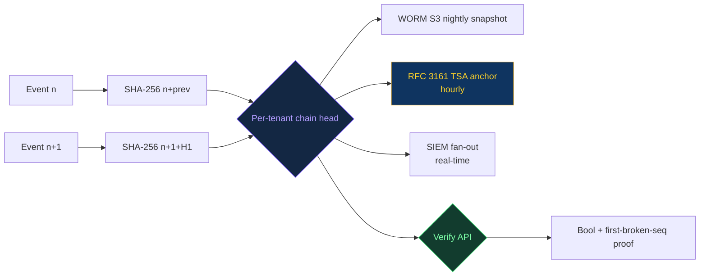

- **Append-only:** DB user for the ledger has INSERT-only grants; UPDATE/DELETE revoked at the role level.
- **HSM-signed entries:** Audit signer key lives in HSM; no human can export it.
- **External anchoring:** Hourly RFC 3161 timestamps + optional public blockchain anchor for extra-organizational proof.
- **Independent verification:** `GET /v1/audit/verify` recomputes the chain and returns a Merkle proof; auditors can run the open-source verifier offline against the WORM export.
- **Break alarm:** Any chain discontinuity pages the SOC within 60 s (`audit.chain.integrity` alert rule).

### 12.3 What Gets Audited (Coverage Matrix)

| Domain | Events |
|---|---|
| AuthN/AuthZ | Logins (success/fail), MFA changes, token issuance, OPA denies |
| Data access | Threat event drilldowns involving PII classes, audit-ledger reads, report downloads |
| Report lifecycle | generate / sign / download / verify / delete requests |
| Feed ops | Source add/remove, ingestion stats, quarantines, DLQ triage |
| Admin | Tenant/user/role changes, key ceremonies, config drift corrections |
| Platform | Deploys (image digest), policy changes (OPA commit SHA), break-glass usage |

### 12.4 Auditor Experience

- **Self-service compliance portal:** filter ledger by framework tag (ISO/NIST/OWASP), export an **Audit Pack** (§11.2) with chain proof.
- **Control-to-evidence view:** pick a control (e.g., ISO A.8.15) → see the last 90 days of matching events, CI evidence runs, and dashboard screenshots.
- **SIEM parity:** full ledger mirrored to Splunk/Elastic for correlation with customer SOCs.
- **Legal hold:** flagged sequences are excluded from any purge workflow; holds are themselves audited.

### 12.5 Privacy Balancing

- PII in audit details is minimized/tokenized (pseudonymous actor IDs where lawful).
- Geo-precision caps and k-anonymity for sensitive customer-sourced telemetry.
- Ledger access itself is audited (meta-audit) — no unobserved observers.

## 13. Observability & SRE

### 13.1 Telemetry Stack

| Pillar | Tooling | Notable Signals |
|---|---|---|
| Metrics | Prometheus + Grafana | Ingest lag, scoring latency, WS fan-out rate, GPU-side client FPS (via RUM beacon) |
| Traces | OpenTelemetry → Tempo | End-to-end: feed push → globe pixel (W3C traceparent propagated through Kafka headers) |
| Logs | Loki (structured JSON) | Redacted by DLP filter, hash-linked to audit seq where applicable |
| Client RUM | WebGL perf HUD + beacon | FPS, draw calls, JS heap, Web Vitals, per-device GPU tier |
| Synthetic | Playwright probes | Globe boot in Chromium/Firefox/WebKit, WS connect, report download e2e |

### 13.2 SLOs & Error Budgets

| SLO | Target | Consequence of Breach |
|---|---|---|
| Globe data freshness (ingest→pixel) | 250 ms p95 | Feature freeze, reliability sprint |
| Stream availability | 99.95% monthly | On-call review, capacity review |
| Query API latency | 200 ms p95 | Perf budget re-negotiation |
| Audit ledger write success | 100% (hard) | **Sev-1** — chain break procedure (§12.2) |
| Report generation | 60 s p95 (≤ 1 M rows) | Queue autoscale tuning |

### 13.3 Alerting Philosophy

- **Symptoms over causes:** page on user-impact (freshness, availability), not CPU.
- **Runbook-first:** every alert links a runbook; unrunbooked alerts are auto-issues.
- **Audit is sacred:** ledger anomalies page immediately and bypass maintenance windows.

---

## 14. Scalability & Performance Budgets

### 14.1 Capacity Model

| Dimension | Design Target | Headroom Strategy |
|---|---|---|---|
| Concurrent threat events/min | 50,000 | Kafka partitions scale horizontally; scoring engine stateless |
| Concurrent WS clients | 250,000 | Viewport-sharded fan-out, Redis pub/sub, connection-draining deploys |
| Globe entities live | 100,000 arcs | GPU instancing; LOD culling by zoom; severity-based decimation |
| Tenants | 500 | Namespace-per-tenant; Kafka/S3 prefix isolation |
| Report rows per job | 5 M | Rust streaming renderer (constant memory) |
| Audit writes | 20,000/s peak | Batched chain appends, per-tenant pipelines |

### 14.2 Scaling Tactics

- **Client:** LOD pyramid — country heat at low zoom, arcs at mid, drill-down detail only on selection. Off-screen quadrant muting; severity-based render priority (critical always renders, low may decimate under load).
- **Server:** Stateless services + HPA on Kafka lag & QPS; regional cell isolation (blast radius = one cell); Redis cluster resharding online.
- **Data:** Timescale hypertables w/ native compression (≈10×); ClickHouse for ad-hoc OLAP; materialized country rollups refreshed continuously.

### 14.3 Resilience Patterns

| Failure | Mitigation |
|---|---|
| Feed source outage | Circuit breaker + stale-data badge on globe (honest UI), feed SLA scorecard degradation |
| Kafka broker loss | RF=3, rack-aware, mirrored to DR cluster; consumer rebalance < 15 s |
| Region failure | Active-active cells, Route53 health-check failover, RTO 15 min / RPO 1 min |
| WS gateway overload | Admission control (serve-degrade: SSE fallback), client exponential backoff + jitter |
| Audit HSM unavailable | Local queue w/ disk-backed buffer + replay; chain continues (hash only), signatures backfilled + flagged |

---

## 15. Deployment Topology

### 15.1 Multi-Region Cell Architecture

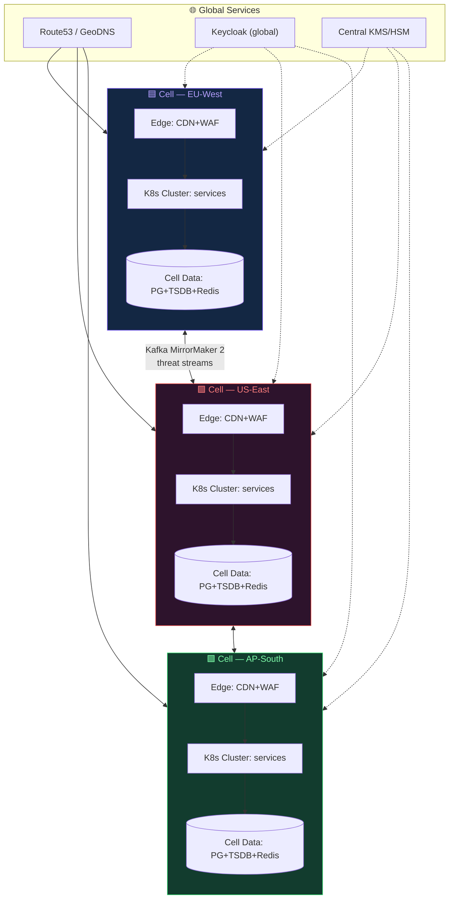

- **Cell = autonomous region stack** (edge, services, data). Tenants pin to cells for residency; global threat stream replicates across cells via MirrorMaker 2.
- **GitOps:** ArgoCD per cell; promotion dev → stage → prod with signed images only.
- **DR:** Cross-cell PostgreSQL physical replication for config; event data recovers from Kafka mirror + S3 archive.

### 15.2 Environments

| Env | Purpose | Data | Guardrails |
|---|---|---|---|
| dev | Feature work | Synthetic fixtures | Open egress allow-list, no real IOCs |
| stage | Pre-prod parity | Anonymized 1% sample | Full security gates identical to prod |
| prod | Live | Live feeds (tenant-scoped) | Break-glass audited, change freeze windows |
| sandpit | Partner integrations | Synthetic STIX | Isolated cell, rate-capped |

---

## 16. Compliance Control Catalog

> The generated Statement of Applicability lives here: every control is an ID with owner, implementation artifact, and evidence source — the bridge between §10/§11/§12 and certification audits.

### 16.1 Control Register (Excerpt)

| Control ID | Framework | Control Statement | Implementation Artifact | Evidence Source |
|---|---|---|---|---|
| SEC-AC-01 | ISO A.5.15 / NIST AC-2 / OWASP A01 | Least-privilege, reviewed access | OPA policies + JIT admin | OPA decision logs; access review exports |
| SEC-CR-01 | ISO A.8.24 / NIST SC-8/SC-13 / OWASP A02 | Crypto protecting data in transit & at rest | TLS 1.3 policy; envelope encryption; HSM keys | TLS scan reports; KMS key inventory |
| SEC-AU-01 | ISO A.8.15 / NIST AU-2/AU-9 / OWASP A09 | Tamper-evident audit logging | Hash-chained ledger (§12) | Chain verify reports; SIEM mirror |
| SEC-IN-01 | ISO A.8.16 / NIST DE.CM / SIEM rules | Continuous monitoring | OTel + SIEM fan-out | Alert history; coverage dashboards |
| SEC-SD-01 | ISO A.8.25–8.31 / NIST SA-11 / OWASP A06/A08 | Secure development & integrity | CI gates (§10.6); Sigstore signing | Pipeline run attestations; SBOM archive |
| SEC-RP-01 | ISO A.5.29–5.30 / NIST RS/RC | Incident & continuity management | Runbooks; multi-cell DR | Drill reports; failover test logs |
| SEC-DP-01 | GDPR Art. 5/25/32 | Data protection by design | Geo caps, DLP, minimization | DPIA docs; DSR logs |
| SEC-AC-02 | ISO A.8.2–8.3 / NIST AC-6 | Privileged access management | WebAuthn step-up; break-glass | Step-up audit events; break-glass reviews |
| SEC-WS-01 | OWASP ASVS L2/L3 | Application security verification | ASVS-tagged test suite | CI test evidence |
| SEC-RS-01 | NIST ID.RA / ISO 27005 | Risk assessment automation | Risk register fed by threat events | Register snapshots |

*(Full register maintained in repo `compliance/controls.yaml`; rendered to the admin compliance dashboard and to the Audit Pack PDF.)*

### 16.2 Certification Pathway

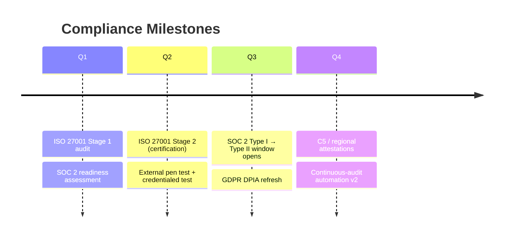

---

## 17. Architecture Decision Records (Key ADRs)

| ADR | Decision | Rationale & Trade-offs |
|---|---|---|
| ADR-001 | WebGL2-first with WebGPU progressive enhancement | Max device reach today; WebGPU path behind capability detection. Trade-off: dual shader paths maintained until WebGPU baseline ≥ 95%. |
| ADR-002 | Three.js over raw WebGL / babylon | Ecosystem (postprocessing, loaders), team fluency. Trade-off: bundle ~150 KB gz — mitigated by code-splitting globe chunk. |
| ADR-003 | Kafka as single event backbone | Replay, retention, ordered per-key, ecosystem. Trade-off: ops burden vs. Kinesis — mitigated by managed offering. |
| ADR-004 | Rust for scoring + report + audit services | Determinism, memory safety, constant-memory streaming for 5 M-row reports. Trade-off: slower iteration than Go — isolated to 3 services. |
| ADR-005 | Hash-chained ledger over third-party QLDB-style service | Portability, no vendor lock, offline verification possible. Trade-off: we own the verifier tooling (open-sourced). |
| ADR-006 | Ed25519 for report signing | Small sigs, fast verify, modern. Trade-off: some gov HSMs lack Ed25519 → RSA-3072 fallback profile. |
| ADR-007 | OPA for authz (not per-service libs) | Policy-as-code, testable, audit decision IDs. Trade-off: extra hop (~3 ms) — cached decisions for hot paths. |
| ADR-008 | Neon-noir design system | SOC-wall aesthetics + dark-first UX; severity color science validated for deuteranopia via shape coding. Trade-off: print/PDF uses light-theme variant. |
| ADR-009 | Event-carried state transfer over query joins | Stream consumers self-sufficient; lower coupling. Trade-off: larger events — schema registry + compression mitigate. |
| ADR-010 | Deterministic report renderer | Reproducibility for legal defensibility. Trade-off: no arbitrary JS in templates — restricted template DSL. |

---

## 18. Delivery Roadmap

### 18.1 Phased Plan

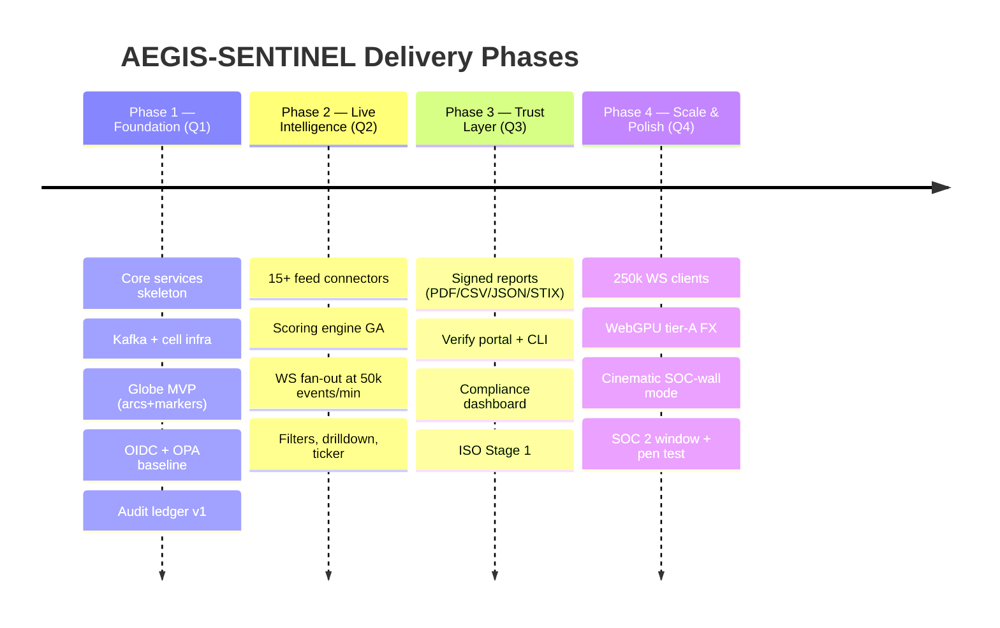

### 18.2 Team Topology

| Squad | Focus |
|---|---|
| **Globe Guild** (3 FE) | WebGL engine, shaders, design system |
| **Stream Core** (4 BE) | Ingest → score → publish pipeline |
| **Trust & Ledger** (2 BE + 1 Sec) | Audit, reports, crypto, compliance |
| **Platform SRE** (2) | Cells, GitOps, observability, DR |
| **Product & Design** (2) | UX research, SOC-wall ergonomics, accessibility |

### 18.3 Risk Register (Top Risks)

| Risk | Likelihood | Impact | Mitigation |
|---|---|---|---|
| Feed poisoning (false flags) | Medium | High | Trust tiers, corroboration for T3, source scorecards |
| WebGL perf on low-end devices | Medium | Medium | Fallback ladder (§5.4), FX tiers, 2D canvas mode |
| Audit chain key ceremony mistakes | Low | Critical | Dual-control ceremony, dry runs, offline verifier drills |
| Data residency violations | Low | Critical | Cell pinning, residency tests in CI, DPIA gates |
| GeoIP misattribution | High | Low | Confidence badges, ASN context, “approximate location” labels |

---

<div align="center">

**🌍 AEGIS-SENTINEL** — *See every breach before it becomes a headline.*

`WebGL` · `Zero-Trust` · `ISO 27001` · `NIST CSF 2.0` · `OWASP` · `Signed Reports` · `Tamper-Evident Audit`

</div>


