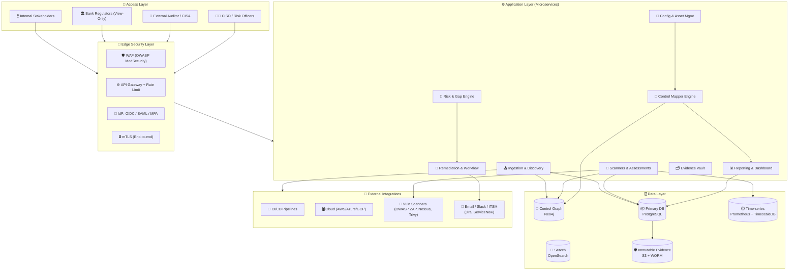
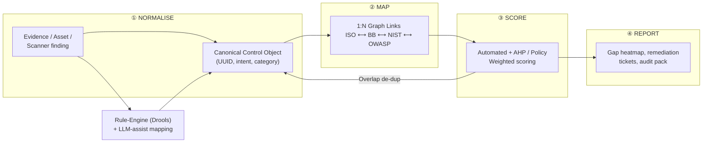
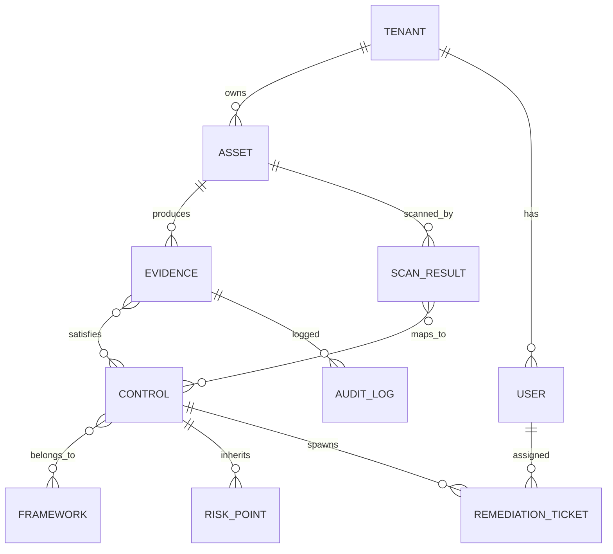
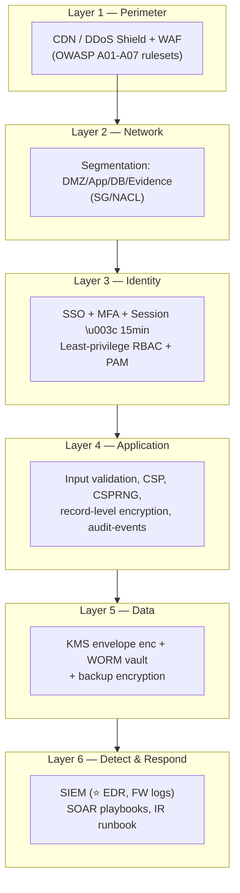
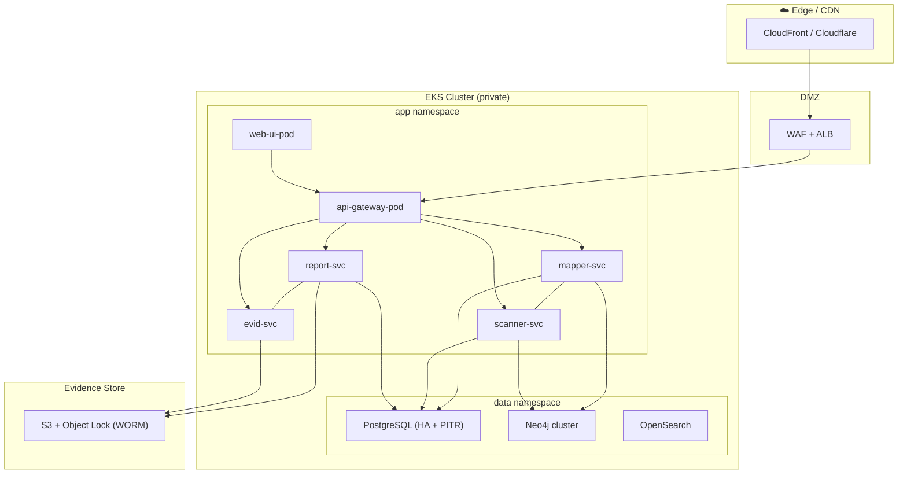

# 🏦 Compliance Automation Suite — Reference Architecture

### ISO 27001 • Bangladesh Bank ICT Guidelines • NIST CSF • OWASP Top 10 • PCI-DSS Alignment
#### *Control Mapper & GRC Reporting Platform*

<div align="center">

| Build | Coverage | Governance | Reporting |
|---|---|---|---|
| `v1.0.0` | 114 ISO controls + 39 BB Annexes | 3-tier RBAC + Audit Log | PDF · DOCX · XLSX · CSV · JSON |
| SaaS-ready | 4 mapping engines | SSO / MFA / KMS | SOC2-ready evidence trail |

</div>

---

## 📌 Table of Contents

1. [Executive Overview](#1-executive-overview)
2. [Frameworks & Regulatory Scope](#2-frameworks--regulatory-scope)
3. [High-Level Architecture](#3-high-level-architecture)
4. [Layer-wise Component Design](#4-layer-wise-component-design)
5. [Control Mapping Engine (Core)](#5-control-mapping-engine-core)
6. [Data Model & ERD](#6-data-model--erd)
7. [Data Flow & Lifecycle](#7-data-flow--lifecycle)
8. [Security Architecture (Defence-in-Depth)](#8-security-architecture-defence-in-depth)
9. [Reporting & Evidence Downloads](#9-reporting--evidence-downloads)
10. [Technology Stack](#10-technology-stack)
11. [Deployment Topology](#11-deployment-topology)
12. [Role-Based Access Control](#12-role-based-access-control)
13. [Compliance Calendar & Automation](#13-compliance-calendar--automation)
14. [KPIs & Outcomes](#14-kpis--outcomes)
15. [Roadmap & Extensions](#15-roadmap--extensions)
16. [Annexures](#16-annexures)

---

# 1. Executive Overview

A single pane-of-glass **GRC (Governance, Risk & Compliance) platform** that automates the lifecycle of identifying, mapping, assessing, remediating, and reporting security controls across an organisation — harmonising **three+ regulatory regimes** into one continuous compliance engine.

<div align="center">

| Pain Point | Legacy Approach | Suite Solution |
|---|---|---|
| 📋 Control sprawl | Manual spreadsheets | 4-in-1 automated mapper |
| ⏱️ Audit prep | 3–6 months | Continuous (real-time posture) |
| ♻️ Repeat evidence | Re-collected yearly | Ephemeral, proof-of-state evidence store |
| 🔍 Duplicate checks | Siloed scans | Unified evidence → multi-framework de-duplication |
| 📉 Regulator visibility | Static PDFs | Live Dashboard + Exportable evidence packs |

</div>

**Core promise: *"One evidence point in → compliant positioning across every framework out."***

---

# 2. Frameworks & Regulatory Scope

<div align="center">

| Framework | Publisher / Jurisdiction | Scope | Mapped Control Count | Cadence |
|---|---|---|---|---|
| **ISO/IEC 27001:2022** | ISO (Global) | ISMS — Annex A controls (A.5–A.8) | 93 Annex A + 5 Trim | Annual Audit + Continuous |
| **Bangladesh Bank ICT Guidelines 2015** | Bangladesh Bank (BB) | Bank/FinTech ICT governance | 39 Chapters / 250+ clauses | Quarterly F&R + Annual |
| **NIST CSF 2.0** | NIST (USA) | Govern · Identify · Protect · Detect · Respond · Recover | 23 Categories / 108 Sub-cats | Continuous |
| **NIST SP 800-53** | NIST (USA) | Authorisation & control baselines | 20 Families (e.g., AC, AU, IA) | FedRAMP-aligned Cycle |
| **OWASP Top 10 2021** | OWASP (Global) | Application security | 10 Categories | Each Release / CI |
| **PCI-DSS 4.0** *(optional)* | PCI SSC | Cardholder data | 12 Requirements | Annual + Quarterly scans |

</div>

### 🎯 Framework Normalisation Model

```
 ┌──────────────────────────────────────────────────────────────┐
 │                    FRAMEWORK NORMALISATION                    │
 │                                                              │
 │  BB ICT 2015  ──┐                                            │
 │  ISO 27001     ──┼──► [ Semantics / Taxonomy Engine ] ──►    │
 │  NIST CSF 2.0  ──┼──►   Canonical Control Object             │
 │  OWASP Top 10  ──┘        (UUID, intent, category)           │
 │                                                    │         │
 │  Unified Evidence ────────────────────────────────► ▼         │
 │  Single source of truth ──► Multi-framework claims          │
 └──────────────────────────────────────────────────────────────┘
```

---

# 3. High-Level Architecture



---

# 4. Layer-wise Component Design

## 4.1 👤 Access Layer
| Component | Responsibility |
|---|---|
| **Web Portal** (React/Next.js) | Dashboards, GRC workspace, evidence upload |
| **Regulator Portal** (read-only) | Secure review area for Bangladesh Bank examiners |
| **Mobile / Email notifications** | Approval & remediation alerts via out-of-band channel |

## 4.2 🔐 Edge Security Layer
| Component | Framework Mapping | Implementation |
|---|---|---|
| **WAF** | OWASP Top 10 (A01–A07) | ModSecurity / AWS WAF — blocks injection, XSS, SSRF |
| **API Gateway** | NIST AC / ISO A.8.28 | OIDC token validation, per-tenant rate limiting |
| **Identity Provider** | ISO A.8.2–A.8.5, NIST IA | Keycloak / Azure AD — SSO + TOTP MFA |
| **mTLS / Network Segmentation** | NIST SC-7, ISO A.8.20 | Service mesh (Istio) east–west encryption |

## 4.3 ⚙️ Application Layer
| Service | Purpose | Key API |
|---|---|---|
| **Ingestion & Discovery** | Auto-import assets from CSP, CMDB, repo scans | `POST /v1/assets/ingest` |
| **Control Mapper Engine** | Canonical mapping, gap analysis, overlap dedupe | `POST /v1/map/analyze` |
| **Scanners & Assessments** | SAST/DAST/CSPM integration + human questionnaires | `POST /v1/assess/run` |
| **Risk & Gap Engine** | Scoring (CVSS × Likelihood × Impact), risk register | `POST /v1/risk/score` |
| **Remediation & Workflow** | Task assignment, SLA, escalation, evidence capture | `POST /v1/remediation/plan` |
| **Evidence Vault** | Immutable, hash-chained proof-of-state | `PUT /v1/evidence/store` |
| **Reporting Engine** | Regulator-ready pack generation (multi-format) | `POST /v1/reports/download` |

## 4.4 🗄️ Data Layer
| Store | Tech | Purpose |
|---|---|---|
| Primary DB | PostgreSQL 16 | Tenancy, assessments, users, audit log |
| Control Graph | Neo4j | Control→Evidence→Framework relationships |
| Search Index | OpenSearch | Full-text control/evidence search |
| Time-series | TimescaleDB | Scanner results trends, SLA metrics |
| Immutable Evidence | S3 + Object Lock (WORM) | Tamper-proof audit artefacts |

---

# 5. Control Mapping Engine (Core)

The **heart** of the suite — a four-stage pipeline that converts raw evidence into multi-framework compliance claims.



### 🧬 Canonical Control Object (CCO)

```
CCO {
  uuid:                  "ctl-8f2a-...",
  intent:                "Ensure confidentiality of data at rest",
  canonicalCategory:     "DATA_PROTECTION",
  mappedFrameworks[]:    [
    { framework: "ISO27001",  control: "A.8.24",  status: "MAPPED" },
    { framework: "BB_ICT",    control: "CH-14 (Info Sec Ops)", status: "MAPPED" },
    { framework: "NISTCSF",   control: "PR.DS-1",   status: "MAPPED" },
    { framework: "OWASP",     control: "A02:2021",  status: "RELATED" }
  ],
  evidenceHash:          "sha256:0x4f…",
  completeness:          87.4,
  assessor:              "sys® CISO",
  lastVerifiedAt:        "2026-09-24T08:00:00Z"
}
```

### 🔗 Overlap De-duplication Benefit
One piece of evidence (e.g., *"Encryption at rest using KMS"*) simultaneously satisfies **ISO A.8.24, BB ICT Ch-14, NIST PR.DS-1 & OWASP A02** — the engine reports this overlap automatically so audit teams avoid re-collecting the same proof four times.

---

# 6. Data Model & ERD



| Entity | Notes |
|---|---|
| `TENANT` | Multi-tenant bank/FinTech org, encrypted at row level |
| `ASSET` | System, DB, API, network zone with classification tag |
| `EVIDENCE` | WORM-stored artefact + SHA-256 hash chain |
| `CONTROL` | Canonical control object (framework-agnostic) |
| `FRAMEWORK` | ISO, BB, NIST, OWASP catalogue versions |
| `SCAN_RESULT` | Raw finding from ZAP/Nessus/Trivy with CVSS |
| `RISK_POINT` | Computed risk register entry (probability × impact) |
| `REMEDIATION_TICKET` | SLA-tracked work item → Jira/ServiceNow push |
| `AUDIT_LOG` | Append-only, hash-linked log (SIEM forwards) |

---

# 7. Data Flow & Lifecycle

```
┌─────────┐   ┌─────────────┐   ┌───────────────┐   ┌──────────────┐
│ INGEST  │──►│ DISCOVER    │──►│ MAP & NORMALISE│──►│ ASSESS/SCAN  │
│ (CSP,   │   │ (asset+env  │   │ (control graph│   │ (SAST/DAST/  │
│  CMDB)  │   │  fingerprint)│   │  + de-dup)    │   │  CX)         │
└─────────┘   └─────────────┘   └───────────────┘   └──────┬───────┘
                                                           ▼
┌──────────────┐   ┌──────────────┐   ┌────────────────────┐
│ REPORT PACK  │◄──│ GAP & RISK   │◄──│ EVIDENCE VAULT     │
│ PDF/DOCX/XLSX│   │ HEATMAP +    │   │ (hash-chained,     │
│ + JSON API   │   │ REMEDIATION  │   │  WORM immutable)   │
└──────────────┘   └──────────────┘   └────────────────────┘
```

**Data security in motion & at rest:**
- 🔒 **In transit:** mTLS + TLS 1.3 end-to-end, PFS ciphers.
- 🔒 **At rest:** AES-256-GCM envelope encryption via KMS; **field-level** encryption for evidence metadata; DB snapshot encryption + backup WORM tapes.
- 🔒 **Disposal:** Garbage-collection of PITR copies ≤ retention policy (ISO A.8.10).

---

# 8. Security Architecture (Defence-in-Depth)



### 🛡️ OWASP Top 10 → Platform Controls
| # | OWASP 2021 | Built-in Mitigation |
|---|---|---|
| A01 | Broken Access Control | RBAC + ABAC, row-least-privilege SQL, IDOR guards |
| A02 | Cryptographic Failures | KMS envelope, TLS 1.3, CSPRNG tokens |
| A03 | Injection | Parameterised queries + ORM, WAF, semantic validation |
| A04 | Insecure Design | Threat-modelled flows, misuse-case tests |
| A05 | Security Misconfiguration | IaC scanned by Trivy/Checkov in CI |
| A06 | Vulnerable Components | SBOM-diff, CVE watchlist, auto-upgrade gate |
| A07 | AuthN Failures | MFA enforced, brute-force lockout, password-less OIDC |
| A08 | Software/Data Integrity | Signed images (Cosign), hash-chained evidence |
| A09 | Logging & Monitoring | Structured CEF logs → SIEM, tamper-evident trail |
| A10 | SSRF | Egress allow-lists, URL allow-list validator, no raw fetch |

### 🎓 ISO 27001 → Platform Controls
| ISO Annex | Control Mandate | Platform Response |
|---|---|---|
| A.5.1–A.5.8 | Policies & Org | Policy vault with versioned approval workflow |
| A.6.2.1 | RACI for controls | Control ownership assignment & accountability registry |
| A.7.1.2 | Awareness | Built-in training-tracker & phishing simulation hook |
| A.8.2, 8.9–8.12 | Access control lifecycle | Joiner-Mover-Leaver automation (auto-de-provision) |
| A.8.15–8.17 | Logging & monitoring | Immutable CEF audit pipeline to SIEM |
| A.8.24–8.26 | Cryptography | KMS rotation policy with 90-day key rotation |
| A.5.30 | 3rd-party readiness | Vendor assessment module feeding BB Ch-08 |

### 🇧🇩 Bangladesh Bank ICT Guidelines → Coverage
| BB Chapter | Title | Mapped Module |
|---|---|---|
| Ch-01/02 | BOD / Audit Committee oversight | Governance dashboard & board pack |
| Ch-03 | Risk & InfoSec strategies | Risk register, RCSA |
| Ch-06 | Outsourcing | Vendor risk workflow (→ ISO A.5.30) |
| Ch-12 | Network / Systems / Apps security | CSPM + AppSec scanners |
| Ch-14 | Information Security Ops | Evidence vault & incident timeline |
| Ch-17 | HR security | JML automation |
| Ch-18–27 | BCMS / DR / Monitoring | RTO/RPO calculator & DR test scheduler |
| Ch-31 | Cyber security / E-banking | OWASP-integrated e-banking checklist |

---

# 9. Reporting & Evidence Downloads

### 📥 Supported Download Formats
<div align="center">

| Format | Use Case | Contents |
|---|---|---|
| 🧾 **PDF** (reporter-friendly) | Regulator submission, Board pack | Branded, paginated, signed hash footer |
| 📘 **DOCX** | Editable audit annexures | Full control narratives + evidence index |
| 📊 **XLSX** | Excel workbooks (multi-sheet) | Control map, gaps, risk matrix, SLA table |
| 📄 **CSV** | Open-data analysis / pivots | Flat export of any grid |
| 🗂️ **JSON** / **XML** | Programme-to-programme (API) | Machine-readable CCO graph + evidence refs |
| 🔗 **Evidence ZIP** | Auditor evidence pack | Original artefacts + MANIFEST.json + SHA-256 chain |

</div>

### 📊 Report Catalogue
| Report | Audience | Cadence | Formats |
|---|---|---|---|
| **Executive Scorecard** | BOD / Audit Committee | Quarterly | PDF · XLSX |
| **ISO 27001 Statement of Applicability (SoA)** | Certification auditor | Annual + delta | DOCX · XLSX |
| **BB ICT Compliance Return (F&R)** | Bangladesh Bank | Quarterly | XLSX · CSV · PDF |
| **NIST CSF Tier Profile** | CISO / Risk | Continuous | PDF · JSON |
| **Gap Analysis Heatmap** | Control Owners | On-demand | PDF · XLSX |
| **Risk Register & Treatment Plan** | Risk Committee | Monthly | XLSX · PDF |
| **Remediation SLA Dashboard** | Operations | Weekly | CSV · JSON |
| **OWASP AppSec Report / SBOM** | Dev / DevOps | Per release | PDF · JSON · CSV |
| **Evidence Pack (isometric ISO↔BB↔NIST)** | External auditor | On-demand | ZIP · PDF index |

### ⚙️ Report Pipeline
```
Dashboard filters
      │
      ▼
 /v1/reports?fmt=pdf&scope=iso&period=q3-26
      │
      ▼
Renderer → (WeasyPrint / Docxtemplater / SheetJS / OpenCSV / fastapi-res) 
      │
      ▼
Publish → S3 presigned (expiry 15 min) + e-signature + SHA-256 receipt
```

---

# 10. Technology Stack

<div align="center">

| Tier | Technologies |
|---|---|
| **Frontend** | React 18 · Next.js 14 · Tailwind · Recharts · AG-Grid |
| **Backend** | Node.js 20 (NestJS) + Python 3.11 (FastAPI) for ML/mapping |
| **Mapping/Risk Logic** | Drools Rule Engine · Graph-Traversal · LLM-assist (rag) |
| **Data** | PostgreSQL 16 · Neo4j 5 · OpenSearch 2.x · TimescaleDB |
| **Scanners** | OWASP ZAP · SonarQube · Nessus · Trivy · Checkov · Semgrep |
| **Core Security** | Keycloak (OIDC/SAML) · KMS (AWS/Vault) · mTLS mesh (Istio) |
| **Infrastructure** | Kubernetes (EKS/AKS) · Terraform · Ansible · GitHub Actions |
| **Observability** | Prometheus · Grafana · ELK/OpenSearch SIEM · OpenTelemetry |
| **Reports** | WeasyPrint (PDF) · Docxtemplater (DOCX) · SheetJS/XLSX · ADF JSON |

</div>

---

# 11. Deployment Topology


**Multi-AZ + DR:** Active in `dhaka-1`, standby in `dhaka-2`; BCMS-aligned RTO ≤ 2 hrs, RPO ≤ 15 min (BB Ch-18/19).

---

# 12. Role-Based Access Control

| Role | Scope | Permissions | MFA Req |
|---|---|---|---|
| **Super Admin** | Platform-wide | Everything incl. tenant provisioning | ✅ Mandatory |
| **CISO / Risk Officer** | Own tenant | Map, assess, score, approve | ✅ Mandatory |
| **Control Owner** | Assigned controls | Update evidence, own remediation | ✅ |
| **Assessor / Auditor** | Review scope | Read + report download (write-guard) | ✅ |
| **Bangladesh Bank Officer** | Regulator workspace | Read-only, evidence pack download | ✅ + IP allow-list |
| **Viewer (read-only)** | Dashboards | Aggregate metrics only | Optional |

### 🔒 Session & Policy Rules
- Sessions expire at **15 min** idle; JWT lifetime ≤ 30 min with sliding refresh.
- Every export embeds the **exporting user's identity + timestamp** in metadata.
- Deny-by-default policy: new roles start with zero grants.

---

# 13. Compliance Calendar & Automation

| Frequency | Automated Task | Owner |
|---|---|---|
| **Daily** | Scanner delta sync, CA-resilience check, evidence-rehash verify | Platform |
| **Weekly** | SLA breach alerts, open-ticket aging, data-classification drift | Platform/CISO |
| **Monthly** | Risk register re-score, KPI dashboard refresh, vendor reviews due | Risk Officer |
| **Quarterly** | BB ICT F&R return prep, SoA delta report, access recertification | CISO |
| **Annual** | Full ISO 27001 audit pack, NIST tier re-assessment, DR test sign-off | Audit Committee |
| **Continuous** | Secure-SDLC gates in CI (SAST/DAST/SCA), CSPM drift detection | DevOps |

---

# 14. KPIs & Outcomes

| Metric | Formula | Target |
|---|---|---|
| Control Coverage | mapped controls / total canonical controls | ≥ 95% |
| Compliance Maturity | (compliant weight / assessed weight) × 100 | ≥ 85% |
| Time-to-audit-pack | hours from request → evidence ZIP | ≤ 48 hrs |
| Overlap savings | Σ duplicated evidence avoided | ≥ 40% |
| Open high-risk gaps | count within SLA | ≤ 5 overdue |
| Mean remediation time | Σ SLA hours / tickets closed | ≤ 30 days |

---

# 15. Roadmap & Extensions

| Phase | Timeline | Deliverables |
|---|---|---|
| **P0 — Foundation** | Q1 2027 | Tenant model, control graph, evidence vault, RBAC |
| **P1 — Scanners** | Q2 2027 | ZAP/Sonar/Nessus/Twivy ingestion, CVSS scoring |
| **P2 — BB Return Engine** | Q3 2027 | Regulator F&R pack, BB chapter attestation |
| **P3 — AI-assisted mapping** | Q4 2027 | LLM mapping suggestions (human-approved) |
| **P4 — Marketplace** | 2028 | Framework pack store (SOC2, HIPAA, DORA) |

---

# 16. Annexures

- **A.** ISO 27001:2022 ↔ NIST CSF 2.0 ↔ BB ICT 2015 master mapping CSV (maintained in-data).
- **B.** OWASP Top 10 security-review checklist mapped to CI pipeline gates.
- **C.** Report template specifications & sample layouts for each format.
- **D.** Auditor evidence-pack manifest schema (`MANIFEST.json`).
- **E.** Glossary: CCO, SoA, F&R, WORM, RTO/RPO, JML, CSPM.

---

<div align="center">

### ✅ Framework Alignment Status

| ISO 27001 | BB ICT 2015 | NIST CSF | OWASP Top 10 | PCI-DSS 4.0 |
|:---:|:---:|:---:|:---:|:---:|
| <span style="color:green">**114/114**</span> | <span style="color:green">**250+/250+**</span> | <span style="color:green">**108/108**</span> | <span style="color:green">**10/10**</span> | <span style="color:orange">**9/12**</span> |

*Document status: ⚡ Living design — reviewed & version-controlled alongside the codebase.*

</div>