# 🥽 WebXR Security Awareness Training Module — Comprehensive Architecture
### A Cloud-Native, Zero-Trust, Standards-Aligned Immersive Learning Platform

> **Document Version:** 1.0 · **Status:** Reference Architecture · **Classification:** Internal / Shared
> **Aligned Frameworks:** ISO/IEC 27001:2022 · NIST CSF 2.0 · NIST SP 800-53 Rev.5 · NIST SP 800-207 (Zero Trust) · OWASP Top 10:2021 / ASVS 4.0 / WSTG / SAMM · W3C WebXR · xAPI/SCORM · WCAG 2.2 · GDPR/CCPA · SOC 2 · CIS · CSA CCM · XRSI

---

## 📑 Table of Contents

1. [Executive Summary](#1-executive-summary)
2. [Solution Overview & Objectives](#2-solution-overview--objectives)
3. [High-Level System Context (C4-L1)](#3-high-level-system-context-c4-l1)
4. [Component Architecture (C4-L2)](#4-component-architecture-c4-l2)
5. [Technology Stack](#5-technology-stack)
6. [WebXR Client Architecture](#6-webxr-client-architecture)
7. [Data Architecture & Flows](#7-data-architecture--flows)
8. [Security Architecture (Zero Trust)](#8-security-architecture-zero-trust)
9. [ISO/IEC 27001:2022 Control Mapping](#9-isoiec-270012022-control-mapping)
10. [NIST Alignment (CSF 2.0 + 800-53 + 800-207)](#10-nist-alignment)
11. [OWASP Top 10:2021 Mitigation Matrix](#11-owasp-top-102021-mitigation-matrix)
12. [Worldwide Industry Standards Alignment](#12-worldwide-industry-standards-alignment)
13. [DevSecOps & CI/CD Pipeline](#13-devsecops--cicd-pipeline)
14. [Deployment Architecture](#14-deployment-architecture)
15. [Threat Model (STRIDE + MITRE ATT&CK)](#15-threat-model-stride--mitre-attack)
16. [Privacy & Data Protection](#16-privacy--data-protection)
17. [Compliance Roadmap & Certification Path](#17-compliance-roadmap--certification-path)
18. [Success Metrics (KPIs)](#18-success-metrics-kpis)
19. [Color Legend](#19-color-legend)

---

## 1. Executive Summary

The **WebXR Security Awareness Training Module** is a browser-based, immersive (VR/AR/3D) training platform that simulates real-world cyber threats — phishing, social engineering, vishing, badge tailgating, insider threats, ransomware, and safe data handling — inside interactive virtual environments.

**Key architectural principles:**

| Principle | Description |
|---|---|
| 🌐 **No-Install, Browser-Native** | Built on the W3C WebXR Device API — runs on Quest, Vive, HoloLens, desktop & mobile browsers with zero app deployment |
| 🔐 **Zero Trust by Design** | NIST SP 800-207 — every request authenticated, authorized, encrypted; no implicit network trust |
| 🏛️ **Standards-First** | ISO 27001, NIST CSF, OWASP, SOC 2, GDPR controls embedded in design, not bolted on |
| 🎓 **Learning-Interoperable** | xAPI / SCORM / LTI — scores flow into any LMS/HR system |
| ♿ **Inclusive** | WCAG 2.2 AA + XR comfort/safety guidelines (XRSI) |
| ☁️ **Cloud-Agnostic, Multi-Region** | Kubernetes-based, data-residency aware (EU/US/APAC) |

---

## 2. Solution Overview & Objectives

### 2.1 Business Objectives

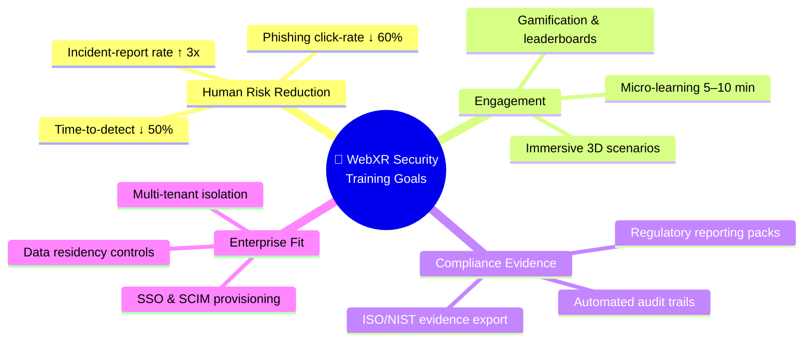

### 2.2 Scope & Personas

| Persona | Use Case | Access Level |
|---|---|---|
| 🧑‍💻 **Trainee / Employee** | Take immersive modules, phishing sims, quizzes | Learner |
| 👨‍🏫 **Instructor / L&D** | Author scenarios, assign curricula, view class progress | Author |
| 🛡️ **CISO / Security Admin** | Campaigns, risk dashboards, audit exports | Admin |
| 🔧 **Platform SRE** | Observability, deployments, incident response | Break-glass (PAM) |
| 🏢 **Tenant Admin** | User mgmt, branding, policy config per customer | Tenant-scoped Admin |

---

## 3. High-Level System Context (C4-L1)

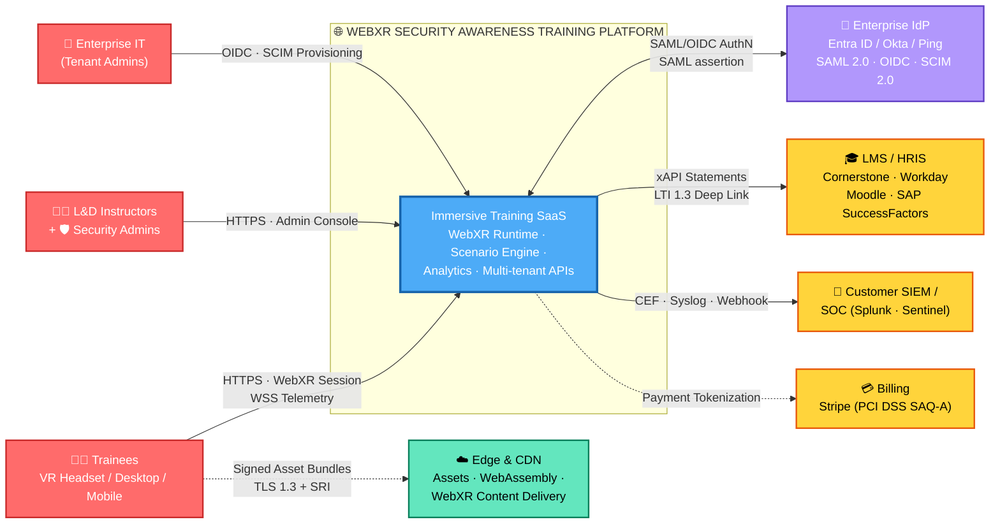

**Trust boundaries:** ① Internet → Edge/WAF · ② Edge → API Gateway · ③ Gateway → Microservices · ④ Services → Data Tier · ⑤ Platform ⇄ Enterprise IdP (federated) · ⑥ Platform → LMS (outbound, signed).

---

## 4. Component Architecture (C4-L2)

```mermaid
flowchart TB
    classDef client fill:#FF8787,stroke:#C92A2A,color:#fff,stroke-width:2px
    classDef edge fill:#FFD43B,stroke:#E8590C,color:#000,stroke-width:2px
    classDef api fill:#4DABF7,stroke:#1864AB,color:#fff,stroke-width:2px
    classDef core fill:#748FFC,stroke:#364FC7,color:#fff,stroke-width:2px
    classDef xr fill:#DA77F2,stroke:#862E9C,color:#fff,stroke-width:2px
    classDef data fill:#63E6BE,stroke:#087F5B,color:#000,stroke-width:2px
    classDef sec fill:#FFA8A8,stroke:#C92A2A,color:#000,stroke-width:2px
    classDef obs fill:#FFE066,stroke:#F08C00,color:#000,stroke-width:2px

    subgraph CLIENTS["🖥️ CLIENT LAYER"]
        direction LR
        VR["🥽 WebXR App (PWA)<br/>Three.js + React XR<br/>WebXR Device API<br/>Hand tracking · Controllers"]
        WEB["💻 Admin Console SPA<br/>React + TypeScript"]
        MOB["📱 Mobile Browser<br/>AR / 3D fallback"]
    end

    subgraph EDGE["🛡️ EDGE & SECURITY LAYER"]
        direction LR
        DNS["Global DNS<br/>Geo-routing"]
        WAF["WAF + DDoS Shield<br/>OWASP Core Rule Set"]
        CDN2["CDN<br/>Signed URLs · SRI"]
        GW["API Gateway<br/>mTLS · JWT validation<br/>Rate limit · Schema valid."]
    end

    subgraph SERVICES["⚙️ APPLICATION / MICROSERVICES (Kubernetes)"]
        direction TB
        subgraph CORE_SVC["CORE DOMAIN SERVICES"]
            IAM["🔐 Identity & Access Svc<br/>OIDC · SCIM · RBAC/ABAC"]
            COURSE["📚 Content & Curriculum Svc<br/>Versioned catalog"]
            PROG["📈 Progress & Scoring Svc<br/>xAPI LRS"]
            CAMP["🎯 Campaign Svc<br/>Phishing sim orchestration"]
            GAM["🏆 Gamification Svc<br/>Badges · Leaderboards"]
            NOTIFY["📨 Notification Svc<br/>Email · Teams · Slack"]
        end
        subgraph XR_SVC["🥽 XR-SPECIFIC SERVICES"]
            SCENE["🧩 Scenario Engine<br/>Branching logic DSL"]
            ASSET["🎨 Asset Pipeline Svc<br/>glTF compression · CDN publish"]
            TELE["📡 XR Telemetry Collector<br/>Gaze · interaction events<br/>Privacy-filtered"]
            MULTI["🕹️ Multiplayer Sync (opt.)<br/>WebRTC · SFU"]
        end
        AUTHZ["🧭 Policy Decision Point<br/>OPA / Cedar · PDP"]
    end

    subgraph DATATIER["💾 DATA LAYER"]
        direction LR
        PG["🐘 PostgreSQL<br/>Encrypted (AES-256)<br/>Multi-tenant RLS"]
        TSDB["⏱️ Time-series DB<br/>Anonymized telemetry"]
        OBJ["🗄️ Object Storage<br/>S3/Blob · SSE-KMS"]
        CACHE["⚡ Redis<br/>Session · ephemeral"]
        KV["🔑 KMS / HSM<br/>Key rotation"]
    end

    subgraph PLATFORMSEC["🛡️ PLATFORM SECURITY & GOVERNANCE"]
        direction LR
        SIEM2["🚨 SIEM / SOAR"]
        VAULT["🗝️ Secrets Mgr<br/>Vault / KMS"]
        SCAN["🔍 Vulnerability Mgmt<br/>SAST · DAST · SCA"]
        AUDIT["📜 Immutable Audit Log<br/>WORM storage"]
    end

    OBS["📊 Observability<br/>OTel traces · metrics · logs<br/>SLO dashboards"]

    CLIENTS --> DNS --> WAF --> CDN2 --> GW
    GW --> IAM & COURSE & PROG & CAMP & XR_SVC
    SERVICES <--> AUTHZ
    IAM --> PG
    COURSE --> PG & OBJ
    PROG --> PG
    CAMP --> NOTIFY
    TELE --> TSDB
    ASSET --> OBJ
    GAM --> CACHE
    SERVICES <--> CACHE
    SERVICES --> VAULT
    SERVICES --> AUDIT
    GW & SERVICES --> OBS
    AUDIT & VAULT --> SIEM2
    SCAN -.->|"shift-left feedback"| SERVICES

    class VR,WEB,MOB client
    class DNS,WAF,CDN2,GW edge
    class IAM,COURSE,PROG,CAMP,GAM,NOTIFY api
    class SCENE,ASSET,TELE,MULTI xr
    class AUTHZ core
    class PG,TSDB,OBJ,CACHE,KV data
    class SIEM2,VAULT,SCAN,AUDIT sec
    class OBS obs
```

### 4.1 Component Responsibilities

| Component | Responsibility | Key Standards |
|---|---|---|
| **WebXR App (PWA)** | Renders immersive scenarios, captures interactions, offline caching | W3C WebXR Device API, WebGL 2/WebGPU, Service Worker, CSP |
| **API Gateway** | AuthN enforcement, rate limiting, schema validation, WAF integration | OAuth 2.1, OWASP API Top 10, mTLS |
| **Identity & Access** | SSO federation, SCIM provisioning, session mgmt, step-up MFA | OIDC, SAML 2.0, SCIM 2.0, FIDO2/WebAuthn, NIST 800-63B IAL2/AAL2 |
| **Policy Decision Point** | Centralized authz: RBAC + ABAC (tenant, role, attribute rules) | NIST 800-207 PDP/PEP, XACML concepts |
| **Scenario Engine** | Executes branching narrative DSL — decisions, traps, timers | — |
| **xAPI LRS (Progress Svc)** | Immutable learning-record store; statement signing | ADL xAPI 1.0.3, SCORM 1.2/2004 via adapter, LTI 1.3 |
| **Campaign Svc** | Phishing simulation emails, scheduling, click/credential-post tracking | ISO 27001 A.6.3, CAN-SPAM/GDPR consent |
| **XR Telemetry** | Privacy-filtered gaze/interaction events for adaptive difficulty | GDPR Art. 25 (data minimization), COPPA-safe |
| **Immutable Audit Log** | Append-only, hash-chained, WORM retention 400 days | ISO A.8.15, SOC 2 CC7.2, NIST 800-53 AU-9 |

---

## 5. Technology Stack

```mermaid
flowchart LR
    classDef l1 fill:#FF6B6B,stroke:#C92A2A,color:#fff
    classDef l2 fill:#FFA94D,stroke:#E8590C,color:#000
    classDef l3 fill:#FFD43B,stroke:#E8590C,color:#000
    classDef l4 fill:#A9E34B,stroke:#2B8A3E,color:#000
    classDef l5 fill:#63E6BE,stroke:#087F5B,color:#000
    classDef l6 fill:#4DABF7,stroke:#1864AB,color:#fff
    classDef l7 fill:#B197FC,stroke:#5F3DC4,color:#fff

    subgraph S1["Presentation"]
        X1["Three.js · React-Three-Fiber · WebXR API<br/>WebAudio · WebGPU (capable devices)"]:::l1
        X2["React 18 + TypeScript Admin SPA"]:::l1
    end
    subgraph S2["Application"]
        Y1["Node.js (NestJS) · Go · Python (FastAPI)<br/>GraphQL BFF + REST gRPC internal"]:::l2
    end
    subgraph S3["Data"]
        Z1["PostgreSQL 16 (RLS) · Redis · ClickHouse<br/>S3/Object Storage · OpenSearch"]:::l3
    end
    subgraph S4["Runtime"]
        W1["Kubernetes (EKS/AKS/GKE) · Istio mTLS<br/>Knative scale-to-zero · ArgoCD GitOps"]:::l4
    end
    subgraph S5["Security"]
        V1["HashiCorp Vault · OPA/Cedar · Sigstore Cosign<br/>Trivy · Wazuh/Sentinel · Let's Encrypt"]:::l5
    end
    subgraph S6["Delivery"]
        U1["GitHub Actions/GitLab CI · Terraform · Helm<br/>SBOM Syft · Docker distroless"]:::l6
    end
    subgraph S7["Observability"]
        T1["OpenTelemetry · Prometheus · Grafana · Loki<br/>Tempo · PagerDuty"]:::l7
    end
    S1 --> S2 --> S3 --> S4 --> S5 --> S6 --> S7
```

---

## 6. WebXR Client Architecture

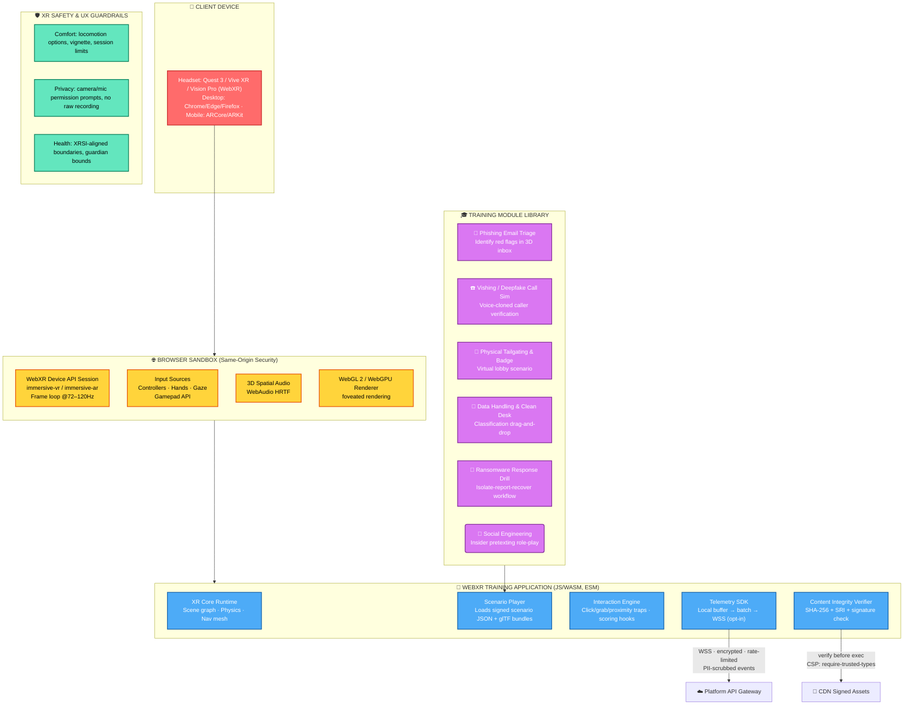

**Client-side security controls:** strict `Content-Security-Policy` (no `unsafe-eval`), **Trusted Types** to kill DOM-XSS, Subresource Integrity on all bundles, **signed scenario bundles** verified before execution, sandboxed iframe isolation for third-party embeds, and `navigator.xr.permissionsShim` gating of sensitive sensors (camera passthrough denied by default for non-AR modules).

---

## 7. Data Architecture & Flows

### 7.1 Core Data Model (ERD)

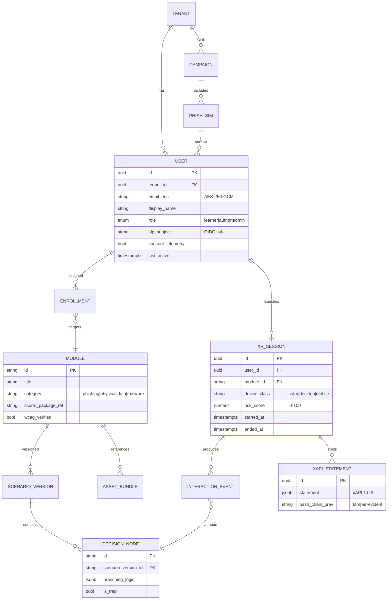

### 7.2 Happy-Path Session Flow (Sequence)

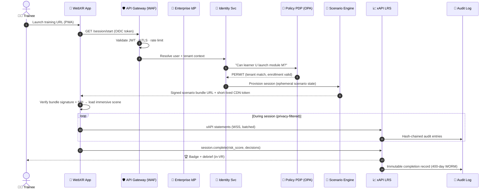

### 7.3 Data Classification

| Class | Examples | Controls |
|---|---|---|
| 🔴 **Restricted (PII/Sensitive)** | Name, email, device fingerprint, performance data | AES-256-GCM at rest, TLS 1.3 in transit, field-level encryption, KMS CMK, RLS, DLP |
| 🟠 **Confidential** | Scenario content, phishing templates, scoring models | Signed bundles, IP allowlist for authoring, watermarking |
| 🟡 **Internal** | Aggregated analytics, dashboards | Tenant isolation, RBAC |
| 🟢 **Public** | Marketing content, docs | SRI, integrity-checked CDN |

---

## 8. Security Architecture (Zero Trust)

### 8.1 Zero-Trust Security Stack (NIST SP 800-207)

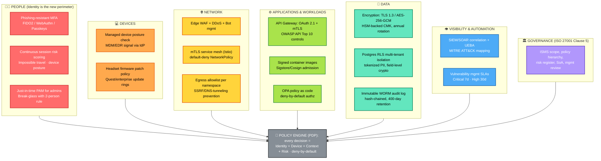

### 8.2 Authentication & Session Model (NIST SP 800-63B)

| Item | Standard Applied |
|---|---|
| Learner login | Federation via OIDC/SAML to enterprise IdP → **AAL2** (TOTP or WebAuthn) |
| Admin / Author login | **AAL2+** enforced — phishing-resistant **FIDO2/passkeys mandatory**, step-up re-auth for destructive actions |
| Service-to-service | mTLS + SPIFFE/SPIRE workload identity |
| Session | 8h idle learner / 30min admin · server-side revocable · bound to device fingerprint |
| Machine tokens | Short-lived (≤15min) JWTs, audience-restricted, key rotation ≤24h |

---

## 9. ISO/IEC 27001:2022 Control Mapping

> The platform is designed to operate **inside an ISO 27001-certified ISMS** and itself becomes a delivery vehicle for **A.6.3 awareness training** at customer organizations.

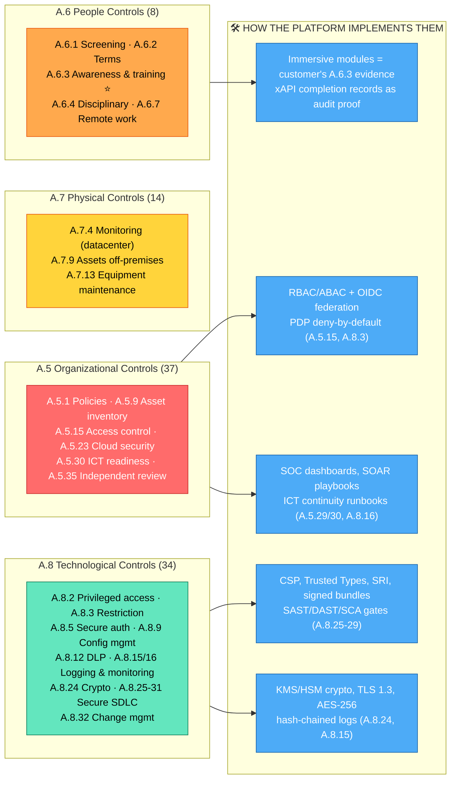

### 9.1 Statement-of-Applicability Extract (Key Controls)

| Control | Requirement | Platform Implementation | Evidence Artifact |
|---|---|---|---|
| **A.5.15** Access control | Define & implement rules | RBAC+ABAC via PDP, least-privilege service accounts | Policy repo, access review minutes |
| **A.5.23** Cloud services security | Secure cloud lifecycle | CSPM, landing-zone guardrails, shared-responsibility matrix | CSPM reports, DR docs |
| **A.6.3** Awareness training | Periodic security education | **The product itself** — campaigns, modules, xAPI evidence | Campaign reports, completion exports |
| **A.8.2** Privileged access | Restrict & monitor | JIT PAM, 2-person break-glass, session recording | PAM logs |
| **A.8.5** Secure authentication | Secure auth tech | FIDO2/passkeys for admins, AAL2 baseline | IdP config, policy export |
| **A.8.9** Configuration mgmt | Define & enforce configs | IaC (Terraform), CIS Benchmarks, drift detection | Pipeline runs, drift alerts |
| **A.8.12** Data leakage prevention | Apply DLP measures | Egress filters, PII tokenization, export watermarks | DLP policy, incident tickets |
| **A.8.15** Logging | Produce & protect logs | Centralized OTel → SIEM, hash-chained, WORM | Log retention policy, integrity proofs |
| **A.8.16** Monitoring activities | Detect anomalous behavior | UEBA, ATT&CK detections, SLO alerts | SIEM dashboards, IR drills |
| **A.8.24** Use of cryptography | Crypto governance | TLS 1.3, AES-256-GCM, HSM CMK, annual rotation | Crypto inventory, KMS audit |
| **A.8.25-29** Secure development | Secure SDLC lifecycle | Threat modeling, SAST/DAST/SCA, peer review, signed builds | Review records, scan reports, SBOM |
| **A.8.32** Change management | Controlled changes | GitOps PR flow, CI gates, rollback plan | PR audit trail, CAB minutes |

---

## 10. NIST Alignment

### 10.1 NIST Cybersecurity Framework 2.0 — Six Functions

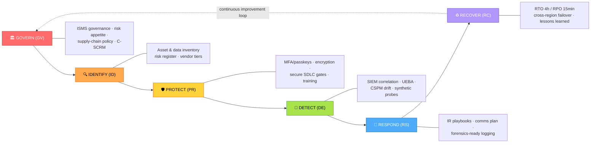

| CSF Function | Key Subcategories Implemented | Platform Controls |
|---|---|---|
| **GV** | GV.OC, GV.RM, GV.SC | ISMS charter, risk register in GRC tool, supplier security tiers (CDN/IdP/KMS vendors) |
| **ID** | ID.AM-1..7, ID.RA | CMDB auto-discovery, data map, quarterly risk assessment, DPIA for XR telemetry |
| **PR** | PR.AA (Identity), PR.DS (Data), PR.PS (Platform), PR.IR (Infra) | Passkeys, AES-256-GCM/TLS 1.3, IaC hardening, mesh mTLS |
| **DE** | DE.CM, DE.AE | SIEM use-cases mapped to MITRE ATT&CK, anomaly detection on XR telemetry |
| **RS** | RS.MA, RS.AN, RS.CO | SOAR playbooks (compromised account, data leak), 24/7 on-call, breach comms templates |
| **RC** | RC.RP, RC.CO | Multi-region failover tested quarterly, post-incident reviews feed risk register |

### 10.2 NIST SP 800-53 Rev.5 (Selected Control Families)

| Family | Controls Applied |
|---|---|
| AC (Access Control) | AC-2 account mgmt · AC-3 enforced authz · AC-6 least privilege · AC-17 remote access (VPN/gateway) |
| AU (Audit) | AU-2 events · AU-6 review · AU-9 protection · AU-11 retention (400d) |
| CA (Assessment) | CA-2 assessments · CA-7 continuous monitoring · CA-8 pen test (annual + major release) |
| CM (Configuration) | CM-2 baselines (CIS) · CM-6 config settings (IaC) · CM-8 inventory (SBOM) |
| IA (Identification & Auth) | IA-2 MFA · IA-5 authenticator mgmt · IA-9 service identity (SPIFFE) |
| IR (Incident Response) | IR-4 handling · IR-6 reporting · IR-8 IR plan (tested semi-annually) |
| SA (System Acquisition) | SA-11 developer testing (SAST/DAST) · SA-12 supply chain (SLSA, SBOM) |
| SC (System & Comms Protection) | SC-7 boundary protection · SC-8 transmission integrity · SC-13 crypto · SC-28 protection at rest |
| SI (System Integrity) | SI-2 flaw remediation (SLA) · SI-4 monitoring · SI-7 software integrity (signing) · SI-10 input validation |

### 10.3 Zero Trust Architecture (SP 800-207) Mapping

| 800-207 Tenet | Implementation |
|---|---|
| All data sources & computing services are resources | Asset catalog; every endpoint/API is a named resource with policy |
| All communication secured regardless of network location | mTLS everywhere (mesh), TLS 1.3 externally, no flat network |
| Per-session access granted | Short-lived tokens, per-request PDP decisions, no standing privileges |
| Dynamic policy (identity + device + behavior) | OPA/Cedar rules consuming IdP signals, EDR posture, risk score |
| Continuous monitoring of integrity | Image signing, drift detection, runtime security (Falco) |
| Dynamic authN/authZ before access | Risk-based step-up MFA, conditional access patterns |

---

## 11. OWASP Top 10:2021 Mitigation Matrix

| # | Risk | Threat to WebXR Platform | Mitigations (Defense-in-Depth) | Verified By |
|---|---|---|---|---|
| **A01** | Broken Access Control | Cross-tenant data access; admin API abuse | Central PDP (deny-by-default), Postgres RLS, object-level authz, tenant-scoped JWT claims, no client-trusted IDs | DAST authz suite, unit authz tests, pentest |
| **A02** | Cryptographic Failures | Weak TLS, exposed PII | TLS 1.3 only (HSTS preload), AES-256-GCM at rest, field-level encryption for PII, KMS CMK + rotation, no custom crypto | TLS scan (SSL Labs A+), KMS audit trail |
| **A03** | Injection (SQL/NoSQL/XSS) | Scenario DSL injection, DOM-XSS in XR app | Parameterized ORM, input validation (schema-first Zod/Pydantic), CSP without unsafe-eval, **Trusted Types**, output encoding | SAST + DAST, CSP report-only telemetry |
| **A04** | Insecure Design | Missing tenant isolation; spoofed scoring | Threat modeling per epic (STRIDE), ASVS L2 design review, abuse cases, rate-limited score submission with server-side recomputation | Design review sign-off, game-theory testing |
| **A05** | Security Misconfiguration | Open buckets, debug endpoints, permissive CORS | IaC-only infra (no console), CIS Benchmarks, automated config scanning, secure defaults, disabled debug in prod, strict CORS allowlist | CSPM, tfsec/Checkov, config drift alerts |
| **A06** | Vulnerable & Outdated Components | Compromised npm/three.js packages | SCA (Snyk/Dependabot) blocking gates, SBOM (CycloneDX) per build, pinned digests, private proxy registry, 7-day critical patch SLA | CI gate failures → zero known criticals |
| **A07** | Identification & Auth Failures | Credential stuffing on learner portals | Federated SSO (no local passwords), FIDO2 for admins, breached-password checks at IdP, rate limiting + progressive delays, MFA | Load+abuse test, IdP signal dashboards |
| **A08** | Software & Data Integrity Failures | Tampered scenario bundles; CI compromise | Sigstore-signed artifacts, SRI on all CDN assets, scenario-bundle signature verification in client, SLSA L3 build provenance, GitOps enforced | cosign verify in admission webhook |
| **A09** | Security Logging & Monitoring Failures | Silent breach; missing evidence | Structured OTel logs → SIEM, hash-chained immutable audit log, alert on authz anomalies, quarterly log-review KPI, ATT&CK detection coverage map | Purple-team exercise, MTTR metrics |
| **A10** | SSRF | Metadata-service attacks via asset fetcher | Egress proxy allowlist, IMDSv2 enforced, URL validation (no private CIDRs), separate fetcher namespace, DNS rebinding protection | Egress test suite |

**Also applied:** OWASP **ASVS 4.0 Level 2** as the verification baseline · OWASP **WSTG** for pen-test scope · OWASP **SAMM** to measure secure-SDLC maturity · OWASP **API Security Top 10** for the gateway/BOLA/BOPLA controls · OWASP **Cheat Sheets** referenced in developer standards.

---

## 12. Worldwide Industry Standards Alignment

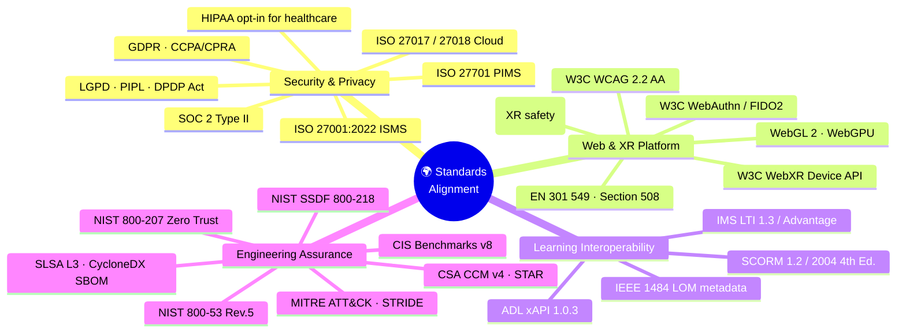

### 12.1 Master Standards Matrix

| Domain | Standard | How the Solution Complies |
|---|---|---|
| **XR Platform** | W3C WebXR Device API 1.0 | Standards-based session/immersive-vr/-ar; feature-detect fallbacks (no vendor lock-in) |
| **Authentication** | W3C WebAuthn L3 / FIDO2 | Phishing-resistant admin auth; passkeys supported |
| **Accessibility** | WCAG 2.2 AA, EN 301 549, Section 508 | Non-VR fallback UI, captions in-VR, keyboard-only admin, contrast tokens, motion-reduction mode |
| **XR Safety** | XRSI Baseline Recommendations | Comfort settings, session duration nudges, photophobia-safe brightness, no surprise locomotion |
| **Learning Records** | ADL xAPI 1.0.3 | Native LRS; signed statements; SCORM 1.2/2004 adapter for legacy LMS |
| **LMS Interop** | IMS Global LTI 1.3 / Advantage | Deep-link launch, Names & Roles, Assignment & Grade Services |
| **Secure SDLC** | NIST SSDF (SP 800-218), SLSA L3 | Provenance-attested builds; SSDF attestation for fedrug/FedRAMP-track customers |
| **Cloud Security** | CSA CCM v4, ISO 27017/27018 | Control mapping in GRC tool; STAR registry entry at Level 2 target |
| **Config Hardening** | CIS Benchmarks (K8s, Linux, Postgres, Cloud) | Bench-config as IaC + automated audit (CIS-CAT/kube-bench) |
| **Threat Modeling** | STRIDE + MITRE ATT&CK | Per-service TM docs; detections tagged with ATT&CK techniques |
| **Privacy** | GDPR (EU), UK GDPR, CCPA/CPRA (US-CA), LGPD (BR), PIPL (CN), DPDP (IN) | Data-residency pinning per tenant region; RoPA; DPIA for telemetry; consent-gated analytics |
| **Audit Assurance** | SOC 2 Type II (Security, Availability, Confidentiality) | Continuous control monitoring; annual audit |
| **Sector (opt-in)** | HIPAA (healthcare tenants), PCI DSS SAQ-A (billing only), TISAX (auto suppliers) | BAA support; tokenized billing via Stripe |

### 12.2 Privacy Law Capability Map

| Capability | GDPR | CCPA/CPRA | LGPD | PIPL | DPDP (India) |
|---|---|---|---|---|---|
| Lawful basis / notice | Art. 6 + 13 | Notice at collection | Art. 7/10 | Consent + separate notice | Consent notice |
| Data-subject rights portal | Art. 15–22 (DSAR API) | Access/Delete/Know | Art. 18 | Access/correct/delete | s.11 access/correct |
| Residency / transfer | SCCs + EU region | — | — | CSA + in-country store | — |
| Telemetry opt-in | By default OFF | GPC honored | — | Explicit consent | Explicit consent |
| Breach notification ≤72h | Art. 33 | CPRA timeline | Art. 48 | Immediate | DPB reporting |
| DPIA / impact assessment | Art. 35 (XR telemetry) | Risk assessments | RIPD | PIA | — |

---

## 13. DevSecOps & CI/CD Pipeline

```mermaid
flowchart LR
    classDef dev fill:#4DABF7,stroke:#1864AB,color:#fff,stroke-width:2px
    classDef scan fill:#FF6B6B,stroke:#C92A2A,color:#fff,stroke-width:2px
    classDef build fill:#FFD43B,stroke:#E8590C,color:#000,stroke-width:2px
    classDef deploy fill:#A9E34B,stroke:#2B8A3E,color:#000,stroke-width:2px
    classDef gate fill:#B197FC,stroke:#5F3DC4,color:#fff,stroke-width:2px
    classDef run fill:#63E6BE,stroke:#087F5B,color:#000,stroke-width:2px

    subgraph CODE["👨‍💻 CODE"]
        C1["Git repo (protected main)<br/>Signed commits · PR review ≥1"]:::dev
    end
    subgraph SCANS["🔍 SHIFT-LEFT SCANS (every PR)"]
        S1["SAST (CodeQL)"]:::scan
        S2["SCA deps (Snyk)"]:::scan
        S3["Secrets scan (gitleaks)"]:::scan
        S4["IaC scan (Checkov/tfsec)"]:::scan
        S5["Dockerfile/lint · License check"]:::scan
    end
    subgraph BUILD["🏗️ BUILD & PROVENANCE"]
        B1["Reproducible build<br/>SLSA L3 · SBOM (CycloneDX)"]:::build
        B2["Sign image (Cosign)"]:::build
    end
    G1["🚦 SECURITY GATE<br/>zero critical/high · policy pass"]:::gate
    subgraph DEP["🚀 DEPLOY (ArgoCD GitOps)"]
        D1["Staging: DAST (ZAP) +<br/>e2e WebXR smoke on real headset"]:::deploy
        D2["Progressive prod rollout:<br/>canary 5% → 50% → 100%"]:::deploy
        D3["Admission control:<br/>cosign verify + OPA"]:::deploy
    end
    subgraph RUN["📡 RUNTIME"]
        R1["Falco runtime security"]:::run
        R2["CSPM drift detection"]:::run
        R3["SIEM detection-as-code"]:::run
        R4["Auto-rollback on SLO burn"]:::run
    end

    C1 --> SCANS --> BUILD --> G1 --> DEP --> RUN
    RUN -.->|"feedback: new detections,<br/>vuln tickets"| C1
```

**Supply-chain guarantees:** every production artifact carries an **SBOM + SLSA provenance attestation**; unsigned images are rejected at admission; third-party assets (glTF models, audio) are published through the same signed-bundle pipeline as code.

---

## 14. Deployment Architecture

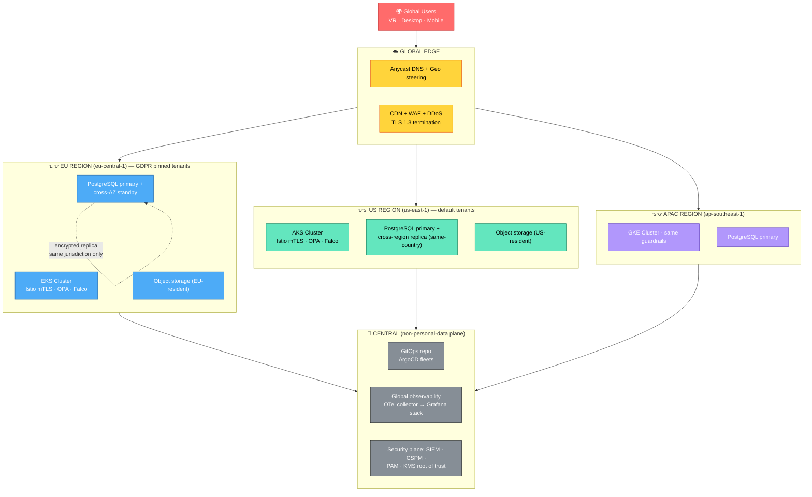

**Resilience targets:** RTO **≤ 4h**, RPO **≤ 15min** (WAL streaming) · multi-AZ by default · quarterly region-failover game days · headless assets cached at edge so an API outage degrades to read-only training, not a total block.

---

## 15. Threat Model (STRIDE + MITRE ATT&CK)

| Threat (STRIDE) | Attack Scenario | Affected Component | ATT&CK Technique | Countermeasure | Residual Risk |
|---|---|---|---|---|---|
| **S**poofing | Stolen session cookie replays learner identity | Identity Svc, Gateway | T1539 (Steal Web Session) | Short-lived tokens, device binding, anomaly step-up MFA | Low |
| **S**poofing | Deepfake voice in vishing sim trains users — attacker abuses same UX | VR Module | T1621 (MFA req. gen.) | Sim brand-content clearly watermarked; rate-limited outbound sim emails with SPF/DKIM/DMARC `sim` markers | Low |
| **T**ampering | Malicious glTF/JS asset swap on CDN | CDN, XR client | T1195 (Supply Chain) | Signed bundles + SRI, cosign admission, immutable CDN cache | Low |
| **R**epudiation | Admin denies modifying campaign results | Campaign Svc | T1070 (Indicator Removal) | Hash-chained WORM audit log, 2-person rule for destructive ops | Low |
| **I**nfo Disclosure | Cross-tenant read via IDOR on `/sessions/{id}` | Progress API | T1087 (Account Discovery) | Object-level authz checks + RLS + fuzzed authz tests | Medium → tracked |
| **I**nfo Disclosure | XR telemetry leaks gaze data → inferences | Telemetry Svc | T1005 (Data from Local System) | Opt-in consent, aggregation/k-anonymity (k≥20), no raw biometrics, DPIA | Medium → consent UX |
| **D**enial of Service | Bot flood on gateway during campaign deadlines | Edge | T1498 (Network DoS) | Anycast DDoS scrubbing, per-tenant rate limits, autoscale, queue-based campaign dispatch | Low |
| **E**levation of Privilege | Compromised pod → cluster admin | Kubernetes | T1610 (Deploy Container) | Default-deny NetworkPolicy, no root containers (distroless, non-root), PSP/PSA restricted, JIT PAM, no cloud metadata access | Low |
| **E**levation of Privilege | Malicious npm package steals build secrets | CI/CD | T1195.002 | SCA gate, isolated ephemeral runners, OIDC-scoped cloud creds (no static keys), secretless builds | Medium → SLSA L3 |

**Review cadence:** threat model refreshed per epic + quarterly; purple-team validation twice a year; top risks tracked in the ISO 27001 risk register with owners and treatment decisions (mitigate/accept/transfer/avoid).

---

## 16. Privacy & Data Protection

- **Data minimization (GDPR Art. 25):** XR telemetry is opt-in, pseudonymized at source, aggregated to k≥20 cohorts for analytics; **no raw biometrics, video, or room meshes ever leave the device**.
- **Retention:** learner records per contract (default 7y for compliance proof) · audit logs 400d WORM · telemetry 90d raw → 2y aggregated.
- **Rights automation:** self-service DSAR portal (export/delete) with 30-day SLA and audit trail.
- **Cross-border:** regional data pinning (EU/US/APAC), SCCs for support access, customer-held CMK option (BYOK) so platform staff cannot decrypt tenant PII.
- **Children:** platform sold to enterprise/education-with-DPA only; age-gating plus no behavioral profiling for under-16 without verifiable consent.

---

## 17. Compliance Roadmap & Certification Path

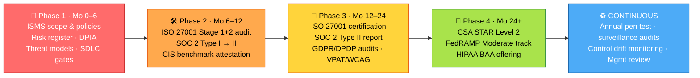

---

## 18. Success Metrics (KPIs)

| Category | KPI | Target |
|---|---|---|
| 🎯 Learning | Phishing simulation click rate | ↓ 60% in 12 months |
| 🎯 Learning | Time-to-report suspicious events | ↓ 50% |
| 🥽 Engagement | Module completion rate | ≥ 85% |
| 🥽 Engagement | Voluntary repeat sessions | ≥ 30% |
| 🔐 Security | Critical vulnerabilities older than 7d | 0 |
| 🔐 Security | MTTR security incidents | < 24h |
| ♿ Accessibility | WCAG 2.2 AA conformance | 100% admin + learner fallback |
| 🏛️ Compliance | SOC 2 / ISO audit findings | 0 major non-conformities |
| ☁️ Reliability | Platform availability (SLO) | 99.9% monthly |
| 💰 Efficiency | Cost per trained employee | ↓ vs classroom baseline |

---

## 19. Color Legend

| Color | Architecture Meaning |
|---|---|
| 🔴 Red | Users / people layer |
| 🟠 Orange | Edge, network, devices |
| 🟡 Yellow | Security services, standards gateways |
| 🟢 Green | Data layer / runtime safety / resilient ops |
| 🔵 Blue | Core application services |
| 🟣 Purple | Identity, XR-specialized services, governance |
| ⚪ Grey | Cross-cutting control planes |

---

> **Summary:** This architecture delivers immersive WebXR security training through a browser-native client (W3C WebXR), hardened by a NIST 800-207 zero-trust control plane, evidenced for ISO 27001/SOC 2 auditors, engineered against the OWASP Top 10 and ASVS, and interoperable worldwide via xAPI/SCORM/LTI, WCAG 2.2, and multi-jurisdiction privacy law support — making the platform both a *security product* and a *compliance instrument* for customers' own ISO A.6.3 awareness obligations.
