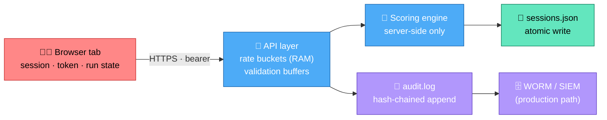

# 💾 memory.md — Data Persistence, Memory & Retention Design

> What is remembered, where, for how long, and why. Covers runtime memory, persistent storage,
> retention schedules, and the swap-in path to the production data tier described in
> [`architecture.md`](architecture.md) §7. Complements [state.md](state.md) and [security.md](security.md).

---

## 1. Memory Map (Runtime)

| Region | Location | Contents | Bounded by | Cleared when |
|---|---|---|---|---|
| **Token buckets** | In-memory `Map` | Rate-limit counters | 10,000 buckets → opportunistic eviction | Process exit / window expiry |
| **Audit chain head** | `AuditChain.lastHash` | Last record hash (restart-safe) | 64 chars | Never (rebuilt from disk on boot) |
| **Request buffers** | `readJsonBody` chunks | Body bytes (≤16 KB) | Hard cap → `payload_too_large` | Response end |
| **Client session object** | `public/js/app.js` `session`/`module` vars | Active run state | One session per tab | Tab close / navigation |
| **Client token** | `sessionStorage['xr.token']` | Bearer token | Single tab scope | Tab close (by spec) |
| **Static file stream** | `fs.createReadStream` | Piped asset bytes | Streaming (no full-buffer) | Response end |

**No unbounded growth:** every in-memory structure has an eviction rule or hard cap
(ISO A.5.9 asset hygiene; DoS resilience per OWASP A05).

---

## 2. Persistent Storage Layout

```
data/
├── users.json        # user records — email encrypted (AES-256-GCM)
├── sessions.json     # training sessions + xAPI-style statements + scores
├── audit.log         # hash-chained append-only audit trail (NDJSON)
└── audit.log.tmp     # (transient) temp file during atomic saves
```

| File | Written by | Read by | Write pattern |
|---|---|---|---|
| `users.json` | `auth.createUser`, `seedUsers` | `auth` lookups | Rare; atomic rename |
| `sessions.json` | `sessions.start/completeSession` | `sessions` reads, dashboards | Per session lifecycle; atomic rename |
| `audit.log` | `AuditChain.append` | `AuditChain.verify`, admin API | Append-only (never rewritten) |

### Field-level protection at rest

| Data | At rest |
|---|---|
| Email (PII) | `encPII()` → AES-256-GCM (random IV + auth tag) — plaintext never on disk |
| Password | Never stored raw — scrypt(N=16384) hash with per-user salt |
| Decisions/results | Plain JSON (non-PII, needed for scoring audit) |
| Token/secrets | Never persisted server-side; client keeps token in `sessionStorage` only |

### Why JSON files (and when to move on)

This build uses atomic JSON files as a **zero-dependency, auditable store** suitable for
evaluation, demos, and single-node deployments. The persistence interface (`db.load/save`,
`encPII/decPII`) is intentionally narrow so swapping to PostgreSQL (with RLS + encrypted volumes
per architecture.md §7) touches only `db.js` — call sites stay unchanged.

---

## 3. Retention Schedule

| Data class | Retention | Rationale | Purge mechanism |
|---|---|---|---|
| Audit log | **400 days** | Longest common evidence window (SOC 2 / ISO A.8.15) | Rotated by ops; WORM target in prod |
| Completed sessions | 90 days default (`RETENTION.sessionDays`) | Learning analytics need only recent history | Retention job (below) |
| Abandoned sessions | 90 days | Same | Same |
| Users | Life of contract | Operational necessity | Admin deletion + audit entry |
| Client token | Tab session | UX convenience only | Automatic on tab close |

### Retention job (GDPR Art.5(1)(e) storage-limitation)

The reference implementation ships with the schedule declared in config and this reference job:

```js
// scripts/retention.js — run via: npm run retention (or cron/CI)
const { load, save } = require('../server/src/db');
const { RETENTION } = require('../server/src/config');

const cutoff = Date.now() - RETENTION.sessionDays * 86400000;
const sessions = load('sessions');
const kept = sessions.filter((s) => (s.completedAt ?? s.startedAt) >= cutoff);
save('sessions', kept);
console.log(`[retention] kept ${kept.length}/${sessions.length} sessions (>${RETENTION.sessionDays}d purged)`);
```

Add `"retention": "node scripts/retention.js"` to `package.json` scripts to activate.

---

## 4. Data Flow Through Memory & Disk



1. Client state is transient; token grants access but never confers trust.
2. Rate buckets live and die in RAM — enough for abuse control, nothing sensitive.
3. Scores are computed once server-side, stored immutably with the session.
4. Every security event lands in the append-only chain; chain head survives restarts.
5. In production the same events stream to WORM/SIEM (see security.md §2.5).

---

## 5. Backup & Recovery (A.5.30 / A.8.13)

| Aspect | This build | Production target |
|---|---|---|
| Backup unit | `data/` directory (3 files) | Encrypted DB snapshots + log archives |
| Consistency | Atomic writes make files always complete | WAL archiving, PITR |
| Restore test | Manual: stop server, replace `data/`, boot, run `npm test` | Quarterly restore game-days |
| Verification of audit | `AuditChain.verify()` on boot + `/api/health` | Continuous SIEM chain monitor |
| RPO / RTO | Manual (demo tier) | RPO ≤ 15 min, RTO ≤ 4 h (architecture.md §14) |

Restore drill:

```bash
# 1. Stop the server (SIGINT graceful)
# 2. Replace or snapshot data/
cp -r data data.bak && cp -r data-restore data
# 3. Boot and verify chain
npm start            # boot log prints "audit chain: valid"
npm test             # full regression green
```

---

## 6. Privacy Engineering in Memory (GDPR / CCPA)

| Principle | Implementation |
|---|---|
| Minimization | Only email (encrypted), name, role, idp subject stored — no addresses/phones/biometrics |
| Pseudonymization | Client telemetry carries user id only at API layer; analytics aggregates don't need identity |
| Storage limitation | §3 schedule + purge job |
| Integrity & confidentiality | Field-level AES-256-GCM, scrypt hashes, hash-chained audit |
| Rights (access/erase) | `GET /api/auth/me` (access); user deletion + audit entry (erase); DSAR export path via admin API |
| Residency (roadmap) | `DATA_DIR` per-region instance in prod = EU/US/APAC pinning (architecture.md §14) |

---

## 7. Capacity Notes

| Concern | Current bound | Headroom rule |
|---|---|---|
| Sessions JSON | In-memory parse per request | Swap to DB beyond ~10⁴ active records |
| Audit log | Append + periodic `verify()` O(n) | Verify incrementally / nightly beyond 10⁵ records |
| Rate buckets | 10k in-RAM | Redis backend when horizontally scaled |
| Static assets | Streamed, no caching in RAM | CDN with SRI in prod |
