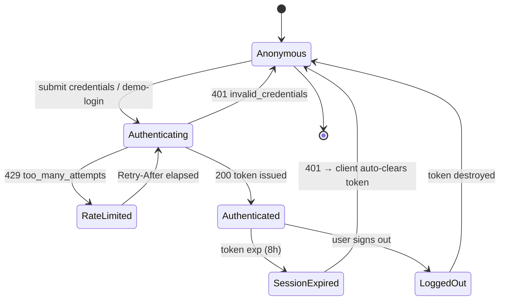
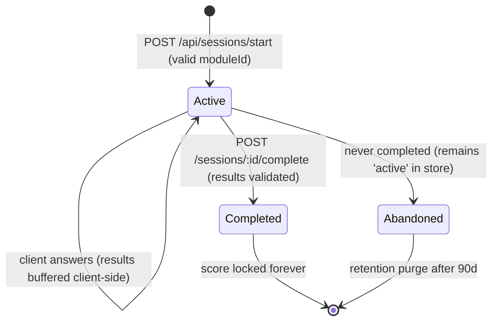
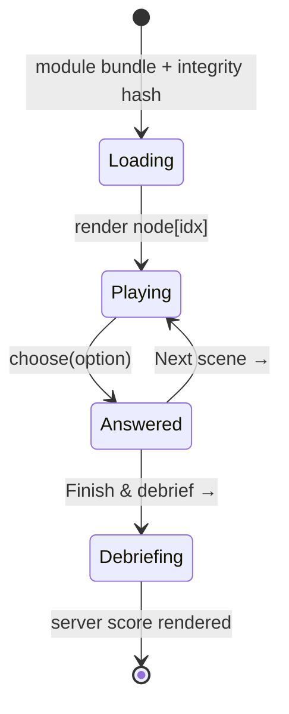
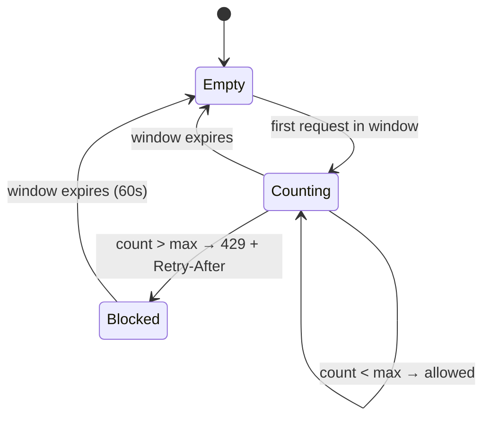

# 🧭 state.md — Application State Architecture

> Canonical reference for every stateful concept in the platform: who owns it, where it lives,
> how it transitions, and how it is protected. Complements [security.md](security.md) and [memory.md](memory.md).

---

## 1. State Domains Overview

| Domain | Owner | Location | Lifetime | Mutable by |
|---|---|---|---|---|
| **Auth state** (token, user) | Server issues, client holds | Server: `users.json`; Client: `sessionStorage` + `API.token` | 8h token TTL / tab session | Server (issue); nobody else |
| **Module catalog** | Server (source of truth) | `server/src/modules.js` (immutable in runtime) | Static per release | Build/deploy process |
| **Training session** | Server | `data/sessions.json` | Created → completed/abandoned | Server only, via API |
| **Scenario progress (in-run)** | Client during play | `public/js/app.js` `state` object | Single browser tab run | Client (transient, unscored) |
| **Scores & xAPI records** | Server (computed) | `data/sessions.json` (`xapi[]`, `riskScore`) | Until retention purge | Server scoring engine |
| **Audit trail** | Server (append-only) | `data/audit.log` (hash chain) | 400 days (WORM target) | Nobody — append-only |
| **Rate-limit buckets** | Server | In-memory `Map` (`securityUtils.js`) | 60s windows | Server internals |
| **UI state** (current view) | Client | `location.hash` router | Tab session | User navigation |

**Design rule:** the client may hold *transient* state, but **never trusted state** — all authoritative
decisions (identity, scores, progress) are recomputed server-side (OWASP A04).

---

## 2. Authentication State Machine

**Token payload state** (signed HMAC-SHA256, `server/src/securityUtils.js`):

| Field | Meaning | Protection |
|---|---|---|
| `sub` | User id | Bound to every object-level query |
| `role` | `learner` \| `author` \| `admin` | Checked by `requireRole` (cannot self-escalate — role changes only via admin API + audit) |
| `iat` / `exp` | Issued / expiry | Verified every request; expired → 401 |
| Signature | Integrity | Constant-time compare; alg-confusion rejected (`alg !== 'HS256'` → null) |

Client-side auth state transitions (`public/js/app.js`):

- Login/demo success → `API.setToken(token)` → `enterApp()` → `#/modules`.
- Any `401` with a token → token cleared, redirect `#/home` (never a stuck-auth state).
- `sessionStorage` scoping guarantees tab-close destroys the session artifact.

---

## 3. Training Session State Machine (core domain)

**Transition guards (server-enforced, `server/src/sessions.js`):**

| Transition | Guard | Failure response |
|---|---|---|
| → Active | `moduleId` must pass `isSafeId` **and** exist in catalog | `400 invalid_module_id` / `404 unknown_module` |
| Active → Completed | Session `userId === token.sub` (object authz) | `404 not_found` |
| Active → Completed | `status === 'active'` (no double-submit) | `400 already_completed` |
| Active → Completed | Each result maps to a real node & option (validated, sanitized) | `400 invalid_results` |
| Active → Completed | 1 ≤ results.length ≤ 100 | `400 invalid_results` |

**Score lock:** once `status='completed'`, `riskScore`, `correct`, `total`, `trapHits` and the xAPI
statement are immutable — further `complete` calls are rejected. This gives the learning-records
store (LRS) semantics required for compliance evidence (ISO A.6.3).

---

## 4. Scenario Player State (client, transient)

| Field | Type | Purpose |
|---|---|---|
| `state.idx` | number | Current node index; monotonically increases |
| `state.results[]` | `{nodeId, choice}` | Buffered locally; **never trusted by server** — full set re-validated on complete |
| `feedback` | DOM state | Shows explanation after each choice (learning moment) |

Trap handling: choosing a trap option flags `trap-flash` animation, still advances — traps affect
the server-computed score (`-15%` each), not the flow.

---

## 5. Server Data States (per collection)

| Collection | Record states | Invariants |
|---|---|---|
| `users.json` | exists / active | Email unique (checked at provision), role ∈ enum, `email` field always ciphertext |
| `sessions.json` | `active` → `completed` | One module per session; score fields null until completion; `userId` immutable |
| `audit.log` | appended only | `prev` of record N+1 = `hash` of record N; genesis `prev = 0×64` |

**Atomicity:** all saves go through `db.save()` → temp file + `rename` — a crash mid-write can never
torn-page a collection (readers see old or new, never partial).

---

## 6. Rate-Limiter State

- Keyed per IP+bucket (production: per user for authenticated buckets, see security.md §2.4).
- Bounded memory: opportunistic eviction when >10,000 buckets (`rateLimit()`).
- Deny-by-default: malformed/oversized keys are rejected without allocation.

---

## 7. Client Router State

| Hash | View | Auth required | Role required |
|---|---|---|---|
| `#/home` | Welcome + XR capability | No | — |
| `#/modules` | Catalog + start buttons | Yes | learner+ |
| `#/play` | Scenario player | Yes | learner+ (+ active session in memory) |
| `#/dashboard` | Personal stats & history | Yes | learner+ |
| `#/admin` | Users, audit, chain verify | Yes | admin |

Route guards are enforced **client-side for UX only** — the server re-checks every request
(true enforcement point). Direct hash entry to `#/admin` as a learner renders a "Forbidden" notice,
and the underlying API still returns 403.

---

## 8. Error-State Taxonomy (uniform API contract)

| HTTP | Code | Client behavior |
|---|---|---|
| 400 | `invalid_json`, `payload_too_large`, `invalid_module_id`, `invalid_session_id`, `invalid_results`, `invalid_email`, `invalid_role`, `exists` | Inline error flash; form retained |
| 401 | `unauthorized`, `invalid_credentials` | Clear token → `#/home` |
| 403 | `forbidden` | "Forbidden — admin role required" notice |
| 404 | `not_found`, `unknown_module`, `user_not_found` | Redirect / message |
| 429 | `rate_limited`, `too_many_attempts` | Show retry timer from `Retry-After` |
| 500 | `internal_error` | Generic message (no stack traces leak) |

---

## 9. State-Protection Summary

| Threat | State protection |
|---|---|
| Token theft | 8h TTL, constant-time verification, sessionStorage scoping, alg-confusion rejection |
| Score forgery | Client never computes scores; server re-validates every answer against the signed catalog |
| Record tampering | Hash-chained audit; immutable completed sessions; atomic writes |
| Cross-user access | `userId` filters on all reads; object-level authz on every session query |
| DoS via state | Body-size caps, rate-limit windows, bounded bucket memory |
| Torn data | Temp-file + rename atomic saves |
| Replay | `already_completed` guard; results length caps |
