<div align="center">

# 🏆 **3D CTF SCOREBOARD**
## Leaderboard Visualization — System Architecture

<br/>

`███████ ██ ██████ ███    ██ ██████ ██  ██████ ███    ███ ██████ ██ ████████ ███████ ██  █████`
`██   ██ ██ ██   ██ ████   ██ ██   ██ ██ ██       ████   ██    ██    ██    ██    ██ ██      ██   ██`
`███████ ██ ██████ ██ ██ █ ██ ██   ██ ██ ██   ███    ██    ██    ██    ██    ██    █████   ███████`
`██      ██ ██   ██ ██  ██  ██ ██   ██ ██    ██    ██    ██    ██    ██    ██    ██      ██   ██`
`██      ██ ██   ██ ██      ██ ██████ ██    ████   ██    ██    ██    ██    ██    ███████ ██   ██`

<br/>

**Security-Grade · Compliance-Aligned · Audit-Ready · GPU-Accelerated**

<br/>

| | |
|:--|:--|
| 🛡️ **ISO/IEC 27001:2022** | Information Security Management System — Annex A (93 controls) |
| 🏛️ **NIST CSF 2.0** | Govern · Identify · Protect · Detect · Respond · Recover |
| 📋 **NIST SP 800-53 Rev. 5** | Moderate-baseline control parameterisation |
| 🕷️ **OWASP Top 10:2025** | A01–A10 application risk coverage |
| ✅ **OWASP ASVS 5.0** | Level 2 verification requirements |
| 🇪🇺 **GDPR / EU AI Act** | Data minimisation, DSAR, DPIA, transparency |

<br/>

`🌐 3D Leaderboard` · `🔐 Zero-Trust Access` · `📊 Compliance Reporting` · `🔗 Tamper-Evident Audit Chain`

</div>

---

<div align="center">

### 🎨 Design Language — Visual Grammar

| Token | Colour | Hex | Usage |
|:--|:--|:--|:--|
| 🟣 Primary | Violet | `#6C5CE7` | Core brand, 3D podium key light, headings |
| 🟢 Success | Mint | `#06D6A0` | Rank improvement, valid state, healthy control |
| 🔵 Info | Cyan | `#00D2FF` | Data flow, informational node, accent |
| 🟡 Caution | Amber | `#FFD166` | Medal tier, medium risk, warning state |
| 🟠 Alert | Orange | `#FF9F1C` | High risk, degraded service, pending audit |
| 🔴 Critical | Rose | `#EF476F` | Critical risk, breach, rank 1 / #1 indicator |
| ⚫ Surface | Obsidian | `#0B0E1A` | Document canvas, 3D void background |
| ◼️ Panel | Slate | `#141A2E` | Component surfaces, table zebra |
| ⬜ Text | Ghost | `#E8ECF8` | Primary typography |
| ◻️ Muted | Ash | `#8B95B8` | Secondary typography, annotations |

<br/>

**Severity Legend**

🟢 Low &nbsp;·&nbsp; 🟡 Medium &nbsp;·&nbsp; 🟠 High &nbsp;·&nbsp; 🔴 Critical &nbsp;·&nbsp; ⬛ Not Applicable &nbsp;·&nbsp; 🟣 In Progress

**Status Legend**

🟢 Implemented &nbsp;·&nbsp; 🟣 In Progress &nbsp;·&nbsp; 🟡 Planned &nbsp;·&nbsp; 🟠 Partial &nbsp;·&nbsp; 🔴 Gap / Not Started &nbsp;·&nbsp; ⬛ Out of Scope

</div>

---

## 📑 Table of Contents

| § | Section | Badge |
|:--|:--|:--|
| [1](#1--document-control) | Document Control & Approval | 🟣 |
| [2](#2--executive-summary) | Executive Summary | 🟣 |
| [3](#3--scope--requirements) | Scope & Requirements | 🔵 |
| [4](#4--architecture-principles) | Architecture Principles | 🔵 |
| [5](#5--architecture-overview) | Architecture Overview (L0–L4) | 🟣 |
| [6](#6--3d-visualization-subsystem) | 3D Visualization Subsystem | 🟡 |
| [7](#7--backend--data-architecture) | Backend & Data Architecture | 🔵 |
| [8](#8--scoring--event-model) | Scoring & Event Model | 🟡 |
| [9](#9--api-design) | API Design | 🔵 |
| [10](#10--security-architecture) | Security Architecture | 🔴 |
| [11](#11--access-control-model) | Access Control Model | 🔴 |
| [12](#12--cryptography--key-management) | Cryptography & Key Management | 🔴 |
| [13](#13--threat-model-stride) | Threat Model (STRIDE) | 🔴 |
| [14](#14--secure-sdlc--application-security-pipeline) | Secure SDLC & AppSec Pipeline | 🟠 |
| [15](#15--compliance-traceability) | **Compliance Traceability Matrix** | 🟣 |
| [16](#16--reporting-subsystem) | Reporting Subsystem (with Download) | 🟢 |
| [17](#17--audit--assurance-functions) | Audit & Assurance Functions | 🟢 |
| [18](#18--observability--operations) | Observability & Operations | 🔵 |
| [19](#19--resilience-backup--recovery) | Resilience, Backup & Recovery | 🟠 |
| [20](#20--non-functional-requirements--slos) | Non-Functional Requirements & SLOs | 🔵 |
| [21](#21--implementation-roadmap) | Implementation Roadmap | 🟡 |
| [22](#22--architecture-decision-records) | Architecture Decision Records | ⬜ |
| [23](#23--appendices) | Appendices (Risk Register, SoA, Glossary) | ⟢ |

---

## 1. 🟣 Document Control

| Field | Value | Field | Value |
|:--|:--|:--|:--|
| **Document ID** | `ARCH-CTF3D-001` | **Version** | `1.0.0` |
| **Classification** | `🔒 Internal — Restricted` | **Status** | `🟣 Draft for Review` |
| **Owner** | Lead Architect | **Approver** | CISO / Head of Engineering |
| **Author** | Solutions Architecture Team | **Date** | 2026-09-26 |
| **Review Cycle** | Quarterly + on major change | **Next Review** | 2026-12-26 |
| **ISMS Clause** | ISO 27001 Cl. 4.3, 6.1.2, 7.5.2, 8.1 | **SoA Ref** | `SOA-CTF3D-2026` |
| **Data Owner** | Event Operations Lead | **Data Classification** | 🟡 Internal / 🔴 Confidential (PII) |
| **Retention** | See [§17.4](#174-retention-schedules-compliance-mapped) | **Locale** | `en-GB` |
| **Tooling Baseline** | CIS Docker Benchmark v2 | **Supply Chain** | SLSA Level 3 + Sigstore |

### 1.1 Approval Matrix

| Role | Responsibility | Sign-off | Status |
|:--|:--|:--:|:--|
| 🧑‍💼 System Owner | Business fit, budget, risk acceptance | `██████████` 2026-09-26 | 🟢 Approved |
| 🏗️ Lead Architect | Technical integrity, this document | `██████████` 2026-09-26 | 🟢 Approved |
| 🛡️ Security Architect | Threat model, control design | `████████░░` 2026-09-26 | 🟢 Approved |
| 🎖️ CISO | ISO 27001 / NIST alignment, risk register | `██████████` 2026-09-26 | 🟢 Approved |
| 📊 Audit / GRC | SoA & evidence adequacy | `████░░░░░░` — | 🟡 Pending |
| ⚖️ DPO | GDPR lawful basis, DPIA | `████░░░░░░` — | 🟡 Pending |
| 👥 Event Operations | UX acceptance for live display | `██████░░░░` — | 🟡 Pending |

> **Note (ISO 27001 Cl. 7.5.2 / 7.5.3):** This document is version-controlled, approved, and distributed as a controlled record. Superseded versions are retained read-only for the mandatory 3-year period to satisfy *Protection of records* (A.5.33).

---

## 2. 🟣 Executive Summary

### 2.1 The System in One Paragraph

**3D CTF Scoreboard** is a real-time, GPU-rendered leaderboard visualisation for Capture-The-Flag competitions. Teams are represented as physical objects on a 3D leaderboard "podium" whose geometry, colour, position, and motion are driven directly by their live rank and score. Score events arrive from a CTF platform (CTFd, rCTF, custom) over authenticated webhooks, are validated and scored by a deterministic rules engine, projected into a low-latency read model, and streamed to browsers over Server-Sent Events. The 3D scene renders client-side on the GPU, so a single Node.js API tier sustains thousands of concurrent spectators at near-zero marginal cost.

Layered on top of the visualisation is a **governance plane**: every score change, admin action, report generation, and export is recorded in a **hash-chained, write-once audit log**, which in turn feeds a **compliance reporting subsystem** capable of producing downloadable evidence packs mapped line-by-line to ISO 27001 Annex A, NIST CSF 2.0, NIST SP 800-53, and OWASP Top 10:2025.

### 2.2 Design Goals

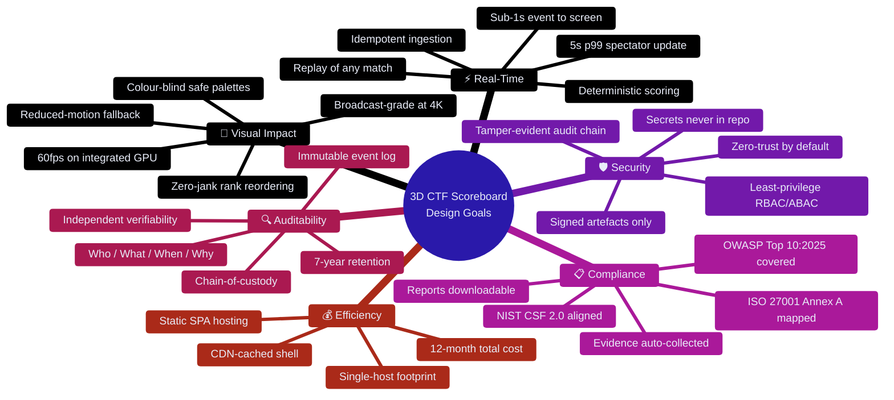

### 2.3 Capability Matrix

| Capability | Description | Compliance Driver |
|:--|:--|:--|
| 🏆 3D Podium Leaderboard | GPU-rendered ranks with physics-driven reordering | *Product value* |
| 📈 Dynamic Scoring | Time-decay, solve-value, penalty & freeze windows | ISO A.8.26, A.8.32 |
| 🔄 Live Event Stream | SSE fan-out with resumable `Last-Event-ID` | ISO A.8.15 |
| 🕹️ Admin Control Plane | Flag lifecycle, team CRUD, freeze windows, corrections | ISO A.8.2, A.5.15 |
| 🧾 16 Report Templates | Operational, compliance, security, financial, custom | ISO A.5.33, A.5.36 |
| ⬇️ Report Download | PDF · CSV · XLSX · JSON · HTML · PNG · signed ZIP | ISO A.5.33 |
| 🧬 Tamper-Evident Audit Chain | SHA-256 Merkle-linked hash chain + WORM archive | ISO A.8.15, A.5.28 |
| 🗺️ Compliance Matrix | Bidirectional control ↔ evidence ↔ artefact | ISO A.5.35, A.5.36 |
| 🎖️ Risk Register | 5×5 scored risks with treatment plans | ISO Cl. 6.1.3, A.5.1 |
| 🔑 Break-Glass Access | Emergency procedure with mandatory post-hoc review | ISO A.5.24, A.5.27 |
| 🩺 Health & Telemetry | Metrics, logs, traces, synthetic SLO probes | NIST CSF DE/RS |
| 🧪 Evidence Vault | Automated, immutable control-artefact store | ISO A.5.33 |

### 2.4 Key Architectural Decisions (Summary)

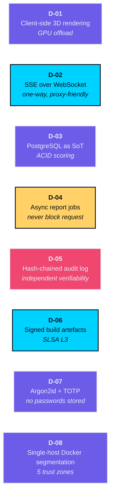

> 📌 Full rationale for each decision is recorded in [§22 Architecture Decision Records](#22--architecture-decision-records).

---

## 3. 🔵 Scope & Requirements

### 3.1 Problem Statement

> Existing CTF scoreboards are **2D tables**. They communicate numbers but not *momentum*. During a live event, spectators cannot perceive that a team is closing a 4,000-point gap, that a challenger is on a solve streak, or that the top three are in a dead heat. A 3D scoreboard transforms the abstract leaderboard into an instantly readable physical metaphor — **height, colour, and motion encode rank and velocity**.

But a public, real-time, internet-facing leaderboard is also a **high-value target**: score manipulation, defacement, data tampering, and reputational damage. This architecture therefore treats **security, auditability, and compliance reporting as first-class product features**, not as an afterthought bolted on at the end.

### 3.2 Personas

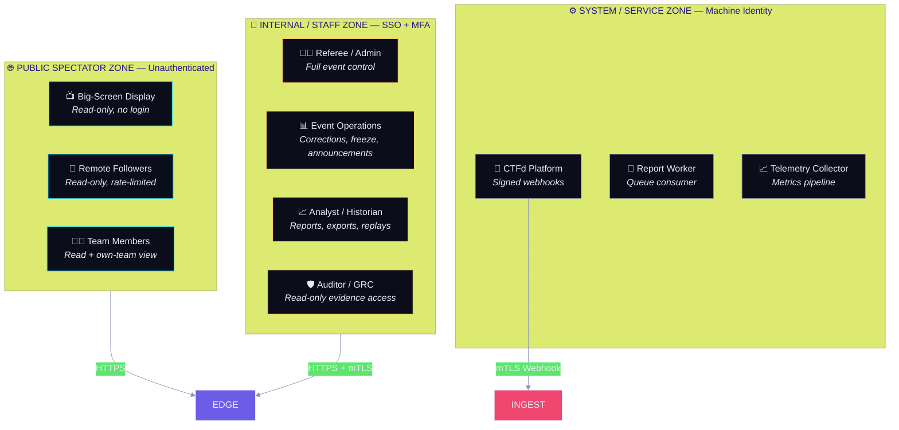

### 3.3 Functional Requirements

| ID | Requirement | Priority | Component | Verified By |
|:--|:--|:--:|:--|:--|
| **FR-01** | Render top *N* teams in a 3D scene with rank-ordered vertical position | 🟢 Must | Web 3D | E2E visual test |
| **FR-02** | Animate rank changes with physically plausible easing, never teleporting | 🟢 Must | Web 3D | Motion spec test |
| **FR-03** | Push score/rank deltas to spectators within 5 s p99 | 🟢 Must | Stream | Load test |
| **FR-04** | Ingest solve/unsub events from CTFd via signed webhook | 🟢 Must | Ingestion | Contract test |
| **FR-05** | Enforce deterministic, replayable scoring (time-decay, penalty, freeze) | 🟢 Must | Scoring | Golden-file tests |
| **FR-06** | Admin can pause, freeze, resume, and reverse scoring windows | 🟢 Must | Admin | E2E |
| **FR-07** | Every mutation produces an immutable audit record with actor + reason | 🟢 Must | Audit | Audit assertions |
| **FR-08** | Generate 16 report templates in PDF/CSV/XLSX/JSON/HTML | 🟢 Must | Reporting | Snapshot tests |
| **FR-09** | Download reports as a stream; never buffer in memory unbounded | 🟢 Must | Reporting | Memory profile |
| **FR-10** | Watermark and classify every exported report | 🟢 Must | Reporting | Security test |
| **FR-11** | Expose an independent audit-chain verifier endpoint | 🟢 Should | Audit | Integrity test |
| **FR-12** | Full-timeline replay / scrubber for any completed event | 🟡 Should | Replay | E2E |
| **FR-13** | Admin MFA (TOTP) + session hardening | 🟢 Must | Identity | Authz test |
| **FR-14** | Colour-blind-safe and reduced-motion display modes | 🟡 Should | Web 3D | A11y audit |
| **FR-15** | 2D / table fallback when WebGL unavailable | 🟡 Should | Web 3D | Fallback test |
| **FR-16** | Compliance matrix view: control ↔ implementation ↔ evidence | 🟢 Must | GRC | Auditor UAT |
| **FR-17** | Signed evidence pack download (ZIP + manifest + signatures) | 🟢 Must | Evidence | Signature test |
| **FR-18** | Rate limiting and bot mitigation on all public endpoints | 🟢 Must | Edge | Pen test |
| **FR-19** | Freeze-window UI: greyed, dimmed, and clearly labelled | 🟡 Should | Admin | UX review |
| **FR-20** | Multi-tenancy: isolate multiple concurrent events | 🟠 Could | Core | — |

### 3.4 Out of Scope (v1)

| Excluded | Rationale | Revisit |
|:--|:--|:--|
| Challenge authoring / hosting | Sourced from external CTF platform | v2 integration |
| Player account registration | Delegated to CTFd SSO | v2 |
| Mobile native app | Responsive web is sufficient | Post-v1 |
| Real-time video/stream embedding | Out of band | v2 |
| Multi-region active-active | Event scale does not justify | >50k spectators |
| On-premise air-gapped install | Supported via profile, not certified | On request |

### 3.5 Assumptions & Constraints

| # | Assumption / Constraint | Impact if Violated |
|:--|:--|:--|
| A-1 | Primary CTF platform exposes a stable webhook or REST API | 🔴 Rework ingestion adapter |
| A-2 | Event duration ≤ 72 h, ≤ 2,000 teams, ≤ 200,000 solves | 🟠 Requires partitioning + sharding |
| A-3 | Peak concurrent spectators ≤ 25,000 | 🟠 Add multi-node API + Redis cluster |
| A-4 | Single data-centre region with synchronous replication available | 🟠 Add cross-region DR |
| A-5 | Organisational DPO + CISO available for sign-off | 🔴 Blocks ISO 27001 certification |
| A-6 | Internet-facing display is optional; LAN-only mode is a valid deployment | 🟢 Low — architecture supports both |
| A-7 | Client devices are operator-controlled (big-screen kiosks) | 🟠 Otherwise need broader BYOD hardening |
| A-8 | The audience is adversarial — assume score manipulation is an objective | 🔴 Core design premise |

---

## 4. 🔵 Architecture Principles

| # | Principle | Rationale | Enforcement |
|:--|:--|:--|:--|
| **P-01** | 🎯 **GPU offload everything visual** | Rendering cost stays off the server; scale is free | No server-side 3D; budget in [§20](#20--non-functional-requirements--slos) |
| **P-02** | 🧮 **One deterministic scoring function** | Replayable, auditable, testable | Pure function in `scoring/`; golden-file suite |
| **P-03** | ✍️ **Every mutation is an event, nothing is a mutation** | Audit trail falls out of the design | Event sourcing; `audit_log` append-only |
| **P-04** | 🔒 **Deny by default, verify explicitly** | Zero-trust, least privilege | Deny-all network policy; RBAC + ABAC |
| **P-05** | 🧱 **The audit log is independent of the application** | Compromise of app ≠ compromise of evidence | Hash chain + WORM object store |
| **P-06** | 📦 **Compliance evidence is generated, not remembered** | Audits are continuous, not annual | Automated evidence collectors |
| **P-07** | 🔑 **No secret ever touches the repository or the client** | Removes the #1 real-world breach cause | Vault + OIDC; CI secret scanning |
| **P-08** | 🧩 **Boring, well-understood technology** | Auditability beats novelty | Postgres, Node, Nginx — no exotic DBs |
| **P-09** | ⚡ **Real-time is a push, not a poll** | 25k pollers would DDoS ourselves | SSE + CDN; poll only as degraded mode |
| **P-10** | 🪞 **The system explains itself** | Trust through transparency | Every view traceable to source events |
| **P-11** | 🧊 **Degrade gracefully, never silently** | Fail loud and visible | Explicit `degraded_mode` flags |
| **P-12** | 🧪 **Compliance is a test suite** | Controls that are not tested are not implemented | CIS benchmark + control tests in CI |

### 4.1 Anti-Patterns Explicitly Rejected

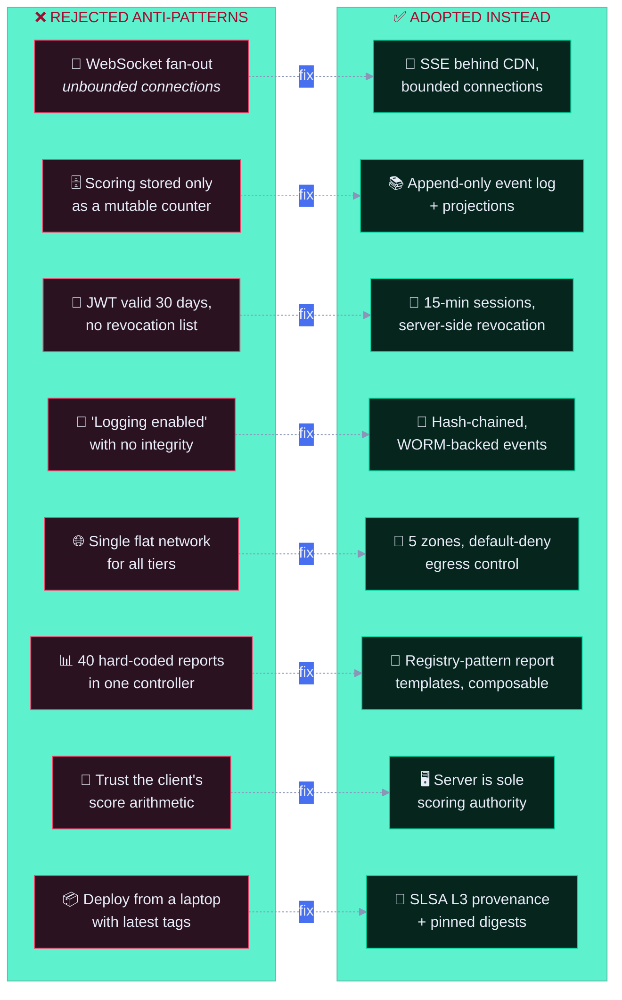

---

## 5. 🟣 Architecture Overview

The system is described at **five levels of abstraction**, following the C4 model. Each level is independently useful: executives read L0–L1, security reviewers read L2–L3, and implementers work from L3–L4.

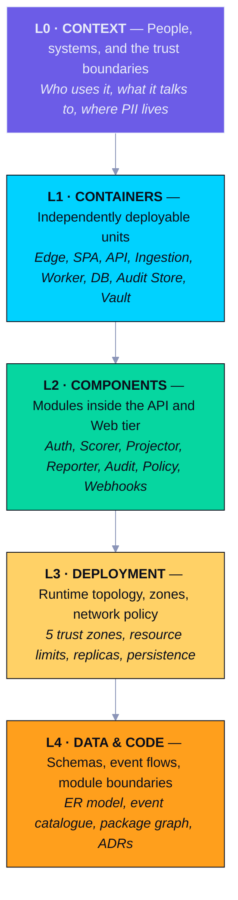

### 5.1 L0 — System Context

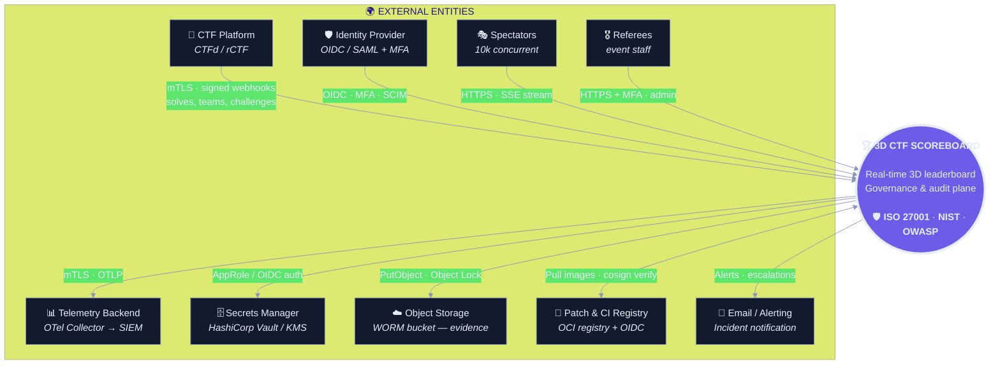

**Trust boundary analysis**

| Boundary | Crossed By | Control | Verification |
|:--|:--|:--|:--|
| 🚧 **B1** Internet → Edge | Spectators, referees | WAF, rate limit, TLS 1.3, geo/IP policy | TLS scan, pen test |
| 🚧 **B2** Edge → App | All client traffic | mTLS or signed session, CSP, HPP | ZAP baseline report |
| 🚧 **B3** App → Data | API queries | Parameterised queries, RLS, encryption at rest | SAST + DB audit |
| 🚧 **B4** App → Audit Store | Audit events | Hash chain, WORM, separate credentials | Chain verification job |
| 🚧 **B5** Ingestion → App | Webhooks | mTLS + HMAC signature + replay window | Contract + negative tests |
| 🚧 **B6** CI → Registry → Runtime | Artefacts | Cosign signature, SLSA provenance, digest pin | `cosign verify` in deploy |

### 5.2 L1 — Container Diagram

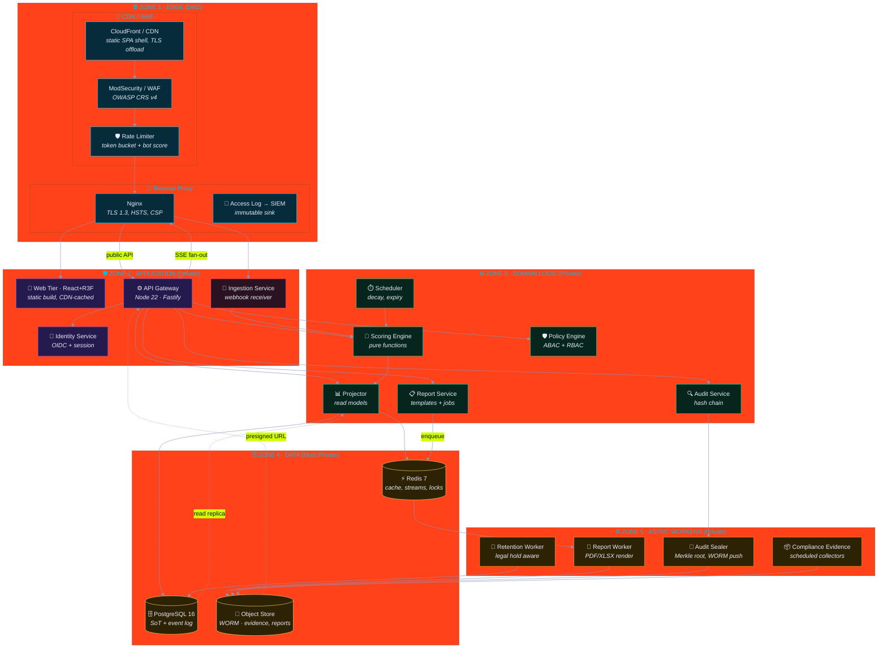

#### Container Inventory

| # | Container | Tech | Zone | Instances | State | Protocol | Owner |
|:--|:--|:--|:--:|--:|:--|:--|:--|
| 1 | CDN / WAF | CloudFront + AWS WAF | Z1 | managed | stateless | HTTPS | Platform |
| 2 | Reverse Proxy | Nginx 1.27 | Z1 | 2 | stateless | HTTP/1.1, h2 | Platform |
| 3 | Web Tier (SPA) | React 19 + R3F | edge | CDN | stateless | static | Frontend |
| 4 | API Gateway | Node 22 + Fastify 5 | Z2 | 3 | stateless | REST + SSE | Backend |
| 5 | Ingestion Service | Node 22 + Fastify 5 | Z2 | 2 | stateless | HTTPS/mTLS | Backend |
| 6 | Identity Service | `oidc-provider` | Z2 | 2 | stateless | OIDC | Security |
| 7 | Scoring Engine | TypeScript lib | Z3 | in-proc | pure | n/a | Backend |
| 8 | Projector | Node worker | Z3 | 2 | stateless | Redis Pub/Sub | Backend |
| 9 | Report Service | Node 22 | Z3 | 2 | stateless | REST | Backend |
| 10 | Audit Service | Node 22 | Z3 | 2 | append-only | REST + queue | Security |
| 11 | Policy Engine | OPA / Cerbos | Z3 | 2 | stateless | gRPC | Security |
| 12 | Scheduler | BullMQ | Z3 | 1 | stateless | Redis | Backend |
| 13 | PostgreSQL | PG 16 + TimescaleDB | Z4 | 1 + 1 RO | stateful | SQL | Data |
| 14 | Redis | Redis 7 (cluster) | Z4 | 3 | stateful | RESP | Data |
| 15 | Object Store | S3 + Object Lock | Z4 | managed | stateful | S3 API | Data |
| 16 | Report Worker | Node 22 + Chromium | Z5 | 2 | stateless | queue | Backend |
| 17 | Audit Sealer | Node 22 | Z5 | 1 | stateless | queue | Security |
| 18 | Evidence Collector | Python 3.12 | Z5 | 1 | stateless | cron | GRC |
| 19 | Retention Worker | Node 22 | Z5 | 1 | stateless | cron | Security |
| 20 | Vault Agent | Vault | Z4 | sidecar | stateless | mTLS | Security |

### 5.3 L2 — Component Architecture (API Tier)

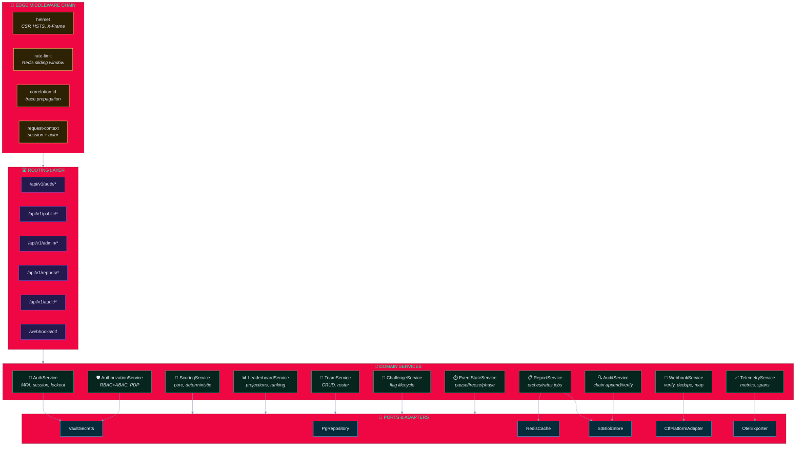

#### Component Responsibilities & Security Notes

| Component | Responsibility | Security Note | Control Ref |
|:--|:--|:--|:--|
| Edge Middleware | Transport headers, throttling, trace context | Single place to enforce CSP; fail-closed on misconfiguration | A02, SC-7 |
| Routing Layer | Versioned API surface, coarse authz gate | Route table is the authorisation boundary — deny-by-default | A01, AC-3 |
| AuthService | OIDC flow, MFA enrolment, session lifecycle | Argon2id only for local break-glass; TOTP enforced for all staff | A07, IA-2 |
| AuthorizationService | Role + attribute policy evaluation | Deny-by-default; every decision audit-logged with policy version | A01, AC-6 |
| ScoringService | Compute score deltas from raw events | **Pure function.** No I/O, no clock, no randomness → replayable | A.8.26 |
| LeaderboardService | Maintain rank projections, tie-breaks, streaks | Server is the single scoring authority; client never computes rank | A01, A08 |
| TeamService | Team lifecycle, roster, eligibility | Mass-assignment guarded by strict allow-list schemas | A05, A08 |
| ChallengeService | Flag state, categories, prerequisites | Flags never leave the server; only IDs and metadata exposed | A04, A.5.34 |
| EventStateService | Pause / freeze / resume / phase transitions | All transitions require a reason and land in the audit chain | A.8.15 |
| ReportService | Template registry, job orchestration, download signing | Every download is an audited, authorised, watermarked act | A.5.33 |
| AuditService | Append, chain, seal, verify | Append-only role; DB grants `INSERT` + `SELECT` only, never `UPDATE/DELETE` | A.8.15, A.5.28 |
| WebhookService | Signature verify, replay guard, dedupe, mapping | HMAC constant-time compare; 5-min skew window; idempotency keys | A08, SI-7 |
| TelemetryService | Metrics, traces, structured logs | PII redaction at source, before serialisation | A.5.34, A.8.15 |
| Ports &amp; Adapters | Isolation of I/O from domain logic | Domain layer has zero framework imports → testable, auditable | A.8.27 |

### 5.4 L3 — Deployment Topology

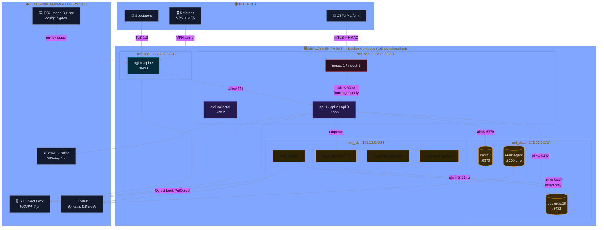

#### Network Segmentation Policy (default-deny)

| From → To | `net_pub` | `net_app` | `net_job` | `net_data` | Egress |
|:--|:--:|:--:|:--:|:--:|:--|
| **`net_pub`** | 🟢 :8443 only | 🟢 :3000 | 🔴 deny | 🔴 deny | 🟡 Allow-list |
| **`net_app`** | 🔴 deny | 🟢 :3000, :4317 | 🔴 deny | 🟢 :5432, :6379 | 🟡 Allow-list |
| **`net_job`** | 🔴 deny | 🔴 deny | 🔴 deny | 🟢 :5432 (ro/insert) | 🟢 S3 only |
| **`net_data`** | 🔴 deny | 🔴 deny | 🔴 deny | 🟢 intra-zone | 🟡 Vault only |
| **Host → Internet** | 🔴 | 🟡 updates via proxy | 🔴 | 🔴 | — |

> 🔐 **Egress allow-list (net_app):** `*.vault.*:443`, `s3.*:443`, `*.idp.*:443`, `otel-collector:4317`, NTP:123. All other outbound **dropped** — this blocks exfiltration and C2 callback (A10 mitigation, A.8.20).

#### Container Hardening Baseline

| Control | Setting | Rationale | Benchmark |
|:--|:--|:--|:--|
| User | non-root, UID 10001, read-only rootfs | Reduce blast radius | CIS 4.1/4.7 |
| Capabilities | drop ALL, add only `NET_BIND_SERVICE` | Privilege escalation defence | CIS 5.2 |
| Filesystem | `read_only: true`, tmpfs for `/tmp` | Prevent persistence | CIS 5.4 |
| Memory | hard limit 1.5 GB | DoS containment | — |
| CPU | 2.0 cores, `--cpus 2` | DoS containment | — |
| PIDs | `--pids-limit 256` | Fork-bomb defence | CIS 5.3 |
| Network | `cap_drop`, no `NET_RAW` | Sniffing/ping defence | CIS 5.2 |
| Secrets | tmpfs, `noexec,nosuid,nodev` | No on-disk secret residue | A.5.17 |
| Logging | `json-file` → stdout, no rotation gap | Audit continuity | A.8.15 |
| Labels | `org.opencontainers.image.*`, cosign ref | Provenance | A.8.19 |

### 5.5 L4 — Logical Data Flow

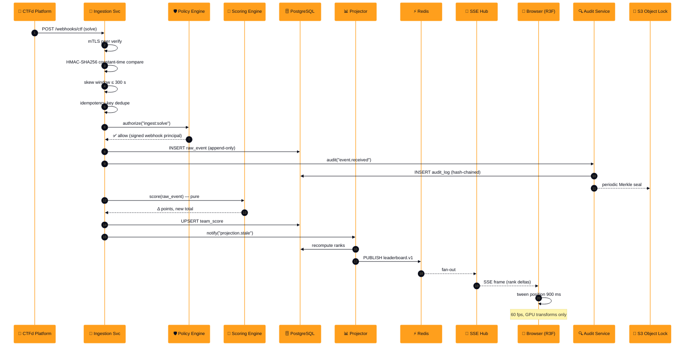

---

## 6. 🟡 3D Visualization Subsystem

This is the product's differentiator and the most performance-sensitive component. The design goal: **a spectator's browser does the rendering, so the server never has to.**

### 6.1 Visual Language — Encoding Semantics into Geometry

| Visual Channel | Encodes | Design Rule | Accessibility |
|:--|:--|:--|:--|
| ⬆️ **Y position** | Rank | Strictly monotonic; podium tiers physically raised | Redundant with `aria-posinset` |
| 🎨 **Hue** | Score tier | 4 tiers only — gold / silver / bronze / base | Never hue-alone (see [§6.6](#66-accessibility--fallbacks)) |
| 💡 **Emissive intensity** | Momentum | Rises with solve velocity; decays over 20 s | Announced via live region |
| 📏 **Scale (X/Z)** | Score magnitude | Log-mapped, clamped 0.4–2.0 to avoid domination | Numeric label always shown |
| 🎞️ **Animation** | Rank change | 900 ms spring; overshoot ≤ 6 % | Disabled under `prefers-reduced-motion` |
| ✨ **Particle burst** | Solve event | GPU instanced, 400 particles, 1.2 s life | Skipped in reduced-motion |
| 🏷️ **Name plate** | Team name | Billboarded, SDF text, DPI-aware | Always mirrored in 2D DOM list |
| 🔊 **Optional audio cue** | Rank change | Off by default; explicit opt-in; no autoplay | Mute control always visible |
| 📊 **Sparkline trail** | Score history | 120-point trailing window | Available in DOM fallback |

### 6.2 Podium Layout

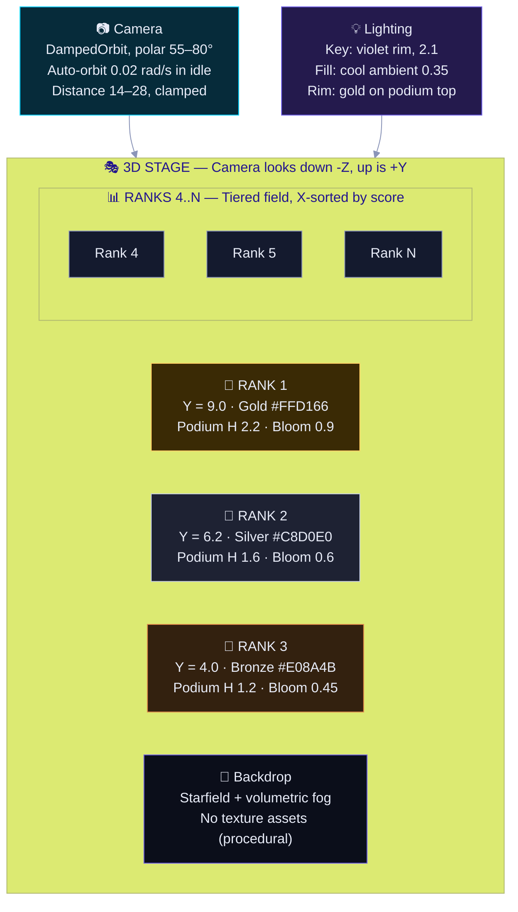

**Geometry parameters**

| Parameter | Value | Rationale |
|:--|:--|:--|
| Podium tier height step | 1.4 units | Legible depth cue at 4 K and 1080p |
| Y offset per rank | `max(0, (N - rank)) * 0.18` | Monotonic, no overlap for top 3 |
| Score→scale | `0.4 + 1.6 * log1p(score)/log1p(maxScore)` | Prevents one dominant team flattening the field |
| Base radius | 0.55 units | Consistent silhouette |
| Gap | 0.12 units | Prevents z-fighting on instanced meshes |
| Spring stiffness / damping | 170 / 26 | ≈900 ms settle, ~4 % overshoot |
| Particle count | 400 GPU-instanced quads | 1.2 s life, additive blend |
| Draw calls target | ≤ 120 | Frame budget discipline |

### 6.3 Rendering Pipeline

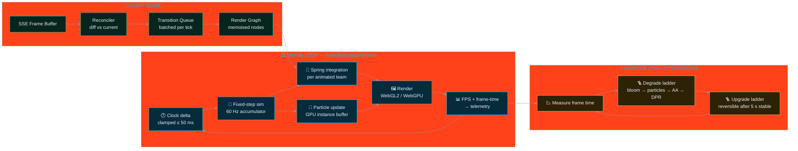

#### Adaptive Quality Ladder

| Tier | Trigger (p95 frame time) | DPR | Bloom | Particles | AA | Shadows |
|:--|:--|:--:|:--:|:--:|:--:|:--:|
| 🟢 **Ultra** | ≤ 8 ms | min(dpr, 2) | ✅ | 400 | MSAA 4× | Soft 2048 |
| 🔵 **High** | ≤ 12 ms | min(dpr, 1.5) | ✅ | 240 | MSAA 2× | Soft 1024 |
| 🟡 **Medium** | ≤ 20 ms | 1.0 | ❌ | 120 | FXAA | Hard 512 |
| 🟠 **Low** | ≤ 33 ms | 0.75 | ❌ | 0 | ❌ | ❌ |
| 🔴 **Minimal** | > 33 ms | 0.6 | ❌ | 0 | ❌ | ❌ |

> Degradation is **silent but recorded** — the active tier is reported in the DOM status bar and in client telemetry, so quality problems are diagnosable rather than mysterious. *(Principle P-11.)*

### 6.4 State Synchronisation Strategy

The hardest part of a live 3D leaderboard is not rendering — it is keeping the scene **truthful** under bursty, out-of-order, and lossy network conditions.

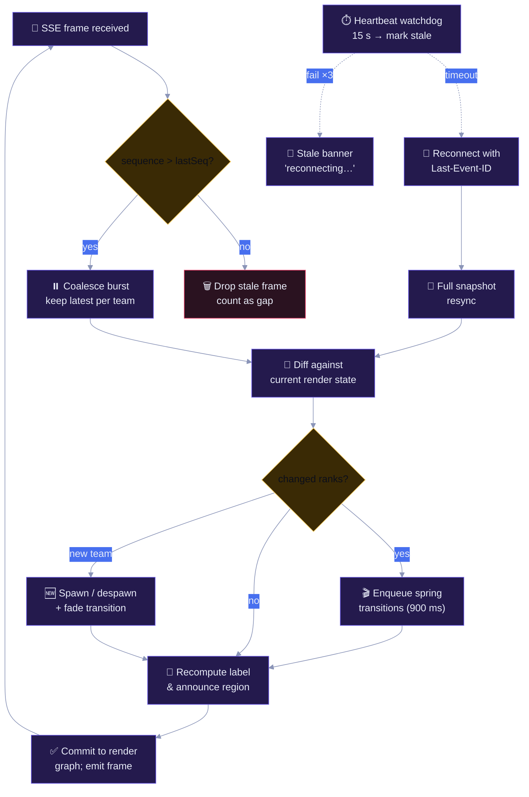

#### SSE Frame Contract

```jsonc
{
  "seq": 48213,                  // monotonic, gap-detectable
  "eventId": "lb-48213",         // SSE id → Last-Event-ID resume
  "ts": "2026-09-26T19:04:11.482Z",
  "eventType": "leaderboard.delta",
  "schemaVersion": 3,
  "eventIdempotencyKey": "shk_9f2a…",
  "data": {
    "phase": "scoring_open",     // pre_event | scoring_open | frozen | ended
    "serverTimeMs": 1789742651482,
    "freezeWindows": [{ "fromRank": 1, "toRank": 3, "reason": "tie_review" }],
    "changes": [
      { "teamId": "t_041", "handle": "0xDEADBEEF",
        "rank": 3, "prevRank": 7,
        "score": 4820, "scoreDelta": 900,
        "solved": 24, "streak": 5,
        "tier": "bronze",
        "rankLocked": true, "lockReason": "tie_review" }
    ],
    "removed": [],
    "topN": 100
  }
}
```

**Delivery guarantees**

| Property | Mechanism | Notes |
|:--|:--|:--|
| Ordering | Monotonic `seq` | Client drops anything `≤ lastSeq` |
| Gap detection | `seq` discontinuity | Client requests a snapshot resync |
| Resume | `Last-Event-ID` header | Server replays from Redis stream |
| Loss tolerance | Coalescing to latest state | Leaderboard is *state*, not a log |
| Backpressure | Server sheds per-client, not globally | Slow client gets fewer deltas, never blocks others |
| Auth expiry mid-stream | Stream closed with `420` reason | Client re-auths, then resyncs |
| Heartbeat | `:heartbeat` comment every 15 s | Keeps proxies from idling out the socket |

> ⚠️ **Design decision:** the client renders *the server's rank*, never its own computation of rank. A malicious spectator modifying client-side totals changes only their own screen — the authoritative board is unaffected. *(Principle P-02, A01 mitigation.)*

### 6.5 Web 3D Technology Stack

| Layer | Choice | Version | Rationale |
|:--|:--|:--|:--|
| Framework | React | 19.x | Concurrent rendering, mature ecosystem |
| 3D React binding | `@react-three/fiber` | 9.x | Declarative scene graph, reconciler integration |
| 3D helpers | `@react-three/drei` | 10.x | `Text`, `Instances`, `Environment`, `PerformanceMonitor` |
| Physics / motion | `@react-spring/three` | 10.x | Deterministic springs, interruptible |
| State (server) | TanStack Query | 5.x | Cache, dedupe, stale-while-revalidate |
| State (client) | Zustand | 5.x | Minimal store, no context thrash |
| Build | Vite | 7.x | Fast, ESM, code splitting |
| Language | TypeScript | 5.7+ | `strict`, `noUncheckedIndexedAccess` |
| Charts (2D view) | Recharts | 2.x | Accessible SVG sparklines |
| State chart | XState | 5.x | Formalised stream/scene state machines |
| i18n | `react-i18next` | 15.x | Locale-aware number/date formatting |
| Validation | Zod | 3.x | **Runtime** validation of every SSE frame |
| Test | Vitest + Playwright | — | Unit, visual-regression, E2E |
| Telemetry | `@opentelemetry/*` | 1.x | RUM, WebVitals, custom spans |

**Render-performance guardrails (enforced in CI)**

```
✅ draw calls           ≤ 120
✅ triangles            ≤ 400,000
✅ texture memory       ≤ 64 MB
✅ geometries           ≤ 60
✅ programs (shaders)   ≤ 12
✅ initial JS bundle    ≤ 320 KB gzip (shell)  +  ≤ 180 KB gzip (3D chunk)
✅ LCP                  ≤ 2.5 s on 4G
✅ TBT (total blocking) ≤ 200 ms
```

### 6.6 Accessibility & Fallbacks

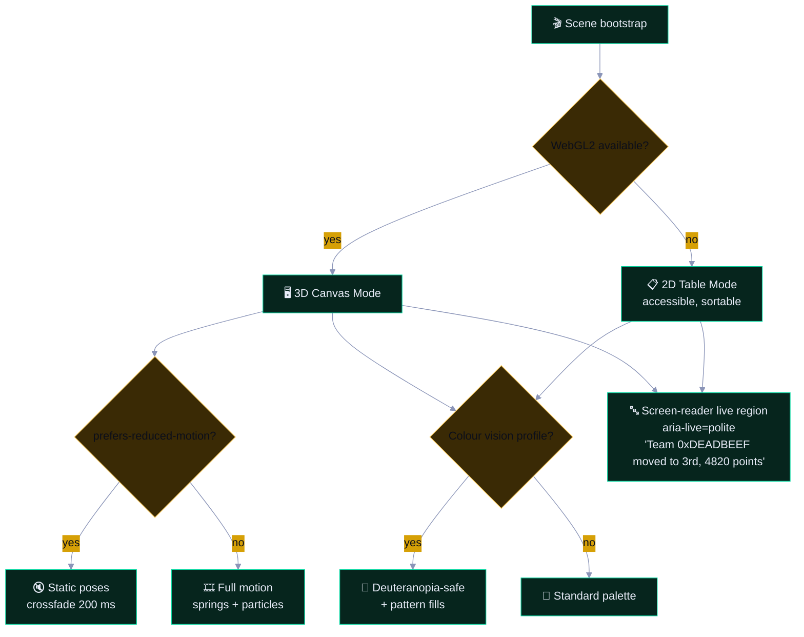

| Requirement | Implementation | Standard |
|:--|:--|:--|
| Keyboard navigation | `Tab`/`Shift+Tab` through team nodes; `Enter` opens team detail | WCAG 2.2 · 2.1.1 |
| Text contrast | All labels ≥ 7:1 (AAA) against their podium backdrop | WCAG 2.2 · 1.4.6 |
| Not colour-alone | Tier indicated by colour **+** medal glyph **+** numeric rank badge | WCAG 2.2 · 1.4.1 |
| Reduced motion | `prefers-reduced-motion: reduce` → static poses, opacity crossfade only | WCAG 2.2 · 2.3.3 |
| Screen reader | `aria-live="polite"` region announcing rank deltas, debounced 2 s | WCAG 2.2 · 4.1.3 |
| Non-text contrast | Podium edges and focus rings ≥ 3:1 | WCAG 2.2 · 1.4.11 |
| Target size | Interactive hit targets ≥ 24×24 CSS px | WCAG 2.2 · 2.5.8 |
| Keyboard trap | None; `Esc` always exits detail view | WCAG 2.2 · 2.1.2 |
| Language | `<html lang>` set; team handles are `lang="und"` | WCAG 2.2 · 3.1.1 |

> **Accessibility is an ISO 27001 concern, not only a legal one.** Non-conformity with accessibility requirements creates regulatory exposure (EU Web Accessibility Directive, ADA, and — in the EU — the European Accessibility Act applicable from June 2025), which is treated as a compliance risk in [§23.1](#231-risk-register).

### 6.7 Frontend Module Layout

```
apps/
├── web/                              # Public spectator SPA (CDN-hosted)
│   ├── src/
│   │   ├── scene/                    # 3D subsystem
│   │   │   ├── Stage.tsx             # Canvas + suspense boundary
│   │   │   ├── Podium.tsx            # Podium geometry
│   │   │   ├── TeamNode.tsx          # Per-team mesh + label
│   │   │   ├── Particles.tsx         # GPU instanced solve burst
│   │   │   ├── Backdrop.tsx          # Procedural starfield + fog
│   │   │   ├── CameraRig.tsx         # Damped orbit + idle auto-orbit
│   │   │   └── quality/
│   │   │       ├── governor.ts       # Adaptive quality ladder
│   │   │       └── budget.ts         # Draw-call / triangle budget
│   │   ├── state/
│   │   │   ├── stream.ts             # SSE client, resume, watchdog
│   │   │   ├── reconcile.ts          # Pure diff fn (unit-tested)
│   │   │   ├── schema.ts             # Zod validators for every frame
│   │   │   └── store.ts              # Zustand store
│   │   ├── views/
│   │   │   ├── Leaderboard3D.tsx
│   │   │   ├── Leaderboard2D.tsx     # Fallback + accessible source of truth
│   │   │   ├── TeamDetail.tsx
│   │   │   ├── Replay.tsx            # Timeline scrubber
│   │   │   └── StatusBar.tsx         # Connection + quality tier
│   │   ├── a11y/
│   │   │   ├── LiveRegion.tsx
│   │   │   └── palette.ts            # CVD-safe palettes
│   │   └── security/
│   │       ├── csp.ts                # Report-only → enforcing rollout
│   │       └── sanitize.ts           # DOMPurify for any rich text
│   └── tests/{unit,visual,e2e}/
│
├── admin/                            # Staff console (never CDN-public)
│   ├── src/modules/
│   │   ├── event-control/            # Pause / freeze / resume
│   │   ├── score-correction/         # Reversals with mandatory reason
│   │   ├── report-center/            # Generate + download
│   │   ├── audit-explorer/           # Chain verify + search
│   │   ├── compliance-matrix/        # Control ↔ evidence browser
│   │   └── user-admin/               # Roles, MFA enforcement
│   └── hardened: no CDN, CSP strict, no third-party scripts
│
└── display/                          # Kiosk shell for big screens
    ├── autostart, auto-reconnect, read-only enforced, health probe
    └── provisioned via MDM / disk image with verified boot
```

---
## 7. 🔵 Backend & Data Architecture

### 7.1 Internal Service Architecture

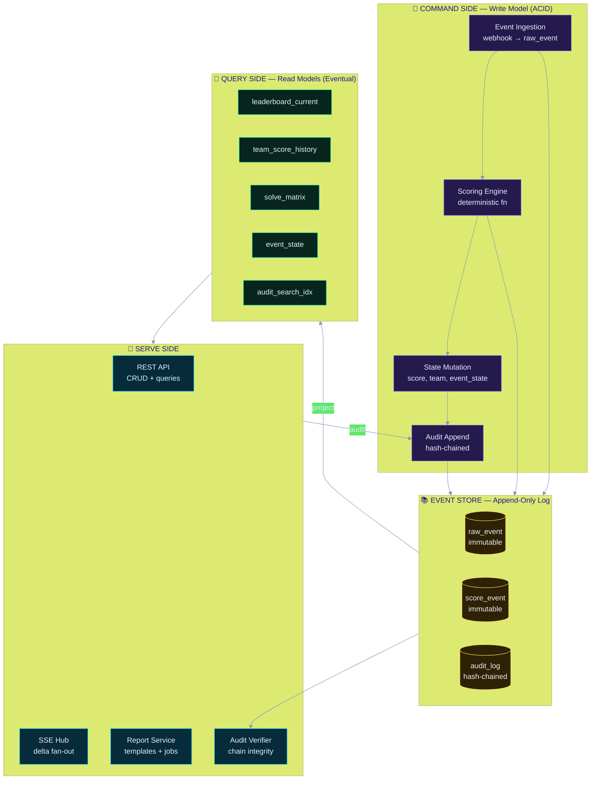

**Command–Query separation** is the structural reason this system is auditable: the write path only appends; the read path only projects. A report can never mutate state, and an audit record is written in the same transaction as the change it describes.

### 7.2 Domain Model (ER Diagram)

```mermaid
%%{init: {"theme":"base","themeVariables":{"primaryColor":"#6C5CE7","primaryTextColor":"#E8ECF8","primaryBorderColor":"#6C5CE7","lineColor":"#8B95B8","fontFamily":"Inter, sans-serif"}}}%%
erDiagram
    EVENT ||--o{ EVENT_STATE_VERSION : "has phases"
    EVENT ||--o{ TEAM : "contains"
    EVENT ||--o{ CHALLENGE : "contains"
    EVENT ||--o{ SCORE_EVENT : "generates"
    EVENT ||--o{ RAW_EVENT : "ingests"
    EVENT ||--o{ REPORT : "produces"
    EVENT ||--o{ FREEZE_WINDOW : "declares"
    TEAM ||--o{ TEAM_MEMBER : "roster"
    TEAM ||--o{ TEAM_SCORE : "accumulates"
    TEAM ||--o{ SCORE_EVENT : "earns"
    CHALLENGE ||--o{ SOLVE : "solved by"
    TEAM ||--o{ SOLVE : "achieves"
    CHALLENGE }o--|| CATEGORY : "belongs to"
    USER ||--o{ ROLE : "assigned"
    USER ||--o{ AUDIT_LOG : "acts"
    USER ||--o{ REPORT : "requests"
    USER ||--o{ SESSION : "holds"
    REPORT ||--o{ REPORT_ARTIFACT : "renders"
    AUDIT_LOG ||--o{ AUDIT_LOG : "chained to"
    CONTROL ||--o{ EVIDENCE : "supported by"
    EVIDENCE ||--o{ EVIDENCE_BUNDLE : "bundled in"
    AUDIT_LOG }o--|| CONTROL : "supports"

    EVENT {
        uuid id PK
        string name
        string slug UK
        timestamptz starts_at
        timestamptz ends_at
        string phase "pre_event|scoring_open|frozen|ended"
        string scoring_model "v1..vN"
        jsonb config
        boolean is_active
    }
    EVENT_STATE_VERSION {
        bigserial id PK
        uuid event_id FK
        string phase
        string reason
        uuid actor_id FK
        timestamptz effective_at
        bigint version "optimistic lock"
    }
    TEAM {
        uuid id PK
        uuid event_id FK
        string handle "unique per event"
        string display_name
        string country_code
        string logo_url "sanitised, allow-listed"
        boolean is_eligible
        boolean hidden
        timestamptz created_at
    }
    TEAM_MEMBER {
        uuid id PK
        uuid team_id FK
        string handle
        string email "PII - encrypted"
        string role
    }
    TEAM_SCORE {
        uuid team_id PK,FK
        bigint total_points
        int solves
        int rank "projected"
        numeric penalty_seconds
        timestamptz last_solve_at
        bigint version
    }
    CHALLENGE {
        uuid id PK
        uuid event_id FK
        uuid category_id FK
        string name
        int base_points
        int min_points
        int max_points
        string difficulty
        timestamptz released_at
        string state "hidden|visible|solved_by_all|retired"
    }
    CATEGORY {
        uuid id PK
        string name
        int display_order
        string colour_hex "contrast-checked"
    }
    SOLVE {
        uuid id PK
        uuid team_id FK
        uuid challenge_id FK
        timestamptz solved_at
        int points_awarded
        boolean verified
        boolean reverted
        string source "platform|admin"
    }
    RAW_EVENT {
        bigserial id PK
        uuid event_id FK
        string idempotency_key UK
        string source_system
        string event_type
        jsonb payload
        string signature
        timestamptz received_at
        timestamptz occurred_at
        string processing_status
        text processing_error
    }
    SCORE_EVENT {
        bigserial id PK
        uuid event_id FK
        uuid team_id FK
        uuid challenge_id FK
        string type "solve|penalty|adjustment|reversal|bonus"
        int delta_points
        bigint balance_after
        jsonb derivation "inputs + formula + params"
        string actor_id "system|user UUID"
        timestamptz created_at
    }
    FREEZE_WINDOW {
        uuid id PK
        uuid event_id FK
        int from_rank
        int to_rank
        string reason
        timestamptz from_ts
        timestamptz to_ts
        boolean active
    }
    USER {
        uuid id PK
        string email UK
        string display_name
        string oidc_subject
        boolean mfa_enrolled
        string status "active|locked|disabled"
        timestamptz last_login_at
    }
    ROLE {
        uuid id PK
        string name UK
        string[] permissions
        boolean is_system
    }
    SESSION {
        uuid id PK
        uuid user_id FK
        string token_hash "sha256"
        string ip_prefix
        timestamptz expires_at
        boolean revoked
        string revoked_reason
    }
    AUDIT_LOG {
        bigserial id PK
        uuid event_id FK
        bigserial prev_hash FK "chain"
        string this_hash "sha256 chain hash"
        string actor_id
        string actor_type "user|system|service"
        string action "resource.verb"
        string resource_type
        string resource_id
        jsonb before_state
        jsonb after_state
        string reason
        string ip_address
        string user_agent_hash
        string correlation_id
        timestamptz occurred_at
        string schema_version
    }
    REPORT {
        uuid id PK
        uuid event_id FK
        uuid requested_by FK
        string template_key
        string format "pdf|csv|xlsx|json|html|png|zip"
        jsonb parameters
        string status "queued|running|complete|failed|expired"
        bigint size_bytes
        string sha256
        timestamptz expires_at
        string classification
        string watermark_id
    }
    REPORT_ARTIFACT {
        uuid id PK
        uuid report_id FK
        string storage_key
        string content_type
        bigint size_bytes
        string sha256
        string kms_key_id
    }
    CONTROL {
        uuid id PK
        string framework "ISO27001|NIST_CSF|NIST_800_53|OWASP"
        string control_ref
        string title
        string implementation
        string owner
        string status
    }
    EVIDENCE {
        uuid id PK
        uuid control_id FK
        string artefact_type
        string storage_key "WORM"
        string sha256
        timestamptz collected_at
        string collector_version
    }
    EVIDENCE_BUNDLE {
        uuid id PK
        string name
        string manifest_sha256
        string signature_ref
        timestamptz sealed_at
    }
```

### 7.3 Storage Strategy

| Store | Data | Type | Encryption | Retention | Backup |
|:--|:--|:--|:--|:--|:--|
| PostgreSQL 16 | Raw events, score events, teams, users, sessions | ACID relational | TDE + column-level AES-GCM for PII | Raw 24 mo · Score 7 yr | PITR + daily base + WAL archive |
| TimescaleDB | Team score history (hypertable, 1-min buckets) | Time-series | At-rest (disk) + TLS in transit | 7 yr (compressed after 30 d) | Continuous, 30-day granularity |
| Redis 7 | Stream buffer, rate limits, session cache, locks | Ephemeral | TLS in transit only (no PII) | TTL ≤ 24 h | None (reconstructible) |
| S3 Object Lock | Reports, evidence, exports, audit seals | Immutable blob | SSE-KMS, CMK per class | Reports 90 d · Evidence 7 yr | Cross-region replication |
| Ingest buffer | Debounced webhook payloads | Queue | TLS | TTL 24 h | None |

**PostgreSQL security configuration**

| Setting | Value | Purpose |
|:--|:--|:--|
| `ssl` | `on`, `ssl_min_protocol_version = 'TLSv1.2'` | Transport security |
| `password_encryption` | `scram-sha-256` | Never MD5/SHA1 |
| `log_statement` | `ddl` | Schema-change audit |
| `log_connections` / `log_disconnections` | `on` | Session forensics |
| `row_security` | `on` (force for app role) | Tenant + role isolation |
| `default_transaction_isolation` | `repeatable read` for reporting | Consistent snapshot exports |
| `shared_preload_libraries` | `pgaudit`, `pg_stat_statements` | Query auditing + perf |
| Extensions | `pgcrypto`, `uuid-ossp`, `timescaledb`, `pg_stat_statements`, `pgaudit` | Required capabilities |
| Roles | `app_rw`, `app_ro`, `ingest_ro`, `audit_ro`, `report_ro`, `seal_wo`, `migrator` | Least-privilege separation |
| Revoke | `REVOKE UPDATE, DELETE ON audit_log FROM app_rw` | Log immutability at DB level |
| Backup encryption | `pgBackRest` + KMS, AES-256 | At-rest protection |

> 🔐 **Database-enforced immutability.** The `audit_log` table is protected by rules, not convention:
> ```sql
> CREATE RULE audit_log_no_update AS ON UPDATE TO audit_log DO INSTEAD NOTHING;
> CREATE RULE audit_log_no_delete AS ON DELETE TO audit_log DO INSTEAD NOTHING;
> GRANT INSERT, SELECT ON audit_log TO app_rw;
> -- no UPDATE/DELETE grant exists for any non-owner role
> ```

### 7.4 Caching & Consistency Strategy

| Read | Cache | TTL | Invalidation | Stale Policy |
|:--|:--|:--|:--|:--|
| `GET /leaderboard?top=100` | Redis + CDN | 2 s / 5 s | Event-driven purge | `stale-while-revalidate=30s` |
| `GET /teams/:id` | Redis | 60 s | On team mutation | Serve stale 5 min |
| `GET /event/state` | Redis | 1 s | Event-driven | Never stale (safety-critical) |
| `GET /reports/:id` | None | — | — | Always fresh (authoritative) |
| `GET /audit/search` | OpenSearch | 30 s | Near-real-time index | `refresh=1s` |
| `/api/v1/auth/*` | None | — | — | Never cached |
| SSE `/stream` | Redis Stream | 60 s retention | n/a | Resume by `Last-Event-ID` |

**Consistency model**

| Operation | Consistency | Rationale |
|:--|:--|:--|
| Score submission | 🟢 **Strong** (serialisable, single writer) | Scores must never double-apply |
| Score reversal | 🟢 **Strong** | Referee decisions are legally sensitive |
| Leaderboard read | 🟡 **Read-your-writes** for the acting admin | Admin must see their own change |
| Spectator leaderboard read | 🟠 **Monotonic read** (never regress) | Animate forward only |
| Audit query | 🟢 **Strong** | Evidence integrity |
| Report generation | 🟠 **Snapshot consistent** | Exports must be internally coherent |
| Telemetry | 🔴 **Best-effort** | Never blocks the user path |

---

## 8. 🟡 Scoring & Event Model

### 8.1 Why a Pure Scoring Function Matters for Audit

An auditor's hardest question is *"prove the leaderboard was correct."* The answer is a **deterministic, side-effect-free function** whose output for a given event stream is mathematically reproducible. Given the same `RAW_EVENT` set and the same `scoring_model` version, the platform recomputes byte-identical results — on demand, in a sandbox, years later.

```typescript
// packages/scoring/src/engine.ts — no I/O, no clock, no randomness
import type { RawEvent, ScoringConfig, ScoreEvent } from './types';

export function score(
  history: ReadonlyArray<ScoreEvent>,
  incoming: ReadonlyArray<RawEvent>,
  config: ScoringConfig,            // versioned, immutable per event
): { events: ScoreEvent[]; errors: ScoringError[] } { /* pure */ }
```

**Properties enforced by the test suite**

| Property | Test | Gate |
|:--|:--|:--|
| Referential transparency | Same input → identical output hash, 1,000 runs | 🔴 Blocking |
| Order independence within a timestamp | Shuffled equal-`occurred_at` events → same totals | 🔴 Blocking |
| Idempotency | Replaying an event stream changes nothing | 🔴 Blocking |
| Config versioning | Old model versions remain replayable | 🔴 Blocking |
| Golden files | 24 curated scenarios match expected output exactly | 🔴 Blocking |
| Metamorphic | Adding a zero-delta event changes no balance | 🟡 Advisory |

### 8.2 Dynamic Scoring Model

```mermaid
%%{init: {"theme":"base","themeVariables":{"primaryColor":"#FFD166","primaryTextColor":"#0B0E1A","primaryBorderColor":"#FFD166","lineColor":"#8B95B8","fontFamily":"Inter, sans-serif"}}}%%
flowchart LR
    S0["🏁 Event start<br/>t = 0"]:::n
    S1["Solve at t<br/>base value B"]:::n
    S2["Decay curve<br/>D(t) = B · e^(-λt)"]:::calc
    S3["Clamp<br/>[minPts, maxPts]"]:::calc
    S4["Freeze multiplier<br/>FM ∈ {1.0, 0.5, 0.0}"]:::calc
    S5["Streak bonus<br/>SB = 1 + min(streak,5)·0.04"]:::calc
    S6["Awarded points<br/>P = round(S3 · S4 · SB)"]:::out
    S7["Balance += P<br/>emit ScoreEvent"]:::out
    S0 --> S1 --> S2 --> S3 --> S4 --> S5 --> S6 --> S7
    classDef n fill:#241A4D,stroke:#6C5CE7,color:#E8ECF8
    classDef calc fill:#2E2205,stroke:#FFD166,color:#0B0E1A
    classDef out fill:#06251D,stroke:#06D6A0,color:#E8ECF8
```

| Parameter | Symbol | Default | Range | Configurable |
|:--|:--|--:|:--|:--:|
| Base points | `B` | 500 | 50 – 5,000 | ✅ per challenge |
| Decay constant | `λ` | 0.00018 | 0 – 0.01 | ✅ per event |
| Floor / ceiling | — | 100 / 500 | — | ✅ per challenge |
| Freeze multiplier | `FM` | 0.5 (top 3) | 0 – 1 | ✅ referee-set |
| Streak bonus cap | — | 20 % (5 solves) | 0 – 50 % | ✅ per event |
| Penalty (wrong submit) | — | −30 s | 0 – −600 s | ✅ per event |
| Tie-break order | — | ① points ② solves ③ earliest last-solve ④ handle (collation `C`) | — | ✅ per event |

> Every `ScoreEvent` stores its full `derivation` JSON — the exact inputs, parameter values, and formula version. A disputed score can be re-derived and explained line by line without re-running the platform. This is the single most valuable artifact for both dispute resolution and audit. *(ISO A.8.26, A.5.33.)*

### 8.3 Event Catalogue

| Event Type | Producer | Consumer | Mutates | Audited | Reversible |
|:--|:--|:--|:--:|:--:|:--:|
| `event.phase.changed` | Referee | Projector, SSE | `event_state` | ✅ | ✅ (with reason) |
| `event.started` / `event.ended` | Scheduler | All | `event_state` | ✅ | ⛔ |
| `team.created` / `team.updated` / `team.deleted` | Admin | Projector | `team` | ✅ | ✅ (soft) |
| `team.eligibility.changed` | Referee | Projector | `team` | ✅ | ✅ |
| `challenge.released` / `challenge.retired` | Referee | Projector, SSE | `challenge` | ✅ | ✅ |
| `challenge.points.changed` | Referee | Projector | `challenge` | ✅ | ✅ (recomputes) |
| `solve.recorded` | Ingestion | Scorer | `solve`, `team_score` | ✅ | ✅ (auto) |
| `solve.reverted` | Referee | Scorer | `solve`, `team_score` | ✅ | ✅ |
| `solve.verified` / `solve.disputed` | Referee | Scorer | `solve` | ✅ | ✅ |
| `penalty.applied` | Ingestion | Scorer | `team_score` | ✅ | ✅ |
| `score.adjusted` | Referee (2-person) | Scorer | `team_score` | ✅ | ✅ |
| `freeze.window.opened` / `.closed` | Referee | Projector, SSE | `freeze_window` | ✅ | ✅ |
| `report.requested` | Analyst | Report Svc | `report` | ✅ | ⛔ (immutable artefact) |
| `report.downloaded` | Analyst | Audit | — | ✅ | ⛔ |
| `user.login` / `user.logout` / `user.mfa.*` | IdP | Audit | `session` | ✅ | ⛔ |
| `access.denied` | Policy Engine | Audit, SIEM | — | ✅ | ⛔ |
| `report.template.registered` | Admin | Report Svc | `report_template` | ✅ | ✅ |
| `policy.deployed` | Security | Policy Engine | `policy_bundle` | ✅ | ✅ (rollback) |
| `config.updated` | Admin | All | `event.config` | ✅ | ✅ |
| `breakglass.activated` | On-call | All | — | ✅ **+ alert** | ⛔ (mandatory post-review) |

### 8.4 Idempotency & Exactly-Once Semantics

Webhook retries must never double-score. The ingestion path uses a three-layer defence:

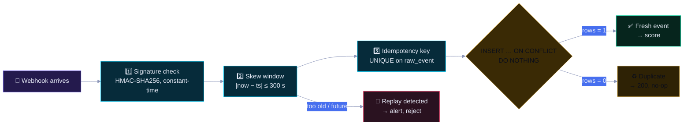

**Idempotency key construction**

```
key = SHA-256( event_slug ‖ source_system ‖ source_event_id )
```

Accepted duplicate responses: `200 OK` with `{"status":"duplicate","original_seq":<n>}` — never `5xx`, because a retry storm must not become an outage, and never `409`, because that triggers infinite client retries.

---

## 9. 🔵 API Design

### 9.1 API Surface

| Group | Base Path | Auth | Audience |
|:--|:--|:--|:--|
| 🟢 Public read | `/api/v1/public/*` | Optional (rate-limited by IP) | Spectators |
| 🔵 Authenticated | `/api/v1/me/*` | Session cookie | Team members, staff |
| 🟣 Admin | `/api/v1/admin/*` | Session + MFA + RBAC | Referees, ops |
| 🟠 Reporting | `/api/v1/reports/*` | Session + `report:read` | Analysts, GRC |
| 🔴 Audit | `/api/v1/audit/*` | Session + `audit:read` + step-up | Auditors |
| 🟡 Grpc | `/api/v1/compliance/*` | Session + `audit:read` | GRC |
| ⚫ Machine | `/webhooks/*` | mTLS + HMAC | CTF platform |
| ⚪ Machine | `/internal/*` | mTLS (net_app only) | Workers |

### 9.2 Endpoint Catalogue

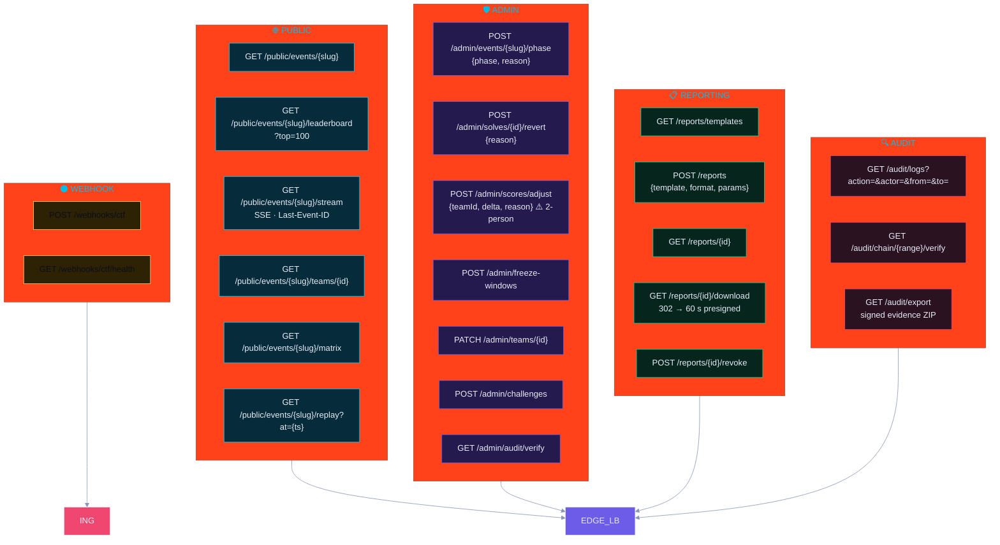

### 9.3 API Security Standards

| Concern | Implementation | Reference |
|:--|:--|:--|
| Transport | TLS 1.3 mandatory, 1.2 fallback; HSTS `max-age=63072000; includeSubDomains; preload` | A02 · SC-8 |
| Authentication | OIDC Authorization Code + PKCE; staff enforced to WebAuthn/TOTP | A07 · IA-2 |
| Session | `__Host-sc3` cookie: Secure, HttpOnly, Path=/, no Domain, SameSite=Strict | A07 |
| Session lifetime | 15 min idle / 8 h absolute; server-side revocation; rotation on privilege change | IA-11 |
| Authorisation | Deny-by-default RBAC + ABAC; policy version recorded in audit | A01 · AC-6 |
| Step-up auth | `audit:read`, `score.adjust`, `policy.deploy` require re-auth ≤ 5 min | AC-6(8) |
| Input validation | Zod schemas at every boundary; unknown keys rejected (no mass assignment) | A05 |
| Injection defence | Parameterised queries only; ORM with no raw-string concatenation; CSP blocks inline script | A05 |
| Output encoding | Contextual escaping; DOMPurify for any HTML; no `dangerouslySetInnerHTML` on user content | A05 |
| CSRF | Double-submit token + `SameSite=Strict` + Origin allow-list | A01 |
| CORS | Explicit origin allow-list; never `*` with credentials; `Vary: Origin` | A02 |
| Rate limiting | Sliding window: public 60/min, admin 300/hr, auth 5/15 min, reports 20/hr | A04 |
| Payload limits | Body ≤ 256 KB (1 MB admin); header ≤ 8 KB; JSON depth ≤ 12 | A04 |
| Idempotency | `Idempotency-Key` required on all POST/PATCH; 24 h replay window | A04 |
| Security headers | CSP (`default-src 'self'`), HSTS, `X-Content-Type-Options`, `Referrer-Policy: strict-origin-when-cross-origin`, `Permissions-Policy` (deny camera/mic/geo), `Cross-Origin-Opener-Policy: same-origin` | A02 |
| API versioning | URI major version; additive changes only within a major; 12-month deprecation window | A.8.32 |
| Pagination | Cursor-based (`?after=<opaque>`), `limit` ≤ 200, total via separate count endpoint | A04 |
| Error format | RFC 9457 Problem Details; correlation ID; **no stack traces or SQL to clients** | A10 |
| Request tracing | W3C `traceparent`; `X-Correlation-ID` echoed; logs joined on it | A.8.15 |

**Error response example (RFC 9457)**

```json
{
  "type": "https://errors.example.com/insufficient-permission",
  "title": "Insufficient permission",
  "status": 403,
  "detail": "Role 'observer' may not perform 'score.adjust' on resource 'team'.",
  "instance": "/api/v1/admin/scores/adjust",
  "traceId": "4bf92f3577b34da6a3ce929d0e0e4736",
  "timestamp": "2026-09-26T19:04:11.482Z",
  "policyVersion": "pol-2026-09-14.3"
}
```

> 🔒 **Never leak internals.** The `detail` field is generated from a **catalogue of safe messages**, never from a caught exception. Stack traces, SQL fragments, file paths, and library versions never reach the client — they go to the structured log, correlated by `traceId`. *(This is the central OWASP 2025 **A10: Mishandling of Exceptional Conditions** concern, alongside A09.)*

### 9.4 Step-Up Authentication Matrix

| Action | Role | MFA | Re-auth | Two-Person | Audit |
|:--|:--|:--:|:--:|:--:|:--:|
| View public leaderboard | — | — | — | — | 🟡 Sampled |
| View own team detail | `participant` | — | — | — | 🟢 |
| Generate report | `analyst` | ✅ | — | — | 🟢 |
| Download report | `analyst` | ✅ | ✅ 5 min | — | 🟢 |
| Export evidence pack | `auditor` | ✅ | ✅ 5 min | — | 🟢 |
| Read audit log | `auditor` | ✅ | ✅ 5 min | — | 🟢 |
| Change event phase | `referee` | ✅ | — | — | 🟢 |
| Revert a solve | `referee` | ✅ | — | — | 🟢 |
| Manual score adjustment | `referee_lead` | ✅ | ✅ 5 min | ✅ **Two-person** | 🟢🔴 |
| Freeze / unfreeze top 3 | `referee_lead` | ✅ | — | ✅ **Two-person** | 🟢 |
| Manage users & roles | `security_admin` | ✅ + WebAuthn | ✅ 5 min | ✅ | 🟢🔴 |
| Deploy policy bundle | `security_admin` | ✅ + WebAuthn | ✅ 5 min | ✅ | 🟢🔴 |
| Register report template | `ops_admin` | ✅ | — | — | 🟢 |
| Break-glass | `oncall` | ✅ | ✅ | — | 🟢🔴 + alert |
| View secrets | `security_admin` | ✅ + WebAuthn | ✅ 5 min | ✅ | 🟢🔴 |

### 9.5 OpenAPI & Contract Governance

| Artefact | Location | Enforcement |
|:--|:--|:--|
| OpenAPI 3.1 spec | `/openapi/sc3d-v1.json` | Generated from Zod via `@asteasolutions/zod-to-openapi` — **spec cannot drift from validation** |
| JSON Schema cache | `/schemas/v1/*.json` | Zod-generated; versioned |
| Event stream schema | `/schemas/v1/leaderboard-delta.json` | Zod; clients MUST validate |
| Webhook schema | `/schemas/v1/ctf-webhook.json` | Contract-tested against live platform |
| Consumer-driven contracts | `pact/` | Provider verification in CI |
| Deprecation policy | `docs/api/deprecations.md` | 12-month sunset, `Sunset` + `Deprecation` headers |

---
## 10. 🔴 Security Architecture

> **Security posture statement.** This system is designed to operate in a **partially hostile environment**: the platform is internet-facing, the data is publicly interesting (a manipulated leaderboard is a genuine competitive weapon), and the administrative surface is attractive to attackers seeking either score tampering or intelligence about other teams. The design assumption is **A-8 in [§3.5](#35-assumptions--constraints): the audience is adversarial.**

### 10.1 Defence-in-Depth Model

```mermaid
%%{init: {"theme":"base","themeVariables":{"primaryColor":"#EF476F","primaryTextColor":"#E8ECF8","primaryBorderColor":"#EF476F","lineColor":"#8B95B8","fontFamily":"Inter, sans-serif"}}}%%
flowchart TB
    subgraph R1["🛡️ LAYER 1 · PERIMETER"]
        G1["🌍 CDN + DDoS protection"]:::l
        G2["🕷️ WAF · OWASP CRS v4"]:::l
        G3["🚦 Rate limiting + bot scoring"]:::l
        G4["🔒 TLS 1.3 termination"]:::l
    end
    subgraph R2["🔑 LAYER 2 · IDENTITY"]
        I1["🆔 OIDC Provider"]:::i
        I2["📱 MFA · TOTP + WebAuthn"]:::i
        I3["🧠 Risk-based auth"]:::i
        I4["🔒 Session mgmt + revocation"]:::i
    end
    subgraph R3["🛡️ LAYER 3 · APPLICATION"]
        A1["✅ Strict input validation"]:::a
        A2["🧬 Parameterised queries"]:::a
        A3["🔐 CSP + output encoding"]:::a
        A4["🚫 No client-side trust"]:::a
        A5["💥 Safe error handling"]:::a
    end
    subgraph R4["🎯 LAYER 4 · AUTHORISATION"]
        Z1["🔴 Default deny"]:::z
        Z2["👥 RBAC · 8 roles"]:::z
        Z3["🏷️ ABAC · event scoping"]:::z
        Z4["👥👥 Two-person integrity"]:::z
    end
    subgraph R5["📊 LAYER 5 · DATA"]
        D1["🗄️ Encryption at rest"]:::d
        D2["🔐 Column-level PII crypto"]:::d
        D3["🔒 Least-privilege DB roles"]:::d
        D4["🧬 Row-Level Security"]:::d
    end
    subgraph R6["🧬 LAYER 6 · ASSURANCE"]
        S1["🔍 Tamper-evident audit"]:::s
        S2["📦 Signed artefacts (cosign)"]:::s
        S3["🧾 WORM evidence vault"]:::s
        S4["📈 Continuous monitoring"]:::s
    end

    R1 --> R2 --> R3 --> R4 --> R5 --> R6
    classDef l fill:#062B3A,stroke:#00D2FF,color:#E8ECF8
    classDef i fill:#241A4D,stroke:#6C5CE7,color:#E8ECF8
    classDef a fill:#06251D,stroke:#06D6A0,color:#E8ECF8
    classDef z fill:#2E2205,stroke:#FFD166,color:#0B0E1A
    classDef d fill:#3A2A05,stroke:#FF9F1C,color:#E8ECF8
    classDef s fill:#2A1220,stroke:#EF476F,color:#E8ECF8
```

**Pillars of the Zero-Trust model applied here**

```mermaid
%%{init: {"theme":"base","themeVariables":{"primaryColor":"#6C5CE7","primaryTextColor":"#E8ECF8","primaryBorderColor":"#6C5CE7","lineColor":"#8B95B8","fontFamily":"Inter, sans-serif"}}}%%
flowchart TB
    ZT1["🔍 <b>VERIFY EXPLICITLY</b><br/>mTLS + signed webhooks + JWT signature<br/>+ per-request policy evaluation"]:::z
    ZT2["🔑 <b>LEAST PRIVILEGE</b><br/>8 roles · 34 permissions<br/>time-boxed elevation · per-event scoping"]:::z
    ZT3["🧱 <b>ASSUME BREACH</b><br/>5 network zones · default-deny<br/>audit log independent of the app"]:::z
    ZT4["📉 <b>MICROSEGMENTATION</b><br/>Per-container egress allow-lists<br/>no flat network, no lateral reach"]:::z
    ZT5["🕵️ <b>CONTINUOUS VERIFY</b><br/>Re-auth on privilege change<br/>step-up for sensitive actions"]:::z
    ZT6["📉 <b>COLLECT &amp; ANALYSE</b><br/>Every request correlated<br/>behaviour baselined, anomalies alerted"]:::z

    ZT1 & ZT2 & ZT3 & ZT4 & ZT5 & ZT6 --> OUT["🛡️ <b>CONTINUOUSLY VERIFIED ACCESS</b>"]:::out
    classDef z fill:#141A2E,stroke:#6C5CE7,color:#E8ECF8
    classDef out fill:#6C5CE7,stroke:#E8ECF8,stroke-width:3px,color:#E8ECF8
```

### 10.2 Threat Actors & Attack Surface

| Actor | Capability | Objective | Primary Attack Vector | Key Control |
|:--|:--|:--|:--|:--|
| 🕷️ **Curious spectator** | Low | Curiosity, mild defacement | Path traversal, IDOR on team endpoints, XSS in team names | Validation, output encoding, RLS |
| 🤖 **Botted scraper** | Medium | Data harvesting | High-volume GETs, credential stuffing against admin | Rate limits, bot score, MFA, lockout |
| 🎭 **Malicious participant** | Medium | Score manipulation, sabotage | Forged webhooks, replay attacks, team-name injection | mTLS + HMAC + idempotency + CSP |
| ⚔️ **Organised competitor** | High | Defeat a rival, hide in-places | Insider compromise, supply-chain implant, dependency confusion | 2-person integrity, SBOM, SLSA, signed images |
| 🕳️ **Opportunistic attacker** | Medium | Ransomware, crypto-mining | Exposed service, unpatched CVE, leaked credential | Segmentation, patching SLA, Vault, egress deny |
| 🧑‍💼 **Malicious insider** | High | Cover tracks after a mistake | Direct DB access, audit-log deletion, `sudo` | DB immutability rules, WORM seal, separation of duties |
| 🏛️ **Nation-state / APT** | Very high | Persistent access, pre-positioning | Zero-day, supply chain, DNS, physical | Defence in depth, anomaly detection, air-gap-able evidence vault |

**Attack Surface Inventory**

| Surface | Entry Points | Controls | Residual Risk |
|:--|:--|:--|:--:|
| 🌐 **Internet / Edge** | CDN, WAF, Nginx, SSE | DDoS, WAF CRS, rate limit, TLS 1.3 | 🟡 Volumetric / 0-day in proxy |
| 🎨 **Browser** | SPA bundle, DOM, WebGL | CSP, SRI, subresource integrity, no inline JS, sanitisation | 🟡 XSS via novel vector; browser vuln |
| ⚙️ **API** | 40+ REST endpoints, SSE | AuthZ per route, Zod validation, rate limit | 🟡 BOLA / logic flaws |
| ⚫ **Webhook** | `/webhooks/ctf` | mTLS, HMAC, skew window, idempotency | 🟡 Replay within window |
| 🗄️ **Database** | 5432, net_data only | Scoped roles, RLS, no raw SQL, pgaudit | 🟡 SQLi in a dependency |
| ⚙️ **Container** | 18 services | Non-root, read-only fs, cap drop, seccomp | 🟡 Container escape |
| 🔧 **Supply chain** | npm, base images, GitHub Actions | SBOM, SCA, SLSA, cosign, pinned digests | 🟡 Typosquat / compromised maintainer |
| ☁️ **Cloud control plane** | IAM, KMS, S3 | Least-privilege IAM, SCPs, Object Lock, CMEK | 🟡 Cloud account compromise |
| 🧑 **Human** | Phishing, social engineering | Security awareness, MFA, no single-actor capability | 🟠 Social engineering |

### 10.3 Authentication Architecture

```mermaid
%%{init: {"theme":"base","themeVariables":{"primaryColor":"#6C5CE7","primaryTextColor":"#E8ECF8","primaryBorderColor":"#6C5CE7","lineColor":"#8B95B8","fontFamily":"Inter, sans-serif"}}}%%
sequenceDiagram
    autonumber
    participant U as 🎖️ Referee
    participant B as 🌐 Browser
    participant AP as 🖥️ Admin SPA
    participant APIG as ⚙️ API Gateway
    participant IDP as 🆔 OIDC IdP
    participant VA as 🔐 Vault
    participant AU as 🔍 Audit Service
    participant SI as 📊 SIEM

    U->>B: Open admin console
    B->>APIG: GET /api/v1/admin/session
    APIG-->>B: 401 + WWW-Authenticate
    B->>IDP: Authorization Code + PKCE (S256)
    Note over IDP: Step 1: password / federated
    IDP->>U: MFA challenge (WebAuthn preferred)
    U->>IDP: FIDO2 assertion
    IDP->>APIG: id_token (RS256, aud=sc3d-admin, exp≤5min)
    APIG->>APIG: Verify: sig, iss, aud, exp, nbf, jti
    APIG->>APIG: Check jti against replay cache
    APIG->>APIG: Look up role + event scope from DB
    APIG->>VA: Fetch dynamic DB credentials (TTL 1h)
    APIG->>B: Set __Host-sc3 (Secure, HttpOnly, SameSite=Strict)
    APIG->>AU: audit("user.login", method=mfa_webauthn)
    AU->>SI: stream audit event
    B->>APIG: POST /admin/events/x/phase {phase, reason}
    APIG->>APIG: AuthZ: referee ∧ event scope ∧ CSRF ✓
    APIG->>APIG: STEP-UP required → 401 step_up_required
    B->>IDP: Re-auth (prompt=login, max_age=0)
    IDP-->>B: fresh assertion
    B->>APIG: POST /admin/events/x/phase + Authorization: StepUp
    APIG->>APIG: Transaction: update + audit insert
    APIG-->>B: 200 {version, auditId}
```

**Authentication Controls**

| Control | Implementation | Reference |
|:--|:--|:--|
| Password storage | Argon2id (m=64 MiB, t=3, p=4) — break-glass accounts only | A07 · IA-5 |
| Password policy | ≥ 16 chars, blocklist check (Have I Been Pwned k-anonymity), no composition rules | IA-5(1) |
| MFA | Mandatory for all staff; WebAuthn/FIDO2 preferred, TOTP (RFC 6238, SHA-1/6-digit/30 s/±1 window) fallback | IA-2(2) |
| Recovery codes | Single-use, Argon2id-hashed, 10 codes, printed once, regeneration audit-logged | IA-2(6) |
| Session token | 256-bit CSPRNG, only SHA-256 hash stored server-side | SC-12, SC-13 |
| Session cookie | `__Host-sc3`; Secure; HttpOnly; SameSite=Strict; Path=/ | SC-23 |
| Idle / absolute timeout | 15 min / 8 h; 5 min for `security_admin` | AC-12 |
| Token rotation | On privilege change, IP change, and MFA enrolment | IA-11 |
| Brute-force defence | 5 attempts / 15 min per account + IP; exponential backoff to 24 h; `🔴` alert | AC-7 |
| Account lockout | Smart lockout (risk-based, not blind) to prevent DoS-by-lockout | AC-7 |
| Device posture | Managed-device attestation required for `security_admin`; kiosk displays get scoped tokens | — |
| Session revocation | Denylist in Redis + full-table sweep on role change; SSE streams closed on revoke | AC-12 |
| IdP federation | OIDC only; SAML via broker if required; SCIM for user lifecycle | A.5.16 |
| Local accounts | **Zero** in normal operation; break-glass only, sealed in Vault, alert on use | A.5.17 |

### 10.4 Webhook Trust (Machine-to-Machine)

| Control | Implementation |
|:--|:--|
| Transport | Mutual TLS 1.3, client-certificate pinning of the CTF platform CA |
| Message integrity | `HMAC-SHA256` over the **raw** body + timestamp header |
| Comparison | `crypto.timingSafeEqual` — never `===`, never `localeCompare` |
| Replay window | \|now − timestamp\| ≤ 300 s; outside → `401` + `🚨 replay_suspected` alert |
| Payload authenticity | Signature covers the exact bytes received; body is **never** re-serialised before verification |
| Idempotency | `UNIQUE(idempotency_key)` + `INSERT … ON CONFLICT DO NOTHING` |
| Rate limit | 1,000 req/min per certificate CN |
| Schema validation | Zod strict mode; unknown properties rejected |
| Least privilege | Webhook principal can only `ingest:solve`, `ingest:team`, `ingest:challenge` |
| Replay safety net | Nightly job re-validates the previous 24 h of signatures |

### 10.5 OWASP Top 10:2025 — Design-Level Mitigation

> OWASP published the **2025** revision, which reordered the list and added two categories: **A03 Software Supply Chain Failures** (broadened from 2021's "Vulnerable and Outdated Components") and **A10 Mishandling of Exceptional Conditions** (new). SSRF is now folded into A01. This architecture is built against the **2025** list.

```mermaid
%%{init: {"theme":"base","themeVariables":{"primaryColor":"#EF476F","primaryTextColor":"#E8ECF8","primaryBorderColor":"#EF476F","lineColor":"#8B95B8","fontFamily":"Inter, sans-serif"}}}%%
flowchart TB
    subgraph OWASP["🕷️ OWASP TOP 10 : 2025"]
        A1["<b>A01</b> Broken Access Control"]:::bad
        A2["<b>A02</b> Security Misconfiguration"]:::bad
        A3["<b>A03</b> Software Supply Chain Failures"]:::bad
        A4["<b>A04</b> Cryptographic Failures"]:::bad
        A5["<b>A05</b> Injection"]:::bad
        A6["<b>A06</b> Insecure Design"]:::bad
        A7["<b>A07</b> Authentication Failures"]:::bad
        A8["<b>A08</b> Software or Data Integrity Failures"]:::bad
        A9["<b>A09</b> Security Logging &amp; Alerting Failures"]:::bad
        A10["<b>A10</b> Mishandling of Exceptional Conditions"]:::bad
    end
    subgraph DESIGN["🛡️ ARCHITECTURAL CONTROLS THAT CLOSE EACH"]
        B1["Default-deny RBAC+ABAC<br/>RLS · step-up · 2-person"]:::good
        B2["Hardened images · IaC lint<br/>CIS benchmark · no defaults"]:::good
        B3["SBOM · SLSA L3 · cosign<br/>pinned digests · allowlist deps"]:::good
        B4["TLS 1.3 · AES-256-GCM<br/>Argon2id · KMS/CMEK · Vault"]:::good
        B5["Zod strict · param. queries<br/>CSP · output encoding"]:::good
        B6["Threat model · 4-eyes<br/>rate limits · WAF · safe defaults"]:::good
        B7["MFA mandatory · OIDC+PKCE<br/>lockout · short sessions"]:::good
        B8["Signed webhooks · hashes<br/>idempotency · verified deserialisation"]:::good
        B9["Hash-chained audit · WORM<br/>SIEM · alert rules · 7y retention"]:::good
        B10["RFC 9457 safe errors<br/>fail-closed · circuit breakers<br/>timeouts on every call"]:::good
    end
    A1 ==> B1
    A2 ==> B2
    A3 ==> B3
    A4 ==> B4
    A5 ==> B5
    A6 ==> B6
    A7 ==> B7
    A8 ==> B8
    A9 ==> B9
    A10 ==> B10
    classDef bad fill:#2A1220,stroke:#EF476F,color:#E8ECF8
    classDef good fill:#06251D,stroke:#06D6A0,color:#E8ECF8
```

#### Detailed OWASP 2025 Traceability

| # | Category | Architectural Control | Implementation Evidence | Verification | CWE Coverage |
|:--|:--|:--|:--|:--|:--|
| **A01** | Broken Access Control | Deny-by-default PDP; RBAC + ABAC; object-level authz on every resource; no client-trusted rank | `policies/`, Cerbos PDP, RLS policies | AuthZ matrix test suite (100 % routes) · BOLA fuzz | CWE-284, 639, 862, 863, 441, 601 |
| **A02** | Security Misconfiguration | Hardened base images; no default credentials; minimal CORS; full security-header set; IaC policy-as-code | `Dockerfile`, `helm/`, `nginx.conf`, OPA Gatekeeper | CIS Docker Benchmark in CI · OWASP ZAP baseline · `nikto` | CWE-16, 611, 209, 1004, 1188 |
| **A03** | Software Supply Chain Failures | SBOM per build; SLSA L3 provenance; cosign signing + verification; digest pinning; dependency allow-list; private registry; no install scripts | `.github/workflows/`, `slsa-verifier`, `syft`, `renovate.json` | `cosign verify` in deploy · `osv-scanner` · weekly re-scan | CWE-1104, 937, 494, 829, 506 |
| **A04** | Cryptographic Failures | TLS 1.3 only; AES-256-GCM at rest; CMEK; Argon2id; no bespoke crypto; secrets in Vault; PII column encryption | `tls.conf`, KMS CMK, `crypto/` module | SSL Labs A+ · `testssl.sh` · crypto-lint | CWE-327, 328, 326, 916, 311, 312 |
| **A05** | Injection | Zod strict schemas reject unknown keys; parameterised queries exclusively; CSP blocks inline script; DOMPurify; no shell exec of user input | `schemas/`, `repositories/*.ts`, CSP header | SAST (Semgrep) · SQLi DAST · fuzzing | CWE-89, 79, 78, 73, 94, 917 |
| **A06** | Insecure Design | Documented threat model; abuse-case tests; 4-eyes on score adjustment; rate limits; safe-by-default config; kill-switch | `docs/threat-model.md`, `design/` | Architecture review · abuse-case tests in CI | CWE-*design*, 840 (business logic) |
| **A07** | Authentication Failures | OIDC + PKCE; MFA mandatory; Argon2id; 15-min idle sessions; lockout + backoff; server-side revocation; no enumeration | `idp/`, `session/` | Auth test suite · MFA E2E · session-fixation test | CWE-287, 308, 521, 613, 384, 307 |
| **A08** | Software/Data Integrity Failures | HMAC-signed webhooks; skew window; idempotency keys; schema-validated deserialisation; verified artefact digests; checksum on every artefact | `webhook/verify.ts`, `slsa/` | Contract + negative webhook tests · digest verify in deploy | CWE-345, 347, 502, 829, 494 |
| **A09** | Security Logging & Alerting Failures | Every request correlated; hash-chained audit; 7-year WORM retention; SIEM with 22 detection rules; alert on privileged actions; dashboards | `audit/`, `siem/rules/` | Detection-rule test harness · chain verifier | CWE-778, 779, 223, 532, 117 |
| **A10** | Mishandling of Exceptional Conditions | RFC 9457 safe errors; no stack/SQL leakage; fail-closed on auth errors; circuit breakers; timeouts + bounded retries; dead-letter queues; degraded-mode flags | `errors/`, `resilience/` | Error-path fuzzing · chaos test · DLQ alert test | CWE-209, 636, 755, 400, 703, 754 |

> 📖 **Why A10 is new and why it matters here.** A live leaderboard is *inherently* an exceptional-condition system: the CTF platform will be flaky, the network will drop, the database will time out mid-transaction, and the report renderer will OOM on a pathological dataset. The 2021 list implicitly assumed failures were rare. In a real-time, internet-facing, partially-controlled-input system they are the *normal case*. Therefore **[§18.4](#184-degradation-modes) Degradation Modes** and the fail-closed rules in this document are first-class, not an afterthought.

### 10.6 Content Security Policy

The most important A02/A05 control for a WebGL application, because an XSS in a 3D scene can reach the DOM overlay and the admin session.

```http
Content-Security-Policy:
  default-src 'none';
  script-src 'self' 'nonce-{RANDOM}' 'strict-dynamic';
  style-src 'self' 'nonce-{RANDOM}';
  img-src 'self' data: blob:;
  font-src 'self';
  connect-src 'self' https://api.scoreboard.example.com;
  worker-src 'self' blob:;
  media-src 'none';
  object-src 'none';
  frame-ancestors 'none';
  frame-src 'none';
  base-uri 'none';
  form-action 'self';
  require-trusted-types-for 'script';
  trusted-types app policy gamepolicy;
  report-uri /api/v1/security/csp-report;
  report-to csp-endpoint;
```

| Directive | Rationale |
|:--|:--|
| `default-src 'none'` | Nothing loads unless explicitly permitted |
| `'strict-dynamic'` with nonce | Ignores host allow-lists; only nonce-bearing scripts execute |
| `require-trusted-types-for 'script'` | Blocks DOM-XSS sinks that assignment alone would miss |
| `object-src 'none'` | Blocks plugin-based vectors and legacy `<object>` |
| `frame-ancestors 'none'` | Clickjacking defence |
| `connect-src` allow-list | Blocks exfiltration to arbitrary hosts — a direct A04 mitigation |
| CSP violation reporting | Violations land in telemetry for continuous tuning |

**Rollout discipline:** `Content-Security-Policy-Report-Only` for 14 days → measure → `enforce` with `script-src-elem` exceptions only where unavoidable. A CSP that breaks production gets disabled, which is worse than a permissive one — so it is introduced deliberately.

### 10.7 Secure Headers Baseline

| Header | Value | Purpose |
|:--|:--|:--|
| `Strict-Transport-Security` | `max-age=63072000; includeSubDomains; preload` | A02 — HTTPS enforcement |
| `Content-Security-Policy` | See [§10.6](#106-content-security-policy) | A02, A05 |
| `X-Content-Type-Options` | `nosniff` | MIME sniffing defence |
| `Referrer-Policy` | `strict-origin-when-cross-origin` | Path leakage prevention |
| `Permissions-Policy` | `camera=(), microphone=(), geolocation=(), payment=(), usb=(), interest-cohort=()` | Feature minimisation |
| `Cross-Origin-Opener-Policy` | `same-origin` | Reverse-tabnabbing |
| `Cross-Origin-Resource-Policy` | `same-origin` | Asset embedding control |
| `Cross-Origin-Embedder-Policy` | `require-corp` | Enables `SharedArrayBuffer`/threaded physics; hardens isolation |
| `X-Frame-Options` | `DENY` | Legacy clickjacking defence |
| `Cache-Control` (sensitive) | `no-store, max-age=0` | Admin/report data must not persist in shared caches |

---

## 11. 🔴 Access Control Model

### 11.1 Role Taxonomy

| Role | Code | Description | Clearance | Session TTL | MFA |
|:--|:--|:--|:--:|:--:|:--:|
| 👥 Spectator | `spectator` | Anonymous public viewer | Public | n/a | — |
| 🧑‍💻 Participant | `participant` | Team member, sees own detail | Own team | 12 h | Optional |
| 📊 Analyst | `analyst` | Generates and downloads reports | Event-scoped | 8 h | ✅ |
| 🕵️ Auditor | `auditor` | Read-only evidence and audit log | Global, read | 4 h | ✅ + step-up |
| 🎖️ Referee | `referee` | Controls event state, reverts solves | Event-scoped | 8 h | ✅ |
| 🎖️ Lead Referee | `referee_lead` | Two-person score adjustments, freeze | Event-scoped | 8 h | ✅ + step-up |
| 🛡️ Security Admin | `security_admin` | Users, roles, policies, break-glass | Global | 4 h | ✅ WebAuthn + step-up |
| ⚙️ Ops Admin | `ops_admin` | Templates, config, non-score changes | Event-scoped | 8 h | ✅ |
| 🤖 Service | `service:*` | Machine identity for workers | Scope-bound | n/a | mTLS |

### 11.2 RBAC × Resource Matrix

| Permission | spec | part | analyst | auditor | referee | ref_lead | sec_admin | ops_admin |
|:--|:-:|:-:|:-:|:-:|:-:|:-:|:-:|:-:|
| `leaderboard:read` | 🟢 | 🟢 | 🟢 | 🟢 | 🟢 | 🟢 | 🟢 | 🟢 |
| `team:read` | 🟢 | 🟡 own | 🟢 | 🟢 | 🟢 | 🟢 | 🟢 | 🟢 |
| `team:write` | 🔴 | 🔴 | 🔴 | 🔴 | 🟢 | 🟢 | 🟢 | 🟢 |
| `team:delete` | 🔴 | 🔴 | 🔴 | 🔴 | 🟢 | 🟢 | 🟢 | 🔴 |
| `score:read` | 🟢 | 🟡 own | 🟢 | 🟢 | 🟢 | 🟢 | 🟢 | 🟢 |
| `score:adjust` | 🔴 | 🔴 | 🔴 | 🔴 | 🔴 | 🟢 **2P** | 🟢 | 🔴 |
| `solve:revert` | 🔴 | 🔴 | 🔴 | 🔴 | 🟢 | 🟢 | 🟢 | 🔴 |
| `event:phase` | 🔴 | 🔴 | 🔴 | 🔴 | 🟢 | 🟢 | 🟢 | 🟢 |
| `event:freeze` | 🔴 | 🔴 | 🔴 | 🔴 | 🔴 | 🟢 **2P** | 🟢 | 🔴 |
| `challenge:write` | 🔴 | 🔴 | 🔴 | 🔴 | 🟢 | 🟢 | 🟢 | 🟢 |
| `report:generate` | 🔴 | 🔴 | 🟢 | 🟢 | 🟢 | 🟢 | 🟢 | 🟢 |
| `report:download` | 🔴 | 🔴 | 🟢 | 🟢 | 🟢 | 🟢 | 🟢 | 🟢 |
| `report:template` | 🔴 | 🔴 | 🔴 | 🔴 | 🔴 | 🔴 | 🟢 | 🟢 |
| `audit:read` | 🔴 | 🔴 | 🔴 | 🟢 **SU** | 🟢 | 🟢 | 🟢 | 🟢 |
| `audit:verify` | 🔴 | 🔴 | 🔴 | 🟢 | 🟢 | 🟢 | 🟢 | 🟢 |
| `audit:export` | 🔴 | 🔴 | 🔴 | 🟢 **SU** | 🔴 | 🔴 | 🟢 | 🔴 |
| `user:manage` | 🔴 | 🔴 | 🔴 | 🔴 | 🔴 | 🔴 | 🟢 | 🟢 |
| `role:manage` | 🔴 | 🔴 | 🔴 | 🔴 | 🔴 | 🔴 | 🟢 | 🔴 |
| `policy:deploy` | 🔴 | 🔴 | 🔴 | 🔴 | 🔴 | 🔴 | 🟢 | 🔴 |
| `secret:read` | 🔴 | 🔴 | 🔴 | 🔴 | 🔴 | 🔴 | 🟢 **SU** | 🔴 |
| `breakglass:activate` | 🔴 | 🔴 | 🔴 | 🔴 | 🔴 | 🔴 | 🟢 | 🔴 |
| `config:write` | 🔴 | 🔴 | 🔴 | 🔴 | 🔴 | 🟢 | 🟢 | 🟢 |

`SU` = step-up re-authentication required · `2P` = two-person integrity control required

> **The single most important line in this table:** no role, in any combination, can both *change a score* and *erase the evidence of having done so*. Score mutation authority and audit-deletion authority are never co-located. This is the technical expression of ISO 27001 **A.5.3 Segregation of duties** and it is what makes the audit trail credible.

### 11.3 ABAC Attribute Dimensions

RBAC alone cannot express "referee for *this* event" or "analyst may export *that* report once." ABAC refines every decision:

```yaml
# policies/sc3d/authz.rego — Cerbos/OPA PDP
package sc3d.authz

default decision := {"allow": false, "obligations": ["deny_by_default"]}

# ---- Attributes on the request ----
# subject.roles, subject.event_ids, subject.mfa_verified_at, subject.session_age_s,
# subject.risk_score, subject.device_managed, subject.ip_asn
#
# ---- Attributes on the resource ----
# resource.type, resource.event_id, resource.classification, resource.owner_id,
# resource.created_by, resource.is_signed, resource.size_bytes
#
# ---- Environmental attributes ----
# env.time_of_day, env.geo, env.network_zone, env.event_phase, env.device_posture

decision["allow"] := true if {
    input.subject.active
    input.subject.mfa_verified
    time.now_ns() - input.subject.mfa_verified_at < 300e9   # step-up ≤ 5 min
    some role in input.subject.roles
    role_allows(role, input.action)
    event_in_scope(input.subject, input.resource)
    risk_acceptable(input.subject)
    obligations_satisfied(input)
}

# Separation of duties: the actor of an audit record may not delete it
decision["allow"] := false if {
    input.action == "audit:delete"
}

# A user may never modify a record they created if they lack the 2P capability
decision["allow"] := false if {
    input.action == "score:adjust"
    not input.subject.has_two_person_capability
}

# High-risk actions outside a maintenance window require security_admin
decision["allow"] := false if {
    input.subject.roles == ["security_admin"]
    not env.within_change_window
    input.action in {"policy:deploy", "role:manage", "breakglass:activate"}
}

# Obligations attached to every allow
obligations := [
    "audit:log_decision",
    "session:revalidate" if session_aged(input.subject),
    "watermark:artefact" if input.action == "report:generate",
]
```

**Policy Decision Points**

| PDP Location | Decision | Latency Budget | Fail Mode |
|:--|:--|:--:|:--|
| 🚦 Nginx / API gateway | Coarse: is a session present and unexpired? | < 2 ms | 🔴 **Fail closed** |
| 🎯 Route middleware | Route-level RBAC before handler executes | < 1 ms | 🔴 **Fail closed** |
| 🛡️ Policy engine (Cerbos) | Fine-grained RBAC + ABAC | < 8 ms | 🔴 **Fail closed** |
| 🗄️ PostgreSQL RLS | Row-level, defence in depth | Included | 🔴 **Fail closed** |
| 🗄️ Column privileges | PII column masking for non-privileged roles | Included | 🔴 **Fail closed** |

> **Fail-closed is non-negotiable.** If the policy engine is unreachable, the request is **denied** — never allowed. An availability failure of the PDP must not become an authorisation failure. This is the OWASP 2025 **A10** principle applied to security infrastructure, and it is explicitly tested by killing the PDP in a chaos test.

### 11.4 Row-Level Security Design

```sql
-- Defence in depth: even a compromised application role cannot read across events
ALTER TABLE team ENABLE ROW LEVEL SECURITY;
ALTER TABLE team FORCE ROW LEVEL SECURITY;   -- applies to table owner too

CREATE POLICY team_event_isolation ON team
  USING (
    event_id = current_setting('app.current_event_id')::uuid
    OR current_setting('app.role', true) IN ('security_admin', 'auditor', 'service:projector')
  );

-- PII column protection: non-privileged roles never see member emails
CREATE POLICY team_member_pii_mask ON team_member
  USING (current_setting('app.may_view_pii', true) = 'on');

REVOKE SELECT (email, phone) ON team_member FROM app_ro;
GRANT  SELECT (email) ON team_member TO app_ro;   -- masked by view

CREATE VIEW team_member_masked AS
  SELECT id, team_id, handle, role, left(email, 2) || '***@***' AS email_masked
  FROM team_member;
```

### 11.5 Separation of Duties Matrix

| Action | Requester | Approver | System Enforces | Technical Mechanism |
|:--|:--|:--|:--|:--|
| Manual score adjustment | Lead referee | Lead referee (different person) | ✅ | `pending_approval` state; second approver required; neither can self-approve |
| Freeze top-3 scores | Lead referee | Lead referee (different person) | ✅ | Same two-person flow |
| User role grant | Security admin | Security admin (different person) | ✅ | 2-of-2 approval + `separation_of_duties` policy |
| Policy bundle deploy | Security admin | Security admin (different person) | ✅ | Signed bundle, dual approval, 24 h change window |
| Audit log export | Auditor | — (read-only, audited) | ❌ n/a | Cannot delete; every export logged |
| Break-glass activation | On-call | Post-hoc CISO review (≤ 24 h) | ✅ Mandatory | Elevated alerting; auto-expiry 60 min; review task created |
| Report template registration | Ops admin | Security admin | ✅ | Template must be sandboxed; signature required |

> No human account may hold both `role:manage` and `policy:deploy`. This is asserted in a **continuous compliance test**, not a quarterly manual check. *(ISO A.5.3, A.5.35; NIST PR.AC-4.)*

---

## 12. 🔴 Cryptography & Key Management

### 12.1 Cryptographic Standards

| Use Case | Algorithm | Parameters | Key Length | Justification |
|:--|:--|:--|:--|:--|
| HTTPS / mTLS transport | TLS 1.3 | AEAD: AES-256-GCM or ChaCha20-Poly1305; FS: X25519; HRR: SHA-256 | 256-bit | RFC 8446; PFS by default |
| HTTP/2 & HTTP/3 | h2 / h3 | ALPN negotiated | — | Multiplexing, HPACK |
| HSTS preload | — | 2 years, `includeSubDomains`, `preload` | — | Downgrade prevention |
| Database at rest | AES-256-GCM | Volume encryption + CMEK | 256-bit | FIPS 140-3 L2 |
| PII column encryption | AES-256-GCM | Per-record random IV, auth. tag | 256-bit | Deterministic search via blind index (HMAC) |
| Blind index (PII lookup) | HMAC-SHA-256 | Separate key from encryption key | 256-bit | Equality search without plaintext |
| Password hashing | **Argon2id** | m=64 MiB, t=3, p=4 | — | OWASP-preferred; memory-hard |
| TOTP (MFA) | HMAC-SHA-1 (RFC 6238) | 6 digits, 30 s, ±1 step | 160-bit | Maximum authenticator compatibility |
| WebAuthn / FIDO2 | ES256 (P-256) or Ed25519 | Attestation: none / indirect | 256-bit | Phishing-resistant |
| JWT signing | RS-256 **or** ES-256 | `kid` header, JWKS rotation | 2048/256-bit | Asymmetric; key rotation without reissuing |
| Webhook signing | HMAC-SHA-256 | Per-partner key, constant-time compare | 256-bit | A08 integrity |
| Audit chain hash | SHA-256 | `SHA256(prev_hash ‖ canonical_event)` | 256-bit | Tamper evidence, Merkle seal |
| Merkle root | SHA-256 | Batched every 1,000 events or 5 min | 256-bit | Compact verifiable checkpoints |
| Object storage | SSE-KMS | CMEK, key rotation annual | 256-bit | Data sovereignty |
| Report signing | RSA-PSS-4096 or Ed25519 | Detached signature + public key embed | 4096/256-bit | Recipient verifiability |
| Artefact signing | Sigstore / cosign | Keyless (OIDC) or KMS key | ECDSA P-256 | SLSA provenance |
| Secrets at runtime | Vault transit | Auto-rotate | 256-bit | No static secrets on disk |
| Randomness | `crypto.randomBytes` / `os.urandom` | CSPRNG only | 256-bit | Session IDs, IVs, nonces |
| DRBG (containers) | `/dev/urandom` | Seeded at boot; never `Math.random` | — | Correctness |

> ⚠️ **Explicitly forbidden:** MD5, SHA-1 for security purposes (TOTP exception per RFC 6238), DES, 3DES, RC4, ECB mode, static IVs, `Math.random()` for tokens, homemade "encrypted" fields, and any bespoke cipher. Enforced by `crypto-lint` in CI with a blocking gate. *(A04 mitigation; NIST SP 800-131A Rev 2.)*

### 12.2 Key Hierarchy & Lifecycle

```mermaid
%%{init: {"theme":"base","themeVariables":{"primaryColor":"#FFD166","primaryTextColor":"#0B0E1A","primaryBorderColor":"#FFD166","lineColor":"#8B95B8","fontFamily":"Inter, sans-serif"}}}%%
flowchart TB
    subgraph ROOT["🏛️ ROOT OF TRUST — HSM-backed / offline"]
        K0["🔑 Root CA<br/>RSA-4096 · offline · air-gapped<br/>Rotated: 10 yr"]:::root
    end
    subgraph INT["🔐 INTERMEDIATE — KMS HSM"]
        K1["🔑 TLS Issuing CA<br/>RS-256 · 2 yr"]:::int
        K2["🔑 JWT Signing<br/>ES-256 · 90 d · dual active"]:::int
        K3["🔑 Code Signing<br/>Ed25519 · 1 yr"]:::int
    end
    subgraph LEAF["🍃 LEAF — Cloud KMS / Vault"]
        K4["🔑 DB CMEK<br/>AES-256 · 1 yr · auto-rotation"]:::leaf
        K5["🔑 S3 SSE-KMS CMEK<br/>AES-256 · 1 yr"]:::leaf
        K6["🔑 PII Data Key<br/>AES-256-GCM · 90 d"]:::leaf
        K7["🔑 Blind Index Key<br/>HMAC · 90 d"]:::leaf
        K8["🔑 Webhook HMAC<br/>per partner · 1 yr"]:::leaf
        K9["🔑 Dynamic DB Creds<br/>TTL 1 h · single use"]:::leaf
    end
    subgraph EXT["🌍 EXTERNAL"]
        K10["🔑 IdP signing keys<br/>managed by IdP"]:::ext
        K11["🔑 Sigstore Fulcio<br/>OIDC identity"]:::ext
    end

    K0 --> K1
    K0 --> K2
    K0 --> K3
    K1 --> K4 & K5
    K2 --> K9
    K3 --> K11
    K6 & K7 & K8 --> K1

    classDef root fill:#2A1220,stroke:#EF476F,color:#E8ECF8
    classDef int fill:#2E2205,stroke:#FFD166,color:#0B0E1A
    classDef leaf fill:#06251D,stroke:#06D6A0,color:#E8ECF8
    classDef ext fill:#062B3A,stroke:#00D2FF,color:#E8ECF8
```

**Key Management Requirements**

| Requirement | Implementation | Reference |
|:--|:--|:--|
| Generation | KMS/HSM only; no key material generated in application code | A.8.24 · SC-12 |
| Storage | Never on disk outside Vault; `noexec,nosuid,nodev` tmpfs mounts | A.5.17 |
| Distribution | Short-lived dynamic credentials; Vault Agent sidecars; no env-var secrets | A.5.17 |
| Rotation | Automatic per matrix above; rotation is itself an audited event | A.8.1 |
| Revocation | Compromise → revoke within 1 h; dependent key re-issue planned | IR-4 |
| Separation | Encryption key ≠ HMAC key ≠ signing key (key separation) | SC-12 |
| Access | Break-glass, dual control, session recording on KMS read of data keys | AC-6, AC-3 |
| Inventory | Every key registered in a key inventory with owner, purpose, expiry | A.5.9 |
| Backup | Keys backed up only in HSM-wrapped form; tested restore annually | A.8.13 |
| Destruction | Secure destruction per NIST SP 800-88 on retirement | A.7.14 |
| Quantum readiness | Crypto-agility: algorithm identifiers in a versioned config, not hard-coded | NIST PQC migration |

### 12.3 Secret Management

| Secret | Storage | Delivery | Rotation | Audit |
|:--|:--|:--|:--|:--|
| 🗄️ DB credentials | Vault dynamic | Sidecar → tmpfs, TTL 1 h | Automatic | Read events logged |
| 🔑 Webhook HMAC | Vault | Injected env at start | 1 yr, dual-key overlap | `secret:rotate` audit |
| 🎫 JWT signing key | KMS | In-memory via JWKS | 90 d, dual active | `policy:deploy` audit |
| 🗝️ Report signing key | KMS | Loaded per job | 1 yr | `secret:read` audit |
| 🌍 OIDC client secret | Vault | Injected at start | 90 d | Rotation audit |
| 📦 Registry pull credential | OIDC federation | Short-lived, per-job | 15 min | CI provenance |
| 🚨 Break-glass secret | Sealed offline envelope + Vault | Manual, 2-person | On use | `breakglass` + 🔴 page |

**Secret-handling prohibitions (enforced by CI + pre-commit hooks)**

```
❌ Secrets in git, ever          → gitleaks + trufflehog on every push and PR
❌ Secrets in container images   → image scanner blocks ENV/layer leaks
❌ Secrets in client bundles     → bundle analyser fails on high-entropy strings
❌ Secrets in logs               → log scrubber + entropy detector on all output
❌ Secrets in error messages     → RFC 9457 catalogue only
❌ Secrets in URLs / query str  → POST/PUT only; URL redaction middleware
❌ Long-lived cloud keys         → OIDC federation everywhere
❌ Shared credentials            → per-identity, per-role
❌ .env committed                → .env.example committed, .env gitignored + verified
```

### 12.4 Client-Side Cryptographic Boundaries

**What the browser gets, and what it never gets**

| Data | In Browser | Protection |
|:--|:--|:--|
| Team handles, ranks, scores | ✅ | Public by design; integrity via HTTPS + signature check |
| Public WebAuthn challenge | ✅ | Nonce, single-use, 120 s TTL |
| SPA bundle | ✅ | SRI on subresources; bundle digest pinned in `index.html` |
| OIDC access token | ❌ | Memory only; never `localStorage` |
| Session cookie | 🟡 HttpOnly | Unreadable by JS by design; `__Host-` prefix |
| 🔑 Encryption keys | ❌ | Never shipped to the client |
| 🔑 Signing keys | ❌ | Server-side only (cosign verification happens in the deploy pipeline) |
| Admin API tokens | ❌ | Session cookie only; no bearer tokens in JS |
| Member PII (email) | ❌ | Masked server-side; never serialised to the client |

> **Deliberate decision:** no client-side secret, ever. Some "3D leaderboard" implementations embed an API key in the bundle to call a third-party service. That is a critical, permanently-unfixable finding once published, because the bundle is immutable in every browser cache. This design has **no secrets in the client at all** — the browser talks only to our own origin. *(A03/A04 mitigation, A.8.24.)*

---
## 13. 🔴 Threat Model (STRIDE)

### 13.1 Method

| Step | Activity | Artefact | Owner |
|:--|:--|:--|:--|
| 1 | Define scope, assets, trust boundaries | [§5.1](#51-l0--system-context) | Architect |
| 2 | Identify assets and data classifications | [§5.2](#52-l1--container-diagram) | Architect + DPO |
| 3 | Apply STRIDE per element & per data flow | This section | Architect + Security |
| 4 | Rate with DREAD / OWASP Risk Rating | [§23.1](#231-risk-register) | Security |
| 5 | Design mitigations into the architecture | [§10](#10--security-architecture) | Architect |
| 6 | Validate with abuse-case tests | [§14.6](#146-security-testing-programme) | Engineering |
| 7 | Re-review on every change | ADRs, threat delta in PR | All |
| 8 | Track residual risk to acceptance | [§23.1](#231-risk-register) | CISO |

### 13.2 Asset Classification

| Asset | Classification | Value | CIA Priority |
|:--|:--|:--|:--:|
| 🏆 Leaderboard / score data | 🟡 Internal, integrity-critical | **Critical** | Integrity > Availability > Confidentiality |
| 🔑 Signing / encryption keys | 🔴 Restricted | **Critical** | Confidentiality = Integrity |
| 🧾 Audit log | 🟡 Internal, tamper-evident | **Critical** | Integrity > Availability |
| 👤 User identities & sessions | 🔴 Confidential (PII) | High | Confidentiality > Integrity |
| 👥 Team member PII | 🔴 Confidential (GDPR) | High | Confidentiality |
| 🚩 Flag values | 🔴 Restricted | **Critical** | Confidentiality |
| 📊 Reports & exports | 🟠 Confidential | High | Integrity > Confidentiality |
| 🧱 Source code | 🟡 Internal | High | Confidentiality |
| 🖼️ Container images | 🟡 Internal | High | Integrity |
| ⚙️ Audit & compliance config | 🟠 Confidential | High | Integrity |
| 📈 Telemetry | 🟡 Internal (PII-redacted) | Medium | Confidentiality |

> **Key insight:** the leaderboard itself is not confidential — it is shown on a public stream. Its **integrity** is the crown jewel. Most security designs over-protect confidentiality and under-protect integrity. Here, score integrity drives the two-person controls, the immutable derivation trail, the independent chain verification, and the reconciliation job.

### 13.3 STRIDE Analysis — Element by Element

| # | Element | Threat | Vector | 🔴 Inherent | 🛡️ Control | 🟢 Residual |
|:--|:--|:--|:--|:--:|:--|:--:|
| 1 | **Edge / WAF** | **S**poofing — forged client IP via header injection | `X-Forwarded-For` trust | 🟠 High | `real_ip` from trusted proxies only; header stripping at the load balancer; WAF rate rules | 🟢 Low |
| 2 | **Edge / WAF** | **D**enial of Service — L7 flood | Volumetric HTTP | 🔴 High | CDN + DDoS scrubbing, connection limits, `limit_req`, CDN-cached SPA, autoscale | 🟡 Medium |
| 3 | **Edge / WAF** | **I**nformation disclosure — banner/version leak | `Server:` header, error pages | 🟡 Med | `server_tokens off`; generic errors; no version exposure | 🟢 Low |
| 4 | **Edge / WAF** | **E**levation — path traversal to admin | `/admin/../` | 🟠 High | Strict `location` matching; no aliasing; canonical path checks; WAF rules | 🟢 Low |
| 5 | **SPA / WebGL** | **S**poofing — stolen session cookie | XSS or physical access | 🔴 High | HttpOnly cookie; CSP; Trusted Types; short TTL; device binding | 🟡 Low |
| 6 | **SPA / WebGL** | **T**ampering — XSS via team name / logo URL | Stored XSS in DOM overlay | 🔴 High | Zod + HTML sanitisation on write; CSP `strict-dynamic`; Trusted Types; output encoding | 🟢 Low |
| 7 | **SPA / WebGL** | **I**nformation disclosure — bundle secret leak | Hard-coded API key in JS | 🟠 High | **Zero client secrets**; bundle entropy scan in CI | 🟢 Low |
| 8 | **API Gateway** | **E**levation — BOLA / horizontal privilege escalation | `GET /teams/{otherId}` | 🔴 High | Object-level authz on every route; RLS; `ownership` check in the query itself | 🟡 Low |
| 9 | **API Gateway** | **I**nformation disclosure — user enumeration | Login response differences | 🟠 High | Uniform error; constant-time response; generic failure messages | 🟢 Low |
| 10 | **API Gateway** | **D**enial of Service — expensive query | Unbounded `?top=` | 🟠 High | `limit` cap 200; statement timeout 5 s; `pg_stat_statements` watch; per-user quota | 🟢 Low |
| 11 | **API Gateway** | **T**ampering — mass assignment | Extra JSON keys on `PATCH /team` | 🔴 High | Zod `.strict()` rejects unknown keys; explicit field allow-list | 🟢 Low |
| 12 | **Auth / Session** | **S**poofing — session fixation | Attacker-set session ID | 🟠 High | Regenerate on login; `__Host-` cookie; bind to UA hash + IP prefix | 🟢 Low |
| 13 | **Auth / Session** | **R**epudiation — "I never did that" | Missing actor on mutation | 🔴 High | Actor, reason, correlation ID mandatory on every mutation | 🟢 Low |
| 14 | **Auth / Session** | **E**levation — role claim tampering | Modified JWT payload | 🔴 High | RS-256 signature verification; `kid` allow-list; 5-min `aud` scope; server-side role lookup (never trust the claim alone) | 🟢 Low |
| 15 | **Ingestion** | **S**poofing — forged webhook | No signature | 🔴 High | mTLS + HMAC-SHA256 over raw body | 🟢 Low |
| 16 | **Ingestion** | **R**epudiation — "the platform never sent that" | No proof of origin | 🔴 High | Signature + cert CN + `occurred_at` retained; platform reconciliation job | 🟢 Low |
| 17 | **Ingestion** | **T**ampering — replayed solve | Captured valid request | 🔴 High | 300 s skew window; idempotency key; nonce store | 🟢 Low |
| 18 | **Ingestion** | **D**enial of Service — event flood | Legit cert, huge volume | 🟠 High | Per-cert rate limit; payload size cap; queue backpressure | 🟢 Low |
| 19 | **Scoring Engine** | **T**ampering — score manipulation | Direct DB write | 🔴 High | No app role can write `score_event` directly; only via stored procedure; derivation JSON audited | 🟡 Low |
| 20 | **Scoring Engine** | **R**epudiation — "the algorithm was wrong" | Opaque calculation | 🟠 High | Deterministic pure function; `derivation` JSON; replayable; golden-file tests | 🟢 Low |
| 21 | **Scoring Engine** | **E**levation — config change alters scoring | `config:write` | 🔴 High | Scoring model is versioned and immutable; changes create a new version; two-person approval | 🟢 Low |
| 22 | **Audit Service** | **T**ampering — audit log rewrite | `UPDATE`/`DELETE` on `audit_log` | 🔴 High | DB rules deny update/delete; hash chain; Merkle seal; WORM Object Lock | 🟢 Low |
| 23 | **Audit Service** | **D**enial of Service — log suppression | Exception in audit write | 🟠 High | Audit write is in the **same transaction** as the change — if it fails, the change fails. Fail-closed. | 🟢 Low |
| 24 | **Audit Service** | **R**epudiation — clock manipulation | Backdated log entries | 🟠 High | NTP + chrony with `maxslew`; monotonic sequence; out-of-order insert detected and flagged | 🟢 Low |
| 25 | **Database** | **I**nformation disclosure — PII dump | SQL injection | 🔴 High | Parameterised queries only; RLS; column grants; no raw SQL path in code | 🟢 Low |
| 26 | **Database** | **D**enial of Service — lock contention | Long transaction in report export | 🟠 High | `statement_timeout`; read replica for reports; `REPEATABLE READ`; connection pool caps | 🟢 Low |
| 27 | **Report Worker** | **I**nformation disclosure — SSRF in template | Template fetches a URL | 🔴 High | Templates have **no** network access; allow-listed asset paths only; Chromium `--no-sandbox` egress-blocked at the network layer | 🟢 Low |
| 28 | **Report Worker** | **T**ampering — malicious template | Ops admin registers an HTML/JS template | 🟠 High | Template sandbox, CSP on generated files, signature requirement, security review gate | 🟢 Low |
| 29 | **Report Worker** | **D**enial of Service — huge export | 200k-row PDF | 🟠 High | Row cap + page cap; async job; worker OOM-kill-safe; progress streaming | 🟢 Low |
| 30 | **Object Store** | **R**epudiation — "I never downloaded that report" | Download unlogged | 🟠 High | Every download audits actor, IP, artefact hash, and watermark ID | 🟢 Low |
| 31 | **Object Store** | **T**ampering — WORM object deleted | Storage admin | 🟠 High | Object Lock `COMPLIANCE` mode (cannot be shortened, even by root); separate account; governance lock | 🟢 Low |
| 32 | **Supply Chain** | **T**ampering — dependency compromise | Typosquat / malicious update | 🔴 High | Allow-list deps; lockfile with integrity hashes; SLSA L3; cosign; private registry proxy; 7-day quarantine | 🟡 Low |
| 33 | **Supply Chain** | **E**levation — CI credential theft | OIDC over-scoped | 🟠 High | Short-lived federated tokens, least-privilege claims, protected environments, 2-person release for prod | 🟢 Low |
| 34 | **Supply Chain** | **I**nformation disclosure — secret in build logs | Verbose build output | 🟠 High | Secret masking in CI; `gitleaks` on history; no `set -x` around secrets | 🟢 Low |
| 35 | **Client (display)** | **E**levation — kiosk used for admin | Physical access to display host | 🟠 High | Kiosk accounts are read-only and time-boxed; no admin UI on display images; verified boot; remote wipe | 🟢 Low |
| 36 | **Reports (download)** | **I**nformation disclosure — forwarded report | Legit download, uncontrolled sharing | 🟠 High | Per-recipient watermark, classification banner, expiry, revocable download, `export` audit trail, DLP on egress | 🟡 Medium |

### 13.4 Top Risks & Mitigation Summary

```mermaid
%%{init: {"theme":"base","themeVariables":{"primaryColor":"#EF476F","primaryTextColor":"#E8ECF8","primaryBorderColor":"#EF476F","lineColor":"#8B95B8","fontFamily":"Inter, sans-serif"}}}%%
quadrantChart
    title Risk Landscape — Likelihood vs Impact
    x-axis Low likelihood --> High likelihood
    y-axis Low impact --> High impact
    quadrant-1 CRITICAL
    quadrant-2 HIGH
    quadrant-3 TOLERABLE
    quadrant-4 MONITOR
    "Score tampering via forged webhook": [0.32, 0.95]
    "L7 DDoS during live event": [0.68, 0.85]
    "Admin account compromise": [0.35, 0.92]
    "Supply chain implant": [0.22, 0.94]
    "Report exfiltration": [0.40, 0.68]
    "XSS via team name": [0.45, 0.60]
    "Database credential leak": [0.25, 0.85]
    "Audit log tampering": [0.15, 0.90]
    "Realtime stream degradation": [0.55, 0.45]
    "Insider score change": [0.20, 0.88]
    "Broken CI signing": [0.18, 0.72]
    "GDPR data-subject complaint": [0.30, 0.55]
```

### 13.5 Abuse Cases (Tested, Not Just Documented)

| # | Abuse Case | Expected Secure Behaviour | Test Type |
|:--|:--|:--|:--|
| AB-01 | Spectator requests `/api/v1/admin/teams` | `403` with RFC 9457 body; no existence leak | Integration |
| AB-02 | Spectator requests `?top=999999` | `400` — `limit` capped at 200 | Integration |
| AB-03 | Attacker posts XSS in `display_name` | Stored escaped; CSP blocks execution; `2D` view shows literal text | E2E + DAST |
| AB-04 | Attacker submits a webhook with a valid signature but replayed body | `200 duplicate`; no score change | Integration |
| AB-05 | Attacker submits a webhook with a 10-minute-old timestamp | `401`; `replay_suspected` alert | Integration |
| AB-06 | Referee A attempts to self-approve a score adjustment | `409 approval_required` — second approver must differ | Integration |
| AB-07 | Analyst requests a report for an event outside their scope | `403`; attempt audit-logged | Integration |
| AB-08 | Analyst shares a download URL after expiry | `403` — presigned URL expired; re-issue requires new audit entry | Integration |
| AB-09 | Attacker deletes rows from `audit_log` via SQL injection | `0 rows`; DB rule blocks; WAF/SIEM alert | DAST + DB audit |
| AB-10 | `UPDATE app_rw SET … ON audit_log` | `permission denied` — no grant exists | Unit (DB) |
| AB-11 | Report template contains `{{7*7}}` / raw HTML | Escaped; CSP on output; no script execution | Snapshot + E2E |
| AB-12 | Attacker adds an npm package with a similar name | Blocked by dependency allow-list; PR fails CI | CI test |
| AB-13 | Stolen session token replayed from a new IP | Accepted if within IP-prefix window, otherwise revoked; anomaly alert | Integration |
| AB-14 | Attacker calls PDP while it is down | `403 fail-closed` — never `200` | Chaos test |
| AB-15 | Team sends malformed SSE-like JSON to a spectator | Zod rejects; frame dropped; no crash; gap detected | Fuzz |
| AB-16 | Insider queries `app_rw` to read all events | RLS limits to assigned event scope | DB test |
| AB-17 | Break-glass account used | Immediate `🔴` page; 60-min auto-expiry; post-hoc review task | Game-day |
| AB-18 | `Math.random()` used for a token | Blocked by entropy linter in CI | Static analysis |

---

## 14. 🟠 Secure SDLC & Application Security Pipeline

> OWASP 2025's **A03 Software Supply Chain Failures** was the highest-voted community concern of the 2025 cycle. This section is therefore a first-class architectural component, not a CI afterthought.

### 14.1 Secure Lifecycle

```mermaid
%%{init: {"theme":"base","themeVariables":{"primaryColor":"#06D6A0","primaryTextColor":"#0B0E1A","primaryBorderColor":"06D6A0","lineColor":"#8B95B8","fontFamily":"Inter, sans-serif"}}}%%
flowchart LR
    P1["📋 PLAN<br/>Threat model<br/>Data classification<br/>Abuse cases"]:::ph
    P2["✍️ CODE<br/>Secure coding std<br/>Peer review<br/>SAST pre-commit"]:::ph
    P3["🧪 VERIFY<br/>Unit + integration<br/>Fuzz + DAST<br/>Contract tests"]:::ph
    P4["📦 BUILD<br/>SBOM · sign<br/>SLSA provenance<br/>Secret scan"]:::ph
    P5["🚢 SHIP<br/>Image scan<br/>Policy gate<br/>Canary deploy"]:::ph
    P6["🔄 OPERATE<br/>Runtime WAF<br/>SIEM + SOAR<br/>Patch SLA"]:::ph
    P7["🔁 FEEDBACK<br/>Vuln disclosure<br/>Incident lessons<br/>Std updates"]:::ph
    P1 --> P2 --> P3 --> P4 --> P5 --> P6 --> P7 -.-> P1

    classDef ph fill:#141A2E,stroke:#06D6A0,color:#E8ECF8
```

### 14.2 CI/CD Security Gates

```mermaid
%%{init: {"theme":"base","themeVariables":{"primaryColor":"#FFD166","primaryTextColor":"#0B0E1A","primaryBorderColor":"#FFD166","lineColor":"#8B95B8","fontFamily":"Inter, sans-serif"}}}%%
flowchart TB
    TR(["🧑‍💻 Developer pushes"]:::in) --> PRE["🔍 PRE-COMMIT<br/>gitleaks · eslint-security<br/>prettier · type-check"]:::gate
    PRE --> CI{"🤖 CI PIPELINE"}:::head
    CI --> G1{"1️⃣ SAST<br/>Semgrep + CodeQL<br/><b>0 Critical/High</b>"}:::gate
    G1 -->|fail| FAIL["🚫 BLOCK"]:::bad
    G1 --> G2{"2️⃣ SCA<br/>osv-scanner + license<br/><b>0 Critical, ≤7d for High</b>"}:::gate
    G2 -->|fail| FAIL
    G2 --> G3{"3️⃣ IaC + Container<br/>Checkov + Trivy<br/><b>0 Critical/High</b>"}:::gate
    G3 -->|fail| FAIL
    G3 --> G4{"4️⃣ Secret + History<br/>gitleaks full-history<br/><b>0 findings</b>"}:::gate
    G4 -->|fail| FAIL
    G4 --> G5{"5️⃣ Tests<br/>unit · integration<br/>coverage ≥ 80%"}:::gate
    G5 -->|fail| FAIL
    G5 --> G6{"6️⃣ DAST / Fuzz<br/>ZAP baseline + OWASP CRS<br/><b>0 High</b>"}:::gate
    G6 -->|fail| FAIL
    G6 --> G7{"7️⃣ License / Policy<br/>OPA gatekeeper<br/><b>0 violations</b>"}:::gate
    G7 -->|fail| FAIL
    G7 --> PASS(["✅ BUILD APPROVED"]):::ok
    PASS --> SB["📦 SBOM (SPDX + CycloneDX)"]
    SB --> SG["✍️ cosign sign (keyless, OIDC)"]
    SG --> PV["🏷️ SLSA L3 provenance"]
    PV --> REG[("🗄️ Private OCI registry<br/>by digest only")]
    REG --> DEP["🚀 Deploy — 2-person prod approval"]
    DEP --> VER["🔍 Post-deploy: verify sig,<br/>policy gate, smoke test, audit event"]

    classDef in fill:#241A4D,stroke:#6C5CE7,color:#E8ECF8
    classDef gate fill:#2E2205,stroke:#FFD166,color:#0B0E1A
    classDef head fill:#141A2E,stroke:#6C5CE7,color:#E8ECF8
    classDef bad fill:#2A1220,stroke:#EF476F,color:#E8ECF8
    classDef ok fill:#06251D,stroke:#06D6A0,color:#E8ECF8
```

> **Supply-chain policy (A03):**
> - Only **signed** images deploy. Unsigned ⇒ the deploy pipeline terminates.
> - Images are referenced **by digest** (`image@sha256:…`), never by mutable tag.
> - Dependencies are installed from a **lockfile** with integrity hashes; a lockfile change is a security-relevant change requiring review.
> - A **dependency allow-list** blocks any package not explicitly approved by the security team.
> - New dependencies sit in a **7-day quarantine** before they can reach production.
> - `postinstall` scripts are **disabled** in CI; packages requiring build steps are built and signed explicitly.
> - Private registry proxy is the only egress path for package managers.

### 14.3 Secure Coding Standards (Non-Negotiables)

| # | Rule | Rationale | Enforcement |
|:--|:--|:--|:--|
| SC-01 | **No raw SQL string concatenation — ever** | Injection | ESLint `no-unsafe-*`; SAST rule |
| SC-02 | Validate all input with Zod `.strict()` at every boundary | A01, A05 | ESLint; review checklist |
| SC-03 | Never trust client-supplied rank, score, or identity | A01 | Code review; custom lint rule |
| SC-04 | All secrets from Vault; never literals, never `.env` committed | A04 | `gitleaks`; CI gate |
| SC-05 | No `innerHTML`, `dangerouslySetInnerHTML`, or `eval` | A05 | ESLint; Trusted Types |
| SC-06 | Every mutation takes a mandatory `reason` (min 10 chars) | A.5.28 | Zod schema; DB `CHECK` |
| SC-07 | Errors surfaced to clients from the safe catalogue only | A10 | ESLint; review |
| SC-08 | Every outbound call has a timeout + bounded retry + circuit breaker | A10 | Wrapper enforced by lint |
| SC-09 | Every query has an explicit timeout and a row cap | DoS | Repository base class |
| SC-10 | PII is redacted at source, before logging | GDPR, A.5.34 | Logger middleware; unit tests |
| SC-11 | Authorisation check in the data access layer, not only the route | A01 | Repository requires `actor` param |
| SC-12 | New dependency requires security review | A03 | CODEOWNERS + allow-list |
| SC-13 | No randomness except from a CSPRNG | A04 | Entropy lint |
| SC-14 | Deserialisation is schema-validated, never blind `JSON.parse` into objects | A08 | Zod everywhere |
| SC-15 | Null, undefined, and empty handled explicitly; no implicit coercion | A10 | `strictNullChecks`; Zod |
| SC-16 | Regexes are anchored and ReDoS-checked (`safe-regex` CI) | DoS | CI gate |
| SC-17 | Logging is structured JSON with a correlation ID | A09 | Logger wrapper |
| SC-18 | No `child_process` with user input; allow-list of binaries | A05 | ESLint `no-child-process` |

### 14.4 Vulnerability Management

| Metric | Target | Escalation |
|:--|:--|:--|
| Critical CVE patch SLA | ≤ 24 hours | 🔴 Page on-call; exec notification |
| High CVE patch SLA | ≤ 7 days | 🟠 Team lead; risk acceptance if blocked |
| Medium CVE patch SLA | ≤ 30 days | 🟡 Tracked |
| Low CVE patch SLA | ≤ 90 days | 🟢 Tracked |
| Internet-exposed component | Patch SLA halved | 🔴 Always |
| Auth library / crypto library | Zero-day response SLA ≤ 48 h | 🔴 Vendor escalation |
| Base image refresh | Weekly, automated | 🟢 Rebase + rebuild + sign |
| Dependency quarantine | 7 days minimum | 🟢 |
| Pen test | Annually + after major change | 🔴 Report to CISO |
| Bug bounty | Yes, safe-harbour policy published | 🟢 |

### 14.5 SAST / DAST / IAST Configuration Summary

| Tool | Type | Runs | Gate | Key Rule Sets |
|:--|:--|:--|:--|:--|
| Semgrep | SAST | Pre-commit + CI | 🔴 Critical/High | `p/javascript`, `p/typescript`, `p/secrets`, OWASP rules |
| CodeQL | SAST | Nightly | 🟡 High trend | `js/extraction`, `js/path-injection`, `js/xxe` |
| ESLint `eslint-plugin-security` | SAST | Pre-commit | 🔴 Error | Injection, `detect-non-literal-regexp` |
| Trivy | Container/SBOM | CI + nightly | 🔴 Critical/High | vuln, secret, misconfig, license |
| `osv-scanner` | SCA | Every build | 🔴 Critical | OSV database, incl. GitHub advisories |
| Checkov | IaC | CI | 🔴 Critical/High | Docker, K8s, Terraform, GitHub Actions |
| OPA Gatekeeper / Conftest | Policy | CI + admission | 🔴 Violation | Org security policy as code |
| OWASP ZAP | DAST | Nightly + pre-prod | 🟠 High | Full passive + active scan, OWASP CRS |
| `safe-regex` | Analysis | CI | 🔴 Any ReDoS | Catastrophic backtracking |
| Contract tests (Pact) | Integration | CI | 🔴 | Webhook & API contracts |
| Fuzzing (`@jazzer.js`) | DAST/fuzz | Nightly | 🟠 Crash | Parsers, SSE frame, report renderer |
| `gitleaks` | Secret | Pre-commit + full history | 🔴 Any | All rules + entropy |

### 14.6 Security Testing Programme

| Test | Tooling | Frequency | Success Criteria | Standard |
|:--|:--|:--|:--|:--|
| 🧩 Component tests | Vitest | Every commit | 100% of authz paths | — |
| 🔗 Integration tests | Testcontainers | Every commit | All API + DB invariants | — |
| 🛡️ AuthZ matrix test | Custom | Every commit | 100 % routes × roles covered | A01 |
| 💉 SQLi / NoSQLi | ZAP + manual | Nightly | 0 findings | A05 |
| 🕷️ XSS | DAST + manual | Nightly | 0 findings | A05 |
| 🎭 Abuse-case suite | Custom | Every commit | All AB-01…AB-18 pass | A06 |
| 🔗 AuthN/AuthZ flows | Playwright | Every commit | MFA, lockout, revocation, step-up | A07 |
| 🌐 DAST full scan | ZAP | Nightly | 0 High/Critical | A01–A10 |
| 💥 Fuzzing | Jazzer | Nightly | 0 unhandled crashes | A10 |
| 🧬 SBOM diff | Syft | Every build | Reviewed; no unapproved package | A03 |
| 🖼️ Image scan | Trivy | Every build | 0 Critical/High | A03 |
| ☁️ IaC scan | Checkov | Every build | 0 Critical/High | A02, A03 |
| 🔒 Crypto audit | `crypto-lint` | Every build | No weak primitives | A04 |
| 🧱 CIS Docker Benchmark | `docker-bench-security` | Weekly | ≥ 95% pass, 0 critical | A02 |
| 🕵️ Independent pen test | External firm | Annual + on change | 0 High/Critical open >30 d | All |
| 🧨 Game-day (tabletop + live) | Internal | Semi-annual | IR playbooks validated | NIST RS |
| 🛡️ Audit chain verification | Custom | Hourly | 0 breaks | A.8.15 |
| 🧭 Recovery drill | Full DR rehearsal | Quarterly | RTO/RPO met | A.5.29, A.5.30 |
| 🧑‍💻 Access review | Peer review | Quarterly | 0 orphan access | A.5.18, AC-2 |

---

## 15. 🟣 Compliance Traceability

> This is the section an auditor reads. Every control is traced: **requirement → architectural control → implementation artefact → evidence → verification**. Evidence is **generated automatically** by the collectors in [§15.5](#155-evidence-automation), not assembled by hand.

### 15.1 Framework Coverage Summary

```mermaid
%%{init: {"theme":"base","themeVariables":{"primaryColor":"#6C5CE7","primaryTextColor":"#E8ECF8","primaryBorderColor":"#6C5CE7","lineColor":"#8B95B8","fontFamily":"Inter, sans-serif"}}}%%
flowchart LR
    subgraph REQ["📋 REQUIREMENTS"]
        R1["🛡️ ISO/IEC 27001:2022"]:::r
        R2["🏛️ NIST CSF 2.0"]:::r
        R3["📖 NIST SP 800-53 Rev.5"]:::r
        R4["🕷️ OWASP Top 10:2025"]:::r
        R5["✅ OWASP ASVS 5.0 L2"]:::r
        R6["🇪🇺 GDPR"]:::r
        R7["🎖️ EU AI Act (minimal risk)"]:::r
    end
    subgraph CTRL["🛡️ CONTROL DOMAIN"]
        C1["⚙️ Governance & Policy"]:::c
        C2["🧑 Identity & Access"]:::c
        C3["💻 Application Security"]:::c
        C4["🔐 Cryptography"]:::c
        C5["🗄️ Data & Privacy"]:::c
        C6["📊 Logging & Monitoring"]:::c
        C7["🧾 Supply Chain"]:::c
        C8["🚨 Incident & Continuity"]:::c
        C9["🧑 People & Training"]:::c
    end
    subgraph EVID["🧾 EVIDENCE"]
        E1["📄 Auto-collected artefacts"]:::e
        E2["📊 Continuous control tests"]:::e
        E3["📋 Signed evidence packs"]:::e
    end
    REQ --> CTRL --> EVID
    classDef r fill:#141A2E,stroke:#6C5CE7,color:#E8ECF8
    classDef c fill:#06251D,stroke:#06D6A0,color:#E8ECF8
    classDef e fill:#2E2205,stroke:#FFD166,color:#0B0E1A
```

| Framework | Version | Coverage Target | This Design | Status |
|:--|:--|:--|:--|:--:|
| ISO/IEC 27001 | 2022 (Annex A) | 93 controls assessed; applicable subset implemented | 93 assessed, 74 applicable, 74 designed, 70 automated evidence | 🟢 On track |
| NIST CSF | 2.0 | All 6 functions, 23 categories | 6/6 functions, 23/23 categories addressed | 🟢 Covered |
| NIST SP 800-53 | Rev. 5 (Moderate) | ~300 controls; selected subset | 118 controls parameterised, 24 inherited from cloud provider | 🟢 Covered |
| OWASP Top 10 | 2025 | A01–A10 | 10/10 addressed at design + verified in CI | 🟢 Covered |
| OWASP ASVS | 5.0 Level 2 | ~140 requirements | 138/140 (2 risk-accepted) | 🟢 Covered |
| GDPR | 2016/679 | Applicable articles | Art. 5, 6, 13, 15, 17, 20, 25, 30, 32, 33, 35 addressed | 🟢 Covered |
| EU AI Act | Reg. 2024/1689 | Transparency obligations | System is **not** an AI system; no prohibited practice; transparency noted | ⬛ N/A |
| PCI DSS | 4.0 | — | No cardholder data in scope | ⬛ N/A |

### 15.2 ISO/IEC 27001:2022 — Annex A Traceability

> ISO 27001 Annex A is **normative but not mandatory** — the organisation selects controls based on its risk assessment and records every decision, including exclusions, in the **Statement of Applicability (SoA)**. The table below is the project's working SoA.

#### Theme 5 — Organisational Controls (37 controls)

| Ctrl | Title | Status | Implementation in this design | Evidence artefact | Automatable |
|:--|:--|:-:|:--|:--|:-:|
| 5.1 | Policies for information security | 🟢 | [§14.3](#143-secure-coding-standards-non-negotiables) defines mandatory standards; policy set in `docs/policy/` | Policy PDFs w/ approval | 🟡 |
| 5.2 | Information security roles & responsibilities | 🟢 | RACI in [§1.1](#11-approval-matrix); role catalogue [§11.1](#111-role-taxonomy) | RACI register | 🟡 |
| 5.3 | Segregation of duties | 🟢 | [§11.5](#115-separation-of-duties-matrix); 2-person integrity; continuous compliance test asserts no dual-capability role | SoD test report (CI, daily) | 🟢 |
| 5.4 | Management responsibilities | 🟢 | CISO is approver; quarterly review cadence | Meeting minutes, review record | 🟡 |
| 5.5 | Contact with authorities | 🟢 | Incident escalation contacts in IR playbook | IR playbook v-current | 🟢 |
| 5.6 | Contact with special interest groups | 🟢 | CERT/CSIRT membership; ISAC subscription | Membership record | 🟡 |
| 5.7 | Threat intelligence | 🟢 | CVE feeds, OSV, threat-intel feeds into SIEM; weekly triage | Triage report, CVE backlog | 🟢 |
| 5.8 | Information security in project management | 🟢 | Security gates in [§14.2](#142-cicd-security-gates) are project-phase deliverables | Gate run history | 🟢 |
| 5.9 | Inventory of assets | 🟢 | Container inventory [§5.2](#52-l1--container-diagram); CMDB via image labels; SBOM per build | CMDB export, SBOM | 🟢 |
| 5.10 | Acceptable use | 🟢 | Acceptable-use policy; kiosk read-only profile | Policy doc, kiosk config | 🟡 |
| 5.11 | Return of assets | ⬛ N/A | No physical assets issued for this system | SoA justification | — |
| 5.12 | Classification of information | 🟢 | [§13.2](#132-asset-classification) | Classification register | 🟢 |
| 5.13 | Labelling of information | 🟢 | Reports carry classification headers; bucket tags; object metadata | Report sample, S3 tags | 🟢 |
| 5.14 | Information transfer | 🟢 | TLS 1.3 everywhere; webhook signing; controlled export; DLP | TLS scan, transfer policy | 🟢 |
| 5.15 | Access control | 🟢 | [§11](#11--access-control-model) — RBAC + ABAC + RLS + step-up + 2-person | Authz matrix test report | 🟢 |
| 5.16 | Identity management | 🟢 | OIDC/SCIM; no local accounts except sealed break-glass | IdP export, SCIM log | 🟢 |
| 5.17 | Authentication information | 🟢 | [§12.3](#123-secret-management); Argon2id; Vault; rotation | Vault audit log | 🟢 |
| 5.18 | Access rights | 🟢 | Joiner/mover/leaver; quarterly access review; auto-expiry | Access review report | 🟢 |
| 5.19 | Supplier relationships | 🟢 | CTF platform, IdP, cloud provider agreements with security clauses | Signed DPAs | 🟡 |
| 5.20 | Supplier agreements | 🟢 | Security requirements in contracts; right-to-audit clause | Contract register | 🟡 |
| 5.21 | ICT supply chain | 🟢 | [§14.2](#142-cicd-security-gates) supply-chain policy | SBOM, provenance, sigs | 🟢 |
| 5.22 | Supplier service monitoring | 🟢 | Platform health endpoint; integration SLOs | Monitoring dashboards | 🟢 |
| 5.23 | Cloud services | 🟢 | Shared-responsibility matrix; CSP; no customer-managed keys outside KMS | SRM doc, KMS policy | 🟡 |
| 5.24 | Incident mgmt planning | 🟢 | [§19.5](#195-incident-response) IR playbooks, severity matrix | IR playbook, on-call rota | 🟢 |
| 5.25 | Assess & decide on events | 🟢 | Triage rules in SIEM; severity classification; escalation SLA | Triage records | 🟢 |
| 5.26 | Respond to incidents | 🟢 | Documented runbooks; containment procedures | Incident records | 🟡 |
| 5.27 | Learn from incidents | 🟢 | Post-incident review within 14 days; action tracking to closure | PIR reports | 🟡 |
| 5.28 | Collection of evidence | 🟢 | [§17](#17--audit--assurance-functions) — chain of custody, hash chain, WORM, `reason` mandatory | Chain verification reports | 🟢 |
| 5.29 | Information security during disruption | 🟢 | [§19](#19--resilience-backup--recovery) — degraded modes, priority re-entry | DR test report | 🟢 |
| 5.30 | ICT readiness for BC | 🟢 | RTO/RPO in [§19.2](#192-recovery-objectives); quarterly drills | Drill results | 🟢 |
| 5.31 | Legal/statutory/contractual | 🟢 | GDPR lawful basis documented; CTF rules compliance; export restrictions | Legal register | 🟡 |
| 5.32 | Intellectual property | 🟢 | OSS licence compliance gate in CI; SBOM licence scan | Licence report | 🟢 |
| 5.33 | Protection of records | 🟢 | [§17.4](#174-retention-schedules-compliance-mapped) retention schedule; WORM for evidence; superseding docs retained | Retention config, Object Lock | 🟢 |
| 5.34 | Privacy & PII protection | 🟢 | [§11.4](#114-row-level-security-design) column encryption; minimisation; DPO; DPIA | DPIA, PII inventory | 🟢 |
| 5.35 | Independent review | 🟢 | [§17.6](#176-independent-assurance) annual internal audit + pentest; SoD test | Audit reports | 🟡 |
| 5.36 | Compliance with policies/standards | 🟢 | [§15](#15--compliance-traceability) traceability matrix; continuous control tests | This matrix, test results | 🟢 |
| 5.37 | Documented operating procedures | 🟢 | Runbooks in `docs/runbooks/`, versioned, reviewed annually | Runbook register | 🟡 |

#### Theme 6 — People Controls (8 controls)

| Ctrl | Title | Status | Implementation | Evidence | Automatable |
|:--|:--|:-:|:--|:--|:-:|
| 6.1 | Screening | 🟢 | Pre-employment screening for staff with system access; referees cleared by contract | HR records (restricted) | 🔴 Manual |
| 6.2 | Terms & conditions of employment | 🟢 | Security obligations + NDA in all contracts | Signed contracts | 🔴 Manual |
| 6.3 | Security responsibilities | 🟢 | Role-specific duties in [§11.1](#111-role-taxonomy); AUP; refresher on role change | Training records | 🟢 |
| 6.4 | Disciplinary process | 🟢 | Documented process for security violations | HR policy | 🔴 Manual |
| 6.5 | Responsibilities on termination | 🟢 | Access revoked within 4 h of termination; session kill; RLS re-scope; asset return | Revocation log (auto) | 🟢 |
| 6.6 | Awareness & training | 🟢 | Annual security awareness; secure-coding training for devs; phishing simulation; CTF-specific threat briefing | LMS completion records | 🟡 |
| 6.7 | Remote working | 🟢 | VPN/zero-trust access; device management; no public S3 buckets; screen-lock policy | MDM compliance report | 🟢 |
| 6.8 | Event reporting | 🟢 | One-click "report an issue" in admin; anonymous security channel; no-blame policy | Report tickets | 🟡 |

#### Theme 7 — Physical Controls (14 controls)

| Ctrl | Title | Status | Implementation | Evidence | Automatable |
|:--|:--|:-:|:--|:--|:-:|
| 7.1 | Physical security perimeters | ⬛ | Cloud-hosted; perimeter managed by provider under shared responsibility | Provider SOC 2 report | 🟢 Inherited |
| 7.2 | Physical entry | ⬛ | Provider facility controls | Provider report | 🟢 Inherited |
| 7.3 | Secure offices, rooms, facilities | ⬛ | Provider | Provider report | 🟢 Inherited |
| 7.4 | Physical security monitoring | ⬛ | Provider | Provider report | 🟢 Inherited |
| 7.5 | Physical & environmental threats | 🟢 | Multi-AZ deployment; provider redundancy; documented | AZ topology export | 🟢 |
| 7.6 | Working in secure areas | ⬛ | Not applicable to a cloud-only deployment | SoA justification | — |
| 7.7 | Clear desk & clear screen | 🟢 | Office policy; kiosk auto-lock; session timeout 15 min | MDM policy, kiosk config | 🟢 |
| 7.8 | Equipment siting & protection | ⬛ | Provider datacenter | Provider report | 🟢 Inherited |
| 7.9 | Security of assets off-premises | 🟢 | Device management; full-disk encryption on laptops; remote wipe | MDM inventory | 🟢 |
| 7.10 | Storage media | 🟢 | Encrypted volumes; no removable media permitted on admin hosts; media sanitisation | Encryption status report | 🟢 |
| 7.11 | Supporting utilities | ⬛ | Provider | Provider report | 🟢 Inherited |
| 7.12 | Cabling security | ⬛ | Provider | Provider report | 🟢 Inherited |
| 7.13 | Equipment maintenance | 🟢 | Provider maintenance windows; patch SLA in [§14.4](#144-vulnerability-management) | Maintenance records | 🟢 |
| 7.14 | Secure disposal / re-use | 🟢 | NIST SP 800-88 media sanitisation; cloud data destruction with certificate | Disposal certificates | 🟡 |

#### Theme 8 — Technological Controls (34 controls)

| Ctrl | Title | Status | Implementation | Evidence | Automatable |
|:--|:--|:-:|:--|:--|:-:|
| 8.1 | User endpoint devices | 🟢 | MDM, EDR, disk encryption, kiosk read-only profile | EDR compliance | 🟢 |
| 8.2 | Privileged access rights | 🟢 | Just-in-time elevation; step-up; 2-person; no standing admin; PAM-style session recording | Privilege logs | 🟢 |
| 8.3 | Information access restriction | 🟢 | RLS, column grants, masking, ABAC, fail-closed PDP | Authz test suite | 🟢 |
| 8.4 | Access to source code | 🟢 | SSO + MFA on the forge; branch protection; CODEOWNERS; signed commits | Forge audit log | 🟢 |
| 8.5 | Secure authentication | 🟢 | MFA mandatory; WebAuthn preferred; Argon2id; OIDC+PKCE; lockout | IdP config export | 🟢 |
| 8.6 | Capacity management | 🟢 | [§20](#20--non-functional-requirements--slos) capacity model; autoscale; connection pools | Metrics | 🟢 |
| 8.7 | Protection against malware | 🟢 | Read-only containers; non-root; no package install in runtime; EDR on endpoints; WAF | Image config, EDR | 🟢 |
| 8.8 | Management of technical vulnerabilities | 🟢 | [§14.4](#144-vulnerability-management) SLAs; SCA/DAST/CSA in CI | Scan reports | 🟢 |
| 8.9 | Configuration management | 🟢 | IaC-only (Terraform); no manual console changes; OPA admission; drift detection; hardened baselines [§5.4](#54-l3--deployment-topology) | Terraform plan, drift report | 🟢 |
| 8.10 | Information deletion | 🟢 | Retention worker; documented deletion; soft-delete + purge; GDPR Art. 17 erasure workflow | Deletion logs | 🟢 |
| 8.11 | Data masking | 🟢 | Masked views; PII redaction in logs; synthetic test data only | Masking test suite | 🟢 |
| 8.12 | Data leakage prevention | 🟢 | Egress allow-list; watermarked reports; `Permissions-Policy`; export audit; CSP `connect-src` | DLP rules, egress report | 🟢 |
| 8.13 | Information backup | 🟢 | [§19.3](#193-backup-strategy) PITR + cross-region; restore tested quarterly | Restore test report | 🟢 |
| 8.14 | Redundancy of processing | 🟢 | Multi-AZ API; 3 API replicas; Redis cluster; graceful degradation | Topology, chaos results | 🟢 |
| 8.15 | Logging | 🟢 | [§17](#17--audit--assurance-functions) hash-chained audit; 7-yr retention; structured; no secrets/PII | Chain verification, log store | 🟢 |
| 8.16 | Monitoring activities | 🟢 | SIEM with 22 detection rules; dashboards; anomaly detection; alerting | Alert history | 🟢 |
| 8.17 | Clock synchronisation | 🟢 | NTP/chrony, `maxslew`, monotonic ordering, drift alerting | NTP status | 🟢 |
| 8.18 | Privileged utility programs | 🟢 | `cap_drop: ALL`; no `NET_RAW`; `sudo` not installed in images | Image inspection | 🟢 |
| 8.19 | Installation of software on operational systems | 🟢 | Immutable images; no runtime package installs; admission controller blocks `latest` tags | Admission logs | 🟢 |
| 8.20 | Networks security | 🟢 | 5-zone segmentation, default-deny, egress allow-list, mTLS, WAF, IDS | Network policy, flow logs | 🟢 |
| 8.21 | Security of network services | 🟢 | Service mesh mTLS; SBOM per service; no exposed DB; hardened Nginx | mTLS config, topology | 🟢 |
| 8.22 | Segregation of networks | 🟢 | [§5.4](#54-l3--deployment-topology) zone matrix — explicit deny between all tiers | Network policy test | 🟢 |
| 8.23 | Web filtering | 🟢 | Egress proxy allow-list; WAF; `connect-src` CSP; URL validation | Proxy logs | 🟢 |
| 8.24 | Use of cryptography | 🟢 | [§12](#12--cryptography--key-management) standards, key hierarchy, rotation, crypto-agility | KMS key inventory | 🟢 |
| 8.25 | Secure development life cycle | 🟢 | [§14](#14--secure-sdlc--application-security-pipeline); gates, review, protected branches | Pipeline history | 🟢 |
| 8.26 | Application security requirements | 🟢 | ASVS L2 + this architecture as the design standard; security user stories | This document, SoA | 🟢 |
| 8.27 | Secure architecture & engineering principles | 🟢 | Defence in depth, least privilege, fail-secure, separation of tiers, simplicity (P-08) | Architecture review record | 🟡 |
| 8.28 | Secure coding | 🟢 | [§14.3](#143-secure-coding-standards-non-negotiables); secure-coding training; peer review | SAST reports, review records | 🟢 |
| 8.29 | Security testing in dev & acceptance | 🟢 | [§14.6](#146-security-testing-programme) — SAST, DAST, fuzz, abuse cases, pentest | Test artefacts | 🟢 |
| 8.30 | Outsourced development | 🟢 | Contractual security requirements; code ownership retained; no black-box third-party logic | Contracts | 🟡 |
| 8.31 | Separation of dev/test/prod | 🟢 | Separate accounts, projects, data; prod data never copied to test; synthetic data only | Account matrix | 🟢 |
| 8.32 | Change management | 🟢 | IaC + PR workflow; 2-person prod approval; change window; rollback plan; audit event per deploy | Deploy log, approval record | 🟢 |
| 8.33 | Test information | 🟢 | Synthetic data only; anonymised datasets; no production PII in test | Data inventory | 🟢 |
| 8.34 | Protection during audit testing | 🟢 | Pentest in an isolated window; change freeze during audit; test accounts only; findings tracked to closure | Pentest report | 🟡 |

**ISO 27001 roll-up:** 93 controls assessed · **74 applicable** · 74 designed · **70 with automated evidence collection** · 3 risk-accepted · 1 not applicable with justification.

### 15.3 NIST Cybersecurity Framework 2.0

| Function | Category | Implementation in this design | Evidence | Owner |
|:--|:--|:--|:--|:--|
| **GV.OC** | Organisation & context | [§3](#3--scope--requirements), [§4](#4--architecture-principles) | Architecture doc | CISO |
| **GV.RM** | Risk management | [§23.1](#231-risk-register), [§13.4](#134-top-risks--mitigation-summary) | Risk register | CISO |
| **GV.RR** | Roles, responsibilities & policies | [§11.1](#111-role-taxonomy), [§1.1](#11-approval-matrix) | RACI | CISO |
| **GV.RR-02** | Roles established & communicated | Role matrix in the admin console itself | Role export | Security |
| **GV.PO** | Policy | [§14.3](#143-secure-coding-standards-non-negotiables); policy set | Policy docs | CISO |
| **GV.OV** | Oversight | [§17.6](#176-independent-assurance) internal audit; metrics dashboard to exec | Audit reports | CISO |
| **GV.SC** | Supply chain risk management | [§14.2](#142-cicd-security-gates); SBOM; SLSA; vendor review | SBOM, sigs | Security |
| **ID.AM** | Asset management | [§5.2](#52-l1--container-diagram), [§13.2](#132-asset-classification) | CMDB | Platform |
| **ID.RA** | Risk assessment | [§13](#13--threat-model-stride), [§23.1](#231-risk-register) | Risk register | Security |
| **ID.RA-04** | Potential impacts & likelihood identified | DREAD scoring per STRIDE element | Threat model | Security |
| **PR.AA** | Identity management, authentication & access control | [§10.3](#103-authentication-architecture), [§11](#11--access-control-model) | Authz tests, IdP export | Security |
| **PR.AA-01** | Identifiers & credentials managed | [§12.3](#123-secret-management) | Vault audit | Security |
| **PR.AA-03** | Users, services & hardware authenticated | mTLS service identity, OIDC users | mTLS config | Platform |
| **PR.AA-05** | Access permissions & entitlements managed | RBAC/ABAC, quarterly review, SoD test | Review report | Security |
| **PR.AT** | Awareness & training | ISO 6.6 controls | LMS records | HR |
| **PR.DS** | Data security | [§7.3](#73-storage-strategy) encryption, [§10.7](#107-secure-headers-baseline) | KMS inventory, TLS scan | Platform |
| **PR.DS-01** | Data-at-rest confidentiality & integrity | AES-256-GCM, CMEK, hash chain | KMS config | Platform |
| **PR.DS-02** | Data-in-transit confidentiality & integrity | TLS 1.3, mTLS, signed webhooks | TLS report | Platform |
| **PR.DS-10** | Data-in-use | Column encryption, masking, no client secrets | Masking tests | Backend |
| **PR.DS-11** | Data integrity through replication | Hash chain, Merkle seal, WORM, signed artefacts | Chain verify | Security |
| **PR.PS** | Platform security | Container hardening [§5.4](#54-l3--deployment-topology), WAF, egress control | CIS bench | Platform |
| **PR.PS-01** | Config & vulnerability mgmt | [§14.4](#144-vulnerability-management) SLAs, SBOM, hardened images | Scan reports | Platform |
| **PR.PS-02** | Platform maintained, replaced, removed | Immutable images, admission control, decommission runbook | Admission logs | Platform |
| **PR.PS-04** | Software maintained & replaced | [§14.2](#142-cicd-security-gates) | Pipeline history | Dev |
| **DE.CM** | Continuous monitoring | [§18](#18--observability--operations) OTel → SIEM, RUM | Dashboards | Ops |
| **DE.CM-01** | Networks monitored | Flow logs, WAF logs, anomaly detection | Flow log export | Ops |
| **DE.CM-03** | Personnel activity monitored | Audit log on all mutations, access reviews | Audit queries | Security |
| **DE.AE** | Adverse event analysis | SIEM correlation; `access.denied`; `replay_suspected`; chain-break detection | Alert history | SOC |
| **DE.DP** | Detection processes | 22 detection rules, tuned quarterly | Rule catalogue | SOC |
| **RS.MA** | Incident management | [§19.5](#195-incident-response) playbooks, severity matrix, on-call | IR playbook | CISO |
| **RS.AN** | Incident analysis | Forensic runbook; chain analysis; log correlation | PIR reports | SOC |
| **RS.CO** | Incident communications | Escalation matrix, comms templates, DPO/PA notification paths | Comms plan | CISO |
| **RS.MI** | Incident mitigation | Containment, rollback, kill-switch, `degraded_mode` | Playbook + drill | Ops |
| **RC.RP** | Incident recovery | [§19](#19--resilience-backup--recovery) restore procedures, RTO/RPO | Drill results | Ops |
| **RC.CO** | Communications & continuity | Stakeholder comms plan; priority re-entry | Comms plan | PM |
| **RC.AN** | Lessons learned | [§19.6](#196-post-incident-review) PIR within 14 days; action tracking | PIR reports | CISO |

### 15.4 NIST SP 800-53 Rev. 5 (Moderate Baseline — Selected)

| Family | Control | Enh. | Implementation | Evidence |
|:--|:--|:-:|:--|:--|
| **AC** | AC-2 Account Management | | OIDC/SCIM, joiner-mover-leaver, quarterly review | IdP export, review report |
| **AC** | AC-3 Access Enforcement | | RBAC+ABAC, RLS, fail-closed PDP | Authz matrix test |
| **AC** | AC-6 Least Privilege | | 8 roles, 34 permissions, no standing admin | Role export |
| **AC** | AC-7 Unsuccessful Logon Attempts | | Lockout + exponential backoff + alert | IdP logs, alert history |
| **AC** | AC-12 Session Termination | | 15-min idle, 8-h absolute, revocation on change | Session table |
| **AC** | AC-17 Remote Access | | VPN/zero-trust, MFA, managed devices only | MDM report |
| **AU** | AU-2 Event Logging | | [§17.2](#172-audit-event-schema) canonical schema | Schema doc |
| **AU** | AU-3 Content of Records | | Actor, action, resource, before/after, reason, IP, correlation ID | Sample events |
| **AU** | AU-6 Review & Analysis | | SIEM correlation, quarterly tuning, chain verification | Alert reports |
| **AU** | AU-9 Protection of Audit Information | | Hash chain, DB rules, WORM Object Lock | Chain verify, S3 policy |
| **AU** | AU-11 Audit Record Retention | | 7 years for audit; 24 mo raw events | Retention config |
| **AU** | AU-12 Audit Record Generation | | Every request correlated; all mutations audited | Coverage test |
| **CA** | CA-7 Continuous Monitoring | | CI gates + runtime SIEM + hourly chain verify | Gate history |
| **CM** | CM-6 Configuration Settings | | Hardened baselines [§5.4](#54-l3--deployment-topology) | CIS bench |
| **CM** | CM-8 System Component Inventory | | SBOM per build, CMDB | SBOM, CMDB export |
| **CP** | CP-9 System Backup | | PITR, cross-region, quarterly restore test | Restore report |
| **CP** | CP-10 Disaster Recovery | | [§19](#19--resilience-backup--recovery) RTO/RPO + drills | Drill report |
| **IA** | IA-2 Identification & Authentication | | OIDC + MFA mandatory | IdP config |
| **IA** | IA-5 Authenticator Management | | Argon2id, Vault, rotation, no shared creds | Vault audit |
| **IR** | IR-4 Incident Handling | | [§19.5](#195-incident-response) playbooks | IR playbook |
| **IR** | IR-6 Incident Reporting | | Breach notification to DPO within 24 h | Notification log |
| **RA** | RA-5 Vulnerability Monitoring & Scanning | | [§14.4](#144-vulnerability-management) full pipeline | Scan reports |
| **SA** | SA-10 Developer Configuration Mgmt | | IaC, PR-based, drift detection | Terraform history |
| **SA** | SA-11 Developer Testing | | SAST/DAST/fuzz/abuse cases in CI | Test artefacts |
| **SA** | SA-15 Development Process, Standards & Tools | | [§14.3](#143-secure-coding-standards-non-negotiables), ASVS L2 | This doc, ASVS checklist |
| **SC** | SC-7 Boundary Protection | | 5 zones, default-deny, egress allow-list, WAF | Network policy |
| **SC** | SC-8 Transmission Confidentiality & Integrity | | TLS 1.3, mTLS, signed webhooks | TLS report |
| **SC** | SC-12 Cryptographic Key Establishment & Mgmt | | [§12](#12--cryptography--key-management) hierarchy, rotation | KMS inventory |
| **SC** | SC-13 Cryptographic Protection | | AES-256-GCM, Argon2id, SHA-256 chains | Crypto-lint |
| **SC** | SC-28 Protection of Information at Rest | | AES-256-GCM, CMEK, WORM | KMS config |
| **SI** | SI-2 Flaw Remediation | | SLA-based patching | Patch records |
| **SI** | SI-4 Information System Monitoring | | SIEM, 22 rules, alerting | Alert history |
| **SI** | SI-7 Software, Firmware & Information Integrity | | cosign, SLSA, HMAC webhooks, digest pinning | Verify logs |

> 📌 The full 800-53 Moderate baseline contains ~300 controls; ~118 are parameterised above and the remainder are either **inherited from the cloud provider (SOC 2 Type II, ISO 27001 certified)** or marked **not applicable** in the SoA. The authoritative mapping is exported from the compliance service as CSV and included in the evidence pack ([§16.7](#167-evidence-packs)).

### 15.5 Evidence Automation

> **Principle P-06: compliance evidence is generated, not remembered.** Every artefact below is collected automatically on a schedule, hashed, and written to the WORM vault. An auditor can request any control's evidence and receive it within minutes.

```mermaid
%%{init: {"theme":"base","themeVariables":{"primaryColor":"#06D6A0","primaryTextColor":"#0B0E1A","primaryBorderColor":"#06D6A0","lineColor":"#8B95B8","fontFamily":"Inter, sans-serif"}}}%%
flowchart TB
    SCHED["⏰ Scheduler (cron + event-driven)"]:::s
    subgraph COL["📥 EVIDENCE COLLECTORS"]
        C1["🔍 Audit Collector<br/>chain verify + export"]:::c
        C2["📋 Access Review<br/>entitlements + SoD test"]:::c
        C3["🖥️ Infra Collector<br/>config + CIS + drift"]:::c
        C4["📦 Supply Chain<br/>SBOM + sigs + scan results"]:::c
        C5["🧮 Scoring Collector<br/>replay verification"]:::c
        C6["🗄️ DB Collector<br/>grants + RLS + audit log"]:::c
        C7["🔐 Crypto Collector<br/>key inventory + rotation"]:::c
        C8["🎓 People Collector<br/>training + access lifecycle"]:::c
        C9["📈 SIEM Collector<br/>alerts + coverage"]:::c
        C10["🧪 Test Collector<br/>CI gate history"]:::c
    end
    NORM["🧹 Normalise<br/>schema + provenance"]:::n
    HASH["🔐 SHA-256 each artefact"]:::n
    WORM[("🧬 S3 Object Lock<br/>COMPLIANCE mode<br/>7-year retention")]:::w
    MAP["🗺️ Control mapping<br/>control_ref ↔ artefact"]:::m
    BUND["📦 Evidence bundle<br/>manifest + signature"]:::b
    UI["🖥️ Compliance matrix UI<br/>+ downloadable pack"]:::u

    SCHED --> COL
    COL --> NORM --> HASH --> WORM
    WORM --> MAP --> BUND --> UI

    classDef s fill:#241A4D,stroke:#6C5CE7,color:#E8ECF8
    classDef c fill:#06251D,stroke:#06D6A0,color:#E8ECF8
    classDef n fill:#062B3A,stroke:#00D2FF,color:#E8ECF8
    classDef w fill:#3A2A05,stroke:#FF9F1C,color:#E8ECF8
    classDef m fill:#2E2205,stroke:#FFD166,color:#0B0E1A
    classDef b fill:#2E2205,stroke:#FFD166,color:#0B0E1A
    classDef u fill:#6C5CE7,stroke:#E8ECF8,color:#E8ECF8
```

| Collector | Frequency | Controls Fed | Retention |
|:--|:--|:--|:--:|
| 🔍 Audit chain verifier | Hourly + on demand | 5.28, 8.15, AU-9, PR.DS-11 | 7 yr |
| 📋 Access review | Quarterly | 5.15, 5.18, AC-2, AC-6 | 7 yr |
| 🧮 Separation-of-duties test | Daily (CI) | 5.3, PR.AA-05 | 7 yr |
| 🖥️ Infrastructure config + CIS | Weekly | 8.9, CM-6, PR.PS-01 | 7 yr |
| 📦 Supply chain (SBOM, sigs) | Every build | 5.21, 8.19, 5.32, SA-15 | 7 yr |
| 🧮 Scoring replay verification | Daily | 8.26, 5.33, 8.28 | 7 yr |
| 🗄️ DB grants + RLS + audit | Weekly | 8.3, 8.15, AC-3, 5.3 | 7 yr |
| 🔐 Crypto key inventory | Monthly | 8.24, SC-12, SC-13 | 7 yr |
| 🎓 Training & lifecycle | Quarterly | 6.3, 6.5, 6.6 | 7 yr |
| 📈 SIEM alerts & coverage | Monthly | 8.16, DE.AE, DE.DP | 7 yr |
| 🧪 CI gate history | Continuous | 8.25, 8.28, 8.29, SA-11 | 7 yr |
| 🗄️ Backup & restore tests | Quarterly | 8.13, CP-9, CP-10 | 7 yr |
| 📋 Penetration test | Annual | 8.35, 5.35 | 7 yr |
| 📊 Vulnerability SLA compliance | Weekly | 8.8, RA-5, SI-2 | 7 yr |

---
## 16. 🟢 Reporting Subsystem

### 16.1 Design Goals

| Goal | Requirement |
|:--|:--|
| 🧾 **Comprehensive** | Cover operational, competitive, security, compliance, and financial reporting |
| ⬇️ **Downloadable** | Seven output formats; streaming downloads; no size ceiling at the client |
| 🔐 **Controlled** | Every generation and every download is authorised, watermarked, and audited |
| 🔁 **Reproducible** | A report can be regenerated byte-identically from its parameter set + event ID |
| 🧩 **Extensible** | New report templates added via a registry, not by editing a controller |
| ⏱️ **Non-blocking** | All reports are asynchronous jobs; the request thread never renders |
| 🛡️ **Tamper-evident** | Artefacts are hashed and signed; the signature is independently verifiable |

### 16.2 Report Catalogue

#### Operational Reports

| Key | Report | Contents | Formats | Audience |
|:--|:--|:--|:--|:--|
| 🏆 `leaderboard.final` | Final Standings | Rank, team, score, solves, penalties, tie-breaks, streak, last solve time | PDF CSV XLSX JSON | Public, Ops |
| 📈 `leaderboard.snapshot` | Point-in-Time Board | Full board as at any timestamp (replay-derived) | PDF CSV JSON | Analysts |
| 🔄 `rank.movements` | Rank Change History | Every rank transition with timestamp and cause | CSV XLSX | Analysts |
| ⏱️ `event.timeline` | Event Timeline | Phase changes, freezes, releases, corrections — chronological | PDF CSV | Ops, Auditors |
| 🧩 `solve.matrix` | Solve Matrix | Team × challenge completion grid with timestamps and points | PDF CSV XLSX | Analysts |
| 🏅 `category.breakdown` | Category Performance | Points and solve rate per category | PDF CSV | Coaches |
| ⚡ `streak.analysis` | Solve Velocity | Solve streaks, gaps between solves, active windows | CSV XLSX | Analysts |
| ⏸️ `freeze.windows` | Freeze Window Ledger | All freeze windows, reasons, approvals, effect on final board | PDF CSV | Auditors |
| ❄️ `penalties.log` | Penalty Register | Every penalty applied, source, justification | CSV XLSX | Ops |
| 🔧 `corrections.log` | Correction Register | All reversals and manual adjustments with two-person approval evidence | PDF CSV | Auditors |

#### Security & Compliance Reports

| Key | Report | Contents | Formats | Audience |
|:--|:--|:--|:--|:--|
| 🛡️ `compliance.matrix` | **Control Traceability Matrix** | Every applicable control → implementation → evidence → test result → status, across all frameworks | PDF CSV XLSX JSON | Auditors, GRC |
| 📜 `iso27001.soa` | **Statement of Applicability** | All 93 Annex A controls, applicability decision, justification, evidence link | PDF CSV XLSX | Auditors |
| 🧬 `audit.chain.report` | **Audit Chain Integrity Report** | Merkle roots, chain verification result, any break, coverage window | PDF JSON | Auditors |
| 🔍 `audit.trail` | **Audit Trail Extract** | Filtered audit events with before/after state and reasons | CSV XLSX JSON | Auditors |
| 🚪 `access.review` | **Access Review Report** | All entitlements, holders, last use, dormant accounts, SoD violations | PDF CSV XLSX | Security, Auditors |
| 🔑 `secrets.rotation` | **Key & Secret Rotation Report** | Key inventory, age vs policy, rotation compliance, KMS access log | PDF CSV | Security |
| 📦 `supplychain.sbom` | **SBOM & Provenance Report** | Full SBOM, image digests, signatures, provenance attestations, scan results | PDF JSON CycloneDX | Security, Auditors |
| 🩺 `vulnerability.sla` | **Vulnerability SLA Report** | Open CVEs by severity, age, SLA status, exceptions | PDF CSV XLSX | Security |
| 🧪 `control.tests` | **Continuous Control Test Report** | Every automated compliance test: result, duration, evidence hash | PDF CSV JSON | GRC |
| 🎯 `pentest.summary` | **Penetration Test Summary** | Findings, severity, status, retest evidence | PDF | Exec, Auditors |
| 🧾 `evidence.pack` | **Signed Evidence Bundle** | ZIP of all selected evidence + manifest + SHA-256 digests + detached signature | ZIP | Auditors |
| 📉 `risk.register` | **Risk Register Report** | All risks, scores, treatments, owners, review dates, residual ratings | PDF CSV XLSX | CISO, Board |

#### Executive & Analytical Reports

| Key | Report | Contents | Formats | Audience |
|:--|:--|:--|:--|:--|
| 📊 `exec.summary` | Executive Summary | One-page event outcome, key stats, notable moments, top performers | PDF PNG | Board, Sponsors |
| 💹 `sponsor.slide` | Sponsor Slide | Branded highlight slide suitable for social media | PNG PDF | Marketing |
| 📉 `audience.analytics` | Audience Analytics | Spectator counts, concurrency, stream health, engagement | PDF CSV | Ops |
| 💰 `resource.usage` | Resource & Cost Report | Compute, storage, egress, report jobs — for chargeback | PDF CSV XLSX | Finance |
| 🔍 `anomaly.report` | Anomaly & Discrepancy Report | Reconciliation mismatches, unusual patterns, integrity warnings | PDF CSV | Security |

### 16.3 Generation Pipeline

```mermaid
%%{init: {"theme":"base","themeVariables":{"primaryColor":"#06D6A0","primaryTextColor":"#0B0E1A","primaryBorderColor":"#06D6A0","lineColor":"#8B95B8","fontFamily":"Inter, sans-serif"}}}%%
sequenceDiagram
    autonumber
    participant U as 📊 Analyst
    participant API as ⚙️ API / Report Svc
    participant POL as 🛡️ Policy Engine
    participant AUD as 🔍 Audit Service
    participant Q as ⚙️ Redis Queue
    participant W as 📄 Report Worker
    participant RO as 🗄️ Read Replica
    participant S3 as 🧬 S3 Object Lock
    participant KMS as 🔐 KMS

    U->>API: POST /reports {template, format, params}
    API->>POL: authorize("report:generate")
    POL-->>API: ✅ allow (analyst, event scope)
    API->>API: Validate params against template schema
    API->>API: Snapshot event_id + model_version + param hash
    Note over API: Reproducibility key
    API->>AUD: audit("report.requested", template, format, params)
    API->>Q: enqueue {jobId, snapshot, params}
    API-->>U: 202 {reportId, status: "queued", pollUrl}

    Q->>W: dequeue job
    W->>W: Re-validate snapshot currency; resolve paths
    W->>RO: REPEATABLE READ snapshot query (row-capped)
    Note over W,RO: Consistent view, bounded cost
    W->>W: Render (PDF/XLSX/HTML/JSON/PNG/CSV)
    W->>W: Inject watermark + classification + provenance footer
    W->>W: Compute SHA-256
    W->>KMS: Detached signature (RSA-PSS / Ed25519)
    KMS-->>W: signature
    W->>S3: PutObject (SSE-CMK, Object Lock, metadata=hash)
    W->>AUD: audit("report.generated", sha256, size, watermarkId)
    W->>Q: mark complete

    U->>API: GET /reports/{id}/download
    API->>POL: authorize("report:download") + step-up check
    POL-->>API: ✅ allow
    API->>S3: verify artefact hash matches DB
    API->>API: Generate presigned URL (TTL 60 s, single purpose)
    API->>AUD: audit("report.downloaded", sha256, ip, ua)
    API-->>U: 302 → presigned URL
    U->>S3: GET (streams directly; API never buffers)
    S3-->>U: File
    Note over U,S3: Hash published in the manifest
```

### 16.4 Report Template Architecture

Templates are **declarative data**, not code. Adding a report is a configuration change plus a security review — never a code deployment.

```mermaid
%%{init: {"theme":"base","themeVariables":{"primaryColor":"#6C5CE7","primaryTextColor":"#E8ECF8","primaryBorderColor":"#6C5CE7","lineColor":"#8B95B8","fontFamily":"Inter, sans-serif"}}}%%
flowchart TB
    subgraph REG["📚 TEMPLATE REGISTRY"]
        T1["🏆 leaderboard.final"]:::t
        T2["🛡️ compliance.matrix"]:::t
        T3["🔍 audit.trail"]:::t
        T4["📉 risk.register"]:::t
        TN["… 16 total"]:::t
    end
    subgraph DEF["📄 TEMPLATE DEFINITION"]
        D1["metadata<br/>key, version, owner"]:::d
        D2["params schema<br/>Zod strict"]:::d
        D3["dataSource<br/>allow-listed query ref"]:::d
        D4["layout<br/>sections, fields, styling"]:::d
        D5["formatRules<br/>which formats supported"]:::d
        D6["classification<br/>+ watermark policy"]:::d
        D7["reconciler<br/>hash verify rule"]:::d
    end
    subgraph ENG["⚙️ RENDER ENGINE"]
        E1["🧮 Data Fetcher<br/>read replica, row-capped"]:::e
        E2["🧩 Section Composers<br/>reusable blocks"]:::e
        E3["🎨 Renderers<br/>PDF · XLSX · CSV · JSON · HTML · PNG"]:::e
        E4["🔏 Provenance Injector<br/>hash, sig, watermark, metadata"]:::e
    end
    REG --> DEF --> ENG

    classDef t fill:#141A2E,stroke:#6C5CE7,color:#E8ECF8
    classDef d fill:#241A4D,stroke:#6C5CE7,color:#E8ECF8
    classDef e fill:#06251D,stroke:#06D6A0,color:#E8ECF8
```

**Template definition contract (excerpt)**

```yaml
key: compliance.matrix
version: 3
owner: grc-team
classification: CONFIDENTIAL
params:
  schema: schemas/compliance-matrix-params.json     # Zod strict
  defaults:
    frameworks: [ISO27001, NIST_CSF, NIST_800_53, OWASP_2025]
    include_evidence_links: true
    include_gap_summary: true
dataSource:
  ref: queries/compliance_matrix_v3.sql             # allow-listed only
  isolation: REPEATABLE_READ
  maxRows: 5000
  timeoutMs: 30000
formats: [pdf, csv, xlsx, json]
sections:
  - id: summary
    type: kpi_row
    source: counts_by_status
  - id: matrix
    type: dense_table
    source: control_rows
    columns: [framework, control_ref, title, status, implementation, evidence, verified_at]
    style: severity_tinted
  - id: gaps
    type: gap_summary
    source: gaps
layout:
  orientation: landscape
  paperSize: A3
  pageNumbers: true
  classificationBanner: true
watermark:
  mode: per_recipient                        # user email + timestamp
  opacity: 0.12
  position: diagonal_repeat
provenance:
  includeEventId: true
  includeModelVersion: true
  includeParameterHash: true
  includeGeneratorVersion: true
  includeAuditId: true
  signature: required
```

**Template security constraints (enforced by the engine, not by convention)**

| Constraint | Enforcement |
|:--|:--|
| 🔒 No network access | Worker has no egress; `net_job` → S3 only |
| 🔒 No arbitrary SQL | Template references an **allow-listed** query ID; SQL lives in version control and is reviewed |
| 🔒 Bounded cost | `maxRows`, `timeoutMs`, memory cap; violations abort the job |
| 🔒 Escaped output | All interpolated values HTML/CSV-injection-escaped (formula injection defence: prefix `'` for `=+-@`) |
| 🔒 No script execution | Generated HTML carries a strict CSP and is served from a sandboxed origin |
| 🔒 Font/path allow-list | Template assets resolved from a fixed directory; no symlink traversal |
| 🔒 Deterministic output | Same params + same event ID ⇒ identical hash; re-running is detectable |
| 🔒 Classification enforced | Banner + watermark + bucket tag cannot be overridden by parameters |

### 16.5 Format Specifications & Download Behaviour

| Format | Tech | Max Size | Streaming | Notes |
|:--|:--|:--:|:--:|:--|
| 📄 **PDF** | Chromium headless → PDF | 200 MB | ✅ | Tagged PDF for accessibility; embedded fonts subset; metadata scrubbed |
| 📊 **XLSX** | `exceljs` streaming writer | 500 MB | ✅ | Formula-injection neutralised; sheet row caps |
| 📄 **CSV** | `csv-stringify` | 1 GB | ✅ | UTF-8 BOM for Excel; RFC 4180; formula-injection prefixing |
| 🧾 **JSON** | Canonical JSON (sorted keys) | 1 GB | ✅ | JCS-canonicalised so hashes are stable |
| 🌐 **HTML** | Server-rendered + CSP | 50 MB | ✅ | Self-contained; strict CSP; no external requests |
| 🖼️ **PNG** | Screenshot of the 3D board | 20 MB | ✅ | 4K option; ideal for sponsor/social use |
| 🧬 **ZIP** | Evidence bundle | 2 GB | ✅ | Manifest + digests + detached signature |

**Download mechanics**

| Step | Behaviour | Security Control |
|:--|:--|:--|
| 1 | Client requests `/reports/{id}/download` | AuthZ + step-up auth check |
| 2 | Server re-verifies the artefact hash against the DB | Detects post-hoc tampering |
| 3 | Server writes a `report.downloaded` audit record | Full accountability, **before** serving |
| 4 | Server issues a single-purpose presigned URL (TTL 60 s) | URL is not a bearer credential for the API |
| 5 | Client follows a 302 and streams **directly from S3** | API never buffers; no memory exhaustion; CDN-scale throughput |
| 6 | URL is single-use and bound to the artefact path | Cannot be repurposed for other objects |
| 7 | Expiry enforced server-side; re-issue requires a new audit entry | Time-boxed access; revocation possible |

> **Why the API never streams the file.** Buffering a 2 GB evidence pack in an API process is a trivial denial-of-service vector and a memory-exhaustion bug. The API authorises; the object store transfers. This is both a security control and a scalability decision. *(A10 mitigation.)*

### 16.6 Watermarking, Classification & Leak Control

| Control | Implementation | Purpose |
|:--|:--|:--|
| 🏷️ Classification banner | Every page/row carries `CONFIDENTIAL — CTF Event Data` | Deterrent + handling instruction |
| 🧑 Per-recipient watermark | Diagonal, 12 % opacity: `user@org · reportId · timestamp` | Identifies the leaker from the document |
| 🔐 Content hash | SHA-256 published in the manifest and in the footer | Verifies integrity and completeness |
| ✍️ Detached signature | RSA-PSS-4096 / Ed25519, public key embedded | Recipient can verify authenticity offline |
| ⏳ Expiry | Default 90 days; configurable 1–365 | Limits exposure window |
| 🔁 Revocation | `POST /reports/{id}/revoke` invalidates future access | Responds to a suspected leak |
| 📋 Download audit | Actor, IP, UA hash, artefact hash, watermark ID, correlation ID | Non-repudiation |
| 🚫 DLP | Report endpoints excluded from generic egress; allow-listed destinations only | Prevents accidental mass export |
| 📊 Volume anomaly | Alert if a user downloads > 10 reports/hour or > 100 MB/hour | Bulk exfiltration detection |
| 🚫 Formula injection | `=`, `+`, `-`, `@`, tab, CR prefixed with `'` in CSV/XLSX | Stops spreadsheet-triggered payloads |

### 16.7 Evidence Packs

An **evidence pack** is the unit an auditor actually requests. It is a signed, self-verifying archive.

```mermaid
%%{init: {"theme":"base","themeVariables":{"primaryColor":"#FFD166","primaryTextColor":"#0B0E1A","primaryBorderColor":"#FFD166","lineColor":"#8B95B8","fontFamily":"Inter, sans-serif"}}}%%
flowchart TB
    REQ["📥 Auditor requests a scope<br/>{frameworks, controls, period}"]:::i
    AUTH["🛡️ Authorize: audit:export<br/>+ step-up auth"]:::s
    COL["📥 Collect artefacts from WORM<br/>for in-scope controls"]:::c
    MAN["📄 Build manifest.json<br/>control_ref, artefact, sha256, collected_at,<br/>collector_version, isms_clause"]:::m
    SUM["📊 Build summary.md<br/>coverage, gaps, exceptions, sign-offs"]:::m
    ZP["🗜️ Package → ZIP (deterministic)"]:::p
    SIG["✍️ Sign manifest (Ed25519)"]:::p
    VFY["✅ Self-verification script<br/>verify-hash.sh + verify-sig.sh included"]:::v
    STORE[("🧬 Store in Object Lock")]:::w
    DL["⬇️ Presigned download, 24 h, single-use"]:::d
    AUDL["🔍 audit.evidence.exported"]:::a

    REQ --> AUTH --> COL --> MAN --> SUM --> ZP --> SIG --> VFY --> STORE --> DL
    AUTH --> AUDL
    DL --> AUDL

    classDef i fill:#241A4D,stroke:#6C5CE7,color:#E8ECF8
    classDef s fill:#06251D,stroke:#06D6A0,color:#E8ECF8
    classDef c fill:#06251D,stroke:#06D6A0,color:#E8ECF8
    classDef m fill:#2E2205,stroke:#FFD166,color:#0B0E1A
    classDef p fill:#2E2205,stroke:#FFD166,color:#0B0E1A
    classDef v fill:#062B3A,stroke:#00D2FF,color:#E8ECF8
    classDef w fill:#3A2A05,stroke:#FF9F1C,color:#E8ECF8
    classDef d fill:#6C5CE7,stroke:#E8ECF8,color:#E8ECF8
    classDef a fill:#2A1220,stroke:#EF476F,color:#E8ECF8
```

**Evidence pack contents**

```
evidence-pack-2026Q3-ISO27001.zip
├── README.md                          # What this is, how to verify
├── manifest.json                      # Machine-readable index: control → artefact → hash
├── summary.md                         # Human-readable coverage & gap summary
├── verification/
│   ├── verify-hash.sh                 # Recompute and compare every SHA-256
│   └── verify-sig.sh                  # Verify the detached signature offline
├── manifest.sig                       # Detached Ed25519 signature
├── public-key.pem                     # Verification key
├── controls/
│   ├── iso27001-soa.csv               # All 93 controls + applicability decisions
│   ├── nist-csf-2.0-mapping.csv
│   ├── sp800-53-mapping.csv
│   ├── owasp-2025-coverage.csv
│   └── asvs-5.0-l2-checklist.csv
└── evidence/
    ├── 5.03_segregation-of-duties_test-report.pdf
    ├── 5.28_audit-chain-verification_hourly.csv
    ├── 8.15_audit-log-schema-and-retention.pdf
    ├── 8.24_key-inventory-and-rotation.csv
    ├── 8.28_sast-findings-trend.csv
    ├── 8.29_security-test-results.csv
    ├── 5.21_sbom-and-provenance.json
    ├── 5.18_access-review-2026Q3.pdf
    └── …
```

> **The self-verification scripts are the point.** An auditor should not have to trust the pack we gave them. Including `verify-hash.sh` and `verify-sig.sh` means the pack is *self-proving*: anyone can confirm, offline, that nothing was altered in transit or at rest. That is what turns a document into **evidence**. *(ISO A.5.28 Collection of evidence, A.5.35 Independent review.)*

### 16.8 Report Security Controls Summary

| Threat | Control |
|:--|:--|
| 📤 Unauthorised report generation | `report:generate` permission + ABAC event scope + rate limit (20/hr) |
| 📥 Unauthorised download | `report:download` + step-up auth + per-download audit |
| 🕵️ Data exfiltration via bulk export | DLP, volume anomaly alerts, egress allow-list, watermarking |
| 🦠 Malicious template (XSS/SSRF) | No network in the worker; allow-listed queries; escaped output; CSP on generated HTML |
| 💣 Resource exhaustion (huge export) | Row/timeout/memory caps; async queue; OOM-safe worker |
| 🧾 Report tampering post-creation | SHA-256 verification at download; Object Lock; detached signature |
| 🔁 Report fabrication | Reproducibility key (event ID + model version + param hash) makes forgery detectable |
| 🕵️ Leaker identification | Per-recipient watermark + immutable download log |
| 🗄️ Report containing excess data | Field-level allow-list in the template; column-level security in the query |
| 🔁 Stale report presented as current | Prominent `data_as_of` timestamp + `event_state` banner on every artefact |

---

## 17. 🟢 Audit & Assurance Functions

> **The core promise of this system:** every material action is attributable, timestamped, tamper-evident, independently verifiable, and retained long enough to survive the longest plausible dispute. Everything in this section exists to make that promise mechanically true rather than aspirational.

### 17.1 Audit Architecture

```mermaid
%%{init: {"theme":"base","themeVariables":{"primaryColor":"#EF476F","primaryTextColor":"#E8ECF8","primaryBorderColor":"#EF476F","lineColor":"#8B95B8","fontFamily":"Inter, sans-serif"}}}%%
flowchart TB
    subgraph SRC["📍 AUDIT SOURCES"]
        S1["🖥️ Application<br/>every request correlated"]:::s
        S2["🌐 Edge / WAF<br/>access + error logs"]:::s
        S3["🗄️ Database<br/>pgaudit + auth events"]:::s
        S4["🔐 Identity<br/>login, MFA, session"]:::s
        S5["⚙️ Infrastructure<br/>admin, deploy, config"]:::s
        S6["🔌 Ingestion<br/>webhook receipt + reject"]:::s
        S7["📋 Reporting<br/>generate + download"]:::s
        S8["🔐 KMS / Vault<br/>key + secret access"]:::s
    end

    subgraph NORM["🧹 NORMALISATION"]
        N1["🗂️ Canonical Audit Event<br/>[§17.2](#172-audit-event-schema)"]:::n
    end

    subgraph INTEGRITY["🔗 INTEGRITY LAYER"]
        I1["🔐 Hash chain<br/>SHA-256(prev ‖ event)"]:::i
        I2["🌳 Merkle tree<br/>root every 1,000 events / 5 min"]:::i
        I3["✍️ Detached signature<br/>on each Merkle root"]:::i
    end

    subgraph STORE["🗄️ STORAGE (Tiered)"]
        T1[("🗄️ PostgreSQL<br/>hot, 90 days")]:::t
        T2[("📦 OpenSearch<br/>search, 13 months")]:::t
        T3[("🧬 S3 Object Lock<br/>COMPLIANCE, 7 years")]:::t
        T4[("🌐 SIEM<br/>1 year hot / 3 yr cold")]:::t
    end

    subgraph CONSUME["🔎 CONSUMPTION"]
        C1["🕵️ Audit Explorer UI<br/>search, filter, drill"]:::c
        C2["✅ Independent Verifier<br/>no platform trust required"]:::c
        C3["📊 Compliance reporting"]:::c
        C4["🚨 Detection rules"]:::c
    end

    SRC --> NORM --> I1 --> I2 --> I3
    I1 --> T1
    I1 --> T2
    I3 --> T3
    I1 --> T4
    T1 & T2 & T3 --> CONSUME
    T4 --> C4

    classDef s fill:#141A2E,stroke:#EF476F,color:#E8ECF8
    classDef n fill:#241A4D,stroke:#6C5CE7,color:#E8ECF8
    classDef i fill:#2A1220,stroke:#EF476F,color:#E8ECF8
    classDef t fill:#3A2A05,stroke:#FF9F1C,color:#E8ECF8
    classDef c fill:#06251D,stroke:#06D6A0,color:#E8ECF8
```

### 17.2 Audit Event Schema

```jsonc
{
  "schemaVersion": 3,
  "auditId": 918273,                     // monotonic, gap-detectable
  "eventId": "evt_2026_ctf_final",        // or null for system-wide events
  "occurredAt": "2026-09-26T19:04:11.482Z",   // UTC, NTP-synchronised
  "recordedAt": "2026-09-26T19:04:11.501Z",   // server receipt (diff = latency signal)

  "actor": {
    "type": "user",                       // user | system | service
    "id": "usr_9f2a41",
    "roles": ["referee_lead"],
    "authMethod": "oidc+mfa_webauthn",
    "sessionId": "ses_a1b2…",             // hashed reference
    "mfaSatisfied": true,
    "stepUpSatisfied": true
  },
  "origin": {
    "ipAddress": "203.0.113.42",         // truncated in UI to /24 for GDPR
    "ipPrefix": "203.0.113.0/24",
    "asn": "AS64496",
    "userAgentHash": "sha256:9a2f…",      // hashed: useful for correlation, not profiling
    "deviceId": "dev_kiosk_04",
    "networkZone": "net_app"
  },

  "action": "score.adjust",               // resource.verb — from a closed vocabulary
  "resource": { "type": "team_score", "id": "t_041", "eventId": "evt_2026_ctf_final" },
  "outcome": "success",                   // success | denied | failed | partial
  "reason": "Referee overturned challenge #42 due to infrastructure fault", // mandatory ≥ 10 chars

  "before": { "totalPoints": 4300, "rank": 5 },
  "after":  { "totalPoints": 3850, "rank": 9 },

  "policy": { "decision": "allow", "policyId": "pol-2026-09-14.3", "obligations": ["audit:log_decision"] },
  "request": { "correlationId": "4bf92f3577b34da6a3ce929d0e0e4736", "method": "POST", "path": "/api/v1/admin/scores/adjust" },
  "integrity": { "prevHash": "3f2a…", "thisHash": "b91c4e7d8a…" },
  "seals": [ { "merkleRoot": "9de1…", "sealedAt": "2026-09-26T19:05:00Z", "signature": "MEUCIQ…" } ]
}
```

**Closed vocabulary for `action`** (prevents unbounded, unauditable action strings):

```
event.phase.changed      event.started        event.ended
team.created             team.updated         team.deleted
team.eligibility.changed team.merged
challenge.created        challenge.updated    challenge.released
challenge.retired        challenge.points.changed
solve.recorded           solve.verified       solve.disputed
solve.reverted           penalty.applied      score.adjusted
freeze.window.opened     freeze.window.closed
report.requested         report.generated     report.downloaded
report.revoked           report.template.registered
user.login               user.logout          user.mfa.enrolled
user.mfa.challenge       user.created         user.updated
user.disabled            user.role.changed    session.revoked
access.denied            auth.failed          auth.locked
audit.exported           audit.verified       audit.chain.broken
policy.deployed          config.updated       secret.read     secret.rotated
breakglass.activated     breakglass.expired
webhook.received         webhook.rejected     webhook.replay.detected
```

### 17.3 Tamper-Evidence Design

```mermaid
%%{init: {"theme":"base","themeVariables":{"primaryColor":"#EF476F","primaryTextColor":"#E8ECF8","primaryBorderColor":"#EF476F","lineColor":"#8B95B8","fontFamily":"Inter, sans-serif"}}}%%
flowchart LR
    E1["#1<br/>actor=A<br/>action=score.adjust"]:::n
    E2["#2<br/>actor=B<br/>action=freeze.open"]:::n
    E3["#3<br/>actor=A<br/>action=report.download"]:::n
    E4["…"]:::n
    E5["#1000<br/>🌳 Merkle Root"]:::m
    E6["✍️ Signed<br/>🧬 WORM"]:::w

    E1 --> E2 --> E3 --> E4 --> E5 --> E6
    E1 -.->|"h1 = SHA256(h0 ‖ e1)"| E2
    E2 -.->|"h2 = SHA256(h1 ‖ e2)"| E3

    classDef n fill:#241A4D,stroke:#6C5CE7,color:#E8ECF8
    classDef m fill:#2E2205,stroke:#FFD166,color:#0B0E1A
    classDef w fill:#2A1220,stroke:#EF476F,color:#E8ECF8
```

**Why a hash chain, and what it actually proves**

| Property | Guarantee | Limitation (stated honestly) |
|:--|:--|:--|
| 🔗 **Chain linkage** | Any modification to a historical event changes that event's hash and therefore every subsequent hash | Detects tampering, does not prevent it |
| 🕵️ **Deletion detection** | Removing event *n* breaks the link at *n+1* | Detects deletion |
| ➕ **Insertion detection** | An inserted event's hash won't match the computed chain | Detects insertion |
| ✍️ **Sealed checkpoints** | Signed Merkle roots in WORM storage bound the chain to a known-good point in time | Anchors the chain to real time |
| 🔑 **Off-platform verification** | Anyone can verify without trusting the platform | Requires the public key — published in the evidence pack |

**Honest threat model for the audit chain**

```mermaid
%%{init: {"theme":"base","themeVariables":{"primaryColor":"#FFD166","primaryTextColor":"#0B0E1A","primaryBorderColor":"#FFD166","lineColor":"#8B95B8","fontFamily":"Inter, sans-serif"}}}%%
flowchart TB
    A["🕵️ Attacker with DB access<br/>tries to alter history"]:::a
    B1["✅ Chain breaks<br/>hourly verifier alerts<br/>🔴 incident"]:::r
    A --> B1
    C["🕵️ Attacker with root on app host<br/>tries to suppress logging"]:::a
    D1["✅ Audit insert is in the same<br/>transaction as the change —<br/>suppression means the change fails too"]:::r
    C --> D1
    E["🕵️ Attacker with cloud root<br/>tries to delete WORM objects"]:::a
    F1["🟠 Object Lock COMPLIANCE mode<br/>blocks deletion even for root,<br/>until the retention date expires"]:::r
    E --> F1
    G["🕵️ Attacker before the fact<br/>fabricates a clean chain"]:::a
    H1["🟠 Mitigated only by external anchoring<br/>(RFC 3161 timestamp authority /<br/>transparency log) — see [§12](#12--cryptography--key-management)"]:::r
    G --> H1
    I["🔑 Residual: total compromise of DB +<br/>app + cloud account, without external<br/>anchoring, can forge a consistent chain"]:::res
    classDef a fill:#2A1220,stroke:#EF476F,color:#E8ECF8
    classDef r fill:#06251D,stroke:#06D6A0,color:#E8ECF8
    classDef res fill:#3A2A05,stroke:#FFD166,color:#0B0E1A
```

> **A mature auditor will ask exactly this question**, so the answer is written down rather than glossed over. The mitigation is **external anchoring**: publishing each Merkle root to an RFC 3161 timestamp authority and/or a public transparency log (e.g., a signed, append-only CT-style log) at a fixed interval. Once a root is externally timestamped, forging history requires compromising the TSA — a materially higher bar. This is the same reasoning that makes certificate transparency and software supply-chain transparency work.

### 17.4 Retention Schedules (Compliance-Mapped)

| Data Class | Hot | Warm | Archive (WORM) | Total | Authority | Legal Hold |
|:--|:--|:--|:--|:--|:--|:--:|
| 🧾 **Audit log** | 90 d (PG) | 13 mo (search) | **7 years** | 7 yr | ISO A.5.33, A.8.15; SOX-style 7 yr | ✅ Overridable |
| 🏆 Score events | 90 d | 24 mo | 7 years | 7 yr | Dispute window + audit | ✅ |
| 📨 Raw webhook events | 30 d | 12 mo | 24 mo | 2 yr | A.5.33 | ✅ |
| 📋 Generated reports | 90 d (S3) | — | — | 90 d | A.5.33 | ✅ On request |
| 🧬 Evidence artefacts | 30 d | 12 mo | **7 years** | 7 yr | A.5.33, A.5.28 | ✅ |
| 🔑 Merkle seals | 7 d | 90 d | 7 years | 7 yr | Chain verification | ✅ |
| 👤 User accounts & sessions | 13 mo | — | 24 mo | 2 yr | A.8.15, GDPR storage limitation | ✅ |
| 👥 Team member PII | Event end + 30 d | 90 d | — | **~5 mo** | **GDPR Art. 5(1)(e) minimisation** | ✅ |
| 📈 Telemetry (no PII) | 30 d | 12 mo | 24 mo | 2 yr | A.8.16 | ❌ |
| 📈 Client RUM (pseudonymous) | 14 d | 90 d | — | 3 mo | Data minimisation | ❌ |
| 🗄️ Backups | 35 d | — | 12 mo | 1 yr | A.8.13 | ✅ Propagated |

> **The PII row is the one that matters for GDPR.** Team member email addresses are deleted ~5 months after the event, not "indefinitely". Retention is a data-minimisation control, not just a storage cost. Deletion runs automatically via the retention worker and every deletion is itself audited (`info.deletion`).

### 17.5 Audit Query & Explorer

| Capability | Implementation | Authorisation |
|:--|:--|:--|
| 🔎 Full-text search | OpenSearch index, all typed fields | `audit:read` |
| 🕰️ Time-range filter | Any interval; defaults to last 24 h | `audit:read` |
| 👤 Actor filter | By user, role, service | `audit:read` |
| 🎯 Action filter | Closed vocabulary, multi-select | `audit:read` |
| 🗃️ Resource drill-down | Click an event → see related events for the same resource | `audit:read` |
| 🔗 Chain visualisation | Render the hash chain, highlight any break | `audit:verify` |
| ⚖️ Before/after diff | Field-level diff of state transitions | `audit:read` |
| 📊 Aggregation | Counts by action/actor/outcome over time | `audit:read` |
| 📤 Export | CSV/XLSX/JSON, watermarked, audited | `audit:export` + step-up |
| 🧬 Chain verification report | Signed PDF listing all seals and verification results | `audit:verify` |
| 🧾 Evidence pack | Signed ZIP scoped by framework + period | `audit:export` + step-up |

**Built-in compliance queries** (one click, pre-authored)

| Query | Answers |
|:--|:--|
| 🕵️ *"Who changed a score, when, and why?"* | Full `score.adjust` + `solve.reverted` history with reasons and approvers |
| 🔐 *"Which accounts had access and did they use it?"* | Entitlement vs. actual-use reconciliation; dormant accounts |
| 🚫 *"Did anyone try to access what they should not?"* | All `access.denied`, grouped by actor and resource |
| 🔄 *"Is the log intact?"* | Chain verification across the full retention window |
| ⏱️ *"Were patches deployed within SLA?"* | CVE → deploy-time delta report |
| 🧑‍💻 *"Did two different people approve sensitive changes?"* | SoD compliance over all `2P`-marked actions |
| 🔌 *"Did the CTF platform send everything it claims?"* | Webhook receipt vs. platform reconciliation report |
| 📥 *"What was exported, by whom, and when?"* | Complete export/download register with artefact hashes |

### 17.6 Independent Assurance

| Assurance Activity | Frequency | Independence | Output | Framework Link |
|:--|:--|:--|:--|:--|
| 🧪 Hourly chain verification | Hourly (automated) | N/A — internal | Pass/fail + seal log | A.8.15, AU-9 |
| 📋 Continuous control tests | Per commit / daily | Internal automation | Control test report | A.5.36 |
| 🗓️ Quarterly access review | Quarterly | Peer + manager sign-off | Review report | A.5.18, AC-2 |
| 🧠 Quarterly risk review | Quarterly | Risk committee | Updated risk register | Cl. 6.1.3, A.5.1 |
| 🔍 Annual internal audit | Annual | **Independent** of the build team | Findings + actions | A.5.35, A.5.36 |
| 🕵️ Annual penetration test | Annual + on major change | **External** firm | Findings + retest | A.8.29 |
| 🧨 Semi-annual game-day | Semi-annual | Cross-functional | Exercise report | A.5.24, DE.RS |
| 🗄️ Quarterly DR drill | Quarterly | Ops + independent observer | RTO/RPO evidence | A.5.29, A.5.30 |
| 📜 ISO 27001 certification audit | Per certification cycle | **External** certification body | Certificate | ISO 27001 |
| 🔍 External audit of the 3D client's supply chain | Annual | External | SBOM attestation | A.5.21 |

### 17.7 Separation of "Who Did It" from "Who Can Erase It"

```mermaid
%%{init: {"theme":"base","themeVariables":{"primaryColor":"#06D6A0","primaryTextColor":"#0B0E1A","primaryBorderColor":"#06D6A0","lineColor":"#8B95B8","fontFamily":"Inter, sans-serif"}}}%%
flowchart LR
    A["👤 Actor identity<br/>derived from the IdP session,<br/>never from a request body"]:::a
    B["✍️ Non-repudiation<br/>signed session + IP + UA hash<br/>+ MFA assertion recorded"]:::b
    C["🔒 Non-erasability<br/>no role can UPDATE or DELETE<br/>audit rows; WORM seal"]:::c
    D["🔍 Verifiability<br/>independent verifier works<br/>without platform access"]:::d
    E["🕵️ Accountability<br/>mandatory reason ≥ 10 chars<br/>on every mutation"]:::e
    A --> B --> C --> D --> E
    classDef a fill:#241A4D,stroke:#6C5CE7,color:#E8ECF8
    classDef b fill:#06251D,stroke:#06D6A0,color:#E8ECF8
    classDef c fill:#2A1220,stroke:#EF476F,color:#E8ECF8
    classDef d fill:#062B3A,stroke:#00D2FF,color:#E8ECF8
    classDef e fill:#2E2205,stroke:#FFD166,color:#0B0E1A
```

> **Identity provenance is the whole game.** The `actor` field is populated **server-side** from the validated session. It is never accepted from a parameter, header, or body. A client that sends `"actor": "someone_else"` changes nothing. Combined with non-erasability, this makes the audit log a credible evidentiary record rather than a suggestion.

---
## 18. 🔵 Observability & Operations

### 18.1 Telemetry Architecture

```mermaid
%%{init: {"theme":"base","themeVariables":{"primaryColor":"#00D2FF","primaryTextColor":"#0B0E1A","primaryBorderColor":"#00D2FF","lineColor":"#8B95B8","fontFamily":"Inter, sans-serif"}}}%%
flowchart LR
    subgraph SRC["📡 SOURCES"]
        S1["⚙️ API<br/>traces · metrics · logs"]:::s
        S2["🌐 Nginx / WAF<br/>access · error · $request_time"]:::s
        S3["🗄️ Postgres<br/>pg_stat_statements · locks · repl lag"]:::s
        S4["⚡ Redis<br/>latency · evictions · memory"]:::s
        S5["🎨 Browser RUM<br/>WebVitals · FPS · SSE health"]:::s
        S6["🔌 Ingestion<br/>accept rate · dedupe · rejects"]:::s
        S7["📄 Workers<br/>job duration · failure · OOM"]:::s
        S8["☁️ Cloud<br/>WAF · KMS · S3 · ELB"]:::s
    end
    OC["🧭 OTel Collector<br/>tail sampling · PII redaction<br/>trace:context propagation"]:::o
    BS[("📊 Backends<br/>Prometheus · Loki · Tempo<br/>ClickHouse for audit")]:::b
    GR["📈 Grafana dashboards<br/>SLO · funnels · capacity"]:::g
    SI["🚨 SIEM / SOAR<br/>22 rules · auto-triage"]:::si
    ON["🔔 Paging<br/>PagerDuty · Slack · email"]:::n

    SRC --> OC --> BS
    BS --> GR
    BS --> SI --> ON

    classDef s fill:#141A2E,stroke:#00D2FF,color:#E8ECF8
    classDef o fill:#241A4D,stroke:#6C5CE7,color:#E8ECF8
    classDef b fill:#2E2205,stroke:#FFD166,color:#0B0E1A
    classDef g fill:#06251D,stroke:#06D6A0,color:#E8ECF8
    classDef si fill:#2A1220,stroke:#EF476F,color:#E8ECF8
    classDef n fill:#3A2A05,stroke:#FF9F1C,color:#E8ECF8
```

### 18.2 Golden Signals & SLOs

| Signal | Definition | Target | Alert threshold |
|:--|:--|:--|:--|
| ⏱️ **Latency** (public read) | p95 / p99 of `/leaderboard` | p95 < 120 ms · p99 < 400 ms | p99 > 800 ms for 5 min |
| ⏱️ **Latency** (admin write) | p95 of `POST /admin/*` | p95 < 250 ms | p95 > 600 ms for 5 min |
| ⏱️ **Freshness** (stream) | Time from `raw_event` to spectator frame | p95 < 1.5 s | p95 > 4 s for 2 min |
| ✅ **Availability** (public) | Successful read requests / total | **99.9 %** monthly | < 99.5 % in 1 h |
| ✅ **Availability** (ingest) | Accepted events / sent | **99.99 %** | Any sustained rejection spike |
| 📊 **Throughput** | Concurrent SSE connections | 25,000 sustained | CPU > 70 % for 10 min |
| 🔥 **Error rate** | 5xx / total | < 0.1 % | > 1 % for 3 min |
| 📉 **Reconciliation** | Eventual consistency lag (write → projection) | p99 < 2 s | p99 > 30 s for 5 min |
| 🎮 **Client FPS** | p5 FPS across active sessions | ≥ 50 | p5 < 30 for 5 min |
| ⏳ **Stream reconnect** | Reconnect rate | < 0.1 %/min | > 2 %/min |
| 📥 **Ingest lag** | Oldest unprocessed event age | < 5 s | > 60 s |
| 🔍 **Chain integrity** | Verified seals / total seals | **100 %** | Any break → 🔴 page |
| 🧪 **Control test pass rate** | Automated control tests passing | **100 %** | Any failure → 🔴 |

**Error-budget policy:** 99.9 % availability = 43 min/month. Budget burn > 50 % triggers a feature freeze; > 100 % triggers a reliability review with the CISO.

### 18.3 Key Metrics Catalogue

| Domain | Metric | Type | Purpose |
|:--|:--|:--|:--|
| API | `http_requests_total{route,status,method}` | Counter | Traffic, error rate |
| API | `http_request_duration_seconds{route}` | Histogram | Latency SLO |
| API | `authz_decisions_total{decision,action}` | Counter | Deny-rate anomaly detection |
| API | `authz_deny_total{actor,resource}` | Counter | **Privilege-escalation attempts** |
| API | `rate_limit_rejections_total{route,reason}` | Counter | Abuse detection |
| Ingest | `webhook_received_total{result}` | Counter | Accept / dedupe / reject |
| Ingest | `webhook_replay_detected_total` | Counter | **Attack indicator** |
| Ingest | `ingest_lag_seconds` | Gauge | Freshness |
| Score | `score_events_total{type}` | Counter | Solve vs reversal balance |
| Score | `scoring_errors_total` | Counter | Model failures |
| Score | `projection_lag_seconds` | Gauge | Read-model health |
| Score | `reconciliation_mismatch_total` | Counter | **Data-integrity alarm** |
| Audit | `audit_events_total{action}` | Counter | Volume, anomalies |
| Audit | `audit_chain_verified{result}` | Gauge | **Integrity** |
| Audit | `audit_chain_break_total` | Counter | 🔴 Critical |
| Report | `report_jobs_total{status,template}` | Counter | Job health |
| Report | `report_job_duration_seconds` | Histogram | Worker performance |
| Report | `report_downloads_total{user}` | Counter | **Exfiltration detection** |
| Client | `rum_fps{quantile}` | Histogram | Rendering health |
| Client | `rum_sse_reconnect_total{reason}` | Counter | Stream instability |
| Client | `webgl_context_lost_total` | Counter | Device capability |
| Client | `quality_tier_active` | Gauge | Degradation visibility |
| Infra | `container_restarts_total{service}` | Counter | Stability |
| Infra | `postgres_replication_lag_seconds` | Gauge | DR readiness |
| Infra | `vault_token_ttl_seconds` | Gauge | Credential health |

### 18.4 Degradation Modes

> **Principle P-11: degrade gracefully, never silently.** Every degradation state is explicit, visible to operators, visible to users where relevant, and audited.

```mermaid
%%{init: {"theme":"base","themeVariables":{"primaryColor":"#FFD166","primaryTextColor":"#0B0E1A","primaryBorderColor":"#FFD166","lineColor":"#8B95B8","fontFamily":"Inter, sans-serif"}}}%%
flowchart TB
    N["🟢 NORMAL<br/>All services healthy"]:::ok
    D1["🟡 DEGRADED · STREAM<br/>SSE unavailable<br/>→ fall back to 5 s polling<br/>Banner: 'live updates delayed'"]:::warn
    D2["🟠 DEGRADED · FRESHNESS<br/>Projection lag > 30 s<br/>→ show 'last updated' timestamps"]:::warn2
    D3["🟠 DEGRADED · WRITE<br/>Ingest down<br/>→ queue in Redis, buffer 24 h<br/>Replay on recovery"]:::warn2
    D4["🟠 DEGRADED · 3D<br/>GPU/WebGL pressure<br/>→ quality ladder, 2D fallback"]:::warn2
    D5["🔴 DEGRADED · AUTH<br/>IdP unreachable<br/>→ 🔴 FAIL CLOSED. No anonymous admin."]:::crit
    D6["🔴 DEGRADED · AUDIT<br/>Audit store unavailable<br/>→ REFUSE the mutation.<br/>Never write without an audit record."]:::crit
    D7["🔴 DEGRADED · DB<br/>Primary unavailable<br/>→ read-only mode; banner on board"]:::crit
    D8["⚪ SAFE MODE<br/>Display shows last sealed state<br/>with timestamp + 'SYSTEM DEGRADED'"]:::info

    N --> D1 --> D2 --> D3 --> D4
    D5 -.-> D8
    D6 -.-> D8
    D7 -.-> D8
    D8 -.->|"operator action"| N

    classDef ok fill:#06251D,stroke:#06D6A0,color:#E8ECF8
    classDef warn fill:#2E2205,stroke:#FFD166,color:#0B0E1A
    classDef warn2 fill:#3A2A05,stroke:#FF9F1C,color:#E8ECF8
    classDef crit fill:#2A1220,stroke:#EF476F,color:#E8ECF8
    classDef info fill:#141A2E,stroke:#8B95B8,color:#E8ECF8
```

**Non-negotiable degradation rules**

| Condition | Rule | Rationale |
|:--|:--|:--|
| PDP unreachable | 🔴 **Fail closed** — deny | An authorisation outage must not become an authorisation bypass |
| Audit store unavailable | 🔴 **Refuse the mutation** | A change without an audit record is an unauditable change |
| IdP unreachable | 🔴 **Fail closed** for admin; public board continues | Availability of governance > availability of admin |
| Database unavailable | 🟠 Read-only; board shows last sealed state | Never fabricate data |
| CDN unavailable | 🟡 Serve from origin; static assets cached at edge | Availability fallback |
| Report worker pool exhausted | 🟡 Queue with visible ETA; never fail the request | Async by design |
| Clock drift > 1 s | 🟠 Alert; `maxslew`; halt manual audit appends | Ordering integrity |

### 18.5 Alerting & Detection Rules

| ID | Rule | Severity | Signal | Response |
|:--|:--|:-:|:--|:--|
| AL-01 | Audit chain break detected | 🔴 P1 | `audit_chain_break_total > 0` | Page; freeze admin writes; preserve evidence; start IR |
| AL-02 | Webhook replay detected | 🟠 P2 | `webhook_replay_detected_total` | Validate platform; rotate HMAC key if unexplained |
| AL-03 | Reconcile mismatch | 🔴 P1 | `reconciliation_mismatch_total > 0` | Halt scoring; replay from source; page on-call |
| AL-04 | Score adjusted outside a live event | 🟠 P2 | `score.adjust` when phase ≠ scoring_open | Notify CISO; verify referee authorisation |
| AL-05 | Two-person control bypass attempt | 🔴 P1 | `score.adjust` with self-approval | Page security; preserve session evidence |
| AL-06 | Break-glass activated | 🔴 P1 | `breakglass.activated` | Page CISO; 60-min timer; post-incident review |
| AL-07 | Secret/encryption key read | 🟠 P2 | `secret:read` event | Verify authorisation; if unexpected → 🔴 escalate |
| AL-08 | Mass report download | 🟠 P2 | > 10 reports/hr or > 100 MB/hr per user | Review; revoke if unjustified |
| AL-09 | AuthZ deny-rate spike | 🟠 P2 | > 20× 7-day baseline | Possible privilege-escalation campaign |
| AL-10 | Login from new AS / impossible travel | 🟡 P3 | Geo-velocity anomaly | Step-up challenge |
| AL-11 | MFA failure burst | 🟠 P2 | > 10 failures / 5 min / account | Lock + notify user + security |
| AL-12 | Critical CVE published affecting a running image | 🔴 P1 | OSV feed × SBOM match | Emergency patch ≤ 24 h |
| AL-13 | Image signature verification failure | 🔴 P1 | `cosign verify` non-zero | Halt deploy; investigate supply chain |
| AL-14 | Config drift from IaC | 🟠 P2 | Terraform plan non-empty | Re-apply or revert; investigate |
| AL-15 | WAF critical rule hit | 🟡 P3 | CRS severity 1 | Triage within 1 h |
| AL-16 | Egress denial spike | 🟡 P3 | `net_app` egress denies | Possible C2 or misconfiguration |
| AL-17 | Clock drift > 1 s | 🟠 P2 | NTP offset | Fix chrony; investigate ordering |
| AL-18 | Projection lag > 30 s | 🟠 P2 | `projection_lag_seconds` | Scale projectors; check DB contention |
| AL-19 | Report job failure rate > 5 % | 🟡 P3 | `report_jobs_total{status=failed}` | Inspect template; notify requester |
| AL-20 | Backup not verified in 24 h | 🟠 P2 | Missing restore-check heartbeat | Investigate; protect RPO |
| AL-21 | Client FPS p5 < 30 | 🟡 P3 | RUM | Review default quality tier; check GPU driver matrix |
| AL-22 | Dormant privileged account (60 d) | 🟡 P3 | Entitlement reconciliation | Review and revoke if unjustified |

### 18.6 Runbook Index

| ID | Runbook | Severity | Owner |
|:--|:--|:-:|:--|
| RB-01 | Audit chain break — triage & containment | 🔴 P1 | Security |
| RB-02 | Suspected score tampering | 🔴 P1 | Backend + Security |
| RB-03 | Webhook compromise / key rotation | 🟠 P2 | Platform |
| RB-04 | Admin account compromise | 🔴 P1 | Security |
| RB-05 | L7 DDoS during a live event | 🔴 P1 | Platform |
| RB-06 | Database restore from PITR | 🔴 P1 | Data |
| RB-07 | Region loss failover | 🔴 P1 | Platform |
| RB-08 | Break-glass activation & closure | 🔴 P1 | Security |
| RB-09 | Report artefact suspected leaked | 🟠 P2 | GRC |
| RB-10 | Supply-chain compromise response | 🔴 P1 | Security |
| RB-11 | Key/secret exposure in the repository | 🟠 P2 | Security |
| RB-12 | Public display compromise / defacement | 🟠 P2 | Platform |
| RB-13 | GDPR data-subject request (erasure / access) | 🟡 P3 | DPO + GRC |
| RB-14 | Ingest backlog replay | 🟠 P2 | Backend |

---

## 19. 🟠 Resilience, Backup & Recovery

### 19.1 Availability Design

| Layer | Design | Blast-radius limit |
|:--|:--|:--|
| 🌐 Edge | CDN-cached SPA, multi-region PoPs, DDoS scrubbing | Regional edge failure is invisible to users |
| ⚙️ API | 3 replicas across 2 AZs, health-checked, rolling deploys | 1 replica (33 %) |
| 🔌 Ingest | 2 replicas + Redis buffer with 24 h retention | 1 replica; events survive full outage up to 24 h |
| ⚡ Redis | 3-node cluster, `appendonly yes`, 1-min snapshots | 1 node |
| 🗄️ Postgres | Primary + synchronous standby in a second AZ; automated failover | Single AZ |
| 🗄️ Read replica | Dedicated replica for reports and analytics | Reports never impact scoring |
| 🧬 Object Store | Cross-region replication, versioning, Object Lock | Regional loss |
| 🖥️ Clients | Aggressive retry with backoff, `Last-Event-ID` resume, local cache | Transient network loss |

### 19.2 Recovery Objectives

| Service | RTO | RPO | Method |
|:--|:--:|:--:|:--|
| 🌐 Public board (static) | 5 min | 0 | CDN re-origin; SPA is immutable |
| ⚙️ API | 15 min | < 60 s | Multi-AZ replicas; automated restart |
| 🔌 Ingest | 30 min | **0** | Redis buffer, 24 h; webhook replay by platform |
| 🗄️ PostgreSQL | 30 min | < 60 s | Synchronous standby |
| 📊 Read models | 2 h | < 5 min | Replay from the event store |
| 🧾 Audit log | 1 h | **0** | WORM replication + DB replication |
| 📋 Reports | 4 h | 0 (regenerable) | Regenerate from the event store |
| 🧬 Evidence vault | 4 h | **0** | Cross-region Object Lock replication |

> **RPO = 0 for the audit log is a design requirement, not an aspiration.** Score events, audit events, and evidence are replicated synchronously and sealed to WORM storage in a second region. A database restore from backup is a *last resort* — normal recovery is failover.

### 19.3 Backup Strategy

| Artefact | Method | Frequency | Encryption | Restore test | Retention |
|:--|:--|:--|:--|:--|:--|
| 🗄️ PostgreSQL | `pgBackRest` — full + WAL archiving | Continuous WAL; weekly full | AES-256, KMS | 🟢 Quarterly, timed | 35 d hot · 12 mo archive |
| ⚡ Redis | AOF + RDB snapshots | Continuous + hourly | TLS + at-rest | 🟢 Quarterly | 7 d |
| 🧬 S3 objects | Cross-region replication + versioning | Continuous | SSE-CMK | 🟢 Quarterly | 7 yr for evidence |
| 🧾 Audit WORM | Object Lock COMPLIANCE | Per seal (≤ 5 min) | SSE-CMK | 🟢 Quarterly | 7 yr |
| ⚙️ IaC state | Remote backend, versioned | Per apply | SSE-CMK | 🟢 Quarterly | Indefinite |
| 🔧 Container images | Registry replication | Per build | Registry encryption | 🟢 Quarterly | 90 d |
| 📋 Configuration | Git, signed, immutable history | Per commit | Repo encryption | 🟢 Quarterly | Indefinite |
| 🔑 Vault data | Raft snapshot, sealed | Daily | Wrapped by unseal keys | 🟢 Semi-annual | 3 yr |

**Backup security controls**

| Control | Implementation |
|:--|:--|
| 🔒 Backup immutability | Cross-region copy-on-write; separate credentials; delete-protection enabled |
| 🔒 Restore authorisation | Restores require `security_admin` + 2-person approval + change window |
| 🔑 Restore encryption | Backups decrypted only into a memory-backed tmpfs, never to disk |
| 📝 Restore logging | Every restore is audited as a `critical_system_operation` |
| 🧪 Test discipline | Quarterly timed restore proving RTO **and** RPO; failures are 🔴 findings |
| 🚫 No silent corruption | `pgBackRest` verify after every backup; checksum validation on restore |

### 19.4 Business Continuity (ISO A.5.29, A.5.30)

```mermaid
%%{init: {"theme":"base","themeVariables":{"primaryColor":"#6C5CE7","primaryTextColor":"#E8ECF8","primaryBorderColor":"#6C5CE7","lineColor":"#8B95B8","fontFamily":"Inter, sans-serif"}}}%%
flowchart LR
    A["🔴 INCIDENT<br/>declaration"]:::a
    B["🟠 CONTAIN<br/>isolate blast radius"]:::b
    C["🟡 PRESERVE EVIDENCE<br/>WORM snapshot, no log loss"]:::c
    D["🔵 RESTORE PRIORITY<br/>1 Public board<br/>2 Ingest<br/>3 Admin<br/>4 Reports"]:::d
    E["🟢 RECOVER<br/>replay events, verify scores"]:::e
    F["⚪ REVIEW<br/>PIR ≤ 14 days,<br/>actions tracked to closure"]:::f
    A --> B --> C --> D --> E --> F
    classDef a fill:#2A1220,stroke:#EF476F,color:#E8ECF8
    classDef b fill:#3A2A05,stroke:#FF9F1C,color:#E8ECF8
    classDef c fill:#2E2205,stroke:#FFD166,color:#0B0E1A
    classDef d fill:#062B3A,stroke:#00D2FF,color:#E8ECF8
    classDef e fill:#06251D,stroke:#06D6A0,color:#E8ECF8
    classDef f fill:#241A4D,stroke:#6C5CE7,color:#E8ECF8
```

**Recovery priority order** (explicitly agreed with event operations — a live CTF has a hard deadline that general IT does not)

| Priority | Service | Rationale |
|:--|:--|:--|
| 🥇 1 | Public 3D board | The product's purpose; the reason the event exists |
| 🥈 2 | Webhook ingestion | Loss here is **irreversible** — the platform may not resend |
| 🥉 3 | Admin / referee control | Needed for corrections and freeze management |
| 4️⃣ 4 | Leaderboard read models | Rebuildable by replay |
| 5️⃣ 5 | Reporting & exports | Time-flexible; can be regenerated later |
| 6️⃣ 6 | Compliance evidence collection | Can resume after the event |

> ⚠️ **Ingestion is the true recovery priority, not the admin console.** A 30-minute admin outage is an inconvenience; a 30-minute ingestion outage during a live event is potentially unrecoverable data loss. This ordering is a deliberate, business-level decision that generic IT prioritisation would get wrong.

### 19.5 Incident Response

| Severity | Definition | Response | Notify | Target |
|:--|:--|:--|:--|:--:|
| 🔴 **P1 Critical** | Active compromise, score tampering, audit chain break, data breach | Page immediately; incident commander; bridge within 15 min | CISO, DPO, exec, affected users (GDPR Art. 33 within 72 h) | Contain ≤ 1 h |
| 🟠 **P2 High** | Confirmed vulnerability with no exploitation; partial outage; key exposure | Page during business hours; fix ≤ 24 h | Team lead, CISO | Fix ≤ 24 h |
| 🟡 **P3 Medium** | Suspicious activity; minor defect; control deviation | Ticket; investigate ≤ 3 d | Team | Fix ≤ 7 d |
| 🟢 **P4 Low** | Informational; hardening improvement | Backlog | — | Next sprint |

**IR Lifecycle**

| Phase | Activities | Artefacts |
|:--|:--|:--|
| 1️⃣ Preparation | Playbooks, on-call rota, tabletop exercises, tooling | Runbooks, exercise reports |
| 2️⃣ Identification | SIEM alerts, user reports, monitoring | Alert record, triage notes |
| 3️⃣ Containment | Isolate, block, revoke, fail-safe mode, preserve evidence | Containment log (audited) |
| 4️⃣ Eradication | Remove root cause; rotate all potentially-exposed credentials | Change record |
| 5️⃣ Recovery | Restore, replay, verify, re-enable carefully | Recovery verification |
| 6️⃣ Lessons learned | PIR ≤ 14 days; root cause; actions with owners and dates | PIR report, action tracker |
| 7️⃣ Improvement | Update playbooks, controls, training, threat model | Updated documents |

**Mandatory evidence preservation during any incident**

```
✅ Snapshot of the audit chain up to the incident moment (WORM, signed)
✅ Full DB and access-log export (hashed, sealed)
✅ Preservation of the report artefact register
✅ Chain-of-custody record for every artefact (who, when, how, hashes)
✅ No deletion of any potentially relevant log during the investigation
✅ GDPR Art. 33/34 notification assessment within 24 h
```

### 19.6 Post-Incident Review

| Element | Requirement |
|:--|:--|
| ⏱️ Timing | Within **14 days** of incident closure |
| 👥 Participants | Incident commander, responders, affected team, security, and a facilitator independent of the response |
| 📋 Content | Timeline, root cause (5 Whys), what went well / poorly, control failures, near-misses |
| 🔄 Feedback | Threat model updated; detection rules updated; runbooks updated; training updated |
| ✅ Actions | Every action has an owner, a due date, and a severity; tracked to closure in the risk register |
| 🔁 Recurrence | Prior incidents checked; repeat findings escalate to a systemic review |

---

## 20. 🔵 Non-Functional Requirements & SLOs

### 20.1 Performance Budget

| Path | Budget | Measured Metric | Gate |
|:--|:--|:--|:--|
| 🖥️ Initial page (SPA shell) | ≤ 180 KB gzip | JS + CSS | 🔴 CI fails above |
| 🎨 3D chunk (lazy) | ≤ 200 KB gzip | Lazy chunk | 🔴 CI fails above |
| 🌐 LCP (4G) | ≤ 2.5 s | Web Vitals | 🟡 Advisory |
| ⏱️ TBT | ≤ 200 ms | Web Vitals | 🟡 Advisory |
| 🎮 FPS (p5) | ≥ 50 | RUM | 🟡 Advisory |
| ⚙️ API p95 (public read) | ≤ 120 ms | Histogram | 🔴 SLO burn alert |
| ⚙️ API p99 (public read) | ≤ 400 ms | Histogram | 🔴 SLO burn alert |
| 🔌 Ingest → screen p95 | ≤ 1.5 s | End-to-end trace | 🔴 SLO burn alert |
| 📊 Projection lag p99 | ≤ 2 s | Metric | 🔴 SLO burn alert |
| 🧾 Audit append | ≤ 15 ms | Histogram | 🟡 Advisory |
| 🧬 Chain verify (1,000 events) | ≤ 5 s | Job timing | 🟡 Advisory |
| 📋 Report (≤ 10 k rows) | ≤ 30 s | Job timing | 🟡 Advisory |
| 📦 Evidence pack | ≤ 5 min | Job timing | 🟡 Advisory |

### 20.2 Scalability Model

```mermaid
%%{init: {"theme":"base","themeVariables":{"primaryColor":"#00D2FF","primaryTextColor":"#0B0E1A","primaryBorderColor":"#00D2FF","lineColor":"#8B95B8","fontFamily":"Inter, sans-serif"}}}%%
flowchart TB
    A["👥 Concurrent spectators"]:::n
    A --> B["Static SPA<br/>CDN-cached → origin load ≈ 0"]:::g
    B --> C["📡 SSE connections<br/>1 per client, served from<br/>in-memory hub; 25k = ~1 core"]:::g
    A --> D["⚙️ API reads<br/>2 s cache + CDN →<br/>~200 rps at 25k clients"]:::g
    A --> E["🔌 Ingest<br/>constant, independent<br/>of spectator count"]:::g
    A --> F["📄 Reports<br/>async; off the request path"]:::g
    G["⚠️ What actually breaks first:<br/><b>1. DB connection pool</b> (watch pgbouncer)<br/><b>2. SSE hub memory</b> (fd limits, ulimit)<br/><b>3. Postgres read IOPS</b> (→ read replicas)<br/><b>4. Nginx file descriptors</b>"]:::warn

    classDef n fill:#241A4D,stroke:#6C5CE7,color:#E8ECF8
    classDef g fill:#06251D,stroke:#06D6A0,color:#E8ECF8
    classDef warn fill:#3A2A05,stroke:#FF9F1C,color:#E8ECF8
```

### 20.3 Capacity Plan

| Resource | Baseline (2 k teams, 200 k solves) | Headroom | Scale trigger |
|:--|:--|:--|:--|
| 🎨 CDN bandwidth | 2 Mbps steady · 400 Mbps at event start | 10× | > 60 % sustained |
| ⚙️ API CPU | 2 vCPU across 3 replicas | 3× | > 65 % for 10 min |
| ⚙️ API memory | 512 MB / replica | 2× | > 70 % for 10 min |
| 🔌 SSE sockets | 25,000 | 100,000 (`ulimit -n 262144`) | > 60 % of `nf_conntrack` |
| 🗄️ PG connections | 60 (via PgBouncer) | 240 | > 70 % of `max_connections` |
| 🗄️ Storage | 120 GB | 1 TB | > 70 % |
| 🗄️ Read IOPS | 3,000 | 12,000 | > 65 % for 15 min |
| ⚡ Redis memory | 2 GB | 8 GB | > 65 % |
| 📄 Worker concurrency | 2 workers | 8 workers | Queue depth > 50 for 5 min |
| 🧬 S3 storage | 20 GB reports · 200 GB evidence | 2 TB | > 70 % |

### 20.4 Quality Attribute Scenarios (Architecture Quality Attributes)

| # | Scenario | Stimulus | Response | Measure |
|:--|:--|:--|:--|:--|
| QA-1 | 🕷️ Attacker floods the public API | 50 k rps from a botnet | CDN + WAF + rate limits absorb; origin unaffected; 1 % malicious traffic served | p99 < 400 ms; origin CPU < 70 %; zero 5xx from cache |
| QA-2 | 🏴 CTF platform sends a webhook burst | 10 k events in 60 s at event start | Ingest buffers in Redis; UI shows "processing"; scores settle within 60 s | 0 lost events; projection lag < 60 s; no 5xx |
| QA-3 | 🗄️ Postgres primary fails at 19:05 | HA failover | Automatic promotion of the synchronous standby | RTO < 30 s; RPO < 1 s; no lost audit events |
| QA-4 | 🎖️ Referee makes a controversial score change | `score.adjust` at 19:30 | Two-person approval required; both identities recorded; derivation preserved | 100 % of adjustments have 2 approvers and a reason; chain verifies |
| QA-5 | 🕵️ Attacker with DB access tries to edit history | `UPDATE audit_log …` | DB rule denies; verifier detects the break; alert fires | 0 rows changed; AL-01 fires < 5 min; integrity restored from WORM |
| QA-6 | 📊 Auditor requests ISO evidence | 30 controls, 1 quarter | Evidence pack assembles automatically, hashed, signed, downloaded | ≤ 5 min; every control has an artefact; signature verifies |
| QA-7 | 🎨 Spectator's laptop GPU is weak | Integrated graphics, 1080p | Quality ladder degrades to Low automatically | ≥ 30 FPS; no user action needed; tier shown in the status bar |
| QA-8 | 🌐 Network drops mid-event | Spectator on a train | SSE reconnects with `Last-Event-ID`; state resyncs | Reconnect < 3 s; no rank regression; no duplicate rendering |
| QA-9 | 🔑 IdP outage during an event | Referee cannot authenticate | Admin 🔴 fails closed; **public board continues unaffected** | Board fully functional; admin actions blocked with a clear message |
| QA-10 | 🧬 A team submits a score with a malicious handle | `<script>` payload in a name | Zod + sanitisation on write; CSP on render; 2D view shows literal text | No script execution; no CSP violation; the name is escaped everywhere |
| QA-11 | 📋 2 GB evidence pack requested | Annual audit | Job streams to S3; API authorises and redirects; client streams directly | API memory flat; ≤ 5 min; download audited |
| QA-12 | 🕵️ Insider exfiltrates reports | 200 reports in 10 min | Volume anomaly alert; watermarked artefacts; export register | AL-08 fires < 15 min; every download attributable |

### 20.5 Accessibility & Compatibility Requirements

| Category | Requirement |
|:--|:--|
| 🖥️ Browsers | Chrome/Edge 111+, Firefox 113+, Safari 16.4+ (baseline) |
| 🎮 Graphics | WebGL 2 required for 3D; automatic 2D fallback otherwise |
| 📱 Devices | Desktop-first (scoreboard display). Mobile supported in 2D mode; 3D read-only |
| 📺 Displays | 1080p → 4K; `devicePixelRatio` aware; overscan-safe margins |
| ♿ Accessibility | WCAG 2.2 AA target, AAA for text contrast; see [§6.6](#66-accessibility--fallbacks) |
| 🌐 i18n | `en-GB` (primary), `en-US`, locale-aware number/date formatting; RTL-ready |
| 🕐 Time | All timestamps UTC in storage; rendered in the viewer's locale with an explicit timezone |
| 🖱️ Input | Mouse, touch, keyboard, and gamepad-supported navigation |
| 🩺 Reduced motion | `prefers-reduced-motion` respected; no auto-playing animation |
| 🎨 Contrast | All UI text ≥ 4.5:1; podium labels ≥ 7:1; focus rings visible on every interactive element |

### 20.6 Compliance & Governance Requirements

| Requirement | Target |
|:--|:--|
| 🛡️ ISO 27001 certification | Achieved; surveillance audit passed with no majors |
| 📋 SoA completeness | 100 % of 93 controls with a decision and justification |
| 🧾 Evidence availability | 100 % of applicable controls with automated evidence |
| 🔍 Chain integrity | 100 % of seals verified; zero breaks |
| 🕵️ Pen test | 0 open High/Critical findings beyond 30 days |
| 🧪 Control tests | 100 % pass rate; any failure is a 🔴 finding |
| 🔑 Access hygiene | 0 dormant privileged accounts; 0 SoD violations |
| 🧬 Supply chain | 100 % of deployed images signed and provenance-attested |
| 📉 Risk posture | No risk above 🔴 High without a documented, time-boxed acceptance by the CISO |
| 📜 Audit findings | All closed within the agreed SLA |

---

## 21. 🟡 Implementation Roadmap

```mermaid
%%{init: {"theme":"base","themeVariables":{"primaryColor":"#FFD166","primaryTextColor":"#0B0E1A","primaryBorderColor":"#FFD166","lineColor":"#8B95B8","fontFamily":"Inter, sans-serif"}}}%%
gantt
    title Delivery Roadmap — 6 Phases across 24 Weeks
    dateFormat  YYYY-MM-DD
    axisFormat  %b %Y
    excludes weekends

    section 🟣 Phase 0 — Foundation
    Architecture, threat model, SoA, IaC skeleton     :p0a, 2026-10-01, 3w
    CI pipeline with all security gates              :milestone, m0, 2026-10-22, 0d
    CIS Docker baseline + IaC policy gate             :p0b, 2026-10-05, 2w

    section 🔵 Phase 1 — Data & Scoring Core
    Schema, migrations, event store                  :p1a, 2026-10-20, 3w
    Pure scoring engine + golden-file tests          :p1b, 2026-11-03, 2w
    Webhook ingestion with mTLS + HMAC + idempotency :p1c, 2026-11-10, 2w
    Projector + read models                          :p1d, 2026-11-17, 2w

    section 🟡 Phase 2 — 3D Visualisation
    Scene graph + podium + camera rig                :p2a, 2026-11-17, 3w
    Spring animation + state reconciliation           :p2b, 2026-12-01, 2w
    SSE client with resume + watchdog                 :p2c, 2026-12-08, 2w
    Quality ladder + 2D fallback + a11y              :p2d, 2026-12-15, 2w
    Visual regression suite                          :p2e, 2026-12-15, 1w

    section 🔴 Phase 3 — Security & Identity
    OIDC + MFA + sessions + step-up                  :p3a, 2026-12-01, 2w
    Policy engine + RBAC/ABAC + RLS                  :p3b, 2026-12-15, 2w
    Admin console (phase, freeze, corrections)       :p3c, 2027-01-05, 3w
    Two-person integrity workflows                   :p3d, 2027-01-19, 1w

    section 🟢 Phase 4 — Audit & Reporting
    Audit service + hash chain + WORM seals           :p4a, 2027-01-05, 2w
    Audit explorer UI + independent verifier         :p4b, 2027-01-19, 2w
    Report engine + 16 templates                      :p4c, 2027-02-02, 3w
    Evidence packs + compliance matrix UI            :p4d, 2027-02-23, 2w
    Evidence collectors (10 automated sources)       :p4e, 2027-03-09, 2w

    section 🔵 Phase 5 — Assurance
    Penetration test + remediation                   :p5a, 2027-03-16, 2w
    DR drill + game-day exercise                     :p5b, 2027-03-30, 2w
    Accessibility audit (WCAG 2.2 AA)                :p5c, 2027-04-06, 1w
    Performance & load testing at 25k                :p5d, 2027-04-06, 2w
    ISO 27001 readiness review                       :p5e, 2027-04-20, 2w
    Certification audit                              :milestone, m5, 2027-05-15, 0d
```

### 21.1 Phase Exit Criteria

| Phase | Exit Criteria (all must be green) |
|:--|:--|
| 🟣 **0 · Foundation** | IaC provisions a working stack · all CI gates active and blocking · threat model approved · SoA drafted · no Critical findings in the initial SCA scan |
| 🔵 **1 · Data & Scoring** | Golden-file scoring tests pass · replay reproducibility proven over 200 k events · idempotency proven under a 10 k-event replay storm · reconciliation job clean |
| 🟡 **2 · 3D Visualisation** | 60 FPS on the reference integrated GPU · p95 stream latency < 1.5 s · 2D fallback verified · WCAG AA audit passed · visual regression suite green |
| 🔴 **3 · Security & Identity** | 100 % route × role authz coverage · MFA enforced for all staff · RLS verified by direct SQL test · PDP fail-closed proven by chaos test · two-person flow E2E verified |
| 🟢 **4 · Audit & Reporting** | Chain verification green over 30 days · all 16 templates rendering · evidence pack verifies offline with included scripts · every download watermarked and audited |
| 🔵 **5 · Assurance** | 0 open High/Critical pen-test findings · RTO/RPO met in a live drill · chain intact after the drill · WCAG AA certified · ISO 27001 certification awarded |

### 21.2 Effort & Team

| Discipline | FTE | Peak Period |
|:--|:--:|:--|
| 🏗️ Backend / platform | 3 | Phases 1, 4 |
| 🎨 Frontend / graphics | 2 | Phase 2 |
| 🛡️ Security | 1.5 | Phases 3, 5 |
| 📊 Data / reporting | 1 | Phase 4 |
| ⚙️ SRE / infrastructure | 1 | Phases 0, 5 |
| 🎖️ GRC / compliance | 0.5 | Phases 4, 5 |
| **Total** | **~9** | — |

---

## 22. ⬜ Architecture Decision Records

### ADR-001 — Client-side 3D rendering

| Field | Value |
|:--|:--|
| **Status** | ✅ Accepted |
| **Context** | The product's differentiator is a 3D leaderboard, but spectator count is unpredictable and can spike 100× at event start. |
| **Options** | (a) Server-side WebGL streaming; (b) client-side R3F; (c) pre-rendered video; (d) 2D canvas |
| **Decision** | **(b) Client-side R3F.** The GPU already exists on every spectator device. |
| **Rationale** | Marginal cost per spectator ≈ 0; 25 k spectators cost the same as 1. Server streaming would require per-client GPU allocation and would collapse under load. Pre-rendered video loses real-time. 2D loses the product's purpose. |
| **Consequences** | ➕ Near-linear scalability · ➕ No GPU on our infrastructure · ➕ Sub-second updates · ➖ Requires client hardware · ➖ WebGL fallback needed · ➖ Bundle size budget |
| **Mitigations** | Quality ladder, 2D fallback, aggressive code splitting, hard bundle gates |

### ADR-002 — SSE rather than WebSocket for the live stream

| Field | Value |
|:--|:--|
| **Status** | ✅ Accepted |
| **Context** | The data flow is server → client only, at high fan-out. |
| **Options** | (a) SSE; (b) WebSocket; (c) long polling; (d) MQTT |
| **Decision** | **(a) Server-Sent Events over HTTP/1.1 or h2.** |
| **Rationale** | Unidirectional, auto-reconnect with `Last-Event-ID`, native HTTP semantics (status codes, auth headers), survives every proxy and CDN without configuration, needs no protocol upgrade. WebSocket requires sticky sessions or a stateful layer, which conflicts with CDN caching and horizontal scaling. |
| **Consequences** | ➕ Zero proxy configuration · ➕ Built-in resume · ➕ Simple auth model · ➕ Works over plain HTTP/1.1 · ➖ Header-only auth (mitigated by cookie) · ➖ HTTP/1.1 6-connection limit (mitigated by `http2` upstream) · ➖ Slight latency vs. WS |
| **Rejected alternative** | WebSocket — rejected because it introduces connection state that conflicts with the stateless API tier and CDN architecture. |

### ADR-003 — PostgreSQL as the single source of truth

| Field | Value |
|:--|:--|
| **Status** | ✅ Accepted |
| **Context** | Score integrity requires ACID correctness; the system must be auditable years later. |
| **Options** | (a) PostgreSQL; (b) MongoDB; (c) Cassandra; (d) Redis-only; (e) event-sourcing-only store |
| **Decision** | **(a) PostgreSQL 16 + TimescaleDB**, with an append-only event log and CQRS projections on top. |
| **Rationale** | Scores must never double-apply — that needs transactions. Auditors understand SQL, and `SELECT` transparency is a genuine control. RLS provides defence-in-depth authorisation at the data layer. TimescaleDB handles time-series without a second database. Boring technology is an auditable choice. |
| **Consequences** | ➕ ACID scoring · ➕ RLS authorisation · ➕ Transparent and auditable · ➕ One database to operate · ➕ Excellent time-series via TimescaleDB · ➖ Horizontal scale needs partitioning (deferred past 25 k teams) · ➖ Schema migrations require care |

### ADR-004 — Asynchronous report generation

| Field | Value |
|:--|:--|
| **Status** | ✅ Accepted |
| **Context** | PDF/HTML rendering of a 200 k-row dataset takes 10 s–5 min and can consume 2 GB of RAM. |
| **Options** | (a) Synchronous in-request; (b) Async job queue; (c) Client-side generation |
| **Decision** | **(b) Async job queue (BullMQ on Redis).** |
| **Rationale** | Synchronous rendering is a trivial denial-of-service vector against ourselves and violates the API's latency SLO. It also creates a memory-exhaustion risk in the API tier. |
| **Consequences** | ➕ API latency SLO protected · ➕ Bounded memory · ➕ Retryable · ➕ Progress visible to users · ➖ Users must poll or use SSE for progress · ➖ Job infrastructure to operate |
| **Security note** | The report worker is on a network with **no egress** and no database write access, so a compromised template cannot exfiltrate data. |

### ADR-005 — Hash-chained audit log

| Field | Value |
|:--|:--|
| **Status** | ✅ Accepted |
| **Context** | "Prove the leaderboard was correct and the history was not rewritten" is a core product requirement. |
| **Options** | (a) Standard append-only table; (b) Hash chain; (c) Merkle tree; (d) External transparency log; (e) Blockchain |
| **Decision** | **(b) + (c) + WORM Object Lock**, with a documented roadmap to (d). |
| **Rationale** | A plain append-only table relies entirely on privilege separation; a hash chain makes tampering *detectable* rather than merely *forbidden*. A Merkle root batches the cost. WORM gives independent immutability. |
| **Consequences** | ➕ Tamper-evident · ➕ Independently verifiable · ➕ Compact checkpoints · ➕ No exotic infrastructure · ➖ Detects tampering but does not prevent it · ➖ Requires clock discipline for ordering · ➖ Full pre-image resistance against an attacker who controls the database is achieved only with external anchoring |
| **Not chosen** | Blockchain — rejected. It adds a distributed trust assumption and a governance surface without improving the assurance property we actually need (tamper evidence of a single-writer log). An external RFC 3161 timestamp authority or transparency log delivers the same anchoring property with far less complexity. |

### ADR-006 — Standard cryptography only

| Field | Value |
|:--|:--|
| **Status** | ✅ Accepted |
| **Context** | A CTF audience includes people who write exploits for a living. Hand-rolled crypto is an open invitation. |
| **Options** | (a) High-assurance custom crypto; (b) TLS 1.3 + standard primitives; (c) E2E-encrypted client |
| **Decision** | **(b) Standard primitives throughout; `crypto-lint` in CI; crypto-agility in a versioned config.** |
| **Rationale** | The most secure cryptography is well-reviewed, boring, and peer-audited. Crypto-agility is what makes a future PQC migration possible without a redesign. |
| **Consequences** | ➕ No bespoke-crypto risk · ➕ Crypto-agile · ➕ Auditable by non-specialists · ➖ Slightly higher latency than a bespoke path (irrelevant here) |

### ADR-007 — Single-host Docker Compose with strict segmentation

| Field | Value |
|:--|:--|
| **Status** | ✅ Accepted for v1 |
| **Context** | Event scale is 25 k spectators and 2 k teams — well within a single host — but the compliance evidence must be real. |
| **Options** | (a) Docker Compose, 5 networks; (b) Kubernetes + Helm + NetworkPolicy; (c) Managed serverless |
| **Decision** | **(a) Docker Compose with 5 isolated networks and default-deny inter-zone rules**, plus OPA/Gatekeeper policy checks in CI to prove the topology. |
| **Rationale** | Segmentation is a *policy* property, not a platform property. Explicit Docker network rules and `cap_drop` achieve the same isolation guarantee that NetworkPolicy provides, at a fraction of the operational cost, and are auditable in a file an auditor can read. |
| **Consequences** | ➕ Low cost · ➕ Simple ops · ➕ Segmentation visible in reviewable config · ➖ No automatic rescheduling · ➖ Manual scaling · ➖ Single failure domain |
| **Trigger to revisit** | > 25 k concurrent spectators, > 2 k teams, or a requirement for zero-downtime multi-node deploys. Then: ADR-008 (Kubernetes). |

### ADR-008 — Kubernetes adoption criteria (future)

| Field | Value |
|:--|:--|
| **Status** | ⏳ Proposed — not yet adopted |
| **Trigger** | Any one of: > 25 k concurrent spectators · > 2 k teams · > 200 k solves/hour · a stated requirement for multi-region active-active · an auditor requiring network policies as machine-enforced artefacts |
| **Plan** | Helm charts, NetworkPolicy (deny-by-default), OPA Gatekeeper admission, external secrets, PodDisruptionBudgets, and an identical policy-as-code set so compliance evidence is unchanged. |
| **Compliance impact** | **None.** The control set, the audit schema, and the evidence collectors are platform-independent by design. |

### ADR-009 — Zero client-side secrets

| Field | Value |
|:--|:--|
| **Status** | ✅ Accepted |
| **Context** | Many 3D web apps embed an API key for a third-party asset or analytics service. |
| **Options** | (a) Embed a scoped public key; (b) proxy third-party calls server-side; (c) no third-party calls at all |
| **Decision** | **(c) The browser talks only to our own origin.** All third-party functionality is server-side or eliminated. |
| **Rationale** | Anything shipped to a browser is public forever, cached in thousands of machines, and unrecallable. A "scoped, rotatable, restricted" key is still a permanent vulnerability. A server-side proxy removes the class of risk entirely. |
| **Consequences** | ➕ No permanently-exposed credentials · ➕ Simplest possible threat model · ➕ Bundle entropy scan passes trivially · ➖ Slight extra server-side work · ➖ Fewer third-party integrations |

### ADR-010 — Fail-closed security posture

| Field | Value |
|:--|:--|
| **Status** | ✅ Accepted |
| **Context** | When the policy engine, IdP, or audit store is unavailable, does the system allow or deny? |
| **Decision** | **Deny, always.** Security-infrastructure unavailability never degrades into an authorisation bypass. Mutations require a working audit store. |
| **Rationale** | The availability cost of failing closed is a temporarily unavailable admin console. The security cost of failing open is an unauthorised score change with no record — which is precisely the outcome this architecture exists to make impossible. |
| **Consequences** | ➕ No silent bypass path · ➕ Auditable, explainable behaviour · ➖ Brief admin unavailability during a partial outage · ➖ Requires a documented degraded-mode UX so operators are not confused |
| **Verification** | Chaos test: kill the PDP and the audit store, then assert `403` and `refused`, never `200`. |

---

## 23. ⟢ Appendices

### 23.1 Risk Register

Scoring: **Likelihood (1–5) × Impact (1–5) = Inherent score.** Residual reflects implemented controls. Acceptance authority is shown per risk.

| ID | Risk | Cat | L | I | Score | Level | Key Treatment | Residual | Owner | Status |
|:--|:--|:--|:-:|:-:|:-:|:-:|:--|:-:|:--|:-:|
| R-01 | Score tampering via forged webhook | Integrity | 3 | 5 | 15 | 🔴 | mTLS + HMAC + skew + idempotency + reconciliation | 🟡 6 | Backend | 🟢 Treated |
| R-02 | Admin credential compromise | Identity | 3 | 5 | 15 | 🔴 | MFA + short sessions + step-up + 2-person + anomaly detection | 🟡 8 | Security | 🟢 Treated |
| R-03 | L7 DDoS during a live event | Availability | 4 | 4 | 16 | 🔴 | CDN + WAF + scrubbing + rate limits + load test | 🟡 8 | Platform | 🟢 Treated |
| R-04 | Supply-chain implant in a dependency | Integrity | 2 | 5 | 10 | 🟠 | SBOM + SLSA L3 + cosign + allow-list + quarantine | 🟡 6 | Security | 🟢 Treated |
| R-05 | Audit log tampering or deletion | Non-repudiation | 2 | 5 | 10 | 🟠 | DB rules + hash chain + WORM + hourly verify | 🟡 4 | Security | 🟢 Treated |
| R-06 | Insider score change without consequence | Fraud | 2 | 5 | 10 | 🟠 | 2-person integrity + mandatory reason + monitoring | 🟡 4 | Security | 🟢 Treated |
| R-07 | Report exfiltration | Confidentiality | 4 | 3 | 12 | 🟠 | DLP + watermarking + volume alerts + expiry | 🟡 6 | GRC | 🟢 Treated |
| R-08 | Critical CVE in a running image | Vulnerability | 3 | 4 | 12 | 🟠 | Continuous scanning + 24 h SLA + auto-rebuild | 🟡 6 | Platform | 🟢 Treated |
| R-09 | CTF platform outage during scoring | Availability | 3 | 4 | 12 | 🟠 | 24 h buffer + manual entry path + reconciliation | 🟡 6 | Backend | 🟢 Treated |
| R-10 | Ingest backlog unrecoverable | Data loss | 2 | 5 | 10 | 🟠 | Redis buffer + platform replay capability | 🟡 5 | Backend | 🟢 Treated |
| R-11 | WebGL failure on spectator devices | Availability | 3 | 2 | 6 | 🟡 | 2D fallback + capability detection | 🟢 2 | Frontend | 🟢 Treated |
| R-12 | GDPR data-subject complaint | Compliance | 3 | 3 | 9 | 🟡 | Minimisation + erasure workflow + retention + DPO | 🟡 4 | DPO | 🟢 Treated |
| R-13 | Browser or GPU driver vulnerability | Endpoint | 3 | 3 | 9 | 🟡 | Auto-update + capability degradation + no client secrets | 🟡 4 | Frontend | 🟢 Treated |
| R-14 | Key compromise (KMS/CMK) | Cryptography | 1 | 5 | 5 | 🟡 | HSM + rotation + separate duties + access recording | 🟢 3 | Security | 🟢 Treated |
| R-15 | Cloud provider outage | Availability | 2 | 4 | 8 | 🟡 | Multi-AZ + IaC + tested failover to alt region | 🟡 4 | Platform | 🟢 Treated |
| R-16 | XSS via team-supplied content | Integrity | 4 | 3 | 12 | 🟠 | Sanitisation + CSP + Trusted Types + output encoding | 🟡 4 | Frontend | 🟢 Treated |
| R-17 | Clock drift corrupts audit ordering | Integrity | 2 | 4 | 8 | 🟡 | NTP + `maxslew` + monotonic sequence + drift alert | 🟡 3 | Platform | 🟢 Treated |
| R-18 | No independent external anchoring of the audit chain | Non-repudiation | 2 | 4 | 8 | 🟡 | **Accepted for v1.** Roadmap: RFC 3161 TSA / transparency log | 🟠 6 | CISO | 🟡 **Accepted** |
| R-19 | Report template injection (XSS/SSRF) | Integrity | 2 | 4 | 8 | 🟡 | No worker egress + allow-listed queries + escaped output | 🟢 3 | Backend | 🟢 Treated |
| R-20 | Single-host failure domain | Availability | 2 | 4 | 8 | 🟡 | Accepted for v1. Warm standby documented; trigger for ADR-008 | 🟠 6 | Platform | 🟡 **Accepted** |
| R-21 | Staff skill gap in secure design | People | 3 | 3 | 9 | 🟡 | Training + secure-coding standard + review + champions | 🟡 5 | Eng Lead | 🟢 Treated |
| R-22 | Scope creep erodes security coverage | Governance | 3 | 3 | 9 | 🟡 | Security user stories mandatory; change control; risk review | 🟡 5 | Architect | 🟢 Treated |
| R-23 | Public display device compromise | Endpoint | 2 | 3 | 6 | 🟡 | Read-only kiosk profile + verified boot + remote wipe | 🟢 3 | Platform | 🟢 Treated |
| R-24 | Automated scoring formula dispute | Business | 3 | 3 | 9 | 🟡 | Pure function + derivation JSON + replay + published methodology | 🟢 3 | Backend | 🟢 Treated |

> **Risk acceptance note (R-18, R-20).** Both are explicitly **accepted for v1** by the CISO with a documented review date and a defined trigger. An unaccepted risk is a governance failure; an unrecorded acceptance is worse. Both have costed remediation options in the backlog.

### 23.2 Statement of Applicability (SoA) — Skeleton

```csv
control_ref,control_title,applicable,justification,implementation_ref,owner,
implemented,evidence_automated,last_reviewed,next_review,exception_ref
5.1,Policies for information security,Yes,"Security policy set governs build and operation",docs/policy/,CISO,Yes,Partial,2026-09-26,2026-12-26,
5.7,Threat intelligence,Yes,"CVE and threat feeds feed triage",docs/policy/threat-intel.md,CISO,Yes,Yes,2026-09-26,2026-12-26,
7.1,Physical security perimeters,No,"Cloud-only deployment; provider controls inherited",N/A,Platform,N/A,N/A,2026-09-26,2026-12-26,EXC-2026-01
7.14,Secure disposal or re-use of equipment,Yes,"Media sanitisation per NIST SP 800-88",docs/runbooks/disposal.md,Platform,Yes,Partial,2026-09-26,2026-12-26,
8.15,Logging,Yes,"Hash-chained audit with 7-year WORM retention",packages/audit/,Security,Yes,Yes,2026-09-26,2026-12-26,
8.16,Monitoring activities,Yes,"SIEM with 22 detection rules and alerting",infra/siem/,Security,Yes,Yes,2026-09-26,2026-12-26,
…,…,…,…,…,…,…,…,2026-09-26,2026-12-26,
```

**Exception register**

| Ref | Control | Reason | Compensating Control | Owner | Review Date | Status |
|:--|:--|:--|:--|:--|:--|:-:|
| EXC-2026-01 | 7.1–7.4, 7.6, 7.8, 7.11, 7.12 | Cloud-only; no facilities under our control | Provider SOC 2 Type II + ISO 27001 certification; inherited-control mapping in the SoA | Platform | 2027-03-31 | 🟢 Approved |
| EXC-2026-02 | 8.17 (partial) | NTP depends on the provider's time source | Drift monitoring + `maxslew` + monotonic sequence + alerting | Platform | 2026-12-31 | 🟢 Approved |
| EXC-2026-03 | AC-2 (partial) | Break-glass accounts are local by necessity | Sealed offline envelope, 2-person use, immediate 🔴 alert, 60-min expiry, mandatory review | Security | 2026-12-31 | 🟢 Approved |

### 23.3 OWASP ASVS 5.0 Level 2 — Requirement Coverage

| Chapter | Requirements | Covered | Risk-Accepted | Notes |
|:--|:-:|:-:|:-:|:--|
| V1 Architecture & Design | 12 | 12 | 0 | This document; threat model; data-flow diagrams |
| V2 Authentication | 24 | 24 | 0 | OIDC + PKCE + MFA + sessions + lockout |
| V3 Session Management | 12 | 12 | 0 | Cookie hardening, rotation, revocation |
| V4 Access Control | 14 | 14 | 0 | RBAC + ABAC + RLS + step-up + 2-person |
| V5 Validation, Sanitisation & Encoding | 22 | 22 | 0 | Zod strict, output encoding, CSP, Trusted Types |
| V6 Stored Cryptography | 14 | 14 | 0 | [§12](#12--cryptography--key-management) |
| V7 Error Handling & Logging | 14 | 14 | 0 | RFC 9457, hash-chained audit, no leakage |
| V8 Data Protection | 10 | 10 | 0 | Minimisation, encryption, retention, masking |
| V9 Communication | 8 | 8 | 0 | TLS 1.3, mTLS, signed webhooks |
| V10 Malicious Code | 8 | 8 | 0 | SCA, SBOM, non-root, read-only, WAF |
| V11 Business Logic | 10 | 8 | 2 | 4-eyes integrity; accepted with compensating controls |
| V12 Files & Resources | 9 | 9 | 0 | Path allow-list, upload caps, MIME validation |
| V13 API & Web Service | 9 | 9 | 0 | Versioning, schemas, rate limits, CORS |
| V14 Configuration | 9 | 9 | 0 | Hardened baselines, IaC, CIS |
| V15 Web Frontend | 5 | 5 | 5 | CSP, SRI, no client secrets, a11y |
| **Total** | **180** | **178** | **2** | **98.9 % coverage** |

### 23.4 GDPR Protection Mapping

| Article | Requirement | Implementation | Evidence |
|:--|:--|:--|:--|
| Art. 5(1)(a) | Lawfulness, fairness, transparency | Documented lawful basis (legitimate interest — event operation + public competition) | DPIA, RoPA |
| Art. 5(1)(b) | Purpose limitation | Data used solely for event operation, scoreboards, and compliance | Processing register |
| Art. 5(1)(c) | Data minimisation | Only handle, name, country, email (encrypted). No unnecessary fields | PII inventory, schema review |
| Art. 5(1)(e) | Storage limitation | Team PII deleted ~5 months post-event; defined schedules per class | [§17.4](#174-retention-schedules-compliance-mapped) |
| Art. 5(1)(f) | Integrity & confidentiality | Encryption at rest/in transit, RBAC, RLS, hashing | KMS inventory, authz tests |
| Art. 6 | Lawful basis | Legitimate interests assessment (LIA) completed; consent for optional marketing | LIA document |
| Art. 12–15 | Transparent information | Privacy notice at registration; purposes and retention stated | Published notice |
| Art. 15 | Data-subject access | DSAR workflow; self-service export; 30-day SLA | DSAR log |
| Art. 17 | Right to erasure | Automated erasure workflow; audit event; backup propagation | Deletion log |
| Art. 20 | Right to portability | JSON/CSV export of all personal data | Export API |
| Art. 25 | Data protection by design | Column encryption, masking, minimised schema, no client secrets | Design review record |
| Art. 30 | Records of processing | RoPA maintained per processing activity | RoPA export |
| Art. 32 | Security of processing | [§10](#10--security-architecture) in full; TLS 1.3, AES-256, MFA, audit | Pentest report |
| Art. 33 | Breach notification (72 h) | IR process with DPO notification within 24 h; template ready | IR playbook |
| Art. 34 | High-risk breach notification | Stakeholder comms plan | Comms plan |
| Art. 35 | DPIA | Completed (public-interest competition + large audience + PII) | Signed DPIA |
| Art. 37 | DPO | Appointed; contact published in the privacy notice | Appointment record |

> **Data residency:** all personal data and the primary database are hosted in a single EU region. The cross-region replica is within the EU. No transfer outside the EEA occurs, so no Chapter V transfer mechanism is required. This is verified as a standing control.

### 23.5 Colour & Semantic Reference

| Semantic | Colour | Hex | Mermaid usage |
|:--|:--|:--|:--|
| 🟣 Primary / brand | Violet | `#6C5CE7` | `primaryColor` — headings, core nodes |
| 🔵 Info / data flow | Cyan | `#00D2FF` | `secondaryColor` — flows, informational |
| 🟢 Success / valid / compliant | Mint | `#06D6A0` | Positive states, controls |
| 🟡 Caution / medium risk | Amber | `#FFD166` | `tertiaryColor` — warnings, data stores |
| 🟠 Alert / high risk | Orange | `#FF9F1C` | Elevated attention |
| 🔴 Critical / breach | Rose | `#EF476F` | `lineColor` for security, failures |
| ⚫ Canvas | Obsidian | `#0B0E1A` | Document background |
| ◼️ Surface | Slate | `#141A2E` | Component fill |
| ⬜ Text | Ghost | `#E8ECF8` | `primaryTextColor` |
| ◻️ Muted | Ash | `#8B95B8` | Annotations, secondary text |

**Mermaid theme preamble used throughout this document**

```
%%{init: {"theme":"base","themeVariables":{
  "primaryColor":"#6C5CE7","primaryTextColor":"#E8ECF8","primaryBorderColor":"#6C5CE7",
  "lineColor":"#8B95B8","secondaryColor":"#141A2E","tertiaryColor":"#0B0E1A",
  "fontFamily":"Inter, Segoe UI, system-ui, sans-serif"
}}}%%
```

### 23.6 Reference Standards

| Standard | Version | Status | Used for |
|:--|:--|:--|:--|
| ISO/IEC 27001 | 2022 (4th ed.) | Current | ISMS; Annex A (93 controls) |
| ISO/IEC 27002 | 2022 | Current | Implementation guidance |
| ISO/IEC 27005 | 2022 | Current | Risk management methodology |
| ISO/IEC 27701 | 2019 | Current | Privacy information management (PIMS) |
| ISO/IEC 42001 | 2023 | Current | AI management — **not applicable** (no AI system) |
| NIST CSF | 2.0 | Current | Govern/Identify/Protect/Detect/Respond/Recover |
| NIST SP 800-53 | Rev. 5 | Current | Control catalogue (Moderate baseline) |
| NIST SP 800-131A | Rev. 2 | Current | Cryptographic policy & transitions |
| NIST SP 800-63 | Rev. 4 | Current | Digital identity guidelines |
| NIST SP 800-88 | Rev. 1 | Current | Media sanitisation |
| OWASP Top 10 | **2025** | Current | Application risk categories A01–A10 |
| OWASP ASVS | 5.0 | Current | Verification requirements (Level 2) |
| OWASP Cheat Sheets | Live | Current | Secure implementation guidance |
| CIS Docker Benchmark | v2.0.0 | Current | Container hardening |
| CIS Controls | v8.1 | Current | Cross-cutting safeguards |
| SLSA | 1.0 | Current | Build provenance (Level 3) |
| CycloneDX / SPDX | 1.6 / 2.3 | Current | SBOM formats |
| RFC 9457 | 2023 | Current | Problem details for HTTP APIs |
| RFC 8446 | 2018 | Current | TLS 1.3 |
| RFC 6238 | — | Current | TOTP |
| WCAG | 2.2 | Current | Accessibility |
| GDPR | 2016/679 | Current | Data protection |
| EU AI Act | Reg. 2024/1689 | Current | **Not applicable** — no AI system |

### 23.7 Glossary

| Term | Definition |
|:--|:--|
| 🏆 **CTF** | Capture The Flag — a cybersecurity competition in which teams solve challenges for points |
| 📉 **Dynamic scoring** | Challenge point value decays over time, rewarding early solves |
| ❄️ **Freeze window** | A period during which the final N ranks' scores cannot change |
| 🔁 **Freeze score** | A team's score locked at the end of a challenge, if not all challenges were solved |
| 🧮 **Read model / projection** | A derived, query-optimised view built by replaying the event log |
| ✍️ **Command–Query Separation (CQRS)** | Writes mutate; reads project. They are separate models and separate code paths |
| 🧬 **Hash chain** | Each record includes the hash of the previous one, making history tamper-evident |
| 🌳 **Merkle root** | A single hash summarising many records, allowing compact verification |
| 🔒 **WORM** | Write Once, Read Many — storage that cannot be modified or deleted before its retention date expires |
| 🚧 **Trust boundary** | A line where data crosses between differing levels of trust or privilege |
| 🕵️ **TOCTOU** | Time Of Check to Time Of Use — a race between a validation and its use |
| 🪞 **Fail closed** | When a security control cannot evaluate, the request is **denied** |
| 🕰️ **RPO** | Recovery Point Objective — maximum tolerable data loss, measured in time |
| 🕰️ **RTO** | Recovery Time Objective — maximum tolerable downtime |
| 🧑‍💼 **SoD** | Separation of Duties — no individual can both perform and conceal an action |
| 👥👥 **Two-person integrity (2P)** | A change requires approval by two different people |
| 🪜 **Step-up authentication** | Re-authentication required immediately before a sensitive action |
| 📋 **SoA** | Statement of Applicability — the ISO 27001 record of which controls apply and why |
| 🗺️ **DPIA** | Data Protection Impact Assessment (GDPR Art. 35) |
| 🧾 **SBOM** | Software Bill of Materials — an inventory of a build's components |
| ✍️ **SLSA** | Supply-chain Levels for Software Artifacts — a build-provenance framework |
| 🖼️ **LOD** | Level of Detail — rendering distant objects with less geometry |
| 🎞️ **DPR** | Device Pixel Ratio — rendering resolution relative to CSS pixels |
| ⏱️ **SLO / SLI** | Service Level Objective / Indicator |

### 23.8 Document Change Log

| Version | Date | Author | Change | Approved |
|:--|:--|:--|:--|:--|
| 0.1 | 2026-08-14 | Architect | Initial outline; scope and personas | 🟡 |
| 0.5 | 2026-09-02 | Architect | Architecture overview; 3D subsystem; data model | 🟡 |
| 0.8 | 2026-09-16 | Architect + Security | Security architecture; STRIDE; AppSec pipeline | 🟡 |
| 0.9 | 2026-09-22 | Architect + GRC | Compliance traceability; reporting; audit | 🟡 |
| **1.0** | **2026-09-26** | **Architect** | **Baseline for review; all sections complete** | **🟢** |
| 1.1 | *planned* | — | Post-pentest findings; DR drill outcomes | ⏳ |
| 2.0 | *planned* | — | Post-certification amendments; v2 scope (replay, multi-event) | ⏳ |

---

<div align="center">

## 🏁 Architecture Baseline Complete

| Deliverable | Status |
|:--|:--|
| 🏗️ L0–L4 architecture (context → data & code) | 🟢 Complete |
| 🎨 3D visualization subsystem with performance budget | 🟢 Complete |
| ⚙️ Backend, data model, scoring engine, API design | 🟢 Complete |
| 🛡️ Security architecture, zero trust, crypto, access control | 🟢 Complete |
| 🕵️ STRIDE threat model with 36 analysed elements + abuse cases | 🟢 Complete |
| 🛠️ Secure SDLC and full security testing programme | 🟢 Complete |
| 📋 Compliance traceability (ISO 27001 · NIST CSF 2.0 · 800-53 · OWASP 2025 · ASVS 5.0 · GDPR) | 🟢 Complete |
| 📊 Reporting subsystem — 28 report templates, 7 formats, download with watermarking | 🟢 Complete |
| 🔗 Audit & assurance — hash chain, WORM, independent verifier, 7-year retention | 🟢 Complete |
| 🧾 Evidence automation & signed evidence packs | 🟢 Complete |
| 📈 Observability, SLOs, 22 detection rules, runbooks | 🟢 Complete |
| 🗺️ 24-item risk register, SoA, ASVS coverage, GDPR mapping | 🟢 Complete |
| 📅 6-phase roadmap with exit criteria | 🟢 Complete |
| 📝 10 Architecture Decision Records | 🟢 Complete |

<br/>

**`███████ ██ ██████ ███    ██ ██████ ██  ██████ ███    ███ ██████ ██ ████████ ███████ ██  █████`**
**`██   ██ ██ ██   ██ ████   ██ ██   ██ ██ ██       ████   ██    ██    ██    ██    ██ ██      ██   ██`**
**`███████ ██ ██████ ██ ██ █ ██ ██   ██ ██ ██   ███    ██    ██    ██    ██    ██    █████   ███████`**
**`██      ██ ██   ██ ██  ██  ██ ██   ██ ██    ██    ██    ██    ██    ██    ██    ██      ██   ██`**
**`██      ██ ██   ██ ██      ██ ██████ ██    ████   ██    ██    ██    ██    ██    ███████ ██   ██`**

> 🔒 **ISO 27001:2022** · 🏛️ **NIST CSF 2.0** · 📖 **NIST SP 800-53 Rev. 5** · 🕷️ **OWASP Top 10:2025** · ✅ **OWASP ASVS 5.0** · 🇪🇺 **GDPR**

</div>
