<div align="center">

# 🗄️ **3D CTF SCOREBOARD**
## Memory Architecture & Preservation Specification — v1.0

<br/>

`███████ ██ ██████ ███    ██ ██████ ██  ██████ ███    ███ ██████ ██ ████████ ███████ ██  █████`
`██   ██ ██ ██   ██ ████   ██ ██   ██ ██ ██       ████   ██    ██    ██    ██    ██ ██      ██   ██`
`███████ ██ ██████ ██ ██ █ ██ ██   ██ ██ ██   ███    ██    ██    ██    ██    ██    █████   ███████`
`██      ██ ██   ██ ██  ██  ██ ██   ██ ██    ██    ██    ██    ██    ██    ██    ██      ██   ██`
`██      ██ ██   ██ ██      ██ ██████ ██    ████   ██    ██    ██    ██    ██    ███████ ██   ██`

<br/>

**Zero-Loss Ingestion · Immutable Evidence · Verified Restores · Retention as a Control**

<br/>

| | |
|:--|:--|
| 🏛️ **Parent document** | [`architecture.md`](./architecture.md) |
| 🔐 **Security controls** | [`security.md`](./security.md) |
| 🧬 **State model** | [`state.md`](./state.md) |
| ⚖️ **Standard** | PostgreSQL 16 + TimescaleDB, Redis 7, S3 Object Lock COMPLIANCE, pgBackRest |

<br/>

`🟣 Authoritative` · `🔵 Structured history` · `🟡 Buffer` · `🟠 Cache` · `🧊 Immutable vault` · `♻️ Rebuildable`

</div>

---

<div align="center">

### 🎨 Design Language — Visual Grammar

| Token | Colour | Hex | Usage |
|:--|:--|:--|:--|
| 🟣 Primary | Violet | `#6C5CE7` | Authoritative memory, event log |
| 🟢 Success | Mint | `#06D6A0` | Durable, verified, restorable |
| 🔵 Info | Cyan | `#00D2FF` | History, analytics, read paths |
| 🟡 Caution | Amber | `#FFD166` | Buffer, warm tier, legal hold |
| 🟠 Alert | Orange | `#FF9F1C` | Cache, at risk, unverified |
| 🔴 Critical | Rose | `#EF476F` | Data loss, WORM, corruption, P1 |
| ⚫ Surface | Obsidian | `#0B0E1A` | Document canvas |
| ◼️ Panel | Slate | `#141A2E` | Component surfaces |
| ⬜ Text | Ghost | `#E8ECF8` | Primary typography |
| ◻️ Muted | Ash | `#8B95B8` | Secondary typography, annotations |

<br/>

**Durability Legend**

🟢 Durable &nbsp;·&nbsp; 🟡 Near-durable &nbsp;·&nbsp; 🟠 Volatile &nbsp;·&nbsp; 🔴 Immutable &nbsp;·&nbsp; ♻️ Rebuildable &nbsp;·&nbsp; ⬛ Ephemeral

**Recovery Legend**

RPO 0 = no acknowledged write is ever lost &nbsp;·&nbsp; RTO = maximum tolerable restoration time

</div>

---

## 📑 Table of Contents

| § | Section | Badge |
|:--|:--|:--|
| [1](#1--document-control) | Document Control & Scope | 🟣 |
| [2](#2--the-memory-problem--what-must-never-be-lost) | The Memory Problem | 🔴 |
| [3](#3--memory-tier-model) | Memory Tier Model | 🟣 |
| [4](#4--durability-contract) | Durability Contract | 🔴 |
| [5](#5--tier-1--the-authoritative-event-log) | Tier 1 — Authoritative Event Log | 🟣 |
| [6](#6--tier-2--time-series-history) | Tier 2 — Time-Series History | 🔵 |
| [7](#7--tier-3--object-store--immutable-vault) | Tier 3 — Object Store & Immutable Vault | 🔴 |
| [8](#8--tier-4--buffer--cache-redis) | Tier 4 — Buffer & Cache (Redis) | 🟡 |
| [9](#9--backup--restore-engineering) | Backup & Restore Engineering | 🟢 |
| [10](#10--retention--lifecycle-automation) | Retention & Lifecycle Automation | 🟡 |
| [11](#11--legal-hold--data-subject-requests) | Legal Hold & Data-Subject Requests | 🟠 |
| [12](#12--recovery-failover--disaster-recovery) | Recovery, Failover & Disaster Recovery | 🟠 |
| [13](#13--capacity--growth-model) | Capacity & Growth Model | 🔵 |
| [14](#14--memory-observability) | Memory Observability | 🔵 |
| [15](#15--memory-failure-modes--runbooks) | Memory Failure Modes & Runbooks | 🔴 |
| [16](#16--appendices) | Appendices (Catalogue, Glossary) | ⬜ |

---

## 1. 🟣 Document Control

| Field | Value | Field | Value |
|:--|:--|:--|:--|
| **Document ID** | `SC3D-MEM-001` | **Version** | 1.0.0 |
| **Status** | 🟣 Approved for build | **Classification** | Internal — Restricted |
| **Owner** | Data Lead | **Steward** | Platform Lead (infrastructure) |
| **Parent** | [`architecture.md`](./architecture.md) | **Companions** | [`state.md`](./state.md) · [`security.md`](./security.md) |
| **Scope** | All persistence: stores, durability, retention, backup, recovery | **Out of scope** | State semantics → [`state.md`](./state.md) |
| **Review cycle** | Quarterly + after any restore test failure | **Next review** | 90 days from approval |

**Normative language**

| Term | Meaning |
|:--|:--|
| 🟣 **MUST** | Mandatory; violation is a defect |
| 🟡 **SHOULD** | Recommended; deviation needs a recorded decision |
| 🔵 **MAY** | Optional engineering discretion |
| ⬛ **MUST NOT** | Prohibited; violation is an incident |

> 🧱 **The single rule this document exists to enforce:** *an acknowledged write is never lost.* Everything else — tiering, caching, compression, lifecycle automation — is an optimisation that must never weaken that guarantee.

---

## 2. 🔴 The Memory Problem — What Must Never Be Lost

### 2.1 The Asymmetry of Loss

During a live CTF, two classes of data have completely different consequences when lost:

| Class | Examples | If lost | Consequence |
|:--|:--|:--|:--|
| 🟣 **Authoritative** | `raw_event`, `score_event`, `audit_log`, seals | **Irrecoverable** | The event cannot be replayed; the platform may never resend. The competition's result becomes unprovable. |
| 🔵 **Derived** | Projections, `rank_history`, `audit_search` | Rebuildable in minutes | Annoying, not dangerous — if and only if the log is intact |
| 🟡 **Buffered** | Ingest buffer, outbox | Recoverable if within the window | A gap in the record; risk of double-application on careless replay |
| 🟠 **Volatile** | Redis cache, rate counters | Rebuildable instantly | None |
| 🧊 **Immutable** | WORM evidence, artefacts | Unrecoverable by design | A deliberate property: this is what makes the evidence credible |

> ⚠️ **The design consequence:** because ingestion loss is irreversible and cache loss is free, the system is deliberately asymmetric. It spends heavily on the write path — synchronous replication, WAL archiving, `fsync` on commit, an independent buffer — and spends almost nothing on the read path. Optimising the read path is easy; optimising away a write acknowledgement is not recoverable.

### 2.2 What Each Consumer Actually Needs

| Consumer | Needs | Tolerates staleness? | Minimum tier |
|:--|:--|:--:|:--|
| 🏆 Spectator board | The latest correct top-N | 🟠 Yes, if labelled | 🟠 Cache over 🔵 projection |
| 🏆 Rank-1 indicator | Correctness above all | 🔴 No | 🟣 Log → 🔵 projection |
| 🏆 Event referee | Live, correct, attributable | 🔴 No | 🟣 + 🟡 buffer |
| 📊 Analyst reporting | Coherent snapshot | 🟠 Yes, snapshot-consistent | 🔵 replica |
| 🧾 Auditor | The complete, unaltered record | 🔴 No | 🟣 + 🧊 vault |
| ⚖️ Dispute resolution | Per-score derivation | 🔴 No | 🟣 log |
| 🧑‍💻 Platform operator | Fast, cheap, healthy | n/a | All tiers |

### 2.3 Failure Taxonomy

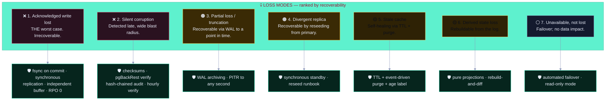

---

## 3. 🟣 Memory Tier Model

### 3.1 The Five Tiers

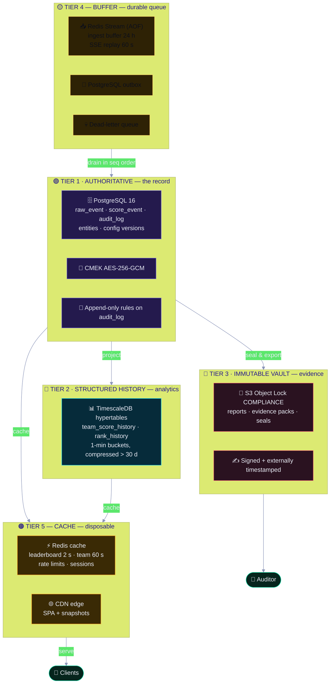

### 3.2 Tier Characteristics

| Tier | Technology | Durability | RPO | RTO | Backup | Rebuildable | Cost profile |
|:--|:--|:--|:-:|:--|:--|:-:|:--|
| 🟣 **1 Authoritative** | PostgreSQL 16 | `synchronous_commit=on`, `fsync`, synchronous standby | **0** | 30 min | pgBackRest full + continuous WAL | ⛔ Never | High |
| 🔵 **2 History** | TimescaleDB | Inherits T1; continuous, 30-day granularity | < 60 s | 2 h | Continuous + chunk snapshots | ✅ From T1 | Medium |
| 🔧 **3 Vault** | S3 Object Lock | COMPLIANCE mode; versioned; cross-region | **0** | 4 h | Cross-region replication, delete-protected | ⛔ Never | Low per GB |
| 🟡 **4 Buffer** | Redis 7 (AOF `everysec`) + outbox | AOF + 1-min snapshots; 24 h window | 0 within window | 30 min | Snapshot; replayable from T1/T3 | ✅ Mostly | Low |
| 🟠 **5 Cache** | Redis + CDN | None by design | n/a | 5 min | **None** — reconstructible | ✅ Always | Cheapest |

### 3.3 Why Five Tiers Rather Than One Database

| Pressure | If we used one tier | What the tier split buys |
|:--|:--|:--|
| 🧾 7-year audit retention with append-only guarantees | Every read contends with immutable history; the working set drowns | History lives in hypertables and WORM; the working set stays small |
| ⚡ Live-event write bursts | A single hot table with 200 teams × many solves per second creates lock pressure | Append-only insert pattern with no row updates in the log |
| 📊 Analytics over 7 years | Full-table scans would compete with live scoring | Read replica + compressed hypertables |
| 🧠 Cost | 7 years of hot storage is absurd | Cold tiers for anything older than 90 days |
| 🔒 Immutability | Deleting a 6-year-old row to save space would destroy evidence | Object Lock makes deletion structurally impossible |

> 📖 **A single "big database" is a coupling mistake.** The event log, the analytics history, the evidence vault, the queue, and the cache have fundamentally different access patterns, lifetimes, mutability, and compliance requirements. Putting them in one store means the strictest constraint — 7-year immutability — governs everything, including the 2-second cache read.

### 3.4 Store Allocation Map

| Store | Data | Type | Encryption | Retention | Backup |
|:--|:--|:--|:--|:--|:--|
| 🗄️ PostgreSQL 16 | Raw events, score events, teams, users, sessions | ACID relational | TDE + column AES-GCM for PII | Raw 24 mo · Score 7 yr | PITR + weekly full + WAL archive |
| 📊 TimescaleDB | Team score history (hypertable, 1-min buckets) | Time-series | At-rest + TLS | 7 yr (compressed after 30 d) | Continuous, 30-day granularity |
| ⚡ Redis 7 | Stream buffer, rate limits, session cache, locks | Ephemeral | TLS in transit only (no PII) | TTL ≤ 24 h | None (reconstructible) |
| 🗄️ S3 Object Lock | Reports, evidence, exports, audit seals | Immutable blob | SSE-KMS, CMK per class | Reports 90 d · Evidence 7 yr | Cross-region replication |
| 📥 Ingest buffer | Debounced webhook payloads | Queue | TLS | TTL 24 h | None |

---

## 4. 🔴 Durability Contract

> This is the most important section in the document. It states, per operation, exactly what is promised when the system acknowledges a write.

### 4.1 Acknowledgement Semantics

| Operation | Acknowledged when | Guarantee | Failure behaviour |
|:--|:--|:--|:--|
| 📨 Webhook accepted | Row committed **and** WAL fsynced on the primary **and** the synchronous standby has received it | 🔴 **Durable. RPO 0.** | `5xx` to the platform so it retries; never a false `2xx` |
| 📕 Event committed | Transaction committed with `synchronous_commit = on` | 🔴 Durable | Rollback; no partial state |
| 🧾 Audit record | Committed in the same transaction as the mutation | 🔴 Durable, or the mutation does not exist | Rollback both |
| 📮 Outbox row | Same transaction as the event | 🔴 Durable | Rollback both |
| 🧬 Merkle seal | Written to Object Lock and externally timestamped | 🔴 Durable, immutable, externally anchored | 🔴 Alert; the chain continues unanchored and is flagged |
| 📥 Buffered event | Appended to the Redis stream with AOF | 🟡 Durable within 24 h | Depth/age alert |
| ⚡ Cached value | Written to Redis/CDN | 🟠 Volatile, by contract | Never acknowledged to a user as durable |
| 📋 Report artefact | Written to S3 with checksum verification and signature | 🔴 Durable | Job fails; retry ≤ 3 then DLQ |

### 4.2 Durability Configuration (Normative)

```ini
# ── PostgreSQL: the authoritative tier ──────────────────────────────────────
synchronous_commit = on                # fsync before acknowledging. Non-negotiable.
synchronous_standby_names = 'standby_a, standby_b'   # RPO 0 depends on this.
wal_level = replica
archive_mode = on
archive_command = 'pgbackrest --stanza=sc3d archive-push %p'
max_wal_size = 8GB
min_wal_size = 2GB
checkpoint_timeout = 15min
checkpoint_completion_target = 0.9
full_page_writes = on                  # torn-page protection after a crash
data_checksums = on                   # silent-corruption detection
ssl = on
ssl_min_protocol_version = 'TLSv1.2'
password_encryption = scram-sha-256
row_security = on
shared_preload_libraries = 'pgaudit,pg_stat_statements,timescaledb'
default_transaction_isolation = 'read committed'

# ── Redis: buffer and cache, never the record ───────────────────────────────
appendonly yes
appendfsync everysec                 # buffer: at most 1 s of AOF loss, and
                                     # the platform retains 24 h for replay
maxmemory-policy noeviction           # never silently evict a buffered event
                                       # (caches use a separate instance)
```

> ⚠️ **`maxmemory-policy noeviction` on the buffer instance is a correctness decision.** The intuitive setting, `allkeys-lru`, will evict the oldest un-acknowledged webhook event under pressure — turning a capacity problem into permanent, unrecoverable data loss. Capacity alerts (§13) exist so that eviction is never *needed*.

### 4.3 The Three Durability Laws

| # | Law | Why it exists |
|:-:|:--|:--|
| 🟣 **DL-01** | **Never acknowledge what is not durable.** A `2xx` to the platform means the event is on disk on two independent nodes. | A false acknowledgement is worse than an outage, because the platform stops retrying. |
| 🟣 **DL-02** | **Never make the cache the record.** If a value is only in Redis, it is lost, and the system must be able to say so honestly. | A cache outage must degrade performance, never correctness. |
| 🟣 **DL-03** | **Never delete what you cannot rebuild, and never rebuild what you cannot verify.** Rebuildable state is cheap to discard; authoritative state is not, and a rebuild must be provably identical. | This is why the log is the log and the projections are disposable. |

### 4.4 Write Path End-to-End

```mermaid
%%{init: {"theme":"base","themeVariables":{"primaryColor":"#06D6A0","primaryTextColor":"#E8ECF8","primaryBorderColor":"#06D6A0","lineColor":"#8B95B8","fontFamily":"Inter, sans-serif"}}}%%
flowchart LR
    A["📨 Webhook"]:::s --> B["🕵️ Verify HMAC + skew"]:::s
    B --> C["✅ Schema validate"]:::s
    C --> D["📥 Append to Redis buffer<br/>AOF everysec"]:::b
    D --> E["🗄️ BEGIN<br/>INSERT raw_event (idempotent)<br/>INSERT audit_log<br/>INSERT outbox"]:::t
    E --> F["💾 COMMIT<br/>synchronous_commit=on<br/>WAL fsync"]:::f
    F --> G["🗄️ Synchronous standby<br/>receives WAL"]:::f
    G --> H["🆗 202 Accepted<br/>platform stops retrying"]:::ok
    E -.->|conflict| I["🟢 Duplicate → 200 no-op"]:::ok2
    E -.->|any failure| J["🔴 ROLLBACK<br/>no event, no audit, no outbox<br/>5xx so the platform retries"]:::bad
    H --> K["▶️ Projector drains outbox"]:::p
    K --> L["📊 Projections + delta"]:::p
    L --> M["✍️ Seal → WORM + TSA"]:::v
    classDef s fill:#062B3A,stroke:#00D2FF,color:#E8ECF8
    classDef b fill:#2E2205,stroke:#FFD166,color:#0B0E1A
    classDef t fill:#241A4D,stroke:#6C5CE7,color:#E8ECF8
    classDef f fill:#3A2A05,stroke:#FF9F1C,color:#E8ECF8
    classDef ok fill:#06251D,stroke:#06D6A0,color:#E8ECF8
    classDef ok2 fill:#06251D,stroke:#06D6A0,color:#E8ECF8
    classDef bad fill:#2A1220,stroke:#EF476F,color:#E8ECF8
    classDef p fill:#062B3A,stroke:#00D2FF,color:#E8ECF8
    classDef v fill:#2A1220,stroke:#EF476F,color:#E8ECF8
```

> 🧾 **Notice the rollback branch.** If the audit insert fails, the event insert rolls back with it, and the platform receives a `5xx` so it retries. This is the concrete meaning of "audited or not done" ([`security.md` SP-03](./security.md#3--security-principles)) at the storage layer.

### 4.5 Consistency Guarantees by Path

| Path | Consistency | Enforced by |
|:--|:--|:--|
| Score submission | 🟢 Strong (`SERIALIZABLE`, single writer) | Transaction isolation |
| Audit query | 🟢 Strong | Primary only; replicas rejected |
| Report generation | 🟠 Snapshot-consistent (`REPEATABLE READ`) | Dedicated read replica |
| Leaderboard read (spectator) | 🟠 Monotonic | `rank_history` assertion + cache |
| Leaderboard read (admin) | 🟡 Read-your-writes | Per-identity cache bypass, 30 s |
| Event state read | 🔴 Never stale | Falls through to the primary |
| Telemetry | 🔴 Best-effort | Never on the request path |

---

## 5. 🟣 Tier 1 — The Authoritative Event Log

### 5.1 Core Tables

| Table | Purpose | Mutability | Partitioning | Indexes |
|:--|:--|:--|:--|:--|
| `raw_event` | Ingested platform facts | 🟣 Insert only | Monthly by `recorded_at` | `(event_id, seq)` unique · `idempotency_key` unique · BRIN on `recorded_at` |
| `score_event` | Pure-function output with derivation | 🟣 Insert only | Quarterly by `occurred_at` | `(event_id, team_id, occurred_at)` · `source_seq` |
| `audit_log` | The security record | 🟣 Insert only (rules) | Monthly by `occurred_at` | `audit_id` unique · `prev_hash` · `action` · `actor_id` |
| `team`, `challenge`, `solve` | Business entities | 🟢 Versioned mutable | None (small) | `event_id` · natural keys |
| `event_state`, `freeze_window` | Live event control | 🟢 Versioned mutable | None | `event_id` unique |
| `score_adjustment` | Two-person adjustments | 🟢 Lifecycle | None | `event_id` · `status` |
| `outbox` | Projection work queue | 🟡 Append + drain | None | `seq` unique · `drained_at` |
| `session` | Server-side session authority | 🟢 TTL | None | `session_id` unique |
| `entitlement` | Roles and scopes | 🟢 Audited | None | `(principal, resource)` unique |
| `scoring_model`, `policy_bundle` | Versioned configuration | 🟣 Immutable rows | None | `(kind, version)` unique |

### 5.2 Log Table Design

```sql
-- The fact table. Append-only by convention AND by grants.
CREATE TABLE raw_event (
    id                BIGSERIAL PRIMARY KEY,
    event_id          UUID        NOT NULL,
    seq               BIGINT      NOT NULL,
    event_type        TEXT        NOT NULL,          -- closed vocabulary
    schema_version    SMALLINT    NOT NULL DEFAULT 3,
    occurred_at       TIMESTAMPTZ NOT NULL,          -- platform's clock
    recorded_at       TIMESTAMPTZ NOT NULL DEFAULT now(),
    ingest_latency_ms INTEGER     GENERATED ALWAYS AS
                      (EXTRACT(EPOCH FROM (recorded_at - occurred_at)) * 1000)::INT
                                    STORED,
    source_system     TEXT        NOT NULL,
    source_event_id   TEXT        NOT NULL,
    idempotency_key   TEXT        NOT NULL,
    payload           JSONB       NOT NULL,
    prev_hash         BYTEA,
    this_hash         BYTEA       NOT NULL,
    CONSTRAINT uq_event_seq      UNIQUE (event_id, seq),
    CONSTRAINT uq_idempotency    UNIQUE (idempotency_key)
) PARTITION BY RANGE (recorded_at);

CREATE INDEX ix_raw_event_type_time ON raw_event (event_type, occurred_at DESC);
CREATE INDEX ix_raw_event_payload  ON raw_event USING GIN (payload jsonb_path_ops);
-- BRIN on time for cheap scans over billions of rows:
CREATE INDEX ix_raw_event_brin      ON raw_event USING BRIN (recorded_at);
```

| Design choice | Rationale |
|:--|:--|
| 🟣 `idempotency_key` UNIQUE in the database | Application-level dedupe races across instances; a constraint cannot |
| 🟣 `seq` UNIQUE with `event_id` | Gap detection and ordering enforcement at the storage layer |
| 🔵 BRIN on the timestamp | A BRIN index on a monotonically increasing column is ~1 % the size of a B-tree and answers the "events since 19:00" question that dominates reporting |
| 🟡 `payload` JSONB with GIN | Schema evolution without a migration per field, while still indexable |
| 🟣 `ingest_latency_ms` as a generated column | A lag signal available in every query without application instrumentation |
| 🟡 `ingest_latency_ms` CHECK | A wildly negative value indicates clock drift; rejecting it early surfaces AL-17 |

### 5.3 Audit Immutability at the Storage Layer

```sql
-- The audit log is append-only for every role that is not the table owner.
CREATE RULE audit_log_no_update AS ON UPDATE TO audit_log DO INSTEAD NOTHING;
CREATE RULE audit_log_no_delete AS ON DELETE TO audit_log DO INSTEAD NOTHING;

REVOKE UPDATE, DELETE, TRUNCATE ON audit_log FROM app_rw, app_ro, ingest_ro,
                                              audit_ro, report_ro, seal_wo;
GRANT INSERT, SELECT ON audit_log TO app_rw;   -- write and read only

-- Facts are equally append-only. There is no legitimate UPDATE on raw_event.
REVOKE UPDATE, DELETE ON raw_event, score_event FROM app_rw, ingest_ro;

ALTER TABLE audit_log ENABLE ROW LEVEL SECURITY;
ALTER TABLE audit_log FORCE  ROW LEVEL SECURITY;   -- even the owner is subject
```

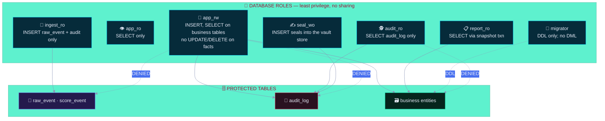

> 🔴 **A separate `seal_wo` role exists so that WORM writes are not performed by the application's own credentials.** If the application is compromised, the attacker inherits `app_rw` — which cannot write to the vault, cannot delete from the log, and cannot alter a seal. The blast radius of a full application compromise stops at "can append fraudulent events", which the hash chain and reconciliation will detect. That is a meaningful difference between a bad day and a catastrophic one.

### 5.4 Growth and Maintenance

| Operation | Tool | Cadence | Impact | Locking |
|:--|:--|:--|:--|:--|
| 🧹 Retention drop | `DROP PARTITION` (detached) | Per schedule | None | None — the partition is detached, then dropped |
| ♻️ Table rewrite | `pg_repack` (online) | Monthly on large tables | Low | Brief exclusive lock at swap |
| 📊 Statistics | `ANALYZE` | Nightly, plus auto | None | None |
| 🧬 Checksum verification | `pg_checksums --check` | Quarterly | Offline | Read-only scan |
| 🗜️ Vacuum | Autovacuum tuned per table | Continuous | Low | Row-level |
| 🔁 Full base backup | pgBackRest | Weekly | Low | `pg_backup_start` non-blocking |
| 📜 WAL archiving | Continuous | Continuous | None | — |

```sql
-- Detach-then-drop: the retention pattern that never locks a live table.
ALTER TABLE raw_event DETACH PARTITION raw_event_2026_09;
-- The partition is now an orphan table; query plans cannot see it and
-- no lock is held on the parent. Drop it hours or days later.
DROP TABLE raw_event_2026_09;
```

> 🟡 **Why detach-then-drop rather than `DELETE`:** a `DELETE` of millions of rows generates WAL proportional to the data, bloats the table, holds locks, and can leave the transaction long-running. Detaching is a metadata operation, effectively instantaneous, and gives a clean window to verify the tombstone count before destruction.

---

## 6. 🔵 Tier 2 — Time-Series History

### 6.1 Hypertable Design

| Hypertable | Grain | Source | Chunk | Compression | Retention |
|:--|:--|:--|:--|:--|:--|
| `team_score_history` | 1 minute per team | Projector | 7 days | After 30 d, 50× reduction | 7 years |
| `rank_history` | 1 minute per team | Projector | 7 days | After 30 d | 7 years |
| `event_throughput` | 1 minute global | Metrics | 1 day | After 7 d | 2 years |
| `sse_connections` | 1 minute | Metrics | 1 day | After 7 d | 90 days |

```sql
CREATE TABLE team_score_history (
    bucket       TIMESTAMPTZ NOT NULL,
    event_id     UUID        NOT NULL,
    team_id      UUID        NOT NULL,
    total_points INTEGER     NOT NULL,
    rank         SMALLINT    NOT NULL,
    solved_count SMALLINT    NOT NULL,
    source_seq   BIGINT      NOT NULL,
    PRIMARY KEY (bucket, event_id, team_id)
) WITH (timescaledb.hypertable_data, timescaledb.partition_column = 'bucket');

SELECT create_hypertable('team_score_history', 'bucket',
                         chunk_time_interval => INTERVAL '7 days',
                         migrate_data => TRUE);

ALTER TABLE team_score_history SET (
    timescaledb.compress,
    timescaledb.compress_segmentby = 'team_id',
    timescaledb.compress_orderby   = 'bucket DESC'
);
-- Compression is enabled per chunk after the retention threshold, not globally,
-- because recent data is queried at full resolution for live "last 15 minutes" views.
```

### 6.2 Why Buckets Are the Right Grain

| Grain | Effect |
|:--|:--|
| Per event | ~200 teams × many solves per second → tens of millions of rows per event; charts become slow and storage explodes |
| 1 second | 86 400 rows/team/day → still too fine for a leaderboard that animates over 900 ms |
| 🟢 **1 minute** | Matches how a human reads a leaderboard ("where were they an hour ago?") and bounds rows to 1 440/team/day |
| 1 hour | Loses every dramatic swing; a 3-point lead change becomes invisible |

> 🧾 **Compression is why 7-year history is affordable.** A 1-minute `team_score_history` for 2 000 teams over 7 years is roughly 2 billion rows — about 90 GB uncompressed and under 2 GB with segment-by compression. This is what turns "keep everything for 7 years" from a cost objection into a non-event.

### 6.3 Continuous Aggregates

| Aggregate | Purpose | Refresh policy |
|:--|:--|:--|
| `team_score_hourly` | Trend charts, event summaries | Refreshed hourly for the last 48 h; then finalised |
| `team_rank_daily` | Award calculations, historical rank | Refreshed daily; finalised after 30 d |
| `event_summary` | Report generation input | Refreshed per event; finalised on `event.ended` |

| Rule | Statement |
|:--|:--|
| 🟣 **TS-01** | A finalised aggregate is **immutable**. Corrections are applied by inserting a new row for the affected bucket with a superseding marker, never by updating. |
| 🟡 **TS-02** | An aggregate that has been used in a generated report is frozen permanently, even if the source is later corrected; the divergence is recorded in the audit log. |
| 🟡 **TS-03** | Continuous aggregates refresh only recent windows automatically. A full refresh of a finalised window is a manual, audited operation. |

---

## 7. 🔧 Tier 3 — Object Store & Immutable Vault

### 7.1 What Lives in the Vault

| Object class | Contents | Retention | Lock mode | Key |
|:--|:--|:--|:--|:--|
| 🧾 Audit seals | Signed Merkle roots, batch manifests | 7 years | 🔴 COMPLIANCE | `k-evidence` |
| 🧬 Evidence packs | Audit export + manifest + hashes + verification instructions | 7 years | 🔴 COMPLIANCE | `k-evidence` |
| 📋 Reports | Generated PDF/CSV artefacts | 90 days | 🟡 GOVERNANCE | `k-report` |
| 📸 Snapshots | `leaderboard_snapshot` JSON for CDN and resync | 24 h + current | ⬛ None | `k-cache` |
| 🧬 SBOM + provenance | SPDX/CycloneDX, SLSA predicate, cosign bundle | 7 years | 🔴 COMPLIANCE | `k-supply` |
| 💾 IaC state exports | Terraform state snapshots | Indefinite | 🔴 COMPLIANCE | `k-ops` |

### 7.2 Object Lock — What It Actually Guarantees

| Mode | Delete allowed? | Overwrite allowed? | Use for |
|:--|:--|:--|:--|
| ⬛ None | ✅ Yes | ✅ Yes | Cache snapshots, transient exports |
| 🟡 Governance | ❌ No | ❌ No | Reports: versioned, deletable after retention |
| 🔴 **Compliance** | ❌ **No, by anyone, including the account root, until the retention date** | ❌ No | Audit seals, evidence, SBOM, IaC state |

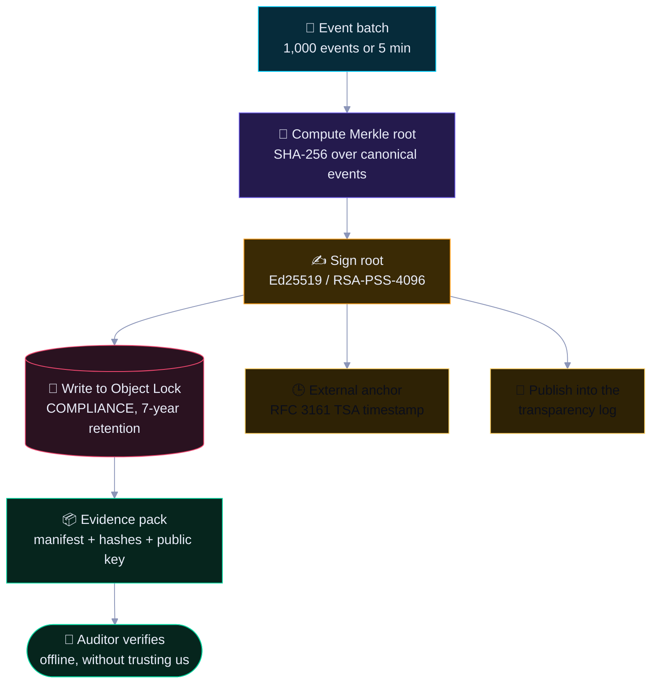

> 🔒 **COMPLIANCE mode is the reason the evidence is credible.** In GOVERNANCE mode a privileged principal can delete an object. In COMPLIANCE mode deletion is refused by the storage layer for the entire retention period — there is no bypass, no support ticket, and no root override. That converts "our logs cannot be deleted" from a policy claim into a technical property.

### 7.3 Vault Write Discipline

| Rule | Statement |
|:--|:--|
| 🟣 **VT-01** | A vault write uses the dedicated `seal_wo` identity, not the application credential. |
| 🟣 **VT-02** | Every object carries: content hash, size, class, retention date, retention mode, classification, and the signature. |
| 🟣 **VT-03** | Versioning is enabled on every bucket, and a write of an existing key creates a new version — it never replaces. |
| 🟡 **VT-04** | A vault write failure never blocks the event log. It raises a 🔴 alert and marks the chain `unanchored` for that interval, which is disclosed in the evidence pack. |
| 🟡 **VT-05** | Cross-region replication is enabled for every COMPLIANCE bucket; replication lag is monitored with an alert at 15 minutes. |
| 🟠 **VT-06** | A lifecycle rule may **expire** an object when its retention date passes; it may never delete one early. This is enforced by the lock, not by the rule. |

### 7.4 Honest Limitations of the Vault

| It does **not** prove | Why | Compensating measure |
|:--|:--|:--|
| That the sealed events were truthful when written | A compromised application can append a false event and seal it | Signed provenance of the build; reconciliation against the platform; SoD on manual actions |
| That the sealing service itself was honest | A compromised signer could seal a lie | External anchoring raises the bar; the public key is distributed for offline verification |
| That nothing was deleted **before** sealing | The window between append and seal is short but non-zero | Hourly chain verification detects gaps in the unanchored interval |
| Availability | An immutable store is not a fast store | Reads are served from Tier 1/2; the vault is for evidence |

## 8. 🟡 Tier 4 — Buffer & Cache (Redis)

> Two Redis instances with **deliberately different policies**. Conflating them is how a cache eviction becomes a data-loss incident.

### 8.1 Instance Separation

| Instance | Purpose | Persistence | Eviction policy | Losing it means |
|:--|:--|:--|:--|:--|
| ⚡ **cache** | Leaderboard, team, event state cache; rate limits; session cache | AOF `everysec` + RDB | `allkeys-lru` — eviction is expected and harmless | Slower reads; a cache stampede |
| 📥 **buffer** | Ingest buffer (24 h); SSE replay (60 s); in-flight locks | AOF `everysec` + 1-min snapshots | 🔴 `noeviction` — eviction is **forbidden** | Buffered events must be replayed from the platform or the log |

### 8.2 Ingest Buffer Design

| Property | Implementation | Rationale |
|:--|:--|:--|
| 🟣 Ordering | One Redis Stream per `eventId`, with `seq`-keyed entries | A replay must apply in `seq` order |
| 🟣 Bounded window | `MAXLEN` ≈ capacity of 24 h at peak rate | Bounded memory, and a known replay horizon |
| 🟣 Durability | AOF `appendfsync everysec` + hourly RDB snapshot | At most 1 s of AOF loss; the platform retains 24 h for replay |
| 🟣 No eviction | `maxmemory-policy noeviction` | An evicted event is permanent loss |
| 🟡 Visibility | Depth, oldest age, and drain rate exported as metrics | The alert exists so eviction is never needed |
| 🟡 Replay | `XRANGE` from the last applied `seq` on recovery | Deterministic, ordered, idempotent |
| 🟠 DLQ | Poison events diverted to a PostgreSQL DLQ with an owner | Nothing is dropped silently |

```text
buffer stream key:  ingest:{eventId}
entry fields:       seq · eventType · schemaVersion · occurredAt · payload · source

drain loop:
  1. XREADGROUP as consumer {projection-worker}
  2. for each entry with seq == lastApplied + 1:
       BEGIN
         INSERT raw_event ON CONFLICT DO NOTHING
         INSERT audit_log
         INSERT outbox
       COMMIT
       lastApplied = seq
  3. if a gap persists > 5 min → resync from snapshot, AL-03
  4. on a schema or constraint error → DLQ, alert, lastApplied unchanged
```

### 8.3 SSE Replay Buffer

| Property | Implementation | Rationale |
|:--|:--|:--|
| Window | 60 seconds of frames | Covers a typical reconnect; beyond that a resync is cheaper |
| Key | `sse:{eventId}` stream, entries keyed by `seq` | Resume with `Last-Event-ID` |
| Shedding | Per-client coalescing: a slow client receives fewer deltas | One slow client must never block the projector |
| Auth expiry | Stream closed with reason `420` | The client re-auths, then resyncs |
| Heartbeat | `:heartbeat` comment every 15 s | Prevents proxy idle-timeout |

### 8.4 Cache Discipline

| Rule | Statement |
|:--|:--|
| 🟡 **CH-01** | The cache is **never** consulted for authorisation, for a mutation's pre-state, or for evidence. |
| 🟡 **CH-02** | `event/state` is never served from cache. If Redis is unavailable, the read goes to PostgreSQL. |
| 🟣 **CH-03** | A stale cached value is served only with an explicit age indicator, and only within its documented `stale-while-revalidate` window. |
| 🟡 **CH-04** | Cache keys are built by a typed builder with allow-listed prefixes. User input never shapes a key namespace. |
| 🟡 **CH-05** | A cache stampede is prevented with a short-lived distributed lock plus jittered TTLs, so a purge does not produce a thundering herd against the primary. |
| 🟠 **CH-06** | Metric labels and cache values never contain personal data. |

---

## 9. 🟢 Backup & Restore Engineering

### 9.1 Backup Matrix

| Artefact | Method | Frequency | Encryption | Restore test | Retention |
|:--|:--|:--|:--|:--|:--|
| 🗄️ PostgreSQL | `pgBackRest` full + WAL archiving | Continuous WAL; weekly full | AES-256, KMS | 🟢 Quarterly, timed | 35 d hot · 12 mo archive |
| 📊 TimescaleDB | Inherits the PostgreSQL backup; chunk-level snapshot | Continuous | Same | 🟢 Quarterly | 7 yr (via base + WAL) |
| ⚡ Redis buffer | AOF + RDB snapshots | Continuous + hourly | TLS + at rest | 🟢 Quarterly | 7 d |
| 🗄️ S3 objects | Cross-region replication + versioning | Continuous | SSE-CMK | 🟢 Quarterly | 7 yr for evidence |
| 🧾 Audit WORM | Object Lock COMPLIANCE | Per seal (≤ 5 min) | SSE-CMK | 🟢 Quarterly | 7 yr |
| ⚙️ IaC state | Remote backend, versioned | Per apply | SSE-CMK | 🟢 Quarterly | Indefinite |
| 🔧 Container images | Registry replication | Per build | Registry encryption | 🟢 Quarterly | 90 d |
| 📋 Configuration | Git, signed, immutable history | Per commit | Repo encryption | 🟢 Quarterly | Indefinite |
| 🔑 Vault data | Raft snapshot, sealed | Daily | Wrapped by unseal keys | 🟢 Semi-annual | 3 yr |
| 🧬 Key material | HSM-wrapped export only | On rotation | HSM wrap | 🟢 Annually | Life of key + 1 yr |

### 9.2 Backup Security Controls

| Control | Implementation |
|:--|:--|
| 🔒 Backup immutability | Cross-region copy-on-write; separate credentials; delete-protection enabled on the backup bucket |
| 🔒 Restore authorisation | `security_admin` + two-person approval + a change window ([`security.md` §18](./security.md#18--incident-response--runbooks)) |
| 🔑 Restore encryption | Backups decrypt only into a memory-backed tmpfs, never to disk |
| 📝 Restore logging | Every restore is audited as a `critical_system_operation` |
| 🧪 Test discipline | Quarterly **timed** restore proving RTO *and* RPO; a failure is a 🔴 finding, not a ticket |
| 🚫 No silent corruption | `pgBackRest verify` after every backup; checksum validation on restore |
| 🧾 Chain preservation | A restored audit chain is re-verified and re-sealed before the system returns to service |

### 9.3 Restore Procedure (Timed, Quarterly)

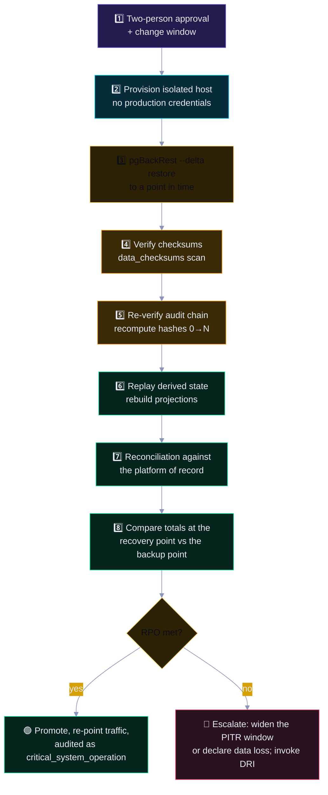

| Step | Timed target | Evidence produced |
|:-:|:--|:--|
| Provision an isolated host | 10 min | Host ID, image digest, network zone |
| Restore to PITR | 25 min | Restore log, chosen WAL segment, recovery point timestamp |
| Checksum verification | 10 min | `data_checksums` report |
| Chain re-verification | 20 min | Recomputed root at the recovery point, matched to the last seal |
| Projection rebuild | 30 min | Rebuild-and-diff report, zero divergence |
| Platform reconciliation | 20 min | Totals comparison at the recovery point |
| Promotion | 15 min | `critical_system_operation` audit record |

> 🧾 **A restore is not complete when the service answers.** A restore is complete when the audit chain re-verifies **and** the rebuilt projection matches the platform. A database that starts cleanly but whose chain does not verify is a corrupted restore, and it is worse than an outage because it is silently wrong.

---

## 10. 🟡 Retention & Lifecycle Automation

### 10.1 Retention Schedule

| Data | Hot | Warm | Archive (WORM) | Total | Authority | Legal hold |
|:--|:--|:--|:--|:--|:--|:--|
| 🧾 Audit log | 90 d (PostgreSQL) | 13 mo (search index) | 🔴 **7 years** | 7 yr | ISO A.5.33, A.8.15; SOX-style 7 yr | ✅ Overridable |
| 🏆 Score events | 90 d | 24 mo | 🔴 7 years | 7 yr | Dispute window + audit | ✅ |
| 📨 Raw webhook events | 30 d | 12 mo | 24 mo | 2 yr | A.5.33 | ✅ |
| 📋 Generated reports | 90 d (S3) | — | — | 90 d | A.5.33 | ✅ On request |
| 🧬 Evidence artefacts | 30 d | 12 mo | 🔴 7 years | 7 yr | A.5.33, A.5.28 | ✅ |
| 🔑 Merkle seals | 7 d | 90 d | 🔴 7 years | 7 yr | Chain verification | ✅ |
| 👤 User accounts & sessions | 13 mo | — | 24 mo | 2 yr | A.8.15, GDPR storage limitation | ✅ |
| 👥 Team member PII | Event end + 30 d | 90 d | — | **~5 mo** | 🔴 GDPR Art. 5(1)(e) minimisation | ✅ |
| 📈 Telemetry (no PII) | 30 d | 12 mo | 24 mo | 2 yr | A.8.16 | ❌ |
| 📈 Client RUM (pseudonymous) | 14 d | 90 d | — | 3 mo | Data minimisation | ❌ |
| 🗄️ Backups | 35 d | — | 12 mo | 1 yr | A.8.13 | ✅ Propagated |
| 🔑 Vault snapshots | 30 d | 12 mo | 3 yr | 3 yr | A.8.13 | ✅ |

> 🔴 **The PII row is the one that will be audited.** Team member email addresses are deleted approximately five months after the event — not "indefinitely". Retention is a **data-minimisation control**, not merely a storage-cost decision.

### 10.2 Lifecycle Automation

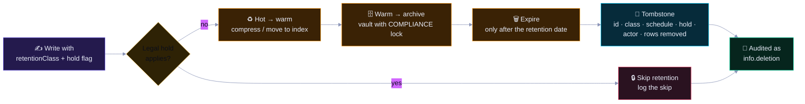

### 10.3 Deletion Is an Evidenced Operation

```jsonc
// Tombstone record — the proof that a deletion actually happened
{
  "tombstoneId": "tmb_2026_10_004417",
  "recordType": "team_member",
  "recordIds": ["usr_9f2a41", "usr_77c0de"],
  "eventId": "evt_2026_ctf_final",
  "classification": "confidential",
  "scheduleApplied": "pii_event_end_plus_30d_then_90d",
  "legalHold": false,
  "holdRef": null,
  "actor": { "type": "system", "id": "svc:retention-worker" },
  "rowsRemoved": 2,
  "objectsRemoved": 0,
  "indexesUpdated": ["opensearch:audit", "opensearch:teams"],
  "cascades": ["sessions:3", "entitlements:2"],
  "startedAt": "2027-04-02T03:00:00.114Z",
  "completedAt": "2027-04-02T03:00:04.882Z",
  "verified": true,
  "auditId": 41882273
}
```

| Requirement | Statement |
|:--|:--|
| 🟣 **RT-01** | Every deletion emits a tombstone containing the identifiers, the schedule applied, the hold status, the actor, and the counts. |
| 🟣 **RT-02** | Deletion is **idempotent**; a re-run finds nothing and records zero counts rather than failing. |
| 🟣 **RT-03** | Deletion is **ordered**: child records before parents, and every cascade is enumerated in the tombstone. |
| 🟡 **RT-04** | A dry-run mode reports the exact deletion set for approval before the destructive pass. |
| 🟡 **RT-05** | A hold suppresses deletion and only deletion. It never suppresses an auditor's lawful read. |
| 🔴 **RT-06** | If the retention worker is silent for more than 26 hours, AL-S03 fires. A silently stopped retention worker is a compliance breach in slow motion. |

### 10.4 Backup Retention — No Resurrection

| Tier | Age | Contains deleted data? | Control |
|:--|:--|:--|:--|
| Hot | 0–35 d | Yes, necessarily | Restore re-applies expiry immediately |
| Archive | 35 d–12 mo | Possibly | A tombstone ledger is replayed at restore, so deleted PII does not reappear |
| Expired | > 12 mo | No | Deleted |

```sql
-- Applied at restore time, before the database is opened to the application.
-- A restore must never resurrect data that was lawfully deleted.
CREATE TEMP TABLE restore_tombstones (...);
INSERT INTO restore_tombstones SELECT * FROM tombstone_ledger WHERE applied_at > now() - INTERVAL '400 days';
-- Then: DELETE FROM team_member WHERE id IN (SELECT record_id FROM restore_tombstones WHERE record_type = 'team_member');
-- The restore report lists every tombstone replayed, for the auditor.
```

---

## 11. 🟠 Legal Hold & Data-Subject Requests

### 11.1 Legal Hold

| Aspect | Design |
|:--|:--|
| 🟣 Scope | Per record, per record-type, or per event — never "everything" by default |
| 🟣 Authority | Only the DPO or Legal may place or release a hold; the request is recorded with a case reference |
| 🟣 Effect | The retention worker skips held records and logs the skip; a skipped record surfaces in a "held and ageing" report |
| 🟣 Interaction with PII | A hold **prevents deletion** of personal data, and the Art. 17(3)(e) legal-obligation exemption is recorded on the DSAR response |
| 🟡 Duration | Reviewed every 90 days; a hold without an active case reference is released |
| 🟡 Visibility | A 🔴 alert fires if held data exceeds 7 years, since Object Lock will then delete it and the hold must be re-based in the archive |

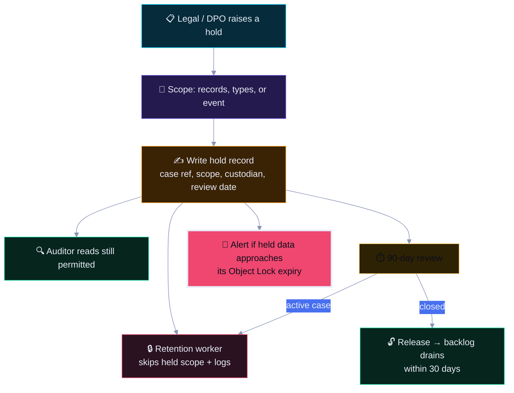

### 11.2 Data-Subject Request Coverage

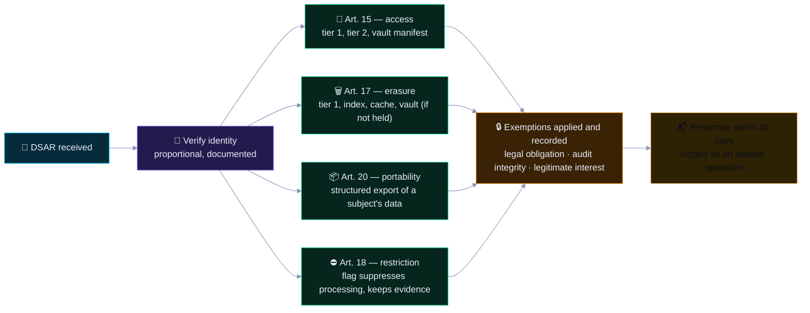

| Article | Operation | Audit-preservation answer | Verification |
|:--|:--|:--|:--|
| Art. 15 | Access | Audit records are disclosed in pseudonymised form; the actor identity and `before`/`after` are provided, while origin IP stays truncated | `T-DATA-08` |
| Art. 17 | Erasure | Score history and audit records are **retained** under the legal-obligation exemption; PII columns are cryptographically erased and a tombstone is written | `T-DATA-08` |
| Art. 18 | Restriction | A `restricted` flag suppresses projection and reporting for the subject while preserving the record | `T-DATA-08` |
| Art. 20 | Portability | A structured export of the subject's data, excluding other teams' and other subjects' data | `T-DATA-08` |
| Art. 15(1)(g) | **Right to the audit trail** | Because the leaderboard is a published record of competition results, the `raw_event` and `score_event` log is disclosed as the *reconciliation* basis, with personal data minimised | `T-DATA-04` |

> 🧾 **The honest position on Art. 17.** A CTF leaderboard is a record of competition results. Erasing a participant's identity entirely would falsify the record of who competed, so the system applies the Art. 17(3)(e) exemption for the parts that constitute evidence and **cryptographically erases** the personal data that is not required — the email, the full IP, the raw user agent. That is a defensible, documented position; silently ignoring the request is not.

---

## 12. 🟠 Recovery, Failover & Disaster Recovery

### 12.1 Recovery Objectives

| Service | RTO | RPO | Method | Tier |
|:--|:--:|:--:|:--|:--|
| 🌐 Public board (static) | 5 min | 0 | CDN re-origin; the SPA is immutable | 5 |
| ⚙️ API | 15 min | < 60 s | Multi-AZ replicas; automated restart | 1 |
| 📥 Ingest | 30 min | **0** | Redis buffer, 24 h; platform webhook replay | 4 |
| 🗄️ PostgreSQL | 30 min | < 60 s | Synchronous standby | 1 |
| 📊 Read models | 2 h | < 5 min | Replay from the event store | 2 |
| 🧾 Audit log | 1 h | **0** | WORM replication + database replication | 3 |
| 📋 Reports | 4 h | 0 (regenerable) | Regenerate from the event store | 3 |
| 🧬 Evidence vault | 4 h | **0** | Cross-region Object Lock replication | 3 |

> 🔴 **RPO 0 for ingestion and the audit log is a design requirement, not an aspiration.** Score events, audit events, and evidence are replicated synchronously and sealed to WORM storage in a second region. **A database restore from backup is a last resort — normal recovery is failover.**

### 12.2 Recovery Priority Order

Recovery priority is agreed explicitly with event operations, because a live CTF has a hard deadline that general IT does not.

| Priority | Service | Rationale |
|:-:|:--|:--|
| 🥇 1 | 📥 Public 3D board | The product's purpose; the reason the event exists |
| 🥈 2 | 📨 Webhook ingestion | Loss here is **irreversible** — the platform may not resend |
| 🥉 3 | ⚙️ Admin / referee control | Needed for corrections and freeze management |
| 4️⃣ 4 | 📊 Leaderboard read models | Rebuildable by replay |
| 5️⃣ 5 | 📋 Reporting and exports | Time-flexible; regenerable later |
| 6️⃣ 6 | 🧾 Compliance evidence collection | Can resume after the event |

> ⚠️ **Ingestion is the true recovery priority, not the admin console.** A 30-minute admin outage is an inconvenience. A 30-minute ingestion outage during a live event is potentially unrecoverable data loss. Generic IT prioritisation gets this wrong, so it is written down and rehearsed.

### 12.3 Failover Architecture

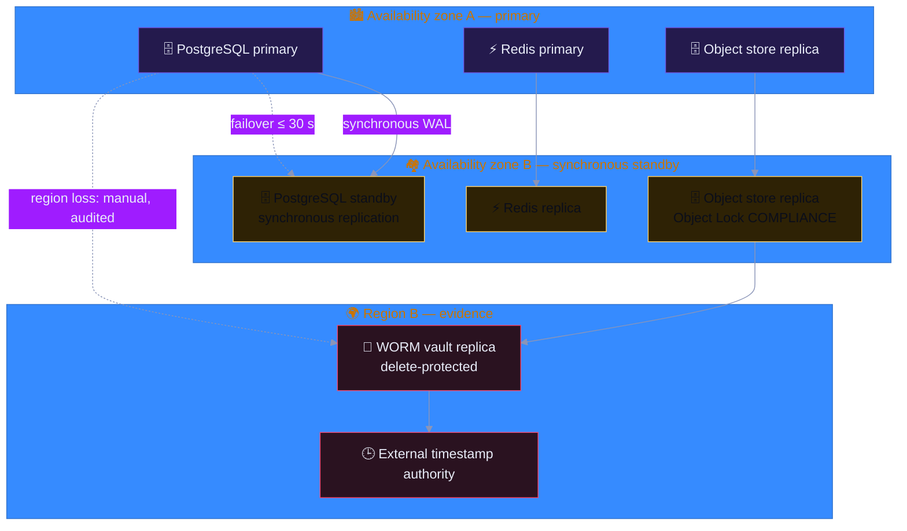

| Failure | Automatic? | Target | Data impact |
|:--|:--:|:--:|:--|
| 🔧 API replica crash | ✅ Yes | < 60 s | None |
| 🗄️ Primary database failure | ✅ Automatic failover to the synchronous standby | ≤ 30 s | **None** (RPO 0) |
| ⚡ Redis node failure | ✅ Cluster resharding | < 30 s | Up to 1 s of buffer AOF; platform replay covers it |
| 🗄️ Standby failure | ✅ Automatic promotion to the tertiary | < 60 s | None, but the RPO-0 guarantee is degraded until resynced — 🔴 alert |
| 🌍 Region loss | ❌ Manual, two-person, audited | ≤ 4 h | None (RPO 0 via cross-region vault) |
| 💀 Corruption detected in the primary | ❌ Manual PITR to an isolated host | ≤ 2 h | Bounded by the WAL archive; reconstruction from the log |

### 12.4 Business Continuity

| Element | Requirement |
|:--|:--|
| 📋 Continuity plan | Reviewed semi-annually; aligned with [`architecture.md` §19.4](./architecture.md#194-business-continuity-iso-a529-a530) |
| 🧑‍💻 Roles | Named primary and deputy for every on-call role; no single point of knowledge |
| 🗄️ Warm standby | A warm standby in a second region, powered on quarterly |
| 📡 Alternate communications | Out-of-band channel for P1 paging, tested monthly |
| 📦 Critical vendor dependencies | Documented fallback for the CDN, the WAF provider, and the CTF platform |
| 🧪 Rehearsal | Full DR rehearsal quarterly; measured against RTO and RPO; failures are 🔴 findings |

---

## 13. 🔵 Capacity & Growth Model

### 13.1 Volume Model

| Dimension | Per-team | Per-event (2 000 teams) | 3-year total | Driver |
|:--|--:|--:|--:|:--|
| `raw_event` rows | — | ~120 000 | 120 M | Solves, challenges, teams, phases |
| `raw_event` bytes | — | ~600 MB | 600 GB | Payload JSONB + indexes |
| `score_event` rows | — | ~200 000 | 200 M | Every scored event, including recomputations |
| `score_event` bytes | — | ~1.2 GB | 1.2 TB | `derivation` JSON is the bulk |
| `audit_log` rows | — | ~300 000 | 300 M | Every action, including denials |
| `audit_log` bytes | — | ~2.4 GB | 2.4 TB | Full context per record |
| `team_score_history` rows | 1 440/min-window | — | ~2.0 B | 1-min buckets, compressed |
| `team_score_history` bytes | — | — | ~90 GB → **< 2 GB compressed** | Segment-by `team_id` |
| Vault objects (seals) | — | ~30 000 | 90 000 | Seals, evidence packs, artefacts |
| S3 artefact bytes | — | ~2 GB | 6 GB | Reports, evidence packs |
| SSE frames | — | ~5 M/min at peak | — | Not stored beyond 60 s |
| Backup size (full) | — | — | ~450 GB | pgBackRest compressed |
| WAL archive | — | — | ~1.8 TB/year | Continuous |

### 13.2 Storage Budget

| Tier | 1 year | 3 years | Mechanism to stay inside it |
|:--|--:|--:|:--|
| 🟣 PostgreSQL hot | ~1.4 TB | ~4.2 TB | Monthly partition detach at 24 mo (raw) and quarterly for scores |
| 📊 TimescaleDB | ~40 GB | ~90 GB | Compression after 30 d |
| 🔧 Vault (evidence) | ~2 GB | ~6 GB | 7-year COMPLIANCE lock; reports expire at 90 d |
| ⚡ Redis | ~4 GB | ~4 GB | Bounded streams; `noeviction` on the buffer |
| 🗄️ Backups | ~6 TB | ~18 TB | 35 d hot, 12 mo archive, then expiry |
| **Total** | **~1.45 TB** | **~4.3 TB** | — |

### 13.3 Scaling Triggers

| Signal | Threshold | Action |
|:--|:--|:--|
| 🟡 Watchlist queries | p95 > 80 ms sustained 15 min | Add read replicas; review indexes |
| 🟡 Projection lag | > 5 s sustained | Scale projector replicas; partition hot tables |
| 🟠 DB CPU | > 70 % sustained | Add a read replica; move reporting off the primary |
| 🟠 DB connections | > 70 % of `max_connections` | Add PgBouncer; audit connection pooling |
| 🔴 Write latency | p99 > 250 ms during a live event | Investigate locks and vacuum; consider sharding by `event_id` |
| 🟡 Storage | > 75 % of provisioned | Extend volume; verify the detach-then-drop job is running |
| 🔴 Ingest buffer | > 80 % of 24 h capacity | Scale the platform connection; investigate upstream lag |
| 🟡 Concurrent events | > 25 k spectators | Re-evaluate the CDN and WebGL strategy (ADR-008 trigger) |

### 13.4 Partitioning Strategy

| Table | Key | Rationale |
|:--|:--|:--|
| `raw_event` | RANGE on `recorded_at`, monthly | Retention detach is a metadata operation |
| `score_event` | RANGE on `occurred_at`, quarterly | Larger chunks; lower partition count |
| `audit_log` | RANGE on `occurred_at`, monthly | Retention plus parallel-friendly verification |
| `team_score_history` | TimescaleDB, 7-day chunks | Native compression and retention policies |
| `rank_history` | TimescaleDB, 7-day chunks | Same |
| `session` | RANGE on `expires_at`, daily | `DROP PARTITION` is how expired sessions are purged |

> 🧾 **Retention and performance are the same mechanism here.** Monthly partition detach on `raw_event` is simultaneously the deletion mechanism and the performance mechanism: queries automatically avoid 24-month-old data without any predicate, and a purge never rewrites a table.

---

## 14. 🔵 Memory Observability

### 14.1 Storage Metrics

| Metric | Type | Target | Alert |
|:--|:--|:--:|:--|
| `db_commit_latency_seconds` | Histogram | p99 < 0.25 s | 🔴 > 1 s during a live event |
| `db_replication_lag_seconds` | Gauge | < 1 s | 🔴 > 10 s (RPO-0 guarantee at risk) |
| `db_deadlocks_total` | Counter | ~0 | 🟡 sustained growth |
| `db_replica_lag_seconds` | Gauge | < 5 s | 🟠 > 30 s |
| `wal_archive_lag_seconds` | Gauge | < 60 s | 🔴 > 900 s (PITR window shrinking) |
| `backup_last_success_timestamp` | Gauge | < 24 h | 🔴 AL-20 |
| `backup_verify_failures_total` | Counter | 0 | 🔴 any failure |
| `timescale_compression_ratio` | Gauge | > 30× on compressed chunks | 🟡 below 20× |
| `db_disk_used_ratio` | Gauge | < 75 % | 🟠 > 85 % |
| `object_store_put_failures_total` | Counter | 0 | 🔴 any failure in a seal window |
| `vault_replication_lag_seconds` | Gauge | < 300 s | 🟠 > 900 s |
| `vault_expiry_30d_total` | Counter | Informational | Planning signal |
| `redis_buffer_depth` | Gauge | < 10 000 | 🟠 > 80 % of 24 h capacity |
| `redis_buffer_oldest_age_seconds` | Gauge | < 60 s | 🔴 > 600 s |
| `redis_evictions_total{instance}` | Counter | 0 on the buffer | 🔴 any buffer eviction (AL-16 class) |
| `cache_hit_ratio` | Gauge | > 0.90 | 🟡 < 0.75 |
| `restore_test_last_timestamp` | Gauge | < 100 days | 🔴 overdue |
| `tombstone_last_run_timestamp` | Gauge | < 26 h | 🔴 AL-S03 |

### 14.2 Integrity Metrics

| Metric | Target | Meaning |
|:--|:--|:--|
| `audit_chain_break_total` | **0** | Any non-zero value is a P1 |
| `data_checksums_failures_total` | **0** | Silent corruption detected |
| `reconciliation_mismatch_total` | **0** | Served state diverged from the log |
| `seal_lag_events` | < 1 000 | Events since the last seal |
| `seal_anchor_failures_total` | **0** | A root was not externally timestamped |
| `rebuild_divergence_rows` | **0** | Rows differing after a rebuild |
| `restore_chain_verified` | `true` | The last restore's chain re-verified |
| `event_log_oldest_unsealed_at` | < 10 min | Oldest event not yet in a sealed checkpoint |

### 14.3 Storage Health View

```mermaid
%%{init: {"theme":"base","themeVariables":{"primaryColor":"#00D2FF","primaryTextColor":"#E8ECF8","primaryBorderColor":"#00D2FF","lineColor":"#8B95B8","fontFamily":"Inter, sans-serif"}}}%%
flowchart TB
    subgraph LIVE["🔴 LIVE EVENT STORAGE PANEL"]
        S1["💾 Commit latency p99<br/>+ transaction rate"]:::a
        S2["🔁 Replication lag<br/>RPO-0 guarantee indicator"]:::a
        S3["📥 Buffer depth + age"]:::a
        S4["⏱️ Oldest unsealed event"]:::a
        S5["🧾 Chain status<br/>last verification + result"]:::a
        S6["🗄️ Disk + connection saturation"]:::a
    end
    subgraph MGMT["🟣 MEMORY GOVERNANCE PANEL — monthly"]
        M1["🧾 Last backup + verify result"]:::b
        M2["🧪 Last restore drill + RTO/RPO achieved"]:::b
        M3["🗑️ Retention job + tombstone counts"]:::b
        M4["🔒 Legal holds + ageing"]:::b
        M5["📈 Growth vs capacity plan"]:::b
        M6["🗄️ Vault objects + expiry forecast"]:::b
    end
    S1 & S2 & S3 & S4 & S5 & S6 --> OP(["🧑‍💼 On-call / data lead"]):::op
    M1 & M2 & M3 & M4 & M5 & M6 --> GV(["🛡️ Governance review"]):::gv
    classDef a fill:#2A1220,stroke:#EF476F,color:#E8ECF8
    classDef b fill:#241A4D,stroke:#6C5CE7,color:#E8ECF8
    classDef op fill:#06251D,stroke:#06D6A0,color:#E8ECF8
    classDef gv fill:#2E2205,stroke:#FFD166,color:#0B0E1A
```

---

## 15. 🔴 Memory Failure Modes & Runbooks

### 15.1 Failure Mode Catalogue

| ID | Failure | Blast radius | Detection | Immediate action | Data risk |
|:--|:--|:--|:--|:--|:--|
| MF-01 | 🔴 Primary database loss | Tier 1 unavailable | Replication lag spike, health checks | Automatic failover to the synchronous standby | 🟢 None (RPO 0) |
| MF-02 | 🔴 Standby loss during live scoring | RPO-0 guarantee degraded | Replication lag alert | Page; resync from a base backup; alert on the degraded guarantee | 🟡 Window widens to backup interval until resynced |
| MF-03 | 🔴 Silent data corruption | Unknown until detected | `data_checksums`, chain verify | Restore from PITR to an isolated host; re-verify the chain | 🟠 Bounded by the WAL archive |
| MF-04 | 🔴 Redis buffer eviction under pressure | Buffered events lost | `redis_evictions_total{buffer} > 0` | Scale memory; replay from the platform; treat as a P1 if events are unrecoverable | 🔴 Potentially permanent |
| MF-05 | 🟠 WAL archive stall | PITR window shrinking | `wal_archive_lag_seconds` | Fix the archive command; if unrecoverable, take an immediate base backup | 🟠 Loss of PITR granularity |
| MF-06 | 🟠 Backup verification failure | Restore capability unproven | `backup_verify_failures_total` | Re-run; take a fresh full backup; investigate storage | 🟡 Recovery confidence lost |
| MF-07 | 🟠 Object store seal failure | Chain unanchored in a window | `seal_anchor_failures_total` | Retry; the interval is disclosed as unanchored in the evidence pack | 🟡 Weakened evidence |
| MF-08 | 🟠 Retention worker stalls | Deletion obligations missed | AL-S03 | Restart; run a catch-up pass; audit the delay | 🟠 Compliance exposure |
| MF-09 | 🟠 Vault replication lag | Second-region evidence stale | `vault_replication_lag_seconds` | Investigate; a region loss would exceed the 4 h evidence RTO | 🟠 DR exposure |
| MF-10 | 🟡 Cache stampede | Primary overload | `cache_hit_ratio` collapse, DB latency | Enable jittered TTLs and a request coalescer | 🟢 None |
| MF-11 | 🟡 Disk exhaustion on the primary | Writes rejected | `db_disk_used_ratio` | Detach partitions; extend the volume; `noeviction` protects the buffer meanwhile | 🟡 Write outage if unhandled |
| MF-12 | 🟡 Clock drift | Decay inputs change; chain ordering suspect | AL-17 | Halt manual audit appends; fix chrony; re-verify ordering | 🟡 Determinism risk |
| MF-13 | 🟡 Restore produces a valid database with a broken chain | Silent corruption after recovery | Chain re-verification step 5 | **Do not promote.** Widen the PITR window; escalate to DRI | 🔴 If promoted, evidence is lost |

### 15.2 Memory Runbooks

| ID | Runbook | Sev | Owner | First three actions |
|:--|:--|:-:|:--|:--|
| `RB-M01` | Database restore from PITR | 🔴 P1 | Data | Two-person approval → restore to an isolated host → re-verify the audit chain |
| `RB-M02` | Region loss failover | 🔴 P1 | Platform | Promote the warm standby → re-point the object store → verify chain continuity → reconcile |
| `RB-M03` | Acknowledged-write loss (unrecoverable) | 🔴 P1 | Data + Security | Freeze the event → preserve all evidence → request a full platform replay → declare data loss formally |
| `RB-M04` | Redis buffer eviction incident | 🔴 P1 | Backend | Stop ingestion pressure → replay from the platform within 24 h → reconcile totals → review capacity |
| `RB-M05` | Audit chain break | 🔴 P1 | Security | Freeze admin writes → snapshot the chain → identify the divergence window → preserve evidence |
| `RB-M06` | Backup failure or unverified restore | 🟠 P2 | Data | Re-run the backup → verify → take a manual full backup → reschedule the drill |
| `RB-M07` | Retention worker stall | 🟠 P2 | Data | Restart the worker → run a dry-run → execute the catch-up pass → report the delay to the DPO |
| `RB-M08` | Vault / Object Lock expiry planning | 🟡 P3 | GRC | Forecast the next 90 days of expiries → re-base any legal hold → confirm evidence-pack completeness |
| `RB-M09` | Key material loss | 🔴 P1 | Security | Verify the HSM-wrapped backup → restore the key → re-issue dependent data keys → re-encrypt the affected data |
| `RB-M10` | Ingest backlog replay | 🟠 P2 | Backend | Drain the buffer in `seq` order → verify no duplicate application → reconcile totals → unseal |

### 15.3 Rejected Anti-Patterns

| Anti-pattern | Why it is rejected |
|:--|:--|
| ❌ Treating Redis as the record of ingested events | An eviction becomes permanent, unrecoverable loss |
| ❌ `maxmemory-policy allkeys-lru` on the buffer instance | Converts a capacity problem into silent data loss |
| ❌ `synchronous_commit = off` for throughput | Acknowledges writes that a crash can erase; violates DL-01 |
| ❌ `DELETE` for retention instead of partition detach | Rewrites tables, bloats, holds locks, generates WAL |
| ❌ A backup that has never been restored | Unproven capability is not capability |
| ❌ Restoring directly into production | A bad restore is then indistinguishable from a live incident |
| ❌ Reusing a retention-deleted primary key | Breaks idempotency semantics for anything still in flight |
| ❌ Storing PII in a cache or a metric label | Extends the retention of data meant to be short-lived |
| ❌ Compressing recent hypertable chunks | Recent data is queried at full resolution for live views |
| ❌ Relying on the Object Lock lifecycle rule to enforce compliance | The lock enforces it; the rule merely schedules expiry |
| ❌ Deleting a partition before the tombstone is written | No evidence that the deletion happened, and it cannot be replayed |
| ❌ A restore that skips chain re-verification | A cleanly starting database can still be silently wrong |

---

## 16. ⬜ Appendices

### 16.1 Storage Artefact Register

| Artefact | Tier | Store | Durability | Backup | Owner | Retention |
|:--|:-:|:--|:--|:--|:--|:--|
| `raw_event` | 🟣 1 | PostgreSQL | `SERIALIZABLE` writes, `fsync`, sync standby | pgBackRest + WAL | Data Lead | 24 mo → 7 yr for score-bearing |
| `score_event` | 🟣 1 | PostgreSQL | Same | Same | Data Lead | 7 years |
| `audit_log` | 🟣 1 | PostgreSQL + OpenSearch | Same + WORM seal | Same + vault | Security Eng | 7 years |
| `scoring_model` versions | 🟣 1 | PostgreSQL | Immutable rows | Same | Lead Referee | Indefinite |
| `policy_bundle` versions | 🟣 1 | Git + vault | Signed, immutable | Git + vault | Security Eng | 7 years |
| Business entities | 🟢 1 | PostgreSQL | Versioned, audited | Same | Domain owners | Per class |
| `outbox` | 🟡 4 | PostgreSQL | Same transaction as the event | Same | Backend Lead | Until drained |
| Dead-letter queue | 🟡 4 | PostgreSQL | Durable | Same | Backend Lead | Until resolved + 7 yr |
| `team_score_history` | 🔵 2 | TimescaleDB | Continuous, 30-day granularity | Continuous | Data Lead | 7 years |
| `rank_history` | 🔵 2 | TimescaleDB | Same | Same | Data Lead | 7 years |
| Continuous aggregates | 🔵 2 | TimescaleDB | Finalised and immutable | Same | Data Lead | 7 years |
| Audit search index | 🔵 2 | OpenSearch | Near-real-time | Reindexable from Tier 1 | Security Eng | 13 mo searchable |
| Audit seals | 🔧 3 | S3 Object Lock | COMPLIANCE, 7 yr | Cross-region | Security Eng | 7 years |
| Evidence packs | 🔧 3 | S3 Object Lock | COMPLIANCE, 7 yr | Cross-region | Security Eng | 7 years |
| Reports | 🔧 3 | S3 | GOVERNANCE, signed | Cross-region | GRC | 90 days |
| SBOM + provenance | 🔧 3 | S3 Object Lock | COMPLIANCE, 7 yr | Cross-region | Platform Lead | 7 years |
| Snapshots | 🟠 5 | S3 + CDN | Volatile | Rebuildable | Backend Lead | 24 h |
| Ingest buffer | 🟡 4 | Redis Stream | AOF, `noeviction`, 24 h | Snapshot | Backend Lead | 24 hours |
| SSE replay | 🟠 4 | Redis Stream | 60 s | None | Backend Lead | 60 seconds |
| Cache | 🟠 5 | Redis + CDN | Volatile | **None** | Platform Lead | Seconds |
| pgBackRest repository | 🟡 — | Object storage | Encrypted, delete-protected | Cross-region | Data Lead | 12 mo |
| Key material | 🔧 — | HSM / Vault | HSM-wrapped backups | Annually verified | Security Eng | Life + 1 yr |

### 16.2 Configuration Baseline Reference

| Area | Setting | Value | Where |
|:--|:--|:--|:--|
| Durability | `synchronous_commit` | `on` | PostgreSQL primary |
| Durability | `synchronous_standby_names` | 2 standbys | PostgreSQL primary |
| Durability | `full_page_writes` | `on` | PostgreSQL |
| Integrity | `data_checksums` | `on` | PostgreSQL (initdb) |
| WAL | `archive_mode` | `on` | PostgreSQL |
| Buffer | `appendonly` / `appendfsync` | `yes` / `everysec` | Redis buffer |
| Buffer | `maxmemory-policy` | `noeviction` | Redis buffer |
| Cache | `maxmemory-policy` | `allkeys-lru` | Redis cache |
| Time-series | `compress` after 30 d | Segment by `team_id`, order by `bucket DESC` | TimescaleDB |
| Object store | Retention mode | `COMPLIANCE` for evidence, `GOVERNANCE` for reports | S3 |
| Object store | Versioning | Enabled on every bucket | S3 |
| Transport | `ssl` / `ssl_min_protocol_version` | `on` / `TLSv1.2` | PostgreSQL |
| Auth | `password_encryption` | `scram-sha-256` | PostgreSQL |
| Isolation | `row_security` | `on`, forced for the log tables | PostgreSQL |
| Extensions | `pgaudit`, `pg_stat_statements`, `pgcrypto`, `timescaledb` | Required | PostgreSQL |

### 16.3 Glossary

| Term | Definition |
|:--|:--|
| 🟣 **Authoritative** | State that cannot be rebuilt and must never be lost |
| 🔧 **Vault** | Immutable object storage used for evidence |
| 🔴 **COMPLIANCE mode** | Object Lock mode in which deletion is impossible for anyone until expiry |
| 🟡 **Detach-then-drop** | Removing a partition from its parent before dropping it, avoiding locks and bulk WAL |
| 💾 **fsync** | Forcing a write to durable physical storage before acknowledging |
| 🔁 **Synchronous replication** | Replication that confirms a standby has the write before acknowledging |
| ⏱️ **PITR** | Point-in-time recovery using WAL replay to an arbitrary second |
| 🧾 **pgBackRest** | Backup and restore tool with parallel backup, delta restore, and verification |
| 🧊 **WORM** | Write Once, Read Many storage |
| 📊 **Hypertable** | A TimescaleDB table automatically partitioned by time |
| 🧬 **Continuous aggregate** | A materialised, incrementally maintained view over a hypertable |
| ♻️ **Rebuildable** | State that can be recomputed identically from authoritative state |
| 📥 **Buffer** | Durable, ordered work in flight, not yet committed to the record |
| ⚡ **Eviction** | A cache removing an entry; harmless in a cache, catastrophic in a buffer |
| 🗑️ **Tombstone** | The record proving a deletion happened, with its scope and counts |
| 🔒 **Legal hold** | A suspension of deletion for a defined scope with a case reference |
| 🕒 **TSA** | Time Stamp Authority; external proof of when a document existed |
| 🌳 **Merkle root** | A single hash summarising a batch of records |
| 📜 **Detach** | Removing a partition from its parent in a single metadata operation |
| ⏱️ **Restore drill** | A timed, tested restore proving that recovery capability is real |

### 16.4 Companion Documents

| Document | Purpose | Read it when |
|:--|:--|:--|
| [`architecture.md`](./architecture.md) | System design, storage strategy, ADRs | You need to know *what* the system is |
| [`state.md`](./state.md) | State classes, lifecycles, invariants | You are implementing or debugging state |
| [`security.md`](./security.md) | Controls, tests, detection, response | You are changing or auditing security posture |
| **This document** | Tiers, durability, retention, backup, recovery | You are designing storage or running a restore |

---

<div align="center">

### 🗄️ Memory Baseline Complete

| | |
|:--|:--|
| 🗄️ **5** | Memory tiers with explicit durability contracts |
| 🔴 **RPO 0** | For ingestion, the audit log, and the evidence vault |
| 🧪 **4 / year** | Timed restore drills proving RTO and RPO |
| 🧾 **3** | Durability laws, each machine-enforced |
| 🔒 **7 years** | Immutable, externally anchored evidence retention |
| ⬛ **0** | Systems where the cache is the record |

**`An acknowledged write is never lost · The cache is never the record · Retention is a control, not a cost`**

</div>

