<div align="center">

# 🧬 **3D CTF SCOREBOARD**
## State Architecture & Preservation Specification — v1.0

<br/>

`███████ ██ ██████ ███    ██ ██████ ██  ██████ ███    ███ ██████ ██ ████████ ███████ ██  █████`
`██   ██ ██ ██   ██ ████   ██ ██   ██ ██ ██       ████   ██    ██    ██    ██    ██ ██      ██   ██`
`███████ ██ ██████ ██ ██ █ ██ ██   ██ ██ ██   ███    ██    ██    ██    ██    ██    █████   ███████`
`██      ██ ██   ██ ██  ██  ██ ██   ██ ██    ██    ██    ██    ██    ██    ██    ██      ██   ██`
`██      ██ ██   ██ ██      ██ ██████ ██    ████   ██    ██    ██    ██    ██    ███████ ██   ██`

<br/>

**Single Source of Truth · Deterministic Projection · Monotonic Reads · Audited Transitions**

<br/>

| | |
|:--|:--|
| 🏛️ **Parent document** | [`architecture.md`](./architecture.md) |
| 🔐 **Security controls** | [`security.md`](./security.md) |
| 🗄️ **Durability tiers** | [`memory.md`](./memory.md) |
| ⚖️ **Standard** | Event sourcing with pure projections, PostgreSQL 16 + TimescaleDB, Redis 7, SSE |

<br/>

`📕 Event Log` · `📗 Projections` · `⚡ Ephemeral` · `🧊 Scene Graph` · `🔒 Invariants` · `🔁 Reconciliation`

</div>

---

<div align="center">

### 🎨 Design Language — Visual Grammar

| Token | Colour | Hex | Usage |
|:--|:--|:--|:--|
| 🟣 Primary | Violet | `#6C5CE7` | Authoritative state, event log |
| 🟢 Success | Mint | `#06D6A0` | Committed, consistent, valid transition |
| 🔵 Info | Cyan | `#00D2FF` | Projected state, data flow, delta |
| 🟡 Caution | Amber | `#FFD166` | Buffered, pending, freeze window |
| 🟠 Alert | Orange | `#FF9F1C` | Degraded, stale, contended |
| 🔴 Critical | Rose | `#EF476F` | Invariant violation, rejection, P1 |
| ⚫ Surface | Obsidian | `#0B0E1A` | Document canvas |
| ◼️ Panel | Slate | `#141A2E` | Component surfaces |
| ⬜ Text | Ghost | `#E8ECF8` | Primary typography |
| ◻️ Muted | Ash | `#8B95B8` | Secondary typography, annotations |

<br/>

**Authority Legend**

🟣 Authoritative &nbsp;·&nbsp; 🟢 System of record &nbsp;·&nbsp; 🔵 Derived &nbsp;·&nbsp; 🟡 Buffered &nbsp;·&nbsp; 🟠 Ephemeral &nbsp;·&nbsp; 🔴 Forbidden to trust

**Transition Legend**

🟢 Committed &nbsp;·&nbsp; 🟡 Pending &nbsp;·&nbsp; 🟠 Rejected &nbsp;·&nbsp; 🔴 Reversed (by new event, never by edit)

</div>

---

## 📑 Table of Contents

| § | Section | Badge |
|:--|:--|:--|
| [1](#1--document-control) | Document Control & Scope | 🟣 |
| [2](#2--the-state-problem) | The State Problem | 🔴 |
| [3](#3--state-taxonomy--five-classes) | State Taxonomy — Five Classes | 🟣 |
| [4](#4--the-event-log--source-of-truth) | The Event Log — Source of Truth | 🟣 |
| [5](#5--entity-lifecycles--state-machines) | Entity Lifecycles & State Machines | 🟢 |
| [6](#6--scoring-state--deterministic-projection) | Scoring State & Deterministic Projection | 🟢 |
| [7](#7--invariants--the-non-negotiable-rules) | Invariants — The Non-Negotiable Rules | 🔴 |
| [8](#8--concurrency--conflict-resolution) | Concurrency & Conflict Resolution | 🟠 |
| [9](#9--sse-stream-state-contract) | SSE Stream State Contract | 🔵 |
| [10](#10--client-scene-state) | Client Scene State | 🔵 |
| [11](#11--caching-read-consistency--invalidation) | Caching, Read Consistency & Invalidation | 🟡 |
| [12](#12--degraded-partial--safe-mode-states) | Degraded, Partial & Safe-Mode States | 🟠 |
| [13](#13--reconciliation--proof-of-truth) | Reconciliation — Proof of Truth | 🟢 |
| [14](#14--state-observability) | State Observability | 🔵 |
| [15](#15--state-related-risks--anti-patterns) | State-Related Risks & Anti-Patterns | 🔴 |
| [16](#16--appendices) | Appendices (State Catalogue, Glossary) | ⬜ |

---

## 1. 🟣 Document Control

| Field | Value | Field | Value |
|:--|:--|:--|:--|
| **Document ID** | `SC3D-STATE-001` | **Version** | 1.0.0 |
| **Status** | 🟣 Approved for build | **Classification** | Internal — Restricted |
| **Owner** | Backend Lead | **Steward** | Lead Referee (business rules) |
| **Parent** | [`architecture.md`](./architecture.md) | **Companions** | [`security.md`](./security.md) · [`memory.md`](./memory.md) |
| **Scope** | All mutable state in the system | **Out of scope** | Storage durability engineering → [`memory.md`](./memory.md) |
| **Review cycle** | Quarterly + on any invariant change | **Next review** | 90 days from approval |

**Normative language**

| Term | Meaning |
|:--|:--|
| 🟣 **MUST** | Mandatory; violation is a defect |
| 🟡 **SHOULD** | Recommended; deviation needs a recorded decision |
| 🔵 **MAY** | Optional engineering discretion |
| ⬛ **MUST NOT** | Prohibited; violation is an incident |

> 🧱 **One rule governs this entire document:** *state is never edited, only superseded.* Every row in every projection is either the result of applying an ordered event stream, or a cached copy of such a result. There is no third option, because the third option is how leaderboards become wrong.

---

## 2. 🔴 The State Problem

A live 3D leaderboard is a distributed state machine with a rendering surface. Three properties make it genuinely hard:

| Problem | Why it is hard here | Consequence if mishandled |
|:--|:--|:--|
| 🏎️ **Bursty** | A single challenge release can move 200 teams within 200 ms | Animations queue up, the board freezes, spectators see a stale frame as final |
| 🔀 **Out-of-order and lossy** | SSE frames drop, proxies buffer, mobile clients vanish mid-event | A client applies a delta for a state that never existed |
| ⚖️ **Contested** | A manipulated leaderboard is a competitive weapon; referees make corrections live | A correction must be visible, attributable, and must not rewrite history |

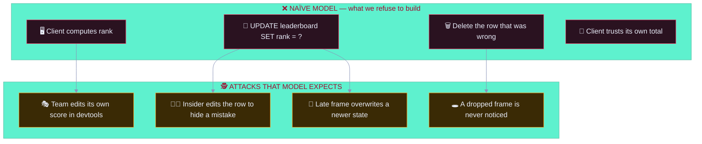

**The three questions this document answers**

| # | Question | Answer |
|:-:|:--|:--|
| 1 | **What is true?** | The ordered `raw_event` log plus the versioned `scoring_model` for the event. Nothing else. |
| 2 | **How is truth made visible cheaply?** | Projections (read models) rebuilt by pure functions, cached, and invalidated event-driven. |
| 3 | **How do we know the visible state is still true?** | Hourly reconciliation: rebuild from the log, compare to what was served, alert on divergence. |

> 📖 **The invariant that makes it auditable:** the leaderboard a spectator sees is a *projection* of an event log, and the projection can be rebuilt byte-for-byte at any time. This is what lets an auditor receive the log, run the published scoring model, and obtain the same board — which is the whole point of [`architecture.md` §8.1](./architecture.md#81-why-a-pure-scoring-function-matters-for-audit).

---

## 3. 🟣 State Taxonomy — Five Classes

Every piece of state in the system belongs to exactly one class. The class determines **who may write it**, **how it may be changed**, and **what evidence its change produces**.

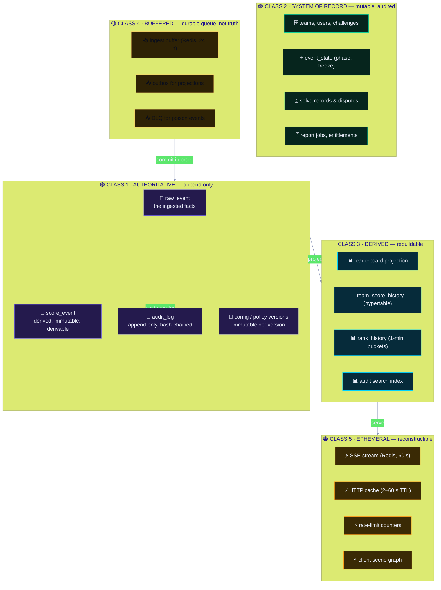

### 3.1 Class Definitions

| Class | Definition | Write authority | Change mechanism | Loss tolerance | Audit |
|:--|:--|:--|:--|:--|:--|
| 🟣 **Authoritative** | The facts from which everything else is computed | Ingest service (facts only) | **Append only.** Never updated, never deleted | **RPO 0** — synchronous replication | Every append audited in the same transaction |
| 🟢 **System of record** | Business state that cannot be derived from the log alone | Domain services, referees | Mutable with `reason`, `before`/`after`, and a corresponding event | RPO < 60 s; PITR | Full audit with actor and policy version |
| 🔵 **Derived** | Read models computed from classes 1 and 2 | Projector (only) | Rebuilt by replay; never hand-edited | RPO < 5 min; rebuilt from the log | Rebuild + diff evidence; divergence alerts |
| 🟡 **Buffered** | Durable, ordered work in flight | Producers append; consumers drain | Append and consume; DLQ on poison | RPO 0 within 24 h; replayable | Depth, age, and DLQ rate monitored |
| 🟠 **Ephemeral** | Performance and presentation state | Any writer within its scope | Freely replaced; TTL or client-scoped | **RPO n/a** — reconstructed on demand | Not individually audited; aggregate metrics only |

### 3.2 The Writing Rule

```
🟣 Authoritative  →  append an event; that IS the write
🟢 System of record →  mutate + audit + emit event, ONE transaction
🔵 Derived         →  never write from a request path; only from the projector
🟡 Buffered        →  append to a durable queue; never a synchronous side-effect
🟠 Ephemeral       →  may be discarded at any moment without consequence
```

> 🔴 **The forbidden write.** A request handler that updates a projection table directly is the single most common way a leaderboard becomes inconsistent. It is banned by `SC-02`-style discipline in [`security.md` §8](./security.md#8--application-hardening-controls) and caught by the `DER-*` invariants in [§7](#7--invariants--the-non-negotiable-rules).

### 3.3 Class Assignment Register

| Entity | Class | Store | Notes |
|:--|:-:|:--|:--|
| `raw_event` | 🟣 | PostgreSQL | Ingested platform facts; unique idempotency key |
| `score_event` | 🟣 | PostgreSQL | Pure-function output; carries full `derivation` |
| `audit_log` | 🟣 | PostgreSQL + OpenSearch + WORM | Append-only, hash-chained |
| `scoring_model` (versions) | 🟣 | PostgreSQL (immutable rows) | Every score references the exact version |
| `policy_bundle` (versions) | 🟣 | Git + signed artefact | Deployed versions retained 7 years |
| `team` | 🟢 | PostgreSQL | Soft delete only; `deleted_at`, never `DELETE` |
| `team_member` (PII) | 🟢 | PostgreSQL (encrypted columns) | Deleted ~5 months after event end |
| `challenge` | 🟢 | PostgreSQL | Points changes recompute; old values retained |
| `solve` | 🟢 | PostgreSQL | Reversible via `solve.reverted`, never deleted |
| `event_state` | 🟢 | PostgreSQL | Phase transitions; `frozen` is reversible |
| `freeze_window` | 🟢 | PostgreSQL | Opens and closes; audited both ways |
| `score_adjustment` | 🟢 | PostgreSQL | Two-person `pending_approval` lifecycle |
| `report` / `report_job` | 🟢 | PostgreSQL + S3 | Artefact immutable once generated |
| `session` | 🟢 | PostgreSQL + Redis denylist | Server-side authority; Redis is a cache |
| `leaderboard_current` | 🔵 | PostgreSQL (projection) | Rebuilt from `score_event` |
| `team_score_history` | 🔵 | TimescaleDB hypertable | 1-minute buckets, compressed after 30 d |
| `rank_history` | 🔵 | TimescaleDB hypertable | Monotonic reads enforced here |
| `audit_search` | 🔵 | OpenSearch | Near-real-time (`refresh=1s`) |
| `leaderboard_snapshot` | 🔵 | S3 (cached JSON) | Published for CDN and for resync |
| Ingest buffer | 🟡 | Redis Stream | 24 h retention; replayable |
| Projection outbox | 🟡 | PostgreSQL outbox table | Guarantees eventual projection |
| Dead-letter queue | 🟡 | PostgreSQL | Poison events; manual triage |
| SSE stream | 🟠 | Redis Stream | 60 s; resume by `Last-Event-ID` |
| HTTP/CDN cache | 🟠 | Redis + CDN | 2 s / 5 s; `stale-while-revalidate=30s` |
| Rate-limit counters | 🟠 | Redis | Sliding window; precision not correctness |
| Client scene graph | 🟠 | Browser memory | Never authoritative; discardable |

---

## 4. 🟣 The Event Log — Source of Truth

### 4.1 Why an Event Log

| Alternative | Failure mode | Event log answer |
|:--|:--|:--|
| Mutable current-state tables | No history; a wrong value cannot be explained or reversed | Every change is a fact with an actor, a reason, and a timestamp |
| Full state snapshots per change | Storage blow-up; still no derivation proof | Facts are small; projections are recomputable |
| Trusting the CTF platform's current scores | A platform bug becomes our authoritative record | We store the *facts* (`solve.recorded`), not their opinion |
| Client-side computation | A spectator can change their own screen | The server computes; the client renders |

### 4.2 The Event Envelope

```jsonc
{
  "eventId": "evt_2026_ctf_final",       // business event this belongs to
  "seq": 48213,                          // monotonic, gap-detectable, per event
  "eventType": "solve.recorded",         // closed vocabulary
  "schemaVersion": 3,
  "occurredAt": "2026-09-26T19:04:11.482Z",  // when the platform says it happened
  "recordedAt": "2026-09-26T19:04:11.501Z",  // when we durably accepted it
  "ingestLatencyMs": 19,                 // occurredAt → recordedAt; a lag signal
  "source": { "system": "ctf-platform", "id": "solve_9931", "cert": "cn=ctf-prod" },
  "idempotencyKey": "sha256:9f2a…",      // SHA-256(slug ‖ source ‖ source_event_id)
  "actor": { "type": "system", "id": "svc:ingest" },
  "payload": { /* schema-validated, versioned */ },
  "policy": { "decision": "allow", "policyId": "pol-2026-09-14.3" },
  "integrity": { "prevHash": "3f2a…", "thisHash": "b91c4e7d8a…" }
}
```

| Field | Invariant | Rationale |
|:--|:--|:--|
| `seq` | Strictly increasing per `eventId`; gaps are detectable and never silently filled | Gap detection is the basis of client resync |
| `occurredAt` vs `recordedAt` | Both stored; the difference is monitored | A growing gap means platform trouble or replay attempts |
| `idempotencyKey` | Unique; a duplicate insert is a no-op, not an error | Retry storms must not double-score |
| `eventType` | Closed vocabulary; unknown types go to the DLQ | Unbounded types are unauditable |
| `payload` | Zod `.strict()`; unknown properties rejected | Forward compatibility is a version bump, not a shrug |
| `integrity` | Hash chain over canonical serialisation | Tamper evidence for the facts themselves |

### 4.3 Ingest Ordering

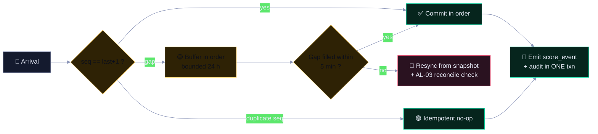

**Ordering rules**

| Rule | Statement |
|:--|:--|
| 🟣 **OR-01** | Events are applied in `seq` order per event. Equal `occurredAt` events are ordered by `idempotencyKey` (deterministic, not arrival-dependent). |
| 🟣 **OR-02** | The scorer is **order-independent within a timestamp**; a shuffled batch with identical `occurredAt` yields identical totals. This is a blocking test. |
| 🟡 **OR-03** | A gap is buffered for up to 5 minutes. Beyond that, the projector resyncs from a snapshot and reconciliation is run. |
| 🔴 **OR-04** | `seq` is never rewritten, renumbered, or back-filled. A gap remains a gap in the log, and the resync is recorded. |
| 🟢 **OR-05** | A correction is a **new event** (`solve.reverted`, `score.adjusted`), never a mutation of an earlier one. |

### 4.4 Event Taxonomy

| Group | Events | Producer | Mutates |
|:--|:--|:--|:--|
| 🏁 Event lifecycle | `event.started`, `event.phase.changed`, `event.ended` | Referee / scheduler | `event_state` |
| 👥 Team | `team.created`, `team.updated`, `team.deleted`, `team.eligibility.changed`, `team.merged` | Admin | `team` |
| 🎯 Challenge | `challenge.created`, `challenge.updated`, `challenge.released`, `challenge.retired`, `challenge.points.changed` | Referee | `challenge`, scores |
| ✅ Solve | `solve.recorded`, `solve.verified`, `solve.disputed`, `solve.reverted` | Ingest / referee | `solve`, `team_score` |
| ⚖️ Score | `penalty.applied`, `score.adjusted` | Ingest / referee (2P) | `team_score` |
| 🧊 Freeze | `freeze.window.opened`, `freeze.window.closed` | Referee | `freeze_window`, ranks |
| 📋 Report | `report.requested`, `report.generated`, `report.downloaded`, `report.revoked`, `report.template.registered` | Analyst / ops | `report` |
| 🔐 Governance | `user.*`, `session.revoked`, `access.denied`, `auth.*`, `policy.deployed`, `config.updated`, `secret.*`, `breakglass.*` | Platform | identities, config |
| 📨 Ingress | `webhook.received`, `webhook.rejected`, `webhook.replay.detected` | Ingest | ingress telemetry |

> 🧾 The **closed vocabulary** is the same list used by the audit action vocabulary in [`security.md` §12.3](./security.md#123-audit-event-schema-security-relevant-fields). State events and audit actions are deliberately near-identical: an unauditable state change is a state change that did not really happen.

---

## 5. 🟢 Entity Lifecycles & State Machines

### 5.1 Event Lifecycle

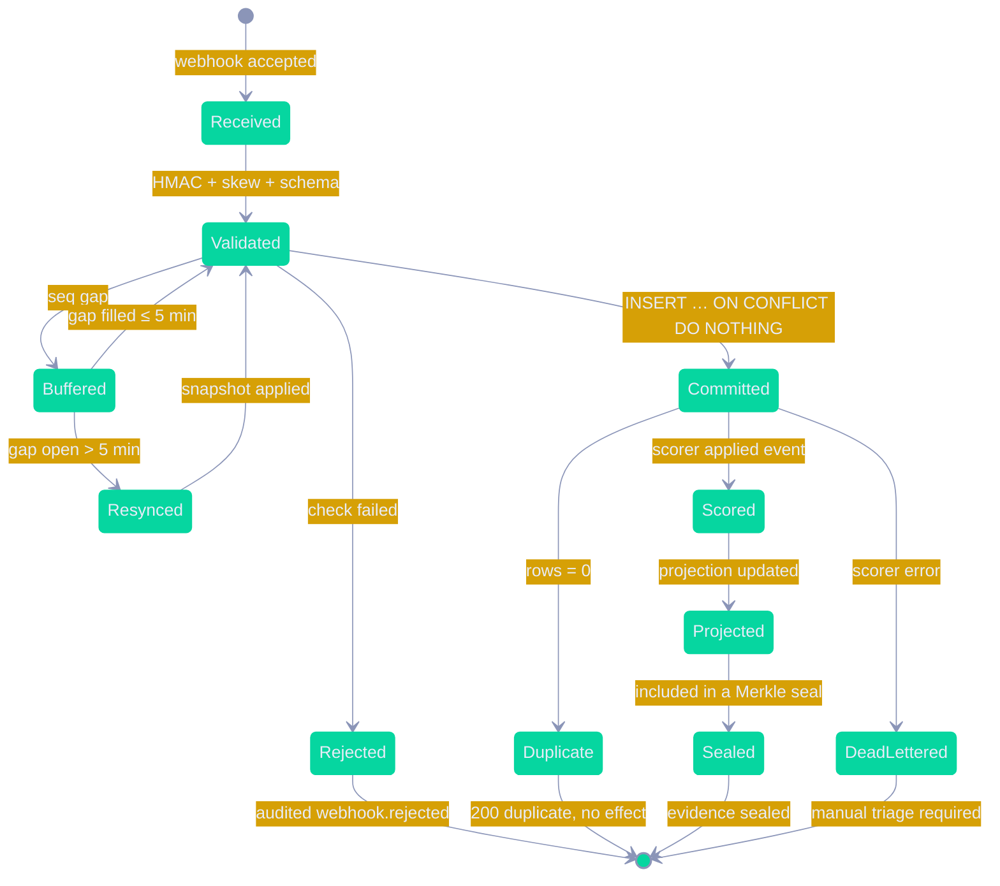

| State | Meaning | Exit conditions | Alerting |
|:--|:--|:--|:--|
| `Received` | Accepted by the edge | → `Validated` / `Rejected` | Volume anomaly → AL-16 |
| `Validated` | Cryptography and schema passed | → `Buffered` / `Committed` | Rejection spike → triage |
| `Buffered` | Waiting for a missing predecessor | → `Validated` / `Resynced` | Depth or age → 🟠 P2 |
| `Committed` | Durably in `raw_event` | → `Scored` / `Duplicate` | — |
| `Scored` | `score_event` written with derivation | → `Projected` | Scoring error → DLQ |
| `Projected` | Read models updated and delta published | → `Sealed` | Lag > 30 s → AL-18 |
| `Sealed` | Included in a signed checkpoint | terminal | Seal failure → 🔴 |
| `DeadLettered` | Poison event, quarantined | Manual triage only | Any DLQ growth → 🟠 P2 |

### 5.2 Event Phase Machine

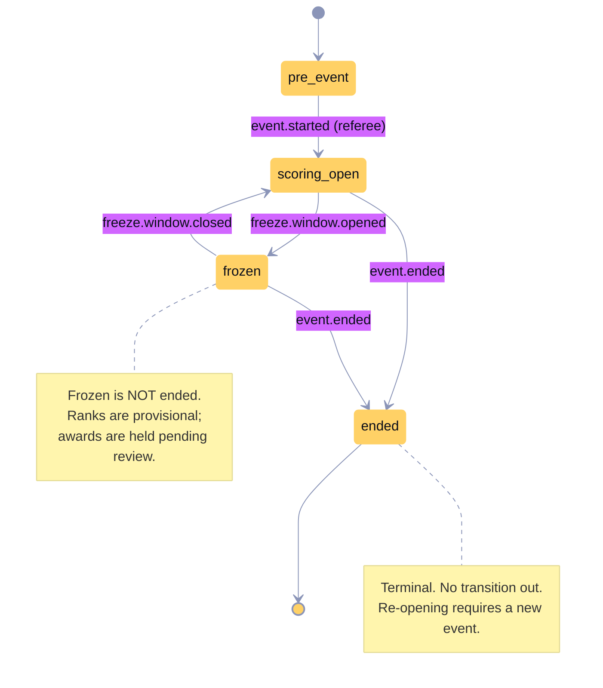

| Transition | Guard | Authority | Reversible | Audit |
|:--|:--|:--|:-:|:--|
| `pre_event → scoring_open` | Event configured, at least one team | `referee` | ✅ | `event.phase.changed` with reason |
| `scoring_open → frozen` | Freeze reason supplied | `referee_lead` (2P for top 3) | ✅ | `freeze.window.opened` |
| `frozen → scoring_open` | Review complete | `referee_lead` | ✅ | `freeze.window.closed` |
| `scoring_open → ended` | Final rank ratified | `referee_lead` | ⛔ | `event.ended` |
| `frozen → ended` | Final rank ratified | `referee_lead` | ⛔ | `event.ended` |

> ⚠️ **Freeze is not end.** A frozen leaderboard is *provisional*, with awards held. Conflating the two is the classic bug in live competition systems: an operator ends the event to stop a run of solves, and the dispute window is silently destroyed. The state machine above makes that transition illegal.

### 5.3 Team Lifecycle

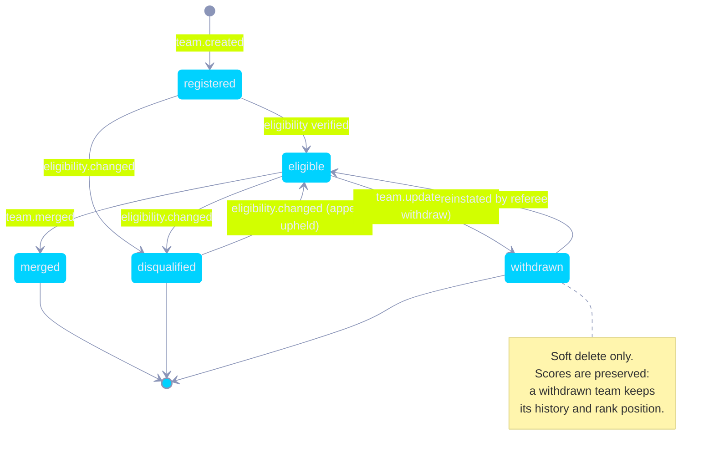

| Rule | Statement |
|:--|:--|
| 🟣 **TM-01** | `team.deleted` is a **soft** operation: `deleted_at` is set, the row remains, and the score history remains. Hard deletion is only via the retention worker after the retention period. |
| 🟣 **TM-02** | A merged team's scores are re-attributed by a **new event** with a full derivation record; history is never rewritten in place. |
| 🟡 **TM-03** | A handle change triggers a re-render of the 3D label with a transition; it never changes a rank by itself. |
| 🟡 **TM-04** | A handle is validated against a strict character policy (printable, length-bounded, no control characters) and always rendered as **text**, never HTML. |

### 5.4 Solve Lifecycle

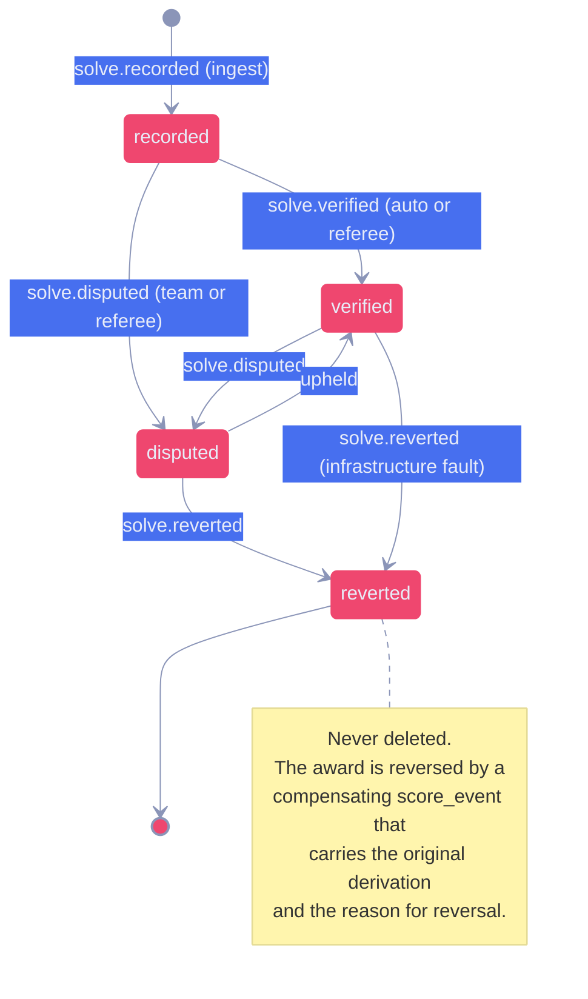

| Rule | Statement |
|:--|:--|
| 🟣 **SV-01** | A solve is **never deleted**. Reversal is a new event with `reason` and a reference to the original `solveId`. |
| 🟣 **SV-02** | A disputed solve **freezes the affected award**: the points are held, not removed, until a decision is recorded. |
| 🟡 **SV-03** | A `challenge.points.changed` event triggers recomputation of every affected solve **as new score events**, never as an update. |
| 🔴 **SV-04** | A reversal of a solve in a `frozen` event re-opens the freeze window for the affected ranks. |

### 5.5 Score Adjustment Lifecycle (Two-Person)

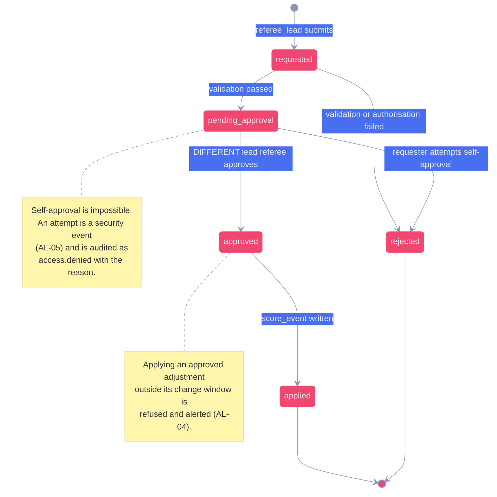

| Rule | Statement |
|:--|:--|
| 🟣 **SA-01** | `requested_by` ⛔ `approved_by` is enforced by a database constraint, not by application logic alone. |
| 🟣 **SA-02** | An adjustment **MUST** carry a `reason` of ≥ 10 characters and a `reasonCategory` from a closed list. |
| 🟣 **SA-03** | The applied adjustment writes a `score_event` with a `derivation` of type `manual_override`, referencing the approval record. |
| 🟡 **SA-04** | A pending approval older than 30 minutes expires and is re-requestable; it is never auto-approved. |
| 🔴 **SA-05** | An adjustment attempted while the phase is not `scoring_open` or `frozen` is refused and raises AL-04. |

### 5.6 Report Job Lifecycle

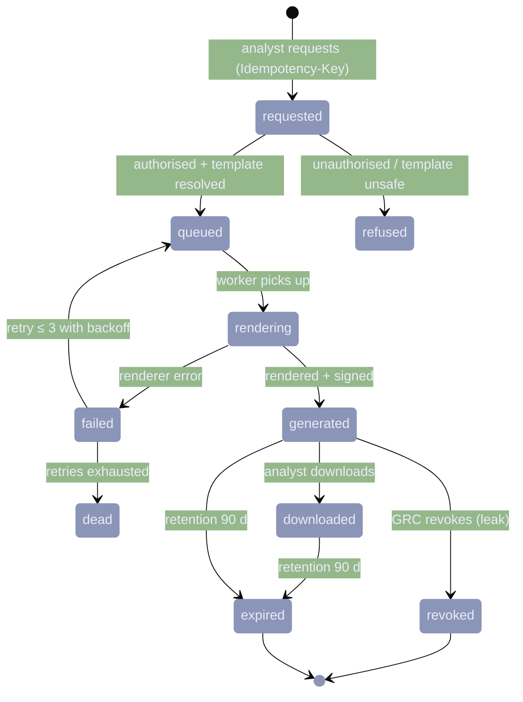

| Rule | Statement |
|:--|:--|
| 🟣 **RP-01** | A generated artefact is **immutable**: re-rendering produces a new artefact with a new id, never an overwrite. |
| 🟣 **RP-02** | Every artefact carries a detached signature, a classification, a watermark, and a manifest hash. |
| 🟡 **RP-03** | A `revoked` artefact is not deleted — revocation blocks future download and is recorded, because the artefact's existence is itself evidence. |
| 🟡 **RP-04** | A job that fails more than 3 times moves to the DLQ and raises a 🟡 alert; it never silently succeeds. |

---

## 6. 🟢 Scoring State & Deterministic Projection

### 6.1 The Pure Function Boundary

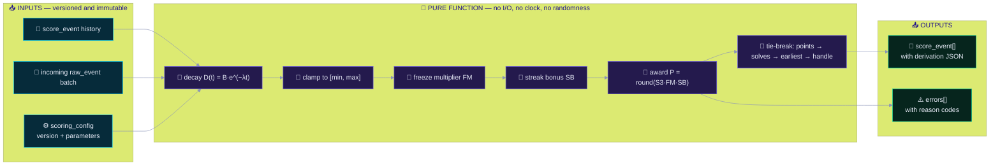

> 🧬 **Why purity is a state-preservation control, not just a code-style preference.** If the scorer reads a clock, then a replay tomorrow produces different decay values and the leaderboard cannot be explained. If it reads a random number, a replay cannot be reproduced. If it writes to the database mid-calculation, a partial failure leaves an unexplainable state. Purity is what makes [§13](#13--reconciliation--proof-of-truth) possible at all.

### 6.2 Projection Pipeline

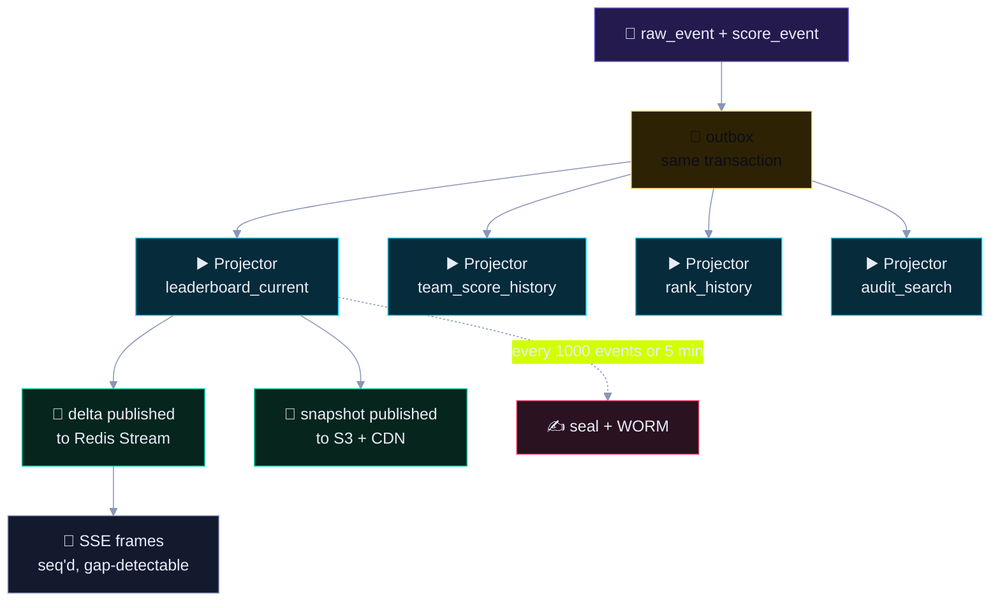

**Outbox pattern — why it is mandatory**

| Without outbox | With outbox |
|:--|:--|
| Commit the event, then publish → a crash between them loses the delta forever | Commit the event **and** the outbox row in one transaction |
| Projector polls the log → duplicate work, ordering ambiguity | Projector consumes the outbox in `seq` order |
| Projection lag is invisible | Outbox depth and age are first-class metrics (AL-18) |

### 6.3 Projection Rules

| ID | Rule | Violation response |
|:--|:--|:--|
| 🟣 **PR-01** | A projection is a **pure function** of `(events, configVersion)`. No request path may write to it. | 🔴 CI assertion + DB grants (projector role only) |
| 🟣 **PR-02** | A projection update and its source event share a transaction, or the projector replays from the outbox. No half-states. | 🔴 `T-DER-02` |
| 🟡 **PR-03** | Projections are **idempotent**: applying the same outbox batch twice yields the same result. | 🔴 `T-DER-03` |
| 🟡 **PR-04** | Every projection row records `sourceSeq` and `computedAt`, so staleness is measurable rather than assumed. | 🟡 Metric |
| 🟠 **PR-05** | A projection lagging more than 30 s raises AL-18 and the UI shows a freshness timestamp. | 🟠 P2 |
| 🟠 **PR-06** | A projection that fails a checksum rebuild is quarantined and rebuilt, not patched. | 🔴 P1 on divergence |

### 6.4 Rank Derivation and Tie-Breaks

| Position | Rule | Configurable | Rationale |
|:-:|:--|:-:|:--|
| ① | Total points (descending) | Per event | The primary measure |
| ② | Solves count (descending) | Per event | Rewards breadth, breaks equal points |
| ③ | Earliest last-solve timestamp | Per event | Rewards speed |
| ④ | Team handle, collation `C` | Per event | Total, deterministic, locale-independent ordering |

> ⚠️ **`collation C` is normative.** Locale-aware collation makes rank order depend on the database's locale configuration, which means the same event set can produce two different leaderboards on two hosts. `C` collation removes an entire class of "it works on my machine" score disputes.

### 6.5 Freeze Semantics

| Aspect | Behaviour |
|:--|:--|
| 🧊 What freezes | Rank positions, and awards for the affected rank window |
| 🔄 What continues | Ingestion of new solves; they are recorded and held |
| 🟡 Multiplier | `FM` ∈ {1.0, 0.5, 0.0} per rank window, set by the referee |
| 📊 Display | Affected rows show a lock icon and the reason (`tie_review`, `pending_dispute`, `infra_review`) |
| 🔁 Exit | `freeze.window.closed` re-ranks, releases held awards, and publishes a full re-rank delta |
| 🧾 Evidence | Open, any change, and close are all audited with reasons |

---

## 7. 🔴 Invariants — The Non-Negotiable Rules

> An **invariant** is a statement that must be true at every observable moment. Invariants are the state equivalent of security controls: they are asserted continuously, and a violation is a P1, not a bug.

### 7.1 The Invariant Set

| ID | Invariant | Asserted by | Violation |
|:--|:--|:--|:--:|
| **INV-01** | 🟣 The authoritative record of scores is the ordered event log plus the referenced `scoring_model` version. No table of current totals is authoritative. | Code review + grants | 🔴 P1 |
| **INV-02** | 🟣 Every `score_event` is reproducible: replaying the log with the referenced config yields byte-identical output. | 1,000-run determinism test + nightly rebuild | 🔴 P1 |
| **INV-03** | 🟣 No `score_event` exists without a complete `derivation` recording inputs, parameters, and formula version. | Schema `NOT NULL` + test | 🔴 P1 |
| **INV-04** | 🟣 Every mutation of a system-of-record entity has a corresponding audit record in the **same transaction**. | Transaction-coupling test | 🔴 P1 (AL-S02) |
| **INV-05** | 🟣 A client's rank is always the rank the server last sent for that `seq`. Clients never compute rank. | `T-APP-03` + client unit test | 🔴 P1 |
| **INV-06** | 🟣 A spectator read is **monotonic**: rank may improve or stay, never regress, for the same `eventId` and `seq`. | Rank-history assertion in the read path | 🔴 P1 |
| **INV-07** | 🟢 `seq` per event is strictly increasing with no silent back-fill; gaps are recorded and resolved by resync. | Gap detector + AL-03 | 🟠 P2 |
| **INV-08** | 🟢 An idempotency key is applied at most once; a duplicate delivery has zero effect on any total. | Unique constraint + `T-EXT-03` | 🔴 P1 |
| **INV-09** | 🟢 A team with a recorded solve never has a lower total than the same team without that solve, except through a recorded compensating event. | Property test over the log | 🔴 P1 |
| **INV-10** | 🟢 A `frozen` event never changes ranks until `freeze.window.closed` is recorded. | State machine guard | 🟠 P2 |
| **INV-11** | 🟢 No projection is written by a request handler. | DB grants (projector role) + lint | 🔴 P1 |
| **INV-12** | 🟢 Every cache entry is invalidated event-driven, and no read is served beyond its documented TTL. | `T-APP-09` + cache header assertions | 🟠 P2 |
| **INV-13** | 🟡 Every delta frame carries the `seq` and `eventId` it was computed from, so any frame can be traced to a log position. | Frame schema test | 🟠 P2 |
| **INV-14** | 🟡 A rejected or dead-lettered event is never silently dropped; it is visible in a queue with an owner. | DLQ metric + 🟠 alert | 🟠 P2 |
| **INV-15** | 🟡 No state transition occurs without an actor identity that resolves to a principal, a role, and an authentication method. | `actor` NOT NULL + FK | 🟠 P2 |
| **INV-16** | 🟡 A client that has lost sync (gap, reconnect, or failed resync) never renders a frame claiming to be current; it shows a staleness indicator. | Client state machine test | 🟠 P2 |
| **INV-17** | 🟡 Legal hold suppresses deletion and only deletion; it never suppresses reads that an auditor is entitled to make. | Hold-scope test | 🟠 P2 |
| **INV-18** | 🟡 Time is monotonic within a node: a wall-clock regression is detected and manual audit appends are halted. | chrony + AL-17 | 🟠 P2 |

### 7.2 Invariant Enforcement Architecture

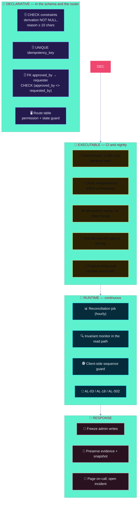

> 🔴 **An invariant that is only documented is a wish.** Each of `INV-01`…`INV-18` appears in this document **and** in a machine-checked location: a database constraint, a CI test, or a runtime monitor. If an invariant cannot be expressed in one of those three, it is rewritten until it can be.

### 7.3 Degradation Safe-State Invariants

| ID | Invariant | Rationale |
|:--|:--|:--|
| **INV-S1** | 🔴 When authorisation cannot be evaluated, no mutation is permitted. | Fail closed |
| **INV-S2** | 🔴 When the audit store is unavailable, no mutation commits. | Audited or not done |
| **INV-S3** | 🟠 When the database is unavailable, reads are served from the last sealed snapshot **with a visible staleness banner**, never fabricated. | Truthful degradation |
| **INV-S4** | 🟠 When SSE is unavailable, the client falls back to 5-second polling and states that updates are delayed. | Visible degradation |
| **INV-S5** | 🟡 When the IdP is unavailable, the public board continues and all admin routes are closed. | Governance over convenience |
| **INV-S6** | 🟡 When a projection is behind, the UI shows `last updated` rather than implying currency. | No silent staleness |

---

## 8. 🟠 Concurrency & Conflict Resolution

### 8.1 Isolation Strategy

| Operation | Isolation | Rationale |
|:--|:--|:--|
| Score submission | 🟢 `SERIALIZABLE`, single writer | A double-applied score is the worst possible outcome |
| Score reversal | 🟢 `SERIALIZABLE` | Referee decisions are legally sensitive |
| Leaderboard read (admin) | 🟡 Read-your-writes | An admin must see their own change immediately |
| Leaderboard read (spectator) | 🟠 Monotonic read | Animate forward only; never regress |
| Audit query | 🟢 Strong | Evidence integrity |
| Report generation | 🟠 Snapshot-consistent (`REPEATABLE READ`) | An export must be internally coherent |
| Telemetry | 🔴 Best-effort | Never blocks the user path |

### 8.2 Conflict Taxonomy

| Conflict | Scenario | Resolution | Loser's fate |
|:--|:--|:--|:--|
| 🏎️ **Write-write on the same team** | Two solves for one team at the same instant | `SERIALIZABLE` + retry; second transaction re-reads and recomputes | Retry, then error with a safe `409` |
| 🔁 **Duplicate delivery** | Platform retries a webhook | Unique idempotency key | No-op `200 duplicate` |
| 🕰️ **Out-of-order arrival** | `seq 5` arrives before `seq 4` | Buffer in `seq` order up to 5 min, then resync | Late event applied after the gap fills |
| ✏️ **Concurrent manual edit** | Two admins edit a challenge | Optimistic concurrency on `version` column | Second gets `409` and re-reads |
| 👥 **Two-person race** | Both leads approve simultaneously | `SELECT … FOR UPDATE` on the adjustment row | One wins; the other sees `already approved` |
| 🧊 **Freeze vs solve** | A solve lands during a freeze window | Solve is recorded, award held | Award released on `freeze.window.closed` |
| 🌐 **Cache vs write** | A read is served from cache just after a mutation | Event-driven purge + short TTL + `stale-while-revalidate` | Stale read ≤ 30 s, labelled |
| 📺 **Client vs server** | A client's local total disagrees with the server | Server wins; client resyncs | Client state discarded |

### 8.3 Optimistic Concurrency Pattern

```sql
-- Every system-of-record entity carries a version column.
-- A mutation MUST present the version it read; a mismatch is a 409, never a blind overwrite.
UPDATE challenge
   SET title           = $2,
       points          = $3,
       version         = version + 1,
       updated_at      = now()
 WHERE id              = $1
   AND version         = $4          -- the version the client read
   AND event_id        = $5
RETURNING id, version, updated_at;
-- 0 rows updated  ⇒ 409 conflict; the client re-reads and re-applies.
-- The audit record is written in the same transaction and carries before/after.
```

### 8.4 Retry Discipline

| Rule | Statement |
|:--|:--|
| 🟣 **RT-01** | Retries are permitted **only** for idempotent operations, or for operations carrying an idempotency key. |
| 🟡 **RT-02** | Retry uses exponential backoff with jitter, a maximum of 3 attempts, and an explicit deadline. |
| 🔴 **RT-03** | A `SERIALIZABLE` conflict is retried at most 3 times; then the caller receives a safe `409` and the event is buffered. |
| 🟡 **RT-04** | A retry storm from the platform is absorbed by the rate limiter, not by unbounded retries. |
| 🔴 **RT-05** | A retry **never** re-attempts a non-idempotent side effect (email, webhook send, artefact write) without a dedupe key. |

---

## 9. 🔵 SSE Stream State Contract

### 9.1 Frame Schema

```jsonc
{
  "seq": 48213,                     // monotonic, gap-detectable, per event
  "eventId": "lb-48213",            // SSE id → Last-Event-ID resume
  "ts": "2026-09-26T19:04:11.482Z",
  "eventType": "leaderboard.delta",
  "schemaVersion": 3,
  "eventIdempotencyKey": "shk_9f2a…",
  "data": {
    "phase": "scoring_open",
    "serverTimeMs": 1789742651482,
    "freezeWindows": [{ "fromRank": 1, "toRank": 3, "reason": "tie_review" }],
    "changes": [
      { "teamId": "t_041", "handle": "0xDEADBEEF",
        "rank": 3, "prevRank": 7,
        "score": 4820, "scoreDelta": 900,
        "solved": 24, "streak": 5,
        "tier": "bronze",
        "rankLocked": true, "lockReason": "tie_review" }
    ],
    "removed": [],
    "topN": 100
  }
}
```

### 9.2 Client Frame State Machine

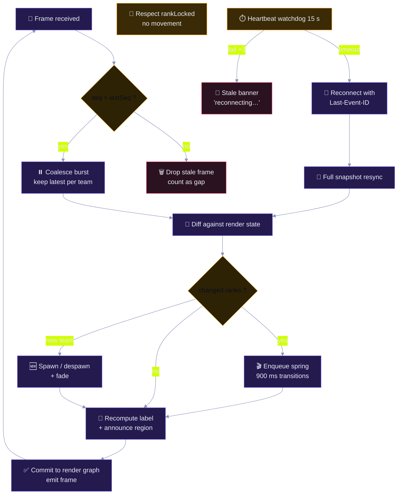

### 9.3 Delivery Guarantees

| Property | Mechanism | Client obligation |
|:--|:--|:--|
| 🧭 Ordering | Monotonic `seq` | Drop anything `≤ lastSeq` |
| 🕳️ Gap detection | `seq` discontinuity | Request a snapshot resync |
| ⏪ Resume | `Last-Event-ID` header | Send the last applied id on reconnect |
| 🧯 Loss tolerance | Coalescing to the latest state per team | A leaderboard is **state**, not a log |
| 🚦 Backpressure | Per-client shedding | A slow client receives fewer deltas and never blocks others |
| 🔐 Auth expiry mid-stream | Stream closed with reason `420` | Re-authenticate, then resync |
| 💓 Heartbeat | `:heartbeat` comment every 15 s | Watchdog marks the stream stale if absent |
| 🏷️ Freshness | `serverTimeMs` in every frame | Show `last updated` when lag exceeds the threshold |

### 9.4 Snapshot Resync Contract

| Step | Client | Server | Guarantee |
|:-:|:--|:--|:--|
| 1 | Detect a gap or a reconnect beyond the replay window | — | — |
| 2 | `GET /api/v1/leaderboard/snapshot?eventId=…&seq=…` | — | — |
| 3 | — | Return the full top-N with `asOfSeq` and `asOfTs` | Snapshot is internally consistent |
| 4 | Diff and apply with **no** animation for the resync itself | — | Avoids a 300-team animation storm |
| 5 | Set `lastSeq = asOfSeq`, request deltas from there | Resume from `asOfSeq + 1` | No gap remains |
| 6 | Emit a `resync` telemetry event with duration and gap size | — | Resync rate is monitored |

> ⚠️ **Resync must not animate.** A full resync that plays a 900 ms spring transition for 300 teams is a 4-minute visual lie. Resync applies state instantly, and subsequent deltas animate normally.

---

## 10. 🔵 Client Scene State

### 10.1 The Scene Graph Is a Cache

The 3D scene is a **rendering of server state**, never a computation of it. This is the client-side expression of `INV-05`.

| Layer | Contents | Authority | Rebuild cost |
|:--|:--|:--|:--:|
| 🎥 **Render graph** | Meshes, materials, lights, podium | 🟠 Ephemeral | Full rebuild on resync |
| 🏷️ **Label layer** | Team handles, ranks, scores, tier badges | 🔵 Derived from the last frame | Cheap |
| 🔢 **Numeric layer** | Score counters, streak indicators | 🔵 Derived; tweened for readability | Cheap |
| 🧊 **Lock layer** | Freeze indicators and reasons | 🔵 Derived from `freezeWindows` | Cheap |
| 📡 **Stream state** | `lastSeq`, `lastFrameTs`, gap counters, connection state | 🟠 Ephemeral | Reset on reload |
| 🗺️ **Camera state** | Orbit, zoom, focus target, auto-orbit | 🟠 Ephemeral, **user-owned** | Never reset by a delta |
| ⚙️ **Quality tier** | Shadow resolution, particle count, LOD | 🟠 Adaptive, device-owned | Re-evaluated on FPS drop |

### 10.2 Transition Rules

| Rule | Statement | Rationale |
|:--|:--|:--|
| 🎬 **TR-01** | A rank change animates over 900 ms with a critically damped spring; position is never snapped mid-transition unless the team enters or leaves the top-N. | Motion communicates the change; a snap is unreadable |
| 🚫 **TR-02** | Transitions are **coalesced**: a team with three updates in 200 ms animates once to the final position. | Prevents queue-induced lag |
| 🔒 **TR-03** | A `rankLocked` team does not move, and displays a lock badge with the reason. | Freeze semantics must be visible, not inferred |
| ➕ **TR-04** | Entering the top-N fades in over 400 ms; leaving fades out and parks the object in a pool. | Object churn is a GC and GPU hazard |
| 🔢 **TR-05** | Score numbers tween over 600 ms; the *authoritative* value is the frame value, and the tween is presentation only. | Prevents number flicker and never lies about the final value |
| 🏷️ **TR-06** | A handle change replaces the label with a cross-fade; it never triggers a rank change. | Handles are cosmetic |
| ♿ **TR-07** | Every animated change is mirrored in an `aria-live` region as text, so the information is not 3D-only. | WCAG 2.2; a screen reader cannot see a podium |
| ⏱️ **TR-08** | Under the reduced-motion preference, transitions collapse to a 100 ms cross-fade with no movement. | `prefers-reduced-motion` |
| 🔋 **TR-09** | When FPS p5 < 30 for 5 s, the quality ladder drops one tier; at < 20, a 2D table fallback is offered. | Degradation is graceful and visible |

### 10.3 Client State Invariants

| ID | Invariant | Test |
|:--|:--|:--|
| 🟣 **CLI-01** | A rendered rank always equals `lastFrame.rank` for that team; the client never derives it. | Unit test on the reducer |
| 🟣 **CLI-02** | A frame with `seq ≤ lastSeq` never mutates render state. | Reducer property test |
| 🟠 **CLI-03** | After a resync, `lastSeq` equals the snapshot's `asOfSeq` and no gap counter is non-zero. | Integration test |
| 🟡 **CLI-04** | The camera state survives every delta and every resync unless the user has never moved it. | UI test |
| 🟡 **CLI-05** | A `420` stream close forces a re-auth and a resync; the client never resumes from a stale `lastSeq`. | E2E test |
| 🟡 **CLI-06** | A connection older than 30 s without a heartbeat shows a staleness indicator. | Unit test with a fake clock |

---

## 11. 🟡 Caching, Read Consistency & Invalidation

### 11.1 Cache Matrix

| Read | Cache | TTL | Invalidation | Stale policy |
|:--|:--|:--|:--|:--|
| `GET /leaderboard?top=100` | Redis + CDN | 2 s / 5 s | Event-driven purge | `stale-while-revalidate=30s` |
| `GET /teams/:id` | Redis | 60 s | On team mutation | Serve stale ≤ 5 min |
| `GET /event/state` | Redis | 1 s | Event-driven | **Never stale** (safety-critical) |
| `GET /reports/:id` | None | — | — | Always fresh (authoritative) |
| `GET /audit/search` | OpenSearch | 30 s | Near-real-time index | `refresh=1s` |
| `/api/v1/auth/*` | None | — | — | Never cached |
| `SSE /stream` | Redis Stream | 60 s retention | n/a | Resume by `Last-Event-ID` |
| Session lookup | Redis | Session TTL | On revocation | Revocation denylist checked first |
| Rate-limit counters | Redis | Window | Sliding expiry | Precision-tolerant |
| Projection outbox | PostgreSQL | Until drained | Consumed | Depth + age monitored |

### 11.2 Invalidation Contract

| Rule | Statement |
|:--|:--|
| 🟣 **CA-01** | A mutation publishes an invalidation message on the same transactional outbox as the event. There is no path where the write commits and the purge does not. |
| 🟡 **CA-02** | `event/state` is **never** served stale. If Redis is unavailable, the read goes to PostgreSQL. |
| 🟡 **CA-03** | A stale response **MUST** carry an age indicator so a client can display it. A silently stale read is a lie. |
| 🟠 **CA-04** | CDN-cached content is keyed by `eventId` and a state version; a new event or a phase change rotates the key, so a cached board from a previous event is never served. |
| 🟡 **CA-05** | Cache keys are constructed by a typed builder with allow-listed prefixes. User input never shapes a key namespace. |

### 11.3 Read-your-Writes for the Acting Admin

```
Admin submits score.adjust
  → transaction commits (event + outbox + audit)
  → admin's next read is served from a per-identity
     read-your-writes marker that bypasses the leaderboard cache
  → marker expires after 30 s, after which normal caching resumes
```

| Requirement | Statement |
|:--|:--|
| 🟣 **RYW-01** | A principal that performed a mutation sees its effect on the very next read, or the read is refused with a `409` — never a stale success. |
| 🟡 **RYW-02** | The bypass window is bounded (30 s) and per-identity; it is not a way to disable caching. |
| 🟡 **RYW-03** | Spectators never receive the bypass. Their reads are monotonic and cache-served. |

---

## 12. 🟠 Degraded, Partial & Safe-Mode States

> **Principle:** degrade gracefully, never silently. Every state below is explicit, operator-visible, user-visible where relevant, and audited.

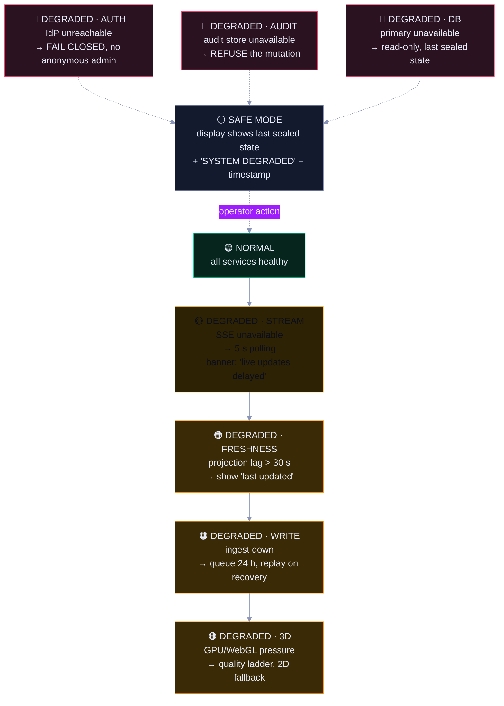

### 12.1 Degradation Contract

| Mode | Trigger | System behaviour | User-visible | State writes | Audit |
|:--|:--|:--|:--|:--|:--|
| 🟡 Stream | SSE unavailable | 5-second polling | "Live updates delayed" | Ingest unaffected | 🟢 Degraded-mode event |
| 🟠 Freshness | Projection lag > 30 s | Serve with age indicator | "Last updated 19:04:12" | Ingest continues | 🟠 AL-18 |
| 🟠 Write | Ingest unavailable | Buffer in Redis, 24 h | "Scores may appear late" | **Local mutations still allowed** (they do not depend on ingest) | 🟠 Buffer depth metric |
| 🟠 3D | FPS p5 < 30 | Quality ladder, then 2D table | Quality badge / 2D toggle | None | 🟡 RUM |
| 🔴 Auth | IdP unreachable | All admin routes closed | "Admin unavailable" | **No admin writes** | 🔴 Fail-closed event |
| 🔴 Audit | Audit store unavailable | All mutations refused | "Maintenance — changes disabled" | **None** | 🔴 AL-S02 |
| 🔴 DB | Primary unavailable | Read-only from last sealed snapshot | "Read-only mode" | **None** | 🔴 Failover event |
| ⚪ Safe mode | Multiple criticals | Last sealed snapshot + banner | "SYSTEM DEGRADED" + timestamp | **None** | 🔴 Operator transition audited |

### 12.2 The Asymmetry Rule

> 🔴 **Availability is sacrificed in one direction only: writes stop before reads do.** A public spectator can always see the last known-good leaderboard with a staleness notice. What a spectator can never do is see a leaderboard that was *invented* to look fresh. This is the state-level expression of the security posture in [`architecture.md` §18.4](./architecture.md#184-degradation-modes).

| Never allowed | Why |
|:--|:--|
| Fabricating a rank to avoid showing staleness | A fabricated leaderboard is the exact attack this design exists to prevent |
| Serving a mutable projection as authoritative | It would break `INV-01` |
| Continuing admin writes without an audit record | It would break `INV-04` and `INV-S2` |
| Silently dropping a rejected event | It would break `INV-14` |

---

## 13. 🟢 Reconciliation — Proof of Truth

Reconciliation is the mechanism that turns "we believe the board is right" into "we have demonstrated the board is right, and here is the evidence."

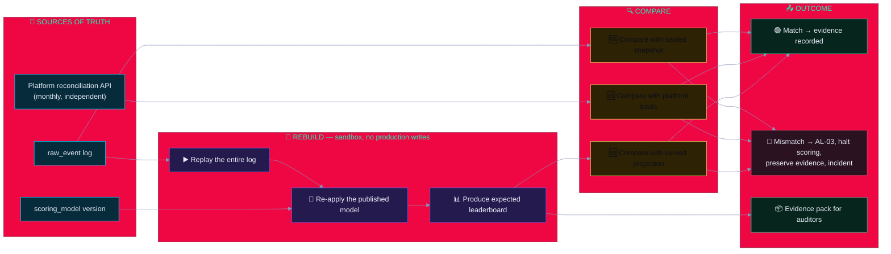

### 13.1 Reconciliation Schedule

| Check | Frequency | Scope | Tolerance | On mismatch |
|:--|:--|:--|:--|:--|
| 🔁 Chain integrity | Hourly | Full audit chain | 0 breaks | 🔴 AL-01, freeze admin writes |
| 🧬 Projection rebuild | Hourly | Current event | Byte-identical | 🔴 AL-03, halt scoring, replay |
| 🆚 Score totals vs platform | Hourly during a live event, daily otherwise | Totals per team | 0 difference | 🟠 Investigate; 🔴 if unexplained |
| 📸 Sealed snapshot vs projection | Every seal | Top-N | Byte-identical | 🔴 AL-03 |
| 🔍 Entitlement reconciliation | Hourly | Roles and scopes | 0 violations | 🔴 Auto-revoke + page |
| 🏛️ Independent pen test | Annual | Whole system | 0 High/Critical | 🟠 Tracked to closure |
| 🧑‍💻 Access review | Quarterly | Human access | 0 orphan access | 🟡 Review task |

### 13.2 Divergence Taxonomy

| Divergence | Likely cause | Response | Prevention |
|:--|:--|:--|:--|
| Rebuild differs from projection | Projector bug or partial application | Quarantine the projection, rebuild, alert | Outbox pattern + idempotent projector |
| Platform differs from us | Platform bug, or a rejected event we failed to record | Inspect the DLQ and the gap buffer | Contract tests + hourly comparison |
| Chain break | Tampering or storage corruption | 🔴 P1, preserve evidence, investigate | Append-only grants + external anchoring |
| Snapshot differs from projection | Stale CDN key or publish failure | Republish; check cache key versioning | Key rotation on state version |
| Entitlement drift | Manual grant without an event | Revoke, investigate the actor | Continuous SoD assertions |

> 🔍 **The reconciliation job is the most important security control in the state layer.** Every other control *prevents* a wrong state; reconciliation *proves* that no wrong state was served. An auditor will ask for its output, so it is designed to be readable evidence, not a log line.

### 13.3 Dispute Resolution Path

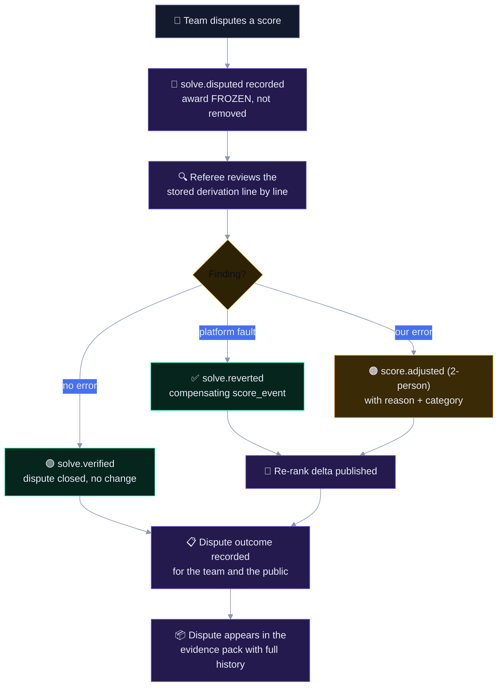

| Guarantee | Mechanism |
|:--|:--|
| 🧾 The team can see **why** it has the score it has | Every `score_event` stores the full `derivation` |
| 🔄 The correction is visible to everyone, not just the disputing team | Re-rank delta published to all clients |
| 👤 No single person can decide and conceal | `score.adjusted` requires two-person approval |
| ⏱️ The dispute window cannot be quietly closed | `frozen` ≠ `ended`; a reversal re-opens the freeze window |
| 📦 An auditor can reconstruct the whole dispute | Every step is an event in the log, sealed and exportable |

---

## 14. 🔵 State Observability

### 14.1 State Metrics

| Metric | Type | Target | Alert |
|:--|:--|:--:|:--|
| `projection_lag_seconds` | Gauge | < 5 s | 🔴 AL-18 above 30 s |
| `outbox_depth` | Gauge | < 1,000 | 🟠 sustained growth |
| `outbox_oldest_age_seconds` | Gauge | < 10 s | 🔴 above 300 s |
| `dlq_depth` | Gauge | 0 | 🟠 any growth |
| `ingest_buffer_depth` | Gauge | < 10,000 | 🟠 above 80 % of 24 h capacity |
| `seq_gap_total` | Counter | 0 sustained | 🔴 AL-03 |
| `reconciliation_mismatch_total` | Counter | 0 | 🔴 AL-03 |
| `audit_chain_break_total` | Counter | 0 | 🔴 AL-01 |
| `rebuild_duration_seconds` | Histogram | < 120 s | 🟡 above budget |
| `score_events_total{type}` | Counter | — | Informational |
| `stale_reads_served_total` | Counter | — | Trending up ⇒ cache tuning |
| `resync_total{reason}` | Counter | — | Gap reason mix |
| `client_fps_p5` | Histogram (RUM) | ≥ 30 | 🟡 AL-21 |
| `invariant_violation_total{id}` | Counter | **0** | 🔴 any value |

### 14.2 State Health Views

```mermaid
%%{init: {"theme":"base","themeVariables":{"primaryColor":"#00D2FF","primaryTextColor":"#E8ECF8","primaryBorderColor":"#00D2FF","lineColor":"#8B95B8","fontFamily":"Inter, sans-serif"}}}%%
flowchart TB
    subgraph PANEL["🖥️ OPERATOR DASHBOARD — one screen, live event"]
        V1["📊 Lag & depth gauges<br/>projection, outbox, ingest buffer"]:::v
        V2["🔴 Invariant & chain status<br/>green = provable"]:::v
        V3["🧾 Current event state<br/>phase, freeze windows, top-N"]:::v
        V4["⚠️ DLQ & degraded modes"]:::v
        V5["⏱️ Last reconciliation result<br/>+ duration + diff count"]:::v
    end
    subgraph PUBLIC["🌐 PUBLIC BOARD — honesty indicators"]
        P1["⏱️ 'last updated' timestamp"]:::p
        P2["🏷️ Degraded-mode banner"]:::p
        P3["🧊 Freeze locks with reasons"]:::p
        P4["♿ Text alternative + aria-live"]:::p
    end
    V1 & V2 & V3 & V4 & V5 --> OP(["🧑‍💼 Operator"]):::op
    P1 & P2 & P3 & P4 --> SP(["👥 Spectator"]):::sp
    classDef v fill:#241A4D,stroke:#6C5CE7,color:#E8ECF8
    classDef p fill:#062B3A,stroke:#00D2FF,color:#E8ECF8
    classDef op fill:#06251D,stroke:#06D6A0,color:#E8ECF8
    classDef sp fill:#2E2205,stroke:#FFD166,color:#0B0E1A
```

### 14.3 Traceability Chain

Every state question is answerable by following identifiers, with no gaps:

```
userId → sessionId → correlationId → traceId
      → auditId → score_eventId → raw_eventId → seq
      → sealId → merkleRoot → external timestamp
```

| Question | Answered by |
|:--|:--|
| Who changed this score? | `actor` on the `score_event` and its audit record |
| Why? | `reason` + `reasonCategory` + full `derivation` |
| What did it look like before? | `before` / `after` in the audit record |
| Has the evidence been tampered with? | Chain verification + external timestamp |
| What did the spectator actually see? | Delta frames + snapshot `asOfSeq` + client telemetry |
| Can it be reproduced? | Rebuild from the log with the published model version |

---

## 15. 🔴 State-Related Risks & Anti-Patterns

### 15.1 Rejected Anti-Patterns

| Anti-pattern | Why it is rejected | Correct approach |
|:--|:--|:--|
| ❌ Client computes rank | A spectator can change their own screen; rankings become opinions | Server computes; client renders (`INV-05`) |
| ❌ `UPDATE leaderboard SET rank = …` | History is lost; corrections are unexplainable | Append an event; recompute the projection |
| ❌ Deleting the wrong row | Destroys the evidence trail permanently | Soft delete + compensating event |
| ❌ Best-effort audit logging | An unaudited change is an undetectable change | Same-transaction audit (`INV-04`) |
| ❌ Idempotency "handled in the app" | Two instances race; the duplicate slips through | A unique constraint in the database |
| ❌ Retrying everything | Retry storms amplify an outage | Retries only for idempotent operations (`RT-01`) |
| ❌ Long-lived transactions during a live event | Holds locks; blocks ingest; amplifies a stall | Short transactions; batch projector work |
| ❌ Reading Redis for authoritative state | A cache eviction becomes a data loss | Redis is a cache; PostgreSQL is the record |
| ❌ Trusting a webhook's computed points | The platform's arithmetic is not our evidence | Store the *fact*; compute points ourselves |
| ❌ Animating a resync | A 300-team animation storm reads as a hang | Apply instantly, then animate deltas |
| ❌ Locale-dependent collation | The same log yields two different leaderboards | `collation C` for all rank ordering |
| ❌ Writing to a projection from a request | Half-states and ordering ambiguity | Outbox + projector only |
| ❌ Caching `event/state` | A stale phase can permit an illegal transition | Never stale; fall through to PostgreSQL |
| ❌ Deleting the audit row to "fix" a mistake | Removes the only proof of the mistake | Append a correcting event; keep both |

### 15.2 State Risk Register

| ID | Risk | Likelihood | Impact | Mitigation | Invariant |
|:--|:--|:-:|:-:|:--|:--|
| R-S01 | Platform replays solves after an outage, inflating totals | 🟠 | 🔴 | Idempotency keys, skew window, hourly reconciliation | `INV-08` |
| R-S02 | Projection drift from partial application | 🟡 | 🔴 | Outbox, idempotent projector, hourly rebuild-and-diff | `INV-02` |
| R-S03 | Client shows a stale board as final | 🟠 | 🟠 | Sequence guard, heartbeat, staleness banner | `INV-16`, `CLI-06` |
| R-S04 | Freeze interpreted as end, destroying the dispute window | 🟡 | 🔴 | State machine guard; reversal re-opens the window | `INV-10` |
| R-S05 | Cache serves a previous event's board to a new event | 🟡 | 🟠 | Cache key includes `eventId` + state version | `INV-12` |
| R-S06 | Manual correction applied without two-person approval | 🟡 | 🔴 | DB constraint on `approved_by <> requested_by` | `INV-04` |
| R-S07 | SSE frame loss causes a permanent visual gap | 🟠 | 🟡 | Gap detection triggers resync; 60 s replay window | `INV-07` |
| R-S08 | Locale-dependent rank ordering diverges between hosts | 🟡 | 🔴 | `collation C` enforced in the schema and the test | `INV-06` |
| R-S09 | An event is rejected and silently dropped | 🟡 | 🟠 | DLQ with an owner; `dlq_depth` alert | `INV-14` |
| R-S10 | Reordering by recomputing in place rather than appending | 🟡 | 🔴 | Code review + derivation `NOT NULL` + no update grants on facts | `INV-03` |
| R-S11 | A time shift alters decay values on replay | 🟡 | 🔴 | Purifier freezes the scoring window; scorer is clock-free | `INV-02` |
| R-S12 | Legal hold blocks a deletion that should proceed, or vice versa | 🟡 | 🟠 | Hold scope recorded per record; `INV-17` tested | `INV-17` |

### 15.3 Watch List — What We Monitor Because We Do Not Fully Control

| Item | Why | Mitigation posture |
|:--|:--|:--|
| 🏆 Platform behaviour | External; we cannot patch it | Contract tests, reconciliation, webhook trust |
| 🌐 Network and proxies | Frame loss, reordering, buffering | Sequence guards, resync, polling fallback |
| 🖥️ Client devices | Old browsers, weak GPUs, throttled tabs | Quality ladder, 2D fallback, reduced motion |
| ⏱️ Wall clock | NTP drift changes decay inputs | Purifier window, AL-17, monotonic-time checks |
| 🧑‍💻 Human procedure | A referee can always make a mistake | Two-person integrity, mandatory reasons, derivation replay |

---

## 16. ⬜ Appendices

### 16.1 State Artefact Catalogue

| Artefact | Class | Owner | Consumers | Consistency | Retention |
|:--|:-:|:--|:--|:--|:--|
| `raw_event` | 🟣 | Ingest | Scorer, projector, auditor | Strong (single writer) | 24 mo → 7 yr for score-bearing |
| `score_event` | 🟣 | Scorer | Projector, auditor, referee UI | Strong | 7 years |
| `audit_log` | 🟣 | Audit service | Auditor, SIEM, evidence pack | Strong | 7 years (WORM) |
| `scoring_model` version | 🟣 | Lead referee | Scorer, rebuild job | Immutable | Indefinite |
| `policy_bundle` version | 🟣 | Security | PDP | Immutable | 7 years |
| `team` | 🟢 | Admin | Board, API | Strong | Indefinite (soft delete) |
| `team_member` | 🟢 | Admin | Authz, DSAR | Strong | ~5 months (PII) |
| `challenge` | 🟢 | Referee | Board, scorer | Optimistic version | Event end + 24 mo |
| `solve` | 🟢 | Ingest | Scorer, UI | Strong | 7 years |
| `event_state` | 🟢 | Referee | Everything | Never stale | 7 years |
| `freeze_window` | 🟢 | Referee | Scorer, UI | Strong | 7 years |
| `score_adjustment` | 🟢 | Referee lead | Scorer, auditor | Strong | 7 years |
| `report` | 🟢 | Report service | Analyst, auditor | Strong | 90 days (artefact) |
| `session` | 🟢 | Auth service | Gateway | Strong + Redis cache | 13 months |
| `leaderboard_current` | 🔵 | Projector | Board API | Monotonic read | Rebuildable |
| `team_score_history` | 🔵 | Projector | Charts, reports | Append-only buckets | 7 years |
| `rank_history` | 🔵 | Projector | Trend views | Monotonic | 7 years |
| `audit_search` | 🔵 | Audit service | Auditor | Near-real-time | 13 mo searchable |
| `leaderboard_snapshot` | 🔵 | Projector | CDN, resync | Snapshot-consistent | Current + 24 h |
| Ingest buffer | 🟡 | Ingest | Scorer | Ordered, at-least-once | 24 hours |
| Projection outbox | 🟡 | Domain services | Projector | Ordered, at-least-once | Until drained |
| Dead-letter queue | 🟡 | Ingest | Referee triage | Manual | Until resolved + 7 yr |
| SSE stream | 🟠 | Projector | Clients | At-least-once, seq'd | 60 seconds |
| HTTP/CDN cache | 🟠 | Platform | Clients | Stale-tolerant | Seconds |
| Client scene graph | 🟠 | Browser | Humans | Ephemeral | Session |

### 16.2 Invariant → Test Mapping

| Invariant | Enforcement point | Test |
|:--|:--|:--|
| `INV-01` | Grants + code review | `T-DER-01` |
| `INV-02` | Nightly rebuild | `T-DER-04`, determinism suite |
| `INV-03` | Schema `NOT NULL` | `T-DER-05` |
| `INV-04` | Transaction boundary | `T-AUD-02` ([`security.md`](./security.md)) |
| `INV-05` | Client reducer | `T-APP-03`, `CLI-01` |
| `INV-06` | Read-path assertion | `T-DER-06` |
| `INV-07` | Gap detector | `T-DER-07` |
| `INV-08` | Unique constraint | `T-EXT-03` |
| `INV-09` | Property test | `T-DER-08` |
| `INV-10` | State machine guard | `T-DER-09` |
| `INV-11` | DB grants | `T-DER-10` |
| `INV-12` | Invalidation contract | `T-APP-09` |
| `INV-13` | Frame schema | `T-DER-11` |
| `INV-14` | DLQ monitor | `T-DER-12` |
| `INV-15` | FK + `NOT NULL` | `T-DER-13` |
| `INV-16` | Client state machine | `CLI-06` |
| `INV-17` | Hold-scope logic | `T-DATA-10` |
| `INV-18` | chrony + monotonic check | `T-INFRA-08` |
| `INV-S1`…`INV-S6` | Degradation handlers | `T-IR-02`, `T-APP-13` |

> 🔗 **Test namespaces.** `T-*` identifiers resolve to the executable catalogue in [`security.md` §17](./security.md#17--security-testing--verification-catalogue) — `T-DER-*` covers determinism, replay, and derivation ([§17.13](./security.md#1713--determinism-replay--derivation-tests)). `CLI-*` identifiers are owned by this document and defined in [§10.3](#103-client-state-invariants); they cover browser-side behaviour that no server test can observe.

### 16.3 Glossary

| Term | Definition |
|:--|:--|
| 📕 **Event log** | The append-only record of facts; the only authoritative state |
| 📗 **Projection** | A read model computed from the log by a pure function |
| 📮 **Outbox** | A table written in the same transaction as an event, drained by projectors |
| 🧾 **Derivation** | The stored record of exactly how a score was computed |
| 🧬 **Purifier window** | The period during which decay is frozen, so replays are deterministic |
| 🔀 **Monotonic read** | A read that never shows an older value for the same key |
| 🕳️ **Gap** | A discontinuity in `seq`, indicating a lost or delayed frame |
| 🔁 **Resync** | A full snapshot fetch that re-establishes a gap-free baseline |
| ⏸️ **Coalescing** | Merging a burst of updates into one applied state |
| 🧊 **Freeze** | A provisional period in which ranks are held and awards withheld |
| 🎯 **Read-your-writes** | A guarantee that an actor sees their own committed change immediately |
| 🔁 **Reconciliation** | Rebuilding truth independently and comparing it to what was served |
| 🕵️ **DLQ** | Dead-letter queue: events that cannot be processed safely |
| 🧪 **Property test** | A test of a property over generated inputs, not a fixed example |
| ⏱️ **Lamppost / purity** | No clock, no randomness, no I/O inside a derivation |

### 16.4 Companion Documents

| Document | Purpose | Read it when |
|:--|:--|:--|
| [`architecture.md`](./architecture.md) | System design and decisions | You need to know *what* the system is |
| [`security.md`](./security.md) | Controls, tests, detection, response | You are changing or auditing security posture |
| **This document** | State classes, lifecycles, invariants, synchronisation | You are implementing or debugging state |
| [`memory.md`](./memory.md) | Durability, retention, backup, recovery | You are designing storage or running a restore |

---

<div align="center">

### 🧬 State Baseline Complete

| | |
|:--|:--|
| 🧬 **5** | State classes with distinct write authority |
| 📕 **1** | Authoritative source of truth: the event log |
| 🔒 **18** | Invariants, each asserted in code, schema, or runtime |
| 🔁 **8** | Entity state machines with guarded transitions |
| 🎯 **7** | Reconciliation checks proving what was served |
| ⬛ **0** | Invariants left as documentation only |

**`State is never edited, only superseded · Projections are proofs, not caches · Fail closed before failing quietly`**

</div>
