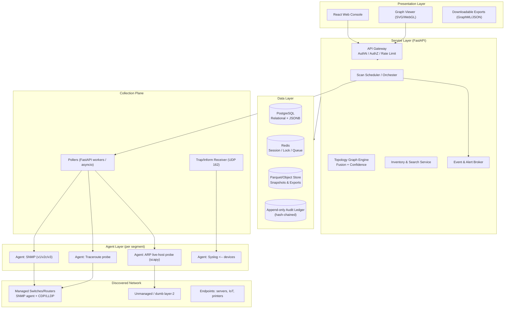
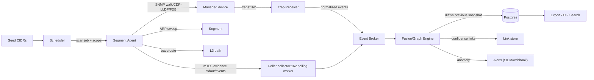
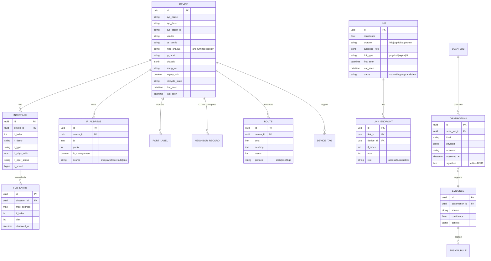

# Network Topology Auto-Mapper

**Complete architecture for automatic network topology discovery and mapping built on SNMP, ARP, and traceroute, with OWASP Top 10 (2025), NIST CSF 2.0, and ISO/IEC 27001:2022 security requirements embedded at every layer.**

> Reference stack: **Python 3.12 + FastAPI** (mapper server), **scapy/arp-scan** + **pysnmp/aisnmp/pysnmp** agents (discovery), **PostgreSQL + Redis**, **React** (UI), **Docker + K8s** deployment.
> The design is language-agnostic at the architectural level; the stack is a reference implementation.

---

## Table of Contents

1. [Executive Summary](#1-executive-summary)
2. [Goals, Non-Goals, and Assumptions](#2-goals-non-goals-and-assumptions)
3. [Architecture Overview](#3-architecture-overview)
4. [Discovery Sources and Plane](#4-discovery-sources-and-plane)
5. [Component Architecture](#5-component-architecture)
6. [Discovery Pipeline & Data Flow](#6-discovery-pipeline--data-flow)
7. [Domain Data Model](#7-domain-data-model)
8. [Topology & Graph Engine](#8-topology--graph-engine)
9. [Security Architecture](#9-security-architecture)
10. [OWASP Top 10:2025 Control Mapping](#10-owasp-top-10-2025-control-mapping)
11. [NIST CSF 2.0 Mapping](#11-nist-csf-20-mapping)
12. [ISO/IEC 27001:2022 Annex A Mapping](#12-isoiec-270012022-annex-a-mapping)
13. [Layer-by-Layer Security Controls](#13-layer-by-layer-security-controls)
14. [API & Application Security Design](#14-api--application-security-design)
15. [Logging, Monitoring & Detection](#15-logging-monitoring--detection)
16. [Incident Response for the Mapper Itself](#16-incident-response-for-the-mapper-itself)
17. [Deployment Architecture](#17-deployment-architecture)
18. [Hardening Checklist](#18-hardening-checklist)
19. [References](#19-references)

---

## 1. Executive Summary

The **Network Topology Auto-Mapper (NTM)** continuously discovers network devices, interfaces, subnets, and inter-device links by combining three independent evidence sources:

| Source | Type | What it reveals |
|---|---|---|
| **SNMP** (v1/v2c/v3) | Pull + Trap (push) | Device inventory, interfaces, IPs, MAC/FDB tables, routing tables, CDP/LLDP neighbors, ARP tables of managed devices |
| **ARP** (L2 broadcast probing) | Pull | Live hosts on a segment — MAC/IP bindings from agent vantage points |
| **Traceroute** (ICMP/UDP probes) | Pull | L3 path hops and cross-subnet connectivity |

Each source is a *partial, noisy view*. The **Topology Graph Engine** fuses them with **confidence scoring and conflict resolution** to produce a single, queryable topology graph: devices as nodes, physical/logical links as edges.

**Security posture.** This is a network reconnaissance tool, which means it holds *high-privilege credentials* (SNMP community strings / USM users, API tokens) and *sensitive infrastructure data* (IPs, MACs, firmware versions, hostnames, routing tables). Its compromise is a stepping-stone into the production network. Security is therefore **not an add-on**: every layer — network, transport, application, data, code, and operations — carries explicit controls mapped to the three frameworks. The table below is the top-level traceability matrix.

| Asset / Layer | Primary OWASP 2025 | Primary NIST CSF 2.0 | Primary ISO 27001:2022 |
|---|---|---|---|
| Agent ↔ Mapper TLS channel | A02 Crypt. Failures | PR.DS | A.8.20 / A.8.24 |
| SNMP v3 USM credential cache | A02, A07 AuthN | PR.AA | A.5.17 / A.8.5 |
| API (RBAC, MFA, scopes) | A01 Access Ctl | PR.AC | A.5.15 / A.5.18 |
| Scan target validation | A10 SSRF | ID.AM | A.8.3 / A.8.20 |
| Graph/database queries | A03 Injection | PR.DS | A.8.28 |
| Secrets (KMS/Vault) | A07 AuthN | PR.PS | A.8.13 / A.5.17 |
| Supply chain (SBOM) | A06 Vuln Comp | PR.PS | A.5.21 |
| Audit logging | A09 Logging | DE.CM | A.8.15 / A.8.16 |
| Config hardening | A05 Misconfig | PR.PS | A.8.9 / A.8.20 |
| DR / backup of topology | A04 Insecure Design | RC.RP | A.8.13 / A.8.14 |

---

## 2. Goals, Non-Goals, and Assumptions

### 2.1 Goals

- **Autonomous discovery** of L2/L3 topology with zero manual device entry after bootstrap (`seeds`).
- **Multi-vendor coverage** (Cisco, Juniper, Arista, HPE, MikroTik, Linux, Windows, printers, UPS, IoT) via standard MIBs (MIB-II, IF-MIB, BRIDGE-MIB, Q-BRIDGE-MIB, LLDP-MIB, ENTITY-MIB, IP-MIB) and CDP/LLDP parsing.
- **Event-driven refresh**: SNMP cold/warm-start traps, linkUp/linkDown, ifIndex changes, and CDP/LLDP trap engines trigger incremental graph updates — not only periodic polling.
- **Distributed observation points**: pure SNMP cannot see unmanaged switches, dumb hubs, and L2 segments without an agent. ARP-scanning agents on each segment fill that gap.
- **Queryable, exportable output**: REST/GraphQL API, drag-and-drop UI, and JSON/GraphML/OTEL exports.
- **Security built in**, evidenced by traceability to OWASP Top 10:2025, NIST CSF 2.0, and ISO/IEC 27001:2022 (Annex A/5, 6, 7, 8).

### 2.2 Non-Goals (v1)

- Configuration management / change push to devices (read-only collectors only).
- Performance monitoring beyond reachability/latency (no full NetFlow integration).
- Wireless controller deep integration (LLDP/CDP covers basic meshing).
- Cloud VPC topology (external integrands via `VpcMapper` plugin interface).

### 2.3 Assumptions

- Operators hold **legitimate authorization** to scan the target range and are compliant with local law (e.g., EU NIS2, US laws) and telecommunication regulations. **The tool MUST ship with a mandatory authorization attestation gate** (see §9.8).
- Mapper server and agents run on managed, hardened hosts provisioned via correlates (Ansible/Terraform).
- SNMP v3 is supported by modern devices; v2c legacy support is opt-in and flagged as high risk.

---

## 3. Architecture Overview

### 3.1 Layered Logical Architecture



### 3.2 C4-ish Component View (L1)

```mermaid
flowchart LR
    USR["Operator"] -->|HTTPS| GW["API GW / Reverse Proxy<br/>(Auth, WAF, TLS term)"]
    AGTW["Agent (per network segment)"] -->|mTLS, JWT| GW
    GW --> API["Mapper API (FastAPI)"]
    API --> AUTH["Identity/AuthZ Service<br/>(OIDC/OAuth2, MFA, RBAC)"]
    API --> JOB["Scheduler + Job Queue (Redis/BullMQ)"]
    JOB --> POL["Pollers"]
    POL -->|SNMP (161) / NETCONF-less pulls| DEV["Managed devices"]
    TRAPR["Trap Receiver :162"] -->|events| API
    POL --> AGENT["Segment Agents<br/>(ARP + traceroute)"]
    API --> DB[(Postgres)]
    API --> AUD[("Audit Ledger<br/>(hash-chained)")]
    API --> VAULT["Vault/KMS<br/>(secrets, SNMP v3 keys)"]
```

---

## 4. Discovery Sources and Plane

### 4.1 SNMP (Pull)

- **Transport**: UDP 161/162. `asyncio` UDP for high concurrency; request timeouts and retry with jitter to avoid `SNMP trap storms` on the segment.
- **Versions**:
  - **SNMPv3 USM** (default): SHA-2 auth (HMAC-SHA-256), AES-256-CBC/AES-192/AES-128 priv. Never fall back to DES/NoPriv by default.
  - **SNMPv2c**: community string, sent over the encrypted agent↔mapper channel only, flagged `legacy_risk=true` in inventory.
  - **SNMPv1**: disabled by default.
- **Key OIDs harvested**:

| Category | MIB / OID family |
|---|---|
| System | MIB-II `1.3.6.1.2.1.1` (sysDescr, sysName, sysObjectID, sysLocation, sysUpTime, sysContact) |
| Interfaces | IF-MIB `1.3.6.1.2.1.2.2` (ifIndex, ifDescr, ifType, ifPhysAddress, ifOperStatus, ifSpeed) |
| Layer-3 | IP-MIB `1.3.6.1.2.1.4` (ipAddrTable, ipRouteTable), `1.3.6.1.2.1.4.21` (ipNetToMediaTable = ARP of device) |
| Layer-2 bridge | BRIDGE-MIB `1.3.6.1.2.1.17` (dot1dBasePortIfIndex `1.3.6.1.2.1.17.1.4`, dot1dTpFdbTable `1.3.6.1.2.1.17.4.3` — FDB gives MAC→port, the canonical edge evidence) |
| CDP/LLDP | LLDP-MIB `1.0.8802.1.1.2` (lldpRemTable), CISCO-CDP-MIB `1.3.6.1.4.1.9.9.23` |
| Physical entity | ENTITY-MIB `1.3.6.1.2.1.47` (chassis, module, serial) |
| VLAN | Q-BRIDGE-MIB `1.3.6.1.2.1.17.7` |

- **Discovery strategy**: recursive BFS. Seed = seed IP(s)/CIDR → SNMP walk → read `sysDescr` + neighbors via CDP/LLDP/FDB → add newly learned devices to frontier. Depth limit + node budget enforce safety (§9.4).

### 4.2 SNMP Traps (Push)

- Receiver binds UDP **only on the agent/mapper interface** (not 0.0.0.0), with DDoS-tolerant capacity.
- Handled trap families: `coldStart`/`warmStart`, `linkDown`/`linkUp`, `ifIndexChange`, LLDP/Cisco syslog-embedded traps. Traps only trigger a **targeted re-poll** of the affected device, not a full rescan.

### 4.3 ARP (Agent-side, L2)

ARP probing requires L2 adjacency; therefore, **agents placed on each routed segment** run:

- `arp-scan` / scapy ARP-request sweep of the resident CIDR (rate-limited; e.g., 100–200 pps to avoid CAM-table DoS on unmanaged switches).
- Captures **live MAC↔IP bindings**, hostnames via reverse DNS (guarded), and per-MAC OUI inference.
- Distinguishes online host rails from stale/cached entries; drops repeat entropy.

Safety: MAC address **masking** at ingestion for non-operator roles (§13.2), and per-subnet pause/window control.

### 4.4 Traceroute

- ICMP/UDP traceroute (`traceroute`, `scapy`, or the `scapy` `traceroute()`) from agents, probing seeds and asymmetric-path validation.
- Use UDP probes with increasing TTL; ICMP if permitted. Timeouts, max hops (e.g., 30), and per-command egress constraints.
- Output parsed into hop lists; hops cross-checked against SNMP `ipRouteTable` next-hops to distinguish transit routers from appliances that answer at L3.

### 4.5 Evidence Fusion Contract

Every observation is a **fact with provenance**, not a truth:

```json
{
  "kind": "LINK_CANDIDATE",
  "source": "lldp-rem-table",
  "observer": "agent-us-east-01",
  "left":  {"device_id": "sw-1", "ifIndex": 28, "mac": "00:1c:…", "port_label": "Gi0/28"},
  "right": {"device_id": "sw-2", "ifIndex": 1,  "mac": "00:1c:…", "port_label": "Gi0/1"},
  "confidence": 0.95,
  "observed_at": "2026-09-18T08:00:00Z",
  "vlan": 100
}
```

---

## 5. Component Architecture

### 5.1 Segment Agents (`agent` + polling sidecar)

- Small footprint container; **zero local state** (stateless against DB; persists only a local spill buffer with encrypted-at-rest spill).
- Identity: signed CSR at bootstrap; **mTLS client certificate** (short-lived, auto-rotated).
- Scope isolation: each agent holds an **allowlist of reachable CIDRs** it may probe/SNMP-walk; cannot re-target off-scope.
- Capabilities: SNMP walker, ARP sweeper, traceroute executor, trap forwarder (UDP 162 on agent side → mTLS to mapper), syslog forward.
- Re-poll cache: in-RAM `{oid, snapshot, hash}` to emit change-deltas only.

### 5.2 Mapper Server components

| Component | Responsibility |
|---|---|
| **API Gateway** | TLS termination, WAF rules, authN (OIDC + MFA), authZ (RBAC/ABAC), rate limiting, request schemas |
| **Scheduler** | Distributes scan jobs to agents/pollers; cron + event-triggered; respects device budgets & quiet hours |
| **Trap/Event Broker** | Normalizes traps/syslog → `DiscoveryEvent`; dedupes; routes to Graph Engine incrementals or alerts |
| **Graph/Fusion Engine** | Multi-source evidence fusion, identity resolution, confidence-scored edge creation, cycle flattening, diffing (see §8) |
| **Inventory & Search** | Query API over Postgres materialized inventory + full-text search + GraphQL gateway |
| **Export Service** | GraphML/JSON/OTel traces; redaction aware (§13.4) |
| **AuthZ / Secrets** | OIDC RP, policy decision point (PDP: OPA or Rego), Vault client, KMS envelope decryption of SNMP creds |

### 5.3 Data stores

- **PostgreSQL 16**: relational inventory + JSONB raw observations; TTL policy; partitioned by time.
- **Redis**: distributed locks (one scan per device/agent), job queue, sessions, metadata cache.
- **Object store (S3/MinIO)**: immutable scan snapshots (Parquet), topology exports, trap archives.
- **Hash-chained audit ledger** (§15.3): cryptographic chaining of irreversible events.

---

## 6. Discovery Pipeline & Data Flow



**Pipeline stages & security interception points:**

1. **Authorize** — operator role check; scope and quiet-hour policy check; attestation gate (§9.8).
2. **Allocate secrets** — decrypt SNMP v3 user/keys for the *target only*, in memory, from Vault; never logged (§14.4).
3. **Probe (agent)** — mTLS-scoped, rate-limited, allowlisted CIDRs only.
4. **Validate/normalize** — schema validation; OID allowlist; cast sanitization; reject malformed trap envelopes (anti-DoS).
5. **Fuse (graph engine)** — identity resolution, conflict policy, confidence threshold.
6. **Persist** — write-ahead to Postgres TX with row-level encryption column defaults (§13.2); append to audit ledger.
7. **Diff & publish** — new link/device/changed-role events → alerting; notify subscribers (webhook, SIEM OCSF/CEF).
8. **Export** — redacted, signed exports (§13.4).

---

## 7. Domain Data Model



**Entity hardening notes**: `mac_sha256(default-role)` computed store for anonymized identity; raw MACs are `MASKED` and access-controlled (§13.2). No third-party device credentials stored outside Vault.

---

## 8. Topology & Graph Engine

### 8.1 Identity resolution

- Devices matched across sources by: primary `ipAddr` → `ifPhysAddress` OUI+index → LLDP/C DP `chassis-id` (MAC/serial) → `sysName`. Conflict policy: majority-confidence wins; ties → `candidate` status requiring post-reconciliation (never auto-merge under conflict).
- FDB learn: one MAC observed *behind two different ports* = link evidence (dedupe ports to unique MAC-per-port rule to avoid over-meshing).

### 8.2 Edge construction & confidence

```
edges:
  LLDP/C DP explicit neighbor   -> conf 0.98
  FDB port A -> port B (MAC seen on both) -> conf 0.90 (dedup/reconcile)
  ARP binding two devices + no switch evidence -> l3 edge conf 0.6
  traceroute hop adjacency      -> l3 edge conf 0.5 (transit)
  inference ("unknown switch" between two ports) -> conf 0.3 (dashed)
```

Thresholds configurable; UI renders dashed edges for low-confidence candidates.

### 8.3 Graph lifecycle

- **Snapshot** per full scan cycle (immutable, versioned).
- **Incremental diff** on traps/events → **delta link set**; CDC streams to subscribers.
- **Flapping detection**: link toggling > N signatures/interval → alert + quarantine from canonical graph.
- **Pruning**: `last_seen` stale rule (TTL) removes ghost devices; tombstone + history retained in ledger for forensics.

### 8.4 Security properties of the engine

- Runs with **no network egress** (Postgres/Redis only); graph computation cannot trigger scans (prevention of algorithmic-driven SSRF).
- Deterministic fusion under Rego policy: administrative claim vs. evidence-based claims are typed so UI cannot invent edges.

---

## 9. Security Architecture

### 9.1 Security-by-design principles

1. **Least privilege & least scope** — agents and pollers hold credentials scoped to the subnets they own; the API can never read a secret in cleartext.
2. **Zero trust channel** — every inter-process link is mTLS with short-lived certificates; never plaintext SNMP community strings between mapper and devices (agent-side encryption at edge).
3. **Faithful audit** — all discovery "side effects" are logged to an append-only hash-chained ledger.
4. **Fail closed on ambiguity** — unknown destination = blocked; unverifiable identity = denied; malformed probe = dropped.
5. **Redact-first data** — PII/identifying data (MAC, IP labels for low roles, sysContact/name) masked/down-sampled by default.
6. **Security controls in the same repo as features** — CI gates, threat-model-as-code, SBOM required for merge.

### 9.2 STRIDE threat model (component-level)

| Component | Spoofing | Tampering | Repudiation | Info Disclosure | DoS | Elevation |
|---|---|---|---|---|---|---|
| Segment agent | fake agent joins via weak bootstrap | poisoned scan results → fake topology | no per-job signatures → blame lost | agent compromise dumps subnet data | scan saturation of CAM/CPU | agent→mapper API token reuse |
| Mapper API | forged JWT/OIDC session | record tampering via SQLi | UI edits unlogged | bulk inventory exfil | unauthenticated flood | RBAC bypass → admin graph writes |
| Graph engine | spoofed LLDP chassis-id "self-declaring" topology | evidence forged in transit | mutation of graphs not attributable | cross-tenant inventory leakage | graph computation blowup | fabricated device → privileged workflow |
| DB | cred theft post-recon | CVE row tampering | no audit | SNMP creds (bad) | connection exhaustion | DB superuser |
| Trap receiver | spoofed trap source (129.8) forging events | trap payload injection | — | — | trap flood (DoS) | trap trigger → privileged rescan |
| Data exports | spoofed export consumer | export tampering in transit | — | GraphML leaks MACs/hostnames | giant export DoS | — |

### 9.3 Security trust boundaries (kill chain view)

```mermaid
flowchart LR
    B["Boundary 1: Internet / DMZ"] -->|mTLS + WAF + AuthN| G["Gateway"]
    G -->|Boundary 2: App| A["API"]
    A -->|Boundary 3: Data| D["DB / Ledger"]
    A -->|Boundary 4: Collection| P["Pollers"]
    P -->|Boundary 5: Segment Agents (net wall)| AG["Agents"]
    AG -->|Boundary 6: Discovered devices| DEV["Network"]
    V["Vault/KMS"] -.->|Boundary 3b: Secrets plane| A
    SIEM["SIEM / Alerting"] -.->|outbound only| A
```

Each boundary is a **deny-by-default ACL + mTLS + monotonic logging point**. Detection sensors (HIDS, WAF, honeypot trap sinkhole) sit at boundaries 1, 4, 5.

### 9.4 Scope & SSRF containment (OWASP A10)

This tool's core purpose is reaching internal network resources — **it is high SSRF surface by nature**. Containment:

- **Target source segmentation**: (a) scanning targets come only from operator-owned `seed` config or SNMP-learned devices — *never* replay client-supplied IPs into scan jobs. (b) API "scan this URL" accepts **only** name-keys into predefined scope.
- **Scope allowlists** at mapper (global) and agent (segment) with `Deny: 169.254.0.0/16, 100.64.0.0/10, 127.0.0.0/8, metadata services 169.254.169.254`, and cloud metadata egress blocked at the agent network policy level.
- **Per-scope rate/budget** (hops, node budget, pps, window) — prevents rebounding amplification and network DoS.
- **DNS pinning**: probes resolve once, dial to resolved IP only; no follow redirects on internal HTTP integrations.
- **Egress proxy** (CSP/or first-hop firewall) with explicit allow CIDRs for agent outbound.

### 9.5 Credential and secrets lifecycle

- SNMP **community strings** and **v3 USM passphrases** stored **only** in Vault (transit + enveloper KMS); mapper holds zero plaintext.
- Agent receive materialized credential **per-job, in-memory, TTL-scoped** (e.g., 15 min); wiped after; never persisted to disk or spill.
- Rotation automation: on rotation window, Mapper asks Vault `rotation_schedules`; agents re-pull. Traps referencing old creds → degraded-flag metric + P1 if > N.
- **No credential defaults**: UI blocks empty/`public` community storage; `community` sniffing guard warns.

### 9.6 Identity & access (A01/A07)

- **AuthN**: OIDC/OAuth2 with **mandatory MFA** (WebAuthn passkeys ≥ 1), session 15-min idle timeout, device binding, refresh-token rotation w/ reuse detection.
- **AuthZ**: RBAC roles — `viewer` (redacted graph), `operator` (run scans in scope), `admin` (config, users, credentials), `auditor` (read-only audit ledger). ABAC claims (scope = static CIDR set, VLAN, site) refine at query time via OPA/Rego (PDP). Deny-by-default; no blanket `*`.
- **Agent identity**: SPIFFE/SPIRE SVIDs (mTLS), TLS 1.3 only, `requireClientCert` everywhere.

### 9.7 Data protection

- **At rest**: DB volume encryption (KMS), column-level `pgcrypto` for masked columns; Parquet snapshot SSE-KMS; backup encryption AES-256.
- **In transit**: TLS 1.3 (ideal) / 1.2 (min) with strong suites; SNMP v3 USM auth+priv; agent→mapper mTLS; Redis TLS; Postgres TLS.
- **PII handling** (A.5.34 / A.8.11): MAC addresses and hostnames are `MASKED == sensitive`; `viewer` role sees hash-only identities; `operator` sees full. Data retention policy (default 180 d) enforced by purge task fencing (no backups resurrect PII beyond TTL is guaranteed via crypto-shredding with per-tenant keys).
- **Key management**: KMS envelopes; per-tenant data keys; monthly rotation; HSMs optional at scale.

### 9.8 Authorization attestation / legal gate

- First-run and periodic/reoccuring banner: operator must assert **written authorization** to scan the ranges, context-readable audit event `legal_attestation` stored before any probe.
- Export and scan jobs embeds `attestation_id`; audit queries join on it.

---

## 10. OWASP Top 10:2025 Control Mapping

| OWASP 2025 | Mapper-specific risk | Control location |
|---|---|---|
| **A01 Broken Access Control** | RBAC bypass → mass export; viewer sees raw MACs; agents escalate | §9.6 PDP (OPA/Rego), scoped agent tokens, per-role field masking, deny-by-default PDP, `Object-level` scanning guarded by scope allowlist |
| **A02 Cryptographic Failures** | Community strings in cleartext logs; TLS fallback; weak MIB data at rest | §9.5/§9.7 Vault/KMS, TLS1.3 everywhere, pgcrypto, AES-256 at rest, no DES/NoPriv SNMP path |
| **A03 Injection** | SQLi via search/GraphQL; OID/`ifIndex` splicing into SNMP walks; shell injection in traceroute args | parameterized queries (SQLAlchemy/psycopg3), typed GraphQL (no raw strings), **never shell-out SNMP/traceroute** (library-only: `pysnmp`, `scapy`), OID allowlist filter §14.3 |
| **A04 Insecure Design** | Re-scan loops, autoscale graph explosion, self-referential traps, silent default scope | Threat-model-as-code (mapped §9.2), scope budgets §9.4, event dedupe §5, design review gate in CI |
| **A05 Security Misconfiguration** | Default SNMP community, permissive ACLs, debug endpoints, wokered base images | Hardened images (distroless, non-root), CIS-benchmark agent host config, ConfigMap deny-defaults, `securityContext` in K8s, `kube-bench`-style gate |
| **A06 Vulnerable & Outdated Components** | pysnmp/scapy/CVEs; base OS; node deps | SBOM (CycloneDX) + `trivy`/`pip-audit`/`osv-scanner` gating §13.7, patched-base policy, image digest pinning, CVE SLA |
| **A07 Identification & AuthN Failures** | Weak/rotating-reuse tokens; USM pass in config; no MFA | §9.6 MFA/WebAuthn, refresh rotation + reuse detection, SNMP v3 USM SHA/AES mandatory policy, Vault TTL creds |
| **A08 Software & Data Integrity Failures** | Malicious agent build; tampered scan snapshots; MITM of exports | Signed CI artifacts + Sigstore, immutable snapshots w/ S3 Object Lock, export signing (§13.4), docker `Cosign` image signing, hash-chained audit §15.3 |
| **A09 Logging & Monitoring Failures** | Silent credential misuse; missed trap flood; undetected exfil of graph | §15 full: OCSF event schema, correlation rules, SIEM forward, alert on bulk export volume, failure-to-log default-block in pipeline |
| **A10 Server-Side Request Forgery** | "scan this" = reboot of RF; metadata probing; user-supplied traceroute targets | §9.4 scope allowlists, deny-metadata CIDRs, evidence-only graph triggers (no user-value→scan echo), DNS pinning, egress proxy |

---

## 11. NIST CSF 2.0 Mapping

NIST CSF 2.0 is organized in **six Functions** — Govern, Identify, Protect, Detect, Respond, Recover. Implementation here:

| CSF 2.0 Function | CS category | Where implemented |
|---|---|---|
| **GOVERN** | GV.OC organizational context; GV.PO policies; GV.SC supply chain | Security policy §9.1; roles/RACI §9.6; vendor/SBOM §13.7; authorized-scan attestation §9.8; control baseline chosen = ISO 27001:2022 Annex A (§12) |
| **IDENTIFY** | IM asset mgmt; RA risk assessment; | IM = core function of the tool! inventory/graph = the asset register feed; RA = threat model §9.2 + DREAD-scored risks in `sec-risk.md` |
| **PROTECT** | PR.AA identity/access; PR.A training; PR.DS data security; PR.PS platform security; PR.IR tech resilience | AuthN/Z §9.6; encryption §9.7; secrets §9.5; agent/DB hardening §17; resilience §16.2 (multi-AZ, backups) |
| **DETECT** | DE.CM continuous monitoring; DE.AE anomaly | §15 SIEM integration, trap/event correlation, ARP-scan frequency anomaly rules, WAF logs, HIDS on agents |
| **RESPOND** | RS.MA incident mgmt | §16 IR runbook: containment plan for compromised agent/credential, forensic snapshot preservation |
| **RECOVER** | RC.RP recovery planning, RC.RCO reconvocation | §16.2: restore graph from immutable snapshot, regenerate from seed in < 4h, DR drills |

> CSF Profile choice: this system targets **CSF Tier 3 (Risk-Informed)**, tracked quarterly.

---

## 12. ISO/IEC 27001:2022 Annex A Mapping

Controls cited from Annex A. Requirement attribution: Statement of Applicability template in `soa-v1.0.md` (maintained in this project).

| Annex A control | Where in NTM |
|---|---|
| **A.5.1** Policies for IS | Sec-ISO policy doc; owner CISO; annual review |
| **A.5.8** IS in project mgmt | Security MDD + threat-model-as-code in CI pre-merge |
| **A.5.15/A.5.16/A.5.17/A.5.18** Access control, identity, authentication info, access rights | §9.6 OIDC+MFA RBAC/ABAC, Vault creds, joiner-mover-leaver workflow with monthly recert |
| **A.5.19–A.5.21** Supplier/cloud security, ICT supply chain | SBOM+vuln gate §13.7, cloud CSP self-assessment review, CSI: minimal blob storage access |
| **A.5.24–A.5.28** Incident mgmt & evidence | §16 IR runbook; forensic image agent host; evidence collection checklist; lessons-learned |
| **A.5.33** Protection of records | Retained audit ledger ≥ 2 yrs; export signing; tamper evident |
| **A.5.34** Privacy & PII | §13.2 masking; retention purge; DPO notification path (EU) |
| **A.6.1/A.6.6** Screening / NDA | People control for admins & agents operators |
| **A.7.x** Physical | Agents VMs colocated at secure sites; no removable media; clear-screen for console |
| **A.8.1** User endpoint devices | Central mgmt for consoles; MDM baseline |
| **A.8.2** Privileged access rights | Break-glass roles, PAM/JIT elevation, every elevation logged |
| **A.8.3** Limiting information exposure | Field-masking §13.2, dashboards default-redacted |
| **A.8.5** Secure authentication | MFA, FIDO2, SNMP v3 SHA/AES, key length policies |
| **A.8.6** Capacity mgmt | Probe budget, pps curves, Postgres autoscale, Redis monitoring |
| **A.8.7** Malware protection | HIDS + EDR on mapper & agents |
| **A.8.8** Technical vuln mgmt | Trivy/osv-scanner CI + prod-scan + SLA patching |
| **A.8.9** Configuration management | IaC (Ansible/Terraform) + `kube-bench`/CIS gates |
| **A.8.10** Information deletion | Purge job + crypto-shred data keys on TTL |
| **A.8.11** Data masking | pgcrypto masked columns, role-dependent output |
| **A.8.13** Information backup | Daily encrypted backup; restore drill quarterly |
| **A.8.14** Redundancy of processing facilities | Multi-AZ mapper+DB, agents N+1 |
| **A.8.15/A.8.16** Logging / monitoring | OCSF pipeline → SIEM, alert rules §15 |
| **A.8.17** Clock synchronization | NTP everywhere (needed for trap correlation) |
| **A.8.20/A.8.21/A.8.22** Networking security, network services, network segregation | DMZ gateway, mTLS segments, VPC subnet isolation for agent vs data plane |
| **A.8.24** Use of cryptography | KMS, TLS1.2+, AES-256, key rotation program |
| **A.8.25–A.8.31** SDLC / secure coding / testing / outsourced dev | §13.7 SDLC: SAST (Semgrep), DAST, dependency gate, separate build/stage/prod environments |

---

## 13. Layer-by-Layer Security Controls

### 13.1 Network layer

- Dedicated segments: agents in **collection VPC/site per region**; mapper in private app subnet; DB in private data subnet; no direct DB↔agent path.
- Egress firewall per agent = allowlist of its scan CIDR + mapper CIDR only.
- DDoS defense at gateway + trap receiver (SYN/UDP flood → anycast + rate limit).
- NTP sync across all nodes (trap timing integrity).
- Disable ICMP echo responses on agents (reduce network mapping surface).

### 13.2 Data layer

- Column `pgcrypto` for `mac_raw`, `hostname_raw`, `sys_contact`; application reads masked by role.
- **RBAC on schema**: `viewer=graph_hash_only`, `operator=masked-mac+IP`, `admin=raw`. Enforced in query layer (ORM scoping), not UI.
- Retention purge with **crypto-shred**: on TTL, delete tenant data key from KMS → data irrecoverable.
- Immutable snapshot objects: S3 Object Lock (compliance mode); exports have `X-Content-Signature`.

### 13.3 Application layer

- MFA-enabled OIDC; RBAC/ABAC via OPA; parameterized SQL; GraphQL depth/aliasing limits (DoS).
- **No auto-scan from client input**: scan endpoints take `scope_id`; scope is server-side referenced.
- Server-side request validation library (allowlist CIDR + DNS-pinning) applied at all "fetch/export URL" features.
- Input validation: max payload size (traps), schema versioning, magic-byte checks for import.
- Security headers (CSP, HSTS, X-Content-Type, CORP frames).

### 13.4 Export layer (GraphML/JSON, OTel export)

- Redaction is **mandatory cascade**: if `viewer` role → MACs→partial-inf(exports) applies; if `operator` without explicit `export:raw` claim, mask remains.
- Exports signed (Ed25519 server key) with nonce+timestamp to prevent replay of stale snapshots; signature rotation; revocation list.
- Rate-limit exports; max rows.

### 13.5 Interface logical — CDP/LLDP sanitizer

CDP/LLDP are **unauthenticated, spoofable protocols** (A04 A10 vector!). Treat all neighbor claims as untrusted input: validate chassis-id format, reject self-loop chassis, apply per-device max-neighbor cap, quarantine devices emitting >N graphs/day (false-topology attack abatement). §13.5.

### 13.6 Operations layer

- Immutable infra via IaC; secrets injected only at runtime; no SSH SSHD exposed from private subnets (ephemeral hops).
- Central backup; quarterly restore drill; DR runbook.
- Change management: any mapper/agent config change is peer-reviewed, logged, and diffable from IaC baseline.

### 13.7 SDLC / supply chain

- CI pipeline: lint → SAST (Semgrep) → DAST smoke → dependency gate (`osv-scanner`, `pip-audit`) → SBOM generation → image build+scan (`trivy`) → sign (`Cosign`) → attest in in-toto.
- Pre-merge policy: 0 critical/high findings; medium within SLA.
- `poetry.lock`/`requirements.lock` pinned + hashed; base images pinned by digest.
- Two-person rule for release tags.

---

## 14. API & Application Security Design

### 14.1 Endpoint inventory

| Method | Path | AuthN | Notes |
|---|---|---|---|
| POST | `/api/v1/scan/start` | operator+scope claim | Starts scoped scan job |
| POST | `/api/v1/scan/{id}/cancel` | operator | Admin override w/ two-person |
| GET | `/api/v1/topology` | viewer+ | Graph, redacted by role |
| GET | `/api/v1/devices/{id}` | operator+ | Raw detail (role-gated) |
| GET | `/api/v1/exports/graphml` | operator+`export` claim | Signed export |
| POST | `/api/v1/webhooks` | admin | Subscriber config; validated URL |
| GET/POST | `/api/v1/audit` | auditor | Ledger reads, no writes |
| POST | `/api/v1/traps/reconcile` | agent (mTLS) | Trap→rescan intent |

### 14.2 Rate limiting & quotas

- Per-user: OIDC token bucket; per-IP: gateway 10 rps; per-agent: 500 rps burst.
- Export quota: e.g., 5 MB / 1 min / user; bulk row cap 100k.
- Session hardening: absolute 8h hard cap; idle 15 min; refresh rotation.
- Rate limiting data source as PII-minimized (no full IP retention > 24h).

### 14.3 Injection defenses (specific)

- **OID injection**: MIB OIDs validated against allowlist regex `^\d+(\.\d+)*$` + length limit (≤ 128) before constructing walks; library call `pysnmp` only, no `subprocess` → `snmpwalk`.
- **Traceroute arg injection**: `traceroute` implemented in-process via `scapy`/`ts = traceroute(...)`; **no** shell string interpolation; hops validated as integer 1–64; targets CIDR-normalized.
- **ARP**: agent uses scapy (`ARP`) or `arp-scan` with `--sourceip` pinned; never `os.system()`.
- **Webhooks**: URL allowlist protocol `https:` only; header injection prevented (CR/LF stripped); outbound fetch uses IP-checked resolvers.
- **GraphQL**: query depth ≤ 8, aliases ≤ 20, complexity budgets; introspection off in prod.

### 14.4 Secrets handling in code

- `SecretStr`/`masked repr` types everywhere; pydantic+`get_secret_value` pattern; default redaction in logs.
- No secrets in env vars beyond bootstrap token; Vault agent injects into process.
- `audit` never logs credential values (only hash `sha256` of credential-id).

---

## 15. Logging, Monitoring & Detection

### 15.1 What to log (OWASP A09 x NIST DE.CM)

- Authentication/authorization decisions (success/failure, role), scan job lifecycle, scope/céd budgets, device changes (before/after hash), credential rotation events, export actions (user, role, rows, hash), trap volume surges, config diffs.
- **Never**: SNMP credentials, session tokens, full raw MACs of masked roles.

### 15.2 Event taxonomy (OCSF-aligned)

`category: discovery, class_uid: topology_event|scan_event|auth_event|config_event|export_event`, correlation fields `observer_ip`, `device_mac_sha256`, `confidence`, `source`.

### 15.3 Tamper-evident audit ledger

- Append-only rows compute `hash(prev_hash, event)` chain; periodic anchoring (write `root` hash to KMS-backed anchor or external trust service).
- Auditor role can verify chain integrity; export ledger chunk signed.
- Separate DB user `auditor` prevents all writes.

### 15.4 Detection rules (SIEM)

1. **Credential misuse**: `materialized_credentials` for target X used from unexpected agent (geo/segment anomaly).
2. **Trap flood**: > N traps/min from one device → severity.
3. **Scope breach**: probe to CIDR outside agent scope (caught at ACL + egress).
4. **Bulk export spike**: > threshold rows export by one user/role.
5. **Agent disappeared** 3 cycles → REMOVED_DISCOVERY coverage warning.
6. **ARP scan frequency anomaly** from a single host (posture of *this* tool's own agent, distinct from attacker).
7. **New device with default community** (credential baseline drift).

### 15.5 Alerting & response

- Critical → PagerDuty/moq webhook + ticket; SLA: P1 15 min, P2 2 h.
- SIEM ship: CEF → Splunk/Qradar/SATO infer; also dead-letter if mapper channel down.

---

## 16. Incident Response for the Mapper Itself

### 16.1 Threat scenarios

| Scenario | TTP hints | Response steps |
|---|---|---|
| Agent compromise | suspected malicious probe from agent IP | revoke SVID, quarantine subnet ACL, snapshot disk (forensics), rotate scope creds, re-provision from IaC |
| Credential dump | Vault breach or misplaced backup | rotate all SNMP/secret keys, alert + retract, forensic imaging, mass trap re-key |
| Topology poisoning | CDP/LLDP garbage-in | graph quarantine of attacker-claimed virtual-mac range, re-run fusion with `friend-only` evidence mode, notify |
| Bulk export exfil | exporter abuse | immediate role kill, token revocation, export-signature invalidation, legal/DPO notice |
| Ransomware on mapper | EDR alert | disconnect from segments, restore from immutable snapshot, DR runbook §16.2 |

### 16.2 Recovery

- Restore from daily encrypted backup + immutable object store; target RTO ≤ 4 h, RPO ≤ 1 h; DB point-in-time-recovery to last redact boundary.
- Graph rebuilt from last immutable snapshot, or full re-discovery from seed (redeploy agent fleet via IaC).
- Quarterly tabletop + restore drill; keep drift metrics.

---

## 17. Deployment Architecture

### 17.1 Topology (Docker / K8s)

```mermaid
flowchart TB
    subgraph Edge["DMZ / Edge"]
        GW["Ingress GW<br/>(WAF, TLS, DDoS)"]
    end
    subgraph AppNS["App namespace"]
        API["Mapper API (HPA x3)"]
        SCH["Scheduler"]
        POL["Poller pool"]
        TRAPR["Trap Rx"]
        GE["Graph Engine"]
    end
    subgraph DataNS["Data namespace / AWS private"]
        PG[("PostgreSQL HA (PITR)")]
        RD[("Redis Cluster")]
        OBJ[("Object Store (Object Lock)")]
        AUD[(("Audit Ledger"))]
    end
    subgraph SecNS["Security plane"]
        VAULT["Vault + KMS"]
        OPA["OPA/Rego PDP"]
        IDP["OIDC IdP (MFA)"]
        SIEM["SIEM"]
    end
    subgraph Sites["Site A / Site B (agents)"]
        AA["Agent fleet (DaemonSet / VM)"]
        AB["Agent fleet"]
    end
    GW --> API
    API --> SCH
    API --> OPA
    SCH --> POL
    POL --> AA
    POL --> AB
    TRAPR --> API
    API --> PG
    API --> RD
    GE --> OBJ
    API --> AUD
    API --> VAULT
    API --> IDP --> GW
    API --> SIEM
```

### 17.2 Infrastructure hardening

- `securityContext`: non-root UID, read-only rootfs, no privilege escalation, `allowPrivilegeEscalation: false`.
- Network policies: deny-all default per namespace; only 443/162 to mapper from agents; agents cannot reach DB.
- Images from private registry (digest-pinned), scanned, signed.
- Infrastructure as Code: Terraform/Ansible; hosts patched autonomically; CIS Baseline; agents run SSM/cloud-init only.
- Node pools: dedicated spot-control nodes for agents; TPM-backed boot.

### 17.3 Capacity / performance notes

- Device scale: 10k devices, 250k interfaces on 3-node API; poller pool sized for ~500 simultaneous SNMP walks.
- ARP sweep pacing per agent: default 200 pps, configurable per site, sliding window.
- Postgres partitioning by `observed_at` and JSONB asymmetric indexes; Redis for lock/queue.

---

## 18. Hardening Checklist

- [ ] TLS 1.3 enforced; weak suites banned; cert rotation via cert-manager/TPM.
- [ ] All inter-process endpoints mTLS (`requireClientCert`).
- [ ] MFA enforced for all interactive users; no MFA bypass tokens.
- [ ] Vault-backed secrets; **zero** SNMP creds in env/files/DB tables.
- [ ] SNMPv3 SHA2+AES policy; v2c flagged legacy with egress-only encrypted channel.
- [ ] Scope allowlists deny metadata/link-local/xRFC1918-external by policy; egress proxy exists.
- [ ] CDP/LLDP trusted-input sanitizer with quarantine capability.
- [ ] RBAC/ABAC deny-by-default; viewer masked; auditor-led audit chain verified.
- [ ] No user-supplied targets can create scans without `scope_id` ref; no dynamic fetch.
- [ ] `pgcrypto` masking columns; retention purge + crypto-shred enabled.
- [ ] Log pipeline (OCSF) → SIEM ship; detection rules §15.4 active.
- [ ] SBOM + vuln gate pass on all images; cosign-signed; digest-pinned.
- [ ] Backup + PITR, quarterly restore drill done.
- [ ] NTP synced; capacity probes budgeted; trap flood protected.
- [ ] Authorization attestation recorded before first probe (legal gate).

---

## 19. References

- OWASP Top 10:2025 — https://owasp.org/Top10/
- OWASP ASVS 4.0 — https://owasp.org/www-project-application-security-verification-standard/
- NIST CSF 2.0 — https://www.nist.gov/cyberframework
- NIST SP 800-53R5 (control mapping for CSF) — https://csrc.nist.gov/pubs/sp/800/53/r5/upd1/final
- ISO/IEC 27001:2022 — https://www.iso.org/standard/27001  (Annex A controls, 93)
- Pysnmp/aisnmp, scapy, arp-scan (reference collection libs)

> **Operational disclaimer.** Only run this tool against networks you or your organization own or have explicit written authorization to scan. Traceroute and ARP probes may be considered intrusive in some jurisdictions; verify regional law (e.g., could be monitored as activity by ISPs). This architecture is a reference design, not legal advice.